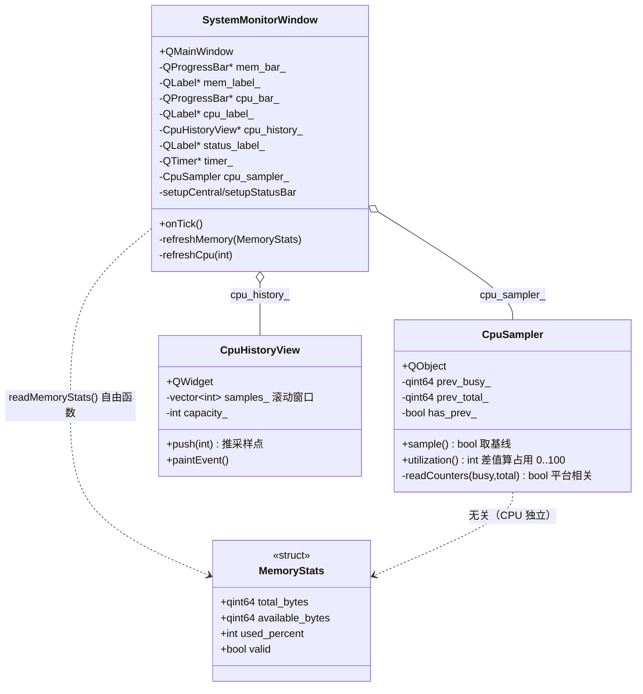
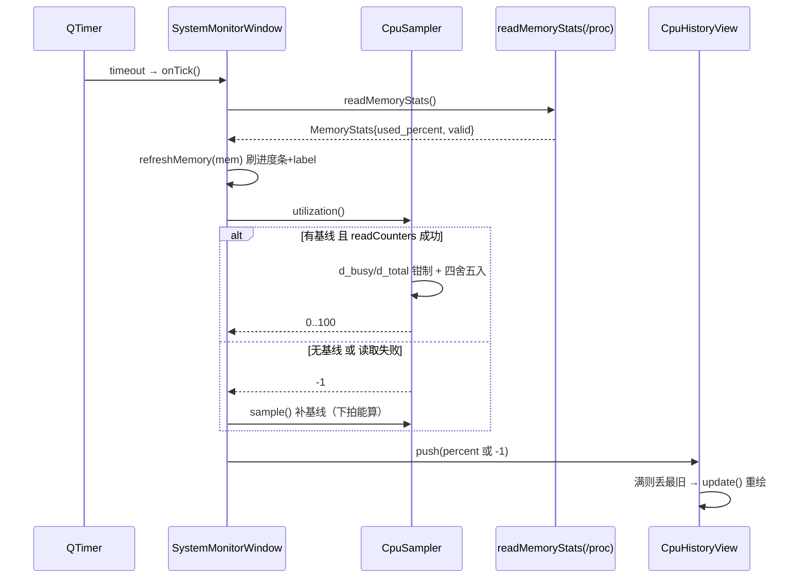

# CPU / Memory Monitor 成品导览

> **source**：`app/04-system-tools/cpu-memory-monitor/`　**related**：app 栏系统工具类整机成品

CPU / Memory Monitor 是 app 栏「系统工具」这一类的整机成品。前面 tetris 讲究「纯自绘画布 + 游戏循环」；这件换一条线——**把 Qt 应用拉到真实操作系统上，读 /proc、调 Win32，把机器当前有多忙画出来**。它的价值不在某个控件多炫，而在把系统监控最容易翻车的几个雷都防住了——**CPU 单次读的是开机累计值不是瞬时占用（必须两次采样差值）、MemAvailable 才是真能用的内存（用 MemFree 会高估占用）、采样间隔太短 CPU% 狂抖、Windows 路径编译隔离但运行时未实跑**——而且把「跨平台系统读取 + 自绘曲线 + QTimer 节拍刷新」这一套 Widgets 系统工具骨架走通。

::: warning ⚠️ Windows 路径尚未验证
本仓库的 offscreen CI 在 Linux/WSL 跑，**只验证了 Linux `/proc/meminfo` + `/proc/stat` 这条路径**。Windows 分支（`GlobalMemoryStatusEx` 读内存、`GetSystemTimes` 读 CPU）**代码已写、编译用 `#ifdef Q_OS_WIN` 隔离（Linux 编译时整段被剔掉、不参与编译），但运行时从未在 Windows 实机跑过**——需要 Windows 实机复验。本导览所有「Windows 路径」的描述均基于代码逻辑推断，未实测。详见 §3 决策②、§5 踩坑②、[troubleshooting](./handbook/troubleshooting.md)。
:::

::: tip 本篇是「成品导览」
想直接用成品 → 看这里（架构 / 决策 / 踩坑 / 怎么读）。
想自己从零搓出来 → 转 [手搓手册](./handbook/)。
:::

## 1. 它做什么

一个实时显示本机内存与 CPU 占用的监控窗口：

- **内存占用**：进度条 + 百分比 + 已用/总量（GB）。Linux 读 `/proc/meminfo` 的 `MemTotal` / `MemAvailable`，Windows 读 `GlobalMemoryStatusEx`
- **CPU 占用率**：进度条 + 百分比。**两次采样差值**算瞬时占用（Δbusy/Δtotal），不是开机累计值
- **CPU 历史曲线**：自绘 QWidget，滚动窗口存最近 60 个采样点，`QPainter` 画折线 + 半透明面积填充 + 25/50/75/100% 参考网格
- **1s 节拍刷新**：`QTimer` 每秒采样一次刷 UI；CPU% 抖动与采样间隔的权衡取 1s
- **无效态降级**：平台不支持（macOS 等）或读取失败时显示 N/A、曲线留缺口，不崩、不留哑数据

跑起来看一眼（Linux/WSL）：

```bash
cmake -B build -S app && cmake --build build
./build/04-system-tools/cpu-memory-monitor/demo/cpu_memory_monitor_demo
```

## 2. 架构总览

### 类关系

整机四个类：`SystemMonitorWindow`（QMainWindow，装配 + QTimer 1s 节拍 + 刷新）+ `CpuSampler`（QObject，CPU 占用率状态机，存上次基线计数、两次采样差值）+ `CpuHistoryView`（自绘 QWidget，滚动窗口曲线）+ 自由函数 `readMemoryStats()`（一次性内存快照）。`MemoryStats` 是 POD 结构体。窗口每秒 tick 时调 `readMemoryStats()` 拿内存、`cpu_sampler_.utilization()` 拿 CPU% —— **CPU 是有状态采样器（要存基线），内存是无状态快照（每次现读）**，这是两者最根本的区别。



### 文件职责

| 文件 | 职责 |
|---|---|
| `demo/system_stats.h` | 系统读取接口：`MemoryStats` 结构体 + `CpuSampler` 类（CPU 状态机）+ `readMemoryStats()` 自由函数；头注释讲清 4 条关键设计（内存走 MemAvailable、CPU 两次采样、`#ifdef` 平台分发、未覆盖平台 fallback） |
| `demo/system_stats.cpp` | 系统读取实现：内存 `/proc/meminfo` 解析（`parseKib` helper）+ Win32 `GlobalMemoryStatusEx`；CPU `/proc/stat` aggregate 行解析（user+nice+system+irq+softirq+steal+iowait = busy）+ Win32 `GetSystemTimes`（kernel 含 idle 故 busy=kernel-idle+user）；`sample()`/`utilization()` 差值逻辑 + 钳制防御 |
| `demo/cpu_history_view.h` | 历史曲线接口：滚动窗口 `std::vector<int>` + `capacity_`，`push()`/`paintEvent()`/`sizeHint()` |
| `demo/cpu_history_view.cpp` | 历史曲线实现：深色底、25/50/75/100% 点状参考网格、按「连续有效段」分组画折线 + 半透明面积填充（缺口处折线与填充一起断开）、边框；窗口未满也横向铺满 |
| `demo/system_monitor_window.h` | 主窗口接口：6 个控件指针 + `cpu_sampler_` 成员 + `onTick` slot；头注释讲清「CPU 要差值故构造时先 sample 基线、1s 间隔、不开 PreciseTimer」 |
| `demo/system_monitor_window.cpp` | 主窗口实现：QVBoxLayout 装 Memory/CPU 两个 QGroupBox + 进度条/label/曲线；QTimer 1s `timeout`→`onTick`；`onTick` 读内存 + CPU%（-1 时补 sample 重建基线）；`formatGb` helper 字节→GB；`refreshMemory`/`refreshCpu` 无效态降级 |
| `demo/main.cpp` | 入口：设 applicationName + 主窗口 show |
| `demo/CMakeLists.txt` | 工程配置——`qt_add_executable` + 链 `Qt6::Widgets`；`if(WIN32)` 才链 `kernel32`（Linux 编译时 Windows 代码被 `#ifdef` 剔掉，此链接不触发）；`WIN32_EXECUTABLE ON` 不弹控制台 |

### 一个采样周期怎么走



重点：**CPU% 是有状态差值**——`utilization()` 内部已滚动基线（本次读数→下次的 `prev_`），故 `onTick` 每拍只调它一次；返回 `-1`（基线丢失或本次读取失败）时补一次 `sample()` 重建基线，保证下一拍能算出差值。内存是无状态快照，每拍现读。

## 3. 关键设计决策

**① CPU 占用率必须两次采样差值，不能单次直读。**
`/proc/stat` 第一行是 aggregate（所有核合计）的**开机以来累计** jiffies 计数，单次读到的是「从开机到现在 CPU 累计忙了多少」，不是「现在这一刻 CPU 多忙」。正确做法：`sample()` 存一次基线（`prev_busy_`/`prev_total_`），隔 ≥ 几百毫秒后 `utilization()` 再读一次，用差值 `Δbusy/Δtotal` 算这段时间窗的占用率。窗口构造时先 `sample()` 拿基线，第一个 tick 才有有效值。(`system_stats.cpp:100-113`、`115-139`、`system_monitor_window.cpp:37`、`45`)

**② 内存用 `MemAvailable` 而非 `MemFree`，跨平台走 `#ifdef` 分发，未覆盖平台 fallback。**
`MemFree` 是完全空闲的内存，Linux 会主动把空闲内存拿去做 buffer/cache，用 `MemFree` 算占用会把缓存当成占用，**高估占用率**。`MemAvailable`（3.3+ 内核）含可回收的 buffer/cache，才是「真正能用的内存」。Windows 走 `GlobalMemoryStatusEx` 的 `ullAvailPhys`（`dwMemoryLoad` 直接给占用比）。平台分发用 `#ifdef Q_OS_LINUX / Q_OS_WIN`，macOS 等未覆盖平台 fallback 返回 `valid=false`，UI 显示 N/A 而非崩。(`system_stats.cpp:42-53`、`54-62`、`63-75`、`76-79`)

**③ ⚠️ Windows 分支编译隔离 + 运行时未验，链接 `kernel32` 用 `if(WIN32)` 守门。**
本仓库 offscreen CI 在 Linux/WSL 跑，整段 Windows 代码（`GlobalMemoryStatusEx` / `GetSystemTimes` + `windows.h`）被 `#ifdef Q_OS_WIN` 剔掉、**不参与 Linux 编译**——所以代码「写好了但从未编译过、更没实跑过」。CMake 里 `if(WIN32) target_link_libraries(... kernel32) endif()` 确保只在 Windows 编译时才链 kernel32（Linux 编译时此分支不触发，不会因找不到 kernel32 报错）。**这两条路径需 Windows 实机复验**：内存的 `dwLength` 必须先 `= sizeof(MEMORYSTATUSEX)`、CPU 的 `kernel_time` 含 idle 故 `busy = kernel - idle + user`。(`system_stats.cpp:13-19`、`63-75`、`184-207`、`CMakeLists.txt:21-23`)

**④ `utilization()` 滚动基线（滑动窗口），且对计数回绕/越界做钳制防御。**
每次 `utilization()` 算完差值后**立刻把本次读数覆盖到 `prev_`**（滚动基线/滑动窗口），这样下一拍算的是「上一拍到这一拍」的占用，CPU% 跟得上当前负载（而非永远和开机基线比、越来越钝）。同时对计数回绕做防御：`d_total <= 0`（回绕或未累积）返回 -1，`d_busy < 0` 钳到 0，`d_busy > d_total` 钳到 total——理论上 CPU 计数单调增不会回绕，但多核/容器/虚拟化环境下曾见过计数跳变，钳制防出现负占用或 >100%。(`system_stats.cpp:124-138`)

**⑤ 采样失败丢弃旧基线、本次失败保留旧基线——两种失败语义不同。**
`sample()` 读取失败时 `has_prev_ = false` 丢弃旧基线——否则下次 `utilization()` 拿全新读数和陈旧基线减，算出荒谬占用率。`utilization()` 本次 `readCounters` 失败时**保留旧基线**（不污染 `prev_`）只返回 -1——下次成功还能用旧基线算。窗口层 `onTick` 见 `utilization()` 返回 -1 时补一次 `sample()` 重建基线，保证下拍能算。这三层配合保证任何一拍失败都不会让 UI 长时间显示哑数据。(`system_stats.cpp:105-107`、`121-123`、`system_monitor_window.cpp:99-103`)

**⑥ 1s 采样间隔、不开 `PreciseTimer`、CPU 曲线无效点断开留缺口。**
采样间隔太短（如 100ms）CPU% 抖动剧烈不可读——两次采样的 total 差值太小、一点调度抖动就放大成几十百分点跳变。取 1s 合理。不开 `QTimer::PreciseTimer`：系统读取（`/proc`、Win32）本身有耗时（文件 IO/系统调用），精确定时器无意义还更耗能，默认 `CoarseTimer` 足够。CPU 曲线对 `-1`（平台不支持/读取失败）的无效点断开折线留缺口，而非画到 0 误导（画到 0 会让人以为 CPU 真的空载）。(`system_monitor_window.cpp:40-41`、`cpu_history_view.cpp:60-94`)

## 4. 怎么读这份 code

按这个顺序读，最快建立心智：

1. **`demo/system_stats.h` 头注释 + `MemoryStats` 结构体 + `CpuSampler` 接口**——先看「CPU 要两次采样、内存用 MemAvailable、`#ifdef` 分发」四条关键设计
2. **`readMemoryStats`**（`system_stats.cpp:27`）——Linux `/proc/meminfo` 怎么逐行扫、`MemAvailable` 怎么取、`used_percent` 四舍五入怎么算；`#elif Q_OS_WIN` 分支看 Windows 路径（⚠️ 未验）
3. **`parseKib`**（`system_stats.cpp:83`）——helper：`"MemTotal:   16384000 kB"` 怎么取冒号后数字、KiB→字节
4. **`readCounters`**（`system_stats.cpp:141`）——Linux `/proc/stat` aggregate 行怎么 split、首行 `startsWith("cpu ")` 怎么收紧判定、必备字段（user/nice/system/idle）怎么逐个独立校验、哪几项算 busy（iowait 算 busy 因核被占着等 IO）、total 怎么拼；Windows `GetSystemTimes` 为什么 `busy = kernel - idle + user`（⚠️ 未验）
5. **`sample` + `utilization`**（`system_stats.cpp:100`/`115`）——基线存储、差值计算、滚动基线、计数钳制防御、两种失败语义
6. **`CpuHistoryView::paintEvent`**（`cpu_history_view.cpp:36`）——自绘顺序：参考网格 → 按「连续有效段」分组画折线 + 半透明面积填充（缺口处一起断开）→ 边框
7. **`CpuHistoryView::push`**（`cpu_history_view.cpp:24`）——滚动窗口：满则 `erase(begin())` 丢最旧、`update()` 触发重绘
8. **`SystemMonitorWindow` 构造**（`system_monitor_window.cpp:28`）——装配、`cpu_sampler_.sample()` 拿基线、QTimer 1s 装配 + 立即先刷一次
9. **`setupCentral`**（`system_monitor_window.cpp:48`）——QVBoxLayout + 两个 QGroupBox + 进度条/label/曲线布局；进度条 `setTextVisible(false)` 数值另用 label
10. **`onTick`**（`system_monitor_window.cpp:92`）——一拍：读内存 → CPU%（-1 补 sample）→ 刷新
11. **`refreshMemory`/`refreshCpu`**（`system_monitor_window.cpp:106`/`120`）——无效态降级、`formatGb` 字节→GB
12. **`CMakeLists.txt`**（`CMakeLists.txt:21`）——`if(WIN32)` 链 kernel32、`WIN32_EXECUTABLE ON`

入口：`demo/main.cpp` → `SystemMonitorWindow` 跑起来，对照读。

## 5. 踩坑

| # | 现象 | 原因 | 后果 | 解法 |
|---|---|---|---|---|
| ① | CPU 占用率显示成开机累计值（很高且基本不变）/ 第一次显示为 0 或恒定 | `utilization()` 没用差值，单次直读 `/proc/stat` 的累计计数 | 占用率完全不准、永远不随负载变化 | `sample()` 存基线，`utilization()` 用 `Δbusy/Δtotal`；窗口构造时先 `sample()`，`onTick` 才调 `utilization()`（`system_stats.cpp:100-113`/`115-139`、`system_monitor_window.cpp:37`） |
| ② | ⚠️ Windows 路径行为未知 / 实机跑可能崩溃或返回错值 | Windows 分支（`GlobalMemoryStatusEx`/`GetSystemTimes`）整段被 `#ifdef Q_OS_WIN` 隔离，Linux CI 既不编译也不运行，**代码从未编译过、未实跑** | 在 Windows 实机可能：内存读取失败（`dwLength` 未设）、CPU 算错（`busy = kernel-idle+user` 写错含 idle 双计）、或 link 报错（kernel32 未链） | **需 Windows 实机复验**：`MEMORYSTATUSEX` 先设 `dwLength = sizeof`（`system_stats.cpp:66-68`）；`busy = kernel - idle + user` 因 kernel 含 idle（`system_stats.cpp:203-206`）；CMake `if(WIN32)` 链 kernel32（`CMakeLists.txt:21-23`） |
| ③ | 内存占用率高得离谱（90%+ 常态） | 用 `MemFree` 算占用，把 buffer/cache 当成占用 | 永远显示内存快满、误导用户 | 用 `MemAvailable`（含可回收缓存），`MemFree` 只在 `MemAvailable` 缺失的旧内核退而求其次（`system_stats.cpp:46-49`） |
| ④ | 采样失败后下一拍 CPU% 突然飙到 100% 或负数 | `sample()` 失败没丢旧基线，下次拿全新读数减陈旧基线 | 哑数据、UI 闪烁误导 | `sample()` 失败 `has_prev_=false` 丢旧基线；`utilization()` 失败保留旧基线不污染；`onTick` 见 -1 补 `sample()`（`system_stats.cpp:105-107`/`121-123`、`system_monitor_window.cpp:99-103`） |
| ⑤ | 多核/容器/虚拟机环境下偶尔出现负占用或 >100% | CPU 计数理论上单调增，但虚拟化/容器曾见计数跳变/回绕，差值越界 | 进度条/曲线显示异常值 | 钳制防御：`d_busy < 0`→0、`d_busy > d_total`→total、`d_total <= 0`→-1（`system_stats.cpp:129-137`） |
| ⑥ | 采样间隔设成 100ms，CPU% 狂抖不可读 | 间隔太短，两次采样 total 差值太小，一点调度抖动放大成几十百分点跳变 | 曲线锯齿、数值跳动看不清趋势 | 取 1s 间隔；不开 `PreciseTimer`（系统读取本身有耗时）（`system_monitor_window.cpp:40-41`） |
| ⑦ | 平台不支持（macOS）/ 读取失败时窗口崩溃或显示 0% | 没做无效态降级，直接用未初始化值或裸指针 | 崩溃，或画到 0 让人以为 CPU 真的空载 | 未覆盖平台 fallback `valid=false`/返回 -1；UI 层见无效态显示 N/A、曲线 push(-1) 留缺口（`system_stats.cpp:76-79`/`208-212`、`system_monitor_window.cpp:107-110`/`121-125`） |
| ⑧ | CPU 曲线无效点画到 0，看着像 CPU 突然空载 | `paintEvent` 对 -1 点没断笔，直接 lineTo 到 y=0 | 误导——把读取失败画成低占用 | 无效点跳过不参与折线；按「连续有效段」分组，每段单独画折线，缺口处折线自然断开留缺口（`cpu_history_view.cpp:60-83`） |
| ⑨ | CPU 曲线窗口未满时挤在左边 / 折线只有一两个点不画 | x 坐标按 `capacity` 等分但样本数少于 capacity；或样本数 < 2 跳过绘制 | 早期曲线不铺满、视觉别扭；单点不画也合理但要知道 | x 按**已有样本数**等分铺满宽度（`dx = w / (size-1)`）；段内有效点 < 2 跳过该段折线（`cpu_history_view.cpp:56-58`、`75-77`） |
| ⑩ | 开了 `PreciseTimer` 后 CPU 占用更高、系统读取仍不准 | 精确定时器（1ms 精度）唤醒更频繁，但 `/proc`/Win32 读取本身有毫秒级耗时，精度浪费还耗能 | 没必要的 CPU 消耗，占用率反而不准 | 默认 `CoarseTimer`（5% 误差），系统读取场景足够（`system_monitor_window.cpp:40-41`） |
| ⑪ | macOS 上跑，内存/CPU 都显示 N/A 但程序不崩 | 代码只覆盖 Linux/Windows，macOS 走 `#else` fallback | 功能不可用但不崩——这是有意的降级 | 若要支持 macOS，在 `readCounters`/`readMemoryStats` 加 `#elif Q_OS_DARWIN` 分支（读 `host_statistics`/`mach` API）（`system_stats.cpp:76-79`/`208-212`） |
| ⑫ | `/proc/stat` 字段畸形（user/nice/system/idle 某项非数字）却判定采样成功，busy 静默算成 0 | `readCounters` 用**单个共享 bool** `ok` 串接所有 `toLongLong`、最后不再校验——中间任一字段畸形被后续字段覆盖，畸形必备字段静默变 0 仍判成功（review Qt6 实测复现） | CPU% 长期算错（busy 被当成 0、占用率恒偏低甚至恒 0），且无任何报错，极难发现 | 必备字段（user/nice/system/idle）**逐个独立校验**，任一 `toLongLong` 失败即 `return false`；可选字段（iowait 起向后）维持越界→0（`system_stats.cpp:161-179`） |
| ⑬ | `readCounters` 错误匹配到单核行 `cpu0`（首项字段错位），采样值偏离 aggregate | 首行判定用 `startsWith("cpu")`，会匹配单核行 `cpu0`/`cpu1`（前缀都是 `cpu`），而非 aggregate 行 | 拿到的是单核计数而非全核合计，CPU% 失真；若首行恰好是单核行则更乱 | 收紧判定为 `startsWith("cpu ")`——aggregate 行 `cpu` 后**跟空格**，单核行 `cpu0` 紧跟数字、不匹配（`system_stats.cpp:151-153`） |
| ⑭ | CPU 曲线断笔处（缺口）下方仍有一片半透明填充面积，折线说「这里没数据」、填充却涂上了色 | 折线在 -1 无效点断开留缺口，但 `fillPath` 把**整条路径**闭合到底边，缺口下方照样涂色——折线与填充语义矛盾 | 视觉矛盾：数据缺口处凭空多出一片面积，误导读者以为该区间有数据 | 按「连续有效段」分组，**每段单独**构造折线 + 填充多边形（fill 下到段首闭合），缺口下不画填充；折线与填充同段同断（`cpu_history_view.cpp:78-89`） |
| ⑮ | `CpuHistoryView::clear()` API 在头里声明、cpp 里实现，但全 demo 无任何调用点 | 历史遗留的死代码（接口暴露了但窗口从不调它） | 死代码误导维护者以为有「清空曲线」功能、徒增接口面与心智负担 | 删除 `clear()` 的声明与实现；要清空就直接换新实例或重新构造（成品已删，无 `clear()`） |

## 6. 官方文档

- [QTimer](https://doc.qt.io/qt-6/qtimer.html)——1s 采样节拍、`setInterval`/`start`/`timeout`、`CoarseTimer` vs `PreciseTimer` 精度取舍
- [QProgressBar](https://doc.qt.io/qt-6/qprogressbar.html)——`setRange(0,100)`、`setTextVisible(false)`、`setValue`
- [QPainter / QPainterPath](https://doc.qt.io/qt-6/qpainter.html)——自绘曲线核心：`drawLine`/`drawPath`/`fillPath`/`setRenderHint(Antialiasing)`
- [QWidget / paintEvent](https://doc.qt.io/qt-6/qwidget.html)——`paintEvent` 重绘、`sizeHint`、`update()`
- [QFile / QTextStream](https://doc.qt.io/qt-6/qfile.html)——读 `/proc/meminfo`/`/proc/stat` 文本、`readLine`/`split`
- [QMainWindow / QStatusBar / QGroupBox](https://doc.qt.io/qt-6/qmainwindow.html)——整机装配、分组、状态栏
- [QtGlobal 平台宏](https://doc.qt.io/qt-6/qtglobal.html)——`Q_OS_LINUX`/`Q_OS_WIN`/`Q_OS_DARWIN` 跨平台 `#ifdef` 分发
- [GlobalMemoryStatusEx（Win32）](https://learn.microsoft.com/windows/win32/api/sysinfoapi/nf-sysinfoapi-globalmemorystatusex)——Windows 内存读取（⚠️ 本仓库未实跑验证）
- [GetSystemTimes（Win32）](https://learn.microsoft.com/windows/win32/api/processthreadsapi/nf-processthreadsapi-getsystemtimes)——Windows CPU idle/kernel/user 时间（⚠️ 本仓库未实跑验证）

---

这套「跨平台系统读取 + 两次采样差值 + 自绘历史曲线 + QTimer 节拍刷新 + 无效态降级」是 Widgets 系统工具类整机应用的通用骨架——任何「周期采样一个会随时间变化的量 + 画曲线/仪表盘」（磁盘 IO、网络流量、温度、传感器）都能换皮复用。想自己搓？[手搓手册](./handbook/)带你从一个能读 `/proc/meminfo` 的命令行小程序一行行搓到这个带曲线的成品。⚠️ 别忘了 Windows 路径要实机复验。
