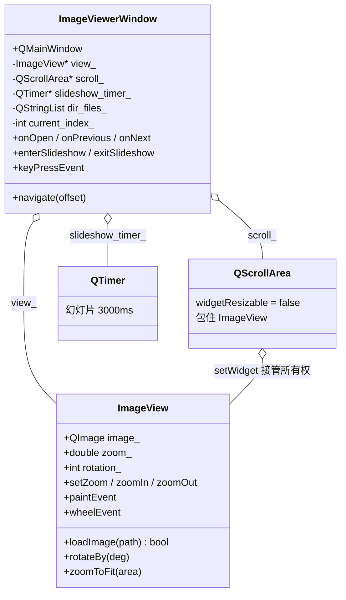
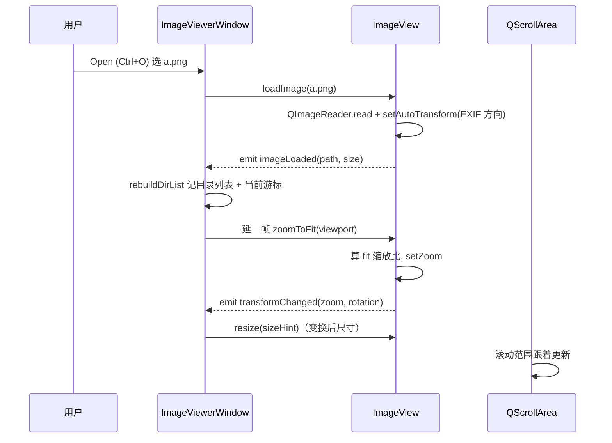

# Image Viewer 成品导览

> **source**：`app/05-image-tools/image-viewer/`　**related**：app 栏第 1 件（整机应用范式标杆）

Image Viewer 是 app 栏的**第一件整机成品**。前面 widget 栏的 13 件都是「一个控件」——自绘圆盘、滑块、图表；app 栏不一样，它要撑起「真库不是片段」这句话：一个有菜单、工具栏、状态栏、能打开文件、能缩放旋转翻页、能放幻灯片的**完整应用**。所以这件的价值不在某个炫酷算法，而在把一堆 Qt 能力（QMainWindow / 自定义绘制 / QTransform / QScrollArea / 事件 / QTimer）织成一台能用的机器，而且代码读得下去。

::: tip 本篇是「成品导览」
想直接用成品 → 看这里（架构 / 决策 / 踩坑 / 怎么读）。
想自己从零搓出来 → 转 [手搓手册](./handbook/)。
:::

## 1. 它做什么

一个能用的图片查看器：

- **打开**：多格式（png/jpg/bmp/gif/svg/webp/ppm…），加载时自动按 EXIF 方向校正（手机拍照横着的图自动转正）
- **缩放**：滚轮、工具栏 ±、`Fit to Window`、`Actual Size (100%)`，状态栏实时显示百分比
- **旋转**：90° 步进左旋/右旋，绕图像中心
- **翻页**：打开一张后，同目录下的图片能用 ← / → 或工具栏前后翻，**循环**且**自动跳过坏图**
- **幻灯片**：F5 全屏自动播放，3 秒一张，Esc / Space 退出，退出后恢复进全屏前的窗口状态（最大化不会丢）

跑起来看一眼：

```bash
cmake -B build -S app && cmake --build build
./build/05-image-tools/image-viewer/demo/image_viewer_demo
```

## 2. 架构总览

### 类关系

整机就两个核心类：`ImageViewerWindow`（主窗口，管菜单/工具栏/状态栏/翻页/幻灯片）和 `ImageView`（画布，管一张图的渲染与变换）。`QScrollArea` 包住画布提供滚动，`QTimer` 驱动幻灯片。



### 文件职责

| 文件 | 职责 |
|---|---|
| `demo/image_view.h` | 画布接口：加载 / 缩放 / 旋转 / 适配 / 三个信号（transformChanged / imageLoaded / loadFailed） |
| `demo/image_view.cpp` | 画布实现：QImageReader 加载、QTransform 变换、paintEvent 自绘、wheelEvent 滚轮缩放 |
| `demo/image_viewer_window.h` | 主窗口接口：菜单/工具栏/状态栏装配 + 翻页/幻灯片状态 |
| `demo/image_viewer_window.cpp` | 主窗口实现：QAction 装配、QScrollArea 包画布、目录翻页、幻灯片全屏 |
| `demo/main.cpp` | 入口：QApplication + 主窗口 show |

### 打开一张图怎么跑起来



重点：画布的尺寸**不是固定的**，它随 zoom/rotation 变（`sizeHint()` 返回变换后图像外接尺寸）。每次变换 → emit `transformChanged` → 窗口把画布 `resize` 到新 sizeHint → `QScrollArea` 据此更新滚动范围。这条链是整份代码的第二条命脉（第一条是 paintEvent 的 QTransform）。

## 3. 关键设计决策

**① 自定义 `ImageView` 重写 paintEvent，不用 `QLabel::setPixmap`。**
QLabel 显示图片也能缩放（setScaledContents）和旋转（QTransform 映射 QPixmap），但每次缩放/旋转都要重新生成一个 QPixmap，而且坐标系变换藏在 QLabel 内部、讲不清。这里直接拿 QPainter + 一个 QTransform 把「平移到图像中心 → 缩放 → 旋转 → 平移到画布中心」合成一次绘制——代码透明、教学价值高、性能也不差（中等尺寸图够用）。

**② 用一个 QTransform 合成缩放 + 旋转，靠右乘累积的顺序保证「绕图像中心」。**
QTransform 的 translate/rotate/scale 是**右乘累积**——代码里后写的行先作用于点。所以 paintEvent 里四行的书写顺序看起来是「画布中心 → 旋转 → 缩放 → 图像中心」，但实际作用顺序正好反过来：先把图像中心移到原点，再缩放、再旋转，最后落到画布中心。顺序写错图像就会飞出去或绕错中心（见踩坑①）。

**③ `QScrollArea::widgetResizable = false` + 画布 `sizeHint = 变换后图像尺寸`，让滚动范围跟着缩放走。**
widgetResizable=true 时画布会被拉伸到视口大小，滚动条永远不出现——对图片查看器是错的。设成 false，画布保持自己的 sizeHint（= 变换后图像外接），比视口大就出滚动条，小就按 alignment 居中。缩放变大 → sizeHint 变大 → 滚动条出现，天然成立。

**④ 翻页 `navigate` 循环跳过坏图，加载成功才提交 `current_index_`。**
目录里混进一张损坏的图很常见。若先推进游标再加载，坏图加载失败时画面停在旧图、游标却指向坏图——「当前显示哪张」和翻页基线脱钩，再翻就乱跳。这里改成沿方向循环找下一张**能加载**的图，加载成功才把游标写过去；坏图被静默跳过，游标永远 = 当前真正显示的图。

**⑤ 幻灯片进全屏前记 `was_maximized_`，退出时恢复。**
`showFullScreen()` 不记录窗口的前置状态，直接 `showNormal()` 退出会把原本最大化的窗口缩回普通大小。这里进幻灯片前记一下 `isMaximized()`，退出时按记录值 `showMaximized()` 或 `showNormal()`，窗口几何体验不回退。

## 4. 怎么读这份 code

按这个顺序读，最快建立心智：

1. **`demo/image_view.h` 的 ImageView 接口**——先看「画布对外暴露什么」（load / zoom / rotate / zoomToFit + 三个信号）
2. **`paintEvent`**（`demo/image_view.cpp:117`）——变换核心，盯 QTransform 四行的顺序
3. **`transformedSize` + `sizeHint`**（`demo/image_view.cpp:90`）——画布尺寸怎么随变换变，旋转时宽高互换
4. **`wheelEvent`**（`demo/image_view.cpp:146`）——滚轮缩放
5. **`setupCentral`**（`demo/image_viewer_window.cpp:137`）——QScrollArea 怎么包画布，widgetResizable=false
6. **`wireCanvas`**（`demo/image_viewer_window.cpp:158`）——transformChanged → resize 画布这条链
7. **`navigate`**（`demo/image_viewer_window.cpp:223`）——翻页循环跳坏图
8. **`enterSlideshow` / `exitSlideshow`**（`demo/image_viewer_window.cpp:293`）——全屏 + 状态恢复

入口：`demo/main.cpp` → `ImageViewerWindow` 跑起来，对照读。

## 5. 踩坑

| # | 现象 | 原因 | 后果 | 解法 |
|---|---|---|---|---|
| ① | 缩放/旋转后图像飞出画布或绕错中心 | QTransform 的 translate/rotate/scale 右乘累积，**书写顺序与作用顺序相反**，写错图像不以中心旋转 | 图像位置乱跑、旋转中心错 | 按「最后写的先作用」排：`translate(画布中心) → rotate → scale → translate(−图像中心)`（`image_view.cpp:133-137`） |
| ② | 旋转 90° 后滚动范围/画布尺寸错 | 旋转后图像外接**宽高互换**，sizeHint 没跟着转置 | QScrollArea 滚动范围错、图像被裁或留大片空 | `transformedSize` 在 `rotation_%180!=0` 时 transpose（`image_view.cpp:95-97`） |
| ③ | 缩放放大后滚轮只能缩放、滚不动画面 | wheelEvent `accept()` 吞了滚轮事件，QScrollArea 收不到滚动 | 大图高倍放大浏览得拖滚动条 | 取舍：演示版保留滚轮=缩放；要滚动改「Ctrl+滚轮缩放、裸滚轮滚动」（进阶挑战） |
| ④ | 超大图缩放卡顿 | paintEvent 每次 `setTransform + drawImage` 对**原始大图**整体变换重画 | 高倍缩放掉帧 | 设 `SmoothPixmapTransform`（`image_view.cpp:130`）；极致大图预 scaled 缓存（进阶挑战） |
| ⑤ | 目录混坏图时翻页游标错位 | 先推 `current_index_` 再 `loadImage`，坏图加载失败但游标已推进 | 「游标指向坏图、画面停旧图」脱钩，再翻乱跳 | `navigate` 循环找下张能加载的图，**成功才提交**游标（`image_viewer_window.cpp:231-245`） |
| ⑥ | 幻灯片遇坏图弹模态框、循环卡住 | loadFailed 槽无脑弹 `QMessageBox`，全屏时阻塞事件循环 + timer | 幻灯片卡住、timer 关框后连发 | 幻灯片态**静默**（只刷状态栏），靠 navigate 跳过坏图（`image_viewer_window.cpp:170-176`） |

## 6. 官方文档

- [QImageReader / setAutoTransform](https://doc.qt.io/qt-6/qimagereader.html)——加载 + EXIF 方向自动校正
- [QTransform](https://doc.qt.io/qt-6/qtransform.html)——坐标变换（缩放/旋转/平移的矩阵累积）
- [QPainter::drawImage / RenderHint](https://doc.qt.io/qt-6/qpainter.html)——绘制 + SmoothPixmapTransform
- [QScrollArea / widgetResizable](https://doc.qt.io/qt-6/qscrollarea.html)——滚动区域 + 子部件尺寸策略
- [QMainWindow / QAction / QToolBar](https://doc.qt.io/qt-6/qmainwindow.html)——主窗口 + 菜单/工具栏装配
- [QFileDialog](https://doc.qt.io/qt-6/qfiledialog.html)——打开文件对话框
- [QTimer](https://doc.qt.io/qt-6/qtimer.html)——幻灯片定时翻页

---

这套「自定义画布 paintEvent + QTransform 一次合成变换 + sizeHint 驱动滚动」是整机图片类应用的通用骨架——缩略图浏览器、PDF 阅读器、地图查看器都能换皮复用。想自己搓？[手搓手册](./handbook/)带你从空 QMainWindow 一行行搓到这个成品。
