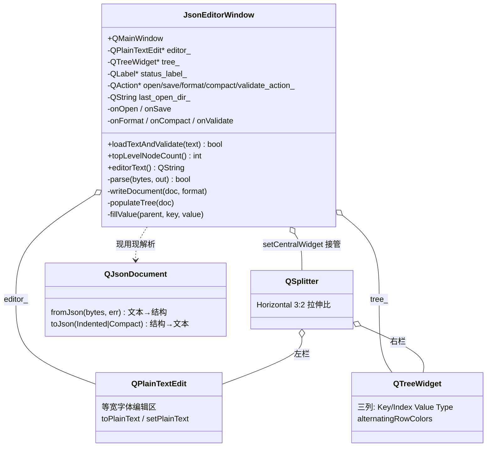
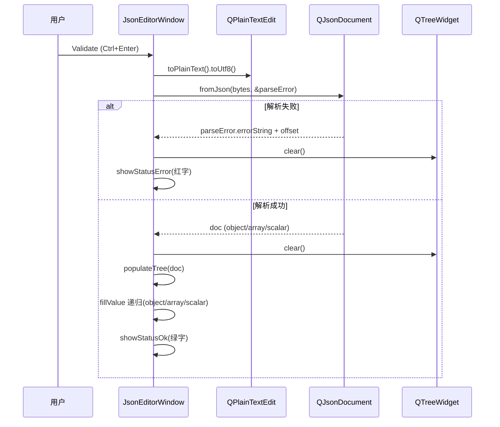

# JSON Editor 成品导览

> **source**：`app/01-dev-tools/json-editor/`　**related**：app 栏整机应用范式（与 image-viewer 并列，换皮复用同一份 QMainWindow 骨架）

JSON Editor 是 app 栏的整机成品之一。它不炫算法，价值在于把「文本编辑 + 数据校验 + 结构化展示」这三件日常工程里最常见的事，用一组配合默契的 Qt 能力（QPlainTextEdit / QTreeWidget / QJsonDocument / QSplitter / QMainWindow 装配）织成一个能直接拿去用的桌面工具。比 image-viewer 多出来的功课是**结构化数据怎么从纯文本里析出来、再递归铺成树**——这条 parse → populate 的链是这份代码的命脉，也是配置文件查看器、API 响应检查器、序列化调试器这一类工具的通用骨架。

::: tip 本篇是「成品导览」
想直接用成品 → 看这里（架构 / 决策 / 踩坑 / 怎么读）。
想自己从零搓出来 → 转 [手搓手册](./handbook/)。
:::

## 1. 它做什么

一个能用的 JSON 编辑器：

- **编辑**：左侧 QPlainTextEdit，等宽字体，粘贴或手写 JSON
- **校验**：`Validate`（Ctrl+Enter）解析整篇，成功绿字 `OK` 并把结构铺进右侧树视图，失败红字报错并给出**错误类型 + 字节偏移**定位语法问题
- **格式化 / 紧凑**：`Format`（Ctrl+I）缩进美化、`Compact`（Ctrl+M）去掉所有空白，二者互转且**保光标位置**
- **树视图**：右侧 QTreeWidget 三列（Key/Index、Value、Type），递归展开 object / array / scalar，object 用键名、array 用 `[i]` 索引当 key 列
- **打开 / 保存**：`Open`（Ctrl+O）/ `Save`（Ctrl+S）走 QFileDialog，UTF-8 读写 `.json`，记住上次打开的目录

跑起来看一眼：

```bash
cmake -B build -S app && cmake --build build
./build/01-dev-tools/json-editor/demo/json-editor_demo
```

## 2. 架构总览

### 类关系

整机就一个核心类 `JsonEditorWindow`（主窗口，管菜单/工具栏/状态栏/编辑区/树/校验/格式化）。它把 `QPlainTextEdit` 和 `QTreeWidget` 用 `QSplitter` 水平拼起来当中央区，五个 `QAction` 在菜单和工具栏间复用。`QJsonDocument` 是「文本 ↔ 结构」的转换中枢，但它是无状态的临时对象——不持久化在成员里，每次校验/格式化时现用现解析。



### 文件职责

| 文件 | 职责 |
|---|---|
| `demo/json_editor_window.h` | 主窗口接口：五个 QAction、三个外部驱动方法（loadTextAndValidate / topLevelNodeCount / editorText，给自动化用）、私有解析与树填充声明 |
| `demo/json_editor_window.cpp` | 主窗口实现：中央区装配、QAction 复用、QJsonDocument 解析校验、QTreeWidget 递归填充、格式化/紧凑光标保护、QFileDialog 读写 |
| `demo/main.cpp` | 入口：QApplication + 主窗口 show |

### 点一次 Validate 怎么跑起来



重点：解析与重绘由**用户点 Validate 触发**，不在 `textChanged` 实时校验——大 JSON 每次按键都 `fromJson` + 重建整棵树会把编辑器拖到不可用。这条「校验是显式动作」的设计决策贯穿全篇（见决策②）。

## 3. 关键设计决策

**① 一个 QJsonDocument 当「文本 ↔ 结构」的中枢，但解析只发生在显式动作里。**
QJsonDocument 同时提供 `fromJson`（文本进、结构出）和 `toJson`（结构进、格式化文本出），Format/Compact 都靠它——解析一次拿到 doc，再按 Indented/Compact 写回，天然保证「两种格式互转不丢数据」。但 doc 是无状态临时对象，不缓存为成员：每次 Validate/Format/Compact 都重新解析。理由是 JSON 体积可能很大，缓存一份会翻倍内存；而解析本身只在用户点按钮时发生，频率低，现用现算更省心。

**② 校验由 Validate 显式触发，不挂 textChanged 实时校验。**
QPlainTextEdit 的 `textChanged` 每次按键都发信号，挂实时校验意味着每敲一个字符就跑一次 `fromJson` + 重建整棵 QTreeWidget。对几 KB 的 JSON 还行，对配置文件级的几十 KB 就会明显卡顿——光标跟手性变差、输入有延迟。这里改成 Validate 是显式动作（Ctrl+Enter 或点按钮），用户敲完一段主动校验；状态栏只在校验后才更新，编辑过程不打扰。代价是用户得记得点 Validate，但换来编辑流畅性，是值得的权衡。

**③ 树用一个虚拟 `(root)` 顶层节点统一 object/array/scalar 三种文档形态。**
JSON 文档顶层可能是 object、array，也可能是空文档或单个 scalar。如果直接把顶层 keys/elements 当 `addTopLevelItem`，三种形态的根处理逻辑分叉、代码乱。这里加一个统一虚拟根 `(root)`，type 列标 object/array/null，object 的 keys 和 array 的 `[i]` 都挂到这个根下。好处：`fillValue` 这个递归函数**不用区分顶层和内层**——它永远在一个 parent 下填 children，顶层交给 `(root)` 兜。递归逻辑干净、可复用。

**④ array 元素用 `[i]` 索引当 key 列，复用 fillValue 不另写一套。**
object 的键天然有 key，array 只有位置。如果给 array 单独写一个填充函数，就得维护两套递归。这里把 array 的索引格式化成 `"[0]"`、`"[1]"` 当 key 列传进 `fillValue`——对 `fillValue` 来说，key 就是个字符串，它不在乎这字符串是用户起的键名还是算出来的索引。一套递归吃掉 object 和 array，代码量减半。

**⑤ Format/Compact 后保光标位置，重写文本不把光标踢回开头。**
`setPlainText` 会把光标重置到文档开头——用户在文件中段编辑、按 Ctrl+I 格式化，光标要是飞回开头，得重新滚回去找位置，体验很差。这里在重写前记 `textCursor().position()`，重写后用 `QTextCursor::setPosition(qMin(原位置, 新文本长度))` 把光标拉回去（qMin 兜底格式化后文本变短、原位置越界的情况）。一个十行的细节，但「编辑大量文本后还跟手」全靠它。

## 4. 怎么读这份 code

按这个顺序读，最快建立心智：

1. **`demo/json_editor_window.h` 的类声明**——先看「窗口对外暴露什么」（构造 + 三个外部驱动方法 + 五个私有 slot + 私有解析/填充声明）
2. **`setupCentral`**（`demo/json_editor_window.cpp:55`）——QSplitter 怎么把编辑区和树拼成中央区，3:2 拉伸比
3. **`setupActions` + `setupMenuBar` + `setupToolBar`**（`demo/json_editor_window.cpp:78`）——五个 QAction 怎么在菜单和工具栏间复用
4. **`parse`**（`demo/json_editor_window.cpp:146`）——QJsonDocument::fromJson + QJsonParseError 怎么拿错误偏移
5. **`onValidate` + `populateTree`**（`demo/json_editor_window.cpp:162`、`:176`）——校验 → 清空树 → 建虚拟根 → 递归填充这条链
6. **`fillValue`**（`demo/json_editor_window.cpp:206`）——递归核心，switch 七种 QJsonValue::Type，特别注意 Double 的整数判定
7. **`writeDocument`**（`demo/json_editor_window.cpp:266`）——Format/Compact 怎么写回并保光标
8. **`onOpen` / `onSave`**（`demo/json_editor_window.cpp:296`、`:317`）——QFileDialog + UTF-8 读写 + 记目录

入口：`demo/main.cpp` → `JsonEditorWindow` 跑起来，对照读。

## 5. 踩坑

| # | 现象 | 原因 | 后果 | 解法 |
|---|---|---|---|---|
| ① | 整数 `1` 在树里显示成 `1` 但 `6.11` 显示成 `6.11`，偶尔整数带 `.0`；带小数的大数（如 `1e15`）也被误判成整数 | Qt 的 JSON 数字**统一是 double**，`QString::number(d)` 对整数会给 `1.0`；且 `qFuzzyCompare(d, floor(d))` 对 \|d\|>=1e12 量级**失效**（浮点精度不够），带小数的大数被误判整数 | 整数显示带多余 `.0`；大数显示丢小数部分 | 改精确判定 `std::isfinite(d) && d == std::floor(d)`，且先做 `qint64` 范围检查再 `static_cast<qint64>`（越界 cast 是 UB），是整数转 `qint64` 再 `QString::number`（`json_editor_window.cpp:233-242`） |
| ② | 校验报错信息只说「非法 token」，找到的 offset 列对不上编辑器光标 | 直接用 `errorString()` 没带 `QJsonParseError::offset`；且 `offset` 是 **UTF-8 字节偏移**，含中文时与编辑器字符列不等 | 用户对着几百行 JSON 猜错误位置；按字符列数找不到 | 拼上 `@byte offset %1` 明确标「字节偏移」区分字符列，状态栏一眼定位（`json_editor_window.cpp:151-152`） |
| ③ | Format/Compact 后光标飞回文档开头 | `setPlainText` 重置光标到 0 位 | 大文件中段编辑后格式化，得重新滚回去找位置 | 重写前记 `position()`，重写后 `setPosition(qMin(原位, 新长度))` 拉回（`json_editor_window.cpp:268-272`） |
| ④ | 中文 key/值在树里显示正常，但保存重开变成乱码 | Save 时用 `QTextStream` 没显式设 `Utf8` 编码（平台默认编码可能非 UTF-8） | 含非 ASCII 的 JSON 存盘后无法正确读回 | `out.setEncoding(QStringConverter::Utf8)` 显式指定（`json_editor_window.cpp:335`） |
| ⑤ | Save 后文件末尾数据丢失 / 截断 | `QTextStream` 有缓冲，`QFile::close()` **不 flush** QTextStream 的缓冲，直接 close 会截断缓冲区里还没落盘的字节 | 存盘文件比编辑区内容短，末尾 JSON 缺失，重开解析失败 | `file.close()` 前必须 `out.flush()`（`json_editor_window.cpp:337`） |
| ⑥ | Save 对话框输文件名 `data` 不带 `.json`，存盘文件没后缀 | `QFileDialog::getSaveFileName` **不自动补后缀**，用户输什么名就写什么名 | 写出无后缀文件，资源管理器不识别为 JSON | 手动 `if (QFileInfo(path).suffix().isEmpty()) path += ".json";` 补后缀（`json_editor_window.cpp:324-325`） |
| ⑦ | 想「实时校验」挂了 textChanged，结果大文件每敲一键卡半秒 | textChanged 每次按键触发，实时跑 `fromJson` + 重建整棵树 | 编辑器跟手性变差，输入明显延迟 | 校验只走显式 Validate 动作，textChanged 不挂解析（决策②，对比 `json_editor_window.cpp:162` 的 onValidate 是按钮触发） |
| ⑧ | 构造函数里 `setupActions` 的 lambda 解引用 editor_ 时崩 | `setupCentral()` 没在 `setupActions()` 前调，editor_/tree_ 还是 nullptr | 启动即段错误 | 构造顺序固定「先建中央区部件，再建 actions/菜单/工具栏」（`json_editor_window.cpp:42-46`，注释已写明） |

## 6. 官方文档

- [QJsonDocument](https://doc.qt.io/qt-6/qjsondocument.html)——JSON 文档容器，fromJson / toJson（Indented|Compact）互转
- [QJsonParseError](https://doc.qt.io/qt-6/qjsonparseerror.html)——解析错误，error 枚举 + offset 字节偏移定位
- [QJsonValue / Type](https://doc.qt.io/qt-6/qjsonvalue.html)——七种值类型（Bool/Double/String/Array/Object/Null/Undefined），递归终止依据
- [QJsonObject / QJsonArray](https://doc.qt.io/qt-6/qjsonobject.html)——键值容器 / 数组容器的遍历（begin/end 迭代器）
- [QPlainTextEdit](https://doc.qt.io/qt-6/qplaintextedit.html)——纯文本编辑区，toPlainText / setPlainText / textCursor
- [QTreeWidget / QTreeWidgetItem](https://doc.qt.io/qt-6/qtreewidget.html)——树视图，三列填充 + 递归 addChild
- [QSplitter](https://doc.qt.io/qt-6/qsplitter.html)——水平/垂直分栏，setStretchFactor 拉伸比
- [QMainWindow / QAction / QToolBar / QStatusBar](https://doc.qt.io/qt-6/qmainwindow.html)——主窗口 + 菜单/工具栏/状态栏装配
- [QFileDialog](https://doc.qt.io/qt-6/qfiledialog.html)——打开/保存文件对话框
- [QFile / QTextStream](https://doc.qt.io/qt-6/qtextstream.html)——文件读写 + 编码设置（QStringConverter::Utf8）

---

这套「QJsonDocument 解析中枢 + 显式校验触发 + 树递归填充（虚拟根 + `[i]` 索引复用 fillValue）」是结构化文本编辑器的通用骨架——配置文件查看器、YAML/TOML 检查器、API 响应调试器都能换皮复用：换的是「文本 ↔ 结构」的转换层（QJsonDocument 换成 yaml-cpp / toml++），不变的是「编辑区 + 树视图 + 显式校验」这台机器。想自己搓？[手搓手册](./handbook/)带你从空 QMainWindow 一行行搓到这个成品。
