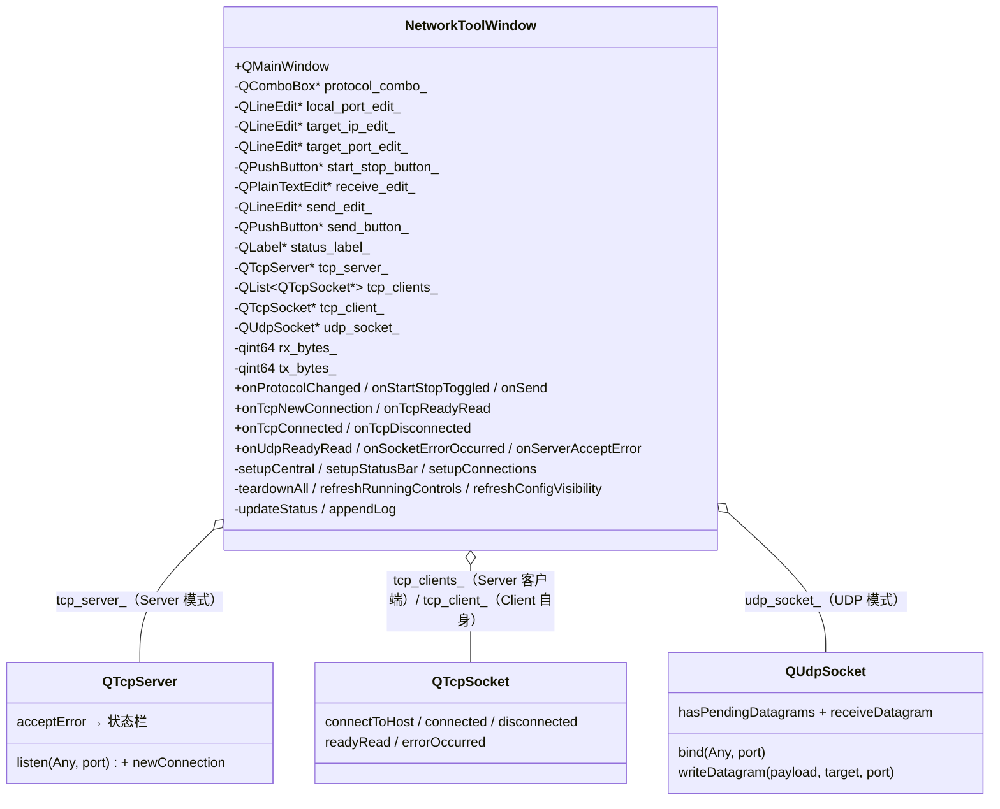
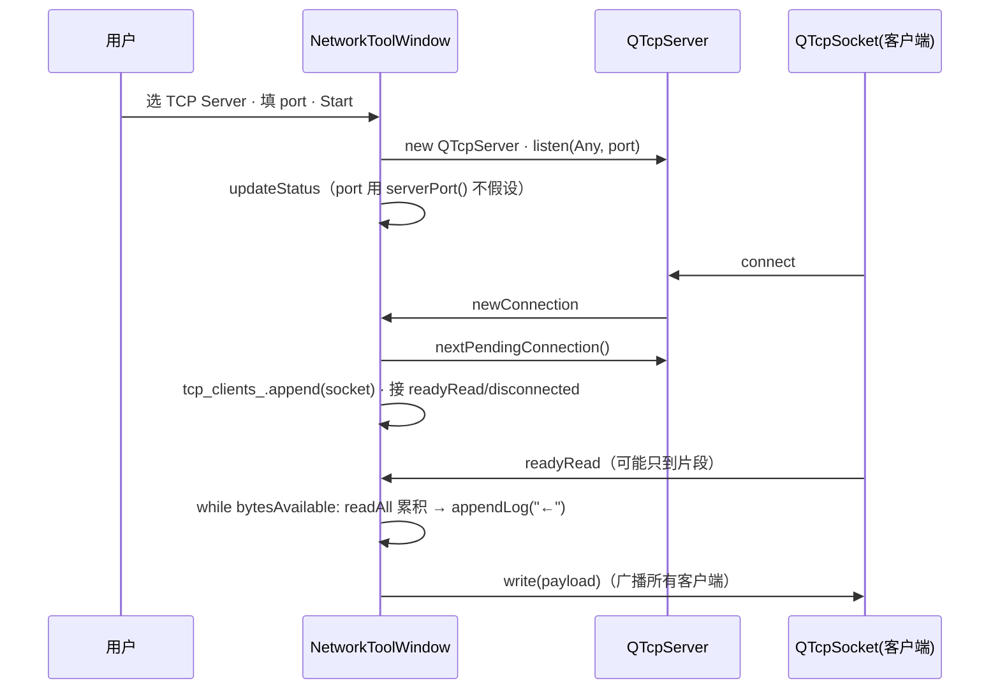

# Network Tool 成品导览

> **source**：`app/02-network-tools/network-tool/`　**related**：app 栏网络工具类整机成品

Network Tool 是 app 栏「网络调试助手」这一类的整机成品。和 widget 栏讲单控件不同，app 栏讲究把整台机器装起来——**一个窗口里同时塞进 TCP Server / TCP Client / UDP 三种模式**，能听、能连、能发、能收，多客户端并发不乱。它的价值不在某个算法多巧，而在把 Qt Network 那几个核心类（`QTcpServer` / `QTcpSocket` / `QUdpSocket`）和 Qt Widgets 的整机装配（`QMainWindow` + 配置面板 + 收发区 + 状态栏）织成一台能用的机器，而且把网络调试里最容易翻车的几个雷——**端口 0 假设、readyRead 分片、UDP 用 readAll、客户端断开悬空指针、协议运行中切换**——都防住了。

::: tip 本篇是「成品导览」
想直接用成品 → 看这里（架构 / 决策 / 踩坑 / 怎么读）。
想自己从零搓出来 → 转 [手搓手册](./handbook/)。
:::

## 1. 它做什么

一个能用的 TCP/UDP 网络调试助手：

- **选协议**：顶部 `QComboBox` 选 `TCP Server` / `TCP Client` / `UDP`，配置控件跟着协议**自动显隐**（Server 只要本机端口，Client 只要目标 IP+端口，UDP 两者都要——既 bind 本机端口收、又 writeDatagram 目标发）
- **TCP Server**：填本机端口点 `Start`，`QTcpServer::listen` 起监听；客户端连进来自动入列 `QList<QTcpSocket*>`，状态栏实时显示客户端数；可向**所有客户端广播**发送
- **TCP Client**：填目标 IP+端口点 `Start`，`connectToHost` 异步连接，`connected`/`disconnected` 信号驱动状态，断开后发送前置拒绝
- **UDP**：填本机端口点 `Start`（`QUdpSocket::bind` 收数据报，`hasPendingDatagrams` + `receiveDatagram` 循环消费），另填目标 IP+端口用于发送；发送要明确目标，目标留空则回环自测
- **收发**：中间只读日志区带**时间戳 + 方向**（`←` 收 / `→` 发 / `i` 信息 / `!` 警告），底部 `QLineEdit` 输入回车即发，状态栏累计 **RX/TX 字节**
- **停**：同一按钮切 `Stop`，按当前协议 `close` + `deleteLater` 全部资源，断开信号先 `disconnect` 防回调已删对象

跑起来看一眼：

```bash
cmake -B build -S app && cmake --build build
./build/02-network-tools/network-tool/demo/network-tool_demo
```

## 2. 架构总览

### 类关系

整机就一个核心类 `NetworkToolWindow`（QMainWindow），它按当前协议持有**三种运行态资源之一**：TCP Server 模式握 `QTcpServer` + `QList<QTcpSocket*>`；TCP Client 模式握单个 `QTcpSocket`；UDP 模式握 `QUdpSocket`。三套资源互斥，切换协议前必须先 Stop 旧实例。配置面板驱动协议选择与显隐，接收区/发送区/状态栏是各协议共用的 UI 层。



### 文件职责

| 文件 | 职责 |
|---|---|
| `demo/network_tool_window.h` | 主窗口接口：协议三态 + 三类 socket 资源 + 收发/状态栏装配；头注释讲清三条协议用法与五条关键设计（端口 0 / readyRead 分片 / UDP 收 / 错误反馈 / 断开拒绝 write） |
| `demo/network_tool_window.cpp` | 主窗口实现：协议装配、Start/Stop 两态、TCP 多客户端管理、UDP 数据报循环、异步收发累积、teardown 顺序清理 |
| `demo/main.cpp` | 入口：QApplication + 主窗口 show |
| `demo/CMakeLists.txt` | 工程配置——`find_package(Qt6 ... COMPONENTS Network)` + 链接 `Qt6::Network`（关键：不链 Network 整个编译都过不了） |

### 起一个 TCP Server 接客户端并收数据怎么流转



重点：**端口 0 让系统分配，真正监听端口用 `serverPort()` 取回**，绝不假设用户填的就是 listen 成功的；**`readyRead` 异步**，本次信号只保证「至少一字节可读」，可能只是片段——`while bytesAvailable` 循环读尽本次可读。这两条是 TCP Server 模式的两条命脉。

## 3. 关键设计决策

**① 三种协议三态资源互斥，Start/Stop 用单按钮两态切换，状态以「资源是否存在」为准而非按钮文案。**
TCP Server / TCP Client / UDP 三种模式各握自己的 socket 资源，同一时刻只能活一套。Start 按钮点一次起服务、再点一次停——但运行态判定不读按钮文字（按钮文字可能被别处改、状态脱钩），而是 `tcp_server_ != nullptr || tcp_client_ != nullptr || udp_socket_ != nullptr` 三个指针任一非空就算运行中。(`network_tool_window.cpp:190-191`)

**② 端口 0 = 系统分配，真正端口用 `serverPort()`/`localPort()` 取回，绝不假设用户填的就是 listen 成功的。**
端口填 0 是合法用法（让系统挑一个空闲端口），但用户填的 0 和「实际监听端口」是两回事。代码里只要成功 listen/bind，状态栏和日志一律用 `tcp_server_->serverPort()`（`network_tool_window.cpp:227`）/ `udp_socket_->localPort()`（`network_tool_window.cpp:269`）取真实端口反馈，避免「我填了 0 怎么状态栏也是 0」的错觉。

**③ TCP 收用 `while bytesAvailable` 循环 `readAll`，UDP 收用 `hasPendingDatagrams` + `receiveDatagram`，各走各的，且都不假设一次到齐。**
`readyRead` 只保证「至少一字节可读」，一条消息可能分几次信号到达——TCP 收在 `onTcpReadyRead` 里 `while (socket->bytesAvailable() > 0)` 累积 `readAll`（`network_tool_window.cpp:340-347`）。UDP 完全是另一套：数据报是离散的，**绝不能用 `readAll`**（会粘包/丢边界），必须 `while hasPendingDatagrams()` 配 `receiveDatagram()` 逐个消费（`network_tool_window.cpp:380-389`）。

**④ TCP Server 多客户端用 `QList<QTcpSocket*>` 管理，断开用 `deleteLater` + 从列表移除，防悬空指针。**
每个客户端 `QTcpSocket` 接自己的 `readyRead`/`disconnected` 信号——收数据时用 `sender()` 区分是哪个客户端（`network_tool_window.cpp:334`）；客户端断开从 `tcp_clients_` 移除并 `deleteLater`（`network_tool_window.cpp:369-370`）。`teardownAll` 整体清理时，先 `disconnect(disconnected signal)` 再 `disconnectFromHost`，避免断开信号回调到正在被删的对象。

**⑤ 运行中锁住协议切换和配置输入，且 TCP Client 必须真正 `ConnectedState` 才允许发送。**
运行中改端口/IP 不会即时生效（socket 已建），与其让用户产生「改了怎么没反应」的错觉，不如直接 `setEnabled(false)` 锁住（`network_tool_window.cpp:176-179`）。TCP Client 发送前用 `tcp_client_->state() == QAbstractSocket::ConnectedState` 前置校验（`network_tool_window.cpp:433`）——以 `connected` 信号态为准，断开后 `write` 会被 Qt 丢弃/报错，这里前置拒绝更干净。

## 4. 怎么读这份 code

按这个顺序读，最快建立心智：

1. **`demo/network_tool_window.h` 头注释 + 成员**——先看「窗口握着什么」（三类 socket 资源、协议三态、收发/状态栏控件），五条关键设计写在头注释里
2. **`setupCentral`**（`network_tool_window.cpp:56`）——QFormLayout 配置面板怎么搭，接收区/发送区/状态栏怎么分区
3. **`refreshConfigVisibility`**（`network_tool_window.cpp:155`）——协议决定本机端口/目标 IP+端口哪些可见，target_port 单独行连同 target_ip 一起显隐的小细节
4. **`onStartStopToggled`**（`network_tool_window.cpp:188`）——单按钮两态切换、三协议分流装配（listen/bind/connectToHost）、端口校验与失败回滚
5. **`onTcpNewConnection`**（`network_tool_window.cpp:313`）——`hasPendingConnections` 循环接客户端、入列、接各自信号
6. **`onTcpReadyRead`**（`network_tool_window.cpp:333`）——`sender()` 区分来源、`while bytesAvailable` 累积 `readAll`
7. **`onUdpReadyRead`**（`network_tool_window.cpp:378`）——`hasPendingDatagrams` + `receiveDatagram` 循环（**不是 readAll**）
8. **`onTcpDisconnected`**（`network_tool_window.cpp:358`）——`socket=nullptr` 表示 Client 自身断开、非空表示 Server 某客户端断开移除
9. **`teardownAll`**（`network_tool_window.cpp:283`）——释放顺序：server close → 客户端先 disconnect 信号再 disconnectFromHost → deleteLater
10. **`onSend`**（`network_tool_window.cpp:396`）——三协议分流写、TCP Client 前置 `ConnectedState` 校验、UDP 留空回环

入口：`demo/main.cpp` → `NetworkToolWindow` 跑起来，对照读。

## 5. 踩坑

| # | 现象 | 原因 | 后果 | 解法 |
|---|---|---|---|---|
| ① | 端口填 0 起服务，状态栏/日志也显示 0，以为没监听上 | 0 让系统分配空闲端口，**实际监听端口**要用 `serverPort()`/`localPort()` 取回，而不是回显用户填的值 | 用户误判服务没起来、对端连不上 | listen/bind 成功后用 `tcp_server_->serverPort()`（`network_tool_window.cpp:227`）/ `udp_socket_->localPort()`（`network_tool_window.cpp:269`）取真实端口反馈 |
| ② | TCP 收数据只显示前半截，后半截丢/串行 | `readyRead` 只保证「至少一字节可读」，大消息可能分多次信号到达；只 `readAll` 一次就以为收完 | 数据粘包/截断、协议解析错乱 | `while (socket->bytesAvailable() > 0)` 循环 `readAll` 累积到本次可读耗尽（`network_tool_window.cpp:340-347`） |
| ③ | UDP 收数据粘包/边界错乱，甚至收不到 | 用了 TCP 的 `readAll` 收 UDP——UDP 是离散数据报，`readAll` 会把多个数据报的字节流粘起来或丢边界 | 数据报无法对应来源、内容错位 | UDP 收必须 `while hasPendingDatagrams()` + `receiveDatagram()` 逐个消费（`network_tool_window.cpp:380-389`） |
| ④ | TCP Client 还没 connected 就点 Send，数据丢了/报错 | `connectToHost` 是异步的，立即返回时连接还没建立；此时 `write` 被丢弃 | 用户以为发了其实没发、或刷一堆 socket error | 发送前用 `tcp_client_->state() == QAbstractSocket::ConnectedState` 前置校验，未连拒绝（`network_tool_window.cpp:433`）；以 `connected` 信号态为准 |
| ⑤ | 客户端断开后程序崩，或二次断开触发回调已删对象 | `QTcpSocket::disconnected` 信号回调里访问了已 `deleteLater` 的 socket，或 `teardownAll` 时 socket 还会发 disconnected 串到正在清理的对象 | 崩溃、悬空指针、二次 delete | `teardownAll` 清理客户端前先 `disconnect(disconnected signal)`（`network_tool_window.cpp:290`）；Server 客户端断开用 lambda 捕获 socket 指针区分（`network_tool_window.cpp:324-325`） |
| ⑥ | TCP Server 清理时客户端 socket 没跟着断，泄漏 | `QTcpServer::close()` 只停监听，**不会主动断开已接的客户端 socket** | 客户端连接残留、socket 泄漏 | `teardownAll` 里 server close 之后**显式遍历** `tcp_clients_` 逐个 `disconnectFromHost` + `deleteLater`（`network_tool_window.cpp:290-294`） |
| ⑦ | 同一客户端连进来两条 newConnection 信号，丢一条 | 高并发可能一次积压多个 pending，只 `nextPendingConnection` 一次接不到全部 | 漏接客户端、客户端列表不全 | `while hasPendingConnections()` 循环接完所有 pending（`network_tool_window.cpp:315`） |
| ⑧ | 运行中改端口/IP，状态/行为没变化 | socket 已建好，改配置输入框不会重建 socket | 用户困惑「改了怎么没生效」 | 运行中 `setReadOnly`/`setEnabled(false)` 锁住协议切换和配置输入（`network_tool_window.cpp:176-179`），改要走 Stop→重新 Start |
| ⑨ | 工程编译报 `QHostAddress`/`QTcpServer` 找不到 | `CMakeLists.txt` 没链 `Qt6::Network` | 整个编译失败 | `find_package(Qt6 ... COMPONENTS Network)` + `target_link_libraries(... Qt6::Network)`（`demo/CMakeLists.txt:3,15`） |
| ⑩ | listen/bind 失败静默，用户不知道端口被占 | 没读 `errorString` 反馈 | 端口占用/权限不够时用户以为服务正常 | listen/bind 返回 false 时 `QMessageBox::warning` 弹 `errorString()`，并 `delete` + 置空回滚（`network_tool_window.cpp:217-223` / `262-267`） |
| ⑪ | UDP 模式填了目标 IP/端口，发送时还是只发给自己（loopback），永远发不到外部目标 | `refreshConfigVisibility` 把 UDP 的 `need_target` 置成 `false`，目标 IP/端口控件被隐藏，onSend 取不到目标只能走 loopback 回环 | UDP 永远走 loopback，跨机/跨进程对外发不出去，用户以为「网络不通」 | `need_target` 对 UDP 也置 `true`——UDP 同时显示本机端口 + 目标 IP/端口（`network_tool_window.cpp:161`），让 onSend 能取到用户填的目标 `writeDatagram` 出去 |
| ⑫ | TCP Server 接受的客户端 socket，退出时内存泄漏（程序结束 socket 没被回收） | `nextPendingConnection()` 返回的 socket 默认无父对象；靠 `disconnected → deleteLater` 回收，但程序退出走的是对象树析构、此时没有事件循环跑 `deleteLater`，于是泄漏 | socket 泄漏、连接残留；进程虽退也丢的 socket 在长生命周期/嵌入式场景累积内存 | `onTcpNewConnection` 里给 socket `setParent(this)`，让 Qt 对象树兜底回收（`network_tool_window.cpp:317`），不依赖事件循环 |
| ⑬ | TCP Server 广播时 TX 字节统计错：N 个客户端只 +N×1（或 +1），不是 +N×payload；且个别客户端写失败 `break` 掉整轮，抹掉已成功写入的字节 | 累加逻辑只加一份 payload（漏算 N 倍），或循环里遇到 `write < 0` 就 `break`——把前面已成功 write 的字节也丢了 | 流量统计严重偏低、与实际发送不符；部分成功也被当全失败 | 循环内累加**每个客户端 `write` 返回的实发字节**（`network_tool_window.cpp:415-421`）；个别失败只标记 `any_failed` 不 break——计入已成功的、提示 partial，全部失败才报 `Send failed`（`network_tool_window.cpp:423-429`） |
| ⑭ | TCP Client 连上后远端断开，但 Send 按钮还亮着，点了才报「Not connected」 | `onTcpDisconnected` 没区分自身断开与 Server 客户端断开，自身断开时没禁用 `send_button_`——UI 与连接态脱节 | UI 误导（按钮看着能点）、用户点了才知道连不上、体验割裂 | `onTcpDisconnected(socket=nullptr)`（自身断开）分支里 `send_button_->setEnabled(false)`（`network_tool_window.cpp:361`）；`onTcpConnected` 重连成功再恢复 `setEnabled(true)`（`network_tool_window.cpp:352`），UI 始终对齐连接态 |
| ⑮ | `teardownAll` 清理自身 `tcp_client_` 时偶尔崩，但清 Server 客户端没事 | 清 `tcp_clients_` 有 `disconnect(disconnected)` 屏蔽信号，清 `tcp_client_` 没有——不对称，`deleteLater` 前发的 `disconnected` 串进来触发回调，脆性时序下踩雷 | 间歇性崩溃、退出时序敏感难复现 | 清 `tcp_client_` 补上对称的 `disconnect(disconnected signal)`（`network_tool_window.cpp:297`），与 Server 客户端分支一致屏蔽信号 |

## 6. 官方文档

- [QTcpServer](https://doc.qt.io/qt-6/qtcpserver.html)——`listen` / `hasPendingConnections` / `nextPendingConnection` / `serverPort` / `acceptError`
- [QTcpSocket](https://doc.qt.io/qt-6/qtcpsocket.html)——`connectToHost` / `connected` / `disconnected` / `readyRead` / `bytesAvailable` / `state` / `errorOccurred`
- [QUdpSocket](https://doc.qt.io/qt-6/qudpsocket.html)——`bind` / `hasPendingDatagrams` / `receiveDatagram` / `writeDatagram` / `localPort`
- [QNetworkDatagram](https://doc.qt.io/qt-6/qnetworkdatagram.html)——UDP 数据报封装，`senderAddress`/`senderPort`/`data`
- [QAbstractSocket / SocketState](https://doc.qt.io/qt-6/qabstractsocket.html)——socket 状态机，`ConnectedState` 判定连接态
- [QHostAddress](https://doc.qt.io/qt-6/qhostaddress.html)——`Any` / `LocalHost` 监听与回环地址
- [QMainWindow / QStatusBar](https://doc.qt.io/qt-6/qmainwindow.html)——整机装配 + 状态栏
- [QComboBox / QLineEdit / QPlainTextEdit](https://doc.qt.io/qt-6/qcombobox.html)——配置面板与收发区控件

---

这套「三协议三态资源 + 单按钮两态 + 异步收发累积 + teardown 顺序清理」是网络调试类整机应用的通用骨架——任何「起服务/连远端/收发数据」的工具（串口调试、Modbus 主从、MQTT 客户端、自定义协议探针）都能换皮复用。想自己搓？[手搓手册](./handbook/)带你从一个空 QMainWindow 一行行搓到这个成品。
