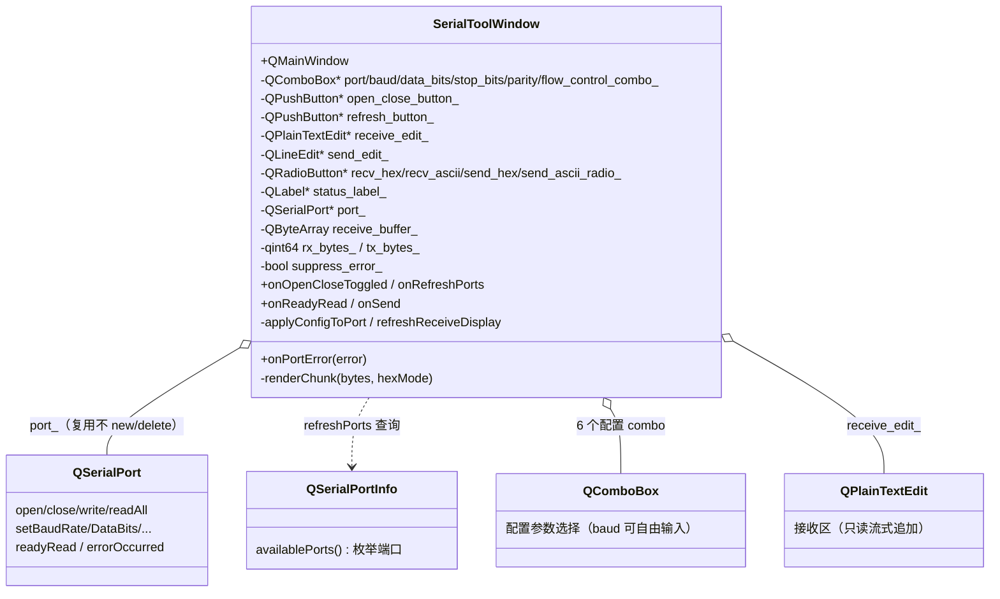
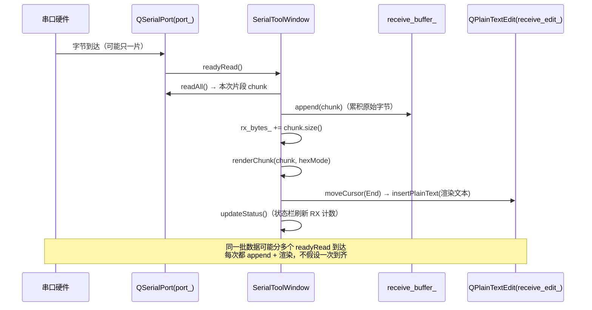

# Serial Tool 成品导览

> **source**：`app/02-network-tools/serial-tool/`　**related**：app 栏网络工具类整机成品

Serial Tool 是 app 栏「网络工具」这一类的整机成品——一个能用的串口调试助手。前面 widget 栏讲究单控件、sqlite-browser 把「吃一个数据库文件」做到底；这件换一条线——**把一条串口（COM / tty / cu）吃进来，配参数、收字节、发字节，Hex 与 ASCII 随便切**。它的价值不在某个算法多巧，而在把 Qt 串口模块（`QSerialPort` / `QSerialPortInfo`）的几个最容易翻车的雷——**readyRead 一次数据可能分多个信号到、Hex 与 ASCII 必须按字节忠实映射、主动 close 会被自家的 errorOccurred 当错误报、配置控件开着时不能改**——都防住了。

::: tip 本篇是「成品导览」
想直接用成品 → 看这里（架构 / 决策 / 踩坑 / 怎么读）。
想自己从零搓出来 → 转 [手搓手册](./handbook/)。
:::

::: warning 真实串口收发需接硬件验证
串口收发依赖真实硬件（USB 转串口模块、对端设备或虚拟串口对）。**本成品的 UI 布局 / 配置面板逻辑 / Hex↔ASCII 编解码 / 信号接驳已 offscreen 验证；但「打开端口→收字节→发字节」的端到端收发逻辑只能靠代码审，无法在本仓库离线验证。** 接上硬件后请实测：①开一个端口、②对端回环看自收自发、③拔线看 errorOccurred 是否落到状态栏。
:::

## 1. 它做什么

一个能用的串口调试助手：

- **配参数**：左边表单选端口（`QSerialPortInfo::availablePorts` 实时枚举）、波特率（combo 可自由输入任意合法值）、数据位（5/6/7/8）、停止位（1/1.5/2）、校验（None/Even/Odd）、流控（None/Hardware）
- **打开/关闭**：单个按钮两态切换（文案 `Open`↔`Close`），**开着时配置控件全锁、关掉才解锁**——防运行中改参数
- **收字节**：`readyRead` 一到就 `readAll`，按当前显示模式（Hex/ASCII）渲染追加进只读接收区；**切 Hex/ASCII 会把已收整段按新模式重渲**，不留旧模式残段
- **发字节**：发送框 + Send（回车也触发），按 Send as（Hex/ASCII）解释——Hex **发送前正向校验**（去空白后全 `[0-9a-fA-F]` 且长度偶数，防 `fromHex` 对非法字符静默截断），ASCII 走 UTF-8；`write` 后 `flush`
- **报错**：`errorOccurred`（拔线/占用/权限）落状态栏带错误码；**主动 close 期间用 `suppress_error_` 屏蔽自家触发的 ResourceError 噪声**；不可恢复错误主动 close 收敛到关闭态
- **计数**：状态栏实时 RX/TX 累计字节数 + 端口开/关状态（TX 计入队字节）

跑起来看一眼：

```bash
cmake -B build -S app && cmake --build build
./build/02-network-tools/serial-tool/demo/serial-tool_demo
```

## 2. 架构总览

### 类关系

整机就一个核心类 `SerialToolWindow`（QMainWindow），它持有一个**整生命周期复用**的 `QSerialPort* port_`——开/关只是 `open`/`close`，**不 new/delete**，避免反复构造析构。左边 `QFormLayout` 配置面板驱动 `applyConfigToPort`（开端口前把 combo 选中项写进 `port_`），右上只读 `QPlainTextEdit` 接收区由 `readyRead` 流式追加，右下 `QLineEdit` 发送区走 `write`。Hex/ASCII 是纯显示/编码层切换，与收发字节流解耦。



### 文件职责

| 文件 | 职责 |
|---|---|
| `demo/serial_tool_window.h` | 主窗口接口：配置面板 / 收发区 / 状态栏装配 + port_ 复用 + Hex/ASCII 切换；头注释讲清四条关键设计 |
| `demo/serial_tool_window.cpp` | 主窗口实现：availablePorts 枚举、applyConfigToPort 映射、readyRead 累积渲染、Hex↔ASCII 双向编解码、errorOccurred 屏蔽 |
| `demo/main.cpp` | 入口：QApplication + 主窗口 show |
| `demo/CMakeLists.txt` | 工程配置——本目录 `find_package(Qt6 COMPONENTS SerialPort)`（顶层 app/CMakeLists 只提供 Core/Gui/Widgets，SerialPort 是额外组件，必须单独 find + 链 `Qt6::SerialPort`，否则编译都过不了） |

### readyRead 怎么把字节流进接收区



重点：**一次数据可能分多个 readyRead 信号到**——每次 `readAll` 只拿到一个片段，必须**累积到 `receive_buffer_`** 再渲染新增。绝不能假设「一次 readyRead = 一条完整消息」。这条「流式累积」是整份代码的第一条命脉（第二条是「Hex/ASCII 切换是纯显示层，对原始字节流零侵入」）。

## 3. 关键设计决策

**① `port_` 整生命周期复用，开/关只 `open`/`close`，不 new/delete。**
反复 `new QSerialPort` / `delete` 会在每次开关都重建信号连接、且 `QSerialPort` 内部状态机重置成本不低。这里在构造函数 `new QSerialPort(this)` 一次，`wireSerial` 把 `readyRead`/`errorOccurred` 接驳一次，之后开/关只是 `port_->open()`/`port_->close()`。析构时 Qt 对象树兜底回收。(`serial_tool_window.cpp:34`, `:173-178`)

**② `readyRead` 一次可能只到一片，必须累积到 `receive_buffer_` 再渲染新增，绝不假设一次到齐。**
串口是字节流不是消息——OS 把到达的字节切成不定大小的片递给 Qt，Qt 每片发一个 `readyRead`。若直接把本次 `readAll` 的结果当「一条完整消息」处理（比如按行切、按定长切）就会粘包/截断。这里 `onReadyRead` 每次 `readAll` → `appendReceive` 把片段 `append` 进 `receive_buffer_`，只渲染**本次新增**片段追加进接收区。切 Hex/ASCII 时再用整段 `receive_buffer_` 重渲。(`serial_tool_window.cpp:320-336`)

**③ Hex/ASCII 是纯显示层切换，对原始字节流零侵入。**
`receive_buffer_` 永远存**原始字节**（`QByteArray`），Hex 与 ASCII 只是渲染方式：Hex 走 `bytes.toHex(' ')`（每字节两 hex + 空格）、ASCII 走 `QString::fromLatin1(bytes)`（逐字节保底映射，不可打印字符如 `0x00`/`0xFF` 不丢字节也不抛编码异常）。**注意 Latin-1 是「保底」而非「逐字节精确忠实显示」**——CR(`0x0D`) 在 QPlainTextEdit 里会回车覆盖、NUL/控制字符显示会失真，要逐字节精确看请切 Hex。切显示模式时 `refreshReceiveDisplay` 把整段 buffer 按新模式重渲，不留旧模式残段。发送方向同理：Hex 用 `QByteArray::fromHex` 解码（**先正向校验防 fromHex 静默截断**）、ASCII 用 `text.toUtf8()`。(`serial_tool_window.cpp:338-355` 接收，`:360-403` 发送)

**④ 主动 close 期间用 `suppress_error_` 屏蔽自家触发的 `errorOccurred` 噪声。**
正常 close 一个 `QSerialPort` 时，部分平台/驱动会顺带发一个 `ResourceError` 或类似 errorOccurred——这不是真错误，是关闭过程的副产物。若不屏蔽，状态栏会被刷成「Port error [N]: ...」误导用户以为出事了。这里在 `onOpenCloseToggled` 关闭分支前后置 `suppress_error_ = true/false`，`onPortError` 里检测到 flag 就直接 return。(`serial_tool_window.cpp:203-211`, `:408-431`)

**⑤ 配置控件「开着时全锁、关掉才解锁」，且 `applyConfigToPort` 只在 open 前调一次；data/stop/parity/flow 统一用 `currentIndex` 映射。**
运行中改波特率/端口名是危险操作（`QSerialPort` 支持热改部分参数，但端口名必须先 close）。这里用 `refreshOpenControls(bool)` 统一锁/解所有配置 combo + 刷新按钮 + 发送区，开/关两态互斥。`applyConfigToPort` 只在 `open` 之前调一次，把当前 combo 选中项映射进 `port_`——data/stop/parity/flow 一律用 `currentIndex`（不依赖文案）映射到 `QSerialPort::DataBits`/`StopBits`/`Parity`/`FlowControl` 枚举，combo 文案或翻译改了也不会错映射；仅波特率因 combo 可自由输入而走 `currentText().toUInt(&ok)`。(`serial_tool_window.cpp:241-254`, `:259-315`)

## 4. 怎么读这份 code

按这个顺序读，最快建立心智：

1. **`demo/serial_tool_window.h` 头注释 + 成员**——先看「窗口握着什么」（6 个配置 combo、收/发区、`port_` 复用、`receive_buffer_`、`suppress_error_`），四条关键设计写在头注释里
2. **`setupCentral`**（`serial_tool_window.cpp:53`）——QHBoxLayout 切「左配置面板 | 右上下收发区」；QFormLayout 表单装配 + Hex/ASCII QRadioButton + 信号接驳
3. **`refreshPorts`**（`serial_tool_window.cpp:183`）——`QSerialPortInfo::availablePorts` 枚举端口，无硬件返回空 combo 也容忍
4. **`onOpenCloseToggled`**（`serial_tool_window.cpp:202`）——同一按钮两态切换；关闭分支用 `suppress_error_` 屏蔽、打开分支校验端口名→applyConfig→open 失败读 errorString
5. **`applyConfigToPort`**（`serial_tool_window.cpp:259`）——combo 选中项 → `QSerialPort` 配置枚举的映射（baud 可自由输入、data/stop/parity/flow 一律 `currentIndex` 映射）
6. **`onReadyRead` + `appendReceive`**（`serial_tool_window.cpp:320` / `:325`）——流式累积核心：readAll 片段 → buffer 累积 → 渲染新增
7. **`renderChunk` + `refreshReceiveDisplay`**（`serial_tool_window.cpp:345` / `:338`）——Hex/ASCII 纯显示层，切模式整段重渲
8. **`onSend`**（`serial_tool_window.cpp:360`）——Hex 发送前正向校验（去空白后全 hex 且长度偶数）防 `fromHex` 静默截断；ASCII `toUtf8`；`write` 返回值判负 + `flush`
9. **`onPortError`**（`serial_tool_window.cpp:408`）——`suppress_error_` 屏蔽 + 状态栏报错误码 + 对 ResourceError/OpenError/PermissionError/DeviceNotFoundError 主动 close 收敛

入口：`demo/main.cpp` → `SerialToolWindow` 跑起来，对照读。

## 5. 踩坑

| # | 现象 | 原因 | 后果 | 解法 |
|---|---|---|---|---|
| ① | 编译报 `QSerialPort: No such file or directory` / 链接 `undefined reference to QSerialPort` | 顶层 app/CMakeLists 只 `find_package` 了 Core/Gui/Widgets，SerialPort 是**额外组件**没单独 find 也没链 | 工程根本编不过 | 本目录 `CMakeLists.txt` 单独 `find_package(Qt6 COMPONENTS SerialPort)` + `target_link_libraries` 加 `Qt6::SerialPort`（`demo/CMakeLists.txt:3`, `:11-16`） |
| ② | 接收区收到的数据「缺一截」/ 按定长切包粘包截断 | 把每次 `readyRead` 的 `readAll` 当「一条完整消息」处理——但串口是字节流，OS 一批数据可能分多个 readyRead 到 | 数据粘包/截断、协议解析错位 | 每次 `readAll` 只拿到片段，必须 `append` 进 `receive_buffer_` 累积，只渲染新增（`serial_tool_window.cpp:320-336`） |
| ③ | 切 Hex/ASCII 后，历史段还留在旧模式 / 接收区半 Hex 半 ASCII | 切模式只渲染「之后」的新数据，没重渲已收的历史段 | 接收区显示混乱、用户看不清全貌 | `refreshReceiveDisplay` 用整段 `receive_buffer_` 按新模式 `setPlainText` 重渲（`serial_tool_window.cpp:338-343`） |
| ④ | ASCII 模式收到 `0x00`/`0xFF` 等字节，接收区丢字符 / 乱码 / QString 长度对不上 | 直接 `QString(bytes)` 走 UTF-8 解码，非法字节序列会被替换或截断，丢字节 | 收到的二进制数据不可见、字节计数与显示不符 | ASCII 模式用 `QString::fromLatin1(bytes)` 逐字节保底映射，不丢字节不抛异常。**但 Latin-1 是保底非严格忠实**：CR(`0x0D`) 会回车覆盖、NUL/控制字符在 QPlainTextEdit 显示失真——要逐字节精确看请切 Hex（`serial_tool_window.cpp:345-355`） |
| ⑤ | 正常 close 端口后状态栏被刷成「Port error [...]」 | 部分 close 路径会顺带触发 `errorOccurred`（如 ResourceError），这是关闭副产物不是真错误 | 用户误以为出事、状态栏噪音 | close 前后置 `suppress_error_ = true/false`，`onPortError` 检测到 flag 直接 return（`serial_tool_window.cpp:203-211`, `:408-414`） |
| ⑥ | 开着端口时改了 combo，参数没生效 / 改端口名直接崩 | `applyConfigToPort` 只在 open 前调一次；运行中 combo 还能编辑就会让用户以为改了 | 用户改了参数实际没生效、改端口名时 `QSerialPort` 拒绝 | `refreshOpenControls` 开端口时锁全部配置 combo + 刷新按钮，关掉才解锁（`serial_tool_window.cpp:241-254`） |
| ⑦ | Hex 发送框输入 `"48 65 6C 6C 6F"` 混入非法字符（如 `4G`）后，发出去的是被静默截断的字节流，而非报错 | `QByteArray::fromHex` 对非 hex 字符是**跳过（continue）**而非报错（实证 `qbytearray.cpp:4641`），混入非法字符会静默丢字节；奇数长度还会吞掉最高位半字节 | 用户以为发了完整字节，对端实际只收到截断后的子集——肉眼对不上、调试被误导 | **发送前正向校验**：去空白后必须全是 `[0-9a-fA-F]` 且长度偶数，任一不满足直接报「invalid hex input」不发；满足后才 `fromHex`（`serial_tool_window.cpp:371-389`） |
| ⑧ | 打开失败没提示 / 用户不知道为啥开不了 | `port_->open` 返回 false 后没读 `errorString` 反馈 | 静默失败、排查困难 | open 失败 `QMessageBox::warning` 带 `port_->errorString()`（端口名 + 错误原因）（`serial_tool_window.cpp:228-234`） |
| ⑨ | 无硬件环境下端口列表为空，程序卡住 / 用户以为坏了 | `QSerialPortInfo::availablePorts` 在没接串口硬件时返回空列表——这是正常现象不是 bug | 用户困惑、以为程序坏了 | combo 容忍空列表，配「Refresh ports」按钮，无端口时打开会提示「No port selected」（`serial_tool_window.cpp:183-191`, `:213-217`） |
| ⑩ | 波特率只能选预设档位，自定义值（如 250000）没法用 | combo 用 `addItems` 写死档位且 `setEditable(false)` | 嵌入式/定制设备非标波特率无法配置 | combo `setEditable(true)`，`applyConfigToPort` 用 `currentText().toUInt(&ok)` 解析任意合法值（`serial_tool_window.cpp:59-62`, `:261-264`） |
| ⑪ | 数据位选「7」实际开成了「8」/ 翻译或文案改动后参数错映射 | dataBits 用 `currentText().toInt()` 按文案匹配——combo 改可编辑、翻译文案变了、或文案带空格时 `toInt` 解析偏离 | 用户选 7 实际 8，串口参数错位、通信乱码但表面看不出来 | 统一用 `currentIndex` 映射（combo `{"8","7","6","5"}` → index 0..3），与 stop/parity/flow 同口径，不依赖文案（`serial_tool_window.cpp:268-281`） |
| ⑫ | 拔线/被占用/权限错误后 `port_->isOpen()` 仍 true，卡在半开态——后续 Send 静默失败、配置控件锁死无法自救 | `errorOccurred` 触发后只报错不收端口，对 ResourceError/OpenError/PermissionError/DeviceNotFoundError 这类不可恢复错误仍留在打开态 | 端口其实已废但 UI 显示 Open，发送静默失败、用户改不了配置只能重启 | `onPortError` 对这几类错误主动 `close` 收敛到关闭态（顺带置 `suppress_error_` 防自身 close 噪声），刷新控件到关闭态（`serial_tool_window.cpp:419-430`） |
| ⑬ | 状态栏错误文案与实际错误对不上（显示的是上一次的 errorString） | `errorOccurred` 是排队派发到槽的，等槽跑时 `errorString()` 可能已被后续操作覆盖，读出 stale 值 | 用户照着错的 errorString 排查，方向全错 | 用 error 码自带映射 `errorToString(error)`（不依赖二次查询的 errorString），状态栏带错误码 `[N]` 方便对照枚举（`serial_tool_window.cpp:415-417`, `:433-446`） |
| ⑭ | Send 后 TX 计数累加了、但 close 端口时 pending 字节没真正发出 / 真实物理发出量不明 | `QSerialPort::write` 返回的是**入队字节**（Qt 内部缓冲），不是物理发出字节；直接 close 可能丢 pending 字节 | 数据「发了」其实没到对端、TX 计数虚高 | write 后调 `flush()` 把字节推到驱动层；TX 计数注明是入队字节，严格物理发出量需用 `bytesWritten` 信号（`serial_tool_window.cpp:394-401`） |

## 6. 官方文档

- [QSerialPort](https://doc.qt.io/qt-6/qserialport.html)——`open`/`close`/`readAll`/`write`、`setBaudRate`/`setDataBits`/`setStopBits`/`setParity`/`setFlowControl`、`readyRead`/`errorOccurred` 信号、`SerialPortError` 枚举
- [QSerialPortInfo](https://doc.qt.io/qt-6/qserialportinfo.html)——`availablePorts()` 枚举系统串口、`portName()`/`description()`/`manufacturer()`
- [QByteArray::toHex / fromHex](https://doc.qt.io/qt-6/qbytearray.html)——Hex 编解码，`fromHex` 对非 hex 字符是「跳过」而非报错（会静默截断），故发送前需正向校验
- [QString::fromLatin1](https://doc.qt.io/qt-6/qstring.html#fromLatin1)——逐字节保底映射，处理含不可打印字节的二进制数据显示
- [Qt Serial Port 模块概览](https://doc.qt.io/qt-6/qtserialport-index.html)——模块介绍与 CMake 集成（`find_package(Qt6 COMPONENTS SerialPort)`）
- [QPlainTextEdit](https://doc.qt.io/qt-6/qplaintextedit.html)——流式追加：`moveCursor(End)` + `insertPlainText`（不用 `appendPlainText`，后者强制换行）
- [QComboBox](https://doc.qt.io/qt-6/qcombobox.html)——`setEditable(true)` 自由输入、`blockSignals` 填充时防触发
- [QFormLayout](https://doc.qt.io/qt-6/qformlayout.html)——配置面板表单
- [QMainWindow / QStatusBar](https://doc.qt.io/qt-6/qmainwindow.html)——整机装配与状态栏

---

这套「`port_` 复用 + readyRead 流式累积 + Hex/ASCII 纯显示层切换 + errorOccurred 屏蔽自身噪声」是串口类整机应用的通用骨架——任何「配串口 → 收字节 → 发字节」的工具（Modbus 调试、GPS NMEA 解析、传感器数据采集、AT 命令交互）都能换皮复用。想自己搓？[手搓手册](./handbook/)带你从一个空 QMainWindow 一行行搓到这个成品。
