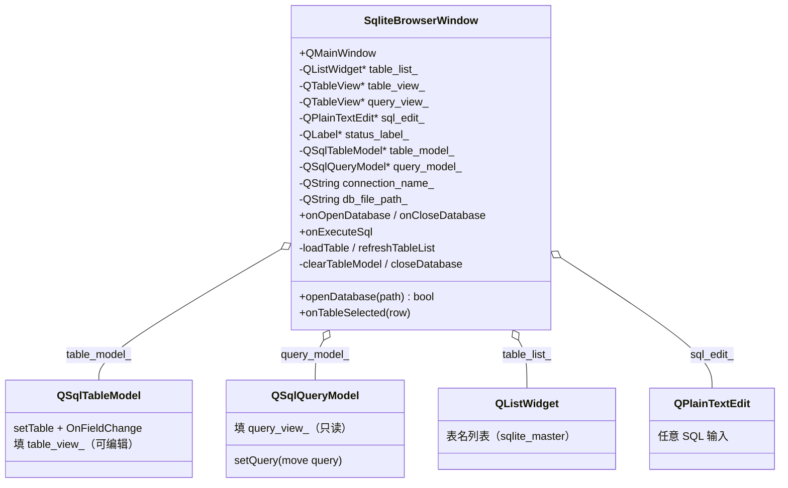
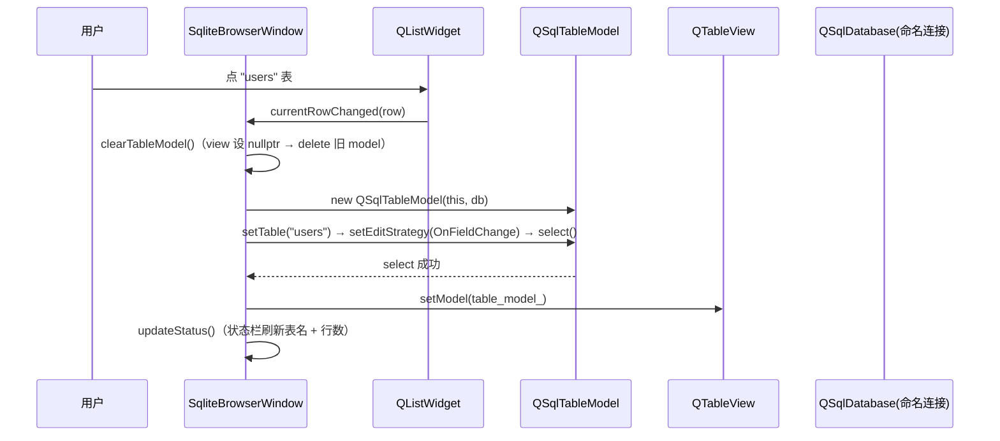

# SQLite Browser 成品导览

> **source**：`app/10-database-tools/sqlite-browser/`　**related**：app 栏数据库工具类整机成品

SQLite Browser 是 app 栏「数据库工具」这一类的整机成品。前面 widget 栏讲究单控件、image-viewer 把「看一张图」做到底；这件换一条线——**把一个 SQLite 文件吃进来，浏览、改、随便跑 SQL**。它的价值不在某个算法多巧，而在把 Qt 的 SQL 模块（`QSqlDatabase` / `QSqlTableModel` / `QSqlQueryModel`）和 Model/View 那套（`QTableView`）织成一台能用的机器，而且把数据库应用里最容易翻车的几个雷——**连接还没释放就去 `removeDatabase`、切表残留旧数据、可编辑表与只读查询混用**——都防住了。

::: tip 本篇是「成品导览」
想直接用成品 → 看这里（架构 / 决策 / 踩坑 / 怎么读）。
想自己从零搓出来 → 转 [手搓手册](./handbook/)。
:::

## 1. 它做什么

一个能用的 SQLite 数据库浏览器：

- **打开**：菜单 / 工具栏 `Open Database…`（Ctrl+O），挑一个 `.db`/`.sqlite`/`.sqlite3` 文件，自动列出里面所有表
- **浏览表**：左边 `QListWidget` 列表点一张表，右边 `QTableView` 显示该表全部行；**可以直接在单元格里改数据**，失焦即提交（OnFieldChange）
- **翻页**：表内容走 Model/View，数据量再大也是按需取，状态栏实时显示行数
- **跑 SQL**：底部 `QPlainTextEdit` 写任意 SQL，按 F5 或 `Execute` 执行——**有结果集**（SELECT）就在下面 `query_view` 出表格（只读），**没结果集**（INSERT/UPDATE/DELETE/DDL）就在状态栏报影响行数
- **关库**：菜单 / 工具栏 `Close Database`，安全释放所有 model 再 `removeDatabase`，不留「connection still in use」的雷

跑起来看一眼：

```bash
cmake -B build -S app && cmake --build build
./build/10-database-tools/sqlite-browser/demo/sqlite-browser_demo
```

## 2. 架构总览

### 类关系

整机就一个核心类 `SqliteBrowserWindow`（QMainWindow），它持有两套「表 → view」的链：**可编辑表**走 `QSqlTableModel` 填进 `table_view_`，**任意 SQL 结果**走只读 `QSqlQueryModel` 填进 `query_view_`。左边 `QListWidget` 列表驱动表选择，底部 `QPlainTextEdit` 驱动 SQL 执行。所有数据库访问都挂在**命名连接**（`connection_name_`）上，从不碰默认连接。



### 文件职责

| 文件 | 职责 |
|---|---|
| `demo/sqlite_browser_window.h` | 主窗口接口：菜单/工具栏/状态栏装配 + 两套 model + 命名连接状态；头注释讲清三条关键设计 |
| `demo/sqlite_browser_window.cpp` | 主窗口实现：命名连接开/关、sqlite_master 列表、OnFieldChange 可编辑表、任意 SQL 走只读 model、安全释放链 |
| `demo/main.cpp` | 入口：QApplication + 主窗口 show |
| `demo/CMakeLists.txt` | 工程配置——`qt_add_executable` + 链接 `Qt6::Sql`（关键：不链 Sql 整个编译都过不了） |

### 点一张表怎么把数据填进表格



重点：**切表前必先 `clearTableModel()`**——先把 view 的 model 设 `nullptr`，再 `delete` 旧 model。顺序反了（先 delete 再 setModel 不会触发，但 view 还握着已删 model 指针）Qt 会打 warning，更糟的是旧 model 还引用着旧 db 连接，关库时 `removeDatabase` 报 `connection still in use`。这条「先松手再 delete」是整份代码的第一条命脉（第二条是「可编辑表 vs 只读查询」用两个不同 model 隔离）。

## 3. 关键设计决策

**① 每个 db 用「命名连接」，不碰默认连接。**
`QSqlDatabase::addDatabase("QSQLITE")`（不传第二参）会挂到默认连接上，多个 db 同时开、或默认连接被别处误用就乱套。这里一律传一个连接名——`makeConnectionName` 用「文件名 + 最后修改时间戳 + 自增序号」拼（`QSqlDatabase` 连接注册表是进程级，basename 相同且 mtime 同秒的多窗口也不撞名），同名 db 反复打开也不撞名。关库时按这个名精确 `removeDatabase`，干净。(`sqlite_browser_window.cpp:139-146`)

**② 关库 / 切表前，先让所有 model「松手」再 delete，最后才 `removeDatabase`。**
`removeDatabase` 的前提是**所有引用该连接的 QSqlDatabase 副本都已销毁**——而 `QSqlTableModel`/`QSqlQueryModel` 内部就握着一份副本。直接 `removeDatabase` 会触发 Qt 经典警告 `QSqlDatabasePrivate::removeDatabase: connection 'xxx' is still in use`，连接也不会真释放。这里的 `closeDatabase` 严格排序：先 `clearTableModel()` + 清 query_model → 再在**嵌套作用域**里 `db.close()`（让 `QSqlDatabase` 副本随作用域析构，引用数回落到 1）→ 最后 `removeDatabase`。(`sqlite_browser_window.cpp:196-219`)

**③ 可编辑表用 `QSqlTableModel` + OnFieldChange，任意 SQL 结果用只读 `QSqlQueryModel`，物理隔离。**
「双击单元格改数据」需要可写 model——`QSqlTableModel` 干这个，配 `OnFieldChange` 失焦即提交；但任意 SQL（尤其多表 JOIN、聚合）没法映射成单表读写，强行塞进 `QSqlTableModel` 会丢编辑能力还容易报错。于是把**两类结果分到两个 view + 两个 model**：表内容填 `table_view_`（可编辑），查询结果填 `query_view_`（只读 `QSqlQueryModel`）。互不污染、各走各的。(`sqlite_browser_window.cpp:282-295` vs `339-341`)

**④ 任意 SQL 先 `QSqlQuery::exec` 探路，用 `isSelect()` 区分「有结果集」与「DML/DDL」，分别处理。**
用户在框里写的可能是 `SELECT`（要出表格）、也可能是 `INSERT/UPDATE/DELETE/CREATE`（不出表格、只报影响行数）。直接拿 `QSqlQueryModel::setQuery(sql)` 会把后者当成无结果查询、表格空着、行数也读不到。这里先用 `QSqlQuery::exec(sql)` 执行，靠 `query.isSelect()` 分流：无结果集读 `numRowsAffected()` 报状态栏、有结果集再把**已 exec 的 query** `std::move` 进 `QSqlQueryModel` 渲染。一次执行、零浪费。(`sqlite_browser_window.cpp:324-348`)

**⑤ `refreshTableList` 全程 `blockSignals(true)`，避免 `clear()` 误触发 `onTableSelected(-1)`。**
`QListWidget::clear()` 会把当前选中项清掉，连带发 `currentRowChanged(-1)`——如果正连着 `onTableSelected`，切库的瞬间就会去 `clearTableModel` + `updateStatus`，逻辑错乱。这里在 clear / addItem 整段区间 `blockSignals(true)`，填完再放开，保证「填列表」和「用户选中」两件事不串台。(`sqlite_browser_window.cpp:235-260`)

## 4. 怎么读这份 code

按这个顺序读，最快建立心智：

1. **`demo/sqlite_browser_window.h` 头注释 + 成员**——先看「窗口握着什么」（两套 model、命名连接、两个 view、列表/SQL 输入），三条关键设计写在头注释里
2. **`setupCentral`**（`sqlite_browser_window.cpp:54`）——QSplitter 怎么切出「左列表|右表格」上区 + 「查询结果|SQL 输入」下区
3. **`openDatabase`**（`sqlite_browser_window.cpp:158`）——命名连接的开法、open 失败的回滚（removeDatabase）
4. **`refreshTableList`**（`sqlite_browser_window.cpp:234`）——查 `sqlite_master` 取表名 + blockSignals 防串台
5. **`loadTable`**（`sqlite_browser_window.cpp:274`）——QSqlTableModel 装配：setTable → OnFieldChange → select → fetchMore → setModel
6. **`clearTableModel`**（`sqlite_browser_window.cpp:221`）——「先 submitAll 再 setModel(nullptr) 再 delete」的微操作，整份代码的防雷核心
7. **`closeDatabase`**（`sqlite_browser_window.cpp:196`）——释放顺序：model → 嵌套作用域 close → removeDatabase
8. **`onExecuteSql`**（`sqlite_browser_window.cpp:301`）——isSelect 分流 + move query 进只读 model

入口：`demo/main.cpp` → `SqliteBrowserWindow` 跑起来，对照读。

## 5. 踩坑

| # | 现象 | 原因 | 后果 | 解法 |
|---|---|---|---|---|
| ① | 关库时控制台刷 `connection 'xxx' is still in use`，连接没真释放 | `removeDatabase` 时还有该连接的 `QSqlDatabase` 副本没销毁（model 内部握一份；取回的 `db` 副本也没出作用域）——这是 Qt 文档明令禁止的反模式 | 连接泄漏、反复开同名 db 可能撞名或资源不回收 | 关库前先 `clearTableModel` + 清 query_model，再在**嵌套作用域**里 `db.close()`（副本随作用域析构、引用数回落到 1），最后 `removeDatabase`（`sqlite_browser_window.cpp:196-219`） |
| ② | 切表后表格显示旧表数据 / `setTable` 报错撞旧引用 | 切表没先清旧 model，新 model 还没建、旧 model 残留 | 表格内容错乱、select 撞到已失效的表/连接 | `loadTable` 第一行就 `clearTableModel()`（`sqlite_browser_window.cpp:275`） |
| ③ | delete model 后 Qt 打 `QAbstractItemView: ...` warning | view 还指着已 delete 的 model，没先 `setModel(nullptr)` 松手 | 控制台噪音、view 可能访问野指针 | `clearTableModel` 里**先** `view->setModel(nullptr)` **再** `delete model`（`sqlite_browser_window.cpp:225-227`） |
| ④ | 同一个 db 反复打开报 `connection already exists`，或多窗口打开 basename 相同且 mtime 同秒的文件互相 invalidate | 用默认连接、或固定连接名、或仅靠文件名+mtime——`QSqlDatabase` 连接注册表是进程级，同名就撞 | 第二次开库失败、或静默串到旧连接导致数据错乱 | `makeConnectionName` 用「文件名 + mtime + `QAtomicInt` 自增序号」拼唯一名，进程内永不撞名（`sqlite_browser_window.cpp:139-146`） |
| ⑤ | 任意 SQL 跑 INSERT 表格空着、状态栏不报行数 | 直接 `QSqlQueryModel::setQuery(sql)` 把 DML 当无结果查询，读不到 `numRowsAffected` | 用户不知道到底改了几行 | 先 `QSqlQuery::exec` 探路，`isSelect()` 分流：DML 报 `numRowsAffected`、SELECT 才进 QueryModel（`sqlite_browser_window.cpp:324-336`） |
| ⑥ | 切库瞬间状态栏乱跳 / 表格被误清 | `refreshTableList` 里 `clear()` 触发 `currentRowChanged(-1)` 串到 `onTableSelected` | 切库时序错乱、表格闪烁 | 填列表全程 `blockSignals(true)`，填完放开（`sqlite_browser_window.cpp:235-260`） |
| ⑦ | 表 >255 行时状态栏报假行数（只显示 256），翻不到底 | SQLite 驱动 `QuerySize=false`，`QSqlTableModel`/`QSqlQueryModel` 只 prefetch 255 行，`rowCount()` 此时只反映已取部分 | 状态栏对大表报错行数、用户以为数据不全、分页判断失效 | `select()`/`setQuery()` 后循环 `while (canFetchMore()) fetchMore();` 拉全量，`rowCount()` 才准（`sqlite_browser_window.cpp:291-294` 与 `342-345`） |
| ⑧ | `OnFieldChange` 编辑器还持焦时切表/关库，最后一条改动丢了 | 失焦即提交，但切表/关库动作抢在失焦之前，最后一条未提交 | 用户改的数据没落库、静默丢失 | `clearTableModel` 先 `table_model_->submitAll()` 兜底提交未落库编辑，再松手 delete（`sqlite_browser_window.cpp:222-227`） |
| ⑨ | 错误信息只显示一半（要么数据库层、要么驱动层） | 手动只取 `databaseText()` 或 `driverText()`，漏了另一层 | 用户看到不完整错误、排查困难 | 错误文本统一用 `err.text()`（= `databaseText()` + `driverText()` 标准拼接），见 `onExecuteSql` 里 `err.text()`（`sqlite_browser_window.cpp:326-327`） |

## 6. 官方文档

- [QSqlDatabase / 命名连接](https://doc.qt.io/qt-6/qsqldatabase.html)——`addDatabase(driver, connectionName)` / `database(name)` / `removeDatabase`，连接生命周期
- [QSqlTableModel / EditStrategy](https://doc.qt.io/qt-6/qsqltablemodel.html)——可编辑表 model，`OnFieldChange`/`OnRowChange`/`OnManualSubmit` 三种提交策略
- [QSqlQueryModel](https://doc.qt.io/qt-6/qsqlquerymodel.html)——只读结果集 model，`setQuery(QSqlQuery&&)`
- [QSqlQuery / isSelect / numRowsAffected](https://doc.qt.io/qt-6/qsqlquery.html)——任意 SQL 执行、结果集 vs DML 判定
- [QTableView](https://doc.qt.io/qt-6/qtableview.html)——表格式 view
- [QSplitter](https://doc.qt.io/qt-6/qsplitter.html)——上/下、左/右分区
- [QMainWindow / QAction / QToolBar / QStatusBar](https://doc.qt.io/qt-6/qmainwindow.html)——整机装配
- [sqlite_master](https://www.sqlite.org/schematab.html)——SQLite 内置模式表，查 `SELECT name FROM sqlite_master WHERE type='table'` 列所有表

---

这套「命名连接 + 两套 model 隔离可编辑/只读 + 安全释放链」是数据库类整机应用的通用骨架——任何「打开库 → 浏览表 → 改数据 → 跑 SQL」的工具（MySQL/Postgres 客户端、配置库编辑器、日志查看器）都能换皮复用。想自己搓？[手搓手册](./handbook/)带你从一个空 QMainWindow 一行行搓到这个成品。
