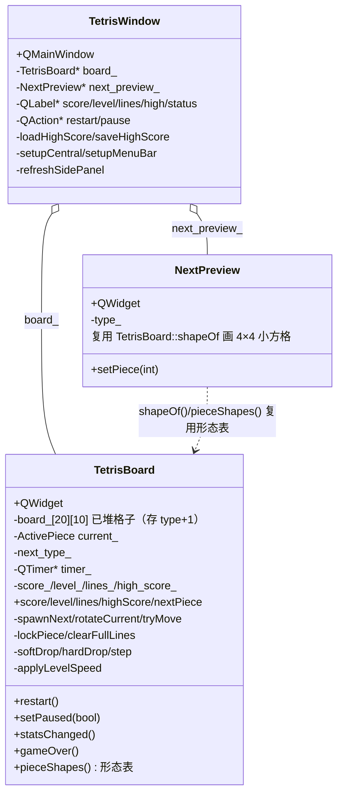
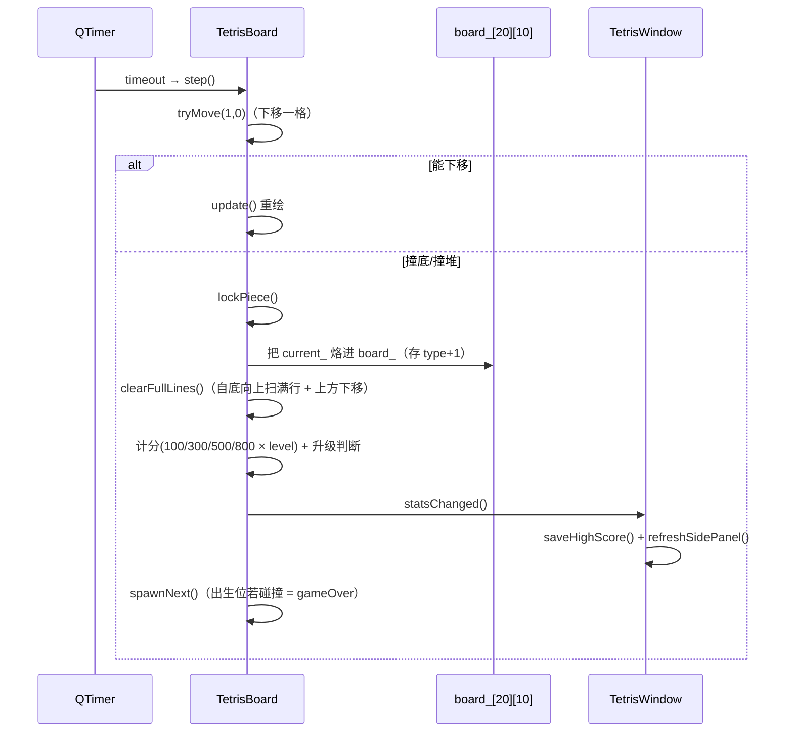

# Tetris 成品导览

> **source**：`app/08-games/tetris/`　**related**：app 栏游戏类整机成品

Tetris 是 app 栏「游戏」这一类的整机成品。前面 widget 栏讲究单控件、sqlite-browser 讲究「把模块织成一台能用的机器」；这件换一条线——**不靠任何控件框架，纯 QPainter 自绘出一个能玩的俄罗斯方块**。它的价值不在某个算法多巧，而在把游戏循环里最容易翻车的几个雷——**形态表写错位、旋转撞墙卡死、消行行移污染、副面板和棋盘的状态同步、键盘焦点被主窗口抢走**——都防住了，而且把「自绘 + QTimer + 键盘事件 + QPainter」这一套 Widgets 游戏骨架走通。

::: tip 本篇是「成品导览」
想直接用成品 → 看这里（架构 / 决策 / 踩坑 / 怎么读）。
想自己从零搓出来 → 转 [手搓手册](./handbook/)。
:::

## 1. 它做什么

一个能玩的俄罗斯方块：

- **下落 + 旋转 + 平移**：方向键 ←→ 移、↑ 旋转、↓ 软降、Space 硬降到底，P 暂停，R 重开
- **7 种经典方块**：I/O/T/S/Z/J/L，每种预排 4 个旋转态，颜色按经典约定（青/黄/紫/绿/红/蓝/橙）
- **碰撞 + 壁踢**：旋转后撞墙/撞底时自动尝试左/右/上踢，全部失败才回滚不转（简化版，非 SRS）
- **消行 + 计分 + 等级加速**：1/2/3/4 行 = 100/300/500/800 分（乘当前等级），每 10 行升 1 级、下落变快（每级减 60ms，下限 80ms）
- **投影**：当前方块在棋盘上的落点画半透明虚线投影，方便瞄准
- **副面板**：右侧 Next 预览（下一块形态）+ SCORE/LEVEL/LINES/BEST + 操作说明
- **最高分持久化**：用 `QSettings` 把历史最高分存进注册表/ini，重开程序还在

跑起来看一眼：

```bash
cmake -B build -S app && cmake --build build
./build/08-games/tetris/demo/tetris_demo
```

## 2. 架构总览

### 类关系

整机三个类：`TetrisBoard`（自绘棋盘 QWidget，游戏逻辑全在这）+ `NextPreview`（Next 副面板自绘 QWidget，复用 `TetrisBoard` 的形态表画小方格组）+ `TetrisWindow`（QMainWindow，只管装配、键盘兜底、副面板刷新、最高分持久化）。棋盘状态变化发 `statsChanged()` 让窗口刷副面板，`gameOver()` 让窗口落最高分。所有游戏逻辑（出生/旋转/碰撞/锁定/消行/计分/等级）都封装在 `TetrisBoard`，窗口不碰棋盘数据。



### 文件职责

| 文件 | 职责 |
|---|---|
| `demo/tetris_board.h` | 棋盘接口：常量（10×20 棋盘、4×4 包络）+ `PieceShape` 公开（供 NextPreview 复用）+ 游戏逻辑私有方法；头注释讲清 4×4 包络 + 简化壁踢 + board 存 type+1 三条关键设计 |
| `demo/tetris_board.cpp` | 棋盘实现：7 形态方块预排 4 旋转态（字符串字面量可读化）、QTimer 下落、碰撞/旋转壁踢/锁定、消行行移（自底向上）、自绘渲染（网格+方块+投影+遮罩）、立体格绘制（高光左上阴影右下） |
| `demo/tetris_window.h` | 主窗口 + NextPreview 接口：装配骨架、键盘兜底、QSettings 最高分键 |
| `demo/tetris_window.cpp` | 主窗口实现：QHBoxLayout 装棋盘+副面板、菜单 Game/Help、`statsChanged`→`refreshSidePanel` 刷面板 / `gameOver`+`closeEvent`→落最高分、NextPreview 居中画下一块 |
| `demo/main.cpp` | 入口：设 applicationName/organizationName（QSettings 要用）+ 主窗口 show |
| `demo/CMakeLists.txt` | 工程配置——`qt_add_executable` + 链 `Qt6::Widgets`（游戏自绘不用 Sql/Network） |

### 一个方块从「下落」到「锁定 + 消行」怎么走



重点：**锁定后必先消行结算、再出新块**；`spawnNext` 内部检测「出生位即碰撞」判定堆顶 game over（停钟 + 发 `gameOver()`）。这条「锁定 → 消行 → 结算 → 出新块 → 检测堆顶」是整份代码的游戏循环命脉。

## 3. 关键设计决策

**① 7 种方块的 4 个旋转态全部预排成静态表，不在运行时转置。**
运行时算旋转（矩阵转置 + 行反转）极易写错翻转方向，I 型这种满宽方块尤其坑。这里把每种方块 4 个旋转态用「`####`/`..#.` 这样的字符串字面量」逐态手填成 4×4 矩阵（`mk` lambda 翻成 int），可读性远胜手填 0/1，且旋转态静态化后方向永远对。代价是表有点长，但**永不旋转 bug**。(`tetris_board.cpp:20-92`)

**② 方块用统一 4×4 包络，旋转在包络内进行；撞墙靠「壁踢序列」而非 SRS。**
SRS（Super Rotation System）的踢墙表复杂且分方块。这里用简化版：旋转后若碰撞，依次试「原位 → 左1 → 右1 → 左2 → 右2 → 上1」六个位置，任一不撞就采用，全失败回滚不转。实测足够防 99% 的卡墙场景，代码量是 SRS 的零头。(`tetris_board.cpp:184-202`)

**③ `board_` 存「方块类型 + 1」，让「空(0)」与「I 型(0 型)」可区分。**
若直接存 `type`（0..6），`board_[r][c] == 0` 就有歧义——既可能是空格，也可能是 I 型（type=0）的格子。这里锁定时存 `type + 1`（1..7），0 专属「空」，`paintEvent` 取色时 `shapeOf(type_plus1 - 1).color` 还原。一个 +1 消掉一类边界 bug。(`tetris_board.cpp:256`、`paintEvent` 取色 `tetris_board.cpp:429`)

**④ 消行行移「自底向上」处理，同位置连锁满行用 `++r` 抵消 `--r`。**
扫满行必须从下往上（`r` 从 19 递减到 0）——否则某行下移后会把尚未检查的行覆盖掉。更深一层：一行被上方填满的行下移后，**它自己可能又满了**（连锁），所以处理完一行后要 `++r` 抵消 for 循环的 `--r`，让下一轮重检同一行。漏掉这步会导致连锁消行少消。(`tetris_board.cpp:283-308`)

**⑤ 焦点交给棋盘 `Qt::StrongFocus`，方向键走棋盘 `keyPressEvent`，R/P 交 Game 菜单 `QAction`；`NextPreview` 复用 `TetrisBoard` 的形态表，杜绝形态定义漂移。**
子控件默认不抢键盘焦点，棋盘不设 StrongFocus 就收不到方向键。方向键走棋盘自己的 `keyPressEvent`；`Key_R`/`Key_P` 由 Game 菜单的 `QAction`（`WindowShortcut`）统一处理，窗口 `keyPressEvent` 不再重复绑定（避免三处重复绑定单键双触发/漏触发），棋盘 `keyPressEvent` 保留 `Key_P` 供 offscreen/自动化直投走。Next 副面板**不重复定义形态**——直接调 `TetrisBoard::shapeOf(type)` 取矩阵和颜色，棋盘改形态表副面板自动同步。(`tetris_board.cpp:99`/`401-403`、`tetris_window.cpp:256-260`、`tetris_window.cpp:53`/`73`)

## 4. 怎么读这份 code

按这个顺序读，最快建立心智：

1. **`demo/tetris_board.h` 头注释 + 常量**——先看棋盘多大（10×20）、方块多大（4×4）、`PieceShape` 结构、4 条关键设计
2. **`pieceShapes`**（`tetris_board.cpp:20`）——7 种方块怎么用字符串字面量定义 4 旋转态、颜色怎么配
3. **`collides`**（`tetris_board.cpp:160`）——碰撞判定：边界 + 已堆格子，行允许负（出生缓冲）
4. **`rotateCurrent`**（`tetris_board.cpp:184`）——壁踢序列怎么试、全失败怎么回滚
5. **`lockPiece` + `clearFullLines`**（`tetris_board.cpp:219`/`283`）——锁定存 type+1、消行自底向上 + 连锁 `++r`、计分与升级
6. **`step` + `applyLevelSpeed`**（`tetris_board.cpp:331`/`340`）——QTimer tick 下落到底锁定、等级 → interval（下限 80ms）
7. **`paintEvent`**（`tetris_board.cpp:413`）——自绘顺序：已堆方块 → 网格 → 边框 → 投影 → 当前方块 → 暂停/结束遮罩；投影怎么算（按整块行偏移一路下落到撞底）
8. **`drawBlock`/`drawGhost`**（`tetris_board.cpp:502`/`521`）——立体感（高光左上、阴影右下）+ 投影半透明虚线
9. **`tetris_window.cpp::setupCentral`**（`tetris_window.cpp:115`）——QHBoxLayout 棋盘 + 副面板，副面板 make_row lambda 造 SCORE/LEVEL/LINES/BEST
10. **`NextPreview::paintEvent`**（`tetris_window.cpp:46`）——怎么复用形态表、怎么算包围盒居中（避免方块在框里跳）
11. **`keyPressEvent`**（`tetris_window.cpp:256`）——主窗口只兜底 R/P，其余交棋盘
12. **`loadHighScore`/`saveHighScore`**（`tetris_window.cpp:234`/`239`）——QSettings 持久化、为什么要在 board 构造后回填 high_score_

入口：`demo/main.cpp` → `TetrisWindow` 跑起来，对照读。

## 5. 踩坑

| # | 现象 | 原因 | 后果 | 解法 |
|---|---|---|---|---|
| ① | 主窗口装配后，棋盘收不到方向键 | 子控件默认不抢键盘焦点，`setFocusPolicy` 没设或设成 `NoFocus` | 游戏完全没法玩、按键无响应 | 构造时 `setFocusPolicy(Qt::StrongFocus)`；窗口装配后 `board_->setFocus()` 确保焦点在棋盘（`tetris_board.cpp:99`、`tetris_window.cpp:190`） |
| ② | 旋转后方块翻转方向错乱 / I 型旋转扭曲 | 运行时算转置（矩阵转置 + 行反转）方向写反，或包络尺寸不统一 | 方块形态对不上、游戏体验崩 | 4 旋转态全部预排静态表（字符串字面量），不在运行时算（`tetris_board.cpp:20-92`） |
| ③ | 方块贴墙旋转直接失败（卡墙） | 旋转后撞墙没做壁踢，硬性回滚 | I 型贴墙转不过来、玩家被墙逼死 | 壁踢序列试 6 个偏移（原位→左1→右1→左2→右2→上1），任一不撞采用，全失败才回滚（`tetris_board.cpp:184-202`） |
| ④ | `board_[r][c] == 0` 把 I 型格子误判成空格 | board 直接存 `type`，I 型 type=0 与「空格 0」撞值 | I 型方块锁定后「消失」、消行逻辑错乱 | 锁定存 `type + 1`（1..7），0 专属空格，取色 `type_plus1 - 1`（`tetris_board.cpp:256`、`paintEvent` 取色 `429`） |
| ⑤ | 连锁消行只消了一部分 / 多消了 | `clearFullLines` 自顶向下扫（下移污染未检行）；或满行下移后没重检同位置 | 消行数不对、计分错乱、棋盘残留 | 自底向上扫（`r` 递减）；处理一行后 `++r` 抵消 `--r` 重检同一位置（连锁）（`tetris_board.cpp:287-305`） |
| ⑥ | 暂停后计时器没停，方块还在下落 / 恢复后速度乱了 | `setPaused` 只改 `paused_` 标志没动 timer，或 `step` 没查标志 | 暂停形同虚设、不公平 | `setPaused` 里 `paused_` + `timer_->stop()/start()`；`step` 入口查 `paused_`/`game_over_` 双保险（`tetris_board.cpp:331-334`、`356-367`） |
| ⑦ | 高级等级下方块下落快到不可玩 | `interval` 没下限，高等级 interval 趋近 0 | 游戏后半段无法操作、体验崩 | `applyLevelSpeed` 用 `std::max(80, 700 - (level-1)*60)` 兜底 80ms（`tetris_board.cpp:340-344`） |
| ⑧ | 重开程序后最高分丢了 / 显示为 0 | `QSettings` 没 set applicationName/organizationName，或 board 构造时 restart 把 high_score_ 清零后没回填 | 持久化失效、玩家分数白打 | main 设 applicationName/orgName；窗口构造后 `board_->setHighScore(loadHighScore())` 回填；最高分落盘推迟到 `gameOver` + `closeEvent`（`statsChanged` 只刷面板、不写盘）（`main.cpp:13-14`、`tetris_window.cpp:101-102`/`106-110`、`234-242`/`262-266`） |
| ⑨ | Next 副面板画的下一块位置乱跳 / 形态跟棋盘对不上 | 副面板自己重定义形态，或没按包围盒居中（不同方块格子分布不同） | 预览不准、误导玩家 | 副面板复用 `TetrisBoard::shapeOf(type)`，画前算 4×4 矩阵的 min/max 包围盒再居中（`tetris_window.cpp:53-73`） |
| ⑩ | 投影画在缝隙形（S/Z）上错位 | 投影按单格逐个算落点，缝隙形上下格落点不同步 | 投影位置与真实落点不符 | 投影按整块行偏移算（`ghost_dr` 一路下落直到整块撞底），整块同步移动（`tetris_board.cpp:453-457`） |
| ⑪ | 硬降分数没加 / 软降每格分不一致 | `softDrop`/`hardDrop` 计分没实现或写错（硬降应 +2/格、软降 +1/格） | 计分机制缺失、玩法变味 | softDrop `tryMove` 成功 `score_ += 1`；hardDrop `while(tryMove)` 数 dropped，`score_ += dropped*2`（`tetris_board.cpp:310-329`） |
| ⑫ | 方块被踢到棋盘顶外（br<0）锁定时，部分格子凭空消失，且未判 game over | `lockPiece` 遍历写盘时对 `br<0` 的格子直接 `continue` 丢弃（只当双保险），没在锁定前判定顶出 | 方块形态被截断、堆到顶却继续游戏（漏判结束） | `lockPiece` 写盘前先扫一遍：任一格 `current_.row + r < 0` 即判顶出 game over（停钟 + 刷分 + emit gameOver + return）（`tetris_board.cpp:222-242`） |
| ⑬ | P/R 键被多处重复绑定，行为不一致 / offscreen 自动化投键到棋盘不生效 | `QAction`（WindowShortcut）+ 棋盘 `keyPressEvent` + 窗口 `keyPressEvent` 三处都绑同一键 | 真实 UI 下 QAction 先 accept、棋盘收不到；自动化直投棋盘又走另一条路，单键双触发或漏触发 | 棋盘 `keyPressEvent` 保留 `Key_P`（真实 UI 经事件派发链时 QAction 先命中不冲突；offscreen 直投棋盘走这条）；窗口 `keyPressEvent` 删掉 `Key_P`/`Key_R` 死代码；`Key_R` 仍交 QAction（R 不需 offscreen 测）（`tetris_board.cpp:401-403`、`tetris_window.cpp:256-260`） |
| ⑭ | 狂按 ↓ 时疯狂写盘（CPU/磁盘抖动），中途关窗最高分可能丢 | `statsChanged` 回调里直接 `saveHighScore`（QSettings 落盘），而 softDrop 每格 +1 都 emit 一次 | 高频无效 I/O、性能差；落盘只挂在信号上则中途关窗来不及落 | `statsChanged` 只刷副面板（不落盘）；最高分落盘推迟到 `gameOver` + `closeEvent` override（新增，保中途关窗不丢分）（`tetris_window.cpp:106`、`107-110`、`262-266`） |

## 6. 官方文档

- [QPainter 绘图基础](https://doc.qt.io/qt-6/qpainter.html)——`fillRect`/`drawLine`/`drawRect`/`setPen`/`setBrush`，自绘棋盘的核心
- [QWidget / paintEvent](https://doc.qt.io/qt-6/qwidget.html)——`paintEvent` 重绘、`setFocusPolicy(StrongFocus)`、`sizeHint`、`update()`
- [QKeyEvent / keyPressEvent](https://doc.qt.io/qt-6/qkeyevent.html)——键盘事件、`Qt::Key_Left` 等键码
- [QTimer](https://doc.qt.io/qt-6/qtimer.html)——游戏循环 tick、`setInterval`/`start`/`stop`、`timeout` 信号
- [QColor / lighter / darker](https://doc.qt.io/qt-6/qcolor.html)——方块取色、立体感高光/阴影
- [QRandomGenerator](https://doc.qt.io/qt-6/qrandomgenerator.html)——随机出块 `bounded(7)`
- [QMainWindow / QMenuBar / QAction / QStatusBar](https://doc.qt.io/qt-6/qmainwindow.html)——整机装配、菜单、状态栏
- [QSettings](https://doc.qt.io/qt-6/qsettings.html)——最高分持久化，`applicationName`/`organizationName` 与键的关系
- [QHBoxLayout / QVBoxLayout](https://doc.qt.io/qt-6/qboxlayout.html)——棋盘 + 副面板布局

---

这套「自绘棋盘 + QTimer 游戏循环 + 键盘路由 + 副面板状态同步 + QSettings 持久化」是纯 Widgets 游戏类整机应用的通用骨架——任何「自绘画布 + 节拍驱动 + 状态机」的小游戏（贪吃蛇、扫雷、2048、俄罗斯方块变体）都能换皮复用。想自己搓？[手搓手册](./handbook/)带你从一个空自绘 QWidget 一行行搓到这个成品。
