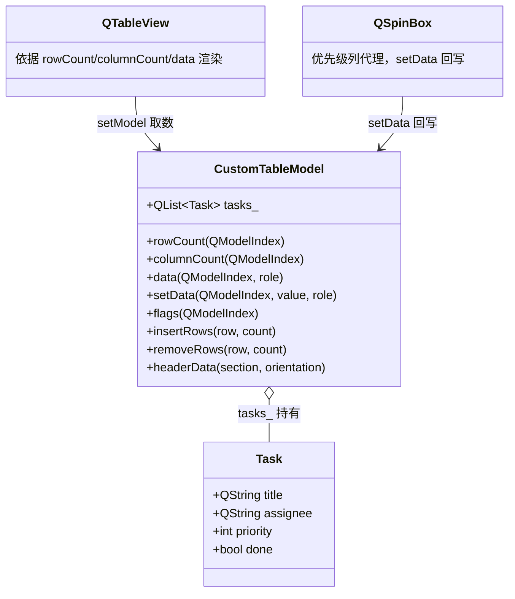
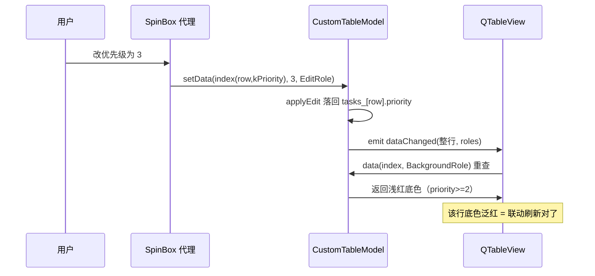

# CustomTableModel 成品导览

> **source**：`model/01-mv-pattern/custom-model/`　**related**：Model/View 章第 1 环（自管数据源模型）

CustomTableModel 是个自定义表格模型——子类化 `QAbstractTableModel`，自己管一份 `QList<Task>` 数据源，配 `QTableView` 展示编辑。它是 model 栏第一件成品，也是理解整个 Model/View 体系的入口：Qt 把「数据怎么存」「数据怎么显示」「数据怎么编辑」彻底解耦，模型只负责前两件事的「存 + 暴露」，视图和代理各自管显示和编辑。

听起来抽象，但这件成品把一个自定义模型该占的全占了——五大虚函数、多角色 data、可编辑 setData、增删行配 begin/end 信号、表头——后面任何自定义模型都是这套骨架的变体。

::: tip 本篇是「成品导览」
想直接用成品 → 看这里（架构 / 决策 / 踩坑 / 怎么读）。
想自己从零搓出来 → 转 [手搓手册](./handbook/)。
:::

## 1. 它做什么

一个 `AwesomeQt::CustomTableModel` 模型，内部持有 `QList<Task>`，对外是一个 4 列的任务表：

- **自管数据源**：行数据就是模型自己的 `tasks_` 成员（`QList<Task>`），不依赖数据库或 QSqlTableModel
- **多角色 data**：一个单元格同时回答 DisplayRole(文本) / EditRole(编辑值) / TextAlignmentRole(对齐) / BackgroundRole(底色) / ForegroundRole(前景) / FontRole(删除线) / ToolTipRole(悬停提示)
- **可编辑**：`setData` + `flags` 返回 `Qt::ItemIsEditable`，双击单元格回写结构体
- **增删行**：`insertRows` / `removeRows` 用 `beginInsertRows`/`endInsertRows` 包夹容器改动，视图自动刷新行数
- **表头**：`headerData` 给列标题和行号

跑起来看一眼比读十行描述管用：

```bash
cmake -S model/01-mv-pattern/custom-model -B build -DCMAKE_PREFIX_PATH=/usr/lib/cmake/Qt6
cmake --build build -j"$(nproc)"
./build/demo/custom-model_demo
```

## 2. 架构总览

### 类关系

模型是数据的「Qt 门面」，视图（QTableView）只通过模型接口拿数；代理（QSpinBox 等）通过 setData 回写：



关键：`tasks_` 是模型**独占**的，视图不直接碰它——视图所有问题（「第 3 行第 2 列显示什么」）都通过 `data(index, role)` 问模型。这就是 Model/View 解耦的核心：换数据源（改成查数据库）只动模型内部，视图一行不改。

### 文件职责

| 文件 | 职责 |
|---|---|
| `include/custom-model.h` | 接口：Task 结构体 + Column 枚举 + 五大虚函数声明 + 便捷 API |
| `src/custom-model.cpp` | 实现：data 多角色分发 / setData 回写 / insert-remove 配 begin/end 信号 / headerData |
| `demo/custom-model_window.cpp` | 演示：QTableView 装模型 + 增删行按钮 + 优先级列 SpinBox 代理 |

### 编辑后怎么刷新到屏幕



## 3. 关键设计决策

**① 行数据放普通结构体，不放 QObject。**
`Task` 是个 POD 结构体，不是 `QObject` 子类。模型持有 `QList<Task>`，所有接口围绕这份列表。这凸显了自定义模型的魂：**自管数据源**——数据可以是任何容器（`QList<POD>` / `QVector<自定义类>` / 甚至一行数据库游标），模型只是这份数据的 Qt 门面。把行数据做成 QObject 会绑死对象树、徒增开销，没有任何收益。

**② data 用一个大 switch 分发所有 role。**
一个单元格能同时回答「显示文本 / 编辑值 / 怎么对齐 / 底色 / 前景 / 字体 / 悬停提示」七种问题——全靠 `data(index, role)` 里一个 `switch(role)` 分发（`src/custom-model.cpp:63`）。列相关的逻辑（某列显示什么文本）抽到私有 `displayText`/`editValue`，避免 switch 里嵌套 switch 难读。

**③ 增删行必须用 begin/end 模型索引信号包夹容器改动。**
`insertRows` 里 `beginInsertRows` → 改 `tasks_` → `endInsertRows`（`src/custom-model.cpp:174,180`），`removeRows` 同理。**漏掉 begin/end 是自定义模型最常见的崩溃源**——视图还按旧行数拿数，模型容器已经变了，越界访问直接 segfault。信号不是可选优化，是协议。

**④ setData 发 dataChanged 时列范围给整行。**
改一个字段可能连带改其它角色的表现（改优先级 → 底色泛红 → 字色变灰）。所以 `dataChanged` 的列范围传整行 `[0, kColumnCount-1]`，roles 列表把可能变的角色都列上（`src/custom-model.cpp:139`）。宁可多通知视图重查一次，也不要漏掉该刷新的单元格。

**⑤ 边界保护贯穿每个虚函数。**
`data` / `setData` / `insertRows` / `removeRows` 全部先验 index 合法性，越界返回空/`false`（如 `src/custom-model.cpp:53-59`）。视图在动画、滚动、异步刷新过程中可能塞进脏 index，不做保护就是定时炸弹。

## 4. 怎么读这份 code

按这个顺序读，最快建立 Model/View 心智：

1. **`include/custom-model.h` 的 Task 结构体 + Column 枚举**（19、41 行）——先看「数据长什么样、列怎么编号」
2. **`rowCount` / `columnCount`**（`src/custom-model.cpp:32,40`）——模型几何，注意 `parent.isValid()` 返回 0（表格无父子层级）
3. **`data`**（`src/custom-model.cpp:51`）——取数核心，盯着 `switch(role)` 看七种角色怎么分发
4. **`flags` + `setData`**（`src/custom-model.cpp:149,118`）——可编辑链路：flags 给 `ItemIsEditable`，setData 落值 + 发 `dataChanged`
5. **`insertRows` / `removeRows`**（`src/custom-model.cpp:161,188`）——增删行，重点看 `beginInsertRows`/`endInsertRows` 怎么包夹容器改动
6. **`headerData`**（`src/custom-model.cpp:210`）——表头，水平给列名、垂直给行号

入口：`demo/main.cpp` → `demo/custom-model_window.cpp` 跑起来，对照读。

## 5. 踩坑

| # | 现象 | 原因 | 后果 | 解法 |
|---|---|---|---|---|
| ① | 增删行后视图崩溃或显示错乱 | `insertRows`/`removeRows` 改了容器却漏掉 `beginInsertRows`/`endInsertRows` | **segfault**（视图按旧行数访问） | 容器改动必须用 begin/end 信号包夹（`src/custom-model.cpp:174,180`） |
| ② | 双击单元格进不了编辑态 | `flags` 没返回 `Qt::ItemIsEditable` | 无法编辑 | flags 返回 `ItemIsEditable`（`src/custom-model.cpp:154`） |
| ③ | 编辑后单元格不刷新 / 底色不变 | `setData` 改了值却没发 `dataChanged`，或 roles/列范围漏了 | 屏幕数据陈旧（非崩溃） | 改完发 `dataChanged`，列范围给整行、roles 列全（`src/custom-model.cpp:139`） |
| ④ | 滚动或动画时偶发崩溃 | `data`/`setData` 没做 index 边界保护 | **segfault**（脏 index） | 每个虚函数先验 index 合法性（`src/custom-model.cpp:53`） |
| ⑤ | 优先级改了底色不泛红 | 以为 dataChanged 只通知 DisplayRole 就够 | BackgroundRole 没重查 | roles 列表把 BackgroundRole 等连带角色都列上（`src/custom-model.cpp:140`） |
| ⑥ | rowCount 在某些视图返回了非零导致死循环 | `rowCount(parent)` 没判断 parent 有效性，表格被当成有子项 | 视图无限递归铺行 | parent 有效时返回 0（`src/custom-model.cpp:34`） |
| ⑦ | 优先级 SpinBox 塞进 999 | `applyEdit` 没夹范围 | 数据越界、底色逻辑乱 | applyEdit 把 priority 夹到 0..3（`src/custom-model.cpp:307`） |

## 6. 官方文档

- [QAbstractTableModel](https://doc.qt.io/qt-6/qabstracttablemodel.html)——表格模型基类，子类化的起点
- [Model/View 编程](https://doc.qt.io/qt-6/model-view-programming.html)——Model/View 架构总论
- [QAbstractItemModel](https://doc.qt.io/qt-6/qabstractitemmodel.html)——更上层的基类，五大虚函数的契约定义在这
- [Qt::ItemDataRole](https://doc.qt.io/qt-6/qt.html#ItemDataRole-enum)——data 要分发的所有角色枚举
- [QModelIndex](https://doc.qt.io/qt-6/qmodelindex.html)——模型索引，data/setData 的定位凭据
- [QTableView](https://doc.qt.io/qt-6/qtableview.html)——配套视图

---

这套机制（自管数据源 + 五大虚函数 + begin/end 信号 + 多角色 data）不是 CustomTableModel 专属——它就是「一个自定义表格模型」的标准范式。任何「我有自己的数据结构，想用 QTableView 展示编辑」的需求，都是这套骨架的变体。想自己搓？[手搓手册](./handbook/)带你从空 main 一行行搓到这个成品。
