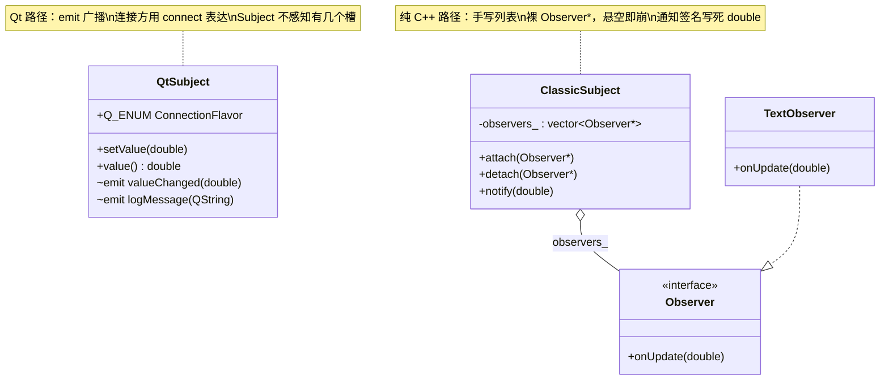
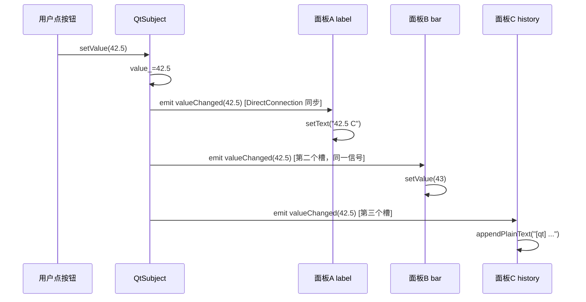

# Observer Pattern 成品导览

> **source**：`model/12-design-patterns/observer-pattern/`　**related**：[信号与槽（入门）](../../../../beginner/01-qtbase/02-signal-slot-beginner.md) · [信号与槽（进阶）](../../../../advanced/01-qtbase/02-signal-slot-advanced.md)

这份成品要回答一个问题：**Qt 的信号槽，跟教科书里的「观察者模式」到底是什么关系？** 答案一句话——信号槽就是编译期类型安全的观察者。但光说没用，所以这里把它做出来：一个温度 Subject 用 Qt 信号槽广播给多个面板，旁边并排跑一份纯 C++ 的 `Observer` 接口 + `attach/detach/notify`，让你直接对照两条路的代码量和坑。

::: tip 本篇是「成品导览」
想直接用成品 → 看这里（架构 / 决策 / 踩坑 / 怎么读）。
想自己从零搓出来 → 转 [手搓手册](./handbook/)。
:::

## 1. 它做什么

一个 `AwesomeQt::QtSubject`（温度源）每推一个新值就 `emit valueChanged`，下游连了几个槽就刷几块面板：

- **面板 A 数值显示**（`QLabel`）——同步刷新当前温度
- **面板 B 进度条**（`QProgressBar`）——同一信号第二个槽，把温度映射成 0..100
- **面板 C 历史日志**（`QPlainTextEdit`）——同一信号第三个槽，演示「一个信号连多槽」的一对多广播，还能演示 `disconnect`
- **面板 D 纯 C++ 对照**（`QPlainTextEdit`）——走 `ClassicSubject::attach/notify` 的老式 observer，不继承 `QObject`，跟 Qt 路径并排跑

控制区还有三个按钮把教学点演全：切换 `DirectConnection`(同步)/`QueuedConnection`(异步)、断开面板 C、演示 lambda 连接的生命周期坑。

跑起来看一眼比读十行描述管用：

```bash
cmake -S model/12-design-patterns/observer-pattern -B build -DCMAKE_PREFIX_PATH=/usr/lib/cmake/Qt6
cmake --build build -j"$(nproc)"
./build/demo/observer-pattern_demo
```

## 2. 架构总览

### 类关系

两条平行路径，共用同一个温度语义，但通知机制完全不同：



核心对比：`QtSubject` 自己**不知道**有几个观察者，`emit` 完事；`ClassicSubject` 得自己维护 `vector<Observer*>`，手动遍历 `notify`。

### 文件职责

| 文件 | 职责 |
|---|---|
| `include/observer-pattern.h` | 接口：`Observer` 纯虚接口 + `ClassicSubject`(attach/detach/notify) + `QtSubject`(信号槽版) |
| `src/observer-pattern.cpp` | 实现：纯 C++ 列表管理 + Qt `setValue` 的 emit |
| `demo/observer-pattern_window.cpp` | 演示：四个面板 + 连接类型切换 + disconnect + lambda 陷阱 |

### 一条温度值怎么同时刷三个面板



重点：**一次 `emit`，三个槽依次同步跑完**——这就是一对多广播，Subject 端只写一行 `emit valueChanged(temperature)`（`src/observer-pattern.cpp:50`）。

## 3. 关键设计决策

**① Qt 信号槽 = 编译期类型安全的观察者，对照裸 `void*` 擦除。**
`connect(sender, &QtSubject::valueChanged, receiver, slot)` 的信号签名就是通知契约，连错类型（如槽写成 `int`）编译期直接报错。而 `ClassicSubject::onUpdate(double)` 是写死的虚函数签名，换数据类型就得改接口（`include/observer-pattern.h:31`）。信号槽还顺带免掉了「手动维护 observer 列表」这整层。

**② 一个信号连多槽 = 一对多广播，Subject 端零感知。**
面板 A/B/C 三个 `connect` 连的是**同一个** `valueChanged`（`demo/observer-pattern_window.cpp:145/149/157`），但 `QtSubject::setValue` 只写一次 `emit`（`src/observer-pattern.cpp:50`）。这是信号槽相对 GoF observer list 最直观的简化——Subject 不再持列表、不再 `for` 循环 notify。

**③ 连接类型 `DirectConnection`/`QueuedConnection` 对应同步/异步通知。**
demo 的单选框切换后重连面板 C（`demo/observer-pattern_window.cpp:186`）：同步 = 在 `emit` 处直接调槽、阻塞返回；异步 = 投递一个事件到接收方线程事件循环、`emit` 立刻返回。跨线程通信必须用 `QueuedConnection`（或 `AutoConnection` 自动选），否则槽跑在错误线程。

**④ 断开连接用保存的 `QMetaObject::Connection`，最稳。**
`disconnect` 有多种重载，但 lambda 连接拿不回原 functor（lambda 无 `==`），没法按 `disconnect(sender,sig,receiver,functor)` 断（`demo/observer-pattern_window.cpp:203` 注释）。正路是 `connect` 返回值存进成员，`disconnect(conn)` 一行断掉（`demo/observer-pattern_window.cpp:209`）。

**⑤ lambda 连接必给 context 对象，否则生命周期失控。**
`connect(sender, sig, lambda)`（无 context）的连接不跟随任何对象，sender 还在发、lambda 捕获的对象先销毁 → 回调到野指针。给个 context（第 3 参），context 被 `delete` 时连接自动失效（`demo/observer-pattern_window.cpp:224` 的 `context_label` 演示）。

## 4. 怎么读这份 code

按这个顺序读，最快建立心智：

1. **`include/observer-pattern.h` 的 `Observer` 纯虚接口**（28 行）——先看 GoF 原版长啥样，一个 `onUpdate(double)` 写死签名
2. **`ClassicSubject` 的 attach/detach/notify**（`src/observer-pattern.cpp:17/24/32`）——纯 C++ 手写「注册/注销/广播」全套，注意 `notify` 里 `for` 循环遍历裸指针
3. **`QtSubject::setValue`**（`src/observer-pattern.cpp:46`）——对照上面：这里 Subject **完全不管**有几个观察者，一行 `emit valueChanged` 完事
4. **`demo/observer-pattern_window.cpp:145-157`**——三个 `connect` 连同一信号，看一对多广播怎么落地
5. **`toggleConnectionType`**（`demo/observer-pattern_window.cpp:173`）——`DirectConnection` vs `QueuedConnection` 怎么在重连时传 `ConnectionType`
6. **`demonstrateLambdaTrap`**（`demo/observer-pattern_window.cpp:213`）——lambda 连接给 context 的守护机制

入口：`demo/main.cpp` → `demo/observer-pattern_window.cpp` 跑起来，对照读。

## 5. 踩坑

| # | 现象 | 原因 | 后果 | 解法 |
|---|---|---|---|---|
| ① | 纯 C++ 路径偶发崩溃 | `ClassicSubject` 持裸 `Observer*`，observer 先析构未 `detach`，`notify` 遍历到悬空指针 | **segfault**（野指针回调） | Qt 路径用对象树 + 连接追踪：receiver `delete` 时连接自动失效；纯 C++ 必须严格 detach（`src/observer-pattern.cpp:24` 的 detach 只能手动调） |
| ② | `disconnect` 按信号+lambda 断不掉 | lambda 无 `operator==`，`disconnect(sender,&Sig,recv,functor)` 找不回原 functor | 连接泄漏，槽一直跑 | 存 `connect` 返回的 `QMetaObject::Connection`，用 `disconnect(conn)` 断（`demo/observer-pattern_window.cpp:209`） |
| ③ | lambda 连接里 `this` 指针偶尔野 | 无 context 的 `connect(sender,sig,lambda)` 不跟随任何对象，捕获的 `this`/裸指针被销毁后仍被调 | **segfault**（回调到已删对象） | connect 第 3 参给 context 对象，context 销毁自动断（`demo/observer-pattern_window.cpp:224`） |
| ④ | 跨线程信号槽槽函数跑在错线程 | 默认 `AutoConnection` 在「同线程直连、跨线程队列」下本应安全，但若手动指 `DirectConnection` 跨线程，槽跑在 sender 线程 | 数据竞争 / 控件跨线程操作崩 | 跨线程别写死 `DirectConnection`，用 `QueuedConnection` 或留 `AutoConnection`（`demo/observer-pattern_window.cpp:183`） |
| ⑤ | `emit` 后槽没跑 | 连接时 sender/receiver 其中之一是栈对象且早析构，或信号签名拼错（用了 `SIGNAL()` 宏字符串） | 看似连了实际没连，静默不报错 | 用 Qt6 函数指针语法 `connect(sender,&Cls::sig,receiver,&Cls::slot)`，连错编译期就报（`demo/observer-pattern_window.cpp:145`） |
| ⑥ | 以为 `ClassicSubject::notify` 报错了能定位到具体 observer | 纯 C++ `for` 循环里某 observer 抛异常/崩，整条通知链中断 | 难排查，广播半截停 | 信号槽每个槽独立 try/catch（Qt 内部处理），一个槽崩不连累其它；纯 C++ 要自己包异常 |

## 6. 官方文档

- [Signals & Slots](https://doc.qt.io/qt-6/signalsandslots.html)——信号槽机制总览
- [QObject::connect](https://doc.qt.io/qt-6/qobject.html#connect)——连接重载（函数指针语法 / 连接类型）
- [Qt::ConnectionType](https://doc.qt.io/qt-6/qt.html#ConnectionType-enum)——`DirectConnection` / `QueuedConnection` / `AutoConnection` 语义
- [QMetaObject::Connection](https://doc.qt.io/qt-6/qmetaobject-connection.html)——`connect` 返回值，用于 `disconnect`
- [QObject::disconnect](https://doc.qt.io/qt-6/qobject.html#disconnect)——断开连接的几种重载

---

这套机制（信号即通知、connect 即订阅、对象树管生命周期）不是这个 demo 专属——它就是 Qt 里「对象间一对多通信」的标准范式。任何「一个源、多个面板实时刷新」的需求（传感器、股价、日志流）都照这个骨架。想自己搓？[手搓手册](./handbook/)带你从空 main 一行行搓到这个成品，两条路都搓一遍。
