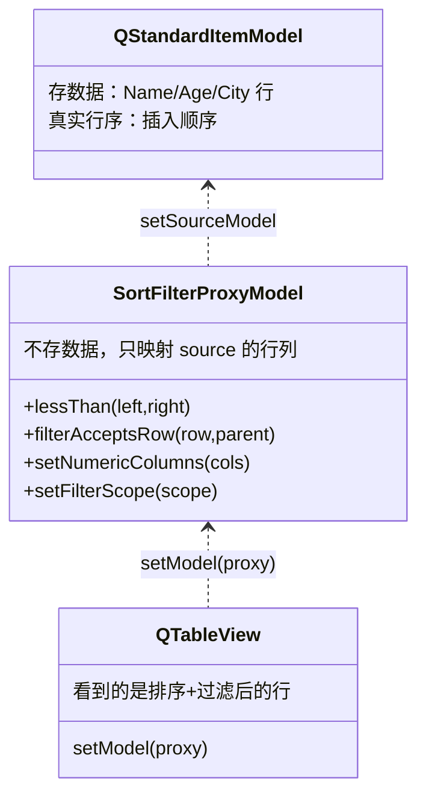
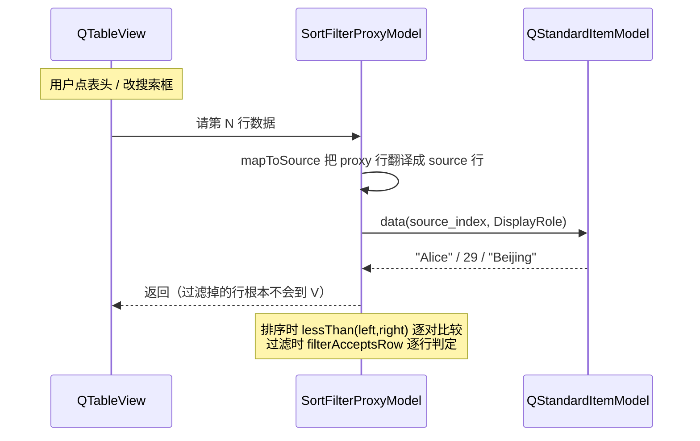

# Proxy-Model 成品导览

> **source**：`model/01-mv-pattern/proxy-model/`　**related**：Model/View 模式（[入门](../../../../beginner/03-qtwidgets/03-model-view-beginner.md) · [进阶](../../../../advanced/03-qtwidgets/03-model-view-advanced.md)）

Proxy-Model 演示 Qt Model/View 里最常被误解的一层——**代理模型（proxy model）**。`AwesomeQt::SortFilterProxyModel` 子类化 `QSortFilterProxyModel`，把「排序 + 过滤 + 自定义比较」三件事讲透。它**不存一行业务数据**，只把 sourceModel 的行列重新映射出去；源一改，代理自动刷新。配一个 demo（表格 + 搜索框 + 排序方向开关 + 过滤范围下拉），实时看见过滤排序效果。

::: tip 本篇是「成品导览」
想直接用成品 → 看这里（架构 / 决策 / 踩坑 / 怎么读）。
想自己从零搓出来 → 转 [手搓手册](./handbook/)。
:::

## 1. 它做什么

一个 `AwesomeQt::SortFilterProxyModel` 代理模型，夹在源模型和视图中间：

- **不存数据，只映射**：代理本身不持有任何业务数据，靠 `sourceModel()` 拿原始行/列；源模型改一格，代理自动重算映射，视图跟着刷新
- **自定义排序**：重写 `lessThan`——数值列（如年龄）按 `double` 比，避免 `"100" < "9"` 的字典序笑话；文本列不区分大小写（`"bob"` 排在 `"Charlie"` 之前）
- **自定义过滤**：重写 `filterAcceptsRow`——关键词子串匹配，支持「仅当前列」或「全列扫描」两种范围（`FilterScope` 枚举）
- **复用基类 API**：`setFilterKeyColumn` / `setFilterCaseSensitivity` / `setFilterFixedString` / `sort` 等直接用，不必重造

跑起来看一眼比读十行描述管用：

```bash
cmake -S model/01-mv-pattern/proxy-model -B build -DCMAKE_PREFIX_PATH=/usr/lib/cmake/Qt6
cmake --build build -j
./build/demo/proxy-model_demo
```

> demo 顶部三个控件（搜索框 / 升降序勾选框 / 过滤范围下拉）+ 表格点表头排序，实时驱动代理。

## 2. 架构总览

### 三层映射

代理模型的核心心智是「**三层链**」：数据在 source 里，视图看到的是 proxy 重新映射（排序 + 过滤）后的视图，proxy 自己不碰数据。



关键：`QTableView` 的 `setModel` 挂的是 **proxy，不是 source**。视图问 proxy 要数据，proxy 内部把「proxy 行号」翻译回「source 行号」再去问 source。这就是「代理在中间」的全部魔法。

### 文件职责

| 文件 | 职责 |
|---|---|
| `include/proxy-model.h` | 接口：`FilterScope` 枚举 + `Q_OBJECT`/`Q_ENUM`/`Q_PROPERTY` + 公有 API + protected 的 `lessThan`/`filterAcceptsRow` |
| `src/proxy-model.cpp` | 实现：数值/文本排序分支、关键词过滤、`sourceText` 取数（绕开 proxy 自身） |
| `demo/proxy-model_window.cpp` | 演示：源数据构造 + 代理接线 + 控件连线（搜索/排序方向/过滤范围） |

### 排序 + 过滤怎么跑起来



重点：`lessThan` 和 `filterAcceptsRow` 收到的索引**都是 source 索引**（基类翻译好了），所以实现里直接读 source 数据即可，不用管 proxy 自己的行号。

## 3. 关键设计决策

**① 代理不碰数据，只重写两个判定函数。**
不复制源数据、不维护影子数组。`QSortFilterProxyModel` 内部已经管好「proxy↔source 映射 + 源变更监听」，子类只要告诉它「谁更小」「这行留不留」。这是代理模型相对「自己另开一个排序后的 model」的根本优势——零数据冗余，源一动即更新。

**② 数值列用 `toDouble()` 比，不走默认字典序。**
年龄列存的是字符串 `"100"`/`"9"`，基类默认按字符串比会让 `"100" < "9" < "35"`（首字符 `'1' < '9' < '3'`），错得离谱。`setNumericColumns({1})` 标记后，`lessThan` 对这些列转 `double` 比较。`src/proxy-model.cpp:42-43`。

**③ 文本列显式 `CaseInsensitive`，覆盖基类默认。**
`QSortFilterProxyModel` 的 `lessThan` 默认是区分大小写的字典序，`"bob"` 会排在 `"Charlie"` 后面。本类对所有非数值列一律 `Qt::CaseInsensitive`，符合「人眼排序」直觉。`src/proxy-model.cpp:48`。

**④ 取数走 `sourceText` 帮手，绝不调 proxy 自己的 `data()`。**
`lessThan`/`filterAcceptsRow` 是 proxy 自己的成员，若在里面调 `data()`（proxy 的）会触发代理映射、最终又回调这俩函数——**无限递归栈溢出**。所以封装一个 `sourceText()` 强制读 `sourceModel()->data()`。`src/proxy-model.cpp:77-83`。这是整份代码最关键的坑，下面踩坑①详述。

**⑤ 过滤范围用枚举收编，不改 `filterKeyColumn` 语义。**
基类的 `filterKeyColumn` 只支持单列过滤。本类加 `FilterScope { kActiveColumn, kAllColumns }`：前者沿用基类语义（看 `filterKeyColumn` 那列），后者覆盖成全列扫描。切换走 `begin/endFilterChange`（Qt 6.13 起的规范通知，`invalidateFilter()` 已弃用）。`src/proxy-model.cpp:26-37`。

## 4. 怎么读这份 code

按这个顺序读，最快建立心智：

1. **`include/proxy-model.h` 的类声明 + FilterScope 枚举**（`include/proxy-model.h:13-37`）——先看「对外暴露哪些能力（属性/枚举/公有 API）+ 重写哪两个 protected 函数」
2. **`lessThan`**（`src/proxy-model.cpp:39-48`）——自定义排序核心，数值列 vs 文本列两条分支
3. **`filterAcceptsRow`**（`src/proxy-model.cpp:51-73`）——自定义过滤核心，`kActiveColumn` 单列 vs `kAllColumns` 全列
4. **`sourceText`**（`src/proxy-model.cpp:77-83`）——为什么必须绕开 proxy 的 `data()`（踩坑①的解法）
5. **`setFilterScope`**（`src/proxy-model.cpp:26-37`）——`begin/endFilterChange` 通知范式（踩坑②的解法）
6. **demo `setup_proxy`**（`demo/proxy-model_window.cpp:59-68`）——源模型接线 + 数值列标记 + 初始排序，看「代理怎么挂到中间」

入口：`demo/main.cpp` → `demo/proxy-model_window.cpp` 跑起来，对照读。

## 5. 踩坑

| # | 现象 | 原因 | 后果 | 解法 |
|---|---|---|---|---|
| ① | 重写 `filterAcceptsRow`/`lessThan` 时直接调 `this->data()` | proxy 的 `data()` 内部要做映射，映射又要回调这俩函数 | **无限递归 / 栈溢出** | 封装 `sourceText()` 强制读 `sourceModel()->data()`，绝不走 proxy 自身（`src/proxy-model.cpp:77-83`） |
| ② | 改了过滤范围后视图不刷新 | 用了 Qt 6.13 弃用的 `invalidateFilter()`，或压根没通知代理重算 | 过滤结果与实际不符（非崩溃） | 改用 `beginFilterChange()` + `endFilterChange(Direction::Rows)`（`src/proxy-model.cpp:35-36`） |
| ③ | 年龄列排成 `100 < 35 < 9` | `QSortFilterProxyModel::lessThan` 默认按字符串字典序比，`"100"` 首字符 `'1'` 最小 | 排序结果反直觉 | 数值列转 `toDouble()` 比，`setNumericColumns` 标记（`src/proxy-model.cpp:40-43`） |
| ④ | `"bob"` 排在 `"Charlie"` 后面 | 基类默认区分大小写，大写字母 ASCII 小于小写 | 大小写混排时排序不符合人眼直觉 | 文本列显式 `Qt::CaseInsensitive`（`src/proxy-model.cpp:48`） |
| ⑤ | 挂 proxy 后视图空白 | 忘了 `setSourceModel`，或视图 `setModel` 挂了 source 而非 proxy | 看不到任何数据 / 看到的是未过滤未排序的原数据 | 代理必须 `setSourceModel(source)`，视图 `setModel(proxy)`（`demo/proxy-model_window.cpp:61,101`） |
| ⑥ | 搜索框输入特殊字符（如 `*` `?` `.`）时过滤行为怪异 | 用了 `setFilterRegExp` 或把关键词当正则喂给 `filterRegularExpression()` | `.` 匹配任意字符、`*` 触发量词报错 | 用 `setFilterFixedString`（字面子串匹配），要正则再单独走 `setFilterRegularExpression`（`demo/proxy-model_window.cpp:117`） |
| ⑦ | `filterAcceptsRow` 里读 `needle` 拿到空串 | 没挂源模型就调过滤，或 source 索引无效 | 行为未定义 / 误放行全部 | `sourceModel()` 为 null 时直接 `return true` 兜底（`src/proxy-model.cpp:53-55`） |

## 6. 官方文档

- [QSortFilterProxyModel](https://doc.qt.io/qt-6/qsortfilterproxymodel.html)——本类基类，代理模型全部能力
- [Model/View 编程](https://doc.qt.io/qt-6/model-view-programming.html)——三层（源/代理/视图）架构总览
- [QStandardItemModel](https://doc.qt.io/qt-6/qstandarditemmodel.html)——demo 用的源模型
- [QAbstractProxyModel](https://doc.qt.io/qt-6/qabstractproxymodel.html)——所有代理模型的抽象基类
- [QRegularExpression（setFilterRegularExpression）](https://doc.qt.io/qt-6/qsortfilterproxymodel.html#setFilterRegularExpression)——正则过滤入口

---

这套机制（源 → 代理 → 视图三层 + 重写两个判定函数）不是 proxy-model 专属——它是「在不动源数据的前提下，给视图套一层排序/过滤/甚至聚合」的标准范式。下一个 Model/View 模式（自定义委托、树形代理）会复用同一套「代理只映射、不碰数据」的心智。想自己搓？[手搓手册](./handbook/)带你从空 main 一步步搓到这个成品。
