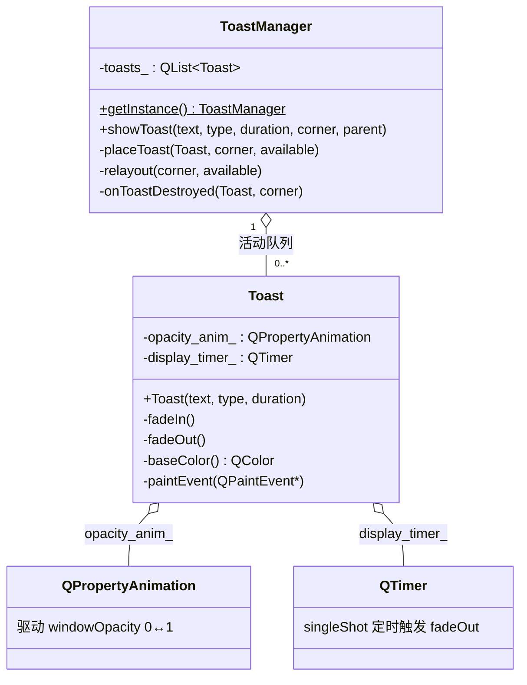
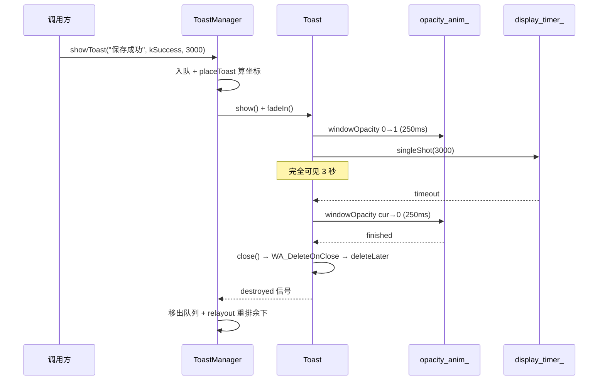

# ToastNotification 成品导览

> **source**：`model/12-design-patterns/toast-notification/`　**related**：动画框架 · 定时器 · 对象树

ToastNotification 是个仿 Material Design 的 Toast 临时提示气泡——右下角弹出一条消息，几秒后自动淡出消失，连续弹出多条会自动向上堆叠不重叠。听起来是个小工具，但它一次性把「**一个正经的临时顶层窗口**」该有的东西占全了：无边框置顶窗口标志位组合、`windowOpacity` 动画、`QTimer` 定时自毁、单例队列堆叠定位、对象生命周期闭环。model 栏设计模式系列拿它当**单例 + 短生命周期对象管理**的范式样例。

::: tip 本篇是「成品导览」
想直接用成品 → 看这里（架构 / 决策 / 踩坑 / 怎么读）。
想自己从零搓出来 → 转 [手搓手册](./handbook/)。
:::

## 1. 它做什么

一组 `AwesomeQt::Toast` + `AwesomeQt::ToastManager`：

- **无边框置顶、不抢焦点**：`Qt::FramelessWindowHint | Qt::Tool | Qt::WindowStaysOnTopHint | Qt::WindowDoesNotAcceptFocus`，弹出不打断用户当前输入
- **淡入淡出**：`QPropertyAnimation` 驱动 `windowOpacity`（QWidget 自带属性，作用于整个顶层窗口含圆角与半透明）
- **定时自毁**：`QTimer::singleShot` 到点触发淡出，淡出动画 `finished` 后 `close()` → `WA_DeleteOnClose` 自动 `deleteLater`
- **多条堆叠**：`ToastManager` 单例维护活动队列，按屏幕角落（右下/左下/右上/左上）逐条堆叠，间距与边距可配；一条消失后重排余下
- **类型分级配色**：`kInfo`(深灰) / `kSuccess`(绿) / `kWarning`(琥珀) / `kError`(红)，左侧色条强调

跑起来看一眼比读十行描述管用：

```bash
cmake -S model/12-design-patterns/toast-notification -B build
cmake --build build -j
./build/demo/toast-notification_demo
```

demo 主窗口五个按钮：四个分别弹 Info/Success/Warning/Error，第五个「Burst 5 Toasts」连发五条看堆叠动画（先入的先消失，余下重排回角落）。

## 2. 架构总览

### 类关系

一个 `Toast` 自治（窗口标志 + 动画 + 定时器自毁），多个 `Toast` 由全局唯一的 `ToastManager` 统一定位：



### 文件职责

| 文件 | 职责 |
|---|---|
| `include/toast-notification.h` | 接口：`ToastType`/`ToastCorner` 枚举 + `Toast` 窗口类 + `ToastManager` 单例 |
| `src/toast-notification.cpp` | 实现：窗口标志组合 / 淡入淡出 / 定时自毁 / 堆叠定位与重排 / 自绘圆角与色条 |
| `demo/toast-notification_window.cpp` | 演示：四类按钮触发不同 Toast + 连发五条看堆叠 |

### 一条 Toast 的生命周期



## 3. 关键设计决策

**① 淡入淡出驱动 `windowOpacity`，不用 `QGraphicsOpacityEffect`。**
`windowOpacity` 是 QWidget 顶层窗口自带属性，作用于整个窗口（含 `WA_TranslucentBackground` 的圆角外透明区），`QPropertyAnimation(this, "windowOpacity")` 直接能用，无需额外挂 effect。`QGraphicsOpacityEffect` 只对控件内容生效、对顶层窗口圆角半透明区无效。代价：`windowOpacity` 只对顶层窗口有意义，子控件做淡入淡出还得靠 effect（见 widget 栏 fade-animation）。

**② 窗口标志位用「组合」而非单个 flag。**
`FramelessWindowHint` 去边框、`Qt::Tool` 让它不占任务栏位、`WindowStaysOnTopHint` 置顶、`WindowDoesNotAcceptFocus` 不抢键盘焦点，再配 `WA_ShowWithoutActivating`（show 不激活）。漏任何一个体验都崩：漏 `Tool` 会塞满任务栏，漏 `DoesNotAcceptFocus` 会从用户正在输入的框抢走光标。见 `src/toast-notification.cpp:34-39`。

**③ 生命周期靠 `QTimer + deleteLater + WA_DeleteOnClose` 闭环，无父对象。**
Toast 是**独立顶层窗口**（`QWidget(nullptr)`），不能挂父对象——否则父对象（通常是主窗口）关了它才跟着关，而不是自己到点消失。所以自管生命周期：定时器超时 → 淡出动画 → `finished` 回调里 `close()` → `WA_DeleteOnClose` 触发 `deleteLater` → 对象树外安全回收。见 `src/toast-notification.cpp:79-92`。

**④ 堆叠定位用单例队列，`destroyed` 信号触发重排。**
`ToastManager` 是惰性单例（`getInstance`，挂在 `qApp` 上随进程销毁），全局唯一 `QList<Toast*>` 队列保证多条位置不重叠。新条入队按队列累计 y 偏移定位；某条自毁时 `destroyed` 信号回调移出队列、对余下 `relayout`，让后面的 Toast 顺滑回填角落。见 `src/toast-notification.cpp:188-240`（定位）、`src/toast-notification.cpp:243-280`（重排）。

**⑤ `fade_out_` 防重入，`disconnect` 防 `finished` 串台。**
`display_timer_` 超时和「被管理器踢出」可能同时触发 `fadeOut`，用 `fading_out_` 标志拦重入。另外淡入、淡出都连 `opacity_anim_::finished`，进入淡出前先 `disconnect` 旧的再连新的，否则淡出结束会同时触发「淡入结束回调」和「淡出结束回调」。见 `src/toast-notification.cpp:89-90`。

## 4. 怎么读这份 code

按这个顺序读，最快建立心智：

1. **`include/toast-notification.h` 的两个枚举**（29-40 行）——先认 `ToastType`(四态配色) / `ToastCorner`(四个角落) 的取值
2. **Toast 构造函数**（`src/toast-notification.cpp:29`）——窗口标志位组合 + `WA_*` 属性 + 动画/定时器初始化，盯 34-39 行的标志位与属性
3. **`fadeIn` / `fadeOut`**（`src/toast-notification.cpp:68` / `:79`）——动画接力（从 `windowOpacity()` 当前值起步）与定时自毁链路
4. **`paintEvent`**（`src/toast-notification.cpp:122`）——圆角底 + 左侧色条自绘
5. **`ToastManager::showToast`**（`src/toast-notification.cpp:155`）——入队 + 定位 + 显示 + 挂 `destroyed` 回调
6. **`placeToast` / `relayout`**（`src/toast-notification.cpp:188` / `:255`）——堆叠偏移怎么累计、怎么按角落方向正负

入口：`demo/main.cpp` → `demo/toast-notification_window.cpp` 跑起来，五个按钮逐个点，对照读。

## 5. 踩坑

| # | 现象 | 原因 | 后果 | 解法 |
|---|---|---|---|---|
| ① | Toast 弹出后任务栏塞满图标 | 漏 `Qt::Tool` 标志 | 任务栏被刷屏，体验崩 | 标志位组合必含 `Qt::Tool`（`src/toast-notification.cpp:34`） |
| ② | Toast 一弹，用户正在输入的输入框丢了光标 | 漏 `Qt::WindowDoesNotAcceptFocus` + `WA_ShowWithoutActivating` | 抢焦点，打断输入 | 两者都加（`src/toast-notification.cpp:34-38`） |
| ③ | 圆角外区域是黑块不是透明 | 没设 `WA_TranslucentBackground` | 圆角处显黑矩形 | 构造期 `setAttribute(Qt::WA_TranslucentBackground)`（`src/toast-notification.cpp:37`） |
| ④ | 连点多次按钮偶发崩溃 | `display_timer_` 超时和外部触发同时进 `fadeOut` | 重复启动淡出 / 二次 `close()` | `fading_out_` 标志防重入（`src/toast-notification.cpp:80`） |
| ⑤ | 淡出结束崩或行为错乱 | 淡入、淡出都连 `opacity_anim_::finished`，没断开旧的 | 回调串台，连触发两个分支 | 进入淡出前 `disconnect` 再 `connect`（`src/toast-notification.cpp:89`） |
| ⑥ | Toast 不自动消失，内存泄漏 | 没设 `WA_DeleteOnClose`，`close()` 不释放 | 对象不回收，长时间运行内存涨 | `setAttribute(Qt::WA_DeleteOnClose)`（`src/toast-notification.cpp:39`） |
| ⑦ | 多条 Toast 叠在同一点重叠 | 没维护活动队列，各自独立定位 | 视觉重叠 | 单例 `ToastManager` 持 `QList<Toast*>`，累计 y 偏移定位（`src/toast-notification.cpp:188`） |
| ⑧ | 一条消失后余下不回填角落 | 自毁后没触发重排 | 留空洞，Toast 越堆越散 | `destroyed` 信号回调移出队列 + `relayout`（`src/toast-notification.cpp:255`） |

## 6. 官方文档

- [QWidget window flags](https://doc.qt.io/qt-6/qt.html#WindowType-enum)——窗口标志位（Frameless / Tool / StaysOnTop / DoesNotAcceptFocus）
- [QWidget::windowOpacity](https://doc.qt.io/qt-6/qwidget.html#windowOpacity-prop)——顶层窗口透明度属性（动画驱动对象）
- [QPropertyAnimation](https://doc.qt.io/qt-6/qpropertyanimation.html)——属性动画
- [QTimer::singleShot](https://doc.qt.io/qt-6/qtimer.html#singleShot-1)——单次定时器
- [QObject::deleteLater](https://doc.qt.io/qt-6/qobject.html#deleteLater)——延迟安全删除
- [QScreen::availableGeometry](https://doc.qt.io/qt-6/qscreen.html#availableGeometry-prop)——屏幕可用区（排除任务栏），堆叠定位基准

---

这套机制（无边框置顶 + windowOpacity 动画 + 定时自毁 + 单例堆叠）不是 Toast 专属——它就是「**一个短生命周期的临时顶层窗口**」的标准范式。任何「弹一下就自己消失」的提示类控件（气泡通知、悬浮卡片、轻量级浮层）都复用同一套骨架。想自己搓？[手搓手册](./handbook/)带你从空 main 一行行搓到这个成品。
