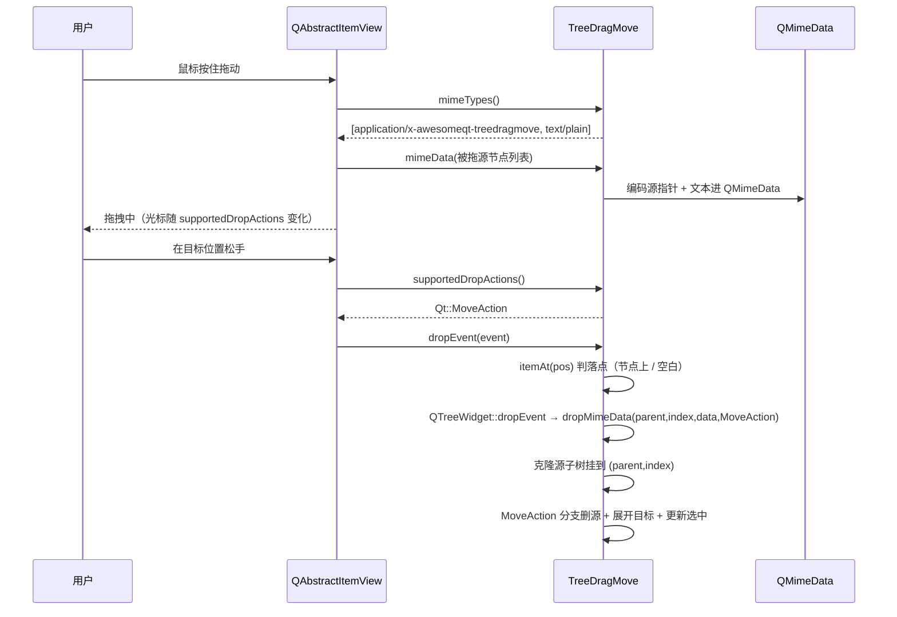

# TreeDragMove 成品导览

> **source**：`model/01-mv-pattern/tree-drag-move/`　**related**：[拖放系统（入门）](../../../../beginner/02-qtgui/06-drag-drop-beginner.md)、[QTreeWidget（入门）](../../../../beginner/03-qtwidgets/48-qtreewidget-beginner.md)

TreeDragMove 是个 QTreeWidget 子类——把节点拖来拖去改层级，看着像「文件管理器那一坨」，但它的魂在**重写 Qt 拖放协议的四个虚函数**。很多人只会在 `setDragDropMode(InternalMove)` 一开了事，拖是能拖，可一旦想「拖到节点上变子项 / 拖到空白变同级」分不清、或想跨树转移，默认行为就不够用了。这件成品把协议四件套全部接管，把「拖放到底是怎么一回事」讲透。

::: tip 本篇是「成品导览」
想直接用成品 → 看这里（架构 / 决策 / 踩坑 / 怎么读）。
想自己从零搓出来 → 转 [手搓手册](./handbook/)。
:::

## 1. 它做什么

一个 `AwesomeQt::TreeDragMove` 控件（QTreeWidget 子类）：

- **重写拖放协议四件套**：`mimeTypes()` / `mimeData()` / `supportedDropActions()` / `dropMimeData()`——完全接管「拖出时序列化什么、拖入时怎么落地」
- **内部移动语义**：`supportedDropActions()` 返回 `Qt::MoveAction`，`InternalMove` 模式下拖完源位置真正删除（不是隐藏）
- **落点判定**：`dropEvent` 用 `itemAt(pos)` 区分「落在节点上（成为其子节点）」与「落在空白（同级插入）」
- **选中态 / 展开态维护**：拖完自动展开目标父节点、把选中态切到新落点
- **跨树转移**：demo 配两棵树，左拖右 = 节点从源树到目标树

跑起来看一眼：

```bash
cmake -S model/01-mv-pattern/tree-drag-move -B build -DCMAKE_PREFIX_PATH=/usr/lib/cmake/Qt6
cmake --build build -j"$(nproc)"
./build/demo/tree-drag-move_demo
```

> demo 里左树是「项目结构」（src / tests / docs），右树是「回收区」。单树内拖 = 改层级；左拖到右 = 转移。Ctrl+拖 = 复制保留源。

## 2. 架构总览

### 拖放协议时序

一次内部拖拽，框架会按固定顺序回调这几个虚函数。看懂这张图就懂了「协议」二字：



关键：`mimeData`（拖出）和 `dropMimeData`（拖入）是**一对**，中间靠 `QMimeData` 传话。自定义 MIME 类型让两端对得上。

### 文件职责

| 文件 | 职责 |
|---|---|
| `include/tree-drag-move.h` | 接口：`TreeDragMove` 声明 + `kMimeType` 常量 + 四个 protected 虚函数 |
| `src/tree-drag-move.cpp` | 实现：协议四件套 + `dropEvent` 落点判定 / 删源 / 状态维护 + `cloneItem` 深拷贝 |
| `demo/tree-drag-move_window.cpp` | 演示：拖放标志位四件套（`setDragEnabled` 等）+ 两棵树 + 种子数据 + 状态栏说明 |

### 协议四件套各自的活

| 虚函数 | 何时被调 | 干什么 |
|---|---|---|
| `mimeTypes()` | 拖出前 | 声明本树能产出的 MIME 类型（`src/tree-drag-move.cpp:36`） |
| `mimeData(items)` | 拖出时 | 把源节点序列化进 QMimeData（`src/tree-drag-move.cpp:42`） |
| `supportedDropActions()` | 拖拽中 | 告诉框架本树接受哪些动作（这里只 MoveAction，`src/tree-drag-move.cpp:31`） |
| `dropMimeData(parent,index,data,action)` | 拖入时 | 反序列化 + 把节点插到 (parent,index)（`src/tree-drag-move.cpp:69`） |

## 3. 关键设计决策

**① 自定义 MIME 类型 + 指针编码，不靠 text/plain 传节点。**
进程内拖拽，用 `application/x-awesomeqt-treedragmove` 装源节点指针（`QDataStream` 写 `quintptr`），drop 端原样取回，零歧义定位源。`text/plain` 只是给跨进程/日志留的可读通道。若只靠文本传，同名节点会分不清谁是谁。（`src/tree-drag-move.cpp:42-66`）

**② `supportedDropActions()` 只返回 MoveAction，InternalMove 语义收窄。**
默认 `QAbstractItemView` 会返回 Move|Copy，导致按 Ctrl 变复制、松手变移动，行为飘。这里收窄成纯 MoveAction，单树内拖必删源，行为可预测。跨树转移在 demo 里靠两棵树各自的 `AcceptDrops` 完成，不是靠 CopyAction。（`src/tree-drag-move.cpp:31-34`）

**③ 删源放在 dropEvent，不放 dropMimeData——防时序坑。**
`dropMimeData` 里若先删源，一旦基类 `dropEvent` 默认实现也在删（InternalMove 下它会），就 double-free 或取空。所以协议层只负责「克隆+插入」，删源集中到 `dropEvent` 的 MoveAction 分支，且**先调基类 dropEvent（完成复制）再删源**，顺序锁死。（`src/tree-drag-move.cpp:163-185`）

**④ 落点判定用 `itemAt(pos)`，不靠已弃用的 target 精确语义。**
`dropEvent` 里 `QTreeWidgetItem* target_parent = itemAt(event->position().toPoint())`：返回非 null = 落在某节点上（成为子节点），null = 落空白（同级插入）。这比纠结 `index` 的精确含义稳，且和用户视觉一致。（`src/tree-drag-move.cpp:144`）

**⑤ 深拷贝 cloneItem 递归复制整棵子树。**
拖一个有子节点的父节点，子树必须跟着走。`cloneItem` 递归复制 text/icon/toolTip/UserRole/checkState + 所有 child，保证克隆和源结构一致。MoveAction 下源连同子树一起删，不会漏。（`src/tree-drag-move.cpp:201-222`）

## 4. 怎么读这份 code

按这个顺序读，最快建立心智：

1. **`include/tree-drag-move.h` 的类注释**（`include/tree-drag-move.h:17-32`）——先看「协议四件套各干什么 + 教学点对应」
2. **`kMimeType` 常量**（`src/tree-drag-move.cpp:24`）——自定义 MIME 的名字
3. **`mimeTypes` + `mimeData`**（`src/tree-drag-move.cpp:36-66`）——拖出端：声明类型 + 编码源
4. **`dropMimeData`**（`src/tree-drag-move.cpp:69-119`）——拖入端：反序列化 + 克隆 + 插入（注意这里故意不删源）
5. **`dropEvent`**（`src/tree-drag-move.cpp:122-198`）——落点判定 + 删源 + 状态维护，整件最重头的逻辑
6. **`cloneItem`**（`src/tree-drag-move.cpp:201-222`）——深拷贝子树
7. **demo 的拖放标志位**（`demo/tree-drag-move_window.cpp:40-49`）——`setDragEnabled/setAcceptDrops/setDragDropMode/setDefaultDropAction` 四件套

入口：`demo/main.cpp` → `demo/tree-drag-move_window.cpp` 跑起来，对照读。

## 5. 踩坑

| # | 现象 | 原因 | 后果 | 解法 |
|---|---|---|---|---|
| ① | 只开 `setDragDropMode(InternalMove)`，拖动没反应 | 忘了 `setDragEnabled(true)` 或 `setAcceptDrops(true)`——前者是拖出总开关，后者是拖入总开关 | 拖不动 / 拖到别处不接收 | 四个标志位都开（`demo/tree-drag-move_window.cpp:40-42`） |
| ② | InternalMove 下源没删，节点出现两份 | `dropMimeData` 只复制没删源，又没在 dropEvent 补删 | 数据重复 | MoveAction 分支手动 `takeChild`+`delete` 源（`src/tree-drag-move.cpp:166-185`） |
| ③ | dropMimeData 里删源，偶发崩溃 / double-free | 基类 `QTreeWidget::dropEvent` 在 InternalMove 下也会删源，和你的删源撞车 | **segfault** | 协议层只复制，删源集中到 dropEvent，且先调基类再删（`src/tree-drag-move.cpp:163-167`） |
| ④ | 跨树拖拽后源树节点没清干净 | `indexOfTopLevelItem`/`indexOfChild` 返回 -1 没判，或父节点是另一棵树的 | 静默漏删 | 删源前判 `i >= 0`，分 parent!=null 和 null 两路（`src/tree-drag-move.cpp:172-186`） |
| ⑤ | 拖个带子节点的父节点，子节点丢一半 | 克隆只复制了顶层项，没递归 child | 子树残缺 | `cloneItem` 递归深拷贝（`src/tree-drag-move.cpp:213-219`） |
| ⑥ | 拖完选中态停在已被删除的源上 | QTreeWidget dropEvent 后默认选中没刷新 | 选中幽灵项 → 操作崩溃 | dropEvent 末尾手动 `setCurrentItem` 切到新落点（`src/tree-drag-move.cpp:190-198`） |
| ⑦ | 落在某节点上但新子节点看不见 | 目标父节点是折叠的 | 以为没拖成功 | 落点是节点就 `setExpanded(true)`（`src/tree-drag-move.cpp:194`） |
| ⑧ | 用 SIGNAL/SLOT 宏连 expand 动作 | 老式宏语法 | 编译期不查类型，改名就崩 | 一律函数指针语法 `connect(act,&QAction::triggered,...)`（`demo/tree-drag-move_window.cpp:72`） |

## 6. 官方文档

- [QTreeWidget](https://doc.qt.io/qt-6/qtreewidget.html)——本类的基类
- [QAbstractItemView（拖放）](https://doc.qt.io/qt-6/qabstractitemview.html)——`setDragEnabled` / `setAcceptDrops` / `setDragDropMode` 总开关
- [QMimeData](https://doc.qt.io/qt-6/qmimdata.html)——拖拽数据载体
- [Qt::DropAction](https://doc.qt.io/qt-6/qt.html#DropAction-enum)——MoveAction / CopyAction 等动作枚举
- [拖放（Drag and Drop）](https://doc.qt.io/qt-6/dnd.html)——拖放协议总览

---

这套「重写协议四件套 + dropEvent 落点判定」不是 TreeDragMove 专属——它是「任何想精细控制拖放的 Item View」的标准范式。换成 QListView / QTableView 同一套骨架。想自己搓？[手搓手册](./handbook/)带你从能拖动的 QTreeWidget 一行行搓到协议全接管。
