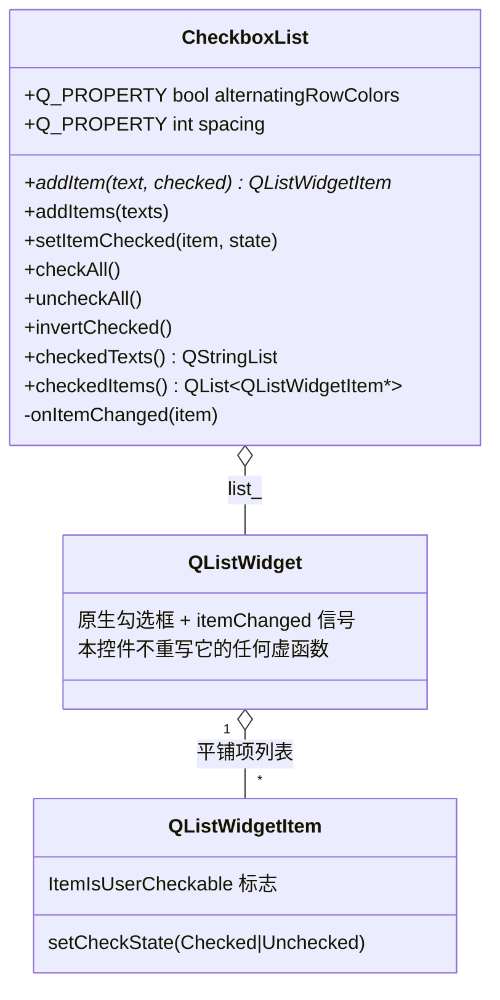
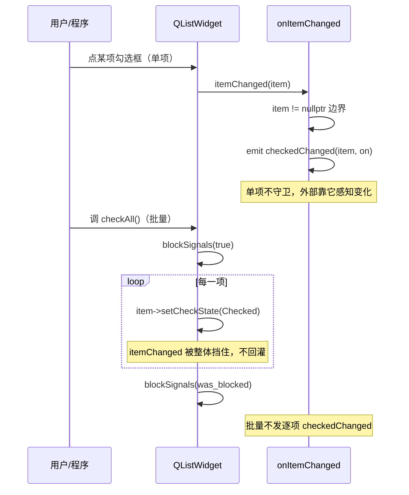

# CheckboxList 成品导览

> **source**：`widget/checkbox-list/`　**related**：model/view 控件递进链（同档：[checkbox-tree](../checkbox-tree/) 是带父子联动的进阶版）· 教程层 [QListWidget 入门](../../../../beginner/03-qtwidgets/46-qlistwidget-beginner.md) / [Model/View 进阶](../../../../advanced/03-qtwidgets/03-model-view-advanced.md)

CheckboxList 是一张扁平的勾选清单——每一项前面一个复选框，勾哪个是哪个，互不影响。听起来 `QListWidget` 自带就能干，原生确实给你「每项一个复选框」，可一旦要做「全选/反选」「把勾选的文本收出来」，就撞上同一颗雷：批量改勾选态时，`setCheckState` 每改一项都回灌一次 `itemChanged`，几十上百项下来信号刷成洪流。这份成品把批量操作整段用 `blockSignals` 守住，再封一层「勾选 API + 状态汇总」，开箱即用。

它是 [checkbox-tree](../checkbox-tree/) 的简化对照版：那件要做父子三态联动，递归改子项时雷更响（不挡就栈溢出）；本件扁平无层级，没有 `propagateDown`/`recalcUp`，雪崩更温和（不崩但噪音大、性能塌陷），解法也就更轻——批量方法整段挡信号即可，不用 `is_propagating_` 标志位那道额外闸门。

::: tip 本篇是「成品导览」
想直接用成品 → 看这里（架构 / 决策 / 踩坑 / 怎么读）。
想自己从零搓出来 → 转 [手搓手册](./handbook/)。
:::

## 1. 它做什么

一个 `AwesomeQt::CheckboxList` 控件：

- **每项带复选框**：`addItem(text, checked=false)` 追加一项并装上复选框，`addItems(texts)` 批量追加
- **扁平无层级**：勾选互相独立，不做任何父子联动（那是 checkbox-tree 的事）
- **批量操作**：`checkAll()` / `uncheckAll()` / `invertChecked()` 三键搞定，整段 `blockSignals` 守卫
- **程序化单项**：`setItemChecked(item, state)` 单项改勾选，允许 `checkedChanged` 透传供外部感知
- **状态汇总**：`checkedTexts()` 取已勾选项的文本（按列表顺序），`checkedItems()` 取项指针
- **行为开关 Q_PROPERTY**：`alternatingRowColors`（斑马纹）、`spacing`（行距）可在 Designer 或外部直接驱动

跑起来看一眼比读十行描述管用：

```bash
cd widget && cmake -B build && cmake --build build
./build/checkbox-list/demo/checkbox_list_demo
```

打开后左侧一张「文件权限」勾选清单（Read / Write / Execute / Delete / Modify permissions / Take ownership / Change attributes），前两项 Read / Write 预先勾上。勾几个框肉眼看，右侧控制面板四按钮 + 一个斑马纹开关：点 `List checked items` 把 `checkedTexts()` 拍出来的勾选文本打到下方只读文本框；`Check all` / `Uncheck all` / `Invert selection` 三键演示批量操作——按下它们你会发现列表项乖乖整体翻动，却没有任何卡顿或刷屏，因为整段改写被 `blockSignals` 罩住了。

## 2. 架构总览

### 类关系

CheckboxList 不自绘，它**组合**一个 QListWidget——构造期 new 出来、`parent=this` 交对象树托管、塞进 QVBoxLayout。本控件只管「勾选 API + 状态汇总」，绘制全交给 view：



勾选变化靠 `QListWidget::itemChanged` 这一根线驱动：用户点勾选框 → view 发 `itemChanged` → 我们的 `onItemChanged` 去重 + 边界后转发为更易用的 `checkedChanged`。程序化批量改写（`checkAll`/`uncheckAll`/`invertChecked`/`addItems`）不希望逐项回灌，整段被 `blockSignals(true/false)` 罩住，从源头掐断 `itemChanged`。

### 文件职责

| 文件 | 职责 |
|---|---|
| `include/checkbox_list.h` | 接口：Q_PROPERTY 两件 + 公有勾选/汇总 API + `onItemChanged` 私有槽声明 |
| `src/checkbox_list.cpp` | 实现：构造组合骨架 + itemChanged 转发 + 批量方法 blockSignals 守卫 + 状态汇总遍历 |
| `demo/checkbox_list_window.cpp` | 演示：文件权限示例项 + 列出勾选 + 全选/全不选/反选 + 斑马纹开关 |

### 点一下勾选框 vs 批量操作，信号怎么走



重点在两条路径的对比：单项路径（用户点击、`setItemChecked`）让 `itemChanged` 自由透传到 `onItemChanged` 再 `emit checkedChanged`，外部就靠它知道哪项变了；批量路径（三键 + `addItems`）整段挡信号，几十项一次性改完也不发任何逐项通知——列表版没有 checkbox-tree 的递归，不挡也不会栈溢出，但不挡就是 N 次空转的信号洪流，性能塌陷 + 外部接到一堆噪音。

## 3. 关键设计决策

**① 组合 QListWidget，不继承也不自绘。**
继承 QWidget、内含一个 `QListWidget* list_` 成员，构造期 `new QListWidget(this)`、`setUniformItemSizes(true)`、塞进 `QVBoxLayout` 且边距清零（`src/checkbox_list.cpp:15-22`）。不重写 paintEvent，让 view 自己画——本控件只做勾选逻辑，QListWidget 的选择/滚动/斑马纹全部白拿。这是 model/view 组合控件的标准定位，和自绘派（status-led）分道扬镳。

**② 与 checkbox-tree 严格对照：扁平无层级，砍掉整套联动。**
同源对照件 checkbox-tree 要做父子三态联动，背着 `propagateDown`/`recalcUp`/`aggregateState` 三套递归；本件扁平，这些全部省去，重点落在勾选 API（`addItem`/`setItemChecked`/三键）和状态汇总（`checkedTexts`/`checkedItems`）。一份「勾选清单」该有的能力在这里，不掺它不该有的层级逻辑。

**③ 批量方法整段 blockSignals 守卫，单项放行透传。**
`checkAll`/`uncheckAll`/`invertChecked`/`addItems` 四个方法，每个都在进入循环前后 `const bool was_blocked = list_->blockSignals(true); ...; list_->blockSignals(was_blocked);`（`src/checkbox_list.cpp:43`、`:68`、`:82`、`:97`）。用保存旧值、改完恢复的 `was_blocked` 模式而非硬置 false，避免误伤别的信号连接。`setItemChecked` 单项则**故意不守卫**（`src/checkbox_list.cpp:53-61`），允许 `checkedChanged` 透传——外部程序化改某一项时，正好靠它拿到通知。这是 checkbox-tree 双闸门教训的列表简化版：没有递归就不需要 `is_propagating_` 标志位那道额外闸门，一道 `blockSignals` 足够。

**④ addItem 用 setFlags 装复选框，setCheckState 初始化时局部守卫。**
`addItem` 里 `new QListWidgetItem(text, list_)` 后 `item->setFlags(item->flags() | Qt::ItemIsUserCheckable)` 装上复选框（保留默认的 `ItemIsEnabled|ItemIsSelectable`，`src/checkbox_list.cpp:28-30`）。紧接着 `setCheckState` 设初值——这一步会触发 `itemChanged`，所以用局部 `blockSignals(true/false)` 守卫防初始化期回灌（`src/checkbox_list.cpp:33-35`）。批量版 `addItems` 则整段守卫一次性初始化（`src/checkbox_list.cpp:43-50`）。

**⑤ 两个 Q_PROPERTY 带无变化早返回，spacing 负值 clamp。**
`alternatingRowColors`（bool）和 `spacing`（int）都走 READ/WRITE/NOTIFY 三件套。setter 入口先判「新旧值相等就 return」避免重复发 NOTIFY（`src/checkbox_list.cpp:152`、`:167`）。`setSpacing` 还多一道 `pixels < 0` clamp（`src/checkbox_list.cpp:164`）——负行距无意义，挡掉。这种「无变化早返回」是属性系统的卫生习惯，外部反复 set 同值不会刷一堆空信号。

**⑥ sizeHint 返回 200x240，状态汇总用 reserve + 顺序遍历。**
`sizeHint()` 固定返回 `{200, 240}`（`src/checkbox_list.cpp:174`），给布局一个稳定建议尺寸。`checkedTexts`/`checkedItems` 先 `list_->count()` 拿总数，`reserve(n)` 预分配再顺序遍历 append（`src/checkbox_list.cpp:114-122`、`:130-137`），按列表顺序输出、空列表安全返回空容器。

## 4. 怎么读这份 code

按这个顺序读，最快建立心智：

1. **构造 + 信号连接**（`src/checkbox_list.cpp:15-26`）——先看「内含 QListWidget + 连 itemChanged」这个组合骨架
2. **`addItem`**（`src/checkbox_list.cpp:28`）——看怎么用 `setFlags` 装复选框 + 初始化 `setCheckState` 的局部守卫
3. **`addItems`**（`src/checkbox_list.cpp:41`）——批量版，整段 `blockSignals` 守卫，和 `addItem` 的局部守卫对照看
4. **`checkAll` / `uncheckAll` / `invertChecked`**（`src/checkbox_list.cpp:63` / `:78` / `:92`）——三个批量方法，守卫写法一模一样，`invertChecked` 多一步读旧态
5. **`setItemChecked`**（`src/checkbox_list.cpp:53`）——单项程序化入口，故意不守卫，和批量方法对照看「为什么单项要放行」
6. **`checkedTexts` / `checkedItems`**（`src/checkbox_list.cpp:109` / `:125`）——状态汇总遍历
7. **`onItemChanged`**（`src/checkbox_list.cpp:178`）——itemChanged 转发总入口，仅做空指针边界，转发为 `checkedChanged`
8. **Q_PROPERTY 读写**（`src/checkbox_list.cpp:144-172`）——无变化早返回 + spacing clamp

入口：`demo/main.cpp` → `demo/checkbox_list_window.cpp` 跑起来，对照读。重点把 `Check all` / `Uncheck all` / `Invert selection` 三键各按一遍，再点 `List checked items` 看 `checkedTexts()` 输出——整个过程平滑无卡顿，就是批量守卫在干活。

## 5. 踩坑

这几个坑都是实现这个控件时真处理过的，代码里能逐条对上。

**坑 1：批量操作不挡信号，itemChanged 刷成洪流**
现象：按一下 `Check all`，列表项整体翻动没错，但外部连着 `checkedChanged` 的槽被连续调用 N 次（N = 列表项数），日志刷屏、性能塌陷。原因：`checkAll`/`uncheckAll`/`invertChecked` 里每调一次 `item->setCheckState`，QListWidget 都发一次 `itemChanged`，`onItemChanged` 又 `emit checkedChanged`——几十上百项就是几十上百次空转。后果是不崩（列表版无递归，不像 checkbox-tree 会栈溢出），但信号噪音巨大、批量改写慢。解法是三个方法整段包 `const bool was_blocked = list_->blockSignals(true); ...; list_->blockSignals(was_blocked);`（`src/checkbox_list.cpp:68`、`:82`、`:97`），从源头掐断 `itemChanged` 回灌。

**坑 2：blockSignals 硬置 false，误伤别的信号连接**
现象：批量方法里图省事写 `list_->blockSignals(false)` 收尾，结果后续某个信号连不上了。原因：`blockSignals(true)` 之前 `list_` 上可能已经存在别的被 block 的状态，硬置 false 会把那个状态也清掉，破坏调用方的信号守卫契约。后果是难以排查的信号丢失。解法是 `was_blocked` 模式：先 `const bool was_blocked = list_->blockSignals(true)` 保存旧值，改完 `list_->blockSignals(was_blocked)` 恢复（`src/checkbox_list.cpp:68`）。

**坑 3：addItem 初始化 setCheckState 回灌，刚挂的项触发 checkedChanged**
现象：用 `addItem("Read", true)` 预勾选，结果外部接到一个 `checkedChanged` 通知，业务以为用户点了勾选框。原因：`setCheckState(Qt::Checked)` 这一步也会触发 `itemChanged` → `onItemChanged` → `checkedChanged`，和用户点击走同一条信号链，view 不区分「程序化」还是「用户」。后果是初始化阶段被当成用户交互处理，业务逻辑误触发。解法是 `addItem` 内对初始化 `setCheckState` 做局部 `blockSignals(true/false)` 守卫（`src/checkbox_list.cpp:33-35`），批量 `addItems` 同理整段守卫（`src/checkbox_list.cpp:43-50`）。

**坑 4：invertChecked 反选时读旧态被自己的写覆盖**
现象：`Invert selection` 按下去，结果部分项没翻成预期状态。原因：反选要先 `item->checkState()` 读旧态再写反态，若整段没挡信号，写新态触发的 `itemChanged` 又回灌进来，干扰下一项的读——读到的可能已经是被回灌改过的值。后果是反选结果错乱。解法是整段 `blockSignals` 守卫（`src/checkbox_list.cpp:97-106`），读旧态和写新态都在屏蔽期内完成，`itemChanged` 不回灌。

**坑 5：setItemChecked 传 nullptr 直接崩**
现象：外部传了个空指针进来，控件崩。原因：`setItemChecked(QListWidgetItem* item, ...)` 没判空就 `item->setCheckState`，解引用 null。后果是段错误。解法是入口 `if (item == nullptr) return;`（`src/checkbox_list.cpp:54`），空指针安全返回。`onItemChanged` 同样做空指针边界（`src/checkbox_list.cpp:179`），防御性兜底。

## 6. 官方文档

- [QListWidget](https://doc.qt.io/qt-6/qlistwidget.html)——被封装的列表视图，itemChanged 信号的来源
- [QListWidgetItem](https://doc.qt.io/qt-6/qlistwidgetitem.html)——列表项，setCheckState / checkState / setFlags 所在
- [Qt::CheckState](https://doc.qt.io/qt-6/qt.html#CheckState-enum)——勾选状态枚举 Checked / Unchecked（本件只用两态，三态 PartiallyChecked 留给 checkbox-tree）
- [Qt::ItemFlag](https://doc.qt.io/qt-6/qt.html#ItemFlag-enum)——`ItemIsUserCheckable` 装复选框、`ItemIsEnabled|ItemIsSelectable` 保留默认可交互
- [QObject::blockSignals](https://doc.qt.io/qt-6/qobject.html#blockSignals)——批量操作防 itemChanged 回灌的关键闸门
- [The Property System](https://doc.qt.io/qt-6/properties.html)——alternatingRowColors / spacing 两个 Q_PROPERTY 的机制基础
- [Model/View Programming](https://doc.qt.io/qt-6/model-view-programming.html)——QListWidget 是 Item View 简化层，想换 QListView+QStandardItemModel 走这里

---

这套机制（组合 QListWidget + itemChanged 驱动勾选 + 批量方法 blockSignals 守卫 + 状态汇总）不是 CheckboxList 专属——它就是「给带勾选框的扁平列表加批量操作和结果收集」的标准范式。想往上加父子三态联动，就转 [checkbox-tree](../checkbox-tree/) 看那道双闸门怎么升级。想自己搓？[手搓手册](./handbook/)带你从空 main 一行行搓到这个成品，重点啃下批量守卫那道闸门。
