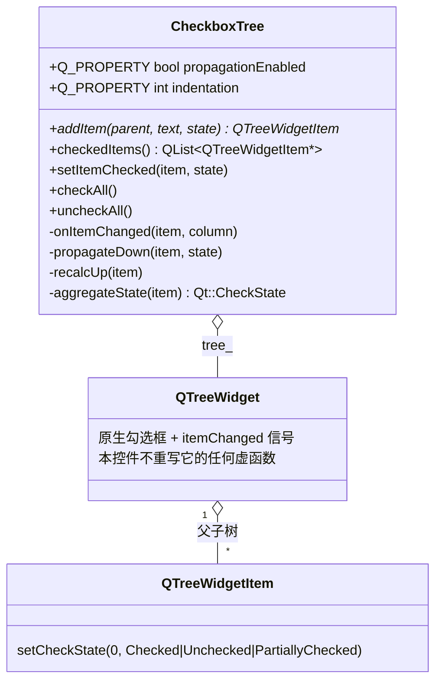
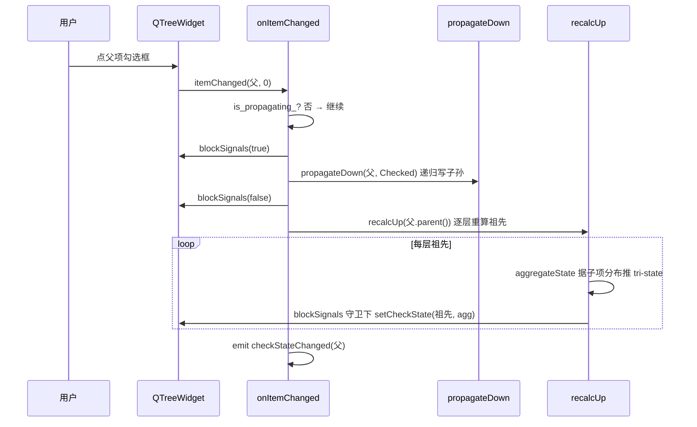

# CheckboxTree 成品导览

> **source**：`widget/checkbox-tree/`　**related**：model/view 控件递进链（同档：status-led / toggle-switch 自绘线）· 教程层 [Model/View 进阶](../../../../advanced/03-qtwidgets/03-model-view-advanced.md)

CheckboxTree 是一棵会自动联动的勾选树——勾父全选子、子部分勾父变三态、子全勾父转满勾。听起来像 QTreeWidget 自带的功能，其实原生只给你「每项一个复选框」，联动得自己写。难点不在算法（向下传播 + 向上回算谁都懂），而在一个绕不开的雷：`setCheckState` 会再次触发 `itemChanged`，递归改子项时如果不挡信号，链式调用直接雪崩到栈溢出。这份成品把那道闸门做成了双重保险，值得拆开看。

::: tip 本篇是「成品导览」
想直接用成品 → 看这里（架构 / 决策 / 踩坑 / 怎么读）。
想自己从零搓出来 → 转 [手搓手册](./handbook/)。
:::

## 1. 它做什么

一个 `AwesomeQt::CheckboxTree` 控件：

- **每项带复选框**：调用 `addItem(parent, text, state)` 挂节点，`parent=nullptr` 加顶层
- **父子联动**：勾父向下传播 Checked/Unchecked 给所有子孙；子项一变，从变更节点的父起逐层向上重算三态
- **三态正确**：子全勾→父 Checked、全不勾→父 Unchecked、部分勾→父 PartiallyChecked
- **联动可关**：`propagationEnabled` 属性一翻，退化成普通勾选树（只改自身不联动）
- **收集结果**：`checkedItems()` 深度优先收所有 Checked（不含 Partially）；`checkAll()/uncheckAll()` 一键全选

跑起来看一眼比读十行描述管用：

```bash
cd widget && cmake -B build && cmake --build build
./build/checkbox-tree/demo/checkbox_tree_demo
```

demo 里一棵三层示例树（项目 > 模块 > 文件），点勾选肉眼看父子联动 + 三态，「List checked items」按钮把勾选路径打到右侧文本框，外加全选/全不选和联动开关。

## 2. 架构总览

### 类关系

CheckboxTree 不自绘，它**组合**一个 QTreeWidget——构造期 new 出来、`parent=this` 交对象树托管、塞进 QVBoxLayout。本控件只管「数据组织 + 勾选联动逻辑」，绘制全交给 view：



联动靠 `QTreeWidget::itemChanged` 这一根线驱动：用户点勾选框 → view 发 `itemChanged` → 我们的 `onItemChanged` 向下传播 + 向上回算。程序化改写（`setItemChecked`/`checkAll`）也走同一套槽，靠 `is_propagating_` 标志区分「谁触发的」。

### 文件职责

| 文件 | 职责 |
|---|---|
| `include/checkbox_tree.h` | 接口：Q_PROPERTY 两件 + 公有 API + 三个私有联动辅助函数声明 |
| `src/checkbox_tree.cpp` | 实现：itemChanged 槽 / 向下传播 / 向上回算 / 聚合态算法 / 双闸门防雪崩 |
| `demo/checkbox_tree_window.cpp` | 演示：三层示例树 + 列出勾选 + 全选/全不选 + 联动开关 |

### 点一下勾选框，联动怎么跑起来



重点：向下传播和向上回算**整段被 `blockSignals(true/false)` 包住**，否则每个被改的子孙都回头发 `itemChanged`，链式递归瞬间失控。

## 3. 关键设计决策

**① 不重写 paintEvent，组合而非继承 QTreeWidget。**
继承 QWidget、内含一个 `QTreeWidget* tree_` 成员，构造期 `new QTreeWidget(this)`、塞 QVBoxLayout（`src/checkbox_tree.cpp:35-42`）。让 view 自己画，本控件只做联动逻辑——职责干净，且 QTreeWidget 的展开/折叠/滚动/选中全部白拿，不重新发明。代价：暴露给外部只能通过 `treeWidget()` 拿只读访问。

**② itemChanged 雪崩用两道闸，双保险防递归栈溢出。**
程序化 `setCheckState` 会再次发射 `itemChanged`，递归改子孙时形成无限递归。解法是双重守卫：成员标志 `is_propagating_`（`include/checkbox_tree.h:92`）在 `onItemChanged` 入口判断，自身触发直接 `return`（`src/checkbox_tree.cpp:183`）；外加每次批量 `setCheckState` 前后 `tree_->blockSignals(true/false)` 切断信号回环（`src/checkbox_tree.cpp:197`、`223`）。两道闸冗余但稳——任一道单独失效都能被另一道兜住。

**③ 聚合态算法遇 Partially 即短路返回混合。**
`aggregateState`（`src/checkbox_tree.cpp:235`）遍历直接子项统计 Checked/Unchecked 计数，**任一子为 PartiallyChecked 立即返回 PartiallyChecked**（`:256`），不必数完。全 Checked→Checked、全 Unchecked→Unchecked、否则混合。这让多层嵌套的回算效率稳定，深层祖先的重算 O(直接子数) 搞定。

**④ recalcUp 从变更节点的父起向上，不从变更节点本身。**
`recalcUp(item->parent())`（`src/checkbox_tree.cpp:202`）——变更节点的状态已由用户点击或 `propagateDown` 确定，只有它的祖先需要重算。从变更节点本身开始会把它刚定好的状态又按子项分布覆盖一遍，逻辑错位。

**⑤ propagationEnabled=false 退化成普通勾选树。**
`setItemChecked`/`onItemChanged` 在联动关闭时都短路掉 `propagateDown`+`recalcUp`，只改自身发 signal（`src/checkbox_tree.cpp:92-99`、`:187-190`）。一个属性开关让同一份代码在「联动树」和「普通勾选树」之间切换，不必维护两套实现。

**⑥ addItem 加子项时也走一次 recalcUp(parent)。**
动态加节点后立即调 `recalcUp(parent)`（`src/checkbox_tree.cpp:61`），保证用代码往父下塞子项时父态当场正确，不用等用户下一次点击才纠正。

## 4. 怎么读这份 code

按这个顺序读，最快建立心智：

1. **构造 + 信号连接**（`src/checkbox_tree.cpp:33-46`）——先看「内含 QTreeWidget + 连 itemChanged」这个组合骨架
2. **`onItemChanged`**（`src/checkbox_tree.cpp:177`）——联动总入口，盯 `is_propagating_` 闸门 + 向下传播 + 向上回算 + 信号守卫
3. **`propagateDown`**（`src/checkbox_tree.cpp:208`）——递归把状态写到所有子孙，调用方负责守卫
4. **`aggregateState`**（`src/checkbox_tree.cpp:235`）——聚合态算法核心，三态推导规则
5. **`recalcUp`**（`src/checkbox_tree.cpp:223`）——从父起逐层向上重算，每层 blockSignals 守卫
6. **`setItemChecked`**（`src/checkbox_tree.cpp:87`）——程序化入口，和 onItemChanged 对照看双闸门怎么复用

入口：`demo/main.cpp` → `demo/checkbox_tree_window.cpp` 跑起来，对照读。

## 5. 踩坑

这几个坑都是实现这个控件时真处理过的，代码里能逐条对上。

**坑 1：递归改子项不挡信号，itemChanged 雪崩到栈溢出**
现象：用户勾一个顶层项，程序卡死或直接崩。原因：`propagateDown` 里每改一个子项的 `setCheckState`，view 都会再发一次 `itemChanged`，而 `onItemChanged` 又会调 `propagateDown`，子子孙孙无穷尽——本控件的核心风险点。后果是栈溢出或性能塌陷。解法是双闸门：`is_propagating_` 在入口挡自身触发（`src/checkbox_tree.cpp:183`），批量改写前后 `tree_->blockSignals(true/false)` 切断信号回环（`src/checkbox_tree.cpp:197`、`228`）。

**坑 2：用 QTreeWidgetItemIterator 写 `it != end` 循环，编译不过**
现象：想深度优先遍历全树收勾选项，写了 `const auto end = QTreeWidgetItemIterator()` 当哨兵，报 `no matching function for call to 'QTreeWidgetItemIterator::QTreeWidgetItemIterator()'`。原因：Qt6 的 `QTreeWidgetItemIterator` 没有默认构造函数，造不出 end 哨兵，经典的「以为迭代器都有默认构造」想当然。后果是编译失败。解法是改用从 `topLevelItem(i)` 出发的递归辅助函数 `collectChecked`（放匿名命名空间，`src/checkbox_tree.cpp:16`），彻底绕开迭代器默认构造问题，顺手去掉对 `<QTreeWidgetItemIterator>` 头的依赖。

**坑 3：collectChecked 上 IDE 误报 `__or_fn` 无 viable function**
现象：编辑器/clangd 在匿名命名空间的 `collectChecked` 上飘红，提示 `no matching function for call to __or_fn (ovl_no_viable_function_in_call)`，看着像编译错误。原因：IDE 对 Qt6 `QList` 模板参数推导的瞬时误报，不是真实错误。后果其实是零（编译干净通过），但容易被红波浪线带偏去瞎改。解法是以实际 `cmake --build` 输出为准（编译通过、生成 `checkbox_tree_demo`），忽略 IDE 瞬时诊断，别为假报错动代码。

**坑 4：动态 addItem 加子项后父态不对**
现象：用代码往一个父下塞几个已勾选的子项，父项却显示 Unchecked，要等用户点一下才纠正。原因：`addItem` 内部对子项的 `setCheckState` 做了 blockSignals 守卫（避免初始化期雪崩），但如果漏了在挂载后回算父态，父就停在旧状态。后果是程序化构建的树初始勾选态视觉错乱。解法是 `addItem` 挂子项后立即 `recalcUp(parent)`（`src/checkbox_tree.cpp:61`），父态当场正确。

## 6. 官方文档

- [QTreeWidget](https://doc.qt.io/qt-6/qtreewidget.html)——被封装的树视图，itemChanged 信号的来源
- [QTreeWidgetItem](https://doc.qt.io/qt-6/qtreewidgetitem.html)——树节点，setCheckState / checkState / childCount 所在
- [Qt::CheckState](https://doc.qt.io/qt-6/qt.html#CheckState-enum)——三态枚举 Checked / Unchecked / PartiallyChecked
- [QObject::blockSignals](https://doc.qt.io/qt-6/qobject.html#blockSignals)——防 itemChanged 雪崩的关键闸门
- [The Property System](https://doc.qt.io/qt-6/properties.html)——propagationEnabled / indentation 两个 Q_PROPERTY 的机制基础
- [Model/View Programming](https://doc.qt.io/qt-6/model-view-programming.html)——QTreeWidget 是 Item View 简化层，想换 QTreeView+QStandardItemModel 走这里

---

这套机制（组合 QTreeWidget + itemChanged 驱动联动 + 双闸门防信号雪崩）不是 CheckboxTree 专属——它就是「给带勾选框的 Item View 加父子联动」的标准范式。任何 QTreeWidget/QListWidget 想做勾选联动都吃这一套。想自己搓？[手搓手册](./handbook/)带你从空 main 一行行搓到这个成品，重点啃下那道防雪崩的闸门。
