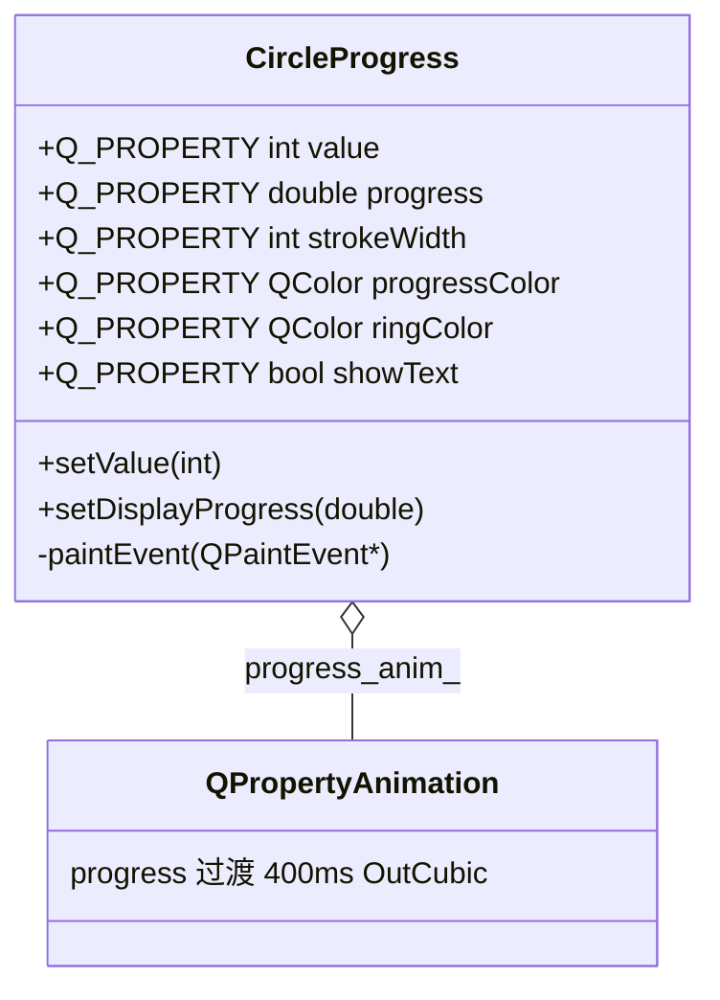

# CircleProgress 成品导览

> **source**：`widget/circle-progress/`　**related**：自绘控件递进链第 3 环（上一站 toggle-switch · 下一站 speed-meter）

CircleProgress 是个圆形进度环——下载、安装、任务进度那种「转圈的环 + 中间一个百分比」。它在递进链里刚好接在 toggle-switch 后面：toggle-switch 教的是「一个动画属性 + 鼠标交互」，CircleProgress 教的是「**两个进度属性解耦** + `drawArc` 角度换算」。这套骨架和 status-led / toggle-switch 同源，换的是绘制技术（这次是弧）和动画对象（这次驱动一个 0..1 的 double）。

::: tip 本篇是「成品导览」
想直接用成品 → 看这里（架构 / 决策 / 踩坑 / 怎么读）。
想自己从零搓出来 → 转 [手搓手册](./handbook/)。
:::

## 1. 它做什么

一个 `AwesomeQt::CircleProgress` 控件：

- **value 0..100** 的环形进度，背景整圈环 + 进度弧从 12 点钟顺时针铺开
- **平滑过渡**：setValue 不是突变，而是 400ms `OutCubic` 把弧从当前进度接力铺到新进度（`QPropertyAnimation` 驱动一个 0..1 的 `progress` 属性）
- **中心百分比文字**：随弧一起动，可关
- **完整 Q_PROPERTY**：`value` / `progress` / `strokeWidth` / `progressColor` / `ringColor` / `showText` 六个属性全可被动画 / Qt Designer / 外部驱动

跑起来看一眼比读十行描述管用：

```bash
cd widget && cmake -B build && cmake --build build
./build/circle-progress/demo/circle_progress_demo
```

## 2. 架构总览

### 类关系

CircleProgress 自己持一个动画对象，业务态和动画态分两个成员变量：



关键就在 `value_`（业务值，0..100，`include/circle_progress.h:79`）和 `progress_`（动画产物，0..1，`include/circle_progress.h:80`）这两个独立变量。`setValue` 改的是 `value_` 并启动动画，动画每帧写的是 `progress_`，`paintEvent` 按 `progress_` 画弧。两件事写不同地方，所以「连点 setValue」不会让弧在旧目标和新目标之间乱跳。

### 文件职责

| 文件 | 职责 |
|---|---|
| `include/circle_progress.h` | 接口：六个 Q_PROPERTY + 公有 API + 成员声明 |
| `src/circle_progress.cpp` | 实现：动画初始化 / value→progress 接力 / drawArc 自绘 |
| `demo/circle_progress_window.cpp` | 演示：静态多档 / 大环+Cycle+Slider / 配色线宽变体 |

### setValue 到重绘怎么跑

```mermaid
sequenceDiagram
    participant U as 调用方
    participant C as CircleProgress
    participant A as progress_anim_
    participant P as paintEvent
    U->>C: setValue(60)
    C->>C: value_=60; emit valueChanged
    C->>A: stop(); setStartValue(progress_当前); setEndValue(0.6); start()
    loop 每帧
        A->>C: setDisplayProgress(插值)
        C->>C: progress_=插值; update()
    end
    C->>P: 合并重绘
    P->>P: drawArc 背景环 + 进度弧(span=progress×5760) + 文字
```

## 3. 关键设计决策

**① value 和 progress 拆成两个属性，动画驱动 progress 不驱动 value。**
`value`（`include/circle_progress.h:29`）是业务语义（用户设的 0..100），`progress`（`include/circle_progress.h:30`）才是 `QPropertyAnimation` 每帧写的那个（0..1）。如果让动画直接驱动 value，那 value 的 WRITE 就是 setValue、setValue 又启动画——栈溢出（踩坑③）。拆开后 WRITE 指向 `setDisplayProgress`（纯赋值+emit+update），setValue 只管改 value_ 和发车动画，职责不混。

**② 动画对象用持久成员指针，从当前 progress 接力。**
`progress_anim_`（`include/circle_progress.h:86`）在构造时 `new QPropertyAnimation(this, "progress", this)`，parent=this 对象树托管。setValue 里 `stop()/setStartValue(progress_)/setEndValue()/start()`（`src/circle_progress.cpp:55`）——从当前显示进度接力到新目标。不用 `DeleteWhenStopped`，否则频繁 setValue 会反复 new/delete、别处持指针还悬空。

**③ 进度弧从 12 点钟顺时针铺开，靠 drawArc 角度换算。**
`QPainter::drawArc` 的角度是 1/16°、0°=3 点钟、正值逆时针（`src/circle_progress.cpp:22` 注释写清）。12 点钟 = 90° → 起始角 1440；顺时针铺开 = 扫角取负。所以进度弧是 `drawArc(arc_rect, 1440, -span)`（`src/circle_progress.cpp:191`），span = progress×5760。这一行是整个控件最容易画反的地方。

**④ 几何尺寸全 clamp，防控件被布局压极小时 drawArc 行为未定义。**
半径 `side/2 - stroke/2 - 2` 在控件极小或线宽极大时会算成负/0，`drawArc` 对负宽高矩形行为未定义。所以 `std::max(1.0, ...)` 兜底（`src/circle_progress.cpp:165`）。和 status-led 踩坑⑥同款，自绘控件标配。

**⑤ 配色/线宽/文字开关全做 Q_PROPERTY，demo 直接证可用。**
`progressColor` / `ringColor` / `strokeWidth` / `showText` 是真属性，demo 的 Variants 区三个环（绿细 / 橙粗无字 / 紫）就是靠 setter 设出来的，换主题不用改控件源码。

## 4. 怎么读这份 code

按这个顺序读，最快建立心智：

1. **`include/circle_progress.h` 的 Q_PROPERTY 六件套**（29-34 行）——先看「value 和 progress 是两个属性」
2. **`setValue`**（`src/circle_progress.cpp:55`）——盯 `stop()+setStartValue(progress_)+start()` 这三行接力
3. **`setDisplayProgress`**（`src/circle_progress.cpp:77`）——动画每帧回调，纯赋值 + emit + update
4. **`paintEvent`**（`src/circle_progress.cpp:161`）——背景环 drawArc 整圈（179 行）、进度弧 drawArc 带负扫角（191 行）、中心文字（206 行）
5. **角度常量**（`src/circle_progress.cpp:24-25`）——`kStartAngle16=1440`、`kFullCircle16=5760`，配合注释理解 drawArc 角度换算

入口：`demo/main.cpp` → `demo/circle_progress_window.cpp` 跑起来，对照读。

## 5. 踩坑

| # | 现象 | 原因 | 后果 | 解法 |
|---|---|---|---|---|
| ① | 进度弧逆时针铺开 / 从 3 点钟起 | drawArc 角度体系（0°=3 点、正值逆时针、1/16°）和直觉相反，直接塞「顺时针 12 点起」会画反 | 视觉错（进度方向不对，非崩溃） | 起始角用 1440（12 点钟），扫角取负（顺时针），换算写注释（`src/circle_progress.cpp:22,191`） |
| ② | 连点 setValue 弧在旧目标/新目标间跳变 | 动画从 0 或旧 value 起步，没从当前显示进度接力 | 视觉跳变（非崩溃） | `setStartValue(progress_)` 从当前显示进度接力（`src/circle_progress.cpp:55`） |
| ③ | 把 progress 的 WRITE 指向 setValue | 动画驱动 setValue → setValue 又启动画 → 无限递归 | **栈溢出** | WRITE 指 `setDisplayProgress`（纯赋值+emit+update），setValue 是业务入口（`src/circle_progress.cpp:77`） |
| ④ | 控件压极小时弧消失 / drawArc 崩 | 半径 `side/2 - stroke/2 - 2` 极小时为负/0 | drawArc 行为未定义 | 半径 `std::max(1.0, ...)` clamp 兜底（`src/circle_progress.cpp:165`） |
| ⑤ | 动画回调里用 repaint() | repaint() 同步立即重绘，不等事件循环 | 动画掉帧 | 一律 `update()`（异步合并，`src/circle_progress.cpp` 的 setDisplayProgress） |

## 6. 官方文档

- [QPainter::drawArc](https://doc.qt.io/qt-6/qpainter.html#drawArc)——画弧（角度 1/16°、方向约定）
- [QPropertyAnimation](https://doc.qt.io/qt-6/qpropertyanimation.html)——属性动画（驱动 progress）
- [Qt 属性系统（Q_PROPERTY）](https://doc.qt.io/qt-6/properties.html)——为什么 progress 能被动画驱动
- [QFontMetrics](https://doc.qt.io/qt-6/qfontmetrics.html)——居中绘制百分比文字

---

这套机制（业务属性 / 动画属性解耦 + 持久动画指针 + drawArc 自绘）和 status-led、toggle-switch 是同一套范式，换的只是「画什么」。下一站 speed-meter 会把这套骨架接到指针旋转上——动画属性从 0..1 的进度变成角度，再加刻度。想自己搓？[手搓手册](./handbook/)带你从空 main 搓到这个成品。
