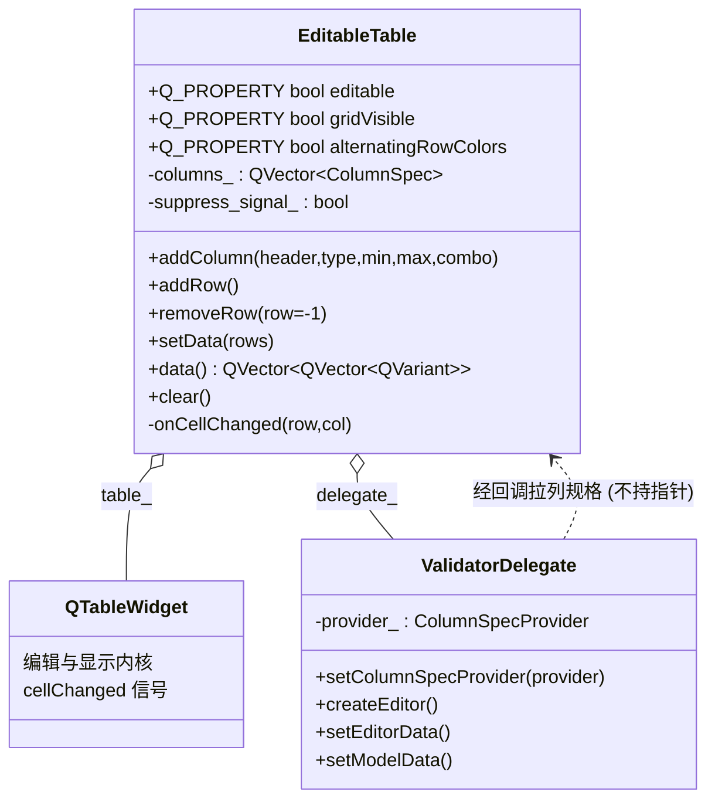
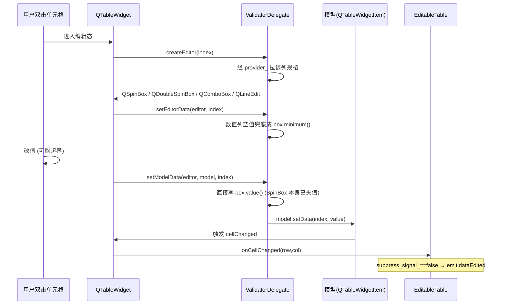

# EditableTable 成品导览

> **source**：`widget/editable-table/`　**related**：model/view 组合控件递进链第 1 环　·　教程层 [QTableWidget 入门](../../../../beginner/03-qtwidgets/50-qtablewidget-beginner.md) / [Model/View 进阶](../../../../advanced/03-qtwidgets/03-model-view-advanced.md)

EditableTable 是个可编辑表格——业务里最常见的那种「五列里又有文本、又有整数范围、又有下拉、又有勾选」的录入表。QTableWidget 本身能编辑任意文本，但「这一列只能是 0-100 的整数、那一列只能在 红绿蓝 里选」这种约束它不管。我们用**委托**把这层校验补上，再封一层把整表数据按列类型往返存取，就成了一个开箱即用的录入控件。

本件和 status-led / toggle-switch 不是一类——那俩是自绘，这件是**组合**：不重写 paintEvent，让 QTableWidget 自己画，我们在它外面套壳 + 挂委托。这恰恰是 model/view 系统的正确打开方式。

::: tip 本篇是「成品导览」
想直接用成品 → 看这里（架构 / 决策 / 踩坑 / 怎么读）。
想自己从零搓出来 → 转 [手搓手册](./handbook/)。
:::

## 1. 它做什么

一个 `AwesomeQt::EditableTable` 控件：

- **按列声明类型**：`addColumn` 时指定 `kText` / `kInt` / `kDouble` / `kCombo` / `kCheck`，外加数值列的 `[min,max]` 和下拉列的候选项
- **委托校验**：编辑时按列类型弹出对应编辑器（`QLineEdit` / `QSpinBox` / `QDoubleSpinBox` / `QComboBox`），数值列越界自动夹值、空值兜底成范围最小值，下拉列只能选候选项
- **勾选列不走委托编辑器**：用 `Qt::ItemIsUserCheckable` 直接在单元格里勾，独立于委托的弹出编辑流程
- **整表数据往返**：`setData(QVector<QVector<QVariant>>)` 一次性回填（越界夹值、类型不符兜底），`data()` 一次性按列类型取回（kCheck 还原成 bool）
- **行为开关 Q_PROPERTY**：`editable` / `gridVisible` / `alternatingRowColors` 三个属性可在 Designer 或外部直接驱动

跑起来看一眼比读十行描述管用：

```bash
cd widget && cmake -B build && cmake --build build
./build/editable-table/demo/editable_table_demo
```

打开后你会看到一张五列表：姓名(文本) / 分数(整数 0-100) / 比率(双精度 0-1) / 颜色(下拉 红/绿/蓝) / 启用(勾选)。预填的三行里 Bob 那行是故意超界的（分数 120→100、比率 1.5→1.0、颜色 Yellow→Red 回库），用来证明回填阶段的夹值。双击分数列单元格输个 `9999` 或 `abc`，提交后会被夹回 100——这就是委托在干活。下方「Print Data」把 `data()` 拍出来的二维数据格式化进 QTextEdit，编辑任意单元格都会实时回显。

## 2. 架构总览

### 类关系

EditableTable 是组合而非继承：它拥有一个 `QTableWidget` 当显示与编辑的内核，再拥有一个 `ValidatorDelegate` 当编辑校验器。委托不直接持有父表指针，而是通过一个回调从父表拉列规格——这个解耦是整份代码最关键的一笔。



三个对象的关系是单向的：EditableTable 拥有 `table_` 和 `delegate_`（对象树托管，`new ... this`），而 `delegate_` 反向访问 EditableTable 时走的是 `std::function` 回调（`editable_table.cpp:159`），不在 detail 层留一个指向父表的强引用。这避免了「委托持有父表 → 父表又持有委托」的环。

### 文件职责

| 文件 | 职责 |
|---|---|
| `include/editable_table.h` | 接口：ColumnType 枚举 + Q_PROPERTY 三件套 + 公有 API + detail::ValidatorDelegate 声明 |
| `src/editable_table.cpp` | 实现：委托编辑器/校验逻辑 + 列/行管理 + 整表数据往返 + 去重与边界 clamp |
| `demo/editable_table_window.cpp` | 演示：五类型列 + 预填超界行 + 增删清 + 打印数据 + 只读切换 |

### 一次编辑怎么走完校验



重点在 setModelData 这步：数值列**不再二次判空**，因为 setEditorData 阶段已经把空值兜成最小值，`QSpinBox::value()` 永远在合法区间内。校验被前置，提交阶段只管写。勾选列根本不进这条链——它靠 cellChanged 信号捕捉 `checkState` 变化。

## 3. 关键设计决策

**① 组合 QTableWidget，不继承也不自绘。**
EditableTable 继承的是 QWidget，把 QTableWidget 当私有成员 `new` 出来挂 parent、塞进布局。不重写 paintEvent，让 view 自己画。这是本批 model/view 组合控件的定位——和自绘派（status-led）分道扬镳。代价是少了一层绘制控制权，收益是白嫖了 QTableWidget 全套的选择/编辑/滚动/表头行为（`editable_table.cpp:151`）。

**② 委托独立成 detail::ValidatorDelegate，用回调取列规格而非持父表指针。**
委托挂在 AwesomeQt::detail 子命名空间，是个独立的 Q_OBJECT 类。它要知道某列该弹什么编辑器、范围是多少，但不直接 `EditableTable*`——而是吃一个 `ColumnSpecProvider` 回调（`std::function`），由父表在构造时注入（`editable_table.cpp:159`）。好处是 detail 层不依赖 EditableTable 的完整定义，没有环引用；ColumnType 还经 `columnTypeToInt` 折成 int 透传，detail 层连枚举都不用认识。这种「下游靠回调拿配置」的模式在后续 model/view 控件里会反复出现。

**③ 校验前置：数值列空值在 setEditorData 兜底，setModelData 只管写。**
最初的想法是 setModelData 里判空——空就 return 或恢复旧值。实际写下来发现：`QSpinBox` / `QDoubleSpinBox` 本身就有 `[min,max]` 夹值，只要进编辑器时把空值兜成 `box->minimum()`（`editable_table.cpp:90`），提交时 `box->value()` 必然合法，setModelData 直接写即可，不用再判（`editable_table.cpp:118`）。校验点收敛到一处，逻辑更薄。kCombo 同理用 `findText` 回库首项兜底（`editable_table.cpp:101`）。

**④ 整表数据往返统一走夹值 + 兜底，绝不抛。**
`setData` 回填时按列类型转换：kInt 用 `std::clamp` 夹到 `[min,max]`、kDouble 同理、kCombo 不在候选项就回库首项、kCheck 还原 `Qt::Checked/Unchecked`（`editable_table.cpp:278`）。`data()` 取回时按列类型还原 QVariant：kCheck→bool、kInt/kDouble 转换失败给 `QVariant()`（`editable_table.cpp:358`）。行数据短于列数时补空占位 `QTableWidgetItem`，避免 `item==null`（`editable_table.cpp:327`）。整条链路对越界/类型不符一律安全夹值或兜底，外部调一次 `setData` 永不崩。

**⑤ suppress_signal_ 屏蔽程序化回灌，只让真实编辑发 dataEdited。**
`setData` / `addRow` / `clear` 都是程序化建项，会触发 `cellChanged`。若不拦，`onCellChanged` 会把这些程序化改动当用户编辑重新 emit 出去，外部接到一堆「假编辑」通知。解法是一个 `suppress_signal_` 布尔：程序化填值前置位、后清位，`onCellChanged` 入口先查它（`editable_table.cpp:445`）。只有 suppress 为 false（即用户真实双击编辑）才 emit `dataEdited`。这是组合控件配合 view 信号的经典去重套路。

**⑥ 为 demo 需求补薄透传 getter，不暴露 table_ 指针。**
demo 要拿当前选中行删行、要列宽自适应——这俩是 QTableWidget 的方法，EditableTable 没有对应接口。与其把 `table_` 指针 public 出去破坏封装，不如加两个薄透传 `currentRow()`（`editable_table.cpp:389`）和 `resizeColumnsToContents()`（`editable_table.cpp:393`）。一行实现换封装不破，这笔账划算。

## 4. 怎么读这份 code

按这个顺序读，最快建立心智：

1. **`include/editable_table.h` 的 ColumnType 枚举与 Q_PROPERTY**（85-86 行、78-81 行）——先看「对外暴露哪些类型和属性开关」
2. **`detail::ValidatorDelegate` 声明**（`include/editable_table.h:27`）——看委托的四个 override 签名和 `ColumnSpecProvider` 回调类型
3. **构造函数**（`src/editable_table.cpp:151`）——QTableWidget 怎么 new、委托怎么注入回调、cellChanged 怎么连
4. **委托的 createEditor**（`src/editable_table.cpp:41`）——按列类型挑编辑器的 switch，核心分发逻辑
5. **setEditorData + setModelData**（`src/editable_table.cpp:80` / `src/editable_table.cpp:110`）——校验前置怎么落地、提交阶段为什么不用判空
6. **setData**（`src/editable_table.cpp:261`）——整表回填的夹值/兜底全链路
7. **data()**（`src/editable_table.cpp:334`）——出口怎么按列类型还原 QVariant
8. **onCellChanged**（`src/editable_table.cpp:444`）——suppress 去重 + 边界 clamp

入口：`demo/main.cpp` → `demo/editable_table_window.cpp` 跑起来，对照读。重点把 demo 里 Bob 那行预填的 `120/1.5/Yellow` 和双击分数列输 `9999` 这两个校验点跑一遍，看委托到底夹回了什么。

## 5. 踩坑

| # | 现象 | 原因 | 后果 | 解法 |
|---|---|---|---|---|
| ① | cpp 编译报 `expected type-specifier before 'QVBoxLayout'` | 构造里 `new QVBoxLayout(this)`，但 cpp 只引了 `QTableWidget` / `QTableWidgetItem` 等，漏了 `QVBoxLayout` | 编译不过 | cpp 顶部补 `#include <QVBoxLayout>`（`src/editable_table.cpp:16`）。Q_OBJECT 类的 cpp 不像头文件那样顺手引布局类，新加布局代码要单独引 |
| ② | demo 编译报 `'class AwesomeQt::EditableTable' has no member named 'resizeColumnsToContents'` | `resizeColumnsToContents()` 是 QTableWidget 的方法，EditableTable 把它私有化了，外部直接调不到 | demo 编译不过 | 在 EditableTable 加薄透传 `void resizeColumnsToContents()` 调 `table_->resizeColumnsToContents()`（`src/editable_table.cpp:393`），而不是暴露 `table_` 指针 |
| ③ | demo 里写了 `table_->currentRowOfTable()` 想拿选中行，但方法不存在 | 笔误编造了方法名；EditableTable 一开始没有「取当前行」的接口 | 编译不过 | 加公有 `int currentRow() const` 透传 `table_->currentRow()`（`src/editable_table.cpp:389`），demo 删行改调 `removeRow(table_->currentRow())`——`removeRow` 自带 `-1`/越界删最后一行的兜底 |
| ④ | setData 后外部接到一堆 `dataEdited`，值还是刚填进去的 | 程序化 `setItem` 触发了 `cellChanged`，`onCellChanged` 把它当用户编辑 emit 出去 | 假通知刷屏、业务逻辑被无意义信号干扰 | `suppress_signal_` 布尔：setData/addRow/clear 入口置 true、出口置 false，`onCellChanged` 入口先查它（`src/editable_table.cpp:445`） |
| ⑤ | 数值列双击编辑后清空，提交存了空串 | setModelData 想判空但写漏了分支，或干脆没判 | 模型里混入非法空值，data() 出口 toInt 失败返回 `QVariant()` | 校验前置到 setEditorData：空值兜成 `box->minimum()`（`src/editable_table.cpp:90`），setModelData 只管写 `box->value()`，SpinBox 本身已夹值（`src/editable_table.cpp:118`） |
| ⑥ | setData 传的某行比列数短，data() 取到那行该列崩或返回脏值 | 短行没建 QTableWidgetItem，`table_->item(r,c)` 返回 null | 解引用 null 崩溃，或 data() 出口取到默认值 | setData 末尾对 `row_data.size() < col_count` 的列补空占位 item（`src/editable_table.cpp:327`）；data() 出口也做 `item ? item->text() : QString()` 兜底（`src/editable_table.cpp:357`） |

## 6. 官方文档

- [QTableWidget](https://doc.qt.io/qt-6/qtablewidget.html)——可编辑表格控件（本件的显示与编辑内核）
- [QStyledItemDelegate](https://doc.qt.io/qt-6/qstyleditemdelegate.html)——委托基类（ValidatorDelegate 的父类，createEditor/setEditorData/setModelData 三件套）
- [QSpinBox](https://doc.qt.io/qt-6/qspinbox.html) / [QDoubleSpinBox](https://doc.qt.io/qt-6/qdoublespinbox.html)——数值列编辑器（自带 `[min,max]` 夹值）
- [QComboBox](https://doc.qt.io/qt-6/qcombobox.html)——下拉列编辑器（findText 回库兜底）
- [Model/View Programming](https://doc.qt.io/qt-6/model-view-programming.html)——委托在 model/view 体系里的定位
- [Qt::ItemFlag](https://doc.qt.io/qt-6/qt.html#ItemFlag-enum)——勾选列靠 `Qt::ItemIsUserCheckable` 实现
- [Qt 属性系统（Q_PROPERTY）](https://doc.qt.io/qt-6/properties.html)——editable / gridVisible / alternatingRowColors 三个属性开关的机制

---

这套机制（组合 QTableWidget + 委托按列分发 + 整表数据往返 + suppress 去重）不是 EditableTable 专属——它就是「一个带类型约束的可录入表格」的标准范式。后面做带自定义模型（QAbstractTableModel）的高级表格控件时，委托这套校验逻辑能原样复用，只是数据后端从 QTableWidget 换成自定义 model。想自己搓？[手搓手册](./handbook/)带你从空壳 QTableWidget 一行行搓到这个成品。
