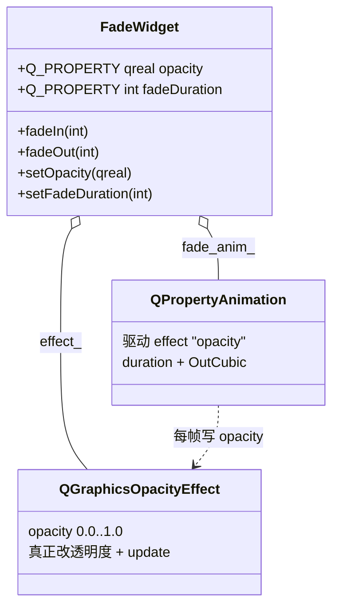

# FadeWidget 成品导览

> **source**：`widget/fade-animation/`　**related**：动画/特效控件递进链（上一站 [status-led](../status-led/) 的 Q_PROPERTY+动画骨架 · 下一站 toggle-switch/circle-progress 待产）　·　教程层 [QPropertyAnimation 属性动画](../../../../../beginner/03-qtwidgets/09-animation-framework-beginner.md) / [属性系统进阶](../../../../../advanced/01-qtbase/01-qobject-property-system-advanced.md)

FadeWidget 是个能把自己整体淡入、淡出的容器控件。比 status-led 那种自绘特效更轻——它不画任何东西，透明度全交给一个 `QGraphicsOpacityEffect` 扛，自己只负责把动画接到这个 effect 的 `opacity` 属性上。这套写法是 Qt 里做「通知条飘进来、启动画面隐去、视图切换过渡」最省事的范式，所以单独留一件成品。

::: tip 本篇是「成品导览」
想直接用成品 → 看这里（架构 / 决策 / 踩坑 / 怎么读）。
想自己从零搓出来 → 转 [手搓手册](./handbook/)。
:::

## 1. 它做什么

一个 `AwesomeQt::FadeWidget` 容器：

- **自身（连同内容）整体淡入/淡出**：一个 `QGraphicsOpacityEffect` 挂在自身，`QPropertyAnimation` 驱动它的 `opacity` 在 0↔1 间过渡
- **fadeIn / fadeOut 两入口**：`fadeIn()` 从透明渐显到不透明并保持可见；`fadeOut()` 从当前淡到透明，结束后 `hide()`
- **opacity 是真 Q_PROPERTY**：既能被动画按名字驱动，也能被外部滑块/Designer 瞬时设值——调 `setOpacity()` 不会触发动画，证明它是个正经的属性
- **可调时长 + 缓动**：默认 300ms `OutCubic`，`setFadeDuration()` 改默认时长，单次调用还能临时传参

跑起来看一眼比读十行描述管用：

```bash
cd widget && cmake -B build && cmake --build build
./build/fade-animation/demo/fade_animation_demo
```

## 2. 架构总览

### 类关系

一个 FadeWidget 「拥有」两个对象：effect 扛透明度，animation 驱动 effect：



两件事写在不同对象上：`effect_` 持有「透明度到底是多少」，`fade_anim_` 持有「透明度随时间怎么变」。`setOpacity()`（Q_PROPERTY 的 WRITE）直接写 `effect_->setOpacity()`——所以动画和外部滑块**写的是同一个 effect 的同一个属性**，天然同步，不用额外做状态桥。

### 文件职责

| 文件 | 职责 |
|---|---|
| `include/fade_animation.h` | 接口：Q_PROPERTY 两件（opacity / fadeDuration）+ fadeIn/fadeOut + signals |
| `src/fade_animation.cpp` | 实现：effect 挂载 / 动画初始化 / runFade 接力复用 / finished 回调隐藏 |
| `demo/fade_animation_window.cpp` | 演示：Fade In / Fade Out 按钮 + fadeDuration 滑块 + 瞬时 opacity 滑块（含反向同步防回灌） |

### 一次淡入怎么跑起来

```mermaid
sequenceDiagram
    participant U as 调用方
    participant F as FadeWidget
    participant A as fade_anim_
    participant E as effect_
    U->>F: fadeIn(300)
    F->>E: setOpacity(0.0)（先全透明，防"先蹦出来"）
    F->>F: show()
    F->>A: stop(); setDuration(300); setStartValue(当前opacity); setEndValue(1.0); start()
    loop 每帧
        A->>E: 写 opacity（中间值）
        E->>E: update()
    end
    A-->>F: finished 信号
    F->>F: fading_out_==false → 保持可见，emit fadeFinished(false)
```

重点：fadeIn 在不可见时**先 `setOpacity(0.0)` 再 `show()`**，否则 effect 初值是 1.0，`show()` 会先把全不透明画面渲染出来——这就是最常见的「先蹦出来再淡」跳变（见踩坑①）。

## 3. 关键设计决策

**① `opacity` 的 WRITE 是纯赋值，本身不调动画；fadeIn/fadeOut 才是动画入口。**
`setOpacity()` 只做 `effect_->setOpacity()` + clamp [0,1] + `emit opacityChanged`（`src/fade_animation.cpp:70-81`）。动画由 `fadeIn/fadeOut` 调 `runFade()` 启动（`src/fade_animation.cpp:87-97`）。这样外部既可以用滑块瞬时设值（证明 opacity 是真 Q_PROPERTY），也能让动画按名字驱动它——两条路写同一个 effect，不冲突。对比 status-led 的 `setAnimatedColor`：那里 WRITE 也不能启动画，否则无限递归。

**② `fade_anim_` 是持久成员指针，parent=this 托管，禁 `DeleteWhenStopped`。**
`new QPropertyAnimation(effect_, "opacity", this)`，配 `setEasingCurve(OutCubic)`（`src/fade_animation.cpp:21-22`）。每次动画用 `stop()` + 重配 `setStartValue`（取当前实时 opacity）+ `setEndValue` + `start()` 复用同一对象（`src/fade_animation.cpp:92-96`）。沿用 status-led 的教训：`DeleteWhenStopped` 在连发动画时会让旧指针悬空，持久指针从当前值接力争、不跳变、不崩。

**③ fadeIn 不可见时先 `setOpacity(0.0)` 再 `show()`，fadeOut 必须先 `show()`。**
fadeIn 不可见时若直接 start，effect 初值 1.0 会让画面先全显示再从 0 淡入（`src/fade_animation.cpp:33-37`）。fadeOut 反过来：必须先可见才能看到淡出过程（`src/fade_animation.cpp:44-46`）。这两条是「动画从正确起点开始」的核心。

**④ fadeOut 用 `fading_out_` 标记，finished 回调里 `hide()` + emit。**
成员 bool `fading_out_` 标记当前是不是淡出（`include/fade_animation.h:74`）。finished 回调里若在淡出则 `hide()` 营造「消失」语义，再 `emit fadeFinished(fading_out_)`（`src/fade_animation.cpp:23-29`）。fadeIn 不隐藏，保持可见——语义对称。

**⑤ duration<1 在 fadeIn / fadeOut / setFadeDuration / runFade 四处兜底成 1。**
0 或负时长会让动画不启动（`src/fade_animation.cpp:52-54`、`src/fade_animation.cpp:88-90`）。统一兜底，语义干净，不用在调用处再判断。

## 4. 怎么读这份 code

按这个顺序读，最快建立心智：

1. **`include/fade_animation.h` 的 Q_PROPERTY 两件**（32-33 行）——先看「opacity / fadeDuration 两个可驱动属性」，注意 fadeFinished 信号（64 行）
2. **构造函数**（`src/fade_animation.cpp:14-30`）——effect 怎么 new + setGraphicsEffect + 初值 1.0，fade_anim_ 怎么 new + 配 easing + 连 finished 回调
3. **`setOpacity`**（`src/fade_animation.cpp:70-81`）——Q_PROPERTY 的 WRITE，纯赋值 + clamp + emit，确认它不调动画
4. **`runFade`**（`src/fade_animation.cpp:87-97`）——动画复用核心，盯 `stop()` + `setStartValue(当前 opacity)` + `setEndValue` + `start()` 这四行
5. **`fadeIn` / `fadeOut`**（`src/fade_animation.cpp:32-49`）——两个入口，注意 fadeIn 的「先 setOpacity(0.0) 再 show()」和 fadeOut 的「先 show()」
6. **demo 的反向同步**（`demo/fade_animation_window.cpp:129-137`）——opacityChanged 回灌滑块时用 `QSignalBlocker` 防环

入口：`demo/main.cpp` → `demo/fade_animation_window.cpp` 跑起来，对照读。

## 5. 踩坑

| # | 现象 | 原因 | 后果 | 解法 |
|---|---|---|---|---|
| ① | fadeIn 时控件先全显示，再从 0 淡入——视觉跳变 | 不可见状态下直接 start 动画，effect 初值是 1.0，`show()` 先把全不透明画面渲染出来 | 淡入前闪一下全图 | fadeIn 里 `if(!isVisible())` 先 `effect_->setOpacity(0.0)` 再 `show()`（`src/fade_animation.cpp:33-37`） |
| ② | 连点 Fade Out 多次后崩溃 / 动画错乱 | 每次新建动画，或用 `DeleteWhenStopped`，旧指针悬空 | segfault | 持久成员指针 + parent=this，`runFade` 里 `stop()` 后重配 startValue(当前 opacity)/endValue 再 `start()`（`src/fade_animation.cpp:21`、`src/fade_animation.cpp:92-96`） |
| ③ | demo 里 opacity 滑块被动画拖动时，与用户操作互相回灌 | `opacityChanged` 反向 setValue 滑块，又触发 `valueChanged`→`setOpacity`，形成信号环 | 滑块抖动 / 性能浪费 | 反向同步用 `QSignalBlocker` 临时屏蔽滑块信号再 setValue，且判断 `slider->value()!=pct` 才写（`demo/fade_animation_window.cpp:129-137`） |
| ④ | duration 传 0 时动画不动 | QPropertyAnimation 时长为 0 不启动 | 控件永远停在起点 | duration<1 统一兜底成 1（`src/fade_animation.cpp:52-54`、`src/fade_animation.cpp:88-90`） |
| ⑤ | 以为 setOpacity 会触发淡入淡出 | 误以为 Q_PROPERTY 的 WRITE 等于动画入口 | 把动画逻辑写进 setter 导致重复触发 | 认清 `setOpacity` 是纯赋值回调，动画由 fadeIn/fadeOut 经 runFade 启动（`src/fade_animation.cpp:70-81`） |

## 6. 官方文档

- [QGraphicsOpacityEffect](https://doc.qt.io/qt-6/qgraphicsopacityeffect.html)——透明度特效（透明度的真正承载者）
- [QPropertyAnimation](https://doc.qt.io/qt-6/qpropertyanimation.html)——属性动画（驱动 opacity）
- [QWidget::setGraphicsEffect](https://doc.qt.io/qt-6/qwidget.html#setGraphicsEffect)——把 effect 挂到控件上
- [Qt 属性系统（Q_PROPERTY）](https://doc.qt.io/qt-6/properties.html)——为什么 opacity 能被动画按名字驱动
- [QSignalBlocker](https://doc.qt.io/qt-6/qsignalblocker.html)——临时屏蔽信号，防反向同步成环

---

这套机制（effect 扛特效 + QPropertyAnimation 驱动 + Q_PROPERTY WRITE 纯赋值）不是 FadeWidget 专属——它是「给一个现成控件加淡入淡出」的标准范式，往任何 widget 上挂一个 QGraphicsOpacityEffect 都能复用。想自己搓？[手搓手册](./handbook/)带你从空 main 一行行搓到这个成品。
