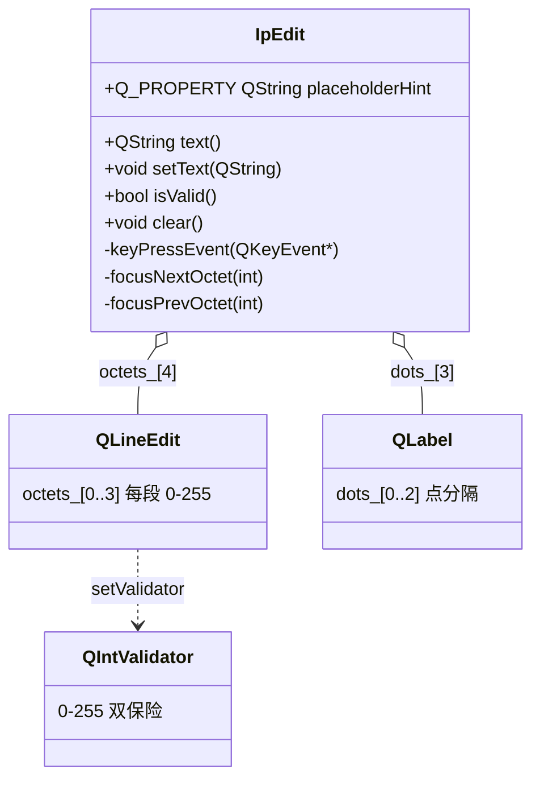
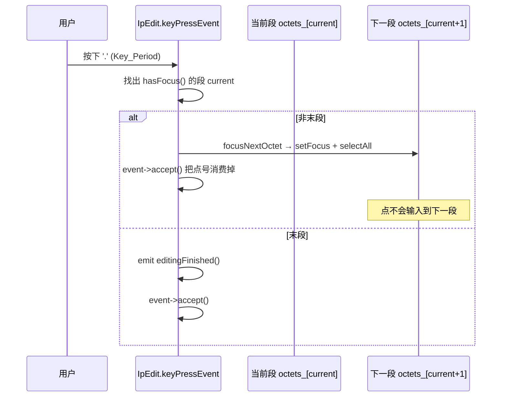

# IpEdit 成品导览

> **source**：`widget/ip-edit/`　**related**：组合控件递进链第 2 环（上一站 status-led）·　教程层 [QLineEdit 入门](../../../../../beginner/03-qtwidgets/22-qlineedit-beginner.md) / [事件处理进阶](../../../../../advanced/03-qtwidgets/02-event-handling-advanced.md)

IpEdit 是个 IPv4 地址输入框——网络配置面板上那种四段用点隔开的小方块。它本身不复杂，但要做得「顺手」很吃细节：满 3 位自动跳下段、按点号跳段还要把点吃掉、段首退格要跳回上段继续删、`setText("999.1.1.1")` 得夹回 `255.1.1.1`。我们把它当实例库第二件成品，因为它把「组合多个子控件 + 重写按键事件做跨子控件焦点流转 + 程序化回填要抑制中间信号」这套范式占全了——后面凡是要把几个原生控件拼成一个「会用」的复合输入控件，都照这套骨架走。

::: tip 本篇是「成品导览」
想直接用成品 → 看这里（架构 / 决策 / 踩坑 / 怎么读）。
想自己从零搓出来 → 转 [手搓手册](./handbook/)。
:::

## 1. 它做什么

一个 `AwesomeQt::IpEdit` 控件：

- **4 段八位输入**：4 个 `QLineEdit`（`octets_[0..3]`）用 3 个 `QLabel(".")` 分隔，`QHBoxLayout` 排开，每段 `maxLength(3)` + 居中 + `QIntValidator(0,255)` 双保险
- **跨段焦点流转**：满 3 位合法自动跳下段、按 `.`（兼容 `,`）跳下段且把点号消费掉、段首退格且段空则跳回上段继续删末位、任意段回车非末段跳下段
- **双向地址 API**：`text()` 拼 `"a.b.c.d"`（空段补 0）；`setText()` 按点拆分、越界段 `std::clamp(0,255)`、缺段补 0、非数字段补 0、空串全清
- **可被 Designer 驱动**：`Q_PROPERTY(QString placeholderHint)` 同步下发到 4 个子段，`textChanged` / `editingFinished` 两个信号对外

跑起来看一眼比读十行描述管用：

```bash
cd widget && cmake -B build && cmake --build build
./build/ip-edit/demo/ip_edit_demo
```

## 2. 架构总览

### 类关系

`IpEdit` 继承 `QWidget`，把 4 个 `QLineEdit` 和 3 个 `QLabel` 当**子控件**用对象树托管，自己只负责拦截按键做跨段焦点流转和地址拼装：



关键点：4 个 `QLineEdit` 是平级兄弟控件，`IpEdit` 自己**不存地址状态**——地址永远从 4 个子段的 `text()` 现拼。这避免了「成员变量与子控件显示不一致」的同步地狱，代价是每次 `text()` 都要遍历 4 段（4 段无所谓，开销可忽略）。

### 文件职责

| 文件 | 职责 |
|---|---|
| `include/ip_edit.h` | 接口：Q_PROPERTY(placeholderHint) + 公有 API（text/setText/isValid/clear）+ `keyPressEvent` 重写声明 |
| `src/ip_edit.cpp` | 实现：4 段构造与信号接线 / 地址拼装与回填 / 按键拦截做跨段焦点流转 |
| `demo/ip_edit_window.cpp` | 演示：输入回显 / 预设地址 setText / 清空 / 越界·缺段·非数字·空串边界校验 |

### 按 `.` 跳段怎么跑起来



重点在 `event->accept()`——若不消费这个点号，`QLineEdit` 会把它当作正常字符塞进当前段，你就在 IP 框里看到一个多余的 `.`。`accept()` 之后事件不再向上冒泡、也不交给子控件的默认处理，点号就被「吃掉」了。

## 3. 关键设计决策

**① 焦点流转走 `keyPressEvent`，不靠 `focusNextChild`。**
`focusNextChild` 走的是 Qt 的 Tab 焦点链，它不会帮你拦截 `.`，也不会判断「段首退格」这种上下文。我们在 `IpEdit` 这一层重写 `keyPressEvent`（`src/ip_edit.cpp:198`），自己定位当前聚焦段、按键类型分发：`.`/`,` 跳下段并 `accept()` 消费点号，段首 `BackSpace` 且段空则 `prev->setFocus()` + `prev->backspace()` 继续删上段末位，回车非末段跳下、末段发 `editingFinished`。控制权牢牢在自己手里。

**② 满 3 位自动跳下段，用 lambda 按值捕获段索引 `i`。**
构造时给每个 `octets_[i]` 连 `textEdited`，lambda 里直接用捕获的 `i` 做判断（`src/ip_edit.cpp:37`）——满 3 位且 `toInt()` 在 0-255 就 `focusNextOctet(i)`。这绕开了一个坑：初版想用私有 `senderIndex()` 取发送者段索引，可那函数压根没定义，编译直接报错。按值捕获 `i` 既不用 `sender()` 反查、也避免了未定义引用，是 Qt lambda 接线的标准姿势。

**③ `text()` 空段补 0、`setText` 用 `SkipEmptyParts` 拆分 + `std::clamp` 夹值。**
`text()`（`src/ip_edit.cpp:76`）遍历 4 段，每段 `toInt()` 失败就补 `"0"`，最后 `join('.')`——所以空控件读出来是 `"0.0.0.0"` 而不是 `"..."`。`setText`（`src/ip_edit.cpp:90`）反过来：`split('.', Qt::SkipEmptyParts)` 拆段，每段 `std::clamp(val,0,255)` 夹越界（`999` → `255`），`toInt()` 失败补 0（`"a"` → `0`），段数不足补 0（`"1.2.3"` → `1.2.3.0`），空串走 `clear()`。每段回填用 `QSignalBlocker` 抑制中间信号、末尾统一发一次 `textChanged`。

**④ `isValid()` 把全 0 视为「未填写」判 false。**
`"0.0.0.0"` 语法上合法，但在表单场景里几乎没人真填这个地址，留着它当合法值会让「必填校验」形同虚设。所以 `isValid()`（`src/ip_edit.cpp:123`）除常规的「4 段都 0-255、非空、纯数字」外，额外用一个 `any` 标志记录「是否有任意段非 0」，全 0 就返回 false。要严格语义就把这个 `any` 判断摘掉。

**⑤ 头文件直接 `#include <QLabel>` / `<QLineEdit>`，不在命名空间里前向声明。**
`QLabel` / `QLineEdit` 是非模板 Qt 公有类，直接 include 安全无开销（`include/ip_edit.h:8`）。初版图省事在 `namespace AwesomeQt { class QLabel; }` 里前向声明，编译器把 `QLabel` 当成 `AwesomeQt` 命名空间内的类，和全局 `::QLabel` 不是同一类型，cpp 里 `new QLabel` 时报 `incomplete type`——见踩坑①。直接 include 一劳永逸。

**⑥ STATIC 库 + `add_subdirectory(demo)`，CMake 严格照 status-led 模板。**
`widget/ip-edit/CMakeLists.txt` 只做三件事：`add_library(ip_edit STATIC ...)`、`target_include_directories(... PUBLIC include)`、`target_link_libraries(... PUBLIC Qt6::Core/Gui/Widgets)`。**不在此 set C++ 标准、不 find_package**——这些由根 `widget/CMakeLists.txt` 统一提供，子库重复设会和兄弟库打架。

**⑦ `setFocusProxy(octets_[0])` + `StrongFocus`：Tab 进控件直落第一段。**
不加这两行，Tab 聚焦到 `IpEdit` 这个空壳 `QWidget` 上时，4 个子段哪个都不亮，用户得再按一次 Tab 才进第一段。`setFocusProxy`（`src/ip_edit.cpp:69`）把壳的焦点代理给第一段，Tab 一进来光标就在 `octets_[0]` 里。

## 4. 怎么读这份 code

按这个顺序读，最快建立心智：

1. **构造里的 4 段循环 + 信号接线**（`src/ip_edit.cpp:28`）——先看「4 段怎么建、`textEdited`/`textChanged`/`editingFinished` 三条信号各连什么」
2. **`keyPressEvent`**（`src/ip_edit.cpp:198`）——跨段焦点流转核心，盯 `Key_Period` 分支的 `accept()` 和 `Key_Backspace` 分支的 `prev->backspace()`
3. **`text()`**（`src/ip_edit.cpp:76`）——地址拼装，空段补 0 的兜底
4. **`setText()`**（`src/ip_edit.cpp:90`）——回填核心，`SkipEmptyParts` + `std::clamp` + `QSignalBlocker` 三件套怎么配合
5. **`isValid()`**（`src/ip_edit.cpp:123`）——全 0 判 false 的 `any` 标志
6. **`focusNextOctet` / `focusPrevOctet` / `octet`**（`src/ip_edit.cpp:267`）——焦点辅助，`octet()` 的边界保护

入口：`demo/main.cpp` → `demo/ip_edit_window.cpp` 跑起来，对照读。

## 5. 踩坑

| # | 现象 | 原因 | 后果 | 解法 |
|---|---|---|---|---|
| ① | cpp 编译报 `invalid use of incomplete type 'class AwesomeQt::QLabel'`（line 60 `new QLabel`） | 头文件里写了 `namespace AwesomeQt { class QLabel; }` 前向声明，编译器把 `QLabel` 当成命名空间内的类，与全局 `::QLabel` 不是同一类型，cpp 里 `new QLabel` 时类型不完整 | **编译失败** | 删掉命名空间内的前向声明，头文件顶部直接 `#include <QLabel>`（`include/ip_edit.h:8`） |
| ② | cpp 编译报 `error: 'senderIndex' was not declared` | 初版 `connect(textEdited)` 连私有槽 `onOctetTextChanged`，槽内想取发送者段索引却调了不存在的 `senderIndex()` | **编译失败** | 改在 `connect` 的 lambda 里按值捕获段索引 `i`，满 3 位判断内联进 lambda，删掉槽声明与定义（`src/ip_edit.cpp:37`） |
| ③ | 按 `.` 跳段后，下一段里出现一个多余的 `.` | `keyPressEvent` 里只 `focusNextOctet()` 没 `event->accept()`，事件继续冒泡交给子 `QLineEdit` 默认处理，点号被当字符输入 | 视觉脏数据（如某段里多出一个 `.`） | 跳段后 `event->accept()` 消费点号（`src/ip_edit.cpp:220`） |
| ④ | `setText("192.168.1.1")` 触发了一堆 `textChanged` | 每段 `edit->setText()` 各发一次子段 `textChanged`，外层 lambda 各转发一次，按钮点一下回显闪 4 次 | 假信号、外部回显抖动 | 每段回填包 `QSignalBlocker`，末尾统一 `emit textChanged(text())` 一次（`src/ip_edit.cpp:104`） |
| ⑤ | 段首退格没跳回上段，或跳回了却删不掉上段末位 | 只 `prev->setFocus()` 没把光标置段末、没调 `prev->backspace()`；或忘了判「段空 + 光标在段首」就跳，导致段里有字也被跳走 | 交互别扭（要么跳不回，要么跳回删错位） | 条件齐全（`isEmpty() && cursorPosition()==0 && current>0`）才跳，跳后 `setCursorPosition(length())` + `backspace()`（`src/ip_edit.cpp:233`） |
| ⑥ | Tab 进控件后 4 段全不亮，得再按一次 Tab 才进第一段 | 壳 `QWidget` 没设焦点代理，Tab 聚焦到壳本身而非子段 | 交互卡顿（多一次按键） | `setFocusProxy(octets_[0])` + `setFocusPolicy(Qt::StrongFocus)`（`src/ip_edit.cpp:69`） |
| ⑦ | 子段里直接敲字母居然能输进去（以为校验失效） | `QIntValidator` 只校验「最终能否解释为整数」，单字母在它看来无效会被拒——但若误用了 `QRegularExpressionValidator` 或漏挂 validator 就会放行 | 脏数据进段（实际本控件已正确挂 `QIntValidator`，敲不进字母） | 构造时 `edit->setValidator(new QIntValidator(0,255,this))`（`src/ip_edit.cpp:26`），非数字根本敲不进 |

## 6. 官方文档

- [QLineEdit](https://doc.qt.io/qt-6/qlineedit.html)——单行文本编辑（4 段的基底）
- [QIntValidator](https://doc.qt.io/qt-6/qintvalidator.html)——0-255 整数校验双保险
- [QKeyEvent](https://doc.qt.io/qt-6/qkeyevent.html)——按键拦截做跨段焦点流转
- [QWidget::setFocusProxy](https://doc.qt.io/qt-6/qwidget.html#setFocusProxy)——Tab 进控件直落第一段
- [QSignalBlocker](https://doc.qt.io/qt-6/qsignalblocker.html)——程序化回填抑制中间信号
- [QString::split](https://doc.qt.io/qt-6/qstring.html#split)——按点拆分地址段

---

这套机制（组合多个子控件 + 重写按键做跨子控件焦点流转 + 程序化回填抑制信号）不是 IpEdit 专属——它就是「把几个原生输入控件拼成一个顺手的复合输入控件」的标准范式。想做 MAC 地址框、版本号框、电话号码分段框，照这套骨架换分隔符和段数即可。想自己搓？[手搓手册](./handbook/)带你从空 main 一行行搓到这个成品。
