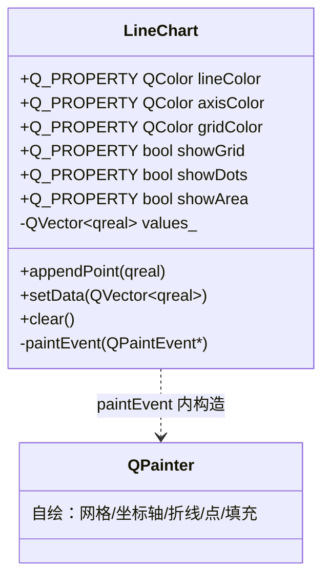

# LineChart 成品导览

> **source**：`widget/line-chart/`　**related**：自绘控件递进链（status-led · toggle-switch · **line-chart**）· 教程层 [自定义控件绘制入门](../../../../beginner/03-qtwidgets/05-custom-widget-paint-beginner.md)、[QPainter 绘图基础](../../../../beginner/02-qtgui/01-qpainter-basic-beginner.md)

折线图这种东西，第一反应是 `QtCharts`——拉个 `QChart`、塞个 `QLineSeries`，三行能出图。但真要把它嵌进一个紧凑的自绘仪表盘、跟隔壁自绘的 StatusLED 一个画风、还要按 theme 换色，QtCharts 那套就重了。所以这里我们用纯 `QPainter` 自己画一张折线图：**Y 轴自动缩放、可选网格/数据点/线下填充，整个控件就一个 `paintEvent`**。体积小、零外部依赖，却是「把 QPainter 坐标变换 + 边界防护 + Q_PROPERTY 三件套」一次性吃透的好载体。

::: tip 本篇是「成品导览」
想直接用成品 → 看这里（架构 / 决策 / 踩坑 / 怎么读）。
想自己从零搓出来 → 转 [手搓手册](./handbook/)。
:::

## 1. 它做什么

一个 `AwesomeQt::LineChart` 控件：

- **纯 QPainter 折线图**，不依赖 QtCharts——一个 `paintEvent` 全包
- **Y 轴自动缩放**：每次 `setData` / `appendPoint` 后，`paintEvent` 取当前数据的最小最大值现算 Y 域，X 轴按索引均匀分布
- **三个外观开关**：`showGrid`（网格横竖线）、`showDots`（数据点小圆）、`showArea`（线下半透明填充），全走 `Q_PROPERTY`，可被 Designer / 外部直接 set
- **数据 API**：`appendPoint(qreal)` / `setData(QVector<qreal>)` / `clear()`，外加 `data()` 取回
- **边界全防护**：空数据不崩（画完坐标轴和空刻度后 early return）、单点居中、`min==max` 给 `±padding` 防除零

跑起来看一眼比读十行描述管用：

```bash
cd widget && cmake -B build && cmake --build build
./build/line-chart/demo/line_chart_demo
```

demo 三栏：静态预设数据（开了 area 看线下填充）、交互栏（追加随机点 / 重置 / 清空，追加时看 Y 轴跟着 auto-scale 漂移）、外观开关栏（三个勾选框实时切 grid/dots/area，还换了红色折线）。

## 2. 架构总览

### 类关系

整个控件**没有动画对象、没有定时器**——这是它和 status-led / toggle-switch 最大的区别。一个 `LineChart` 只持一个数据向量 `values_` 加几个外观属性，`paintEvent` 每次重绘时现算一切：



正因为它没有「数据入口」和「动画入口」之分——所有 setter 都是纯赋值 + `emit` + `update()`——结构比带动画的控件干净得多。`update()` 异步请求一次重绘，`paintEvent` 拿当前所有状态（`values_` + 六个属性）现画，画完即走。

### 文件职责

| 文件 | 职责 |
|---|---|
| `include/line_chart.h` | 接口：六个 `Q_PROPERTY` + 数据 API + 公有 getter/setter |
| `src/line_chart.cpp` | 实现：auto-scale Y、网格 / 坐标轴 / Y 刻度数字 / 折线 / 数据点 / 线下填充 |
| `demo/line_chart_window.{h,cpp}` | 演示：静态数据 + 交互（追加/重置/清空）+ 外观开关三栏 |

### 一次重绘怎么跑起来

```mermaid
sequenceDiagram
    participant U as 调用方
    participant L as LineChart
    participant P as paintEvent
    U->>L: appendPoint(42)
    L->>L: values_.append(42); update()
    Note over L: update() 异步,不立即画
    U->>P: 事件循环调度重绘
    P->>P: minmax_element 算 y_min/y_max
    P->>P: 单点/min==max? 给 ±padding 防除零
    P->>P: 画网格 → 坐标轴 → Y 刻度数字
    P->>P: values_ 空? early return
    P->>P: 建 QPolygonF,画折线/点/填充
```

重点：auto-scale 是**每次 paintEvent 现算**，不缓存 min/max。数据一变 `update()` 一调，下一帧 Y 轴自动跟着数据的值域走——这正是 demo 里「追加随机点看 Y 轴漂移」的机制。

## 3. 关键设计决策

**① 没有强制动画，所以六个 setter 全是「纯赋值 + emit + update」——无需拆业务/动画两套入口。**
status-led 的 `color` 属性 WRITE 必须指 `setAnimatedColor`（纯赋值）而非 `setStatus`（会启动画），否则动画驱动 setter、setter 又启动画 → 递归栈溢出。这里需求明示「静态即可」，所以 `setLineColor` 这类 setter 直接赋值就完事，没有那层耦合风险。仍保留「值未变就 return」的守卫（`src/line_chart.cpp:64`），避免无谓重绘。

**② Y 轴 auto-scale 用 `std::minmax_element` 一次扫描同时拿 min/max。**
替代两次串行的 `std::min_element` + `std::max_element`——一趟扫描拿一对迭代器（`src/line_chart.cpp:174`）。数据量大了能少一半遍历；数据量小看不出差别，但写法更干净。取到后若 `qFuzzyCompare(y_min, y_max)`（常量序列或单点），给 `±kFlatPadding` 展开值域（`src/line_chart.cpp:177-181`），保证后面 `value → 像素` 的分母 `y_range` 恒大于零。

**③ X 坐标单点单独写分支，避免 `n-1` 除零。**
`n>=2` 时按 `i/(n-1)` 均匀分布在 plot 区；`n==1` 时点居中（`src/line_chart.cpp:233`）。不单独写、直接套 `i/(n-1)`，单点情况下分母为 0，NaN 会把点画飞。这是个一行 if 省掉一整类崩溃。

**④ 线下填充用 `QPainterPath` 闭合到 plot bottom，fill 用折线同色系 `setAlpha(60)`。**
`moveTo(首点 x, plotBottom)` → `addPolygon(poly)` → `lineTo(末点 x, plotBottom)` → `closeSubpath`（`src/line_chart.cpp:241-244`）。半透明同色填充视觉上和折线天然一致，不用再定第二个颜色属性。而且 area 只在 `n>=2` 时画（单点无面积可言，`src/line_chart.cpp:239`），`drawPolyline` / `drawEllipse` 则对任意 `n>=1` 安全。

**⑤ Y 刻度数字用 `QFontMetrics` 算宽后右对齐到 Y 轴左侧，不固定起点 drawText。**
直接 `drawText(x, y)` 会左对齐，数字位数一变就往右溢进折线区。这里 `fm.horizontalAdvance(text)` 算出实际宽，再 `drawText(plot_left - text_w - 4, y + fm.ascent()/2)`（`src/line_chart.cpp:221`）右对齐到 Y 轴左、垂直按 baseline 居中。这是自绘里很容易忽略但视觉差别很大的细节。

## 4. 怎么读这份 code

按这个顺序读，最快建立心智：

1. **`include/line_chart.h` 的六个 `Q_PROPERTY`**（26-31 行）——先看「对外暴露哪些外观属性、数据 API 有哪几个」
2. **数据入口 `appendPoint` / `setData` / `clear`**（`src/line_chart.cpp:38` / `:43` / `:48`）——就两三行：改数据 + `update()`，理解「数据变 → 触发重绘」这条主线
3. **`paintEvent` 的 plot 区与 auto-scale**（`src/line_chart.cpp:162-188`）——边距常量、`minmax_element` 算 Y 域、`to_y` 闭包
4. **网格 + 坐标轴 + Y 刻度数字**（`src/line_chart.cpp:191-222`）——尤其看 `QFontMetrics` 右对齐那段
5. **空数据 early return**（`src/line_chart.cpp:225-227`）——边界防护的关键
6. **折线 / 线下填充 / 数据点**（`src/line_chart.cpp:230-265`）——`QPolygonF` 构建、`QPainterPath` 闭合、单点居中分支

入口：`demo/main.cpp` → `LineChartWindow` 三栏布局，对照读。

## 5. 踩坑

这几个坑都是实现这个控件时真处理过的，代码里能逐条对上。

**坑 1：Y 轴值域退化（单点 / 常量序列）时除零，点画飞或 NaN。**
当数据只有一个点、或所有值都相等时，`y_max - y_min == 0`，`to_y` 里的分母 `y_range` 为零，`(v - y_min) / y_range` 得 `NaN` 或 `inf`，`drawPolyline` 拿到 NaN 坐标，点直接画飞或干脆不画。后果是常量数据折线消失、单点显示异常。解法是取到 min/max 后判 `qFuzzyCompare(y_min, y_max)`，成立就 `y_min -= kFlatPadding; y_max += kFlatPadding`（`src/line_chart.cpp:177-181`）展开值域，保证分母恒正。

**坑 2：数据为空时 QPolygonF 边界行为不可控，可能画到屏幕外。**
`values_` 空时若还往下走建 `QPolygonF`，`poly.first()` / `poly.last()`（area 填充要用）在空 polygon 上行为未定义；网格/坐标轴倒是能画，但折线和填充没意义。后果是空数据时控件表现不可预测，运气好空白、运气差崩。解法是画完网格和坐标轴、空刻度后立即 early return（`src/line_chart.cpp:225-227`），根本不碰 `poly`。

**坑 3：Y 刻度数字左对齐溢进折线区，跟折线糊成一团。**
直接 `drawText(x, y)` 默认左对齐，数字两位变三位时起点不变、终点往右挤进 plot 区，和折线重叠。后果是 Y 轴标签和折线互相糊，视觉脏。解法是用 `QFontMetrics::horizontalAdvance` 算每个数字的实际宽，起点设成 `plot_left - text_w - 4` 右对齐到 Y 轴左侧、垂直按 `y + fm.ascent()/2` 做 baseline 居中（`src/line_chart.cpp:219-221`）。

**坑 4：X 坐标套 `i/(n-1)` 公式，单点时分母为零。**
均匀分布公式 `plot_width * i / (n-1)` 在 `n==1` 时 `n-1` 为 0，结果 NaN，单点画飞。后果是单数据点显示异常。解法是单点单独写分支：`n==1` 时点居中（`plot_left + plot_width/2`），`n>=2` 才走除法（`src/line_chart.cpp:233-234`）。

**坑 5：demo 用了 `std::clamp` / `std::rand` 却漏 `<algorithm>` / `<cstdlib>`，编译失败。**
demo 里追加随机点用了 `std::clamp(base + jitter, 0.0, 100.0)` 和 `std::rand()`，初次写漏 include。`qreal` 是 `double` 的 typedef，clamp 模板实参推导本身不太会报，但 GCC 在 `-Wall` 下对缺 `<cstdlib>` 的 `std::rand`、缺 `<algorithm>` 的 `std::clamp` 都会直接编译失败。后果是构建一次红。解法是在 `demo/line_chart_window.cpp` 顶部补 `#include <algorithm>` 和 `#include <cstdlib>`（`demo/line_chart_window.cpp:9-10`）。一个插曲：这俩头文件是写完 demo 后 Edit 补的，提醒自己——STL 算法函数别凭感觉用，include 要显式写全。

## 6. 官方文档

- [QPainter](https://doc.qt.io/qt-6/qpainter.html)——绘图引擎，本控件的全部绘制基础
- [QPolygonF](https://doc.qt.io/qt-6/qpolygonf.html)——折线点序列，`drawPolyline` 的输入
- [QPainterPath](https://doc.qt.io/qt-6/qpainterpath.html)——线下填充的闭合路径
- [QFontMetrics](https://doc.qt.io/qt-6/qfontmetrics.html)——量 Y 刻度数字宽度做右对齐
- [The Property System（Q_PROPERTY）](https://doc.qt.io/qt-6/properties.html)——为什么六个外观属性能被 Designer 驱动
- [QWidget](https://doc.qt.io/qt-6/qwidget.html)——自绘控件基类，`paintEvent` / `sizeHint` / `update`

---

这套机制（纯 QPainter 坐标变换 + 边界全防护 + Q_PROPERTY 外观开关）就是「一个无动画、数据驱动的自绘图表控件」的标准骨架。和带动画的 status-led 互为对照——这里没有动画耦合的栈溢出风险，但要额外对付「数据退化时的除零」这一类图表专属陷阱。想自己搓？[手搓手册](./handbook/)带你从空 main 一行行搓到这个成品。
