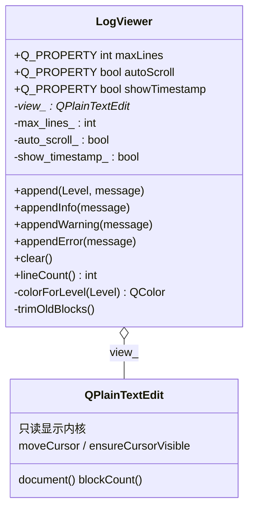
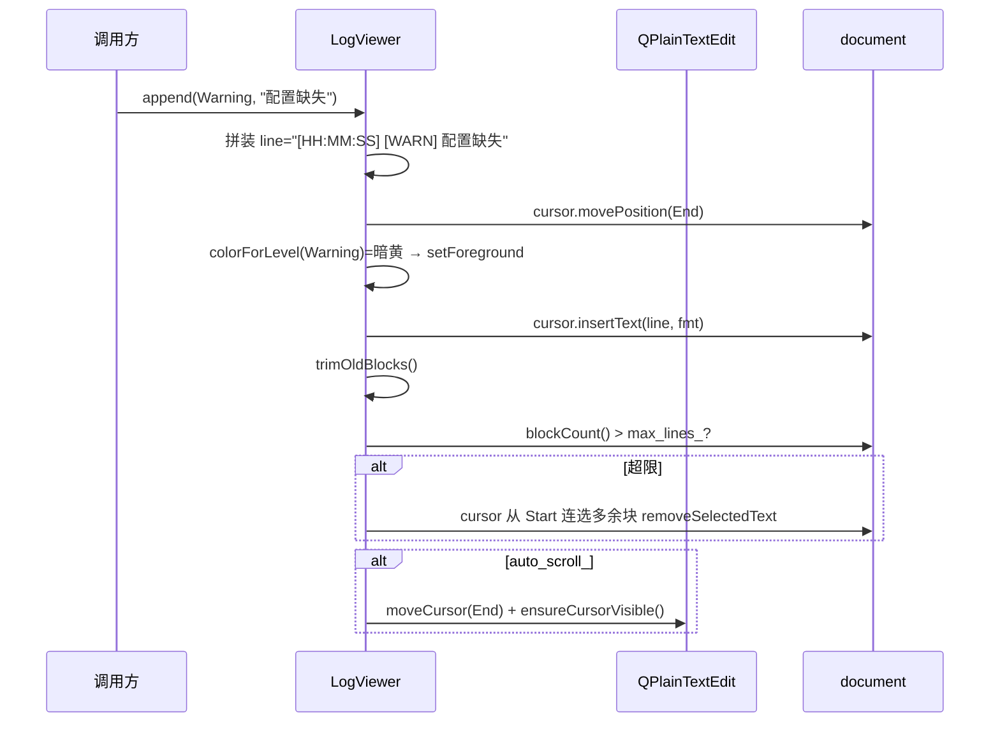

# LogViewer 成品导览

> **source**：`widget/log-viewer/`　**related**：只读文本组合控件递进链第 1 环　·　教程层 [QPlainTextEdit 入门](../../../../beginner/03-qtwidgets/24-qplaintextedit-beginner.md) / [日志进阶](../../../../advanced/01-qtbase/14-logging-advanced.md)

LogViewer 是个只读滚动日志——后台服务、串口监视、构建输出里那种一刷到底、关键行高亮、永远不把内存撑爆的文本框。QPlainTextEdit 本身已经能塞文本，但「这条是 Info 那条是 Error、要染色、新行来了要跟着滚到底、攒够多少行得自动扔掉旧行」这些它都不主动管。我们用一层壳把这几件事收拢成 `append(level, message)` 一个入口，就成了一个开箱即用的日志控件。

本件和 status-led 不是一类——那是自绘，本件是**组合**：不重写 paintEvent，让 QPlainTextEdit 自己画，我们在它外面套壳 + 挂 QTextCursor。和 editable-table 同属组合派，只是换了一颗内核（QPlainTextEdit 替代 QTableWidget）。做日志输出的正确姿势就是让富文本引擎干富文本的活，我们自己只管「这一行该什么颜色、该不该裁掉」。

::: tip 本篇是「成品导览」
想直接用成品 → 看这里（架构 / 决策 / 踩坑 / 怎么读）。
想自己从零搓出来 → 转 [手搓手册](./handbook/)。
:::

## 1. 它做什么

一个 `AwesomeQt::LogViewer` 控件：

- **三级日志染色**：`Level::Info`(默认前景色) / `Level::Warning`(暗黄 `QColor(180,120,0)`) / `Level::Error`(红 `QColor(200,0,0)`)，每条 append 时按级别套前景色，肉眼一眼分级别
- **自动滚底**：append 后默认滚到文档末尾让最新行可见；`autoScroll` 可关，关了 append 后不滚，方便往上翻看历史
- **行数上限裁旧**：超出 `maxLines`（默认 1000）时从文档头删旧行，防长时间运行内存无限膨胀
- **时间戳前缀**：默认每行前缀 `[HH:MM:SS] [LEVEL] message`，`showTimestamp` 可关
- **完整 Q_PROPERTY**：`maxLines` / `autoScroll` / `showTimestamp` 三个属性全可被外部 / Designer 驱动

跑起来看一眼比读十行描述管用：

```bash
cd widget && cmake -B build && cmake --build build
./build/log-viewer/demo/log_viewer_demo
```

打开后你会看到一个只读日志区加一排控制按钮。点 Append Info / Warning / Error 三色行依次落下来；点 Burst 200 Info 连发两百条 Info，超过默认 `maxLines=1000` 时顶部旧行被裁掉，底部始终是最新那条「心跳 #199」，总行数收敛在上限附近、不爆；勾掉 Auto Scroll 再 append，新行虽然加进去了但不滚底，光标停在原处方便往上翻。

## 2. 架构总览

### 类关系

LogViewer 是组合而非继承：它拥有一个 `QPlainTextEdit` 当只读显示内核，自己只持有几个行为开关成员。所有的着色、滚底、裁旧都不重写 view 的方法，而是在 `append` 里用临时 `QTextCursor` 直接操纵 view 的 document。



LogViewer 和 `view_` 是单向持有关系：`view_` 在构造里 `new QPlainTextEdit(this)`，由 this 父对象的对象树托管生命周期，控件销毁时 view 跟着销毁，不需要手动 delete。view 没有反向引用 LogViewer——它根本不知道外面套了壳，这层组合是纯单向的。

### 文件职责

| 文件 | 职责 |
|---|---|
| `include/log_viewer.h` | 接口：Level 枚举 + Q_PROPERTY 三件套 + 公有 API + 私有着色/裁旧辅助声明 |
| `src/log_viewer.cpp` | 实现：只读 view 初始化 + append 染色插入 + 裁旧 + 行为开关 |
| `demo/log_viewer_window.cpp` | 演示：三级按钮 + 连发压测 + 清空 + autoScroll 切换 + 行数回显 |

### 一次 append 怎么走完着色与裁旧



重点在 `append` 的三段式：先按 level 套前景色 `insertText`（着色落进 document），再 `trimOldBlocks` 按 document 自己的 `blockCount` 判定要不要裁旧，最后看 `auto_scroll_` 决定滚不滚底。着色是写进 document 的富文本格式，不是临时绘制——所以滚动、选中、复制都不丢颜色，view 重绘也不用我们操心。

## 3. 关键设计决策

**① 组合 QPlainTextEdit，不继承也不自绘。**
LogViewer 继承的是 QWidget，把 QPlainTextEdit 当私有成员 `new` 出来挂 parent、塞进零边距 QVBoxLayout。不重写 paintEvent，让 view 自己画（`src/log_viewer.cpp:18`）。日志控件要的是「能滚、能选中、能复制、列对齐」，QPlainTextEdit 这几样天生齐全，自己重画纯是重复造轮子还容易丢剪贴板行为。代价是少了一层绘制控制权，但对纯文本日志这种需求，没什么是 view 自带的富文本引擎干不了的。

**② `colorForLevel` 对 Info 返回无效 QColor，用默认前景色而非硬编码黑/白。**
最初的想法是 Info 也写死一个颜色。但硬编码黑或白都很危险：深色主题下白字看得清、浅色主题下黑字才看得清。解法是 Info 让 `colorForLevel` 返回一个 `QColor()`（默认构造，`isValid()==false`），`append` 里只对有效色调 `setForeground`（`src/log_viewer.cpp:47`），Info 行就用 view 的默认前景色，跟着主题走。这是让控件在任意配色下都不出错的关键一笔。

**③ 着色靠 QTextCursor + QTextCharFormat，按插入设色而非事后批量改。**
QPlainTextEdit 支持每次 `insertText` 带一个 `QTextCharFormat`，所以着色和写文本是同一步完成的（`src/log_viewer.cpp:54`）。相比「先 append 普通文本、再回头遍历 setFormat」的方案，这种写一步染一步的方式不需要额外记住行号区间、也不触发额外的文档变更通知。文末非空时先补一个 `\n` 保证新行独立成块（`src/log_viewer.cpp:51`），这点和裁旧的「按块删」直接挂钩。

**④ 裁旧用 document 原生的 `blockCount`，不自维护计数器。**
QPlainTextEdit 的 document 自带块计数，`view_->blockCount()` 随时反映当前行数（`src/log_viewer.cpp:155`）。裁旧就比它和 `max_lines_`，超了多少从文档头连选删除（`src/log_viewer.cpp:163`）。这比自己在 append 里维护一个行计数器省心得多——计数器还得和实际 document 同步、clear 之后还得清零，全是 bug 温床。让文档自己当唯一的真相源，我们的逻辑只是它的旁路观察者。

**⑤ `setMaxLines` 改上限后立即 `trimOldBlocks` 一次，当场收敛。**
默认上限 1000 行时已经攒了 800 行，这时外部把 `maxLines` 调到 500——如果不主动裁，旧行要等到下一次 append 才会被裁，期间 document 里会留着超出新上限的内容。解法是 `setMaxLines` 在 clamp 完、emit 之前先调一次 `trimOldBlocks`（`src/log_viewer.cpp:93`），保证上限一改、内容当场符合新约束。这种「setter 即生效」的语义让控件状态始终自洽，外部不用记着「改完还得手动清一次」。

## 4. 怎么读这份 code

按这个顺序读，最快建立心智：

1. **`include/log_viewer.h` 的 Level 枚举与 Q_PROPERTY**（36-37 行、29-32 行）——先看「对外暴露哪些级别和属性开关」
2. **构造函数**（`src/log_viewer.cpp:18`）——QPlainTextEdit 怎么 new、只读 / 等宽字体 / NoWrap 怎么设、布局怎么挂
3. **`append`**（`src/log_viewer.cpp:32`）——核心入口，盯拼装行、moveEnd 补 `\n`、setForeground 插入、裁旧、滚底这五段
4. **`colorForLevel`**（`src/log_viewer.cpp:129`）——为什么 Info 返回无效色、Warning / Error 的固定色值
5. **`trimOldBlocks`**（`src/log_viewer.cpp:154`）——裁旧的块级删除逻辑，盯 Start + 连选 NextBlock 的循环
6. **`setMaxLines`**（`src/log_viewer.cpp:85`）——clamp + 即时裁旧 + emit 的三段

入口：`demo/main.cpp` → `demo/log_viewer_window.cpp` 跑起来，对照读。重点把 Burst 200 Info 这个压测点跑一遍，盯着窗口底部的行数回显和顶部旧行的消失，看裁旧到底是怎么收敛的。

## 5. 踩坑

| # | 现象 | 原因 | 后果 | 解法 |
|---|---|---|---|---|
| ① | cpp 编译报 `expected type-specifier before 'QFontDatabase'` 或 `'QFontDatabase' has not been declared` | 构造里用 `QFontDatabase::systemFont(QFontDatabase::FixedFont)` 设等宽字体，但 cpp 顶部漏引 `<QFontDatabase>` | 编译不过 | cpp 顶部补 `#include <QFontDatabase>`（`src/log_viewer.cpp:9`）。Q_OBJECT 类的 cpp 不像头文件那样顺手引字体类，新加字体相关代码要单独引 |
| ② | 等宽字体没生效，日志列还是参差不齐 | 用了 `QFont("Monospace")` 这种按名字取字体的写法，系统上未必有这个名字的字体；或干脆没设字体 | 不同长度的时间戳/级别对不齐，阅读体验差 | 用 `QFontDatabase::systemFont(QFontDatabase::FixedFont)` 取系统首选等宽字体（`src/log_viewer.cpp:23`），不依赖具体字体名 |
| ③ | Info 行在深色主题下看不见 / 浅色主题下太刺眼 | `colorForLevel` 给 Info 也硬编码了一个颜色（黑或白），和主题冲突 | 级别色在某个主题下不可读 | Info 让 `colorForLevel` 返回无效 `QColor()`，`append` 里只对有效色 `setForeground`，Info 行用 view 默认前景色（`src/log_viewer.cpp:129` / `src/log_viewer.cpp:47`） |
| ④ | 裁旧删多了行或删错位置 | 自己维护一个行计数器，忘了 clear 之后清零、或和 document 实际块数漂移 | 日志被多删或裁不干净，行数显示对不上 | 不自维护计数器，裁旧直接判 `view_->blockCount()`（`src/log_viewer.cpp:155`），让 document 当唯一真相源 |
| ⑤ | append 后没滚到底，最新行看不到 | `autoScroll` 默认开但滚底代码漏调，或只调了 `moveCursor(End)` 没调 `ensureCursorVisible()` | 用户得手动往下拉才能看到新日志 | 滚底两件套一起调：`moveCursor(QTextCursor::End)` + `ensureCursorVisible()`（`src/log_viewer.cpp:60`） |
| ⑥ | 新行没独立成块，裁旧时按块删会把两行黏一起删 | 文末非空时直接 insertText，新行没和旧行用 `\n` 分隔 | 裁旧行数对但内容错乱 | insertText 前判断 `!cursor.atStart()` 时先补一个 `\n`（`src/log_viewer.cpp:51`），保证新行独立成块 |
| ⑦ | `setMaxLines` 调小后旧行没被裁，要等下次 append | setter 只改了 `max_lines_` 没主动裁旧 | 控件状态不自洽，document 里残留超限内容 | `setMaxLines` clamp 完、emit 前先调一次 `trimOldBlocks`（`src/log_viewer.cpp:93`） |

## 6. 官方文档

- [QPlainTextEdit](https://doc.qt.io/qt-6/qplaintextedit.html)——只读日志的显示内核（本件的 view 组合对象）
- [QTextCursor](https://doc.qt.io/qt-6/qtextcursor.html)——着色插入与裁旧删除的操纵手柄（movePosition / insertText / removeSelectedText）
- [QTextCharFormat](https://doc.qt.io/qt-6/qtextcharformat.html)——按级别套前景色（setForeground）
- [QTextDocument::blockCount](https://doc.qt.io/qt-6/qtextdocument.html#blockCount)——裁旧的行数判定依据
- [QFontDatabase::systemFont](https://doc.qt.io/qt-6/qfontdatabase.html#systemFont)——取系统首选等宽字体
- [QTime::currentTime](https://doc.qt.io/qt-6/qtime.html#currentTime)——时间戳前缀的取时
- [Qt 属性系统（Q_PROPERTY）](https://doc.qt.io/qt-6/properties.html)——maxLines / autoScroll / showTimestamp 三个属性开关的机制
- [Q_ENUM 与元对象系统](https://doc.qt.io/qt-6/qobject.html#Q_ENUM)——Level 枚举如何被 moc 认识

---

这套机制（组合 QPlainTextEdit + QTextCursor 着色 + document blockCount 裁旧 + 行为开关 Q_PROPERTY）不是 LogViewer 专属——它就是「一个带格式与上限的只读流式文本控件」的标准范式。后面做带过滤、带搜索高亮、带多通道（stdout/stderr 分流）的高级日志控件时，view 这层原样复用，只是在外面再套过滤与路由逻辑。想自己搓？[手搓手册](./handbook/)带你从一只只读 QPlainTextEdit 一行行搓到这个成品。
