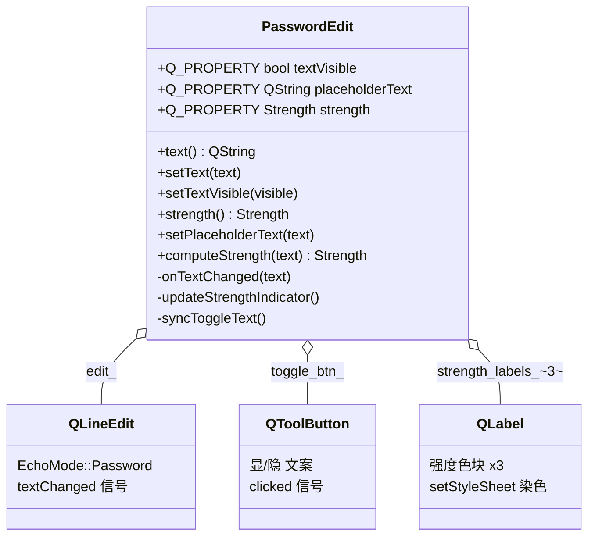

# PasswordEdit 成品导览

> **source**：`widget/password-edit/`　**related**：input/display 组合控件递进链第 1 环　·　教程层 [QLineEdit 入门](../../../../beginner/03-qtwidgets/22-qlineedit-beginner.md) / [信号与槽](../../../../beginner/01-qtbase/02-signal-slot-beginner.md)

PasswordEdit 是个带强度提示的密码框——注册页那种「输入框右侧一个眼睛按钮点一下显明文、下方三色块随你打字从红变黄变绿」的玩意。QLineEdit 本身就有 `EchoMode::Password` 能把字符打成圆点，但「显隐切换」和「实时强度染色」得我们自己组合出来。这件成品的乐趣不在难度，而在**怎么把三个现成控件捏成一个干净的组合控件**，并把「外部想监听文本变化」这个常见需求用对的姿势接出去。

本件和 status-led / toggle-switch 不是一类——那俩是自绘，这件和 editable-table 是一脉：**组合**，不重写 paintEvent，让 QLineEdit / QToolButton / QLabel 各画各的，我们在外面搭布局 + 接信号。色块染色也老老实实用 `setStyleSheet`，绝不自己开 paintEvent 画方块。

::: tip 本篇是「成品导览」
想直接用成品 → 看这里（架构 / 决策 / 踩坑 / 怎么读）。
想自己从零搓出来 → 转 [手搓手册](./handbook/)。
:::

## 1. 它做什么

一个 `AwesomeQt::PasswordEdit` 控件：

- **密码输入框**：内部 QLineEdit 走 `EchoMode::Password`，打出来的字符显示成圆点
- **一键显隐**：右侧 QToolButton 点一下切明文/密文，按钮文案随之变「显」/「隐」（用文字不用图标，省得扯 icon 资源）
- **实时强度三色块**：下方 3 个小色块按强度染色——弱=红亮 1 块、中=黄亮 2 块、强=绿亮 3 块，未亮=灰。强度按「长度 + 字符种类数」算
- **完整 Q_PROPERTY**：`textVisible` / `placeholderText` / `strength` 三个属性可被 Designer 或外部直接驱动
- **透传 textChanged 信号**：外部想实时拿文本回显，绑 `&PasswordEdit::textChanged` 即可，不用 `findChild` 去抠内部 QLineEdit

跑起来看一眼比读十行描述管用：

```bash
cd widget && cmake -B build && cmake --build build
./build/password-edit/demo/password_edit_demo
```

打开后你会看到密码框 + 眼睛按钮 + 下方三色块。打几个纯字母（短于 6 位）色块亮红 1 块；加几个数字凑到两类、长度够，亮黄 2 块；再混进大写和符号、长度到 8，亮绿 3 块。点眼睛按钮明文/密文切换，右侧「实时回显」始终显示真实内容（验证 `text()` 在密文态也拿得到真值），下方「显示密码」勾选框和眼睛按钮双向联动。

## 2. 架构总览

### 类关系

PasswordEdit 是组合而非继承：它拥有一个 `QLineEdit` 当密码输入内核、一个 `QToolButton` 当显隐开关、三个 `QLabel` 当强度色块。五个子控件全挂 `this` parent 走对象树托管，外面套两层 QHBoxLayout（编辑行 + 强度行）再塞进一个 QVBoxLayout。没有自绘、没有委托，纯信号连线驱动状态。



三个角色各司其职：QLineEdit 负责输入与文本来源（`textChanged` 是整条链的源头信号），QToolButton 只负责发 `clicked` 去翻 `textVisible`，三个 QLabel 只负责按强度染色被刷新。状态收敛到两个成员变量——`text_visible_`（显隐态）和 `strength_`（强度档），其它都是派生。

### 文件职责

| 文件 | 职责 |
|---|---|
| `include/password_edit.h` | 接口：Strength 枚举 + Q_PROPERTY 三件套 + 公有 API + computeStrength 静态声明 |
| `src/password_edit.cpp` | 实现：子控件组装 + 强度算法 + 色块染色样式 + 信号透传 |
| `demo/password_edit_window.cpp` | 演示：显隐切换 + 三色块实时变 + 文本回显 + 勾选框双向联动 |

### 一次输入怎么走完强度刷新

```mermaid
sequenceDiagram
    participant U as 用户打字
    participant E as QLineEdit(edit_)
    participant P as PasswordEdit
    participant L as strength_labels_
    participant D as demo 回显
    U->>E: 输入字符
    E->>P: textChanged(text)
    P->>P: onTextChanged: computeStrength(text)
    alt strength_ 变化
        P->>P: strength_=新档; updateStrengthIndicator()
        P->>L: 3 块按 strength_ 染色 (红/黄/绿/灰)
        P-->>D: emit strengthChanged(新档)
    end
    P-->>D: emit textChanged(text) (透传)
```

重点在 `onTextChanged` 里的去重：只有 `computeStrength` 算出的新档和 `strength_` 不同时才刷新色块、发 `strengthChanged`。打字过程中强度档没变就不重复刷新，避免无意义的 setStyleSheet 调用和信号风暴。`textChanged` 则是无条件透传——demo 那个实时回显要的是每一个字符变化都通知，不能去重。

## 3. 关键设计决策

**① 组合 QLineEdit + QToolButton + QLabel，不自绘。**
PasswordEdit 继承 QWidget，把 QLineEdit（密码模式）当输入内核、QToolButton 当显隐开关、三个 QLabel 当强度色块，全部 `new ... this` 挂对象树。不重写 paintEvent，让子控件各自绘制；色块染色也只动 `setStyleSheet`，不画方块（`src/password_edit.cpp:160`）。这是 input/display 组合控件的定位——和自绘派（status-led）分道扬镳。收益是白嫖 QLineEdit 全套的输入/光标/选中/IME 行为，省掉自己处理键盘事件的麻烦；代价是少了一层视觉定制权。

**② 强度算法照规格落地，空文本安全归弱。**
`computeStrength` 是个纯静态函数（`src/password_edit.cpp:109`），统计字符种类（小写/大写/数字/符号各算一类），按「长度 < 6 或种类数 <= 1 → kWeak；种类数 == 2 → kMedium；种类数 >= 3 且长度 >= 8 → kStrong，否则 kMedium」出档。空文本在入口直接 return kWeak（`src/password_edit.cpp:111`），保证刚构造、还没打字时不会取到未初始化值。把它做成静态纯函数还有个好处——能独立写单元测试，不依赖任何控件实例。

**③ 色块染色用 setStyleSheet 四套样式，强度档映射成亮几块。**
四个 `static constexpr const char*` 样式串：`kStyleOff`（灰）/`kStyleWeak`（红）/`kStyleMedium`（黄）/`kStyleStrong`（绿）（`src/password_edit.cpp:18`）。`updateStrengthIndicator` 先按 `strength_` 选定「亮色」样式，再用 `lit = strength_ + 1` 算出亮几块（kWeak 亮 1、kMedium 亮 2、kStrong 亮 3），前 `lit` 块上亮色、其余上灰（`src/password_edit.cpp:160`）。这套「档位 = 亮块数」的映射简单到不会错，且色块永远只染当前档对应的单色，不做「红黄绿渐变」那种花活。

**④ 为 demo 回显需求补 textChanged 透传信号，拒绝 findChild hack。**
规格里只列了 `strengthChanged`，没列 `textChanged`。但 demo 要在用户输入时实时回显真实文本验证 `text()`，最初的做法是 `edit_->findChild<QLineEdit*>()->textChanged` 去捞内部控件——这把 demo 和控件的内部成员强耦合，且 `findChild` 可能返回空指针不安全。解法是给 PasswordEdit 加一个 `textChanged(QString)` 信号，构造时把内部 `QLineEdit::textChanged` 透传出来（`src/password_edit.cpp:64`）。demo 改用 `&PasswordEdit::textChanged` 干净绑定，内部成员想怎么重构都不影响外部。这是「组合控件要把内部信号的常用需求透传出去」的标准姿势。

**⑤ 全部 setter 做去重早返，Q_PROPERTY 配函数指针 connect。**
`setTextVisible` 入口先判 `text_visible_ == visible` 早返（`src/password_edit.cpp:84`），`setPlaceholderText` 同理比对当前值（`src/password_edit.cpp:102`），避免重复发信号。`onTextChanged` 也只在强度档真变时才 emit `strengthChanged`（`src/password_edit.cpp:153`）。信号连线一律函数指针语法（`src/password_edit.cpp:62`），禁用 `SIGNAL/SLOT` 宏——编译期类型检查，笔误直接报错而不是运行期哑连。demo 里勾选框和显隐态的**双向联动**就是靠 `textVisibleChanged → setChecked` 和 `toggled → setTextVisible` 两条线互连（`demo/password_edit_window.cpp:61`），去重早返保证不会无限递归。

## 4. 怎么读这份 code

按这个顺序读，最快建立心智：

1. **`include/password_edit.h` 的 Q_PROPERTY 三件套与 Strength 枚举**（31-34 行、38 行）——先看「对外暴露哪些属性和档位」
2. **构造函数**（`src/password_edit.cpp:27`）——五个子控件怎么 new、两层布局怎么搭、三条信号怎么连
3. **`computeStrength`**（`src/password_edit.cpp:109`）——强度算法的纯逻辑，种类统计 + 档位判定，最该独立读懂的一段
4. **`onTextChanged`**（`src/password_edit.cpp:151`）——textChanged 怎么触发重算、去重怎么落地
5. **`updateStrengthIndicator`**（`src/password_edit.cpp:160`）——档位怎么映射成「亮几块」、四套样式怎么选
6. **`setTextVisible` + `syncToggleText`**（`src/password_edit.cpp:83` / `src/password_edit.cpp:180`）——显隐切换怎么改 echoMode、按钮文案怎么同步
7. **demo 双向联动**（`demo/password_edit_window.cpp:61`）——勾选框和显隐态两条线互连、去重早返怎么防递归

入口：`demo/main.cpp` → `demo/password_edit_window.cpp` 跑起来，对照读。重点把「纯字母短输入 → 加数字 → 加符号大写」这三个强度跳变点和「点眼睛按钮 / 勾选框」双向联动跑一遍，看色块和回显怎么动。

## 5. 踩坑

| # | 现象 | 原因 | 后果 | 解法 |
|---|---|---|---|---|
| ① | demo 想监听密码文本变化回显，用了 `edit_->findChild<QLineEdit*>()->textChanged` | 规格只给了 `strengthChanged`，没给文本变化信号；demo 只能去抠内部控件 | demo 和控件内部成员强耦合，内部一重构 demo 就崩；`findChild` 可能返回空指针解引用崩 | 给 PasswordEdit 加 `textChanged(QString)` 信号，构造时透传内部 `QLineEdit::textChanged`（`src/password_edit.cpp:64`），demo 改用 `&PasswordEdit::textChanged` 干净绑定 |
| ② | 勾选框和显隐态双向联动后，点一下陷入无限递归 / 栈溢出 | `textVisibleChanged → setChecked → toggled → setTextVisible → textVisibleChanged` 形成环，没有去重 | **栈溢出崩溃** | setter 入口判 `text_visible_ == visible` 早返（`src/password_edit.cpp:84`），环走到第二次值已相同直接 return |
| ③ | 打字过程中色块疯狂闪烁 / 接到一堆重复 `strengthChanged` | `onTextChanged` 每次都无条件刷新色块和发信号，哪怕强度档没变 | 无意义的 setStyleSheet 调用刷屏、外部被无意义信号干扰 | `onTextChanged` 里先 `computeStrength`，只有 `new_strength != strength_` 才刷新 + emit（`src/password_edit.cpp:153`） |
| ④ | 刚构造、还没打字，`strength()` 返回未初始化脏值 / 色块显示异常 | 成员 `strength_` 没给初值，或初始没调 `updateStrengthIndicator` | 首屏色块状态不确定 | 成员声明给初值 `strength_{kWeak}`（`include/password_edit.h:97`），构造末尾调一次 `updateStrengthIndicator()` 把初始 3 块全染灰（`src/password_edit.cpp:67`） |
| ⑤ | 空文本时 `computeStrength` 走种类统计返回意外档 / 崩 | 空串循环不执行，种类计数全 0，若没特判会落到 `classes <= 1 → kWeak` 还算对，但若逻辑写成 `length < 6` 先判则空串 length=0 也归弱——边界没显式处理易踩 | 边界行为不可预期 | 空文本入口直接 `return Strength::kWeak` 显式兜底（`src/password_edit.cpp:111`），不依赖后续逻辑碰巧覆盖 |
| ⑥ | 自绘色块想用 paintEvent 画方块，结果和 QLineEdit 的绘制打架 / 尺寸难控 | 误以为色块要自己画 | 偏离组合控件定位，多写一堆绘制代码 | 用 QLabel + `setStyleSheet` 染色即可（`src/password_edit.cpp:18`），色块本质就是个着色的 label，不需要自绘 |

## 6. 官方文档

- [QLineEdit](https://doc.qt.io/qt-6/qlineedit.html)——密码框内核（`EchoMode::Password` 是显隐切换的基础）
- [QLineEdit::EchoMode](https://doc.qt.io/qt-6/qlineedit.html#EchoMode-enum)——密码模式枚举（Normal/Password 切换）
- [QToolButton](https://doc.qt.io/qt-6/qtoolbutton.html)——显隐切换按钮
- [QLabel](https://doc.qt.io/qt-6/qlabel.html)——强度色块载体（setStyleSheet 染色）
- [QChar](https://doc.qt.io/qt-6/qchar.html)——字符种类判定（isLower/isUpper/isDigit）
- [Qt Style Sheets](https://doc.qt.io/qt-6/stylesheet.html)——色块染色的机制
- [Qt 属性系统（Q_PROPERTY）](https://doc.qt.io/qt-6/properties.html)——textVisible / placeholderText / strength 三个属性的机制
- [信号与槽（函数指针语法）](https://doc.qt.io/qt-6/signalsandslots.html)——`connect` 用函数指针而非 SIGNAL/SLOT 宏

---

这套机制（QLineEdit 组合 + 信号透传 + setter 去重 + stylesheet 染色）不是 PasswordEdit 专属——它就是「一个带状态反馈的输入型组合控件」的标准范式。后面做带确认强度的二次输入框、带输入限制的金额框，同一套骨架都能复用，只是把强度算法换成各自的校验逻辑。想自己搓？[手搓手册](./handbook/)带你从空 main 一行行搓到这个成品。
