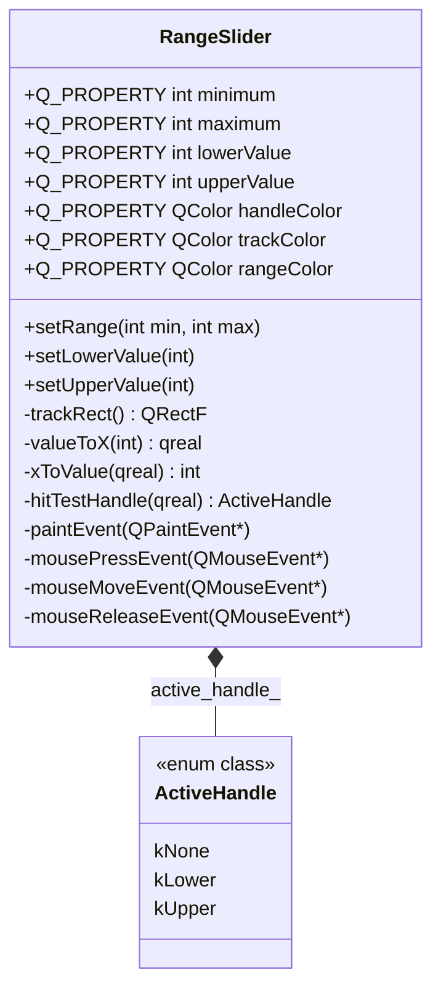

# RangeSlider 成品导览

> **source**：`widget/range-slider/`　**related**：自绘控件递进链第 3 环（toggle-switch · status-led）· [自定义控件绘制入门](../../../../beginner/03-qtwidgets/05-custom-widget-paint-beginner.md)

`RangeSlider` 是个水平双柄滑块——左右两个手柄各自代表一个值，中间那段就是你选中的范围。单柄的 `QSlider` 只能定一个点，做「价格区间」「年龄过滤」这种"我要的是一个 [下限, 上限] 区间"的需求就得它。听起来比 toggle-switch 多一个手柄而已，但"两个手柄不能越过彼此"这件事，引出了一整套统一的夹值流程，是把 toggle-switch 的交互骨架真正用熟的好练手。

::: tip 本篇是「成品导览」
想直接用成品 → 看这里（架构 / 决策 / 踩坑 / 怎么读）。
想自己从零搓出来 → 转 [手搓手册](./handbook/)。
:::

## 1. 它做什么

一个 `AwesomeQt::RangeSlider` 控件：

- **双端取值**：`lowerValue` / `upperValue` 各占一手柄，取值范围 `[minimum, maximum]`，且始终满足 `lower <= upper`
- **拖动跟手**：拖任一手柄实时跟随鼠标（不用动画，即时映射），选中区间同步高亮
- **点击吸附**：点在手柄附近松手，最近手柄直接吸到点击位置，比"必须精准点中圆心"更贴滑块手感
- **完整 Q_PROPERTY**：`minimum` / `maximum` / `lowerValue` / `upperValue` 四值 + `handleColor` / `trackColor` / `rangeColor` 三配色，全可被 Designer / 外部改

跑起来看一眼比读十行描述管用：

```bash
cd widget && cmake -B build && cmake --build build
./build/range-slider/demo/range_slider_demo
```

demo 四组：静态区间（lower=20 / upper=80）、交互拖动（QLabel 实时联动）、程序化设值（按钮调 `setLowerValue(10)` / `setUpperValue(90)`，验证约束照样生效）、双配色主题（蓝绿 + 橙）。

## 2. 架构总览

### 类关系

平铺一个控件类，直接继承 `QWidget`，没有托管子对象——所有状态（四个值 + 拖动状态）都是普通成员变量，交互全靠重写三个鼠标事件加两个映射函数。



### 文件职责

| 文件 | 职责 |
|---|---|
| `include/range_slider.h` | 接口：7 个 Q_PROPERTY + 区间端点 / 手柄值 / 配色 API + 私有 `ActiveHandle` 枚举 |
| `src/range_slider.cpp` | 实现：端点统一夹值、值/像素映射、双手柄 hit-test、自绘轨道/区间/手柄 |
| `demo/range_slider_window.cpp` | 演示：静态 / 交互联动 / 程序化按钮 / 双配色 四组 |

### 拖一个手柄怎么跑起来

```mermaid
sequenceDiagram
    participant U as 鼠标
    participant R as RangeSlider
    participant H as hitTestHandle
    participant P as paintEvent
    U->>R: press 在下手柄附近
    R->>H: hitTestHandle(x) → kLower
    R->>R: active_handle_=kLower; dragging_=false
    U->>R: move 超过 kDragThreshold
    R->>R: dragging_=true
    R->>R: v=xToValue(x); setLowerValue(v)
    R->>R: clamp 到 [minimum, upper-gap]; emit rangeChanged; update()
    R->>P: 合并触发重绘
    P->>P: 画轨道 + 区间 + 两手柄(圆心=valueToX)
```

## 3. 关键设计决策

**① 端点 setter 内部统一夹值，并把 `setRange` 做成一次性设两端。**
`setMinimum` / `setMaximum` 改端点后，现有 `lower` / `upper` 可能落在新区间外或违反 `lower <= upper`，所以两个 setter 收尾都把现有值 `std::clamp` 回 `[minimum, maximum]` 再视情况补发值变更信号（`range_slider.cpp:44-53`、`range_slider.cpp:69-77`）。`setRange` 进一步提供一次性设两端，且 `min > max` 时自动 `std::swap` 而非断言——比起分别 `setMinimum` 再 `setMaximum`，它没有"刚设完一端、另一端还没跟上"的中间非法态（`range_slider.cpp:82-104`）。

**② 约束语义直接在 setter 里用 `std::clamp` 实现，喂越界值也安全。**
`setLowerValue` 夹到 `[minimum, upper - gap]`、`setUpperValue` 夹到 `[lower + gap, maximum]`（`range_slider.cpp:113`、`range_slider.cpp:126`）。`gap` 就是 `kHandleGap`，默认 0 允许两手柄重合在同一点；想强制留间距改这一个常量即可。这意味着外部哪怕直接喂个 999，控件也只会夹到合法上界，绝不会让 lower 越过 upper。

**③ 交互照搬 toggle-switch 的三事件 + 拖动阈值模式，扩成双手柄 hit-test。**
`mousePressEvent` 用 `hitTestHandle` 预选离鼠标最近且在容差内的手柄（`range_slider.cpp:198-211`），但**实际抓取等拖过 `kDragThreshold`（4px）再定**，避免一次轻微手抖就被当拖动（`range_slider.cpp:234-236`）。`mouseReleaseEvent` 里若全程没拖动，则把最近手柄直接吸到点击位置——这比"必须精准点中圆心才能拖"更贴真实滑块手感（`range_slider.cpp:254-262`）。`active_handle_` 用私有 `enum class ActiveHandle { kNone, kLower, kUpper }` 标识当前抓手（`range_slider.h:88`）。

**④ 映射函数除零兜底，端点值圆心正好落在轨道两端。**
`valueToX` / `xToValue` 在 `span <= 0`（即 `minimum == maximum`）或 `trackRect().width() <= 0` 时直接返回左端点 / `minimum`，防控件被布局压极窄时除零导致 NaN 坐标（`range_slider.cpp:181-183`、`range_slider.cpp:191-193`）。`trackRect()` 左右各让出半个手柄直径（`range_slider.cpp:172-176`），于是 `minimum` 和 `maximum` 两个端点的手柄圆心正好落在轨道两端，拖到尽头圆心不会越过控件边界。

**⑤ paintEvent 防退化 + 异步重绘。**
轨道条高度取 `kHandleDiameter * 0.55` 并 `std::max` 夹到 `>= 2`（`range_slider.cpp:277`），手柄 16px 凸出可点；区间宽度用 `std::max(0.0, |x_upper - x_lower|)`（`range_slider.cpp:291`），防两手柄重合时 `drawRoundedRect` 拿到非法宽度；手柄加 1px 灰描边提升辨识度。所有重绘走 `update()` 异步合并，拖动跟手且不掉帧。

## 4. 怎么读这份 code

按这个顺序读，最快建立心智：

1. **`include/range_slider.h` 的 7 个 Q_PROPERTY**（26-32 行）——先看对外暴露哪些可驱动属性
2. **端点统一夹值流程**——`setRange`（`range_slider.cpp:82`）看"一次性设两端 + clamp + 按需补发信号"这套范式，`setMinimum` / `setMaximum` 是它的拆分版
3. **约束语义**——`setLowerValue`（`range_slider.cpp:111`）盯 `std::clamp(value, minimum_, upper_value_ - kHandleGap)` 这一行，理解 lower 永不越过 upper
4. **几何映射**——`trackRect`（`range_slider.cpp:172`）+ `valueToX` / `xToValue`（`range_slider.cpp:178`、`range_slider.cpp:188`），注意两处除零兜底
5. **交互状态机**——`hitTestHandle`（`range_slider.cpp:198`）+ 三个 `mouse*Event`（`range_slider.cpp:216` / `228` / `249`），这是最容易踩坑的部分
6. **自绘**——`paintEvent`（`range_slider.cpp:271`），轨道 / 区间 / 手柄三层

入口：`demo/main.cpp` → `RangeSliderWindow` 四组布局，对照读。

## 5. 踩坑

这几个坑都是实现这个控件时真处理过的，代码里能逐条对上。

**坑 1：改了端点，旧值没跟着夹，区间约束被破坏**
现象是 `setMinimum(50)` 之后 `lowerValue` 还停在 20，lower 直接跑到 minimum 之外，更糟的是 lower 可能反超 upper。原因是端点变了但 setter 没重新夹现有值，约束只在 `setLowerValue` 那一刻生效。后果是控件出现 `lower < minimum` 或 `lower > upper` 的非法态，映射函数画出越界坐标、区间高亮方向错乱。解法是端点 setter 收尾统一对 `lower` / `upper` 做 `std::clamp(minimum_, lower, upper)`，值变了就补发 `lowerValueChanged` / `upperValueChanged` / `rangeChanged`，否则只发 `minimumChanged` / `maximumChanged`（`range_slider.cpp:44-54`、`range_slider.cpp:69-79`）。

**坑 2：两手柄拖到完全重合后行为混乱**
现象是两个手柄被拖到同一个点后，hit-test 分不清该抓哪个、区间宽度退化成 0、`drawRoundedRect` 拿到非法参数。原因是 lower 与 upper 之间没有任何最小间距约束，`valueToX(lower) == valueToX(upper)` 时命中测试和绘制都退化。后果是重合点上点一下可能抓错手柄，绘制可能出现锯齿或异常。解法是引入 `kHandleGap`（值单位，默认 0 允许重合，需要时调大），`setLowerValue` 夹到 `upper - gap`、`setUpperValue` 夹到 `lower + gap`；`paintEvent` 区间宽度一律 `std::max(0.0, |x_upper - x_lower|)`（`range_slider.cpp:113`、`range_slider.cpp:126`、`range_slider.cpp:291`）。

**坑 3：控件被布局压到极窄时除零、坐标变 NaN**
现象是窗口缩到很窄时手柄飞掉或控件完全不画、甚至偶发崩溃。原因是 `minimum == maximum`（span=0）或 `trackRect().width() <= 0` 时直接做除法，`xToValue` 里 `(x - left) / width` 除以 0 得到 NaN，喂给 `drawRoundedRect` 行为未定义。后果是绘制退化或崩溃。解法是两个映射函数都判 `span <= 0` / `width <= 0` 兜底——`valueToX` 返回轨道左端、`xToValue` 返回 `minimum`；轨道条高度也 `std::max` 夹到 `>= 2.0`（`range_slider.cpp:181-183`、`range_slider.cpp:191-193`、`range_slider.cpp:277`）。

**坑 4：点一下被当成拖动，手柄乱跳**
和 toggle-switch 同一个坑。现象是手只点一下没拖，最近手柄却没吸过去或位置乱。原因是没设移动阈值，手抖 1-2 像素就被判成拖动，按下时的命中预选和真正的抓取没分开。后果是点击手感错乱。解法是 `mouseMoveEvent` 里移动没超过 `kDragThreshold`（4px）一律不进拖动模式，且 `mouseReleaseEvent` 里若全程没拖过就把预选手柄吸到点击位置（`range_slider.cpp:234-237`、`range_slider.cpp:254-262`）。

## 6. 官方文档

- [QWidget（自绘控件基类）](https://doc.qt.io/qt-6/qwidget.html)
- [QPainter（绘图引擎）](https://doc.qt.io/qt-6/qpainter.html)
- [The Property System（Q_PROPERTY）](https://doc.qt.io/qt-6/properties.html)
- [QMouseEvent（鼠标交互）](https://doc.qt.io/qt-6/qmouseevent.html)
- [QSlider（单柄滑块，对照理解双柄差异）](https://doc.qt.io/qt-6/qslider.html)

---

双柄比单柄多出来的不是"再加一个手柄画一个圆"，而是"两个值之间永远得维持一个不变式（lower <= upper）"——这套端点统一夹值 + setter 内 clamp 的范式，往后做任何带约束的双值控件都能照搬。想自己搓？[手搓手册](./handbook/) 带你从空 main 一行行搓到这个成品。
