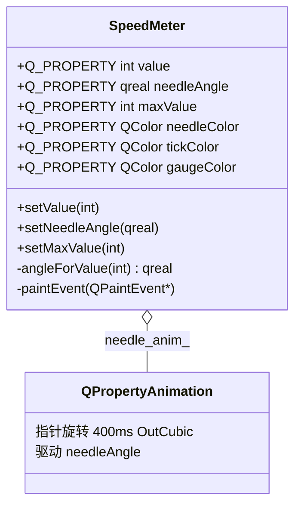

# SpeedMeter 成品导览

> **source**：`widget/speed-meter/`　**related**：自绘控件递进链（[status-led](../status-led/) · [toggle-switch](../toggle-switch/) 已产）· 教程：[动画框架入门](../../../../beginner/03-qtwidgets/09-animation-framework-beginner.md)、[自定义控件绘制入门](../../../../beginner/03-qtwidgets/05-custom-widget-paint-beginner.md)

SpeedMeter 是个指针式速度表盘——汽车仪表那种，0 到 220 的弧形刻度，一根指针指到当前值。比 status-led / toggle-switch 难一截的地方不在动画（那套 `value` / `needleAngle` 解耦骨架前面已经趟平），而在于**两套角度体系要在同一个 paintEvent 里自洽**：刻度/指针用的「屏幕角 β」（cos/sin + rotate，顺时针为正）和 QPainter `drawArc` 的 1/16° 角度（0°=3 点、正值逆时针）不是一套东西，混着用就会把弧画反方向、把指针画到错的那一头。这件成品把那套换算注释写在 `.cpp` 顶部，能当成「角度体系换算」的样板来读。

::: tip 本篇是「成品导览」
想直接用成品 → 看这里（架构 / 决策 / 踩坑 / 怎么读）。
想自己从零搓出来 → 转 [手搓手册](./handbook/)。
:::

## 1. 它做什么

一个 `AwesomeQt::SpeedMeter` 控件：

- **指针式表盘**：背景弧开口朝下，从左下（v=0）经顶部扫到右下（v=max），共 270°；11 条主刻度把量程 10 等分，主刻度间再插 4 条次刻度，针尖指向当前值；控件压小到数字标签会互相挤压时，整组标签自动隐藏（弧/刻度/指针/底部读数仍保留）
- **指针平滑旋转**：`setValue` 不直接跳角度，而是让一根 `QPropertyAnimation` 从当前显示角度接力到新目标，400ms `OutCubic` 缓动过渡
- **中心轴帽 + 底部数字读数**：指针根部一个小实心圆，底部居中绘当前数值，字号随控件尺寸缩放
- **完整 Q_PROPERTY**：`value` / `needleAngle` / `maxValue` / `needleColor` / `tickColor` / `gaugeColor` 六个属性，可被动画、Qt Designer、外部主题色驱动

跑起来看一眼比读十行描述管用：

```bash
cd widget && cmake -B build && cmake --build build
./build/speed-meter/demo/speed_meter_demo
```

demo 开四组：静态几档一排（0/60/120/180/220）、大表 + Cycle 按钮看指针接力、QSlider 0..220 拖动驱动、Random Jump 狂点测连切不跳变。

## 2. 架构总览

### 类关系

一个 SpeedMeter 自己持有一根动画指针，外部业务只跟 `value` 打交道：



关键就一个对象：`needle_anim_` 是持久成员指针，构造时 `new QPropertyAnimation(this, "needleAngle", this)`（parent=this 托管释放），切换时 `stop() / 重配 setStartValue(当前角度) / start()` 复用，不 new 新的、不用 `DeleteWhenStopped`。`setValue` 是业务入口（算 value→角度映射后启动动画），`setNeedleAngle` 是动画每帧回调（纯赋值 + emit + update）——这两者解耦，是整套机制的核心，和 status-led / toggle-switch 一脉相承。

### 文件职责

| 文件 | 职责 |
|---|---|
| `include/speed_meter.h` | 接口：六个 Q_PROPERTY + 公有 API + signals + 持久动画指针成员 |
| `src/speed_meter.cpp` | 实现：角度约定常量 / value→角度映射 / 动画接力 / 自绘（弧+刻度+指针+轴帽+读数） |
| `demo/speed_meter_window.cpp` | 演示：静态几档 / Cycle 接力 / Slider 驱动 / 随机跳变 四组 |

### setValue 怎么把指针转起来

```mermaid
sequenceDiagram
    participant U as 调用方
    participant S as SpeedMeter
    participant A as needle_anim_
    participant P as paintEvent
    U->>S: setValue(180)
    S->>S: value_=180; emit valueChanged
    S->>A: stop()
    S->>A: setStartValue(needle_angle_) // 当前显示角度
    S->>A: setEndValue(angleForValue(180))
    A->>A: start()
    loop 每帧
        A->>S: setNeedleAngle(插值角度)
        S->>S: needle_angle_=插值; update()
        S->>P: 重绘指针
    end
```

重点：动画的 `setStartValue` 取的是 `needle_angle_`（**当前显示角度**，可能是上一段动画的中间值），不是 `angleForValue(旧 value)`。这样快速连切时指针从它此刻停的位置直接接力到新目标，不会先闪回旧目标再出发——这就是 demo 里 Random Jump 狂点不跳变的原因。

## 3. 关键设计决策

**① value 与 needleAngle 解耦：业务语义归 value，绘制角度归 needleAngle。**
`value` 是用户语义（速度是多少），`needleAngle` 是动画属性（针此刻画在哪个角度）。`setValue` 算映射后启动动画，`setNeedleAngle` 纯赋值 + emit + update。这个切分不只是好看——它直接堵住一个经典崩溃：如果 `needleAngle` 的 WRITE 指向 `setValue`，动画每帧驱动 setValue → setValue 又启动画 → 无限递归栈溢出（status-led 踩坑⑦同一性质，这里用纯赋值的 `setNeedleAngle` 当 WRITE 回调规避，见 `include/speed_meter.h:31` 的 WRITE 指 `setNeedleAngle`）。

**② 定一套屏幕角约定 β，刻度/指针/标签全在这套里自洽。**
β 以 3 点钟为 0°、顺时针为正（和 `rotate`、`cos/sin` 在 y 朝下的屏幕坐标系完全一致）。映射函数 `angleForValue(v) = 135 + (v/max) * 270`（`src/speed_meter.cpp:64-68`）：value=0 → 135°（左下 7:30），value=mid → 270°（顶部 12:00），value=max → 45°（右下 4:30），开口落在 6 点钟方向。主刻度、次刻度、指针端点、数字标签全部走这套 β + 三角函数（`x=cx+r*cos(rad)`、`y=cy+r*sin(rad)`），所以它们天然对齐。

**③ 只让 drawArc 单独用 Qt 角度约定，换算注释写死在 .cpp 顶部。**
这是这件成品最容易绊人的地方。`drawArc` 的角度是 1/16°、0°=3 点钟方向、**正值逆时针**——和我们顺时针为正的屏幕角 β 不是一套东西（差一个 y 翻转）。直接把 β 塞进 drawArc 会把弧画反方向。解法：背景弧单独走 drawArc，`drawArc(rect, kArcStart16, kArcSpan16)` 即 `drawArc(rect, 225*16, -270*16)`——起始角 225°（正是 β=135° 那个物理点「左下」在 Qt 约定下的读数）、**负扫角** = 顺时针铺开（`src/speed_meter.cpp:207`）。换算关系在 `.cpp` 顶部（`src/speed_meter.cpp:23-36`）写死，改的时候别漏看。

**④ 指针用 save/translate/rotate/restore + QPolygonF，rotate(β) 直接转不用修正。**
指针画成根粗尖细的多边形（`src/speed_meter.cpp:278-283`）。用 `painter.translate(center)` + `painter.rotate(needle_angle_)` 比手算两端点 drawLine 省事；而 `needle_angle_` 存的就是屏幕角 β，rotate 的约定（3 点钟为 0°、顺时针为正）正好和 β 同一套，所以 **rotate(β) 直接转，不用加减任何修正**（`src/speed_meter.cpp:272`）。value=0(135°) → 指左下，value=max(45°) → 指右下，和刻度对齐。早期版本曾给 β 用逆时针约定、又额外 +90° 修正，结果和 cos/sin 的 y 朝下叠加出 bug（见踩坑②），统一到顺时针 β 后就不需要修正了。

**⑤ 动画对象持久成员指针 + stop()/接力，不用 DeleteWhenStopped。**
`needle_anim_` 构造时 `new QPropertyAnimation(this, "needleAngle", this)`，parent=this 由对象树托管（`src/speed_meter.cpp:56`）。每次 setValue 都 `stop() / setStartValue(needle_angle_) / start()` 复用同一个对象（`src/speed_meter.cpp:82-85`）。`DeleteWhenStopped` 那种「停了自动 delete」的写法在 Slider 连续拖动 / Random Jump 狂点时反复 new/delete 还可能悬空，持久指针 + 接力更稳。`setNeedleAngle` 还用 `qFuzzyCompare` 去重防抖（`src/speed_meter.cpp:95-101`），相邻两帧角度几乎相同就不重绘。

## 4. 怎么读这份 code

按这个顺序读，最快建立心智：

1. **`.cpp` 顶部的角度约定注释**（`src/speed_meter.cpp:23-36`）——先记住「屏幕角 β：3 点为 0°、顺时针为正；drawArc 是另一套（0°=3 点、逆时针、1/16°）」，后面所有角度代码都在这套里
2. **`angleForValue`**（`src/speed_meter.cpp:64-68`）——value 怎么映射成屏幕角 β，盯 135° 起始、270° 扫角、`max_value_<=0` 的除零保护
3. **`setValue`**（`src/speed_meter.cpp:74-86`）——业务入口，盯 `stop()/setStartValue(needle_angle_)/start()` 这三行接力
4. **`setNeedleAngle`**（`src/speed_meter.cpp:95-101`）——动画每帧回调，纯赋值 + emit + update（对比 status-led 的 setAnimatedColor 同构）
5. **背景弧绘制**（`src/speed_meter.cpp:197-208`）——drawArc 的负扫角顺时针换算，最容易看反
6. **指针绘制**（`src/speed_meter.cpp:266-288`）——save/translate/rotate + 多边形，盯 `rotate(needle_angle_)` 直接转（β 即屏幕角）

入口：`demo/main.cpp` → `demo/speed_meter_window.cpp` 四组布局，对照读。

## 5. 踩坑

这几个坑都是实现这件成品时真碰到的，代码里能逐条对上。

| # | 现象 | 原因 | 后果 | 解法 |
|---|---|---|---|---|
| ① | `drawArc` 画出的背景弧方向和刻度/指针对不上（弧逆时针、针顺时针） | 把屏幕角 β 直接塞进 `drawArc`，忘了它俩角度体系不同（drawArc 正值逆时针、1/16°，和 β 差一个 y 翻转） | 视觉错乱：弧和刻度各画各的，开口朝向错 | drawArc 单独走，用 `kArcStart16=225*16 + kArcSpan16=-270*16`（负扫角=顺时针），换算注释写死在 `.cpp` 顶部（`src/speed_meter.cpp:23-36`、`:207`） |
| ② | value=0 指针指到了 value=max 那头（上下镜像 / 指反端） | cos/sin 在屏幕 y 朝下算位置，和 drawArc 的 y 朝上逆时针约定差一个 y 翻转；若再叠一个 rotate +90°「修正」，两者叠加就把刻度/指针整体镜像 | **指针指反**：v=0 怼到 max 位置，看着像坏了 | 全控件统一用屏幕角 β（顺时针为正，cos/sin/rotate 同套），rotate(β) 直接转不修正；只有 drawArc 单独换算（映射 `src/speed_meter.cpp:64-68`、rotate `:272`） |
| ③ | Slider 连续拖 / Random Jump 狂点时指针闪回旧目标再出发 | 动画 `setStartValue` 取的是上一次的目标角度而非当前显示角度 | 视觉跳变（非崩溃）：指针像抽了一下 | `setStartValue(needle_angle_)` 取当前显示值接力，每次先 `stop()`（`src/speed_meter.cpp:74-75`） |
| ④ | `needleAngle` 的 WRITE 若错指向 `setValue` | 动画每帧驱动 setValue → setValue 又启动画 → 无限递归 | **栈溢出崩溃** | WRITE 指 `setNeedleAngle`（纯赋值+emit+update），`setValue` 只做业务入口（`include/speed_meter.h:31` + `src/speed_meter.cpp:95`） |
| ⑤ | 窗口缩到极小时弧/轴帽/指针行为未定义或消失 | 半径 `gauge_r`、`needle_len` 等在控件极小时可能 ≤0，`drawArc`/`drawEllipse`/`drawPolygon` 对负尺寸行为未定义 | 控件压扁后绘制异常 | 所有半径 `std::max(1.0, ...)`、`side = std::max(1, min(w,h))` 兜底（`src/speed_meter.cpp:188-195`） |
| ⑥ | 动画反复 new/delete 或指针悬空 | 用 `DeleteWhenStopped`，stop 后对象被 delete、成员指针悬空 | **segfault**（频繁切换时） | 持久成员指针 + parent=this 托管，`stop()/重配/start()` 复用（`src/speed_meter.cpp:54-56`） |
| ⑦ | demo 编译报 `QRandomGenerator` 隐式声明 / 未定义 | `speed_meter_window.cpp` 用了 `QRandomGenerator::global()->bounded()` 但没 include 它的头 | **编译失败** | include 块加 `<QRandomGenerator>`（`demo/speed_meter_window.cpp:13`） |

## 6. 官方文档

- [QPainter（绘图引擎，drawArc / drawPolygon / drawLine / drawEllipse）](https://doc.qt.io/qt-6/qpainter.html)
- [QPainter coordinate system（坐标系与 rotate 变换）](https://doc.qt.io/qt-6/coordsys.html)
- [QPropertyAnimation（属性动画，驱动 needleAngle 旋转）](https://doc.qt.io/qt-6/qpropertyanimation.html)
- [The Property System（Q_PROPERTY）](https://doc.qt.io/qt-6/properties.html)
- [QEasingCurve（OutCubic 缓动曲线）](https://doc.qt.io/qt-6/qeasingcurve.html)
- [QFontMetrics（刻度数字 / 底部读数居中测量）](https://doc.qt.io/qt-6/qfontmetrics.html)
- [QPolygonF（指针根粗尖细多边形）](https://doc.qt.io/qt-6/qpolygonf.html)
- [QWidget（自绘控件基类，paintEvent / sizeHint）](https://doc.qt.io/qt-6/qwidget.html)

---

这套机制——`value` 业务属性与 `needleAngle` 动画属性解耦 + 持久动画对象接力——和 status-led / toggle-switch 是同一套骨架，SpeedMeter 在它上面额外把「双角度体系自洽」这件事讲透了：哪一套角度用三角函数算、哪一套交给 drawArc、两者怎么换算。想把任何带「指针 / 弧 / 扇形」的控件做对，这套换算注释都值得抄一遍。想自己从空 main 一行行搓到这个成品？[手搓手册](./handbook/) 分三步带你走，成品就是答案钥匙。
