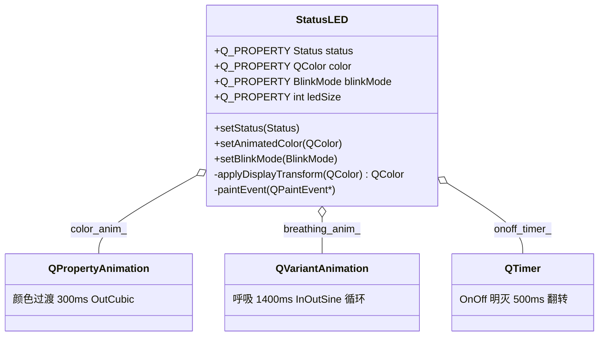

# StatusLED 成品导览

> **source**：`widget/status-led/`　**related**：自绘控件递进链第 1 环（下一站 toggle-switch · 待产）

StatusLED 是个状态指示灯——服务器面板上那种绿/黄/红小圆点。听起来简单到不值得单做，但我们偏把它当**实例库第一件成品**：因为它体积小，却能把「一个正经自绘控件」该有的东西占全了——Q_PROPERTY 全套、动画驱动、尺寸契约、踩坑一个不落。这套骨架后面 toggle-switch / circle-progress / speed-meter 都会复用。

::: tip 本篇是「成品导览」
想直接用成品 → 看这里（架构 / 决策 / 踩坑 / 怎么读）。
想自己从零搓出来 → 转 [手搓手册](./handbook/)。
:::

## 1. 它做什么

一个 `AwesomeQt::StatusLED` 控件：

- **四种状态**：`NORMAL`(绿) / `WARNING`(琥珀) / `ERROR`(红) / `OFFLINE`(灰)
- **状态切换颜色平滑过渡**：不突变，300ms `OutCubic` 缓动过渡（`QPropertyAnimation` 驱动一个 `QColor` 属性）
- **三种闪烁模式**：`None`(不闪) / `OnOff`(生硬明灭) / `Breathing`(正弦呼吸)
- **完整 Q_PROPERTY**：`status` / `color` / `blinkMode` / `ledSize` 四个属性全可被动画 / Qt Designer / State Machine 驱动

跑起来看一眼比读十行描述管用：

```bash
cd widget && cmake -B build && cmake --build build
./build/status-led/demo/status_led_demo
```

## 2. 架构总览

### 类关系

一个 StatusLED 同时「拥有」三个动画 / 定时器对象，各司其职、互不干涉：



三个对象写进**不同的成员变量**：`color_anim_` 写 `current_color_`（过渡中间色），`breathing_anim_` 写 `breathing_factor_`（0..1 亮度因子），`onoff_timer_` 写 `onoff_visible_`（开关）。paintEvent 入口才由 `applyDisplayTransform` 把它们合成成最终绘制色。这是整份代码最关键的设计——后面解释为什么。

### 文件职责

| 文件 | 职责 |
|---|---|
| `include/status_led.h` | 接口：Q_PROPERTY 四件套 + Status/BlinkMode 枚举 + 公有 API |
| `src/status_led.cpp` | 实现：动画初始化 / 状态切换 / 合成变换 / 自绘 |
| `demo/status_led_window.cpp` | 演示：四态静态 / 交互切换 / 多尺寸 / 过渡·闪烁·属性驱动 |

### 状态切换 + 呼吸怎么跑起来

```mermaid
sequenceDiagram
    participant U as 调用方
    participant S as StatusLED
    participant C as color_anim_
    participant B as breathing_anim_
    participant P as paintEvent
    U->>S: setStatus(WARNING)
    S->>C: stop(); setStart(current_color_); setEnd(amber); start()
    loop 每帧
        C->>S: setAnimatedColor(插值色)
        S->>S: current_color_=插值色; update()
    end
    Note over B: 若 blinkMode==Breathing，breathing_anim_ 并行
    B->>S: breathing_factor_=0.7; update()
    S->>P: 合并触发重绘
    P->>P: c=applyDisplayTransform(current_color_)=base×呼吸亮度
```

重点：颜色过渡写 `current_color_`，呼吸写 `breathing_factor_`，**两个独立变量**。所以「边过渡颜色边呼吸」不打架——它们正交。

## 3. 关键设计决策

**① 颜色过渡走 `Q_PROPERTY(QColor color)`，不手写 RGB 插值。**
Qt 内置 `QColor` 插值器（RGB 线性），`QPropertyAnimation(this, "color")` 直接能用，省掉 lerp 函数。项目里已有先例（examples 的 colorwidget）。代价：绿→红中间一帧偏暗褐（见踩坑②），但 300ms+OutCubic 快速逼近终点，肉眼可接受。

**② `color_anim_` 用持久成员指针，不用 `DeleteWhenStopped`。**
和 circulargauge 不同：那种「每次 new、停了自动 delete」的写法在频繁切换时反复 new/delete，且别处持指针会悬空。这里改持久指针 + `stop()/setStartValue(current_color_)/start()`——从当前显示色接力到新目标，连切不跳变、不崩。

**③ 过渡色与呼吸因子解耦，`applyDisplayTransform` 合成。**
`current_color_`（过渡产物）和 `breathing_factor_`（呼吸产物）是两个独立变量，paintEvent 入口才合成。好处：天然正交、可并行，不用为「过渡中要不要暂停呼吸」设计状态机。

**④ BlinkMode 枚举收编三种闪烁，旧 `setBlinking` 做兼容薄层。**
`None/OnOff/Breathing` 一个枚举讲清，`setBlinking(bool)` 留着映射 `OnOff/None`，老 demo 不用改。

**⑤ 诚实承认 RGB 插值中间色问题，把 HSV 留给进阶挑战。**
不装没问题。OutCubic+短时长是务实解；要鲜艳过渡，`qRegisterAnimationInterpolator` 注册 HSV 插值器是正路（见 [手搓手册·进阶挑战](./handbook/)）。

## 4. 怎么读这份 code

按这个顺序读，最快建立心智：

1. **`include/status_led.h` 的 Q_PROPERTY 四件套**（28-31 行）——先看「对外暴露哪些可驱动属性」
2. **`setStatus`**（`src/status_led.cpp:90`）——状态切换如何启动过渡，盯 `stop()+setStartValue(current_color_)+start()` 这三行的接力
3. **`setAnimatedColor`**（`src/status_led.cpp:111`）——动画每帧回调，纯赋值 + emit + update
4. **`applyDisplayTransform`**（`src/status_led.cpp:194`）——合成核心，on-off 熄灭与 breathing 插值怎么叠
5. **`paintEvent`**（`src/status_led.cpp:216`）——自绘，径向渐变高光
6. **`initBreathingAnimation`**（`src/status_led.cpp:62`）——呼吸范式（QVariantAnimation LoopInfinite + InOutSine）

入口：`demo/main.cpp` → `demo/status_led_window.cpp` 跑起来，对照读。

## 5. 踩坑

| # | 现象 | 原因 | 后果 | 解法 |
|---|---|---|---|---|
| ① | 频繁切换状态偶发崩溃 | `color_anim_` 用 `DeleteWhenStopped`，stop 后被 delete、指针悬空 | **segfault** | 持久成员指针 + `stop()/重配/start()`，不用 `DeleteWhenStopped`（`src/status_led.cpp:55`） |
| ② | 绿→红过渡中间一帧偏暗褐 | Qt 对 QColor 默认 RGB 线性插值，绿红中间是橄榄色 | 视觉略脏（非崩溃） | OutCubic+300ms 掩盖；要鲜艳就注册 HSV 插值器（进阶挑战） |
| ③ | 以为过渡时呼吸会让颜色乱跳 | 误解：过渡和呼吸写在不同变量，正交 | 过度设计去「冻结呼吸相位」 | 认清 `current_color_` 与 `breathing_factor_` 解耦，合成即可并行 |
| ④ | 以为每帧 new QRadialGradient 有性能问题 | 误判 | 过度优化（缓存 gradient 反要处理失效） | 有意不缓存：LED 像素量极小，60fps 可忽略 |
| ⑤ | 动画回调里用了 `repaint()` | `repaint()` 同步立即重绘，不等事件循环 | 动画掉帧 | 一律 `update()`（异步合并，`src/status_led.cpp:117`） |
| ⑥ | 窗口缩到极小时 LED 消失 / 不绘制 | 半径 `min(w,h)/2-1` 在 w/h 极小时为负 / 0 | `drawEllipse` 行为未定义 | `std::max(1, ...)` 兜底（`src/status_led.cpp:222`） |
| ⑦ | color 的 WRITE 错指向 setStatus | 动画驱动 setStatus → setStatus 又启动画 → 无限递归 | **栈溢出** | WRITE 指 `setAnimatedColor`（纯赋值+emit+update），setStatus 是业务入口（`src/status_led.cpp:111`） |

## 6. 官方文档

- [QPropertyAnimation](https://doc.qt.io/qt-6/qpropertyanimation.html)——属性动画
- [QVariantAnimation](https://doc.qt.io/qt-6/qvariantanimation.html)——值动画（呼吸用的就是它）
- [Qt 属性系统（Q_PROPERTY）](https://doc.qt.io/qt-6/properties.html)——为什么 color 能被动画驱动
- [QRadialGradient](https://doc.qt.io/qt-6/qradiusgradient.html)——径向渐变高光
- [QColor::darker / lighter](https://doc.qt.io/qt-6/qcolor.html#darker)——亮度调制（呼吸 / 熄灭）

---

这套机制（Q_PROPERTY + 动画驱动 + 解耦合成）不是 StatusLED 专属——它就是「一个可被动画驱动的自绘控件」的标准范式。toggle-switch 会换皮复用同一套骨架。想自己搓？[手搓手册](./handbook/)带你从空 main 一行行搓到这个成品。
