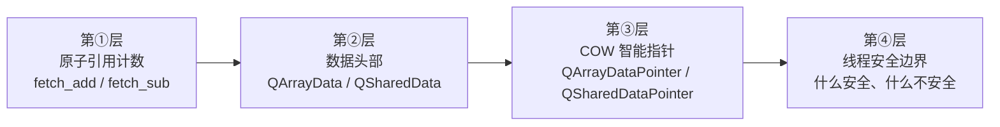
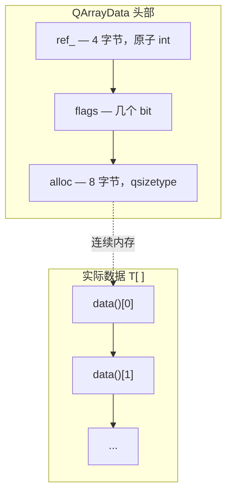
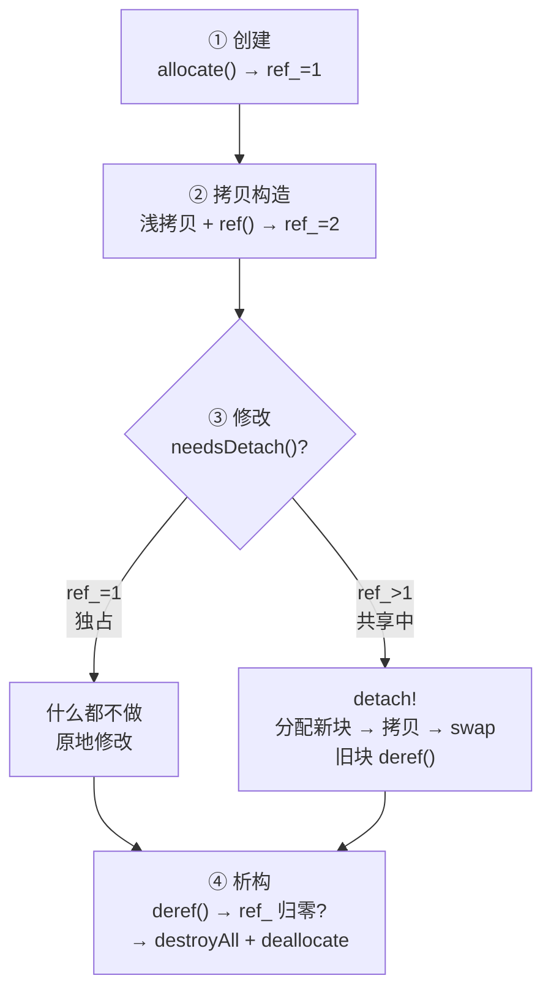
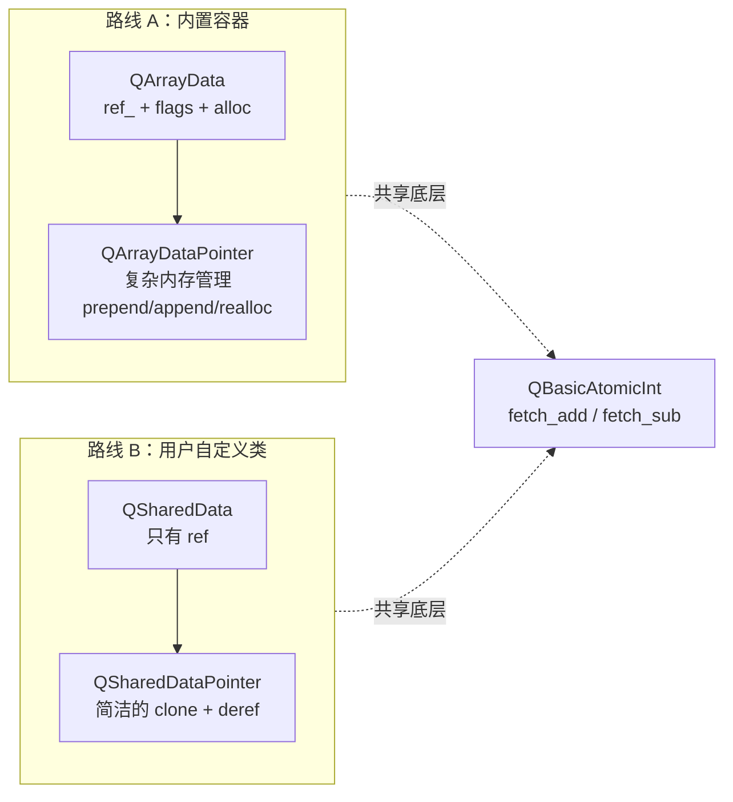

# 现代Qt开发教程（专家篇）1.01——隐式共享（Copy-on-Write）机制原理

## 1. 前言——为什么 Qt 要发明隐式共享

我们先来看一行代码：

```cpp
QString s1 = "Hello, Qt!";
QString s2 = s1;
```

如果你写过 C++，直觉会告诉你：第二行做了一次深拷贝——把 "Hello, Qt!" 的每个字符都复制了一遍（哦，现在有移动了，大伙可能想肯定触发的是移动操作）。但如果我们在 Qt 里实际跑一下，你会发现拷贝一个 QString 和拷贝一个 int 差不多快，不管字符串有多长。

这就是隐式共享（Implicit Sharing），也叫 Copy-on-Write（COW）。它的核心思路很简单：拷贝的时候只共享同一份数据（O(1)），等到真正需要修改的时候才复制一份出来。写到这里，很多朋友可能会说「这不就是智能指针的共享计数吗」——对，但不完全对。Qt 的 COW 有一套自己的基础设施，和我们熟悉的 `std::shared_ptr` 不一样：它把引用计数直接嵌在数据头部，用原子操作保护，并且通过「非常量访问自动触发深拷贝」的机制让整个过程对使用者透明。

## 2. 环境说明

本篇所有源码引用基于 `qt_src/qt6.9.1`，行号可能随 Qt 版本升级而漂移。如果你对照阅读时发现行号对不上，可以用函数名在对应文件里搜索定位。

本篇涉及的源码文件（按出现顺序）：

| 文件 | 角色 |
|---|---|
| `qt_src/qt6.9.1/qtbase/src/corelib/thread/qatomic_cxx11.h` | 原子操作底层（std::atomic 封装） |
| `qt_src/qt6.9.1/qtbase/src/corelib/tools/qrefcount.h` | 引用计数高层封装（RefCount） |
| `qt_src/qt6.9.1/qtbase/src/corelib/tools/qarraydata.h` | 容器共享数据头部（QArrayData） |
| `qt_src/qt6.9.1/qtbase/src/corelib/tools/qarraydatapointer.h` | 容器 COW 智能指针（QArrayDataPointer） |
| `qt_src/qt6.9.1/qtbase/src/corelib/tools/qshareddata.h` | 用户自定义共享类路线（QSharedData + QSharedDataPointer） |

## 3. 核心概念讲解

在开始翻源码之前，我们先对一下路线图——这篇要看的东西不少，知道整体走向才不会一头扎进某个函数里迷路。

Qt 的 COW 是一个分层的系统，从下到上可以分成四层：



我们要从第①层开始，一层一层往上走。为什么是这个顺序？因为每一层都依赖下一层的机制——你不可能理解 QArrayDataPointer 的 detach 为什么安全，如果你不知道底层的 ref/deref 是原子的；你不可能理解 detach 的判断条件，如果你不知道 QArrayData 的 ref_ 字段在哪。另外，Qt 实际上设计了**两条独立的路线**来满足不同的场景——内置容器走 QArrayData 路线，用户自定义类走 QSharedData 路线。我们会把两条路线都走一遍，最后对比。

### 3.1 原子引用计数——COW 的地基

COW 要回答的核心问题是：「这份数据现在有几个人在用？」如果只有一个人，随便改；如果两个人以上在共享，要改就得先复制一份出来。要安全地回答这个问题，引用计数必须是线程安全的。

Qt 的做法是把引用计数操作委托给 `QBasicAtomicInteger`，底层就是 `std::atomic<int>`。我们来看 `ref()` 的实现：

> `qt_src/qt6.9.1/qtbase/src/corelib/thread/qatomic_cxx11.h:259`
> ```cpp
> return _q_value.fetch_add(1, std::memory_order_acq_rel) != T(-1);
> ```

一行代码做了两件事：原子地加 1，然后检查旧值是否为 -1。`memory_order_acq_rel` 是 acquire-release 语义——release 保证本次 fetch_add 之前的所有写操作对其他线程可见，acquire 保证 fetch_add 之后的所有读操作不会重排到它前面。这对引用计数来说足够了：ref() 之后，其他线程一定能看到新的引用计数值。

再看 `deref()`：

> `qt_src/qt6.9.1/qtbase/src/corelib/thread/qatomic_cxx11.h:266`
> ```cpp
> return _q_value.fetch_sub(1, std::memory_order_acq_rel) != T(1);
> ```

同样原子减 1，但判断条件变了：检查旧值是否等于 1。如果旧值是 1，减完之后就是 0——说明这是最后一个引用，应该释放数据了。此时 `!= T(1)` 为 false，外层拿到 false 就知道「该释放了」。注意这里的语义反转：deref() 返回 false 意味着「该释放」，不是「出错了」。

你可能会问：为什么检查 -1？-1 是 Qt 给「静态对象」的标记值——那些永生不死、永远不该被释放的数据（比如空字符串的共享空块）。对静态对象做 ref() 或 deref() 不会改变计数，但在不同层面有不同的处理方式，我们后面会碰到。

Qt 还在 `QBasicAtomicInt` 之上包了一层 `QtPrivate::RefCount`，加了「静态对象」的概念：

> `qt_src/qt6.9.1/qtbase/src/corelib/tools/qrefcount.h:18-23`
> ```cpp
> inline bool ref() noexcept {
>     int count = atomic.loadRelaxed();
>     if (count != -1) // !isStatic
>         atomic.ref();
>     return true;
> }
> ```

RefCount::ref() 先用 loadRelaxed() 读一下当前值，如果是 -1（静态对象）就跳过递增直接返回 true。注意它始终返回 true，不管实际有没有递增。这是一个设计选择——调用者不需要知道是否是静态对象，只需要知道「ref 成功了，你不用管释放」。

> `qt_src/qt6.9.1/qtbase/src/corelib/tools/qrefcount.h:25-30`
> ```cpp
> inline bool deref() noexcept {
>     int count = atomic.loadRelaxed();
>     if (count == -1) // isStatic
>         return true;
>     return atomic.deref();
> }
> ```

deref() 对静态对象直接返回 true（「不用释放」），非静态对象才走真正的 fetch_sub。

这里有一个容易让人不放心的地方：RefCount::ref() 里面先用 loadRelaxed() 读 count，然后再调 atomic.ref()，这两步之间如果有另一个线程把 count 改了怎么办？比如线程 A 读到 count==5（不是 -1），然后线程 B 把 count 改成了 -1，线程 A 再调 atomic.ref() 岂不是对 -1 做了递增？

实际上不会。Qt 的设计中，一个对象要么是静态的（从创建到销毁一直是 -1），要么不是。不存在「运行过程中突然变成静态对象」的情况。所以 loadRelaxed() 读到非 -1 之后，即使有并发 ref/deref，count 只会在正整数之间变化，不会变成 -1。这个 loadRelaxed() 是安全的。

### 3.2 QArrayData——容器共享数据的头部

理解了原子引用计数之后，我们来看 Qt 内置容器（QString、QByteArray、QList）是怎么组织共享数据的。关键认识是：容器的实际数据不是「裸数组」，前面有一个头部结构管理元信息。

这个头部叫 `QArrayData`，只有三个字段：

> `qt_src/qt6.9.1/qtbase/src/corelib/tools/qarraydata.h:42-44`
> ```cpp
> QBasicAtomicInt ref_;
> ArrayOptions flags;
> qsizetype alloc;
> ```

`ref_` 就是引用计数，`flags` 是容量预留等标志位，`alloc` 是已分配容量（以元素个数为单位）。你可以把内存布局想象成这样：



新分配的数据块，ref_ 初始化为 1：

> `qt_src/qt6.9.1/qtbase/src/corelib/tools/qarraydata.cpp:141`
> ```cpp
> header->ref_.storeRelaxed(1);
> ```

创建者独占，ref_=1。等一下，如果你还记得前面 QSharedData 的构造函数把 ref 初始化为 0，这里却是 1——这不是矛盾，而是两条不同的路线。QArrayData 路线在分配时直接设为 1（因为分配就意味着有人持有它），QSharedData 路线把 ref 留给外层的智能指针去递增。我们后面讲 QSharedDataPointer 时会看到区别。

接下来是两个关键判断函数：

> `qt_src/qt6.9.1/qtbase/src/corelib/tools/qarraydata.h:69-80`
> ```cpp
> bool isShared() const noexcept
> {
>     return ref_.loadRelaxed() != 1;
> }
> bool needsDetach() noexcept
> {
>     return ref_.loadRelaxed() > 1;
> }
> ```

这两个函数看起来几乎一样，但判断条件不同：`isShared()` 是 `!= 1`，`needsDetach()` 是 `> 1`。差异出在 ref_==0 的情况。ref_==0 出现在 `fromRawData()` 创建的「视图」——它没有自己的 QArrayData 头部，d 指针是 nullptr。此时 `isShared()` 返回 true（「!= 1」成立），但 `needsDetach()` 返回 false（「> 1」不成立）。

实际触发深拷贝的标准是 `needsDetach()`——只有 ref_ > 1（真的有其他人在共享）时才需要 detach。注意 `needsDetach()` 被标记为非 const，注释里也说了「intentionally not const」。设计意图是：你问「需不需要 detach」，说明你打算修改数据，那你就应该在非常量上下文中做这件事。

另一个值得关注的细节：两个判断函数都用的是 `loadRelaxed()`，不是 acquire 或 release 语义。这意味着它们不保证读到其他线程最新写入的值。但这是安全的——如果读到旧值（比如实际 ref_ 已经变成 2 了但你还读到 1），最坏情况是少做了一次 detach，而下一次操作会再次检查。反过来，如果实际是 1 但你读到了 2，最多多做了一次不必要的深拷贝。两种情况都不会导致数据竞争或崩溃。

### 3.3 QArrayDataPointer——COW 的智能指针

QArrayData 只是一个头部，它本身不管生命周期。真正管理「什么时候共享、什么时候复制、什么时候释放」的是 `QArrayDataPointer<T>`——一个专门为连续数组设计的 COW 智能指针。

它持有三个成员：

> `qt_src/qt6.9.1/qtbase/src/corelib/tools/qarraydatapointer.h:516-518`
> ```cpp
> Data *d;
> T *ptr;
> qsizetype size;
> ```

`d` 指向 QArrayData 头部（准确说是 `QTypedArrayData<T>`，QArrayData 的模板子类），`ptr` 指向实际数据数组的首元素，`size` 是当前有效元素数。你可能会问：为什么 `ptr` 和 `d` 分开？数据不是紧跟在头部后面吗？大部分情况是这样，但 Qt 的容器支持 `prepend` 优化——在数组前面预留空间，此时 `ptr` 会指向数据区中间的某个位置，不紧跟头部。这种设计让 `prepend` 和 `append` 一样高效。

现在我们来走一遍完整的 COW 生命周期。这是本篇的叙事主线，搞懂了这条线就搞懂了 Qt 的 COW。整个流程可以概括成四步：



下面我们逐步展开，每一步都有源码对应。

**第一步：创建**

当我们构造一个 `QList<int> list = {1, 2, 3}` 时，底层调用 `QArrayData::allocate()` 分配内存，ref_ 被设为 1（上面看过）。此时 QArrayDataPointer 的三个成员分别指向新分配的头部、数据首元素、元素数量 3。

**第二步：拷贝构造**

```cpp
QList<int> list2 = list;  // 发生了什么？
```

> `qt_src/qt6.9.1/qtbase/src/corelib/tools/qarraydatapointer.h:37-40`
> ```cpp
> QArrayDataPointer(const QArrayDataPointer &other) noexcept
>     : d(other.d), ptr(other.ptr), size(other.size)
> {
>     ref();
> }
> ```

三步：浅拷贝 d/ptr/size 三个成员（指针赋值，不碰数据），然后调用 `ref()`。`ref()` 的实现是 `if (d) d->ref()`——对 d 指向的 QArrayData 做一次原子递增。此时 ref_ 从 1 变成 2。两个 QList 共享同一份数据，拷贝开销是：复制三个指针 + 一次原子加法。不管你的 list 有一万个元素还是一个亿，都是 O(1)。

**第三步：修改（detach）**

这是 COW 的「写时复制」真正发生的地方。

```cpp
list2[0] = 99;  // list2 触发 detach
```

当非 const 的 `operator[]` 被调用时，它会间接触发 `detach()`：

> `qt_src/qt6.9.1/qtbase/src/corelib/tools/qarraydatapointer.h:142-145`
> ```cpp
> void detach(QArrayDataPointer *old = nullptr)
> {
>     if (needsDetach())
>         reallocateAndGrow(QArrayData::GrowsAtEnd, 0, old);
> }
> ```

先检查 `needsDetach()`——还记得吗，条件是 `!d || d->needsDetach()`。此时 ref_=2 > 1，返回 true，需要深拷贝。然后调用 `reallocateAndGrow()`：

> `qt_src/qt6.9.1/qtbase/src/corelib/tools/qarraydatapointer.h:218-250`
> ```cpp
> Q_NEVER_INLINE void reallocateAndGrow(QArrayData::GrowthPosition where, qsizetype n,
>                                       QArrayDataPointer *old = nullptr)
> {
>     // ... fast path 省略 ...
>
>     QArrayDataPointer dp(allocateGrow(*this, n, where));
>     // ...
>     if (size) {
>         qsizetype toCopy = size;
>         // ...
>         if (needsDetach() || old)
>             dp->copyAppend(begin(), begin() + toCopy);
>         else
>             dp->moveAppend(begin(), begin() + toCopy);
>     }
>
>     swap(dp);
>     if (old)
>         old->swap(dp);
> }
> ```

这段代码做了四件事：第一，`allocateGrow()` 分配一块新的 QArrayData + 数据区（新块 ref_=1）。第二，`copyAppend()` 把旧数据逐元素拷贝到新块——这就是「深拷贝」。第三，`swap(dp)` 把 this 和 dp 的 d/ptr/size 交换——this 现在指向新数据，dp 指向旧数据。第四，dp 离开作用域时析构，对旧数据调 `deref()`。

经过这一步，list2 指向新数据（ref_=1），list1 仍然指向旧数据（ref_ 从 2 被 deref 到 1）。两个对象各自独立，修改互不影响。

**第四步：析构**

> `qt_src/qt6.9.1/qtbase/src/corelib/tools/qarraydatapointer.h:106-111`
> ```cpp
> ~QArrayDataPointer()
> {
>     if (!deref()) {
>         (*this)->destroyAll();
>         Data::deallocate(d);
>     }
> }
> ```

析构时调用 `deref()`，它的实现是 `return !d || d->deref()`。d 为 null（fromRawData 场景）直接返回 true 不释放。否则调 `QArrayData::deref()`，内部就是 `ref_.deref()`——也就是那个 fetch_sub。如果旧值是 1，减完变 0，返回 false，表示「该释放了」。然后先 `destroyAll()` 逐个析构元素，再 `deallocate()` 释放整块内存。

赋值运算符也值得一提——Qt 用的是 copy-and-swap 惯用法：

> `qt_src/qt6.9.1/qtbase/src/corelib/tools/qarraydatapointer.h:69-73`
> ```cpp
> QArrayDataPointer &operator=(const QArrayDataPointer &other) noexcept
> {
>     QArrayDataPointer tmp(other);
>     this->swap(tmp);
>     return *this;
> }
> ```

先拷贝构造 tmp（ref+1），再 swap（this 拿到新数据，tmp 拿到旧数据），tmp 析构时对旧数据 deref。自赋值安全：`list = list` 时 tmp 拷贝自身（ref 从 1 变 2），swap 后 tmp 持有原指针，tmp 析构 deref 一次（ref 回到 1），净效果不变。

### 3.4 QSharedDataPointer——用户自定义共享类的路线

上面讲的 QArrayDataPointer 是 Qt 内部给容器用的，针对「连续数组」做了很多优化（prepend 空间、reallocate 快路径等）。如果我们要给自己的类加 COW 呢？Qt 提供了另一套更简洁的路线：`QSharedData` + `QSharedDataPointer`。两条路线的架构对比：



下面的讲解会经常和路线 A 对比，建议对照着看。

我们先看数据基类：

> `qt_src/qt6.9.1/qtbase/src/corelib/tools/qshareddata.h:22-25`
> ```cpp
> mutable QAtomicInt ref;
> // ...
> QSharedData() noexcept : ref(0) { }
> QSharedData(const QSharedData &) noexcept : ref(0) { }
> ```

注意两件事。第一，`ref` 初始化为 0，不是 1。这和 QArrayData 的 `storeRelaxed(1)` 不同。设计理由是：创建 QSharedData 子类对象时，还没有任何智能指针持有它，所以 ref 应该是 0。等 QSharedDataPointer 接管它时才 ref+1 变成 1。第二，`ref` 是 `mutable` 的。这是必要的——当你拷贝一个 `const QSharedDataPointer<T>` 时，需要对新指向的 data 做 `ref()`，但 data 指向的是 const 对象。没有 mutable，在 const 对象上修改 ref 会编译不过。

再看智能指针。拷贝构造和析构是理解这条路线的关键：

> `qt_src/qt6.9.1/qtbase/src/corelib/tools/qshareddata.h:66-67`
> ```cpp
> QSharedDataPointer(const QSharedDataPointer &o) noexcept : d(o.d)
> { if (d) d->ref.ref(); }
> ```

浅拷贝 d 指针 + ref()。和 QArrayDataPointer 的拷贝构造完全对称。

> `qt_src/qt6.9.1/qtbase/src/corelib/tools/qshareddata.h:57`
> ```cpp
> ~QSharedDataPointer() { if (d && !d->ref.deref()) delete d.get(); }
> ```

析构时 deref()，返回 false（ref 从 1 减到 0）时 delete。简洁明了。

然后是 detach——QSharedDataPointer 的 detach 逻辑比 QArrayDataPointer 简单得多，因为没有「连续数组的 prepend/append 优化」需要处理：

> `qt_src/qt6.9.1/qtbase/src/corelib/tools/qshareddata.h:41`
> ```cpp
> void detach() { if (d && d->ref.loadRelaxed() != 1) detach_helper(); }
> ```

条件是 `d != nullptr` 且 `ref != 1`。注意这里的判断是 `!= 1` 而不是 `> 1`——和 QArrayData 的 `needsDetach()`（`> 1`）不同。这意味着 ref==0 时也会触发 detach_helper。ref==0 出现在什么场景？当你用 `QAdoptSharedDataTag` 构造了一个没有递增引用计数的指针，然后对它做非 const 访问时。这种情况下 ref 是 0，detach_helper 会创建一个独立副本。

> `qt_src/qt6.9.1/qtbase/src/corelib/tools/qshareddata.h:243-250`
> ```cpp
> Q_OUTOFLINE_TEMPLATE void QSharedDataPointer<T>::detach_helper()
> {
>     T *x = clone();
>     x->ref.ref();
>     if (!d.get()->ref.deref())
>         delete d.get();
>     d.reset(x);
> }
> ```

四步：`clone()` 就是 `new T(*d)`——拷贝构造一个新数据对象（新对象的 ref 继承自 QSharedData，初始为 0）。然后 `x->ref.ref()` 把新对象的 ref 从 0 变成 1。接着对旧对象 `deref()`，如果归零就 delete。最后 `d.reset(x)` 让指针指向新对象。整个流程比 QArrayDataPointer 的 reallocateAndGrow 简洁很多——因为不需要处理内存布局、数据搬迁等复杂问题。

最后说一下 `QExplicitlySharedDataPointer`——它是 QSharedDataPointer 的「手动挡」版本：

> `qt_src/qt6.9.1/qtbase/src/corelib/tools/qshareddata.h:131-139`
> ```cpp
> T &operator*() const { return *(d.get()); }
> T *operator->() noexcept { return d.get(); }
> T *operator->() const noexcept { return d.get(); }
> ```

看到了吗？非 const 的 `operator->()` 和 `operator*()` 都不调用 `detach()`。拿到指针后你想怎么改就怎么改，不会自动触发深拷贝。这就是「显式共享」——你需要自己决定什么时候调 `detach()`。QExplicitlySharedDataPointer 适用于你确实想让多个引用共享同一份数据的场景，比如 Qt 的 QPixmap——多个窗口显示同一张图片，没必要每改一处就复制整张图片。

两条路线的对比：

| | QArrayDataPointer 路线 | QSharedDataPointer 路线 |
|---|---|---|
| 适用对象 | 内置容器（QString/QByteArray/QList） | 用户自定义共享类 |
| 数据头 | QArrayData（ref_/flags/alloc） | QSharedData（只有 ref） |
| detach 触发 | 非常量访问自动触发 | QSDP：自动触发；QESDP：手动触发 |
| detach 实现 | reallocateAndGrow（复杂的内存管理） | detach_helper（简洁的 clone+deref） |
| ref 初始值 | 1（分配即持有） | 0（指针接管后递增） |
| detach 条件 | ref_ > 1（needsDetach） | ref != 1 |

### 3.5 线程安全边界——COW 保护什么、不保护什么

这是我们最容易踩坑的地方。先把结论说清楚：COW 的线程安全只覆盖「引用计数操作本身」，不覆盖「同一个对象在不同线程同时修改」。

引用计数的线程安全由 `memory_order_acq_rel` 保证——ref() 的 fetch_add 和 deref() 的 fetch_sub 都是原子的，多线程同时做引用计数操作不会出问题。

但 `needsDetach()` 用的是 `loadRelaxed()`，不保证看到其他线程最新的写入。这是刻意的——如果你读到旧值，最坏就是多做一次不必要的深拷贝，不会导致数据竞争。

COW 真正给我们的线程安全保证是这样一个场景：线程 A 和线程 B 各自持有一个 `QString` 的拷贝（通过拷贝构造共享数据），然后各自读——完全安全，因为读操作不触发 detach，引用计数不变。如果线程 A 要修改，detach 会创建独立副本，线程 B 继续持有旧数据不受影响。需要说明的是，这是基于 ref/deref 原子性和 detach 后各持有独立副本的推理结论，并非 Qt 源码中一行可见的显式声明——但推理链条是成立的。

COW 不保护的场景：两个线程对同一个非 const QString 对象（不是拷贝，是同一个变量）同时调用非 const 方法。此时两个线程可能同时进入 detach，而 detach 本身不是线程安全的（先 loadRelaxed 检查，再 reallocate——两步之间不是原子的）。Qt 把隐式共享类标记为 `reentrant`（可重入）而不是 `thread-safe`（线程安全），这个区分很关键。

## 4. 踩坑预防

第一个坑是非常量方法触发意外 detach。这个问题我们在讲 detach 机制的时候其实已经接触到了——所有非常量访问都会检查 needsDetach()——但它的实际后果比你想的严重得多。考虑这段代码：

```cpp
QString big = loadHugeFile();  // 几十 MB
auto& ref = big[0];            // 非常量 operator[] → data() → detach()
```

如果 `big` 此时的 ref_ > 1（比如你之前做了 `QString copy = big`，copy 还活着），这一行就会触发一次完整的深拷贝——几十 MB 的内存分配和数据复制。更隐蔽的是 range-based for 循环：

```cpp
for (auto& c : str) { ... }       // 非常量 begin() → detach()!
for (auto& c : std::as_const(str)) { ... }  // const begin()，不触发
```

原因我们在生命周期分析里看到了：非常量 begin() 会调 detach()，const begin() 不会。后果是：如果 str 被共享，第一种写法在循环开始前就做了一次深拷贝；如果不被共享，看起来没区别——但 detach 检查本身也有原子读的开销，在热循环里不可忽视。解决方案很简单：不需要修改时一律用 const 引用或 `std::as_const()`。

第二个坑是 detach 后迭代器失效。这个坑是真的能给你一个 segfault 的。假设你有这样的代码：

```cpp
QList<int> list = {1, 2, 3, 4, 5};
auto it = list.begin();
QList<int> copy = list;  // ref_ = 2
copy.append(6);          // detach! 新内存，旧内存 ref_ 从 2 减到 1
*it = 99;                // it 还指向旧数据...但如果 ref_ 归零就会悬垂
```

这段代码目前不会崩溃——因为 `list` 还持有旧数据的引用（ref_=1）。但如果你接着对 `list` 做了修改（触发另一次 detach），旧数据的 ref_ 归零被释放，`it` 就变成了悬垂指针。更危险的情况是：如果你把 `it` 传递给了另一个函数，而那个函数里有人修改了 `copy`，你根本意识不到迭代器已经失效了。后果是：使用悬垂指针读取 → 未定义行为，可能 segfault，可能读到垃圾数据，可能「看起来正常」但实际数据已经被覆盖。解法：修改操作前确保没有活跃的迭代器指向可能被 detach 的数据。

第三个坑是 QExplicitlySharedDataPointer 忘记手动 detach。前面讲了，QExplicitlySharedDataPointer 的 `operator->()` 不会自动调用 detach()。这意味着：

```cpp
QExplicitlySharedDataPointer<MyData> p1(new MyData);
auto p2 = p1;              // 浅拷贝，共享数据
p1->value = 42;            // 修改了共享数据
// p2->value 也是 42 了！  // 因为没有 detach，两个指针指向同一份数据
```

如果你本意是「p1 和 p2 各自独立」，但用了 QExplicitlySharedDataPointer 又忘记手动调 detach()，就会得到意外的数据共享。后果是数据被意外修改，且这种 bug 很难调试——因为看起来程序运行正常，只是数据莫名其妙变了。解法：除非你确实需要显式共享（比如 QPixmap 这种场景），否则一律用 QSharedDataPointer。如果必须用 QExplicitlySharedDataPointer，在修改前显式调 `detach()`。

## 5. 官方文档参考链接

[Qt 文档 · Implicit Sharing](https://doc.qt.io/qt-6/implicit-sharing.html) -- Qt 隐式共享机制的总览文档，列出了所有使用 COW 的类

[Qt 文档 · QSharedData](https://doc.qt.io/qt-6/qshareddata.html) -- 用户自定义共享类的引用计数基类

[Qt 文档 · QSharedDataPointer](https://doc.qt.io/qt-6/qshareddatapointer.html) -- 隐式共享智能指针（自动 detach）

[Qt 文档 · QExplicitlySharedDataPointer](https://doc.qt.io/qt-6/qexplicitlyshareddatapointer.html) -- 显式共享智能指针（手动 detach）

到这里，Qt COW 机制的核心原理就拆完了。我们从最底层的 `fetch_add` 一路走到了 detach_helper 的 clone-deref-reset，看到了 Qt 为内置容器和用户自定义类设计的两条路线。下一篇我们会把这些机制放到具体的容器（QString、QByteArray、QList）里看——它们各自在哪些操作上触发 detach、const 和非 const 访问的实战差异、以及 QVarLengthArray 这种「不用 COW」的容器适合什么场景。

