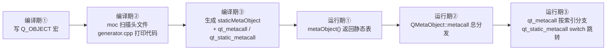
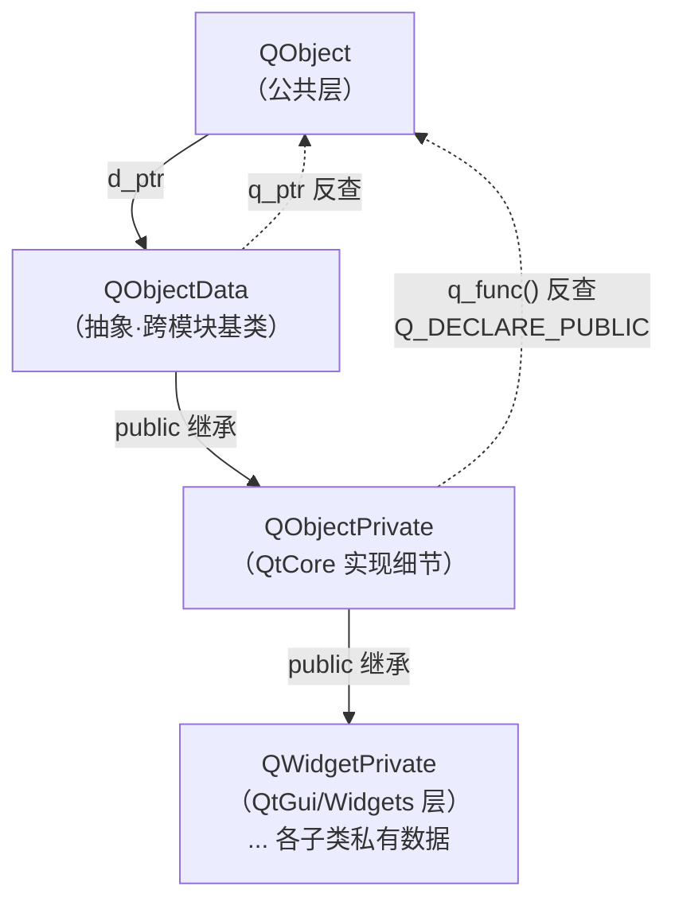
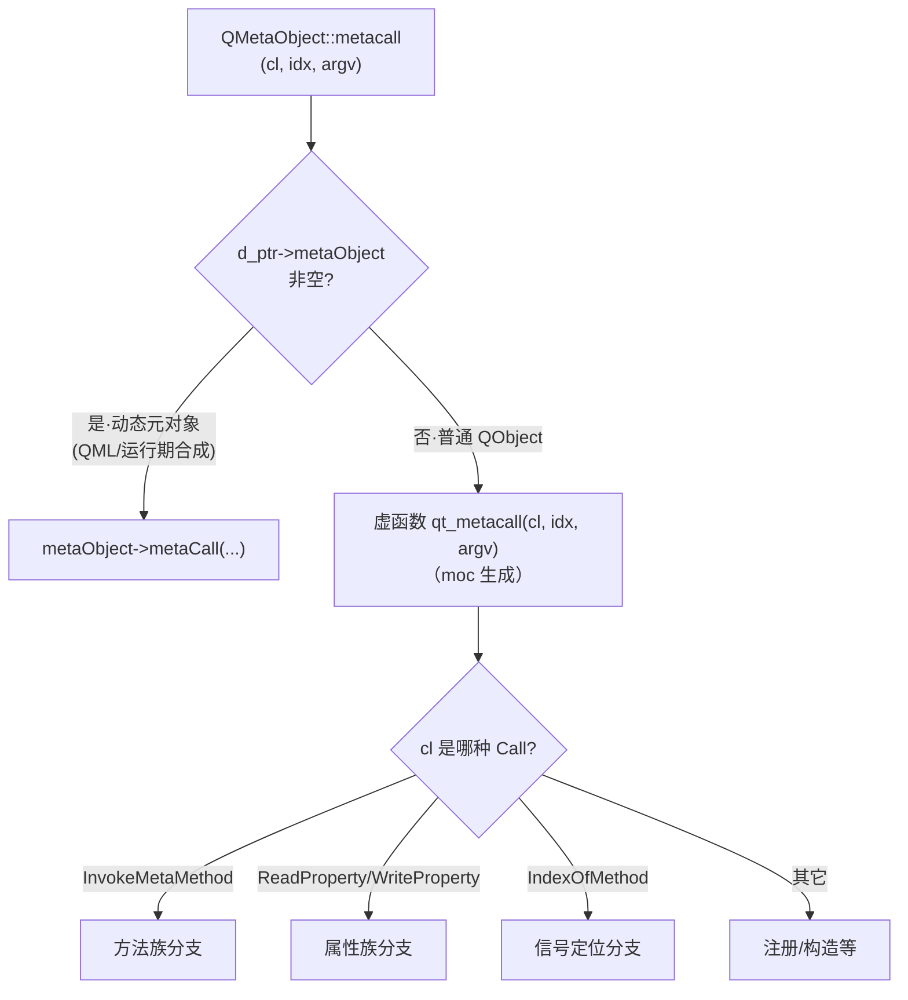
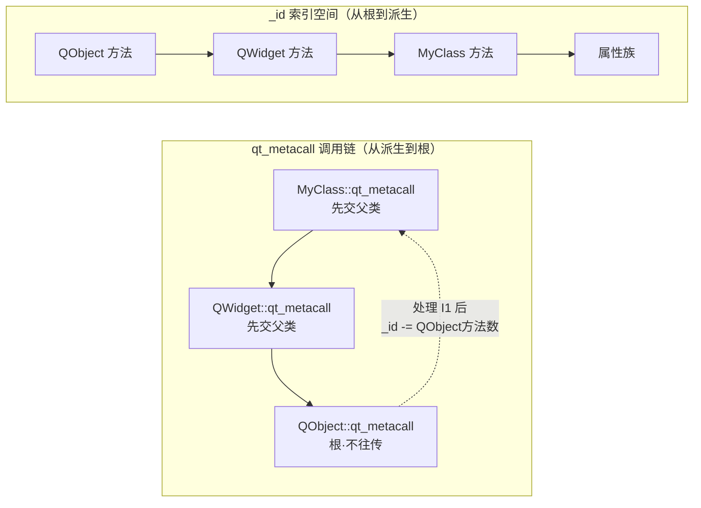

# 现代Qt开发教程（专家篇）1.01——QObject 元对象系统源码拆解

## 1. 前言——为什么要拆 QObject 的源码

下面这两行，咱们都写过无数次：

```cpp
class MyClass : public QObject {
    Q_OBJECT
```

写到 `Q_OBJECT` 的时候，大家心里都清楚「这是让 moc 处理这个类」。但往下追问三个问题，大多数人就开始卡壳了：`metaObject()` 返回的那个 `QMetaObject`，里面到底装了什么？`qt_metacall` 这个函数，QObject 头文件里翻烂了都找不到它的函数体，它是从哪冒出来的？为什么一个 `int` 索引传进去，就能变成一次方法调用、一次属性读写、或者一次类型转换？

笔者列的这三个问题，恰恰就是元对象系统的脊梁。入门篇 [1.1 QObject 与元对象系统](../../beginner/01-qtbase/01-qobject-meta-system-beginner.md) 带咱们走过了「怎么用」——`QObject` 怎么继承、对象树怎么管父子、`Q_OBJECT` 怎么写、属性怎么 `READ/WRITE/NOTIFY`，那是知其然。本篇要捅到知其所以然：咱们把 `QObject` 的源码拆开，看看那个不透明的 `d_ptr` 指针背后藏着什么、`QMetaObject` 这张静态表怎么布局、运行期一次元调用是怎么分发出去的。

您要是读过进阶篇的 [QObject 属性系统深度拆解](../../advanced/01-qtbase/01-qobject-property-system-advanced.md)，会发现那一篇聚焦的是 `Q_PROPERTY` 这套怎么用、怎么设计。本篇不重复那些，咱们盯着元对象系统本身的骨架——属性系统的运行期分发（`ReadProperty`/`WriteProperty`）在源码里其实只是 `metacall` 的一个分支，笔者点到这个分支就收手，不展开 `argv` 数组的布局细节。

边界也得先交代清楚，免得走着走着跑偏。本篇严格停在「内存模型 + 静态元数据 + metacall 分发框架」这三件事上：信号发射链 `QMetaObject::activate` 不展开，那是 [02 篇信号槽源码](./02-signal-slot-internals-expert.md)的主场；对象树的 `setParent_helper` 增删子对象也不深挖，那是 [21 篇对象树源码](./21-object-tree-ownership-expert.md)的内容。咱们这一篇，就把元对象系统的地基打好，让后面所有篇都能回头引用它。

## 2. 环境说明

本篇所有源码引用基于 `qt_src/qt6.9.1`，行号可能随 Qt 版本升级而漂移。如果你对照阅读时发现行号对不上，用函数名或字段名在对应文件里搜索定位即可。涉及 `moc/generator.cpp` 的行号尤其脆弱——那是 moc 工具的生成器模板，Qt 每次小版本都可能调整打印逻辑，所有这类行号我都挂了脚注 `[^moc-gen]` 提醒。

本篇涉及的源码文件（按出现顺序）：

| 文件 | 角色 |
|---|---|
| `qt_src/qt6.9.1/qtbase/src/corelib/kernel/qobject.h` | QObject 公共声明、QObjectData 抽象基类 |
| `qt_src/qt6.9.1/qtbase/src/corelib/kernel/qobject.cpp` | QObject 构造、保护构造实现 |
| `qt_src/qt6.9.1/qtbase/src/corelib/kernel/qobject_p.h` | QObjectPrivate 私有实现层 |
| `qt_src/qt6.9.1/qtbase/src/corelib/kernel/qobjectdefs.h` | QMetaObject 结构、Data 七槽位、Call 枚举 |
| `qt_src/qt6.9.1/qtbase/src/corelib/kernel/qmetaobject.cpp` | metacall 总分发入口 |
| `qt_src/qt6.9.1/qtbase/src/corelib/kernel/qtmetamacros.h` | Q_OBJECT 宏展开 |
| `qt_src/qt6.9.1/qtbase/src/tools/moc/generator.cpp` | moc 生成器模板（打印 qt_metacall/qt_static_metacall） |

本篇无配套 example，原因：纯源码解析，没有合理的可跑 demo——你不会为了看 `d_ptr` 的布局去单独写一个工程，对照 `qt_src` 翻源码就是最好的实验。

## 3. 核心概念讲解

在扎进源码之前，咱们先对一下路线图。元对象系统是一个横跨「编译期」和「运行期」的系统，一头雾水往往是因为把这两头搅在一起。咱们先把全链路看清楚：



左半边是编译期——咱们写 `Q_OBJECT`，moc 工具读头文件，用 `generator.cpp` 里的模板打印出一份 `moc_myclass.cpp`，里面填好了 `staticMetaObject` 静态表和 `qt_metacall`/`qt_static_metacall` 两个函数。右半边是运行期——代码里调 `obj->metaObject()` 拿到那张静态表，调 `QMetaObject::metacall` 进总分发，最终落到 moc 生成的 `qt_metacall` 里按索引分支。

咱们这一篇要顺着这条链走一遍。但走链之前，得先解决一个更底层的问题：`QObject` 对象在内存里到底长什么样？那个 `d_ptr` 是什么？这是整条链的地基。

### 3.1 d_ptr——QObject 只持有一个不透明指针

先抛个问题：`QObject` 自己到底持有几个数据成员？笔者第一次翻源码的时候，以为至少得有几十个——对象名、父子、信号槽、定时器，哪个不得占几个字段。答案是 1 个。

`qt_src/qt6.9.1/qtbase/src/corelib/kernel/qobject.h:375`

```cpp
    QScopedPointer<QObjectData> d_ptr;
```

就这行。所有状态——对象名、父子关系、信号槽连接表、定时器、动态属性——全塞在 `d_ptr` 这个不透明指针背后。这种手法叫 PIMPL（Pointer to Implementation，指针指向实现），收益很实在：ABI 被冻结了。只要 `QObject` 公共部分只有这一个指针，Qt 内部往 `QObjectPrivate` 里加字段、改布局，都不会弄坏你已经编译好的代码的二进制兼容性。你当年拿 Qt 5.12 编译的插件，到 Qt 6.9 里很多还能加载，靠的就是这个。

那这个指针什么时候绑上去？答案在 `QObject` 的一个受保护构造函数里。咱们看 `qobject.cpp`：

`qt_src/qt6.9.1/qtbase/src/corelib/kernel/qobject.cpp:946-952`

```cpp
QObject::QObject(QObjectPrivate &dd, QObject *parent)
    : d_ptr(&dd)
{
    Q_ASSERT_X(this != parent, Q_FUNC_INFO, "Cannot parent a QObject to itself");

    Q_D(QObject);
    d_ptr->q_ptr = this;
```

这个构造函数干了两件关键的事。第一，把传进来的 `QObjectPrivate &dd` 绑到 `d_ptr` 上——注意 `dd` 是引用，子类构造时会传一个属于它自己的 `QObjectPrivate`（或派生类）进来，于是每个具体类（`QWidget`、`QTimer`、`QNetworkAccessManager`）都有自己的私有数据类型。第二，`d_ptr->q_ptr = this` 回填了一个反向指针——私有数据能反查到自己挂在哪个 `QObject` 上。这一来一回，「公共对象 ↔ 私有数据」的双向引用就建起来了。

这个构造函数是受保护的，外部根本调不到：

`qt_src/qt6.9.1/qtbase/src/corelib/kernel/qobject.h:372`

```cpp
    QObject(QObjectPrivate &dd, QObject *parent = nullptr);
```

只有子类（在它们自己构造函数的初始化列表里）才能调它。比如 `QWidget` 的构造函数会传一个 `QWidgetPrivate` 进来，`QWidgetPrivate` 继承自 `QObjectPrivate`，于是 `QWidget` 既有 `QObject` 的全部私有数据，又叠上了自己的窗口系统字段。Qt 整个控件树「私有数据层层叠加」的机制根源就在这。

### 3.2 QObjectData 与 QObjectPrivate——两层数据布局

现在咱们钻进 `d_ptr` 背后。这里有个会让初学者一头雾水的设计：私有数据其实分了两层，一层叫 `QObjectData`，一层叫 `QObjectPrivate`。笔者一开始也没绕清楚，先把它们的关系画明白：



`QObjectData` 是个抽象基类，看它的析构：

`qt_src/qt6.9.1/qtbase/src/corelib/kernel/qobject.h:71`

```cpp
    virtual ~QObjectData() = 0;
```

纯虚析构，意味着 `QObjectData` 不能独立实例化。它存在的唯一意义是定义所有「QObject 私有数据」共有的最小字段集——也就是对象树那三件套：

`qt_src/qt6.9.1/qtbase/src/corelib/kernel/qobject.h:72-74`

```cpp
    QObject *q_ptr;
    QObject *parent;
    QObjectList children;
```

`q_ptr` 是反查公共对象的指针（3.1 节构造函数回填的就是它），`parent` 和 `children` 是对象树的父子关系。这三个字段放在 `QObjectData` 基类这一层是有讲究的——它们跨模块、跨子类通用，不管您是 `QWidget` 还是 `QTimer`，对象树的表示方式都一样。所以 `children()` 这个公共 API 几乎零开销就能拿到子对象列表：

`qt_src/qt6.9.1/qtbase/src/corelib/kernel/qobject.h:203`

```cpp
    inline const QObjectList &children() const { return d_ptr->children; }
```

直接返回 `d_ptr->children` 的 const 引用，连拷贝都省了。能这么写，正因为 `children` 字段在基类 `QObjectData` 里，`d_ptr`（类型 `QScopedPointer<QObjectData>`）能直接看到它。

真正的实现细节，则塞在派生类 `QObjectPrivate` 里：

`qt_src/qt6.9.1/qtbase/src/corelib/kernel/qobject_p.h:73-76`

```cpp
class Q_CORE_EXPORT QObjectPrivate : public QObjectData
{
public:
    Q_DECLARE_PUBLIC(QObject)
```

`QObjectPrivate` public 继承 `QObjectData`，把对象树三件套继承下来，再叠上 `QtCore` 自己的实现细节（连接表、定时器、信号索引、线程亲和性这些）。这里有个关键宏 `Q_DECLARE_PUBLIC(QObject)`——它是 3.1 节 `Q_D(QObject)` 的对偶：`Q_D` 让公共层拿到私有层的指针（`d_func()`），`Q_DECLARE_PUBLIC` 让私有层反过来拿到公共层的指针（`q_func()`）。Qt 源码里到处都是的 `d->xxx`（公共方法里访问私有数据）和 `q->xxx`（私有方法里回调公共 API），底层机制就是这对宏。

理清这两层之后，咱们记住一个结论：`QObject` 公共对象只有一个 `d_ptr`，它指向 `QObjectPrivate`（及其子类），而 `QObjectPrivate` 里既有基类 `QObjectData` 的通用字段（对象树），又有自己的实现细节。这套布局是后面理解一切的基础——`metaObject()`、信号槽连接表、线程亲和性，全挂在 `d_ptr` 背后这张私有数据网上。

### 3.3 QMetaObject——一张只读的静态元数据表

私有数据讲完了，现在转向编译期 moc 塞进来的东西。咱们看 `QMetaObject` 这个类型本身：

`qt_src/qt6.9.1/qtbase/src/corelib/kernel/qobjectdefs.h:233`

```cpp
struct Q_CORE_EXPORT QMetaObject
{
```

注意它是 `struct`（默认公有），而且每个类对应一个 `QMetaObject` 实例——不是每个对象一个，是每个类一个，而且是编译期就定好的静态对象。它本质是一张只读的静态元数据表，不存任何对象状态，只描述「这个类有哪些方法、信号、槽、属性、枚举」。

那这张表是怎么和咱们的类绑上的？答案在 `Q_OBJECT` 宏里。咱们看它展开后声明了什么：

`qt_src/qt6.9.1/qtbase/src/corelib/kernel/qtmetamacros.h:133-140`

```cpp
    static const QMetaObject staticMetaObject;
    virtual const QMetaObject *metaObject() const;
    virtual void *qt_metacast(const char *);
    virtual int qt_metacall(QMetaObject::Call, int, void **);
```

`Q_OBJECT` 宏给咱们类声明了四样东西：一个静态成员 `staticMetaObject`（这 就是那张元数据表的本体），外加三个虚函数 `metaObject`/`qt_metacast`/`qt_metacall`。注意这四个都是声明，定义在哪儿？ 答案是：moc 生成的 `moc_myclass.cpp` 里。咱们写的头文件里只有声明，moc 扫描后生成定义——这就是为什么「改了类的信号槽声明但没重跑 moc」会出问题（见 4.1 节的坑）。

现在咱们钻进 `staticMetaObject` 这张表的内部结构。`QMetaObject` 内部有一个 `Data` 结构体，固定七个槽位：

`qt_src/qt6.9.1/qtbase/src/corelib/kernel/qobjectdefs.h:600-609`

```cpp
    struct Data {
        SuperData superdata;
        const uint *stringdata;
        const uint *data;
        StaticMetacallFunction static_metacall;
        const SuperData *relatedMetaObjects;
        const QtPrivate::QMetaTypeInterface *const *metaTypes;
        void *extradata;
    } d;
```

咱们逐个槽位看。`superdata` 指向父类的 `QMetaObject`——这就是 `superClass` 链的源头，元对象系统靠它把继承关系串起来。`stringdata` 是一张压缩过的字符串表，类名、方法名、参数类型名全部塞在里面（用整数偏移引用，省内存）。`data` 是一张 `uint` 数组，描述每个方法/信号/槽/属性的元信息（参数个数、偏移、标志位），全是用整数编码。`static_metacall` 是一个函数指针——静态元调用入口，4 节咱们会重点讲。`relatedMetaObjects`、`metaTypes`、`extradata` 分别是关联元对象（`Q_INTERFACES` 声明的接口）、元类型信息、扩展数据（动态属性、类信息等）。

`superdata` 这个槽位值得单独说，因为它涉及一个跨平台的小技巧。它的类型是 `SuperData`，不是裸指针：

`qt_src/qt6.9.1/qtbase/src/corelib/kernel/qobjectdefs.h:575-598`

```cpp
    struct SuperData {
        using Getter = const QMetaObject *(*)();
        const QMetaObject *direct;
        // ...
#else
        constexpr SuperData(Getter g) : direct(g()) {}
```

`SuperData` 包装了父类 `QMetaObject` 的引用，走的是双模式。正常情况下（能静态链接定位到父类元对象的平台），构造时调用传入的 getter 函数 `g()`，取出父类 `staticMetaObject` 的地址，`direct` 持有的就是父类元对象地址——注意这是 getter `g()` 调用后取出的地址，不是 getter 函数指针本身。但在 `QT_NO_DATA_RELOCATION`（某些动态库不能在加载期定位静态符号的平台，比如部分嵌入式场景）情况下，它退而存一个 getter 函数指针 `indirect`，运行期再调 getter 去取。这个细节平时用不到，但理解它有助于你看懂 moc 生成的代码里 `QMetaObject::SuperData::link<QWidget::staticMetaObject>()` 这种写法。

第四槽 `static_metacall` 是谁填的？答案是 moc 生成器。咱们看 `generator.cpp` 怎么打印这一槽：

`qt_src/qt6.9.1/qtbase/src/tools/moc/generator.cpp:454-455`[^moc-gen]

```cpp
    if (hasStaticMetaCall)
        fprintf(out, "    qt_static_metacall,\n");
```

`generator.cpp` 是 moc 工具的源码——它本身不是运行期会执行的 QObject 代码，而是 moc 在编译期用来打印生成代码的模板。这段逻辑说的是：如果这个类有静态元调用（绝大多数 `Q_OBJECT` 类都有），就把 `qt_static_metacall` 这个函数指针写到 `Data` 的第四槽。注意这里用的是 `fprintf(out, ...)` 在打印字符串——moc 生成出来的是一份 C++ 源文件，那份源文件里才会有真正的 `qt_static_metacall` 函数体。这个「生成器的源码」和「生成出来的源码」的层次区分，是读 moc 相关代码最容易绊倒人的地方，咱们后面 3.5/3.6 节还会反复遇到。

### 3.4 metacall——元调用的总分发入口

元数据表有了，现在看运行期怎么用它。所有的元调用——不管是 `QMetaObject::invokeMethod` 反射调用一个方法，还是属性系统读写一个 `Q_PROPERTY`，还是 `qobject_cast` 做类型转换——最终都会汇聚到一个总入口 `QMetaObject::metacall`：

`qt_src/qt6.9.1/qtbase/src/corelib/kernel/qmetaobject.cpp:343-348`

```cpp
int QMetaObject::metacall(QObject *object, Call cl, int idx, void **argv)
{
    if (object->d_ptr->metaObject)
        return object->d_ptr->metaObject->metaCall(object, cl, idx, argv);
    else
        return object->qt_metacall(cl, idx, argv);
}
```

这个函数只有一件事：静态/动态二分。笔者第一次读 `metacall` 的时候，以为里面会有个庞大的 switch 把各种 Call 类型挨个分发，结果就两行 if-else——它先看 `object->d_ptr->metaObject` 这个成员是不是空的。如果非空，说明这个对象挂了一个「动态元对象」（典型场景是 QML 或某些运行期合成元对象的场景），走动态分支 `metaObject->metaCall(...)`；如果是空的（绝大多数普通 `QObject` 子类都是空的），走静态分支——直接调虚函数 `object->qt_metacall(...)`，也就是 moc 给咱们类生成的那个函数。

这里有一个非常重要的细节，是咱们后续理解一切的关键：`metacall` 这个总入口本身只做二分，它不关心你具体要干什么。具体「干什么」由第二个参数 `Call cl` 决定。咱们看 `Call` 这个枚举列出了哪些分支：

`qt_src/qt6.9.1/qtbase/src/corelib/kernel/qobjectdefs.h:553-565`

```cpp
    enum Call {
        InvokeMetaMethod,
        ReadProperty,
        WriteProperty,
        ResetProperty,
        CreateInstance,
        IndexOfMethod,
        // ... 注册元类型、可绑定属性等 ...
        ConstructInPlace,
    };
```

一次元调用 = `(Call 类型, int 索引, void** 参数)`。`Call` 类型决定了「这是一次方法调用还是一次属性读写还是一次类型查询」，索引 `_id` 决定了「调第几个方法/读写第几个属性」，`argv` 装着参数和返回值。`metacall` 把这三样原封不动传给 moc 生成的 `qt_metacall`，真正的分支逻辑在 `qt_metacall` 里——这是咱们下一节的主场。

整个分发关系可以这样表示：



### 3.5 qt_metacall——链式调父类与索引递减

现在咱们进了 moc 生成的 `qt_metacall` 函数体。笔者一开始在这里卡了好一阵：QObject 的源码里搜不到 `qt_metacall` 的函数体——它是 moc 生成物，定义在 `moc_myclass.cpp` 里，而那份文件编译期才生成，根本不在 `qt_src` 里。那咱们怎么研究它？

这里要用到一个「双证据」法：咱们看两样东西，一是运行期总入口 `metacall`（3.4 节已看，它告诉咱们 `qt_metacall` 被怎么调用），二是 moc 生成器模板 `generator.cpp`（它告诉咱们 `qt_metacall` 的函数体长什么样）。`generator.cpp` 用 `fprintf` 打印出生成代码，咱们读那些 `fprintf` 的字符串，就能还原出 `qt_metacall` 的真面目。

先看 `qt_metacall` 函数的开头，moc 是怎么打印的：

`qt_src/qt6.9.1/qtbase/src/tools/moc/generator.cpp:849-855`[^moc-gen]

```cpp
    if (!purestSuperClass.isEmpty() && !isQObject) {
        QByteArray superClass = purestSuperClass;
        fprintf(out, "    _id = %s::qt_metacall(_c, _id, _a);\n", superClass.constData());
    }
```

这段逻辑生成的代码，翻译成人话就是：`qt_metacall` 的第一件事，是把 `_id` 交给父类的 `qt_metacall` 处理。 注意 `!isQObject` 这个守卫——`QObject` 是根类，它没有父类可传，所以 QObject 自己的 `qt_metacall` 不往上传；而咱们的 `MyClass` 会先调 `QWidget::qt_metacall`，`QWidget` 又调 `QObject::qt_metacall`，形成一条从派生类到根类的调用链。

为什么要这样链式调用？因为元对象的索引空间是叠加的。假设继承链是 `QObject → QWidget → MyClass`，那方法索引 `_id` 是这样编排的：`[0, q方法数)` 是 `QObject` 的方法，`[QObject方法数, +QWidget方法数)` 是 `QWidget` 的方法，再往后才是 `MyClass` 自己的方法。`MyClass::qt_metacall` 先把 `_id` 交给父类，父类把自己范围里的方法处理掉，把 `_id` 减去自己方法数后返回；如果减完 `_id < 0`，说明请求落在父类范围里，本层直接返回；如果 `_id >= 0`，才轮到本层处理自己的方法。

这套「减法」机制就是 `qt_metacall` 的核心。咱们看 `_id < 0` 守卫是怎么生成的：

`qt_src/qt6.9.1/qtbase/src/tools/moc/generator.cpp:866-867`[^moc-gen]

```cpp
    if (_id < 0)
        return _id;
```

生成的就是一行 `if (_id < 0) return _id;`。它的含义是：父类处理完返回的 `_id` 如果已经是负数，说明这个请求已经被祖先类认领了，本层什么都不用做，直接把这个负数往上传。这是链式调用里的「短路」。

然后是本层自己按 `Call` 类型分支处理。moc 生成器在 `generator.cpp:870-895` 这段打印了按 `Call` 类型做 `_id -= N` 索引递减的逻辑，这段代码横跨了好几个 `Call` 分支（方法族、属性族），不是连续的一整块——866-867 的守卫和 870 起的 `Call` 分支块其实是两段独立内容。咱们先看方法族 `InvokeMetaMethod` 的递减主体：

`qt_src/qt6.9.1/qtbase/src/tools/moc/generator.cpp:870-883`[^moc-gen]

```cpp
        fprintf(out, "    if (_c == QMetaObject::InvokeMetaMethod) {\n");
        // ... switch(_id) 跳转到具体方法 ...
        fprintf(out, "        _id -= %d;\n    }\n", int(methodList.size()));
```

这段生成的代码意思是：如果是方法调用，先 `switch(_id)` 跳到具体方法执行，执行完把 `_id` 减去本类的方法数。属性族（`ReadProperty`/`WriteProperty` 等）在后面的行用同样的模式，把 `_id` 减去属性数。每一族处理完都减去自己的数量，最后 `return _id` 把剩余的（或负数）往上传。

把这条链画出来，索引空间的划分就一目了然：



理解了这条链，你就理解了为什么 `qt_metacall` 的签名返回 `int` 而不是 `void`——它要把处理后的 `_id` 一路传回去，让调用方知道「这个请求最终落在哪一层、还剩多少」。`metacall` 总入口拿到这个返回值，再决定下一步（比如方法调用成功了就完事，属性读写要按返回值定位）。

本篇咱们只到「按 `Call` 类型分支的总框架」这一层。`InvokeMetaMethod` 的 `switch` 具体怎么从 `_id` 跳到一个方法指针、属性族的 `argv` 数组怎么布局——这些细节咱们不在本篇展开，它们属于「读 moc 生成的产物」的范畴，需要的时候咱们对照具体类的 `moc_*.cpp` 看。

### 3.6 qt_static_metacall——switch 跳转表与线性查找

最后咱们看 `qt_static_metacall`——它就是 3.3 节里 `Data` 第四槽存的那个函数指针。和 `qt_metacall` 不同，`qt_static_metacall` 不走虚函数分发（不需要每个对象一份），它处理的是「和具体对象状态无关、只和类元数据有关」的调用——比如 `CreateInstance`（反射构造对象）、`IndexOfMethod`（信号定位）。

咱们看 moc 怎么生成它的 `switch` 跳转表：

`qt_src/qt6.9.1/qtbase/src/tools/moc/generator.cpp:929-967`[^moc-gen]

```cpp
        fprintf(out, "    if (_c == QMetaObject::CreateInstance) {\n");
        fprintf(out, "        switch (_id) {\n");
```

生成的代码是一个标准的 `switch(_id)`，每个 case 对应一个可反射构造的方法。`InvokeMetaMethod` 在静态元调用里也有类似的 `switch` 跳转表——把 `_id` 映射到具体的方法调用。这就是元对象系统「把 `int` 索引变成函数调用」的最终落点：一个 `switch` 跳转表，编译期就生成好了，运行期一次跳转就到。

但有一个 `Call` 类型不走 `switch`，那就是 `IndexOfMethod`——笔者第一次读到这段还愣了一下，明明别的都能 switch，怎么偏偏它特殊？它的生成逻辑确实很特别：

`qt_src/qt6.9.1/qtbase/src/tools/moc/generator.cpp:1078-1083`[^moc-gen]

```cpp
        fprintf(out, "    if (_c == QMetaObject::IndexOfMethod) {\n");
        for (int methodindex = 0; methodindex < int(cdef->signalList.size()); ++methodindex) {
            // ...
            fprintf(out, "        if (QtMocHelpers::indexOfMethod<%s (%s::*)(",
```

注意这里是一个 `for` 循环，对每个信号生成一条 `if` 判断，用 `QtMocHelpers::indexOfMethod` 做成员指针比较。翻译过来就是：`IndexOfMethod` 不用 `switch`，而是对每个信号逐个比较成员指针——你给我一个信号地址，我从第 0 个信号开始一个一个比，比上了就返回它的索引。

这是一个 O(信号数) 的线性查找。为什么不像别的那样用 `switch`？因为 `IndexOfMethod` 的输入是一个成员函数指针（编译期符号地址），不是一个整数索引，没法直接做 `switch` 跳转。平时这个线性开销可以忽略——一个类的信号能有几十个就算多了。但如果你真的写了一个信号数量极多的类（比如某些自动生成的 RPC 接口桩），`connect` 时元对象查询的线性开销就可能体现出来。这是一个冷知识，知道就行，不必为此过度设计。

至此，元对象系统的骨架咱们就拆完了：编译期 moc 用 `Q_OBJECT` 宏的声明生成 `staticMetaObject` 静态表和 `qt_metacall`/`qt_static_metacall` 两个函数；运行期 `metacall` 总入口做静态/动态二分，把请求交给 `qt_metacall`；`qt_metacall` 沿继承链向上传、按 `Call` 类型分支处理、用索引递减机制定位到具体方法或属性；`qt_static_metacall` 用 `switch` 跳转表和线性查找处理和类元数据相关的调用。下一节咱们看几个实战中真会踩到的坑。

## 4. 踩坑预防

第一个坑是改了信号槽或 `Q_OBJECT` 声明却没重跑 moc，结果运行期元对象数据和源码对不上。这个坑的根源咱们在 3.3 节看得很清楚——`staticMetaObject`、`metaObject()`、`qt_metacall` 这四个声明靠 `Q_OBJECT` 宏注入，而它们的定义全部由 moc 生成在 `moc_myclass.cpp` 里。如果你在头文件里加了一个新信号 `void mySignal(int)`，但 moc 没有重新跑（或者构建系统没捕获到头文件变化触发的 moc 依赖），生成的 `moc_myclass.cpp` 还是旧的——`staticMetaObject` 里没有这个新信号，`qt_metacall` 的 `switch` 跳转表也没有它的 case。后果是：`connect(this, &MyClass::mySignal, ...)` 看似能编过（编译器看到的是声明），但运行期 `IndexOfMethod` 线性查找时找不到这个信号，连接静默失败；或者 `invokeMethod("mySignal")` 报「无此方法」。这种 bug 极其难定位，因为编译期一切正常，运行期信号就是不通。解法很简单：永远走标准的 `CMAKE_AUTOMOC`，别手写 moc 调用；改了带 `Q_OBJECT` 的头文件后，确认全量重编（CMake 对 moc 依赖的捕获偶有失灵，必要时清 `build` 目录重建）。

第二个坑是想直接碰 `d_ptr` 或误以为 `QObjectData` 能独立拿来用。3.1 节咱们看到 `QObject` 只有一个 `d_ptr` 指针，有人可能动「直接读 `d_ptr` 里那个 `parent` 字段省一次函数调用」的念头——千万别。首先 `QObjectData` 是纯虚析构，你没法独立实例化它；其次 `d_ptr` 的类型是 `QScopedPointer<QObjectData>`，它指向的真实对象其实是 `QObjectPrivate`（或更深的子类），布局完全由 Qt 内部决定，跨版本会变。如果你硬要通过 `QObjectData` 的字段去 `reinterpret_cast` 操作私有布局，后果是 ABI 一变就段错误——你今天在 Qt 6.9 上能跑的偏移，到 6.10 可能就指到别的字段去了，给你一个漂亮的 segfault。解法：永远只走 `QObject` 的公共 API（`parent()`、`children()`、`objectName()` 等），`children()` 既然是 inline 返回 const 引用，本来就没有额外开销，没必要绕。

第三个坑是手动调 `qt_metacall` 传错 `_id` 索引。读完 3.5 节，有人可能跃跃欲试想直接调 `obj->qt_metacall(QMetaObject::InvokeMetaMethod, idx, argv)` 来「反射调用一个方法」——这是非常危险的做法。`_id` 的索引空间是叠加的，而且和方法族/属性族的编排强绑定（3.5 节那张索引空间图）。如果你自己算 `idx`，少算了父类方法的数量、或者搞混了方法族和属性族的范围，传进去的 `_id` 会落到错的分支——可能调到完全无关的方法，可能读写错属性，也可能越界访问 `argv` 数组。后果轻则数据错乱，重则 segfault。解法：永远走高层 API——反射调用方法用 `QMetaObject::invokeMethod`（它内部通过 `methodOffset` 和元对象表算好正确的索引再交给 `metacall`），读写属性用 `QMetaProperty::read`/`write`。这些高层 API 替你处理了索引空间的复杂编排，`qt_metacall` 留给 Qt 内部和 moc 自己用就行。

## 5. 官方文档参考链接

[Qt 文档 · QObject](https://doc.qt.io/qt-6/qobject.html) -- QObject 类的官方参考，所有公共 API 的入口

[Qt 文档 · QMetaObject](https://doc.qt.io/qt-6/qmetaobject.html) -- 元对象类的官方参考，含 methodOffset/propertyOffset 等索引计算接口

[Qt 文档 · The Meta-Object System](https://doc.qt.io/qt-6/metaobjects.html) -- 元对象系统的总览文档，讲 moc/Q_OBJECT/元调用三件套的关系

---

到这里，QObject 元对象系统的骨架咱们就从源码层面拆透了。笔者拆完最大的感受是：这套机制比看上去要"薄"——真正的重活压在编译期 moc 那一头（[17 篇](./17-moc-compiler-expert.md)会专门拆），运行期这边的 metacall 分发其实相当克制。咱们从「`QObject` 只有一个 `d_ptr`」这个最朴素的事实出发，看到了 PIMPL 怎么冻结 ABI、`QObjectData` 和 `QObjectPrivate` 怎么分两层组织数据、`QMetaObject` 怎么用一张七槽位的静态表描述整个类的元信息、运行期一次元调用怎么从 `metacall` 总入口分发到 moc 生成的 `qt_metacall` 里按索引递减地分支处理。这套机制是 Qt 一切的根基——信号槽、属性系统、事件系统、QML 互操作，全都建在它上面。后面拆信号槽的 `activate` 调用链、对象树的 `setParent_helper`、甚至 MOC 编译器本身的源码时，咱们都会回头用到这一篇的结论。

如果你想把本篇涉及的所有行号证据拿来一一核对，它们已按源码机制归类收在 [code-index · qobject 元对象系统](../code-index/qtbase/) 下，带着行号直接去 `qt_src/qt6.9.1` 翻原文就行。

[^moc-gen]: 这类行号来自 `qt_src/qt6.9.1/qtbase/src/tools/moc/generator.cpp`，是 moc 生成器的源码模板行号，不是产物行号。`generator.cpp` 用 `fprintf` 打印出 `moc_*.cpp` 的内容，咱们引用它来还原 moc 生成出来的 `qt_metacall`/`qt_static_metacall` 函数体长什么样。Qt 升级时这部分行号漂移最快，对照阅读请以函数名/逻辑定位为准。
