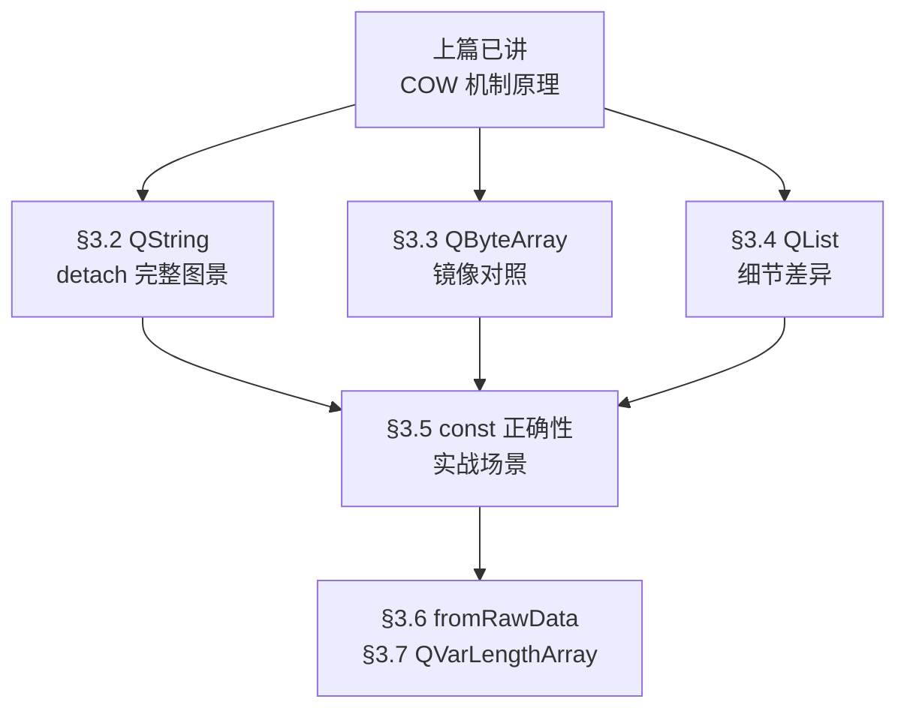
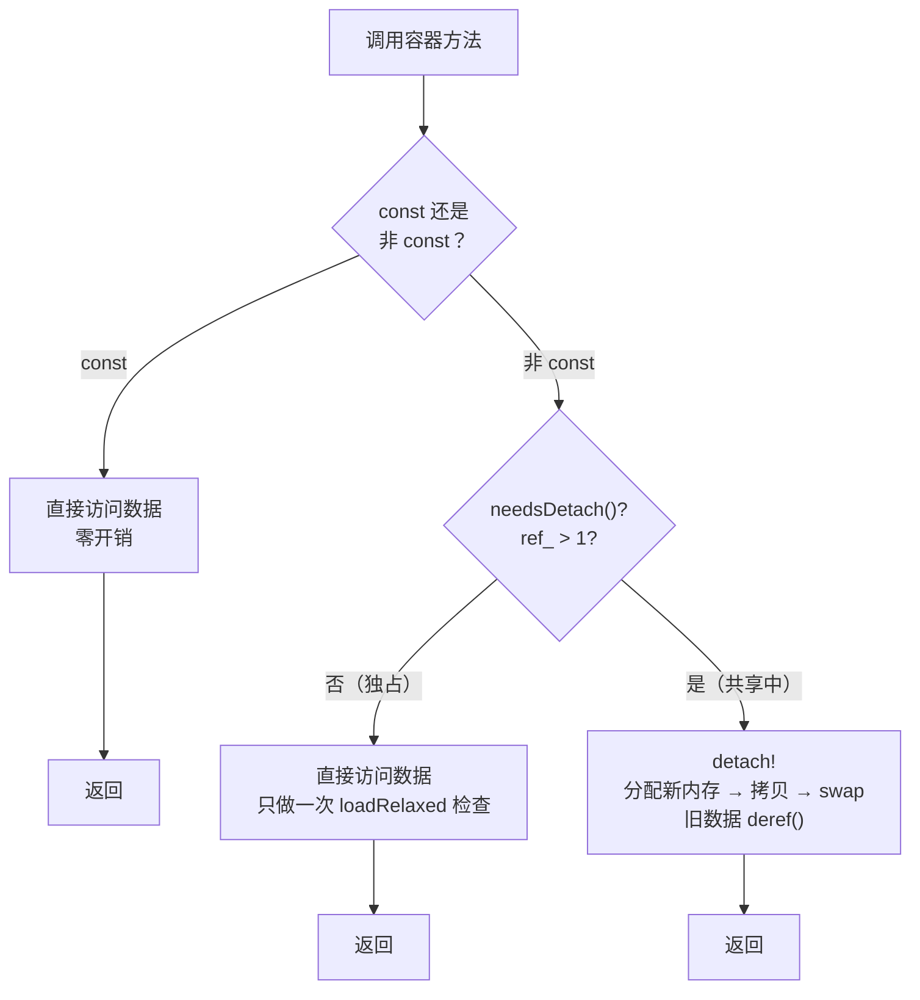
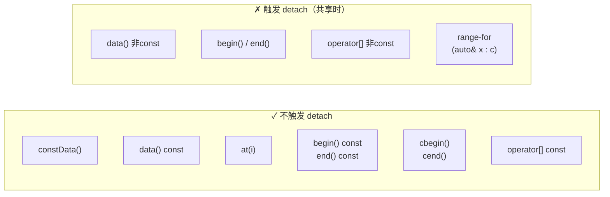

# 现代Qt开发教程（专家篇）1.02——COW 在 Qt 容器中的实战

## 1. 前言——从「怎么实现」到「怎么触发」

在[上一篇](./01-cow-implicit-sharing-expert.md)里我们把 COW 的机制从原子操作到 detach_helper 拆了个遍。我们知道了一个 QList 拷贝构造只花一次原子加法，知道了 detach 分配新内存然后 swap，知道了 QArrayDataPointer 析构时 deref 归零才释放。

但那篇刻意避开了一个问题：**到底哪些操作会触发 detach？** 我们只说了「非 const 方法会触发」，但没有展开。这篇就是把三个主力容器——QString、QByteArray、QList——逐个翻一遍，看清楚每个方法在源码层面是怎么处理 COW 的。搞清楚这件事，你以后写代码就能精确判断「这一行会不会导致深拷贝」，而不是凭感觉猜。

## 2. 环境说明

本篇所有源码引用基于 `qt_src/qt6.9.1`，行号可能随 Qt 版本升级漂移。函数名搜索即可定位。

本篇涉及的源码文件：

| 文件 | 角色 |
|---|---|
| `qt_src/qt6.9.1/qtbase/src/corelib/text/qstring.h` | QString 接口与内联实现 |
| `qt_src/qt6.9.1/qtbase/src/corelib/text/qstring.cpp` | QString 非内联实现 |
| `qt_src/qt6.9.1/qtbase/src/corelib/text/qbytearray.h` | QByteArray 接口与内联实现 |
| `qt_src/qt6.9.1/qtbase/src/corelib/tools/qlist.h` | QList 接口与内联实现 |
| `qt_src/qt6.9.1/qtbase/src/corelib/tools/qarraydataops.h` | QList 底层操作（emplace 等） |
| `qt_src/qt6.9.1/qtbase/src/corelib/tools/qvarlengtharray.h` | QVarLengthArray（对比） |

## 3. 核心概念讲解

在逐个翻容器之前，我们先看清楚本篇要覆盖的范围。上篇讲了 COW 的底层机制（原子计数 → 数据头部 → 智能指针），这篇要把那些机制放到三个主力容器里看它们怎么被调用：



### 3.1 detach 的触发模式——一个统一的规律

在逐个看容器之前，我们先总结一个贯穿三个容器的规律：**所有 detach 触发都走同一条路径——非 const 方法调 detach()，const 方法不调。** 这不是巧合，而是 Qt 的设计规范。三种容器遵守同一套规则，只是具体实现在细节上有所不同。

这套规则用一张流程图来概括更直观：



三个容器的具体实现全都遵循这个流程，后面我们逐个用源码验证。

| 操作类型 | const 版本 | 非 const 版本 |
|---|---|---|
| `data()` | 直接返回 `d.data()`，不触发 | 先 `detach()` 再返回 |
| `begin()` / `end()` | 返回 `const_iterator`，不触发 | 先 `detach()` 再返回 `iterator` |
| `operator[]` | 走 `at()`，不触发 | 走 `data()[i]`，间接触发 |
| `at()` | 直接读数据，不触发 | —（只有 const 版本） |
| `constData()` | 等价于 `data() const` | —（只有 const 版本） |

记住这张表，后面三个容器的源码验证的全是它。

### 3.2 QString——detach 的完整图景

QString 是三个容器中最值得细看的，因为它有自己的 `reallocData()` 而不是直接用 QArrayDataPointer 的 `reallocateAndGrow()`。原因我们上一篇提过：QString 需要处理尾部的 null 终止符（QChar(0)），逻辑比 QList 多一步。

先看拷贝构造——确认是 O(1) 的浅拷贝：

> `qt_src/qt6.9.1/qtbase/src/corelib/text/qstring.h:1340-1341`
> ```cpp
> QString::QString(const QString &other) noexcept : d(other.d)
> { }
> ```

就一行：用 QArrayDataPointer 的拷贝构造初始化 d，浅拷贝 + ref()。不管字符串多长，都是 O(1)。

然后看 detach 的入口。非 const 的 `data()` 是最常见的触发点：

> `qt_src/qt6.9.1/qtbase/src/corelib/text/qstring.h:1326-1330`
> ```cpp
> QChar *QString::data()
> {
>     detach();
>     Q_ASSERT(d.data());
>     return reinterpret_cast<QChar *>(d.data());
> }
> ```

第一行就调 `detach()`。如果 `d.needsDetach()` 返回 true（ref_ > 1），就进入 `reallocData()`：

> `qt_src/qt6.9.1/qtbase/src/corelib/text/qstring.cpp:2781-2802`
> ```cpp
> void QString::reallocData(qsizetype alloc, QArrayData::AllocationOption option)
> {
>     if (!alloc) {
>         d = DataPointer::fromRawData(&_empty, 0);
>         return;
>     }
>     const bool cannotUseReallocate = d.freeSpaceAtBegin() > 0;
>     if (d->needsDetach() || cannotUseReallocate) {
>         DataPointer dd(alloc, qMin(alloc, d.size), option);
>         Q_CHECK_PTR(dd.data());
>         if (dd.size > 0)
>             ::memcpy(dd.data(), d.data(), dd.size * sizeof(QChar));
>         dd.data()[dd.size] = 0;
>         d = dd;
>     } else {
>         d->reallocate(alloc, option);
>     }
> }
> ```

这段有三个值得注意的地方。第一，`alloc == 0` 时直接回到 `fromRawData(&_empty, 0)`——空字符串 detach 后仍然是空字符串，不分配堆内存。`_empty` 是一个静态的 `char16_t` 常量，所有空 QString 共享这个地址，ref 永远是 -1（静态对象）。第二，需要 detach 时用 `memcpy` 做深拷贝，然后在末尾写一个 null 终止符 `dd.data()[dd.size] = 0`——这是 QString 和 QList 的关键区别。第三，如果不需要 detach 且没有 `freeSpaceAtBegin`（prepend 预留空间），可以原地 `reallocate()`，不需要拷贝数据——这是独占时的快路径。

非 const 的 `operator[]` 不直接调 detach()，而是通过 `data()` 间接触发：

> `qt_src/qt6.9.1/qtbase/src/corelib/text/qstring.h:1431-1432`
> ```cpp
> QChar &QString::operator[](qsizetype i)
> { verify(i, 1); return data()[i]; }
> ```

`data()` 里调了 detach()，返回可写指针，然后 `[i]` 取偏移。const 版本的 `operator[]` 走 `at()`，直接读 `d.data()[i]`，不触发任何 detach。

非 const 的 `begin()` 和 `end()` 同样：

> `qt_src/qt6.9.1/qtbase/src/corelib/text/qstring.h:1435-1444`
> ```cpp
> QString::iterator QString::begin()
> { detach(); return reinterpret_cast<QChar*>(d.data()); }
> QString::iterator QString::end()
> { detach(); return reinterpret_cast<QChar*>(d.data() + d.size); }
> ```

而 const 版本的 `begin() const` 和 `end() const` 直接返回 `const_iterator`，不调 detach。这就是为什么 `for (auto& c : str)` 会在循环开始前触发一次 detach（如果 str 被共享的话），而 `for (const auto& c : str)` 不会。

最后提一个细节——默认构造的 QString 不分配任何内存：

> `qt_src/qt6.9.1/qtbase/src/corelib/text/qstring.h:1410`
> ```cpp
> constexpr QString::QString() noexcept {}
> ```

`constexpr` 意味着编译期就能完成——d 的三个成员全部零初始化，d.d == nullptr。第一次对它调 const 方法时返回 `&_empty`，第一次调非 const 方法时 `needsDetach()` 返回 true（d==nullptr），然后 `reallocData()` 分配真正的内存。

### 3.3 QByteArray——和 QString 几乎镜像

QByteArray 的 COW 实现跟 QString 是同一套模式，只把 QChar 换成了 char。我们快速过一遍确认这个判断。

拷贝构造：

> `qt_src/qt6.9.1/qtbase/src/corelib/text/qbytearray.h:634-635`
> ```cpp
> inline QByteArray::QByteArray(const QByteArray &a) noexcept : d(a.d)
> {}
> ```

和 QString 一样的浅拷贝。

非 const data() 触发 detach：

> `qt_src/qt6.9.1/qtbase/src/corelib/text/qbytearray.h:616-620`
> ```cpp
> inline char *QByteArray::data()
> {
>     detach();
>     Q_ASSERT(d.data());
>     return d.data();
> }
> ```

const 版本不触发：

> `qt_src/qt6.9.1/qtbase/src/corelib/text/qbytearray.h:622-625`
> ```cpp
> inline const char *QByteArray::data() const noexcept
> {
>     // ...
>     return d.data() ? d.data() : &_empty;
> }
> ```

`constData()` 就是 `data() const` 的别名：

> `qt_src/qt6.9.1/qtbase/src/corelib/text/qbytearray.h:124`
> ```cpp
> const char *constData() const noexcept { return data(); }
> ```

所以对 QByteArray 来说，`constData()` 和 `data() const` 完全等价，都不会触发 detach。非 const 的 `data()` 是唯一的触发入口（和 QString 一样，operator[] 通过 data() 间接调用）。

### 3.4 QList——detach 的细节差异

QList 和 QString 有一个重要区别：QList 直接用 QArrayDataPointer 的 `detach()`（上一篇分析过的那个），不需要自己的 `reallocData()`。这让 QList 的 detach 路径更简洁。

拷贝构造和赋值跟 QString 完全对称（浅拷贝 + ref），不再重复。我们看几个 QList 独有的细节。

**detach 入口**——QList 的 `detach()` 就是一个直接委托：

> `qt_src/qt6.9.1/qtbase/src/corelib/tools/qlist.h:457`
> ```cpp
> void detach() { d.detach(); }
> ```

没有 QString 那样的 `reallocData()`，直接走 `QArrayDataPointer::detach()` → `reallocateAndGrow()`。因为 QList 不需要处理 null 终止符。

**非 const begin()/end()**——和 QString 一样直接调 detach()：

> `qt_src/qt6.9.1/qtbase/src/corelib/tools/qlist.h:656-657`
> ```cpp
> iterator begin() { detach(); return iterator(d->begin()); }
> iterator end() { detach(); return iterator(d->end()); }
> ```

const 版本不触发：

> `qt_src/qt6.9.1/qtbase/src/corelib/tools/qlist.h:659-660`
> ```cpp
> const_iterator begin() const noexcept { return const_iterator(d->constBegin()); }
> const_iterator end() const noexcept { return const_iterator(d->constEnd()); }
> ```

注意 noexcept 的差异：const 版本是 noexcept，非 const 版本不是——因为 detach() 可能抛（分配内存失败）。

**operator[]**——跟 QString 一样通过 data() 间接触发：

> `qt_src/qt6.9.1/qtbase/src/corelib/tools/qlist.h:482-488`
> ```cpp
> reference operator[](qsizetype i)
> {
>     Q_ASSERT_X(size_t(i) < size_t(d->size), "QList::operator[]", "index out of range");
>     // don't detach() here, we detach in data below:
>     return data()[i];
> }
> const_reference operator[](qsizetype i) const noexcept { return at(i); }
> ```

注意源码注释：`// don't detach() here, we detach in data below`。Qt 的开发者故意不在 operator[] 里直接调 detach()，而是让 data() 去调——因为 data() 已经做了这件事，没必要重复。const 版本走 `at()`，完全安全：

> `qt_src/qt6.9.1/qtbase/src/corelib/tools/qlist.h:477-479`
> ```cpp
> const_reference at(qsizetype i) const noexcept
> { /* bounds check */ return d->data()[i]; }
> ```

**replace() 的安全 detach**——QList 有一个特殊模式值得注意：

> `qt_src/qt6.9.1/qtbase/src/corelib/tools/qlist.h:574-580`
> ```cpp
> void replace(qsizetype i, parameter_type t)
> {
>     Q_ASSERT_X(i >= 0 && i < d->size, "QList<T>::replace", "index out of range");
>     DataPointer oldData;
>     d.detach(&oldData);
>     d.data()[i] = t;
> }
> ```

`d.detach(&oldData)` 把旧数据指针交换到 `oldData` 里，而不是直接让临时对象析构。为什么？因为 `d.data()[i] = t` 这一行在执行时，旧数据必须还活着——如果 t 是一个引用了旧数据中元素的值，先释放旧数据就会读到已释放的内存。`oldData` 在 `replace()` 函数返回时析构，此时赋值已经完成，安全地 deref 旧数据。

**emplace 的快路径**——QList 的 `emplaceBack()` 有一个不需要 detach 的优化路径：

> `qt_src/qt6.9.1/qtbase/src/corelib/tools/qarraydataops.h:142-167`
> ```cpp
> void emplace(qsizetype i, Args &&... args)
> {
>     bool detach = this->needsDetach();
>     if (!detach) {
>         if (i == this->size && this->freeSpaceAtEnd()) {
>             new (this->end()) T(std::forward<Args>(args)...);
>             ++this->size;
>             return;
>         }
>         if (i == 0 && this->freeSpaceAtBegin()) {
>             new (this->begin() - 1) T(std::forward<Args>(args)...);
>             --this->ptr;
>             ++this->size;
>             return;
>         }
>     }
>     // ... 需要 detach 的慢路径
> }
> ```

如果不需要 detach（ref_==1，独占），且尾部有空余空间（`freeSpaceAtEnd()`），直接 placement new 在尾部构造元素，然后 size++。不需要分配内存，不需要拷贝数据，甚至不需要调 detach()。头部有空余空间时同理。只有两种快路径都走不通，或者需要 detach 时，才进入分配新内存的慢路径。

### 3.5 const 正确性——你的性能就藏在这里

我们前面看了三个容器的源码，它们遵循完全一样的模式：非 const 方法调 detach()，const 方法不调。这意味着 `const` 不只是一个编译器检查——它在运行时直接决定了你的代码会不会触发一次深拷贝。先看一张总结图：



左边这些是安全的——不会触发 detach，零额外开销。右边这些在容器被共享时会触发一次完整的深拷贝。几个实际场景：

**场景一：函数参数传递**

```cpp
// 每次调用都可能在函数体内触发 detach
void process(QString s) { /* s 是拷贝，ref+1 但在函数内修改会 detach */ }

// 安全：const 引用不增加引用计数，也不触发 detach
void process(const QString& s) { /* 只读访问，零开销 */ }
```

传值会在调用时 ref+1（O(1)，不深拷贝），但函数内部对 `s` 的非 const 操作会触发 detach。传 const 引用连 ref+1 都不发生。

**场景二：range-based for**

```cpp
QString str = computeBigString();
auto copy = str;  // ref_ = 2

// 触发 detach！非 const begin() → memcpy 全部字符串数据
for (auto& c : str) { /* ... */ }

// 不触发。const begin() → 直接读
for (const auto& c : str) { /* ... */ }

// 等价写法：std::as_const() 把左值转成 const 引用
for (auto& c : std::as_const(str)) { /* ... */ }
```

**场景三：只读遍历 QList**

```cpp
QList<int> list = {1, 2, 3, 4, 5};
auto other = list;  // ref_ = 2

// 触发 detach：非 const begin()
for (auto it = list.begin(); it != list.end(); ++it) { /* 只读，但 detach 已发生 */ }

// 不触发：cbegin()/cend() 或 const 容器上的 begin()/end()
for (auto it = list.cbegin(); it != list.cend(); ++it) { /* 纯读，零开销 */ }
```

这里的教训是：**如果你不打算修改容器，一定要用 const 接口。** 这不是代码风格问题，是性能问题——在共享状态下，一次非 const 的 `begin()` 就能触发一次完整深拷贝。

### 3.6 fromRawData——不拥有数据的「视图」

Qt 容器有一个特殊的构造方式：`fromRawData()`。它让容器指向一块外部内存，不拥有也不管理它的生命周期。

> `qt_src/qt6.9.1/qtbase/src/corelib/tools/qarraydatapointer.h:63`
> ```cpp
> static QArrayDataPointer fromRawData(const T *rawData, qsizetype length) noexcept
> {
>     // d = nullptr, ptr = rawData, size = length
> }
> ```

`fromRawData()` 创建的 QArrayDataPointer 的 `d` 是 nullptr。还记得上一篇的 `needsDetach()` 吗？它的实现是 `!d || d->needsDetach()`——d 为 nullptr 时直接返回 true。这意味着：**对 fromRawData 创建的容器做任何非 const 操作，都会触发一次完整的内存分配和数据拷贝。** 因为 fromRawData 只是「看一眼」外部数据，没有自己的 QArrayData 头部，不可能原地修改。

这个设计的用途是：你有一块已有的内存（比如网络收到的原始字节、mmap 映射的文件内容），想用 QByteArray 的接口读它，但不想付出拷贝的代价。只要只做 const 操作，fromRawData 就是零拷贝的。一旦你需要修改，Qt 会自动「升级」成一块真正拥有的内存——这和 COW 的 detach 逻辑完全一致，只是触发原因从「被共享」变成了「不拥有数据」。

### 3.7 QVarLengthArray——不用 COW 的容器

Qt 还有一个经常被忽略的容器：`QVarLengthArray`。它的设计哲学和 QList 完全相反——不用 COW，不用引用计数，不用 detach。每次拷贝都是深拷贝。

> `qt_src/qt6.9.1/qtbase/src/corelib/tools/qvarlengtharray.h`（全文 1063 行）
>
> grep 结果：detach / ref / deref / QSharedData / QAtomicInt / isShared — 无匹配

QVarLengthArray 的策略是：在栈上预分配一块固定大小的缓冲区（默认 256 个元素），元素少的时候直接用栈内存，不需要堆分配。只有超出预分配大小时才去堆上申请。没有引用计数、没有共享、没有 detach 的任何开销。

什么时候该选 QVarLengthArray 而不是 QList？答案是：**临时性的、局部的、不会被拷贝的短数组。** 典型场景包括：函数内部的临时缓冲区、算法中的中间结果存储、OpenGL 顶点数据组装。这些场景不需要 COW 的「拷贝 = O(1)」优势，反而会被 COW 的原子操作开销拖慢——每次非 const 访问都要检查 needsDetach()，虽然只是一次 loadRelaxed()，但在热循环里积少成多。

反过来，如果容器会在多个对象之间传递、拷贝、作为返回值，QList 的 COW 优势就出来了——拷贝是 O(1) 的，修改时才付出代价。

## 4. 踩坑预防

第一个坑是 range-based for 循环的隐藏 detach。这个坑在篇 1 踩坑预防里提过，但这里从源码层面彻底解释清楚。当你写 `for (auto& c : str)` 时，编译器展开后调用的是非 const 的 `str.begin()` 和 `str.end()`。我们看到 QString 的实现：

> `qt_src/qt6.9.1/qtbase/src/corelib/text/qstring.h:1435`
> ```cpp
> QString::iterator QString::begin()
> { detach(); return reinterpret_cast<QChar*>(d.data()); }
> ```

`detach()` 在循环开始前被调用一次。如果 str 被共享（ref_ > 1），这一次调用就会触发 `memcpy` 拷贝整个字符串。循环本身不会再触发额外的 detach（因为 detach 之后 ref_ 变成 1），但如果你有多个地方对同一个共享字符串做 range-based for 循环（每个都触发一次 detach），性能就会在不知不觉中塌陷。后果是：程序变慢但不是崩溃，很难定位——因为每处代码「只多做了一次深拷贝」，看起来都合情合理。解法：任何不需要修改的遍历都用 `const auto&` 或 `std::as_const()`。

第二个坑是 detach 后迭代器失效。篇 1 也提过，这里补充一个实战场景：

```cpp
QList<int> list = {1, 2, 3};
auto it = list.begin();        // it 指向 list 的数据区
QList<int> copy = list;        // ref_ = 2
copy.push_back(4);             // copy detach → 新内存
list.push_back(5);             // list 也 detach → 又一块新内存
*it = 99;                      // it 指向原始数据区，ref_=? 
```

两次 detach 之后，原始数据块的 ref_ 从 2 → 1（copy detach 后）→ 0（list detach 后），被释放。`it` 变成悬垂指针，`*it = 99` 是未定义行为。在实际代码中这种 bug 更隐蔽——你可能在一个函数里持有迭代器，然后在另一个线程或者回调里对同一个容器的另一个引用做了修改。后果：segfault，或者读到垃圾数据，或者「在我机器上没问题」的幽灵 bug。解法：持有迭代器期间，确保不会有其他路径触发 detach。如果必须同时遍历和修改，先把容器拷贝一份独立副本。

第三个坑是 fromRawData 后误以为「改了原始数据就改了容器」：

```cpp
char buffer[] = "hello";
QByteArray ba = QByteArray::fromRawData(buffer, 5);
buffer[0] = 'H';         // 修改了原始数据
// ba[0] 现在也是 'H'   // 因为 ba 的 ptr 指向 buffer

ba[0] = 'J';             // 非 const operator[] → data() → detach()
// 现在 ba 指向新分配的内存，和 buffer 无关了
// buffer[0] 仍然是 'H'
```

fromRawData 创建的容器和原始数据共享内存，但一旦你对它做任何非 const 操作，detach 就会「切断」这个共享——分配新内存、拷贝数据，从此容器和原始数据各走各路。如果你依赖「改原始数据就改了容器」的行为，detach 之后这个依赖就断了。后果：数据不一致——你以为改了的东西没改，你以为没改的东西被改了。解法：fromRawData 只用于只读场景。如果需要修改，直接构造一个拥有数据的 QByteArray，不要用 fromRawData。

## 5. 官方文档参考链接

[Qt 文档 · Implicit Sharing](https://doc.qt.io/qt-6/implicit-sharing.html) -- Qt 隐式共享机制总览

[Qt 文档 · QString](https://doc.qt.io/qt-6/qstring.html) -- QString 类参考，包含 detach 行为说明

[Qt 文档 · QByteArray](https://doc.qt.io/qt-6/qbytearray.html) -- QByteArray 类参考

[Qt 文档 · QList](https://doc.qt.io/qt-6/qlist.html) -- QList 类参考

[Qt 文档 · QVarLengthArray](https://doc.qt.io/qt-6/qvarlengtharray.html) -- 不使用 COW 的栈优先容器

到这里，Qt COW 从机制原理到容器实战就完整拆完了。从 `fetch_add` 的原子操作，到 `reallocateAndGrow` 的内存管理，到三个容器各自的 detach 触发点和 const 正确性的性能影响——这些都是写高性能 Qt 代码时需要精确掌握的东西。记住那个最简单的规则：**不修改就用 const，修改时小心迭代器。**

本篇涉及的全部源码行号证据，已整理到[源码索引 · QArrayDataPointer](../code-index/qtbase/qarraydatapointer.md) 和[源码索引 · 边界情况](../code-index/qtbase/cow-edge-cases.md)，供对照源码验证。
