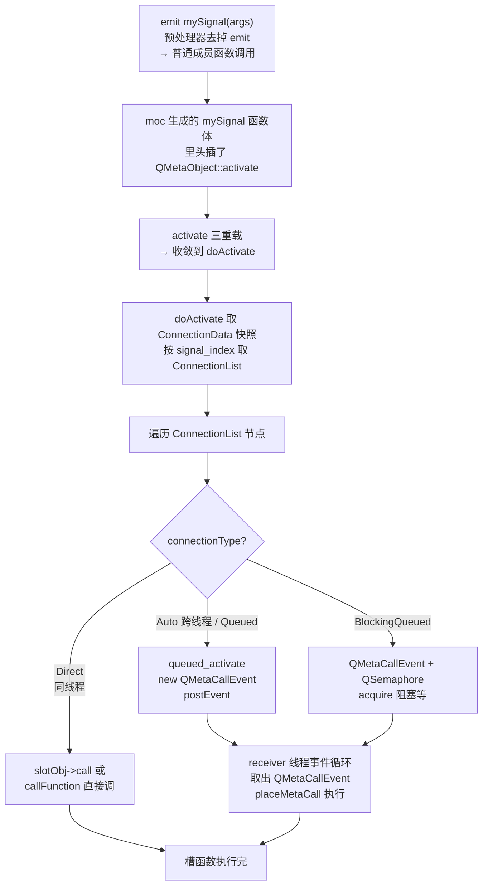
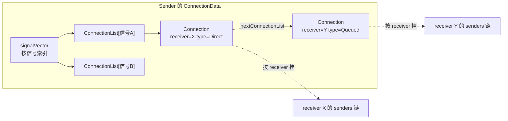

# 现代Qt开发教程（专家篇）1.02——信号槽底层（QMetaObject::activate 调用链）

## 1. 前言——为什么信号槽值得拆源码

咱们每个人都写过无数行 `connect(sender, &Sender::valueChanged, receiver, &Receiver::onValue)`，也写过无数个 `emit valueChanged(x)`。但如果咱们盯着 `emit` 这个关键字追问下去——它到底做了什么？为什么同样一行 `connect`，跨线程时槽函数会自动跑到接收线程执行？为什么 `Qt::BlockingQueuedConnection` 在同线程会死锁？为什么在槽函数里再 `connect` 一个新连接，这个新连接在当前这轮信号发射里不会被触发？

这些问题，靠「信号槽是观察者模式」这种概括是答不了的。笔者第一次被这几个问题堵住的时候，干脆把 `emit` 之后的整条调用链从源码里挖了出来——挖通了才发现，里面没有什么黑魔法，全是肉眼可见的代码。入门篇 [2 信号槽](../../beginner/01-qtbase/02-signal-slot-beginner.md) 教过咱们怎么用 `connect` 的五种重载、怎么选 `Qt::ConnectionType`、怎么用 lambda——那是知其然。进阶篇的信号槽深讲过连接类型的选择与坑（如果你读过那篇）。本篇要做的是知其所以然：从 `emit` 关键字开始，一路追到槽函数真正被执行的那一刻，看清楚中间每一跳在源码里是怎么发生的。

这一篇直接承接 [QObject 元对象系统源码拆解](./01-qobject-meta-system-expert.md)——那一篇讲的是元调用的通用框架 `metacall`（按索引调方法、读写属性），而本篇讲的是信号发射的专用链路 `activate`。两条链路的关系咱们会在 §3.1 讲清楚：`emit` 触发的是 `activate`，不是 `metacall`；但 `activate` 在分发到具体槽时，有一类槽会反过来走 `metacall`。理清这个关系，是读懂本篇的钥匙。

事情到这里还要交代边界。本篇聚焦「信号发射 → 连接表遍历 → 四类分流 → 槽执行 → 析构清理」这条主链；moc 编译器是怎么扫描出信号列表、怎么生成 `staticMetaObject` 的，那是 [17 篇 MOC 编译器原理](./17-moc-compiler-expert.md)的内容，咱们这里只把 moc 生成出来的「信号函数体里插了什么」拿来用。

## 2. 环境说明

本篇所有源码引用基于 `qt_src/qt6.9.1`，行号可能随 Qt 版本升级而漂移，对照阅读时用函数名定位即可。涉及 `moc/generator.cpp` 的行号挂了脚注 `[^moc-gen]`——那是 moc 工具的生成器模板，漂移最快。

本篇涉及的源码文件（按出现顺序）：

| 文件 | 角色 |
|---|---|
| `qt_src/qt6.9.1/qtbase/src/corelib/kernel/qtmetamacros.h` | emit 空宏定义 |
| `qt_src/qt6.9.1/qtbase/src/tools/moc/generator.cpp` | moc 在信号函数体里插 activate（生成器模板） |
| `qt_src/qt6.9.1/qtbase/src/corelib/kernel/qobject.cpp` | activate / doActivate / queued_activate / connectImpl / addConnection / ~QObject 清理 |
| `qt_src/qt6.9.1/qtbase/src/corelib/kernel/qobject_p_p.h` | Connection / ConnectionList / ConnectionData / SignalVector 完整定义 |
| `qt_src/qt6.9.1/qtbase/src/corelib/kernel/qobject_p.h` | QMetaCallEvent 跨线程调用载体 |

本篇无配套 example，原因：纯源码拆解，对照 `qt_src` 翻源码就是最好的实验。

## 3. 核心概念讲解

老规矩，扎进源码前先对路线图。信号槽的调用链是一条单向主干，从 `emit` 一直到槽函数执行，中间经过连接表遍历和类型分流：



这条链上有几个关键节点，咱们一个个拆。先从链的源头 `emit` 说起——它可能是 Qt 里最大的一个「魔术揭秘」。

### 3.1 emit 的真相——空宏，活儿都是 moc 干的

笔者刚学 Qt 那会儿也以为 `emit` 是个关键字，总盯着它想「到底触发了什么特殊机制」。直到翻了它的定义，愣住了：

`qt_src/qt6.9.1/qtbase/src/corelib/kernel/qtmetamacros.h:49-52`

```cpp
# define Q_EMIT
#ifndef QT_NO_EMIT
# define emit
#endif
```

`emit` 被定义成空。这意味着 `emit mySignal(x)` 经过预处理后，就是赤裸裸的 `mySignal(x)`——一次普通的成员函数调用。`emit` 纯粹是写给人看的语法糖，让代码读者一眼看出「这是一次信号发射」。编译器和运行期根本不认识 `emit`。

那信号发射的「真身」在哪？既然 `mySignal()` 是普通函数调用，它的函数体总得有内容。这个函数体不是咱们写的——咱们只写了 `void mySignal(int x);` 这一行声明在 `signals:` 段下。函数体是 moc 生成的。咱们看 moc 生成器怎么对待无参信号：

`qt_src/qt6.9.1/qtbase/src/tools/moc/generator.cpp:1308-1311`[^moc-gen]

```cpp
if (def->arguments.isEmpty() && def->normalizedType == "void" && !def->isPrivateSignal) {
    fprintf(out, ")%s\n{\n"
            "    QMetaObject::activate(%s, &staticMetaObject, %d, nullptr);\n"
            "}\n", constQualifier, thisPtr.constData(), index);
```

这段是 moc 生成器的逻辑——它对每个无参信号，用 `fprintf` 打印出一个函数体，函数体里就一行：`QMetaObject::activate(this, &staticMetaObject, index, nullptr);`。所以当咱们写 `emit mySignal()`，实际执行的是 moc 生成的 `mySignal()` 函数体，里面调了 `QMetaObject::activate`。信号发射的本质，就是调 `activate`。有参信号的函数体稍微复杂点（要准备 `argv` 参数数组），但核心还是调 `activate`。

这里要和上一篇的 `metacall` 做个区分——笔者觉得这是整篇最容易混的地方，卡在这儿的话后面都读不顺。`metacall` 是「按索引调一个方法」的通用框架——`QMetaObject::invokeMethod` 反射调用、属性读写、`qobject_cast` 都走它。而 `activate` 是「信号发射专用」的链路，它的工作是「把这个信号通知给所有连接到它的槽」。两条链路在后面会汇合：当 `activate` 遍历到一个用元方法方式连接的槽时，那个槽的执行会走 `metacall` 的 `InvokeMetaMethod` 分支。但链路的源头是分开的——`emit` 触发 `activate`，不是 `metacall`。

### 3.2 activate 三重载——全部收敛到 doActivate

知道了 `emit` 调 `activate`，咱们看 `activate` 本身。`QMetaObject::activate` 有三个公开重载（接收不同的参数组合），但它们最终都收敛到同一个内部模板函数 `doActivate`。咱们先看最常用的那个重载：

`qt_src/qt6.9.1/qtbase/src/corelib/kernel/qobject.cpp:4198-4207`

```cpp
void QMetaObject::activate(QObject *sender, const QMetaObject *m, int local_signal_index,
                           void **argv)
{
    int signal_index = local_signal_index + QMetaObjectPrivate::signalOffset(m);

    if (Q_UNLIKELY(qt_signal_spy_callback_set.loadRelaxed()))
        doActivate<true>(sender, signal_index, argv);
    else
        doActivate<false>(sender, signal_index, argv);
}
```

这个函数做了两件事。第一，把传进来的「局部信号索引」`local_signal_index` 加上 `signalOffset(m)`，转成「全局信号索引」`signal_index`。为什么要转？因为一个类的信号索引是从 0 开始数的（本类自己声明的信号），但要在一个对象的整张连接表里定位，必须用全局索引（包含从基类继承来的信号偏移）。`signalOffset` 就是这个继承偏移。

第二，把活儿整个委托给 `doActivate`。`doActivate` 是个模板函数，模板参数是 `bool`——它有两个版本，差别在于要不要回调 `signal_spy`（Qt 内部的信号监听钩子，用于调试工具如 GammaRay）。正常情况走 `doActivate<false>`，开了 spy 才走 `doActivate<true>`。三个公开重载（4198 / 4212 / 4226）无一例外都收敛到 `doActivate`，所以 `doActivate` 才是信号发射的真正核心。

### 3.3 连接表——信号到槽的映射存哪

`doActivate` 要把信号通知给所有连接的槽，首先得知道「这个信号都连了哪些槽」。这个信息存在每个 QObject 对象自己的连接表里。咱们先把连接表的数据结构理清楚——笔者第一次读这段的时候绕了好一会儿，这确实是本篇最绕的部分，但它是后面一切的基础，咬牙啃下来后面就顺了。

`doActivate` 一进来就取连接表快照：

`qt_src/qt6.9.1/qtbase/src/corelib/kernel/qobject.cpp:4061-4068`

```cpp
QObjectPrivate::ConnectionDataPointer connections(sp->connections.loadAcquire());
QObjectPrivate::SignalVector *signalVector = connections->signalVector.loadRelaxed();

const QObjectPrivate::ConnectionList *list;
if (signal_index < signalVector->count())
    list = &signalVector->at(signal_index);
else
    list = &signalVector->at(-1);
```

这段代码层层剥洋葱。最外层是 `sp->connections`——每个 QObject 的私有数据里持有一个指向 `ConnectionData` 的指针。`loadAcquire()` 是原子读，保证后续对连接表的读操作能看到所有在此之前发生的连接写入。拿到 `ConnectionData` 后，从里面取 `signalVector`（一个按信号索引组织的向量），再用全局 `signal_index` 当下标，取出对应的 `ConnectionList`——这就是「连接到这个信号的所有槽」组成的链表。

这些数据结构都定义在 Qt 的内内部头 `qobject_p_p.h`（注意是两个 `_p`，比 `qobject_p.h` 更内层的私有头）。咱们先看 `ConnectionList`：

`qt_src/qt6.9.1/qtbase/src/corelib/kernel/qobject_p_p.h:29-33`

```cpp
// ConnectionList is a singly-linked list
struct QObjectPrivate::ConnectionList
{
    QAtomicPointer<Connection> first;
    QAtomicPointer<Connection> last;
};
```

`ConnectionList` 是个带 `first`/`last` 的单链表容器，每个元素是一个 `Connection` 节点。一个信号对应一个 `ConnectionList`，里面串着所有连到这个信号的槽连接。

再看 `Connection` 节点本身，这是连接表的核心单元：

`qt_src/qt6.9.1/qtbase/src/corelib/kernel/qobject_p_p.h:69-95`

```cpp
struct QObjectPrivate::Connection : public ConnectionOrSignalVector
{
    Connection **prev;
    QAtomicPointer<Connection> nextConnectionList;
    Connection *prevConnectionList;

    QObject *sender;
    QAtomicPointer<QObject> receiver;
    // ...
    ushort connectionType : 2; // 0 == auto, 1 == direct, 2 == queued, 3 == blocking
```

`Connection` 节点最巧妙的设计是它同时挂在两条链上。第一条是「按信号组织的链」——通过 `nextConnectionList` / `prevConnectionList`，把连到同一个信号的所有 `Connection` 串起来（这就是上面 `ConnectionList` 里的链）。第二条是「按接收者组织的链」——通过 `prev` / `next`（`next` 在基类 `ConnectionOrSignalVector` 里），把同一个 receiver 接收的所有连接串起来（挂在 receiver 的 `senders` 链表上）。这种双链设计是为了让「断开某个信号的所有连接」和「断开某个对象接收的所有连接」都能高效完成——析构时两类清理就靠它（§3.7）。

末尾的 `connectionType : 2` 是个 2-bit 位域，存四种连接类型：0=Auto、1=Direct、2=Queued、3=Blocking。一个连接的类型在 `connect` 时就定死了，发射期靠这个字段决定怎么分流（§3.5）。

最外层的 `ConnectionData` 则持有整张连接表的入口：

`qt_src/qt6.9.1/qtbase/src/corelib/kernel/qobject_p_p.h:136-145`

```cpp
struct QObjectPrivate::ConnectionData
{
    // the id below is used to avoid activating new connections. When the object gets
    // deleted it's set to 0, so that signal emission stops
    QAtomicInteger<uint> currentConnectionId;
    QAtomicInt ref;
    QAtomicPointer<SignalVector> signalVector;
    Connection *senders = nullptr;
    Sender *currentSender = nullptr;
    std::atomic<TaggedSignalVector> orphaned = {};
```

`ConnectionData` 持有 `currentConnectionId`（递增的连接 id，重入保护要用到，§3.8）、`ref`（引用计数，让正在发射信号时连接表不被析构）、`signalVector`（按信号索引的连接向量）、`senders`（本对象作为接收者的所有连接链）。注意注释里那句「When the object gets deleted it's set to 0, so that signal emission stops」——`currentConnectionId` 在析构时被置 0，这是重入保护的第二道防线，咱们 §3.8 会回来讲。

把这套数据结构画出来，连接表的全貌是这样：



### 3.4 连接的建立——connect 到底存了什么

理解了连接表的结构，咱们看一次 `connect` 调用往里存了什么。`QObject::connect` 的各种重载最终都走到内部的 `connectImpl`：

`qt_src/qt6.9.1/qtbase/src/corelib/kernel/qobject.cpp:5318-5334`

```cpp
std::unique_ptr<QObjectPrivate::Connection> c{new QObjectPrivate::Connection};
c->sender = s;
c->signal_index = signal_index;
// ...
c->connectionType = type;
c->isSlotObject = true;
c->slotObj = slotObj.release();
// ...
QObjectPrivate::get(s)->addConnection(signal_index, c.get());
```

`connectImpl` new 出一个 `Connection` 节点，填好各个字段：`sender`（发送者）、`signal_index`（信号全局索引）、`connectionType`（连接类型）、`isSlotObject` + `slotObj`（函数对象式连接，比如 lambda 或 `std::bind` 的结果，包装成一个 `SlotObj`）。填完字段，调 `addConnection` 把节点插进连接表。

`addConnection` 的插入逻辑有两个方向：

`qt_src/qt6.9.1/qtbase/src/corelib/kernel/qobject.cpp:282-300`

```cpp
ConnectionList &connectionList = cd->connectionsForSignal(signal);
if (connectionList.last.loadRelaxed()) {
    // ...
    connectionList.last.loadRelaxed()->nextConnectionList.storeRelaxed(c);
} else {
    connectionList.first.storeRelaxed(c);
}
c->id = ++cd->currentConnectionId;
// ...
c->prev = &(rd->connections.loadRelaxed()->senders);
c->next = *c->prev;
*c->prev = c;
```

前半段是「插信号链」——找到这个信号对应的 `ConnectionList`，把新节点尾插到链尾（更新 `last` 的 `nextConnectionList`）。插入时还给它分配一个递增的 id：`c->id = ++cd->currentConnectionId`，这个 id 是重入保护的关键（§3.8）。后半段是「插接收者链」——把新节点头插到 receiver 的 `senders` 链表头部。这一步实现了 §3.3 说的「双链」：新连接同时挂在 sender 的信号链和 receiver 的 senders 链上。

经过这两步，一次 `connect` 就在连接表里安家了。下次信号发射时，`doActivate` 就能顺着信号链找到它。

### 3.5 四类连接——发射期怎么分流

连接表建好了，现在回到 `doActivate` 的主循环。它遍历当前信号的 `ConnectionList`，对每个 `Connection` 节点，根据 `connectionType` 决定怎么调槽。笔者觉得这是信号槽最精彩的部分——四类连接类型，四种执行路径，读通了之后那些「自动切线程」「同线程死锁」的怪现象就全解释得通了。

Direct 连接（直接调用）走的是快路径：

`qt_src/qt6.9.1/qtbase/src/corelib/kernel/qobject.cpp:4141-4159`

```cpp
if (c->isSlotObject) {
    SlotObjectGuard obj{c->slotObj};
    {
        Q_TRACE_SCOPE(QMetaObject_activate_slot_functor, c->slotObj);
        obj->call(receiver, argv);
    }
} else if (c->callFunction && c->method_offset <= receiver->metaObject()->methodOffset()) {
    // ...
    callFunction(receiver, QMetaObject::InvokeMetaMethod, method_relative, argv);
```

Direct 分支里又分两种。如果是函数对象式连接（`isSlotObject`，比如 lambda），直接 `slotObj->call(receiver, argv)` 调用，根本不经过元对象系统——最快。如果是传统的元方法连接，调 `callFunction(receiver, QMetaObject::InvokeMetaMethod, ...)`——这里就和上一篇的 `metacall` 汇合了，槽方法通过 `InvokeMetaMethod` 这个 Call 类型被执行。两种方式都是同步、在发送线程里直接调用，参数 `argv` 在栈上，没有深拷贝。

Auto 跨线程 和 Queued 连接走另一条路：

`qt_src/qt6.9.1/qtbase/src/corelib/kernel/qobject.cpp:4102-4104`

```cpp
if ((c->connectionType == Qt::AutoConnection && !receiverInSameThread)
            || (c->connectionType == Qt::QueuedConnection)) {
    queued_activate(sender, signal_index, c, argv);
```

注意 Auto 类型的判定是发射期现判的：`c->connectionType == Qt::AutoConnection && !receiverInSameThread`。Auto 连接在 `connect` 时存的类型是 0（Auto），但它到底走 Direct 还是 Queued，取决于发射那一刻发送线程和接收线程是不是同一个。`receiverInSameThread` 是发射时查的——如果跨线程，Auto 就退化成 Queued。这就是为什么 Auto 连接能「自动」适应线程关系：同线程时同步直调，跨线程时异步投递。

`queued_activate` 干的事是构造一个事件并投递：

`qt_src/qt6.9.1/qtbase/src/corelib/kernel/qobject.cpp:3989-4020`

```cpp
QMetaCallEvent *ev = c->isSlotObject ?
        new QMetaCallEvent(c->slotObj, sender, signal, nargs) :
        new QMetaCallEvent(c->method_offset, c->method_relative, c->callFunction, sender, signal, nargs);
// ...
    for (int n = 1; n < nargs; ++n)
        args[n] = types[n].create(argv[n]);
// ...
QCoreApplication::postEvent(receiver, ev);
```

`queued_activate` new 一个 `QMetaCallEvent`（跨线程调用的载体，§3.6 详讲），然后有一个关键步骤：`for (int n = 1; n < nargs; ++n) args[n] = types[n].create(argv[n]);`——对每个参数做深拷贝。为什么必须深拷贝？因为参数要跨线程传递，原 `argv` 在发送线程的栈上，发送线程不会等接收线程执行完槽函数（Queued 是异步的），所以必须把参数复制一份存到事件里，让事件自己管理这份数据的生命周期。这也解释了一个笔者第一次踩就懵了的坑：跨线程 Queued 连接传自定义类型，必须用 `qRegisterMetaType` 注册，否则 `types[n].create` 不知道怎么拷贝（§4.2）。

最后 `QCoreApplication::postEvent(receiver, ev)` 把事件投递到 receiver 线程的事件队列，sender 这边就算发射完了，立即继续往下走，不等待。

BlockingQueued 连接最特殊，它会阻塞发送线程：

`qt_src/qt6.9.1/qtbase/src/corelib/kernel/qobject.cpp:4107-4131`

```cpp
} else if (c->connectionType == Qt::BlockingQueuedConnection) {
    if (receiverInSameThread) {
        qWarning("Qt: Dead lock detected while activating a BlockingQueuedConnection: "
                 "Sender is %s(%p), receiver is %s(%p)",
                 sender->metaObject()->className(), sender,
                 receiver->metaObject()->className(), receiver);
    // ...
    QSemaphore semaphore;
    {
        // ...
        QMetaCallEvent *ev = ... new QMetaCallEvent(c->slotObj, sender, signal_index, argv, &semaphore) ...;
        QCoreApplication::postEvent(receiver, ev);
    }
    semaphore.acquire();
    continue;
```

BlockingQueued 的逻辑是：构造一个带 `QSemaphore` 的 `QMetaCallEvent`，投递到 receiver 线程，然后 `semaphore.acquire()` 阻塞发送线程，直到 receiver 线程执行完槽函数后 `release` 信号量，sender 才继续。这就实现了「跨线程同步调用」。

但开头那个 `if (receiverInSameThread)` 是救命线——如果 sender 和 receiver 在同一线程，`postEvent` 把事件投到当前线程的事件队列，但当前线程正阻塞在 `acquire()` 上等这个事件被处理，事件永远不会被处理，`acquire` 永远不返回——死锁。Qt 在这里 `qWarning` 报警（注意这个 warning 带完整的 Sender/receiver 类名和指针参数，方便定位），但只是警告，不阻止——程序仍会死锁。所以 BlockingQueued 千万不能在同线程用（§4.1）。

### 3.6 QMetaCallEvent——跨线程调用的载体

Queued 和 BlockingQueued 都把槽调用打包成 `QMetaCallEvent` 投递。咱们看看这个事件类封装了什么：

`qt_src/qt6.9.1/qtbase/src/corelib/kernel/qobject_p.h:369-423`

```cpp
class Q_CORE_EXPORT QMetaCallEvent : public QAbstractMetaCallEvent
{
public:
    // blocking queued with semaphore - args always owned by caller
    QMetaCallEvent(ushort method_offset, ushort method_relative, ...) ...
    // ...
    inline int id() const { return d.method_offset_ + d.method_relative_; }
    inline const void * const* args() const { return d.args_; }
    // ...
    virtual void placeMetaCall(QObject *object) override;
```

`QMetaCallEvent` 封装了一次槽调用需要的全部信息：`method_offset_` + `method_relative_`（拼出槽方法的全局 id，`id()` 方法就是这两个相加）、`slotObj` 或 `callFunction`（槽怎么调）、`args_`（深拷贝后的参数数组）、可选的 `semaphore`（BlockingQueued 用）。它的核心方法是 `placeMetaCall`——当 receiver 线程的事件循环从队列取出这个事件并处理时，就会调 `placeMetaCall`，里面执行真正的槽调用。

整个跨线程流程串起来是这样：sender 线程 `emit` → `activate` → `doActivate` 发现是 Queued → `queued_activate` 构造 `QMetaCallEvent` + 深拷贝参数 → `postEvent` 投递 → sender 继续；receiver 线程事件循环稍后取出事件 → `placeMetaCall` → 执行槽。槽函数始终在 receiver 线程执行，这就是跨线程信号槽「自动切线程」的全部秘密——没有什么黑魔法，就是事件队列 + 事件封装。

### 3.7 析构清理——断开所有连接

一个 QObject 析构时，它涉及的连接必须全部清理掉，否则别的对象 `emit` 时会访问到已释放的 receiver，或者已释放的对象继续作为 sender 被查询。`~QObject` 里的清理分两类。

第一类是清理「自己作为 sender 发出的连接」：

`qt_src/qt6.9.1/qtbase/src/corelib/kernel/qobject.cpp:1060-1074`

```cpp
for (int signal = -1; signal < receiverCount; ++signal) {
            QObjectPrivate::ConnectionList &connectionList = cd->connectionsForSignal(signal);
            while (QObjectPrivate::Connection *c = connectionList.first.loadRelaxed()) {
                // ...
                cd->removeConnection(c);
```

这段遍历自己的整张连接表（`signal` 从 -1 到 `receiverCount`，-1 是一个特殊的「所有信号」桶），把每个 `ConnectionList` 里的节点逐个 `removeConnection` 摘掉。回想 §3.3 的双链设计——这里清理的是「按信号组织」的那条链。

第二类是清理「自己作为 receiver 接收的连接」：

`qt_src/qt6.9.1/qtbase/src/corelib/kernel/qobject.cpp:1079-1105`

```cpp
/* Disconnect all senders:
     */
        while (QObjectPrivate::Connection *node = cd->senders) {
            // ...
            QObject *sender = node->sender;
            // ...
            QObjectPrivate::ConnectionData *senderData = sender->d_func()->connections.loadRelaxed();
            // ...
            senderData->removeConnection(node);
```

这次遍历的是 `cd->senders`——本对象作为接收者挂着的所有连接（双链的另一条）。对每个节点，靠 `node->sender` 反查到发送者对象，再走进发送者的连接表把它 `removeConnection` 掉。笔者觉得，§3.3 那套双链设计最值钱的地方就在这里——析构清理时靠 `sender` 指针定位对方，否则悬垂连接根本没法清干净。

两类清理合起来，保证了一个 QObject 析构后，没有任何悬垂的 `Connection` 节点指向它。这是信号槽不会轻易 use-after-free 的根本保障。

### 3.8 重入保护——发射期间新增的连接怎么办

最后讲一个精妙的细节：信号发射期间的重入保护。假设信号 `A()` 连着槽 `slot1`，`slot1` 里又写了一行 `connect(this, &T::A, this, &T::slot2)`。这行 `connect` 会在 `A` 的 `ConnectionList` 末尾追加一个新连接。问题是：当前 `doActivate` 正在遍历这个 `ConnectionList`，它会遍历到这个新追加的 `slot2` 连接吗？如果会，`slot2` 就会在这一轮发射里被触发——但用户的意图可能是「下次发射才触发」。

笔者读到这段的时候没料到，Qt 为了「本轮不触发」专门设了两道防线。第一道靠 `highestConnectionId` 快照：

`qt_src/qt6.9.1/qtbase/src/corelib/kernel/qobject.cpp:4073-4075`

```cpp
// We need to check against the highest connection id to ensure that signals added
// during the signal emission are not emitted in this emission.
uint highestConnectionId = connections->currentConnectionId.loadRelaxed();
```

`doActivate` 一进来就拍下当前 `currentConnectionId` 的快照存到 `highestConnectionId`。后面遍历连接链时，有一个 while 守门条件（在 4178 行，和上面的声明相隔约一百行）会检查 `c->id <= highestConnectionId`——只有 id 不超过快照的连接才触发。发射期间新 `connect` 的连接，其 `id` 是 `++currentConnectionId`，必然大于快照值，于是被跳过。本轮不发，留给下次。

第二道防线是析构时的哨兵。前面 §3.3 提到 `ConnectionData` 注释里那句「deleted 时置 0，信号发射停止」：

`qt_src/qt6.9.1/qtbase/src/corelib/kernel/qobject.cpp:1133`

```cpp
cd->currentConnectionId.storeRelaxed(0);
```

这是在 `~QObject` 里执行的。把 `currentConnectionId` 置 0 后，如果此刻正好有别的线程在发射指向这个对象的信号（遍历它的连接表），激活循环会检测到 `currentConnectionId` 变成 0，于是设置 `senderDeleted` 标志，跳过后续的 orphan 连接清理——避免在析构途中再去碰已经不完整的连接表。这两道防线一个防「发射期新增」，一个防「发射期析构」，合起来保证信号发射的重入安全。

最后补一个和生命周期相关的细节——`Connection` 节点靠引用计数管理：

`qt_src/qt6.9.1/qtbase/src/corelib/kernel/qobject_p_p.h:85-118`

```cpp
QAtomicInt ref_{
        2
    }; // ref_ is 2 for the use in the internal lists, and for the use in QMetaObject::Connection
    // ...
    void deref()
    {
        if (!ref_.deref()) {
            Q_ASSERT(!receiver.loadRelaxed());
            Q_ASSERT(!isSlotObject);
            delete this;
        }
    }
```

`Connection` 的 `ref_` 初值是 2——一份给内部连接表用，一份给 `QMetaObject::Connection` 句柄用（`connect` 的返回值）。`removeConnection` 只是把它从链表里摘下来（`ref_` 减 1），并不立即 `delete`；要等到外部持有的 `QMetaObject::Connection` 句柄也析构（再 `deref` 一次），`ref_` 归零，节点才真正 `delete`。这意味着你手里攥着一个 `QMetaObject::Connection` 句柄，并不代表连接还活着——连接可能早就被 `disconnect` 摘链了，只是节点内存因为你的句柄还持有所以没释放。这点在 §4.3 会专门讲。

## 4. 踩坑预防

第一个坑是 BlockingQueuedConnection 用在同线程导致死锁。这个坑咱们在 §3.5 看源码时就见识了——BlockingQueued 的实现是「投递事件 + 信号量阻塞等」，如果 sender 和 receiver 在同一线程，事件投到当前线程队列，但当前线程阻塞在 `acquire()` 上根本不会去处理事件队列，于是 `acquire` 永远等不到 `release`，死锁。Qt 在这里会 `qWarning("Dead lock detected...")` 报警，但只是报警，不阻止死锁发生——程序照样卡死。后果是界面冻结、线程挂死，而且因为只有一句 warning（很多人不开 warning 输出），定位起来非常痛苦。解法很简单：BlockingQueued 只能用在确定的跨线程场景，而且发送和接收线程的生命周期要可控；拿不准线程关系就用 AutoConnection（它会发射期现判），千万别图「我要同步拿结果」就无脑上 BlockingQueued——同线程的同步调用用 DirectConnection 或直接函数调用就行。

第二个坑是跨线程 Queued 连接传自定义类型没注册 `qRegisterMetaType`。§3.5 看了 `queued_activate` 的实现，它对每个参数调 `types[n].create(argv[n])` 深拷贝。这个 `create` 依赖 `QMetaType` 知道怎么构造和拷贝这个类型——内置类型和用了 `Q_DECLARE_METATYPE` 的类型没问题，但如果你传一个没注册的自定义结构体，`create` 拿不到元类型信息，运行期会报 `QMetaType::create: error copying type X, please register it using qRegisterMetaType`，槽函数根本收不到参数（连接静默失败）。后果是跨线程信号看上去连上了、`emit` 也执行了，但槽函数要么不触发、要么收到垃圾数据。这种 bug 在同线程测试时一切正常（Direct 路径不深拷贝），一上多线程就炸。解法：跨线程信号槽要传的每个自定义类型，都在初始化时 `qRegisterMetaType<MyStruct>()` 注册；大对象尽量传 `const MyStruct&`（引用在 Direct 路径零拷贝，Queued 路径仍会拷贝一次但至少类型已知），或传指针配合对象生命周期管理。

第三个坑是误以为手里攥着 `QMetaObject::Connection` 句柄连接就还在。§3.8 末尾看了 `Connection` 的引用计数机制——`ref_` 初值 2，一份给内部表、一份给句柄。当你调 `disconnect` 或者连接的某一方对象析构（触发 §3.7 的清理），`Connection` 节点会被 `removeConnection` 从链表摘下来（`ref_` 从 2 减到 1），但只要你的 `QMetaObject::Connection` 句柄还持有，节点内存就不会释放（`ref_` 还没归零）。这意味着：一个已经断开的连接，你手里的句柄仍然是个合法的对象，`connection` 变量的布尔值可能还是「真」，但信号再发射时这个连接早就不会触发了。后果是有人用 `if (connection) { ... }` 来判断「连接是否还有效」，结果误判——以为连着其实早断了。解法：别用 `QMetaObject::Connection` 的布尔值判断连接有效性；要管连接生命周期，用带 context 的 `connect`（`connect(sender, signal, context, receiver, slot)`，context 析构自动 disconnect），或者保存句柄后主动用 `disconnect(connection)` 管理。

## 5. 官方文档参考链接

[Qt 文档 · Signals & Slots](https://doc.qt.io/qt-6/signalsandslots.html) -- 信号槽机制的总览，含五种连接类型语义说明

[Qt 文档 · QObject](https://doc.qt.io/qt-6/qobject.html) -- QObject 类参考，`connect` / `disconnect` / `sender` 的官方文档

[Qt 文档 · Qt::ConnectionType](https://doc.qt.io/qt-6/qt.html#ConnectionType-enum) -- 四种连接类型的枚举定义与语义

---

到这里，信号槽的整条 `activate` 调用链咱们就从源码层面走通了。咱们从「`emit` 是个空宏」这个最反直觉的事实出发，看到了信号发射的真身是 moc 偷偷插进信号函数体的 `QMetaObject::activate`；顺着 `activate` → `doActivate` 进到连接表，搞懂了 `ConnectionData` / `ConnectionList` / `Connection` 这套双链数据结构；看清楚了 Direct / Auto / Queued / BlockingQueued 四类连接在发射期的分流逻辑——同步直调、跨线程事件投递、信号量阻塞；追到了跨线程调用的载体 `QMetaCallEvent`；最后拆了析构时的两类连接清理和两道重入保护防线。下一篇咱们会把镜头转到 MOC 编译器本身——它是怎么扫描咱们的头文件、生成 `staticMetaObject` 和那些 `qt_metacall` 函数体的。

本篇涉及的所有行号证据已按源码机制归类收在 [code-index · qtbase](../code-index/qtbase/) 下，带着行号直接去 `qt_src/qt6.9.1` 翻原文就能核对。

[^moc-gen]: 这类行号来自 `qt_src/qt6.9.1/qtbase/src/tools/moc/generator.cpp`，是 moc 生成器的源码模板行号，不是产物行号。`generator.cpp` 用 `fprintf` 打印出 `moc_*.cpp` 的内容，咱们引用它来还原 moc 生成出来的信号函数体。Qt 升级时这部分行号漂移最快，对照阅读请以函数名/逻辑定位为准。
