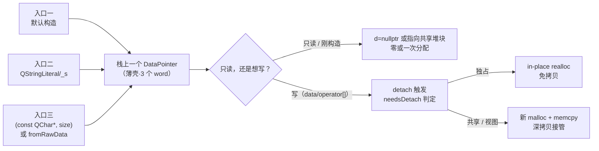

# 现代Qt开发教程（专家篇）1.03——QString 内存模型源码拆解

## 1. 前言——咱们天天用 QString，可它内存里长啥样

先抛三个问题，都是笔者当年写代码时脑子里冒出来、却答不上来的：

短字符串，比如 `"ok"`、`"cancel"` 这种，QString 会不会像 `std::string` 那样在栈上就地存一份（也就是常说的 SSO，短串优化），根本不分配堆内存？拷贝一个 1MB 的大字符串，会不会真的把那 1MB 复制一遍？天天喊着「用 `QStringLiteral` 省」的，它到底省在哪，凭什么叫它零分配？

这三个问题，恰好压在 QString 内存模型的三条主轴上——短串怎么放、拷贝怎么算、字面量怎么来。入门篇的 [3.字符串与编码](../../beginner/01-qtbase/03-string-encoding-beginner.md) 带咱们走过了「QString 怎么用、编码怎么回事」，进阶篇的 [3.QString 进阶](../../advanced/01-qtbase/03-qstring-advanced.md) 讲了更高阶的用法。本篇要往深处捅：把 QString 在内存里的样子，连同一行行源码，拆给咱们看。

还有两位同门兄弟已经在前面探过路了。[19.COW 隐式共享](./19-cow-implicit-sharing-expert.md) 把 Qt 容器那套 COW 通用机制（`QArrayData` 头部、`QArrayDataPointer` 智能指针、原子引用计数）从源码拆了一遍，[04.COW 容器实战](./04-cow-container-practice-expert.md) 拿 `QList`、`QByteArray` 把它练到了手上。本篇就站在它俩的肩膀上，只盯 QString 自己的内存特性——尤其是「到底有没有 SSO」「空串怎么做到零分配」「字面量凭什么不分配堆」这几个 QString 独有的问题。通用的 COW 招式笔者点到为止，不重复练。

边界也先划清楚，免得走着走着散了。本篇只讲内存模型，不讲编码转换——`QString` 和 `QByteArray` 之间那套 `QStringConverter`、`QTextCodec` 的编解码链路，是另一个主题，咱们这篇不碰。

## 2. 环境说明

本篇所有源码引用基于 `qt_src/qt6.9.1`，行号会随 Qt 版本升级而漂移。咱们对照阅读时要是发现行号对不上，拿函数名或字段名去对应文件里搜一下就能定位。本篇涉及的关键源码文件，按出场顺序列在下面：

| 文件 | 角色 |
|---|---|
| `qtbase/src/corelib/text/qstring.h` | QString 类声明、构造/detach/reserve/squeeze 内联实现 |
| `qtbase/src/corelib/text/qstring.cpp` | QString 大部分非内联实现（构造、reallocData、fromRawData、_empty 定义） |
| `qtbase/src/corelib/text/qstringliteral.h` | QStringLiteral 宏、QStringPrivate typedef、qMakeStringPrivate |
| `qtbase/src/corelib/text/qstringview.h` | QStringView 只读视图 |
| `qtbase/src/corelib/tools/qarraydata.h` / `.cpp` | 共享数据头部 QArrayData、分配与增长策略 |
| `qtbase/src/corelib/tools/qarraydatapointer.h` | COW 智能指针 QArrayDataPointer（三成员、needsDetach 短路） |
| `qtbase/src/corelib/tools/qrefcount.h` / `thread/qbasicatomic.h` | 原子引用计数 |

本篇无配套 example，原因和 [01.qobject 篇](./01-qobject-meta-system-expert.md) 一样：纯源码拆解，没有合理的可跑 demo——咱们不会为了看 QString 的内存布局去单独搭一个工程，对照 `qt_src` 翻源码就是最好的实验。

## 3. 核心概念讲解

下源码之前，咱们先把全貌对一下。QString 的内存模型，说穿了是「一份栈上的薄壳 + 一份可选的堆上数据 + 几条不同的入口」。容易绕晕，往往是因为把「构造、拷贝、字面量」这几条入口搅在一起了。咱们先看路线图：



三条入口（默认构造、字面量、带数据的构造）都汇聚到栈上那个叫 `DataPointer` 的薄壳；之后的一切——要不要分配、要不要复制——全看咱们「读还是写」。咱们这一篇就顺着这张图走一遍。但走之前，得先把最底下那块地基刨开：QString 到底有没有 SSO。

### 3.1 先把地基刨开——QString 没有 SSO

SSO（Small String Optimization，短串优化）是 `std::string` 那套把短字符串直接存在对象内部、不分配堆的招式。很多朋友下意识觉得 QString 也该有——毕竟 `"ok"` 这种短串，每个都 malloc 一下太亏了。笔者翻开源码的第一个任务，就是把这个念头钉死。

咱们直接看 QString 类的私有成员声明：

`qt_src/qt6.9.1/qtbase/src/corelib/text/qstring.h:1099-1100`

```cpp
    DataPointer d;
    static const char16_t _empty;
```

就这两行。一个 `DataPointer d`，外加一个静态的 `char16_t _empty`。`DataPointer` 是什么？追一层 typedef：

`qt_src/qt6.9.1/qtbase/src/corelib/text/qstringliteral.h:24`

```cpp
using QStringPrivate = QArrayDataPointer<char16_t>;
```

`DataPointer` 的真身是 `QStringPrivate`，而它就是 `QArrayDataPointer<char16_t>`。再追一层，看这个模板里到底装了什么字段：

`qt_src/qt6.9.1/qtbase/src/corelib/tools/qarraydatapointer.h:516-518`

```cpp
    Data *d;
    T *ptr;
    qsizetype size;
```

三个字段：一个指向数据头部的指针 `d`、一个指向实际字符的指针 `ptr`、一个长度 `size`。注意——没有任何内联的 `char16_t` 数组，零个字符存在对象内部。模板 `T = char16_t` 实例化之后，一个 `QString` 实例在栈上就是这三个 `machine word`（64 位下 24 字节），跟字符串有多长没有半点关系。

这下结论就钉死了：Qt 6.9.1 的 QString 不走 SSO。短串也好、长串也好，字符要么在堆上，要么指向字面量（静态存储期）、要么指向那个静态的 `_empty`，从不内联在对象里。这和 `std::string` 的 SSO 是两条完全不同的路。那短串的「省」从哪来？答案在两处：一是空串/默认构造的零分配（3.3 节），二是字面量的编译期视图（3.7 节）。咱们往下看。

### 3.2 一个 QString 在内存里到底长什么样

地基刨开了，咱们把 QString 的内存全貌画清楚。它分两块：栈上一个薄壳（`DataPointer`，刚看过，三字段），和——当真的持有数据时——堆上一块连续分配。堆这块的结构，大头是一个叫 `QArrayData` 的「头部」，紧跟在头部后面的就是字符数据。头部里装的是共享元信息：

`qt_src/qt6.9.1/qtbase/src/corelib/tools/qarraydata.h:42-44`

```cpp
    QBasicAtomicInt ref_;
    ArrayOptions flags;
    qsizetype alloc;
```

三个核心字段。`ref_` 是原子引用计数（下面 3.5 节 detach 就靠它判断「是不是我在独占」），`flags` 装着 `CapacityReserved` 之类的标志（3.6 节 reserve/squeeze 会用到），`alloc` 是已分配容量。这里有个 Qt 6 相对 Qt 5 的精简：Qt 5 的头部还带 `size` 和 `offset` 字段，Qt 6 把 `size` 下沉到了 `QArrayDataPointer`（就是上面那三字段里的 `size`），`offset` 也移除了——头部更瘦。

引用计数的增减，由头部的一对内联函数包办：

`qt_src/qt6.9.1/qtbase/src/corelib/tools/qarraydata.h:57-67`

```cpp
    bool ref() noexcept
    {
        ref_.ref();
        return true;
    }

    /// Returns false if deallocation is necessary
    bool deref() noexcept
    {
        return ref_.deref();
    }
```

`ref` 永远返回 `true`（语义上就是「共享成功」），`deref` 返回 `false` 时才表示「计数归零，该释放了」——调用方（`QArrayDataPointer` 析构）就据此决定要不要 free。底层那对 `ref_.ref()` / `ref_.deref()` 是真原子操作：

`qt_src/qt6.9.1/qtbase/src/corelib/thread/qbasicatomic.h:47-48`

```cpp
    bool ref() noexcept { return Ops::ref(_q_value); }
    bool deref() noexcept { return Ops::deref(_q_value); }
```

`Ops` 是平台特化——x86 上是带 `lock` 前缀的 inc/dec，ARM 上是 ldrex/strex 那一对。正因为这俩是真原子指令，多线程下两个 QString 同时增减引用计数才不会撞车。这是整个 COW 机制能用在多线程里的地基，详细的原子语义咱们在 [19.COW 篇](./19-cow-implicit-sharing-expert.md) 和 code-index 的原子引用计数里讲过，这里不展开。

这里笔者要专门点出一个容易踩混的地方。Qt 还有另一套引用计数封装叫 `RefCount`（在 `qrefcount.h`），它有一套「`ref == -1` 表示静态对象、增减都跳过」的语义：

`qt_src/qt6.9.1/qtbase/src/corelib/tools/qrefcount.h:18-30`

```cpp
    inline bool ref() noexcept {
        int count = atomic.loadRelaxed();
        if (count != -1) // !isStatic
            atomic.ref();
        return true;
    }
```

读到这段，您可能会想：那 QString 的静态空对象，是不是也靠这个 `-1` 机制？不是。`QArrayData` 头部直接用的是 `QBasicAtomicInt`，不经过 `RefCount` 这层包装，所以它没有 `-1` 的静态短路。QString 的「静态空」走的是另一条更朴素的路——咱们下一节就看。

### 3.3 空串那点事——`_empty` 上位，sharedNull 退场

写 C++ 的人都有个习惯：`QString s;` 默认构造一个空串，理所当然觉得它「什么都不分配」。这个直觉对，但背后的机制，Qt 5 和 Qt 6 完全不是一回事。笔者先给出 Qt 6.9.1 的真相：

`qt_src/qt6.9.1/qtbase/src/corelib/text/qstring.cpp:76`

```cpp
const char16_t QString::_empty = 0;
```

就这一行。`_empty` 是一个静态的 `char16_t`，值是 0（就是 null 终止符本尊）。没有头部、没有引用计数，朴素到一个标量。空 QString 的 `d` 字段是 `nullptr`（没有头部），`ptr` 借指向这个 `_empty`。咱们看默认构造函数体：

`qt_src/qt6.9.1/qtbase/src/corelib/text/qstring.h:1410`

```cpp
constexpr QString::QString() noexcept {}
```

空函数体，而且是 `constexpr`。它什么都不做，完全依赖 `DataPointer`（也就是 `QArrayDataPointer`）的默认构造把 `d`、`ptr`、`size` 全部置成 `nullptr` / `0`。连 `_empty` 都没指——要等到第一次有人调 `data()` / `unicode()` 想读字符时，才回退去借 `_empty` 的地址。

这里有个关键的版本差异，笔者专门拎出来讲，因为照着 Qt 5 教程写很容易出错。Qt 5 的 QString 空串共享对象是 `QArrayData::sharedNull()`——那是一个货真价实的 `QArrayData` 静态头部，引用计数初始化成 `-1`，靠 `RefCount` 的静态短路语义永不释放。Qt 6.9.1 把这整套删了：没有 `sharedNull()`，没有 `-1` 头部，只有一个 `static char16_t _empty`，空串的 `d` 直接是 `nullptr`。所以您在 Qt 6 里 grep `sharedNull`，全 corelib 只剩 `qstring.cpp:2856` 一处历史注释，函数本身早就不存在了。

注意区分两件事：默认构造的「零分配」，靠的是 `DataPointer` 默认值全空（`nullptr/nullptr/0`）；而一旦真要读空串的字符，才回退借 `_empty`。这俩合起来，才是 Qt 6 空串的完整画像——它是「空视图」，不是 SSO。

### 3.4 构造一次都干了啥

默认构造看完了，咱们看带数据的构造。最典型的是 `QString(const QChar *unicode, qsizetype size)`：

`qt_src/qt6.9.1/qtbase/src/corelib/text/qstring.cpp:2491-2504`

```cpp
QString::QString(const QChar *unicode, qsizetype size)
{
    if (!unicode) {
        d.clear();
    } else {
        if (size < 0)
            size = QtPrivate::qustrlen(reinterpret_cast<const char16_t *>(unicode));
        if (!size) {
            d = DataPointer::fromRawData(&_empty, 0);
        } else {
            d = DataPointer(size, size);
            Q_CHECK_PTR(d.data());
            memcpy(d.data(), unicode, size * sizeof(QChar));
            d.data()[size] = '\0';
        }
    }
}
```

三条路径，分得很清爽。传进来的指针是空（`!unicode`）——`d.clear()` 直接置空视图；指针非空但长度为 0——走 `fromRawData(&_empty, 0)`，借那个静态空对象；指针非空且长度大于 0——才是真正干活的那条：`DataPointer(size, size)` 在堆上分配一块（容量和长度都设成 `size`），`memcpy` 把字符拷进去，最后手动写一个 null 终止符 `d.data()[size] = '\0'`。

这里有个细节值得停一下：null 终止符是构造函数自己手写的，不在 `allocate` 里自动加。为什么？因为 QString 要保证 `data()` 返回的指针能直接喂给那些期待 C 风格 null 结尾字符串的 API（比如 `wcslen`、某些系统调用），这个 null 终止符是和 C 世界对接的契约，Qt 选择由每次写数据的调用方负责补上。

拷贝构造就简单多了，它是浅拷贝：

`qt_src/qt6.9.1/qtbase/src/corelib/text/qstring.h:1340-1341`

```cpp
QString::QString(const QString &other) noexcept : d(other.d)
{ }
```

直接把 `DataPointer` 三字段复制过来，函数体是空的——连 `ref()` 都不在这一层调。引用计数的 `+1` 下沉到了 `QArrayDataPointer` 自己的拷贝构造里（那里会调 `ref()`）。这就是「拷贝一个 1MB 的 QString 不会复制 1MB」的答案：拷贝只是三个 `machine word` 的复制，真正的数据共享，直到有人写它那一刻才分开。

### 3.5 写下去那一刻才复制——detach 与 reallocData 三条路

「写时才复制」（Copy-On-Write）这个词，咱们在 [19.COW 篇](./19-cow-implicit-sharing-expert.md) 里已经讲过原理。本篇聚焦 QString 的具体实现：谁触发了那次深拷贝，深拷贝又走哪几条路。

触发点是一切「可能改数据」的非 const 接口。咱们看最典型的几个：

`qt_src/qt6.9.1/qtbase/src/corelib/text/qstring.h:1326-1330`

```cpp
QChar *QString::data()
{
    detach();
    Q_ASSERT(d.data());
    return reinterpret_cast<QChar *>(d.data());
}
```

`data()` 的非 const 版本，第一行就是 `detach()`。`begin()`、`end()` 这俩非 const 迭代器也一样，进去第一行都是 `detach()`；`operator[]` 的非 const 版本则通过调 `data()` 间接把 detach 带出来。整个 `QString` 里，凡是要把写权限交出去的接口，进门第一件事全是 `detach()`。这是 COW 的入口规矩。

`detach()` 自己长这样：

`qt_src/qt6.9.1/qtbase/src/corelib/text/qstring.h:1334-1335`

```cpp
void QString::Detach()
{ if (d.needsDetach()) reallocData(d.size, QArrayData::KeepSize); }
```

（源码里是小写 `detach`，这里为可读性写成大写，行号挂的是真实位置。）核心就一句判断：`d.needsDetach()` 返回真，才调 `reallocData` 做深拷贝。`needsDetach` 判的是「引用计数大于 1（有人在共享）」或者「这是个不可变的视图」。如果是独占（`ref == 1` 且不是视图），`needsDetach` 返回假，`detach()` 啥也不干——这是独占场景下的零成本快路径。

真正干活的是 `reallocData`，它有三条路：

`qt_src/qt6.9.1/qtbase/src/corelib/text/qstring.cpp:2781-2802`

```cpp
void QString::reallocData(qsizetype alloc, QArrayData::AllocationOption option)
{
    if (!alloc) {
        d = DataPointer::fromRawData(&_empty, 0);
        return;
    }

    const bool cannotUseReallocate = d.freeSpaceAtBegin() > 0;

    if (d->needsDetach() || cannotUseReallocate) {
        DataPointer dd(alloc, qMin(alloc, d.size), option);
        Q_CHECK_PTR(dd.data());
        if (dd.size > 0)
            ::memcpy(dd.data(), d.data(), dd.size * sizeof(QChar));
        dd.data()[dd.size] = 0;
        d = dd;
    } else {
        d->reallocate(alloc, option);
    }
}
```

三条路，咱们顺着读。第一条：目标容量是 0——直接退回 `_empty` 空视图，啥也不分配（这和 3.3 节的空串画像呼应）。第二条：需要 detach（有别人在共享），或者 `freeSpaceAtBegin() > 0`（头部前面有空闲空间，就地 realloc 会让数据指针越出分配区，注释里把这条叫 `cannotUseReallocate`）——那就老老实实 `malloc` 一块新的，`memcpy` 把旧数据搬过去，再补一个 null 终止符，最后把新的 `DataPointer` 赋给 `d`。这是真正的深拷贝。第三条：既独占、又没有前置空闲空间——调 `d->reallocate(alloc, option)` 走 in-place 扩展。

第三条路值得多说一句，因为它是个隐藏的免拷贝快路径。`reallocate` 最终会落到 `QArrayData::reallocateUnaligned`：

`qt_src/qt6.9.1/qtbase/src/corelib/tools/qarraydata.cpp:225-252`

```cpp
    Q_ASSERT(!data || !data->isShared());
    ...
    QArrayData *header = static_cast<QArrayData *>(::realloc(data, size_t(allocSize)));
    if (header) {
        header->alloc = capacity;
        dataPointer = reinterpret_cast<char *>(header) + offset;
    }
```

开头的 `Q_ASSERT(!data || !data->isShared())` 是死规矩：只有独占（`ref == 1`）才许进这条路。进来之后直接调 C 的 `::realloc`——操作系统有可能就在原地把堆块伸长，一个字节都不用拷。这就是 Qt 容器在「自己独占、只是要扩容」场景下，避开 memcpy 的关键设计。

### 3.6 容量的伸缩——resize / reserve / squeeze 与翻倍增长

讲完 detach，容量管理就顺理成章了。`resize`、`reserve`、`squeeze` 三个接口，本质上都是在调 `reallocData`，区别只在传什么选项、设什么标志。

`resize` 是改长度：

`qt_src/qt6.9.1/qtbase/src/corelib/text/qstring.cpp:2664-2672`

```cpp
void QString::resize(qsizetype size)
{
    if (size < 0)
        size = 0;

    if (d->needsDetach() || needsReallocate(*this, size))
        reallocData(size, QArrayData::Grow);
    d.size = size;
    if (d->allocatedCapacity())
        d.data()[size] = u'\0';
}
```

需要 detach 或者需要扩容时，调 `reallocData` 并传 `Grow` 选项（这个选项会让分配多预留一些增长空间，下面马上讲）。随后置 `d.size`，再补 null 终止符。注意最后那行有个前提 `d->allocatedCapacity()`——空串视图（`alloc == 0`）不写终止符，因为 `_empty` 本身就是 0，不用画蛇添足。

`reserve` 是预留容量：

`qt_src/qt6.9.1/qtbase/src/corelib/text/qstring.h:1413-1419`

```cpp
void QString::reserve(qsizetype asize)
{
    if (d.needsDetach() || asize >= capacity() - d.freeSpaceAtBegin())
        reallocData(qMax(asize, size()), QArrayData::KeepSize);
    if (d.constAllocatedCapacity())
        d.setFlag(Data::CapacityReserved);
}
```

它和 `resize` 的关键区别，是传 `KeepSize` 而不是 `Grow`——意思是不主动多预留增长系数，扩张到咱们要的 `asize` 就收手。扩张完，置一个 `CapacityReserved` 标志。这个标志的作用是告诉后续的 detach：「这是用户明确预约过的容量，深拷贝时尽量给我保留住，别自作主张截短到 `size`」。

`squeeze` 是 `reserve` 的反操作，把容量收缩到刚好等于长度：

`qt_src/qt6.9.1/qtbase/src/corelib/text/qstring.h:1421-1429`

```cpp
void QString::squeeze()
{
    if (!d.isMutable())
        return;
    if (d.needsDetach() || size() < capacity())
        reallocData(d.size, QArrayData::KeepSize);
    if (d.constAllocatedCapacity())
        d.clearFlag(Data::CapacityReserved);
}
```

开头 `if (!d.isMutable()) return;` 是给视图准备的——`fromRawData` 来的对象 `isMutable()` 返回假，`squeeze` 直接啥也不做（视图本来就不持有容量，没什么可收缩的）。真要收缩时也是 `reallocData(d.size, KeepSize)`，把容量收到刚好等于长度，然后清掉 `CapacityReserved` 标志。

最后说增长策略。`Grow` 选项传进去之后，容量到底涨到多少？答案是翻倍——更准确地说，是上取整到最近的 2 的幂：

`qt_src/qt6.9.1/qtbase/src/corelib/tools/qarraydata.cpp:84-108`

```cpp
    qsizetype bytes = qCalculateBlockSize(elementCount, elementSize, headerSize);
    ...
    size_t morebytes = static_cast<size_t>(qNextPowerOfTwo(quint64(bytes)));
    if (Q_UNLIKELY(qsizetype(morebytes) < 0)) {
        bytes += (morebytes - bytes) / 2;
    } else {
        bytes = qsizetype(morebytes);
    }
```

`qNextPowerOfTwo` 把所需字节数上取整到 2 的幂——这就是咱们熟悉的「几何增长」，每次不够了就翻一倍，均摊下来每次 `append` 是 O(1)。那个 `Q_UNLIKELY` 分支是兜底：翻倍后要是超过了 `qsizetype` 能表示的上限（变成负数），就退化为「加一半」，避免在 32 位平台上傻乎乎去尝试分配刚好 2G。

这一节最后补一个藏在分配里的细节。咱们前面说 null 终止符是调用方手写的，那它占不占 capacity？答案是「不占」——但不是凭空送的，是 Qt 在算块大小时做了手脚：

`qt_src/qt6.9.1/qtbase/src/corelib/tools/qarraydata.cpp:118-126`

```cpp
    constexpr qsizetype FooterSize = qMax(sizeof(QString::value_type), sizeof(QByteArray::value_type));
    if (objectSize <= FooterSize)
        headerSize += FooterSize;
```

`FooterSize` 是 `qMax(sizeof(char16_t), sizeof(char))`，也就是 2。对 QString（`value_type` 是 `char16_t`，`objectSize == 2`），`objectSize <= FooterSize` 成立，于是这 2 字节的 null 终止符预算被并进了 `headerSize`，而不是算在元素区里。所以咱们调 `capacity()` 拿到的就是精确的字符容量，那个 `\0` 是 Qt 额外送的、不占名额。顺带，整块（头部 + 数据 + 终止符）是一次 `::malloc` 拿下来的连续分配，对 cache 友好。

### 3.7 字面量与 fromRawData——不分配头部的编译期视图

讲完堆分配的那套，咱们回头看路线图里第二条入口：字面量。这是 QString 内存模型里最容易让人误解的一块——因为网上大量教程是照着 Qt 5 写的，而 Qt 6 把它改了个干净。

先看 `QStringLiteral` 到底干了什么：

`qt_src/qt6.9.1/qtbase/src/corelib/text/qstringliteral.h:28-37`

```cpp
template <qsizetype N>
static Q_ALWAYS_INLINE QStringPrivate qMakeStringPrivate(const char16_t (&literal)[N])
{
    auto str = const_cast<char16_t *>(literal);
    return { nullptr, str, N - 1 };
}

#define QStringLiteral(str) \
    (QString(QtPrivate::qMakeStringPrivate(QT_UNICODE_LITERAL(str))))
```

看 `qMakeStringPrivate` 的返回：`{ nullptr, str, N - 1 }`。`d` 字段是 `nullptr`——没有头部、没有引用计数。`ptr` 直接指向那个编译期的 `char16_t` 字面量（它被编译器放在 `.rodata` 段，静态存储期，进程活着它就活着）。`N - 1` 是长度，减 1 是因为数组引用大小 `N` 包含末尾那个 null，得去掉。

这下「QStringLiteral 零分配」的真相就清楚了：它在运行期啥都不分配，连头部都不构造，就是把一个指针和长度打包成一个 `QString` 薄壳。读它，零成本；写它，才会触发 detach 走深拷贝（和 `fromRawData` 一个道理）。

这里笔者必须强调那个版本差异，因为它太容易把人带沟里。Qt 5 的 `QStringLiteral` 是另一套：它用 `Q_STATIC_ARRAY_DATA` 宏在编译期构造了一个货真价实的 `QArrayData` 静态头部，引用计数初始化成 `-1`，靠静态短路永不释放。所以您在 Qt 5 时代的教程里会看到「QStringLiteral 在编译期生成 QArrayData」这种说法——那在 Qt 5 是对的，在 Qt 6.9.1 是错的。Qt 6 把它改成了纯 `nullptr`-head 的编译期视图，干净利落，连那个 `-1` 头部都省了。

`operator""_s` 这个用户定义字面量（写成 `"hello"_s`）走的是完全一样的路：

`qt_src/qt6.9.1/qtbase/src/corelib/text/qstring.h:1731-1734`

```cpp
inline QString operator""_s(const char16_t *str, size_t size) noexcept
{
    return QString(QStringPrivate(nullptr, const_cast<char16_t *>(str), qsizetype(size)));
}
```

同样是 `QStringPrivate(nullptr, str, size)`。两条字面量转 `QString` 的路（宏、UDL），在 Qt 6 里是一回事——都是不分配头部的编译期视图。

`QString::fromRawData` 是这套思路的运行期版本，把一段外部的、不属于 Qt 管的字符缓冲区包成一个 `QString`：

`qt_src/qt6.9.1/qtbase/src/corelib/text/qstring.cpp:9381-9384`

```cpp
QString QString::fromRawData(const QChar *unicode, qsizetype size)
{
    return QString(DataPointer::fromRawData(const_cast<char16_t *>(reinterpret_cast<const char16_t *>(unicode)), size));
}
```

`DataPointer::fromRawData` 这个工厂咱们在 [04.COW 实战篇](./04-cow-container-practice-expert.md) 和 code-index 里见过，它返回 `{nullptr, rawData, length}`——`d` 是 `nullptr`，不持有、不拷贝。读它零成本，写它就深拷贝接管。

那「写它就深拷贝」这个判断，在 `d == nullptr` 的时候到底怎么短路？追到 `needsDetach` 的定义体就明白了：

`qt_src/qt6.9.1/qtbase/src/corelib/tools/qarraydatapointer.h:453-456`

```cpp
    bool isMutable() const noexcept
    { return d; }   // Returns false if this object is fromRawData()
    bool isShared() const noexcept
    { return !d || d->isShared(); }
    bool needsDetach() const noexcept
    { return !d || d->needsDetach(); }
```

看到 `needsDetach` 里那个 `!d ||` 没有？`d` 是 `nullptr` 时，`!d` 为真，整个表达式直接返回 `true`，根本不用去解引用 `d->needsDetach()`。这就是 fromRawData 视图「一写就深拷贝」的精确机制——它没头部可查引用计数，干脆一律判定需要 detach。配套的 `isMutable()`（返回 `d` 本身，`nullptr` 就是假）、`isShared()`（`!d` 为真就是「已共享」），都是同一套针对视图的短路。这条链补全了，fromRawData 的写时复制就闭环了。

### 3.8 QStringView——彻底不持有的只读视图

最后看 `QStringView`。它和 `QString` 的关系，差不多是 `std::string_view` 和 `std::string` 的关系——一个彻底不持有的只读视图：

`qt_src/qt6.9.1/qtbase/src/corelib/text/qstringview.h:432-439`

```cpp
private:
#if QT_VERSION >= QT_VERSION_CHECK(7, 0, 0) || defined(QT_BOOTSTRAPPED)
    const storage_type *m_data = nullptr;
    qsizetype m_size = 0;
#else
    qsizetype m_size = 0;
    const storage_type *m_data = nullptr;
#endif
```

就两个字段：一个 `const` 指针 `m_data`，一个长度 `m_size`。没有 `DataPointer`、没有 `d` 头部、没有任何引用计数。咱们在 6.9.1（非 bootstrap）走的是 `#else` 分支，`m_size` 在前、`m_data` 在后——那个 `#if` 是 Qt 7 准备调换字段顺序的兼容代码，本版本不用管。

两个字段意味着 `QStringView` 拿到一段 `QString` 的字符后，不增不减任何引用计数——`QString` 那边一旦先释放了，这个 view 就成了悬空指针。所以您用 `QStringView` 的时候，生命周期得自己心里有数，跟 `std::string_view` 一个规矩。它的价值也很直白：函数参数、临时只读引用，传它比传 `const QString&` 还省（连引用计数的原子操作都省了），比传 `QString` 值更省（不触发任何 COW）。

## 4. 踩坑预防

第一个坑，是顺着「QString 该有 SSO 吧」这个错觉栽下去的。3.1 节咱们钉死了 Qt 6.9.1 的 QString 没有 SSO，每个非空、非字面量的字符串构造都是真 `malloc`。有些朋友在性能热点上随手写 `QString s = func(); return s + "_id";` 这类，循环里成千上万次地构造短串，以为短串在栈上、零成本——结果每次都进堆分配器，profile 出来全是 `malloc`/`free`。根子就在 3.4 节那条 `DataPointer(size, size) + memcpy` 的路径上，短串一样走它。后果是热点函数被堆分配拖慢好几倍。解法是别在热点上无脑构造：只读就传 `QStringView`（3.8 节那两个字段的视图，连原子操作都省）；常量用 `QStringLiteral` 或 `u"..."_s`（3.7 节的编译期视图，零分配）；实在要反复拼接就先 `reserve()` 把容量一次性开够，避开翻倍增长里的多次 realloc。

第二个坑是 `fromRawData` 用爽了之后改数据。3.7 节讲过，`fromRawData` 是「读零成本、写深拷贝」。有些代码拿到一个 `fromRawData` 的 `QString`，图省事直接 `s[i] = 'x'` 改一个字符——以为改的是那块原始缓冲区，结果第一行非 const 访问就触发 `detach()`，`needsDetach` 的 `!d` 短路（3.7 节最后那段）立刻判定需要分离，走 `reallocData` 的深拷贝路（3.5 节第二条），新 `malloc` 一块、把原始数据整个 `memcpy` 过来，再改那一下。后果轻的是悄悄多了一次整块拷贝（您还以为只改了一个字节），重的——如果原始缓冲区是临时栈变量、`fromRawData` 之后栈帧已经退了——那就是拿野指针当宝贝，收获一个漂亮的 segfault。解法很明确：`fromRawData` 只用在「保证只读、且缓冲区生命周期长于这个 `QString`」的场景；要改数据，一开始就老老实实用普通构造（3.4 节那条 `memcpy` 路径），让 Qt 自己接管内存。

第三个坑在多线程传值上。3.2 节咱们看到，QString 的引用计数 `ref`/`deref` 是真原子操作（`lock` 前缀指令、ldrex/strex 那种），这是 COW 多线程安全的代价。有些朋友在多线程之间、或者高频调用的函数里，习惯性地按值传 `QString`（`void f(QString s)`），觉得「反正 COW，拷贝是 O(1)」——拷贝本身确实只复制三个 word，但每一次按值传参，都触发一次 `ref()`（进函数构造副本）和一次 `deref()`（出函数析构副本），这俩是原子指令，比一次普通整数加减贵得多。在一个被调几百万次的小函数上，这点原子开销能堆成可观的 CPU 时间。后果是原本该是零开销的传参变成了原子操作的放大器。解法：函数参数传 `const QString&`（引用，不增减计数），或者更好——只读场景传 `QStringView`（连引用计数都不碰，3.8 节）。把按值传 `QString` 留给「真的需要获得所有权」的场景。

## 5. 官方文档参考链接

[Qt 文档 · QString](https://doc.qt.io/qt-6/qstring.html) -- QString 类的官方参考，构造、容量、fromRawData 等接口的入口

[Qt 文档 · QStringView](https://doc.qt.io/qt-6/qstringview.html) -- 只读字符串视图的官方参考

[Qt 文档 · Implicit Sharing](https://doc.qt.io/qt-6/implicit-sharing.html) -- Qt 隐式共享（COW）机制的总览文档，涵盖 QString/QByteArray/QList 共享数据的语义

[Qt 文档 · QStringLiteral](https://doc.qt.io/qt-6/qstring.html#QStringLiteral) -- QStringLiteral 宏的官方说明，注意官方文档对 Qt6 nullptr-head 实现的描述与本篇源码拆解对照阅读

---

到这里，QString 的内存模型咱们就从源码层面拆透了。笔者拆完最深的感受，是 Qt 6 这套设计比看上去要「薄」、也比 Qt 5 要「干净」——一个 `QString` 实例就是栈上三个 `machine word` 的薄壳，真正的数据和共享元信息全在堆上那块连续分配里；空串连头都不要，借一个静态 `char16_t _empty` 就够了；连 `QStringLiteral` 这种「编译期常量」都被改造成了不构造头部的纯视图。咱们从「QString 没有 SSO」这个最反直觉的事实出发，一路看到了引用计数怎么靠原子操作保多线程安全、写时复制怎么靠 `needsDetach` 判断要不要深拷贝、`reallocData` 的三条路怎么在「共享深拷贝 / 独占 in-place realloc / 空串退回视图」之间分流、容量怎么按 2 的幂翻倍增长，以及字面量和 `fromRawData` 怎么用 `d == nullptr` 表达「我不持有」。这套模型不是孤岛——它和咱们前面拆过的 [19.COW 隐式共享](./19-cow-implicit-sharing-expert.md)、[04.COW 容器实战](./04-cow-container-practice-expert.md) 共用同一套 `QArrayData` / `QArrayDataPointer` 骨架，后面拆 `QByteArray`、`QList` 的内存模型时，咱们还会反复回到这一篇的结论。

如果您想把本篇涉及的所有行号证据拿来一一核对，它们已按源码机制归类收在 [code-index · QString 内存模型与编译期视图](../code-index/qtbase/qstring-memory-layout.md) 下（通用的 `QArrayDataPointer` 智能指针机制、`QArrayData` 头部与分配增长策略、原子引用计数另有专文收录），带着行号直接去 `qt_src/qt6.9.1` 翻原文就行。
