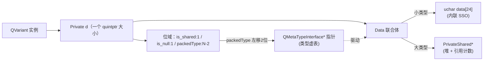

# 现代Qt开发教程（专家篇）1.05——QVariant 源码拆解

## 1. 前言——一个能装下任何东西的容器

`QVariant` 是 Qt 里一个挺神奇的东西——它能装 `int`、能装 `QString`、能装自定义结构体，甚至能装 `QObject*`。一个变量能换着类型装，这在强类型的 C++ 里是怎么做到的？很多人用了好几年 `QVariant`，也说不清它内部到底是个什么结构。

先抛几个笔者当年答不上来的问题。`QVariant` 既不是模板、也没有虚函数，它凭什么在运行时知道里面装的是什么类型？装一个 `int` 和装一个自定义的 200 字节结构体，`QVariant` 对象本身的大小一样吗？还有个最容易踩的——`QVariant v("hello"); v.isNull()` 在 Qt5 和 Qt6 里结果不一样，为什么？

这几个问题压在 `QVariant` 设计的两条主轴上：类型擦除（运行时怎么记住类型）和存储策略（不同大小的类型怎么放）。入门篇的 [5.变体与类型](../../beginner/01-qtbase/05-variant-type-beginner.md) 教了 `QVariant` 怎么用，进阶篇的 [5.QVariant 与 QMetaType 进阶](../../advanced/01-qtbase/05-qvariant-metatype-advanced.md) 讲了类型注册、转换这些用法。本篇要往源码里捅：咱们打开 `qvariant.h` 和 `qmetatype.h`，看看 `QVariant` 怎么用位域把类型描述符指针藏进一个 `quintptr`、小类型怎么内联在 24 字节的联合体里省掉堆分配、`QMetaTypeInterface` 这张「虚表」怎么驱动构造析构，还有 Qt6 做的那场把 `QVariant` 整个塞进 `QMetaType` 的重构。

边界先划清楚。`QVariant` 的序列化（`QDataStream` 读写、JSON 互转）不在本篇 scope——那涉及 `QMetaTypeInterface` 的 `dataStream` 函数指针和 `QDataStream` 的二进制格式，另属主题。用户自定义类型注册（`Q_DECLARE_METATYPE` 宏）只点到「编译期生成 `QMetaTypeInterface` 静态实例」，不深入宏的模板元编程。

## 2. 环境说明

本篇源码引用基于 `qt_src/qt6.9.1`，行号随 Qt 版本会漂移，拿函数名定位最稳。涉及的关键文件：

| 文件 | 角色 |
|---|---|
| `qtbase/src/corelib/kernel/qvariant.h` / `qvariant.cpp` | QVariant 公共声明与实现（构造/setValue/value/equals） |
| `qtbase/src/corelib/kernel/qvariant_p.h` | QVariantPrivate（Private 结构 + Data 联合体 + 模板构造） |
| `qtbase/src/corelib/kernel/qmetatype.h` | QMetaType 句柄 + QMetaTypeInterface 虚表 |
| `qtbase/src/corelib/kernel/qmetatype.cpp` | QMetaType 实现（construct/convert/canConvert） |
| `qtbase/src/corelib/kernel/qmetatype_p.h` | QtMetaTypePrivate（函数指针分发 + 短路） |

本篇无配套 example，原因和前几篇一样：纯源码拆解，对照 `qt_src` 翻代码就是最好的实验。

## 3. 核心概念讲解

下源码之前，咱们先把 `QVariant` 对象的内部结构对一下。这张图能帮您看清一个 `QVariant` 实例在内存里到底由什么组成：



一个 `QVariant` 实例的核心就是 `Private d`——它把「类型信息」和「数据」都塞进一个极紧凑的结构里。类型信息藏在位域 `packedType` 里（实际是个右移过的指针），数据在 `Data` 联合体里（小类型内联、大类型堆指针）。咱们顺着这张图拆。

### 3.1 类型擦除——把类型指针藏进位域

`QVariant` 不是模板，也没在类里放虚函数，那它运行时怎么知道「我装的是 `int` 还是 `QString`」？笔者第一次翻到答案的时候，有点被它的简洁惊到——答案在一个位域里：

`qt_src/qt6.9.1/qtbase/src/corelib/kernel/qvariant.h:115-119`

```cpp
    struct Private
    {
        quintptr is_shared : 1;
        quintptr is_null : 1;
        quintptr packedType : sizeof(QMetaType) * 8 - 2;
```

`packedType` 是个位域，占了 `sizeof(QMetaType) * 8 - 2` 个 bit。前面还有 `is_shared` 和 `is_null` 各 1 bit，加起来正好一个 `quintptr`（64 位上是 8 字节）。这个 `packedType` 存的不是 typeId，是一个右移过的 `QMetaTypeInterface*` 指针。看还原逻辑：

`qt_src/qt6.9.1/qtbase/src/corelib/kernel/qvariant.h:128-132`

```cpp
        inline const QtPrivate::QMetaTypeInterface *typeInterface() const
        {
            return reinterpret_cast<const QtPrivate::QMetaTypeInterface *>(packedType << 2);
        }
```

`packedType << 2`——左移 2 位还原成指针。为什么能右移 2 位存？因为 `QMetaTypeInterface` 这个对象由 Qt 静态生成，指针至少 4 字节对齐，低 2 位一定是 0，存起来浪费，干脆右移 2 位省 2 个 bit 给 `is_shared`/`is_null` 用。构造的时候反着来：

`qt_src/qt6.9.1/qtbase/src/corelib/kernel/qvariant_p.h:77-79`

```cpp
        : is_shared(...), is_null(...),
          packedType(quintptr(iface) >> 2)
    {
        Q_ASSERT((quintptr(iface) & 0x3) == 0);
```

`quintptr(iface) >> 2` 右移存进去，还带个 `Q_ASSERT((quintptr(iface) & 0x3) == 0)` 断言——确认指针低 2 位确实是 0（4 字节对齐）。这个断言是无条件的，所有平台都查。这就是 `QVariant` 类型擦除的实质：它不需要模板参数，运行时拿着 `typeInterface()` 还原出来的 `QMetaTypeInterface*`，就能知道数据是什么类型、怎么构造析构。

### 3.2 SSO-like 存储——小类型内联，大类型堆

接下来看数据怎么放。笔者觉得这部分设计最能体现 Qt 的工程功夫——`Private` 里有个 `Data` 联合体：

`qt_src/qt6.9.1/qtbase/src/corelib/kernel/qvariant.h:99-115`

```cpp
    static constexpr size_t MaxInternalSize = 3 * sizeof(void *);
    template <size_t S> static constexpr bool FitsInInternalSize = S <= MaxInternalSize;
    template<typename T> static constexpr bool CanUseInternalSpace =
            (QTypeInfo<T>::isRelocatable && FitsInInternalSize<sizeof(T)> && alignof(T) <= alignof(double));
    ...
    union
    {
        uchar data[MaxInternalSize] = {};
        PrivateShared *shared;
        double _forAlignment; // we want an 8byte alignment on 32bit systems as well
    } data;
```

`MaxInternalSize` 是 `3 * sizeof(void *)`——64 位上 24 字节，32 位上 12 字节。`Data` 是个联合体，三个成员：`uchar data[24]` 用来内联存小类型；`PrivateShared *shared` 指向堆分配的大类型；`double _forAlignment` 是个 trick，保证即使在 32 位系统上联合体也是 8 字节对齐（`double` 是 8 字节对齐的）。

能不能内联，靠 `CanUseInternalSpace` 三个条件：类型是 relocatable（可安全 `memcpy`，没有内部指针）、`sizeof(T) <= 24`、`alignof(T) <= 8`。三条都满足，placement-new 直接把对象构造到 `data.data[24]` 里，不分配堆；不满足，走 `PrivateShared` 堆分配，`is_shared` 位置 1。读数据的时候分流：

`qt_src/qt6.9.1/qtbase/src/corelib/kernel/qvariant.h:124-125`

```cpp
    const void *storage() const
    { return is_shared ? data.shared->data() : &data.data; }
```

`is_shared` 为真返回堆指针，否则返回内联数组地址。这是个教科书级的 SSO（Small/Short String Optimization 的泛化版）——小类型省一次 `malloc`/`free`，对 `int`/`QChar`/小结构体这种高频类型意义很大。

### 3.3 QMetaTypeInterface——类型的「虚表」

刚才反复提到的 `QMetaTypeInterface`，是 Qt 类型擦除的核心。它长得像一张虚表：

`qt_src/qt6.9.1/qtbase/src/corelib/kernel/qmetatype.h:270-301`

```cpp
class QMetaTypeInterface
{
public:
    ...
    ushort revision;
    ushort alignment;
    uint size;
    uint flags;
    QMTI_MUTABLE QBasicAtomicInt typeId;

    using MetaObjectFn = const QMetaObject *(*)(const QMetaTypeInterface *);
    MetaObjectFn metaObjectFn;

    const char *name;

    using DefaultCtrFn = void (*)(const QMetaTypeInterface *, void *);
    DefaultCtrFn defaultCtr;
    using CopyCtrFn = void (*)(const QMetaTypeInterface *, void *, const void *);
    CopyCtrFn copyCtr;
    using MoveCtrFn = void (*)(const QMetaTypeInterface *, void *, void *);
    MoveCtrFn moveCtr;
    using DtorFn = void (*)(const QMetaTypeInterface *, void *);
    DtorFn dtor;
    using EqualsFn = bool (*)(const QMetaTypeInterface *, const void *, const void *);
    EqualsFn equals;
```

咱们看字段。`size`/`alignment`/`flags` 描述布局，`typeId`（mutable，延迟注册时填）是类型编号，`name` 是类型名字符串。后面一串函数指针：`defaultCtr`（默认构造）、`copyCtr`（拷贝构造）、`moveCtr`（移动构造）、`dtor`（析构）、`equals`（相等比较）、还有后面的 `lessThan`/`debugStream`/`dataStreamOut`/`dataStreamIn`。每个 C++ 类型在编译期，由 Qt 的模板机制生成一份静态的 `QMetaTypeInterface` 实例——这就是这个类型的「身份证」。

这里笔者要专门纠正一个我自己写笔记时也犯过的错——很多人以为这张表里有「convert/canConvert」函数指针。没有。翻遍 `QMetaTypeInterface` 的字段，没有任何转换相关的函数指针。类型转换走的是另一套全局注册表，咱们 3.5 节讲。

`QMetaType` 本身只是这张表的「轻量句柄」：

`qt_src/qt6.9.1/qtbase/src/corelib/kernel/qmetatype.h:457-479`

```cpp
    explicit constexpr QMetaType(const QtPrivate::QMetaTypeInterface *d) : d_ptr(d) {}
    ...
    void registerType() const
    {
        registerHelper();
    }
    ...
    int id(int = 0) const
    {
        return registerHelper();
    }
```

`QMetaType` 只持一个 `d_ptr` 指针（指向 `QMetaTypeInterface`），拷贝廉价。`registerType()` 是延迟注册——第一次调 `id()` 时才把这个 iface 注册进全局类型表、拿到 typeId 写回 `iface->typeId`。这个延迟设计让 `QMetaType::fromType<T>()` 是 `constexpr`，没有运行时副作用。

### 3.4 setValue/value——快慢两条路

`setValue` 和 `value` 是 `QVariant` 最常用的两个模板接口。它们都设计了「快路径」和「慢路径」，笔者仔细看才发现这俩接口藏着不少小心思：

`qt_src/qt6.9.1/qtbase/src/corelib/kernel/qvariant.h:491-503`

```cpp
    void setValue(T &&avalue)
    {
        using VT = std::decay_t<T>;
        QMetaType metaType = QMetaType::fromType<VT>();
        // If possible we reuse the current QVariant private.
        if (isDetached() && d.type() == metaType) {
            *reinterpret_cast<VT *>(const_cast<void *>(constData())) = std::forward<T>(avalue);
            d.is_null = false;
        } else {
            *this = QVariant::fromValue<VT>(std::forward<T>(avalue));
        }
    }
```

`setValue` 先判断：如果当前 `QVariant` 已经独占（`isDetached`）而且类型正好匹配，直接 `*reinterpret_cast<VT*>` 到现有内存上 in-place 赋值——不走构造链。这是个快路径，省了重新分配。否则走慢路径 `fromValue`，那才会调 `customConstruct` 重新构造。

`value` 的快路径更直观：

`qt_src/qt6.9.1/qtbase/src/corelib/kernel/qvariant.h:752-767`

```cpp
template<typename T> inline T qvariant_cast(const QVariant &v)
{
    QMetaType targetType = QMetaType::fromType<T>();
    if (v.d.type() == targetType)
        return v.d.get<T>();
    ...
    T t{};
    QMetaType::convert(v.metaType(), v.constData(), targetType, &t);
    return t;
}
```

类型完全匹配——直接 `v.d.get<T>()`（本质是 `static_cast`），零开销。类型不匹配——走 `QMetaType::convert` 尝试转换，失败就返回默认构造的 `T`。这是「同类型零成本、跨类型走转换」的经典设计。

`QMetaTypeInterface` 那串函数指针，在实际构造析构时还有个隐藏优化。当类型是 trivially copyable 时（比如 `int`），函数指针会是 null，分发逻辑直接 `memcpy`/`memset` 短路：

`qt_src/qt6.9.1/qtbase/src/corelib/kernel/qmetatype_p.h:171-184`

```cpp
    inline void defaultConstruct(const QtPrivate::QMetaTypeInterface *iface, void *where)
    {
        Q_ASSERT(isDefaultConstructible(iface));
        if (iface->defaultCtr)
            iface->defaultCtr(iface, where);
        else
            memset(where, 0, iface->size);
    }

    inline void copyConstruct(const QtPrivate::QMetaTypeInterface *iface, void *where, const void *copy)
    {
        Q_ASSERT(isCopyConstructible(iface));
        if (iface->copyCtr)
            iface->copyCtr(iface, where, copy);
        else
            memcpy(where, copy, iface->size);
    }
```

`defaultCtr` 为 null 就 `memset` 清零，`copyCtr` 为 null 就 `memcpy`——绕过函数指针调用。这就是 Qt 内置基本类型极快的原因，它们走的是和原生 `memcpy` 一个量级的路径。

### 3.5 convert——三层 fallback 的转换链

类型转换（`canConvert`/`convert`）不靠 `QMetaTypeInterface` 里的字段（前面说了，没有），那靠什么？笔者追到这里的时候才发现它比想象的复杂——靠一张三层 fallback 的查找链：

`qt_src/qt6.9.1/qtbase/src/corelib/kernel/qmetatype.cpp:2390-2410`

```cpp
bool QMetaType::convert(QMetaType fromType, const void *from, QMetaType toType, void *to)
{
    ...
    if (fromType == toType) {
        fromType.destruct(to);
        fromType.construct(to, from);
        return true;
    }
    ...
    if (auto moduleHelper = qModuleHelperForType(qMax(fromTypeId, toTypeId))) {
        if (moduleHelper->convert(from, fromTypeId, to, toTypeId))
            return true;
    }
    const auto f = customTypesConversionRegistry()->function({fromTypeId, toTypeId});
    if (f)
        return (*f)(from, to);
```

三层。第一层：类型完全相同，直接 construct 一份（不算转换）。第二层：`moduleHelper`——QtCore/QtGui/QtWidgets 各自内置的转换表（比如 `QString`↔`int`、`QColor`↔`QString` 这些 Qt 自己定义的），`qModuleHelperForType` 按类型所属模块找对应的 helper，调它的 convert。第三层：`customTypesConversionRegistry`——用户用 `Q_DECLARE_METATYPE` 加 `QMetaType::registerConverter` 注册的全局映射表，key 是 `(fromTypeId, toTypeId)` 这个 pair。三层都找不到，还有枚举↔字符串、容器、`QObject` 元对象这些特殊路径。`canConvert` 用同样的查找逻辑，只是不实际转换（用 nullptr 探测能力）。

### 3.6 Qt6 的重构——QVariant 整个塞进 QMetaType

如果您从 Qt5 迁移过来，本节要重点看。Qt6 把 `QVariant` 的类型系统整个重做了——它不再有自己的 `QVariant::Type` 枚举，完全臣服于 `QMetaType`：

`qt_src/qt6.9.1/qtbase/src/corelib/kernel/qvariant.h:141-145`

```cpp
#if QT_DEPRECATED_SINCE(6, 0)
    enum QT_DEPRECATED_VERSION_X_6_0("Use QMetaType::Type instead.") Type
    {
        Invalid = QMetaType::UnknownType,
        Bool = QMetaType::Bool,
        Int = QMetaType::Int,
```

整个 `QVariant::Type` 枚举被标了 `QT_DEPRECATED_VERSION_X_6_0("Use QMetaType::Type instead.")`，而且每个值都直接别名到 `QMetaType::Xxx`。新接口是 `metaType()` 返回完整的 `QMetaType` 对象，`typeId()` 返回 int。

有个细节最能体现 Qt6 的态度——它故意 `delete` 掉了一个看似自然的构造函数：

`qt_src/qt6.9.1/qtbase/src/corelib/kernel/qvariant.h:681-687`

```cpp
    // QVariant::Type is marked as \obsolete, but we don't want to
    // provide a constructor from its intended replacement,
    // QMetaType::Type, instead, because the idea behind these
    // constructors is flawed in the first place. But we also don't
    // want QVariant(QMetaType::String) to compile and falsely be an
    // int variant, so we delete this constructor:
    QVariant(QMetaType::Type) = delete;
```

注释说得很明白：「按枚举值构造 variant」这个思路本身就是有缺陷的，所以干脆 `delete` 掉，免得您写 `QVariant(QMetaType::String)` 被解释成一个 int variant（`QMetaType::String` 是个整数枚举值，会隐式转成 int 匹配到 `QVariant(int)` 构造）。Qt6 的立场是：要造 `QVariant` 就老老实实给值，别给类型枚举。

### 3.7 两处 Qt5→Qt6 的 breaking change——isNull 和 equals

这是本篇最该让迁移者记住的两点。先看 `isNull`：

`qt_src/qt6.9.1/qtbase/src/corelib/kernel/qvariant.cpp:2540-2547`

```cpp
bool QVariant::isNull() const
{
    if (d.is_null || !metaType().isValid())
        return true;
    if (metaType().flags() & QMetaType::IsPointer)
        return d.get<void *>() == nullptr;
    return false;
}
```

Qt6 的 `isNull` 只看三个条件：`d.is_null` 标志位（构造时设的）、metaType 无效、指针类型且值为 nullptr。就这三条，没了。但 Qt5 不是这样的——文档注释把这事说得很直白：

`qt_src/qt6.9.1/qtbase/src/corelib/kernel/qvariant.cpp:2534-2536`

```cpp
\note This behavior has been changed from Qt 5, where isNull() would also
return true if the variant contained an object of a builtin type with an isNull()
method that returned true for that object.
```

Qt5 的时候，如果 variant 里装的是个带 `isNull()` 方法的内置类型（比如空 `QString`、空 `QDate`、空 `QTime`），`QVariant::isNull()` 会代理调那个类型的 `isNull()`，返回 true。Qt6 不再这么干——一个装了空 `QString` 的 variant，`isNull()` 返回 false（因为 `QString` 不是指针，`d.is_null` 也没设）。这是 breaking change，依赖「空字符串 variant 算 null」的老代码迁移到 Qt6 会行为变化。笔者 grep 过整个 `qvariant.cpp`，Qt6 里 `isNull()` 完全不调类型的 `isNull()` 方法，彻底切断。

再看 `equals`，同样的 breaking 味道：

`qt_src/qt6.9.1/qtbase/src/corelib/kernel/qvariant.cpp:2405-2426`

```cpp
bool QVariant::equals(const QVariant &v) const
{
    auto metatype = d.type();

    if (metatype != v.metaType()) {
        // try numeric comparisons, with C++ type promotion rules (no conversion)
        if (canBeNumericallyCompared(metatype.iface(), v.d.type().iface()))
            return numericCompare(&d, &v.d) == QPartialOrdering::Equivalent;
#ifndef QT_BOOTSTRAPPED
        // if both types are related pointers to QObjects, check if they point to the same object
        if (qvCanConvertMetaObject(metatype, v.metaType()))
            return pointerCompare(&d, &v.d) == QPartialOrdering::Equivalent;
#endif
        return false;
    }

    // For historical reasons: QVariant() == QVariant()
    if (!metatype.isValid())
        return true;

    return metatype.equals(d.storage(), v.d.storage());
}
```

类型相同，走 `metatype.equals`（最终调 `QMetaTypeInterface::equals` 函数指针）。类型不同呢？Qt6 只给两条特殊路径：都是数值类型（`canBeNumericallyCompared`）按 C++ 类型提升规则比，都是 `QObject` 派生类指针（`qvCanConvertMetaObject`）比指向的对象。其它所有「类型不同」的情况，直接返回 false。

但 Qt5 不是这样——Qt5 的 `==` 在类型不同时会先尝试 `convert` 把右边转成左边类型，再比。这意味着 `QVariant(1) == QVariant("1")` 这种在 Qt5 可能返回 true（字符串转数字成功），在 Qt6 直接 false（int 和 QString 不是同类，也不都是数值/QObject 指针）。这也是 breaking。还有个历史特例：两个默认构造的 `QVariant()`（类型都无效）相等，注释 `// For historical reasons: QVariant() == QVariant()`。

### 3.8 拷贝——大类型 COW，小类型不 COW

最后看拷贝。`QVariant` 拷贝构造走 `clonePrivate`：

`qt_src/qt6.9.1/qtbase/src/corelib/kernel/qvariant.cpp:302-322`

```cpp
static QVariant::Private clonePrivate(const QVariant::Private &other)
{
    QVariant::Private d = other;
    if (d.is_shared) {
        d.data.shared->ref.ref();
    } else if (const QtPrivate::QMetaTypeInterface *iface = d.typeInterface()) {
        if (Q_LIKELY(d.canUseInternalSpace(iface))) {
            // if not trivially copyable, ask to copy (if it's trivially
            // copyable, we've already copied it)
            if (iface->copyCtr)
                QtMetaTypePrivate::copyConstruct(iface, d.data.data, other.data.data);
        } else {
            // highly unlikely, but possible case: type has changed relocatability
            // between builds
            d.data.shared = QVariant::PrivateShared::create(iface->size, iface->alignment);
            QtMetaTypePrivate::copyConstruct(iface, d.data.shared->data(), other.data.data);
        }
    }
    return d;
}
```

三路。第一路：`is_shared`（大类型）——`Private d = other` 已经把联合体 bitwise 拷了（包括 `shared` 指针），然后 `ref.ref()` 引用计数 +1，数据本身不动。这是 COW，拷贝只是多一次原子自增。第二路：内联小类型且 trivially copyable——`Private d = other` 那一句已经把 24 字节 bitwise 拷完了，连函数指针都不调。第三路：内联小类型但非 trivially copyable（比如内部带引用计数的 `QString`）——调 `iface->copyCtr` 真做一次 copy construct。

这里有个关键认知，很多人搞错——大类型用的那个 `PrivateShared`，不是 `QSharedData`：

`qt_src/qt6.9.1/qtbase/src/corelib/kernel/qvariant.h:80-84`

```cpp
struct PrivateShared
{
    alignas(8) QAtomicInt ref;
    int offset;
```

`QVariant::PrivateShared`，独立的 struct，带个 `alignas(8) QAtomicInt ref` 引用计数和一个 `offset`（数据相对 ref 的偏移）。它和 Qt 容器体系里的 `QSharedData` 基类没有任何继承关系——是 `QVariant` 自己搞的一套。还有一个反直觉的点：小类型拷贝不走 COW。很多人以为「`QVariant` 既然有 ref 计数，那拷贝肯定都省」，其实只有大类型（`is_shared`）才共享，小类型每次拷贝都老老实实复制（trivially 的 memcpy、非 trivially 的 copy construct）。这是因为小类型复制本身就快（24 字节以内），搞 COW 反而增加原子操作开销，不划算。

## 4. 踩坑预防

第一个坑是 Qt5→Qt6 的 `isNull` 行为变化。3.7 节咱们看过，Qt5 时空 `QString`、空 `QDate` 这些带 `isNull()` 方法的类型，装进 `QVariant` 后 `variant.isNull()` 会返回 true（代理调类型的 `isNull()`）；Qt6 彻底不调了，只看 variant 自身的 `d.is_null` 标志和指针 null。根子在 3.7 节那段源码注释明说的 breaking change。后果是迁移过来的代码——比如用 `if (variant.isNull())` 判断「这个 variant 是不是没值」的——原来对空字符串返 true，Qt6 返 false，逻辑分支全乱。解法是迁移时审一遍所有 `variant.isNull()` 调用点，判断「空内容」该改用 `variant.toString().isEmpty()` 或 `variant.value<QString>().isNull()`（直接调 QString 自己的 isNull），别指望 QVariant 帮你代理。

第二个坑是 Qt5→Qt6 的 `==` 不再隐式 convert。3.7 节讲过，Qt5 类型不同的两个 variant 比较会先 convert 再比，Qt6 只对数值和 QObject 指针给特殊路径，其余类型不同直接 false。根子还是那场 Qt6 重构——Qt 认为「比较时偷偷 convert」是个容易出 bug 的隐式行为，砍了。后果是 `QVariant(1) == QVariant("1")` 这种在 Qt5 可能 true 的代码，Qt6 直接 false，而且编译期不报错（运行期静默变 false），极难发现。解法是显式 convert 后再比——`a.canConvert<int>() && a.value<int>() == b.value<int>()`，把转换写明，别依赖 `==` 的隐式行为。

第三个坑是误以为 `QVariant` 拷贝都走 COW。3.8 节咱们拆过，只有大类型（`is_shared`，超过 24 字节或非 relocatable）才 COW 共享，小类型每次拷贝都实打实复制。有些朋友在热点代码里大量拷贝装着 `QString`（正好 24 字节以内、relocatable）的 `QVariant`，以为「反正是 COW，拷贝 O(1)」——结果每次都触发 `copyCtr`（QString 的拷贝构造，虽然 QString 自己有 COW，但那是另一层）。根子在 3.8 节那个三路分流：小类型不进 `PrivateShared`，不调 `ref.ref()`。后果是热点拷贝比预期贵。解法是热点传 `const QVariant&` 避免拷贝，或者确认装的是大类型时才依赖 COW。

第四个坑是误解 SSO 的阈值。3.2 节咱们看过，内联条件是「relocatable + size≤24 + align≤8」三条同时满足。有些朋友只记了「24 字节以内」，忽略了 relocatable 和 align——装了个 16 字节但内部带指针（非 relocatable）的类型，或者 8 字节但 align 是 16 的类型，照样走堆分配，不内联。根子是 relocatable 保证 `memcpy` 安全（COW 共享前提），align 保证塞进联合体不破坏对齐。后果是以为内联了实际没内联，多了一次 malloc，在小对象密集场景有性能差异。解法是自定义类型想被 `QVariant` 高效内联，确保是 relocatable（能用 `memcpy` 拷贝、析构可空或 trivial）且对齐 ≤8。

## 5. 官方文档参考链接

[Qt 文档 · QVariant](https://doc.qt.io/qt-6/qvariant.html) -- QVariant 类参考，setValue/value/canConvert/convert

[Qt 文档 · QMetaType](https://doc.qt.io/qt-6/qmetatype.html) -- QMetaType 类参考，类型注册与 construct/destroy/convert

[Qt 文档 · Q_DECLARE_METATYPE](https://doc.qt.io/qt-6/qmetatype.html#Q_DECLARE_METATYPE) -- 自定义类型注册宏

---

到这里，QVariant 这套咱们就从源码层面拆透了。笔者拆完最大的感受是，这个类的全部魔法压在「位域 + 联合体」这俩最朴素的 C++ 特性上——`packedType` 位域把 `QMetaTypeInterface*` 指针右移 2 位藏起来（靠 4 字节对齐省 bit），`Data` 联合体让小类型内联 24 字节省掉堆分配、大类型用 `PrivateShared` 挂引用计数做 COW。类型怎么构造析构，全靠 `QMetaTypeInterface` 那张函数指针虚表驱动，trivially copyable 的还能短路成 `memcpy`。而 Qt6 那场把 `QVariant` 整个塞进 `QMetaType` 的重构，不光是 API 层面（`QVariant::Type` 废弃），还动了两个核心行为——`isNull` 不再代理类型自己的 `isNull()`，`==` 类型不同不再偷偷 convert。这两个 breaking 变化，是迁移代码里最容易踩的雷。这套机制和 [01.QObject 元对象系统](./01-qobject-meta-system-expert.md) 的 `QMetaType`（同一个东西）、序列化框架、属性系统都咬在一起——后面拆 `Q_PROPERTY` 的运行期、`QDataStream` 的二进制格式时，咱们都会回头用到这一篇的结论。

如果您想把本篇的行号证据拿来一一核对，它们已按源码机制归类收在 [code-index · QVariant 类型擦除与 QMetaType](../code-index/qtbase/qvariant.md) 下，带着行号直接去 `qt_src/qt6.9.1` 翻原文就行。
