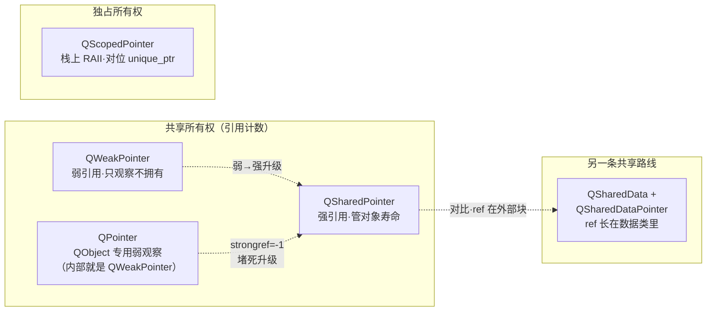

# 现代Qt开发教程（专家篇）1.06——Qt 智能指针家族源码拆解

## 1. 前言——Qt 自己那套智能指针，到底图个啥

C++11 把 `std::shared_ptr`、`std::unique_ptr`、`std::weak_ptr` 三件套给了咱们之后，Qt 自己那套 `QSharedPointer`、`QScopedPointer`、`QWeakPointer`、`QPointer` 看着就像多余的。很多朋友下意识觉得「既然有 std 了，Qt 这套是不是该退休了」。笔者刚翻这块源码的时候也是这个念头，翻完才发现事情没那么简单——这套指针里头藏着一套 std 没有的设计：把「对象的寿命」和「引用计数块自己的寿命」拆成两个计数来管。

先抛几个笔者当年答不上来的问题。`QWeakPointer` 凭什么不阻拦对象析构？它明明也「指向」那个对象啊。`QSharedPointer` 拷贝来拷贝去，多线程下凭什么是安全的？还有那个 `QPointer`，它只能盯 `QObject`、而且永远没法升级成 `QSharedPointer`——这个「永远」是源码里哪一行堵死的？

这三个问题，恰好压在 Qt 智能指针家族的三条主轴上。入门篇的 [6.内存管理](../../beginner/01-qtbase/06-memory-management-beginner.md) 讲了这些指针怎么用、什么时候该用哪个，进阶篇的 [6.内存管理进阶](../../advanced/01-qtbase/06-memory-management-advanced.md) 讲了所有权模型和坑。本篇要捅到源码层：咱们打开 `qsharedpointer_impl.h`，看看那个 `ExternalRefCountData` 双计数块长什么样、`QWeakPointer` 怎么做到「只看不动」、`QPointer` 又是怎么被一行 `-1` 哨兵钉死在「只能跟踪」这个位置上的。

边界先划清楚。对象树的所有权——`setParent`、`deleteChildren`、`deleteLater`、线程亲和性——那是 [21.对象树源码](./21-object-tree-ownership-expert.md) 的主场，本篇不重复；笔者只在讲 `QPointer` 为什么专挑 `QObject` 时，点一下它借了 `QObjectPrivate` 的 `sharedRefcount` 字段，不展开对象树本身。还有 `QSharedData` 那条「ref 直接长在数据类里」的共享路线，咱们在 [19.COW 隐式共享](./19-cow-implicit-sharing-expert.md) 里拆过它怎么配合 `QSharedDataPointer` 做 COW，本篇只拿它和 `QSharedPointer` 做个对偶对比，不重复 detach 细节。

## 2. 环境说明

本篇源码引用基于 `qt_src/qt6.9.1`，行号随 Qt 版本会漂移，对照阅读时拿函数名或字段名去定位最稳。涉及的关键文件：

| 文件 | 角色 |
|---|---|
| `qtbase/src/corelib/tools/qsharedpointer.h` | QSharedPointer/QWeakPointer 公共 API + qdoc |
| `qtbase/src/corelib/tools/qsharedpointer_impl.h` | 实现核心：ExternalRefCountData 双计数、deref、internalSet、QWeakPointer 类、QEnableSharedFromThis |
| `qtbase/src/corelib/tools/qsharedpointer.cpp` | getAndRef（QObject 跟踪路径）、class doc |
| `qtbase/src/corelib/tools/qscopedpointer.h` | QScopedPointer/QScopedArrayPointer + deprecated 标记 |
| `qtbase/src/corelib/tools/qshareddata.h` | QSharedData/QSharedDataPointer/QExplicitlySharedDataPointer（对比路线） |
| `qtbase/src/corelib/kernel/qpointer.h` | QPointer Qt6 实现（委托 QWeakPointer） |

本篇无配套 example，原因和前几篇一样：纯源码拆解，对照 `qt_src` 翻代码就是最好的实验。

## 3. 核心概念讲解

下源码之前，咱们先把家族全景对一下。Qt 这套指针看着四个，其实按「怎么管理对象寿命」可以分得很清楚：



`QSharedPointer` 是强引用，真正管对象死活；`QWeakPointer` 是弱引用，只看不动；`QPointer` 是 `QObject` 专用的弱观察者（内部就是 `QWeakPointer` 的薄封装）；`QScopedPointer` 是栈上独占的 RAII，对位 `std::unique_ptr`；`QSharedData` 那条线是另一套设计——ref 直接长在数据类里，区别于 `QSharedPointer` 把 ref 放在外部数据块上。

这套分类的根子，全压在一个叫 `ExternalRefCountData` 的结构上。咱们就从它开始拆。

### 3.1 地基——ExternalRefCountData 的双计数

`QSharedPointer` 和 `QWeakPointer` 都只持有一个 `d` 指针，指向同一个结构：

`qt_src/qt6.9.1/qtbase/src/corelib/tools/qsharedpointer_impl.h:108-113`

```cpp
    struct ExternalRefCountData
    {
        typedef void (*DestroyerFn)(ExternalRefCountData *);
        QBasicAtomicInt weakref;
        QBasicAtomicInt strongref;
        DestroyerFn destroyer;
```

看到关键字眼了——`weakref` 和 `strongref` 两个计数，都是 `QBasicAtomicInt`。源码注释给这个结构起了个绕口但精准的名字：它是一个「reference-counted reference counter」，一个自己也被引用计数管着的引用计数器。`strongref` 是内层计数，管的是「被托管对象还活着吗」；`weakref` 是外层计数，管的是「这个 refcount 块本身还活着吗」。两个寿命被拆开了。

为什么要拆？因为 `QWeakPointer` 的存在。一个弱引用还在的时候，它得能去查「对象死了没」——这个查询动作要访问 refcount 块。如果对象一死 refcount 块也跟着没了，弱引用就抓瞎了。所以 Qt 的设计是：对象死归对象死（strongref 归零），refcount 块得等所有弱引用也放手了（weakref 归零）才能死。这一个拆分，是整个家族能成立的地基。

构造这个块的时候，两个计数都从 1 起：

`qt_src/qt6.9.1/qtbase/src/corelib/tools/qsharedpointer_impl.h:115-120`

```cpp
        inline ExternalRefCountData(DestroyerFn d)
            : destroyer(d)
        {
            strongref.storeRelaxed(1);
            weakref.storeRelaxed(1);
        }
```

`strongref=1` 好理解，第一个 `QSharedPointer` 持有它。`weakref` 也给 1，是给 refcount 块自己兜底——只要还有任何强引用存在，这个块至少被「强引用持有者」这一方算作有一个 weakref 兜底，不会被提前 delete。两个计数都是 `QBasicAtomicInt`（平台原生原子操作，x86 上 `lock` 前缀、ARM 上 ldrex/strex 那种），这是 `QSharedPointer` 跨线程拷贝安全的底层。

这里笔者要专门点一下，免得和别的计数搞混。Qt 里有好几套引用计数实现：`QArrayData`（QString/QList 的 COW 头部）走 `QtPrivate::RefCount`，那套有 `ref==-1` 表示静态对象的短路语义；`QSharedData`（用户自定义共享类的基类）用裸 `QAtomicInt`、初值 0；而 `QSharedPointer` 这套直接用 `QBasicAtomicInt`，不经 `RefCount` 那层包装。三套是三套，别搅在一起。

### 3.2 对象怎么死、块怎么死——分阶段析构

双计数的意义，在析构的时候才真正显出来。咱们看 `QSharedPointer` 的 `deref`：

`qt_src/qt6.9.1/qtbase/src/corelib/tools/qsharedpointer_impl.h:511-519`

```cpp
    static void deref(Data *dd) noexcept
    {
        if (!dd) return;
        if (!dd->strongref.deref()) {
            dd->destroy();
        }
        if (!dd->weakref.deref())
            delete dd;
    }
```

这两段 if，笔者第一次读的时候来回看了三遍才咂摸出味道——它是整个机制的精髓。第一个判断：`strongref` 减完要是归零了，调 `dd->destroy()` 把托管对象干掉。注意只 `destroy` 对象，refcount 块本身不动。第二个判断：`weakref` 减完要是归零了，才 `delete dd` 把 refcount 块自己释放。

为什么是这个顺序？因为一个 `QSharedPointer` 析构时，它既是一个强引用（要减 strongref），也是那个「兜底」的 weakref 持有者（要减 weakref）。strongref 归零只说明对象该死了，但 refcount 块可能还被别的 `QWeakPointer` 指着——那些弱引用还得靠这个块去查「对象死没死」。所以块必须比对象活得久，等最后一个弱引用也放手了（weakref 归零），块才能放心 delete。

`destroy()` 本身很简单，就是调那个存好的函数指针：

`qt_src/qt6.9.1/qtbase/src/corelib/tools/qsharedpointer_impl.h:124`

```cpp
        void destroy() { destroyer(this); }
```

一行。没有复活机制，没有 in-place 重用——strongref 一旦归零，对象就不可逆地死了。析构函数里还有两个断言给这个顺序兜底：

`qt_src/qt6.9.1/qtbase/src/corelib/tools/qsharedpointer_impl.h:122`

```cpp
        ~ExternalRefCountData() { Q_ASSERT(!weakref.loadRelaxed()); Q_ASSERT(strongref.loadRelaxed() <= 0); }
```

refcount 块被 delete 的时候，`weakref` 必须已经归零、`strongref` 必须 `<=0`。这俩断言是开发期给写源码的人自己看的——确认「先死对象、后死块」的顺序没被哪段代码破坏。

自定义 deleter 也顺理成章地落在这个结构上。基类只存一个 `destroyer` 函数指针，真正用户传进来的 deleter（比如「关文件描述符」而不是「delete 对象」）通过一个子类附加进去：

`qt_src/qt6.9.1/qtbase/src/corelib/tools/qsharedpointer_impl.h:178-191`

```cpp
    template <class T, typename Deleter>
    struct ExternalRefCountWithCustomDeleter: public ExternalRefCountData
    {
        CustomDeleter<T, Deleter> extra;
        ...
        static inline Self *create(T *ptr, Deleter userDeleter, DestroyerFn actualDeleter)
        {
            Self *d = static_cast<Self *>(::operator new(sizeof(Self)));
            new (&d->extra) CustomDeleter<T, Deleter>(ptr, userDeleter);
            new (d) BaseClass(actualDeleter);
            return d;
        }
```

基类的 `destroyer` 指向一个静态函数，那个静态函数再把 `this` 向下转型成子类、调用户存的 deleter。子类多出来的 `extra` 成员（装着用户 deleter + 被管指针）紧贴在 refcount 块后面，用 `::operator new(sizeof(Self))` 一次分配搞定，sizeof 随 Deleter 类型变化。这套设计让自定义 deleter 不占基类的空间——没自定义 deleter 的 `QSharedPointer` 就用纯 `ExternalRefCountData`，一个字都不浪费。

### 3.3 QWeakPointer——只动 weakref，所以不阻析构

有了双计数地基，`QWeakPointer` 怎么「只看不动」就一目了然了。咱们看它的拷贝和析构：

`qt_src/qt6.9.1/qtbase/src/corelib/tools/qsharedpointer_impl.h:618-622`

```cpp
    inline ~QWeakPointer() { if (d && !d->weakref.deref()) delete d; }
    ...
    QWeakPointer(const QWeakPointer &other) noexcept : d(other.d), value(other.value)
    { if (d) d->weakref.ref(); }
```

拷贝只 `weakref.ref()`，析构只 `weakref.deref()`——`strongref` 一个字都不碰。这就是「不阻析构」的全部秘密：弱引用的增减完全不影响对象寿命计数，对象该死的时候（最后一个强引用放手）照样死，弱引用根本拦不住。

那弱引用想用这个对象怎么办？它得先升级成强引用，这中间有个原子的 race——升级的当口，对象可能正好被别人析构了。Qt 的做法是一段 CAS 循环：

`qt_src/qt6.9.1/qtbase/src/corelib/tools/qsharedpointer_impl.h:561-570`

```cpp
        if (o) {
            // increase the strongref, but never up from zero
            // or less (-1 is used by QWeakPointer on untracked QObject)
            int tmp = o->strongref.loadRelaxed();
            while (tmp > 0) {
                if (o->strongref.testAndSetRelaxed(tmp, tmp + 1))
                    break;
                tmp = o->strongref.loadRelaxed();
            }
            if (tmp > 0)
                o->weakref.ref();
            else
                o = nullptr;
        }
```

这段在 `internalSet` 里，由「拿 weak 构造 shared」的路径触发（`toStrongRef`/`lock` 本体只是一行委托，真正干活的是这里）。它先读 `strongref`，只要还大于 0，就用 CAS 试着 +1；要是 CAS 失败（被别的线程改了），重新读、再试。一旦读到 `strongref <= 0`，说明对象已经死了或者正在死——循环退出，`tmp` 不大于 0，那就把 `o` 置 `nullptr`，升级失败，返回一个空的 `QSharedPointer`。

注意注释里那句「never up from zero or less」，还有个「-1 is used by QWeakPointer on untracked QObject」。这个 -1 是个哨兵，笔者下面讲 `QPointer` 的时候要专门拎出来——它正是 `QPointer` 永远升不成 `QSharedPointer` 的根子。

### 3.4 sharedFromThis——对象怎么拿到指向自己的 shared

有时候对象自己的成员函数里，想拿到一个指向自己的 `QSharedPointer`。naive 的写法笔者也写过，就是 `QSharedPointer<MyClass>(this)`——这会重新建一个 refcount 块，双计数就这么被搞乱了，对象会被 delete 两次。std 那边有 `enable_shared_from_this` 解决这事，Qt 也有对位的 `QEnableSharedFromThis`：

`qt_src/qt6.9.1/qtbase/src/corelib/tools/qsharedpointer_impl.h:817-831`

```cpp
template <class T>
class QEnableSharedFromThis
{
public:
    inline QSharedPointer<T> sharedFromThis() { return QSharedPointer<T>(weakPointer); }
    inline QSharedPointer<const T> sharedFromThis() const { return QSharedPointer<const T>(weakPointer); }

private:
    template <class X> friend class QSharedPointer;
    template <class X>
    inline void initializeFromSharedPointer(const QSharedPointer<X> &ptr) const
    {
        weakPointer = ptr;
    }

    mutable QWeakPointer<T> weakPointer;
};
```

机制是这样的：类继承 `QEnableSharedFromThis`，里头就藏了一个 `mutable QWeakPointer<T> weakPointer` 成员。当这个对象第一次被 `QSharedPointer` 接管时，`QSharedPointer` 的构造会调 `enableSharedFromThis`，把那个 weak 成员回填成指向自己的弱引用。之后对象在成员函数里调 `sharedFromThis()`，就是走咱们 3.3 节那套 weak→strong 升级，拿到一个合法的、和外部那个 shared 共享同一套 refcount 块的 `QSharedPointer`，不会再造出第二套计数。

### 3.5 QPointer——QObject 专用的弱观察者，被 -1 钉死

`QPointer` 是这套家族里最特殊的一个。它只能指向 `QObject`（或其子类），用途很窄：盯一个 `QObject`，对象被 delete 了之后，`QPointer` 能知道（`isNull()` 返回 true），避免拿到悬空指针。它最反直觉的一点是——永远没法升级成 `QSharedPointer`，连试都不用试。

先看它在 Qt 6 里长什么样。Qt 5 时代，`QPointer` 就是 `QWeakPointer<QObject>` 的 typedef，粗暴直接。Qt 6 改成了独立的模板类，但您打开一看：

`qt_src/qt6.9.1/qtbase/src/corelib/kernel/qpointer.h:17-37`

```cpp
template <class T>
class QPointer
{
    ...
    using QObjectType =
        typename std::conditional<std::is_const<T>::value, const QObject, QObject>::type;
    QWeakPointer<QObjectType> wp;
public:
    ...
    inline QPointer(T *p) : wp(p, true) { }
```

类是独立了，但里头唯一的数据成员，还是那个 `QWeakPointer<QObjectType> wp`。`data()`、`isNull()`、`clear()` 全部委派给它。所以 Qt 6 的 `QPointer` 本质上还是 `QWeakPointer` 的薄封装——独立是独立在类型系统层面（不再是 typedef），实现层面一点没变。网传「Qt6 把 QPointer 重写成完全独立实现」是片面的。

那 `QPointer` 跟踪 `QObject` 的机制，和普通 `QWeakPointer` 跟踪一个 `QSharedPointer` 管的对象，到底差在哪？差在那个 `-1` 哨兵。咱们看 `getAndRef`，这是 `QWeakPointer` 接管 `QObject` 时走的特殊路径：

`qt_src/qt6.9.1/qtbase/src/corelib/tools/qsharedpointer.cpp:1542-1543`

```cpp
    x->strongref.storeRelaxed(-1);
    x->weakref.storeRelaxed(2);  // the QWeakPointer that called us plus the QObject itself
```

`QPointer`（经 `QWeakPointer`）第一次盯上一个 `QObject` 时，会在 `QObjectPrivate::sharedRefcount` 这个字段上挂一个 refcount 块。但这个块的 `strongref` 被设成 `-1`，不是 1。源码的 doc 注释把意图说得很直白：设成 -1 是「indicating that the QObject is not shared」——这个对象不被 `QSharedPointer` 共享管理，`QWeakPointer` 在这的作用纯粹是「判断这个 `QObject` 还活着没」，仅此而已。

`weakref` 给 2，是因为这个块被两方持有：一个是刚创建它的 `QWeakPointer`，另一个是 `QObject` 自己（`QObject` 析构的时候会去减这个 weakref，好让块知道对象没了）。

现在把 3.3 节那段 CAS 升级逻辑和这个 `-1` 接到一起，您就明白 `QPointer` 为什么永远升不成 `QSharedPointer` 了。升级要求 `strongref > 0` 才能 +1，可这个块的 `strongref` 是 `-1`，循环压根进不去，直接走 `else` 把 `o` 置空。Qt 甚至专门加了个 `checkQObjectShared` 守卫：

`qt_src/qt6.9.1/qtbase/src/corelib/tools/qsharedpointer.cpp:1521-1525`

```cpp
    if (strongref.loadRelaxed() < 0)
        qWarning("QSharedPointer: cannot create a QSharedPointer from a QObject-tracking QWeakPointer. ...
```

读到 `strongref < 0` 直接 `qWarning` 拒绝。所以 `QPointer` 的定位被这一行 `-1` 彻底钉死：它只能观察、不能拥有。您要真想用引用计数管 `QObject` 的寿命，得一开始就用 `QSharedPointer` 接管，别指望半路从 `QPointer` 升级。

### 3.6 QScopedPointer——栈上独占，对位 unique_ptr

讲完共享那条线，独占这边就简单多了。`QScopedPointer` 是栈上的 RAII，没有引用计数，析构的时候调一个 Cleanup：

`qt_src/qt6.9.1/qtbase/src/corelib/tools/qscopedpointer.h:69-82`

```cpp
template <typename T, typename Cleanup = QScopedPointerDeleter<T> >
class QScopedPointer
{
public:
    ...
    explicit QScopedPointer(T *p = nullptr) noexcept : d(p)
    {
    }

    inline ~QScopedPointer()
    {
        T *oldD = this->d;
        Cleanup::cleanup(oldD);
    }
    ...
    Q_DISABLE_COPY_MOVE(QScopedPointer)
};
```

一个指针成员，析构调 `Cleanup::cleanup`，默认的 `QScopedPointerDeleter` 就是 `delete`。`Q_DISABLE_COPY_MOVE` 把拷贝和移动全禁了，保证独占所有权——这是它和 `QSharedPointer` 最根本的区别，也是它对位 `std::unique_ptr` 的地方。要管数组？`QScopedArrayPointer` 特化一下，默认 Cleanup 换成 `delete[]`，再加个 `operator[]`：

`qt_src/qt6.9.1/qtbase/src/corelib/tools/qscopedpointer.h:207-213`

```cpp
    T &operator[](qsizetype i)
    {
        return this->d[i];
    }
```

对位 `std::unique_ptr<T[]>`。这套设计没什么花活，就是教科书 RAII。

不过 Qt 6 对 `QScopedPointer` 的官方态度变了，咱们在踩坑那节专门说。

### 3.7 另一条路——QSharedData，ref 长在数据里

最后咱们把视角拉高，对比一下 Qt 还有另一条共享路线。`QSharedPointer` 的特点是 ref 放在外部数据块（`ExternalRefCountData`）上，对象本身不知道自己被共享。`QSharedData` 路线正好反过来——ref 直接长在数据类里：

`qt_src/qt6.9.1/qtbase/src/corelib/tools/qshareddata.h:21-26`

```cpp
class QSharedData
{
public:
    mutable QAtomicInt ref;

    QSharedData() noexcept : ref(0) { }
    QSharedData(const QSharedData &) noexcept : ref(0) { }
```

数据类继承 `QSharedData`，就白得一个 `mutable QAtomicInt ref` 成员（初值 0）。然后用 `QSharedDataPointer<T>` 去持有它——那个指针在非 const 访问时自动 detach（写时复制，COW），在 [19.COW 篇](./19-cow-implicit-sharing-expert.md) 里咱们拆过这套。还有个 `QExplicitlySharedDataPointer`，区别是它不自动 detach，只在您显式调 `detach()` 时才复制（显式共享）。

这两条路的对偶关系，笔者觉得是这套源码里最值得记住的一笔。`QSharedPointer` 是「外部 refcount 块 + 对象不知情」，适合管任意类型、任意来源的对象；`QSharedData` 是「内部 ref + 对象主动配合」，适合您自己设计的数据类、要配合 COW 用。前者灵活，后者省一个块的开销（ref 直接在对象里，不用额外 malloc refcount 块）。Qt 自己的 `QString`、`QList` 走的是更底层的 `QArrayData`（也是内部 ref 思路），用户自定义共享类才用 `QSharedData`。

## 4. 踩坑预防

第一个坑是拿了 `QWeakPointer`（或 `QPointer`）之后，想升级成强引用用时忘了判空。3.3 节咱们看过，weak→strong 的 CAS 升级在对象已析构时会失败，返回一个空的 `QSharedPointer`。有些代码写成 `auto sp = wp.toStrongRef(); sp->doSomething();`——中间漏了判空，要是对象正好在这当口死了，`sp` 是空的，`->doSomething()` 直接 segfault。这个 bug 极难复现，因为 race 窗口很小，profile 和调试都难抓。根子在 3.3 节那段 CAS：它只保证「升级成功时对象活着」，不保证「升级一定成功」。后果是偶发的空指针解引用崩溃。解法是死规矩：`toStrongRef`/`lock` 的返回必须判空，`if (auto sp = wp.lock()) { sp->doSomething(); }` 这么用才安全。

第二个坑是拿 `QPointer` 想升级成 `QSharedPointer` 来管 `QObject` 寿命。3.5 节那个 `-1` 哨兵把这条路堵死了——`getAndRef` 设 `strongref=-1`，`internalSet` 的 `tmp > 0` 守卫进不去，`checkQObjectShared` 还会 `qWarning` 警告您。有些朋友没注意到这个，写了 `QSharedPointer<QObject>(ptr.data())` 这种代码，要么编译期能过但运行期 qWarning 刷屏、对象寿命管理乱套，要么直接崩。后果是 `QObject` 的所有权搅成两套（`QPointer` 跟踪 + 手动 delete 或对象树），double-free 或 use-after-free 都可能。解法是边界要清：`QObject` 要么交给对象树（`setParent`，见 [21 篇](./21-object-tree-ownership-expert.md)）管寿命、用 `QPointer` 只做观察；要么一开始就用 `QSharedPointer` 接管（但这和对象树是冲突的，二选一）。别指望 `QPointer` 半路升级。

第三个坑是循环引用。两个对象 A、B 互相用 `QSharedPointer` 指着对方——A 持 B 的 shared、B 持 A 的 shared——那俩对象的 strongref 永远不低于 1（互相兜着），谁都不死，内存就泄漏了。这是 `std::shared_ptr` 时代的老问题，`QSharedPointer` 一模一样。根子还是 3.1 节那套强引用计数：只要 strongref 不归零，对象就不析构。后果是看似正常的代码，长时间运行后内存只涨不跌。解法是环里头至少有一方用 `QWeakPointer` 打破对称——比如父持子的 shared、子持父的 weak，这样父放手后子的 strongref 能归零、连带释放。判断哪里该用 weak 的规则也简单：「所有权」方向用 shared（强），「观察/回查」方向用 weak。

第四个坑是 Qt 6 还在用 `QScopedPointer` 的 `take()` 或 `swap()`，结果编译警告刷屏。Qt 6.1 起 `take()` 被标了 deprecated，6.2 起 `swap()` 也标了：

`qt_src/qt6.9.1/qtbase/src/corelib/tools/qscopedpointer.h:128-135`

```cpp
#if QT_DEPRECATED_SINCE(6, 1)
    QT_DEPRECATED_VERSION_X_6_1("Use std::unique_ptr instead, and call release().")
    T *take() noexcept
```

注意——只有 `take()` 和 `swap()` 这两个成员被 deprecated，不是整个 `QScopedPointer` 类被废。您新建一个 `QScopedPointer`、调 `data()`、`reset()` 都不会警告，类本身还是一等公民。但既然 Qt 官方都明说推 `std::unique_ptr` 了，新代码就用 `std::unique_ptr`，要转移所有权调 `release()`（对位 `take()`）。`QSharedPointer` 那边没被 deprecated，共享指针该用还用。

## 5. 官方文档参考链接

[Qt 文档 · QSharedPointer](https://doc.qt.io/qt-6/qsharedpointer.html) -- QSharedPointer 类参考，含线程安全保证与 std::shared_ptr 兼容 API

[Qt 文档 · QWeakPointer](https://doc.qt.io/qt-6/qweakpointer.html) -- QWeakPointer 类参考，弱引用语义与 toStrongRef/lock

[Qt 文档 · QScopedPointer](https://doc.qt.io/qt-6/qscopedpointer.html) -- QScopedPointer 类参考（注意 Qt6 对部分成员的 deprecated 标注）

[Qt 文档 · QPointer](https://doc.qt.io/qt-6/qpointer.html) -- QPointer 类参考，QObject 专用的弱观察指针

[Qt 文档 · QSharedData](https://doc.qt.io/qt-6/qshareddata.html) -- QSharedData 基类参考，另一条「ref 长在数据里」的共享路线

---

到这里，Qt 智能指针家族咱们就从源码层面拆透了。笔者拆完最大的感受是，这套设计的灵魂全在那个 `ExternalRefCountData` 上——把「对象的寿命」和「refcount 块自己的寿命」拆成 `strongref` 和 `weakref` 两个计数来管，剩下的事都是从这套双计数自然长出来的：`QWeakPointer` 凭只动 `weakref` 做到不阻析构，`toStrongRef` 靠 CAS 在 `strongref > 0` 时升级、失败就老老实实返回空，自定义 deleter 靠子类把用户 deleter 附加在 refcount 块尾巴上，`QEnableSharedFromThis` 靠回填一个 weak 成员避免裸 this 再造第二套计数。而 `QPointer` 那个 `strongref = -1` 哨兵，更是把「只能观察、不能拥有」这个设计意图，用一行源码钉得死死的——您想升级，CAS 循环的门都进不去。独占那边的 `QScopedPointer` 是朴素的栈上 RAII，对位 `std::unique_ptr`，Qt 6 也大方地承认该让位给 std 了。和 `QSharedData` 那条「ref 长在数据里」的内部计数路线对比一下，您就能看出 Qt 在「外部 refcount 块」和「内部 ref」之间，是按「对象能不能自己配合」来选的——任意对象用 `QSharedPointer`，自家的 COW 数据类用 `QSharedData`。

如果您想把本篇的行号证据拿来一一核对，它们已按源码机制归类收在 [code-index · Qt 智能指针家族](../code-index/qtbase/qsharedpointer-family.md) 下（`QSharedData` 那条对比路线另有 [QSharedData 专文](../code-index/qtbase/qshareddata.md) 详录），带着行号直接去 `qt_src/qt6.9.1` 翻原文就行。
