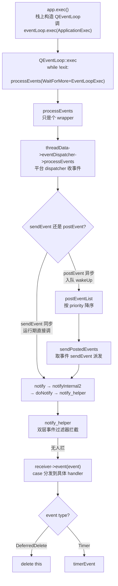

# 现代Qt开发教程（专家篇）1.07——事件循环源码拆解

## 1. 前言——为什么事件循环是 Qt 的心脏

每个 Qt 程序的 `main` 函数最后一行都是 `return app.exec();`。这一行调下去，程序就「活」了——窗口能响应点击、定时器会按时触发、网络数据到了能被处理、`emit` 出去的跨线程信号能被接收。但 `exec()` 到底在干嘛？为什么一句 `quit()` 就能让它返回？为什么 `deleteLater` 不是当场 `delete`，而要等到「稍后」？为什么装一个事件过滤器就能拦截别人对象的事件？笔者第一次读 Qt 源码的时候，这几个问题搅在一起，愣是没找到一个能一口气答全的地方。

这些问题的答案全部指向同一个东西——事件循环。入门篇的 [7 事件系统](../../beginner/01-qtbase/07-event-system-beginner.md) 教过咱们怎么用 `QEvent`、怎么重写 `event()`、怎么装 `eventFilter`、怎么用 `QTimer`——那是知其然。进阶篇的 [事件系统](../../advanced/01-qtbase/07-event-system-advanced.md) 讲过事件过滤器的进阶用法和事件循环的嵌套。本篇要做的是知其所以然：咱们把 `exec()` 打开，看清楚那个让整个程序跑起来的 `while` 循环长什么样，事件是怎么从「被产生」走到「被 `event()` 处理」的，`sendEvent` 和 `postEvent` 这两条路在源码里到底差在哪。

这一篇承接 [信号槽底层——activate 调用链](./02-signal-slot-internals-expert.md)。上一篇咱们看到跨线程 `QueuedConnection` 最终调 `QCoreApplication::postEvent(receiver, ev)` 把一个 `QMetaCallEvent` 投递出去——那这个事件投递到哪去了？谁取它？谁来执行它？答案就在本篇：事件循环和它的分发链路。上一篇是「事件的产生端」，本篇是「事件的处理端」。咱们也承接 [QObject 元对象系统](./01-qobject-meta-system-expert.md)——`QObject::event()` 这个虚函数，正是事件分发的最终落点。

边界先交代清楚：本篇聚焦事件循环的主干——`exec` 的循环结构、`processEvents` 到平台 dispatcher 的转发、`notify`/`sendEvent`/`postEvent` 的分发双路、`DeferredDelete` 全链、`timerEvent` 入口、事件过滤器拦截。平台 dispatcher 的具体实现（UNIX 上的 `QEventDispatcherUNIX`、Windows 上的 `QEventDispatcherWin32` 怎么跟操作系统要事件、怎么注册系统级定时器）咱们不展开，那是平台后端的事，本篇只到 `QAbstractEventDispatcher` 这个抽象层。同样，`postEvent` 的优先级排序规则咱们会讲（文档明文），但 `QPostEventList::addEvent` 内部排序算法不下钻。

## 2. 环境说明

本篇所有源码引用基于 `qt_src/qt6.9.1`，行号可能随 Qt 版本升级而漂移，对照阅读时用函数名定位。涉及个别 Qt 7 才引入的细节，正文会以「Qt 7 起」口径轻点，不展开。

本篇涉及的源码文件（按出现顺序）：

| 文件 | 角色 |
|---|---|
| `qt_src/qt6.9.1/qtbase/src/corelib/kernel/qcoreapplication.cpp` | exec / notify / sendEvent / postEvent / sendPostedEvents / notify_helper / execCleanup |
| `qt_src/qt6.9.1/qtbase/src/corelib/kernel/qeventloop.cpp` | QEventLoop::exec 的 while 心脏 / exit / processEvents |
| `qt_src/qt6.9.1/qtbase/src/corelib/kernel/qeventloop.h` | ProcessEventsFlags（ApplicationExec / EventLoopExec 标记） |
| `qt_src/qt6.9.1/qtbase/src/corelib/kernel/qabstracteventdispatcher.h` | QAbstractEventDispatcher 纯虚接口（平台抽象层） |
| `qt_src/qt6.9.1/qtbase/src/corelib/kernel/qcoreevent.h` | DeferredDelete = 52 事件类型常量 |
| `qt_src/qt6.9.1/qtbase/src/corelib/kernel/qobject.cpp` | QObject::event 的 case 分发 / installEventFilter |

本篇无配套 example，原因：事件循环的分发路径是 Qt 运行期的内部机制，没有任何合理的 demo 能演示它——对照 `qt_src` 翻源码就是最好的实验。

## 3. 核心概念讲解

照老规矩，先对路线图。事件循环是一条从「循环骨架」到「事件交付」的单向主干，中间经过平台抽象层和分发双路：



咱们从这条链的源头 `app.exec()` 开始。

### 3.1 exec 的心脏——一个 while 循环

`QCoreApplication::exec()` 本身没几行，它把活儿交给了栈上构造的一个 `QEventLoop`：

`qt_src/qt6.9.1/qtbase/src/corelib/kernel/qcoreapplication.cpp:1430-1455`

```cpp
int QCoreApplication::exec()
{
    if (!QCoreApplicationPrivate::checkInstance("exec"))
        return -1;
    // ...
    threadData->quitNow = false;
    QEventLoop eventLoop;
    self->d_func()->in_exec = true;
    self->d_func()->aboutToQuitEmitted = false;
    int returnCode = eventLoop.exec(QEventLoop::ApplicationExec);
    threadData->quitNow = false;

    if (self)
        self->d_func()->execCleanup();

    return returnCode;
}
```

注意 `QEventLoop eventLoop;` 是栈上构造的——每条线程（至少主线程）都有一个属于自己的 `QEventLoop`，它的生命周期和这次 `exec` 调用绑定。`exec` 传了一个 `QEventLoop::ApplicationExec` 标记进去，标记这是「主应用循环」（区别于普通嵌套循环，§3.3 讲）。拿到 `eventLoop.exec` 的返回值后，还调了 `execCleanup()` 兜底（§3.6 讲，这是 `deleteLater` 的最后兑现机会）。

真正的循环体在 `QEventLoop::exec` 里，就两行，但这才是整个 Qt 程序的心脏——笔者第一次看到这行代码的时候愣了一下，折腾了大半年的事件循环，根上居然就是这样一个 while：

`qt_src/qt6.9.1/qtbase/src/corelib/kernel/qeventloop.cpp:185-186`

```cpp
    while (!d->exit.loadAcquire())
        processEvents(flags | WaitForMoreEvents | EventLoopExec);
```

一个 `while` 循环，条件是原子读 `d->exit` 标志——只要 `exit` 没被置位，就反复调 `processEvents`。`processEvents` 的 flags 里拼了 `WaitForMoreEvents`（没事件就阻塞等，别空转烧 CPU）和 `EventLoopExec`（标记当前在 `exec` 循环里）。整个 Qt 程序的「活着」，就是这个 `while` 不停转圈——每一圈处理一批事件，没事件就阻塞等着，直到有人把 `exit` 标志置起来。

`exit` 标志用 `loadAcquire()` 读，这是和 `exit()` 方法里的 `storeRelease()` 配对的 acquire-release 序——保证 `exit()` 写入的返回码等其他数据，在循环条件读到 `exit=true` 时对当前线程全部可见（§3.2）。

### 3.2 退出机制——exit 写标志 + interrupt 踹醒

`QCoreApplication::quit()` 本质上调 `QEventLoop::exit`。咱们看它怎么让上面那个 `while` 停下来：

`qt_src/qt6.9.1/qtbase/src/corelib/kernel/qeventloop.cpp:253-262`

```cpp
void QEventLoop::exit(int returnCode)
{
    // ...
    d->returnCode.storeRelaxed(returnCode);
    d->exit.storeRelease(true);
    threadData->eventDispatcher.loadRelaxed()->interrupt();
}
```

三步。第一步 `returnCode.storeRelaxed` 存返回码（relaxed 就够，因为 `exit` 的 release 会兜底同步）。第二步 `exit.storeRelease(true)` 置退出标志——这是让 §3.1 的 `while` 条件 `loadAcquire()` 读到 `true` 从而跳出循环的关键。第三步 `dispatcher->interrupt()` 最容易被忽略但至关重要——笔者一开始就漏看了这一脚，以为置个标志循环自己就会停。其实如果此时 `processEvents` 正阻塞在 `WaitForMoreEvents`（等事件，没事件来就睡着），光置 `exit` 标志没用，循环条件要等下一圈才能检查到，但下一圈永远不会来（因为阻塞着）。`interrupt()` 的作用就是踹醒这个阻塞中的 `processEvents`，让它立即返回，循环才能转去检查 `exit` 标志。这是退出机制里最关键的一脚。

### 3.3 processEvents 与 dispatcher——平台抽象层

`QEventLoop::processEvents` 自己几乎不干活，它是个转发器：

`qt_src/qt6.9.1/qtbase/src/corelib/kernel/qeventloop.cpp:94-104`

```cpp
bool QEventLoop::processEvents(ProcessEventsFlags flags)
{
    Q_D(QEventLoop);
    auto threadData = d->threadData.loadRelaxed();
    if (!threadData->hasEventDispatcher())
        return false;
    return threadData->eventDispatcher.loadRelaxed()->processEvents(flags);
}
```

注释里直说了「This function is simply a wrapper」——它检查当前线程有没有 event dispatcher，没有直接返回 false，有就把 flags 原样转发给 `dispatcher->processEvents`。真正「从操作系统收事件」的活儿，全在那个 dispatcher 身上。

dispatcher 是个纯虚抽象基类 `QAbstractEventDispatcher`，它把所有平台相关项都声明成纯虚：

`qt_src/qt6.9.1/qtbase/src/corelib/kernel/qabstracteventdispatcher.h:44-74`

```cpp
    virtual bool processEvents(QEventLoop::ProcessEventsFlags flags) = 0;
    // ...
    virtual void registerTimer(int timerId, qint64 interval, Qt::TimerType timerType, QObject *object) = 0;
    virtual bool unregisterTimer(int timerId) = 0;
    // ...
    virtual void wakeUp() = 0;
    virtual void interrupt() = 0;
```

`processEvents` / `registerTimer` / `unregisterTimer` / `wakeUp` / `interrupt` 全是 `= 0`，没有任何默认实现。具体怎么跟窗口系统要事件、怎么注册系统定时器，由各平台子类实现（UNIX 的 `QEventDispatcherUNIX` 走 `select`/`poll`，Windows 的走 `PeekMessage`/`MsgWaitForMultipleObjects`，macOS 的走 CFRunLoop）。本篇就到这个抽象层——咱们要理解的是「dispatcher 负责收事件并交给 `QCoreApplication` 分发」这个职责划分，平台后端实现是另一回事。

这个职责划分在类文档里说得很清楚：

`qt_src/qt6.9.1/qtbase/src/corelib/kernel/qabstracteventdispatcher.cpp:121-124`

```cpp
    An event dispatcher receives events from the window system and other
    sources. It then sends them to the QCoreApplication or QApplication
    instance for processing and delivery.
```

dispatcher 是「收事件」的，`QCoreApplication` 是「分发事件」的。这就是 §3.4 的主角。

### 3.4 事件分发总入口——notify 与同线程规则

事件收到了，要送到具体对象的 `event()` 里去。这个分发的总入口是 `notify`：

`qt_src/qt6.9.1/qtbase/src/corelib/kernel/qcoreapplication.cpp:1124-1128`

```cpp
  Sends \a event to \a receiver: \a {receiver}->event(\a event).
  Returns the value that is returned from the receiver's event
  handler. Note that this function is called for all events sent to
  any object in any thread.
```

`notify(receiver, event)` 的职责就是把 `event` 送给 `receiver->event()`。不管哪个线程、哪个对象、哪种事件，所有事件分发最终都过这里。

咱们更常用的是 `sendEvent`——同步直发：

`qt_src/qt6.9.1/qtbase/src/corelib/kernel/qcoreapplication.cpp:1525-1547`

```cpp
    \fn bool QCoreApplication::sendEvent(QObject *receiver, QEvent *event)

    Sends event \a event directly to receiver \a receiver, using the
    notify() function. Returns the value that was returned from the
    event handler.

    The event is \e not deleted when the event has been sent.
// ...
bool QCoreApplication::sendEvent(QObject *receiver, QEvent *event)
{
    // ...
    event->m_spont = false;
    return notifyInternal2(receiver, event);
}
```

`sendEvent` 的两个关键特性文档说得很清楚：一是「directly」——同步直发，调下去当场就执行 `receiver->event()`，不进队列；二是「The event is not deleted」——`sendEvent` 不删事件，事件的生命周期归调用者管（这和 `postEvent` 形成对比，§3.5）。实现里把 `m_spont` 置 false（标记这不是来自窗口系统的自发事件），然后调 `notifyInternal2`。

`notifyInternal2` 强制了一条重要规则——同线程：

`qt_src/qt6.9.1/qtbase/src/corelib/kernel/qcoreapplication.cpp:1080-1106`

```cpp
    // Qt enforces the rule that events can only be sent to objects in
    // the current thread, so receiver->d_func()->threadData is
    // equivalent to QThreadData::current(), just without the function
    // call overhead.
    // ...
    if (!selfRequired)
        return doNotify(receiver, event);
    // ...
    return qApp->notify(receiver, event);
```

注释逐字写着「Qt enforces the rule that events can only be sent to objects in the current thread」——事件只能发给当前线程里的对象。这就是为什么 `sendEvent` 不能跨线程用（§4.1）：它走 `notify` 同步直发，而 `notify` 要求 receiver 在当前线程。跨线程发事件必须走 `postEvent`（§3.5），让接收线程自己的事件循环去处理。

### 3.5 异步投递——postEvent 入队与 sendPostedEvents 派发

`postEvent` 是 `sendEvent` 的姐妹，但走完全不同的路——异步入队：

`qt_src/qt6.9.1/qtbase/src/corelib/kernel/qcoreapplication.cpp:1622-1664`

```cpp
void QCoreApplication::postEvent(QObject *receiver, QEvent *event, int priority)
{
    // ...
    std::unique_ptr<QEvent> eventDeleter(event);
    // ...
    data->postEventList.addEvent(QPostEvent(receiver, event, priority));
    Q_UNUSED(eventDeleter.release());
    event->m_posted = true;
    receiver->d_func()->postedEvents.fetchAndAddRelease(1);
    data->canWait = false;
    locker.unlock();

    QAbstractEventDispatcher* dispatcher = data->eventDispatcher.loadAcquire();
    if (dispatcher)
        dispatcher->wakeUp();
}
```

`postEvent` 干了几件事。先用 `std::unique_ptr` 持住 event——防止后续抛异常时事件泄漏；`addEvent` 成功后 `release()` 把所有权转交给事件队列（从此事件的生命周期归队列管，和 `sendEvent` 不删事件正好相反）。然后置 `m_posted = true` 标记、给 receiver 的 `postedEvents` 计数加 1（这个计数在析构清理时有用）、把 `canWait` 置 false（告诉 §3.1 的循环「现在别睡着等，队列里有活干」）。最后调 `dispatcher->wakeUp()`——和 §3.2 的 `interrupt` 类似，如果 dispatcher 正阻塞在 `WaitForMoreEvents`，`wakeUp` 把它踹醒，让它赶紧处理这个新投递的事件。笔者觉得这两条 `wakeUp`/`interrupt` 凑在一起读才完整：投递和退出是事件循环里仅有的两个「主动叫醒 dispatcher」的场景，其它时候 dispatcher 都是自己阻塞等事件。

队列里的事件按 `priority` 排序，规则文档明文：

`qt_src/qt6.9.1/qtbase/src/corelib/kernel/qcoreapplication.cpp:1611-1616`

```cpp
    Events are sorted in descending \a priority order, i.e. events
    with a high \a priority are queued before events with a lower \a
    priority. The \a priority can be any integer value, i.e. between
    INT_MAX and INT_MIN, inclusive; see Qt::EventPriority for more
    details. Events with equal \a priority will be processed in the
    order posted.
```

三条规则：按 priority 降序（高优先级先出）、priority 可取 `INT_MIN` 到 `INT_MAX` 任意整数、等优先级 FIFO（先进先出）。咱们只引用这个排序规则——`QPostEventList::addEvent` 内部用什么算法维持这个顺序，不在本篇 scope。

队列里的事件最终由 `sendPostedEvents` 派发：

`qt_src/qt6.9.1/qtbase/src/corelib/kernel/qcoreapplication.cpp:1860-1879`

```cpp
        pe.event->m_posted = false;
        QEvent *e = pe.event;
        QObject * r = pe.receiver;

        r->d_func()->postedEvents.fetchAndSubAcquire(1);
        // ...
        const std::unique_ptr<QEvent> event_deleter(e); // will delete the event (with the mutex unlocked)

        // after all that work, it's time to deliver the event.
        QCoreApplication::sendEvent(r, e);
```

`sendPostedEvents` 从队列取出一个事件，把它的 `m_posted` 标志清掉、receiver 的 `postedEvents` 计数减 1，然后用 `unique_ptr event_deleter(e)` 接管事件所有权（注释说「will delete the event」——派发完自动删除，这正是 `postEvent` 投递的事件「用完即删」的归宿）。最后调 `sendEvent(r, e)`——注意，异步投递的事件，最终派发那一刻走的是同步的 `sendEvent`。殊途同归，都汇合到 §3.4 的 `notify`。笔者没料到的是，`sendEvent` 和 `postEvent` 这两条看似分岔的路，到最后一公里居然是同一个函数收口——异步只是「入队+等循环」，真派发那一刻就是同步。

### 3.6 DeferredDelete 全链路——deleteLater 怎么兑现

`QObject::deleteLater` 是咱们最常用的事件循环相关 API，但它的「稍后删除」到底是怎么兑现的？这是一条完整的事件链路。先看事件类型常量：

`qt_src/qt6.9.1/qtbase/src/corelib/kernel/qcoreevent.h:104`

```cpp
        DeferredDelete = 52,                    // deferred delete event
```

`DeferredDelete` 是事件类型 52。`deleteLater()` 做的事，本质就是把一个 `DeferredDelete` 事件 `postEvent` 到对象自己的队列里（投递时还附带记录当时的循环层级 `loopLevel` / `scopeLevel`，用于时机判定）。这个事件被派发到 `QObject::event` 时，对应的 case 极其简洁：

`qt_src/qt6.9.1/qtbase/src/corelib/kernel/qobject.cpp:1415-1417`

```cpp
    case QEvent::DeferredDelete:
        delete this;
        break;
```

就这么一行 `delete this`。`deleteLater` 的「稍后」，指的就是「当前事件处理完、回到事件循环、轮到这个 DeferredDelete 事件被派发的那一刻」——届时 `delete this` 触发析构。笔者一开始还嫌这名字起得太玄乎，看到这行 `delete this` 才恍然——「稍后」就是字面意思的「等到这一圈事件循环」。之所以不能当场 `delete`，是因为 `deleteLater` 往往在事件处理过程中被调用（比如在自己的事件处理器里），此时对象的栈帧还活着，当场 `delete` 会析构一个还在使用中的对象——`DeferredDelete` 把删除推迟到一个安全的时机。

但这个「安全时机」的判定没那么简单，涉及嵌套事件循环。`sendPostedEvents` 在派发 DeferredDelete 事件前，会检查时机是否合适：

`qt_src/qt6.9.1/qtbase/src/corelib/kernel/qcoreapplication.cpp:1824-1857`

```cpp
        if (pe.event->type() == QEvent::DeferredDelete) {
            // ...
            const int eventLoopLevel = static_cast<QDeferredDeleteEvent *>(pe.event)->loopLevel();
            const int eventScopeLevel = static_cast<QDeferredDeleteEvent *>(pe.event)->scopeLevel();
            // ...
            const bool allowDeferredDelete =
                (eventLoopLevel + eventScopeLevel > data->loopLevel + data->scopeLevel
                 || (postedBeforeOutermostLoop && data->loopLevel > 0)
                 || (event_type == QEvent::DeferredDelete
                     && eventLoopLevel + eventScopeLevel == data->loopLevel + data->scopeLevel));
            if (!allowDeferredDelete) {
                // ... // re-post the event so it isn't lost
                data->postEventList.addEvent(pe_copy);
                continue;
            }
        }
```

这段比较投递时记录的 `loopLevel`/`scopeLevel` 和当前的 `data->loopLevel`/`scopeLevel`，判断现在删是不是安全。关键在末尾：如果判定还不能删（`!allowDeferredDelete`），事件不会丢失，而是重新 `addEvent` 投递回队列（`pe_copy`），留给下一圈再试。这保证 `deleteLater` 的对象最终一定会被删，只是要等到嵌套循环层级回到合适的位置。

最后还有一道兜底——`execCleanup`：

`qt_src/qt6.9.1/qtbase/src/corelib/kernel/qcoreapplication.cpp:1464-1468`

```cpp
void QCoreApplicationPrivate::execCleanup()
{
    threadData.loadRelaxed()->quitNow = false;
    in_exec = false;
    QCoreApplication::sendPostedEvents(nullptr, QEvent::DeferredDelete);
}
```

主循环 `exec` 返回后（程序要退出了），`execCleanup` 显式 `sendPostedEvents(nullptr, DeferredDelete)` 强制 flush 所有未处理的 DeferredDelete 事件。这是「最后机会」——保证 `deleteLater` 的对象在 app 退出前都能兑现删除，不会留一地悬垂。

### 3.7 timerEvent 的入口——event case Timer

顺带把定时器事件的入口也讲清楚。`QTimer` 触发时，dispatcher 注册的系统定时器到时间了，会产生一个 `QEvent::Timer` 事件，派发到 `QObject::event`：

`qt_src/qt6.9.1/qtbase/src/corelib/kernel/qobject.cpp:1402-1407`

```cpp
bool QObject::event(QEvent *e)
{
    switch (e->type()) {
    case QEvent::Timer:
        timerEvent((QTimerEvent *)e);
        break;
```

`event` 收到 `Timer` 类型，转调虚函数 `timerEvent`。`QObject` 的默认 `timerEvent` 是空实现——你不重写就什么都收不到，这也是为什么用定时器必须重写 `timerEvent`（或用 `QTimer` 的 `timeout` 信号）。注意这里只证了「Timer 事件 → `timerEvent` 调用」这一环，dispatcher 注册系统定时器的那一侧（§3.3 的 `registerTimer` 纯虚）属于平台后端，不在本篇 scope。

### 3.8 事件过滤器——双层拦截

最后一节讲事件过滤器，它是在事件到达 `receiver->event()` 之前的拦截机制。拦截发生在 `notify_helper` 里，而且是双层的：

`qt_src/qt6.9.1/qtbase/src/corelib/kernel/qcoreapplication.cpp:1255-1279`

```cpp
bool QCoreApplicationPrivate::notify_helper(QObject *receiver, QEvent * event)
{
    // ...
    // send to all application event filters (only does anything in the main thread)
    if (QThread::isMainThread()
            && QCoreApplication::self
            && QCoreApplication::self->d_func()->sendThroughApplicationEventFilters(receiver, event)) {
        filtered = true;
        return filtered;
    }
    // send to all receiver event filters
    if (sendThroughObjectEventFilters(receiver, event)) {
        filtered = true;
        return filtered;
    }

    // deliver the event
    consumed = receiver->event(event);
    return consumed;
}
```

`notify_helper` 是 `notify` 实际干活的内部函数。它依次试两道过滤器：第一道是应用级事件过滤器（`sendThroughApplicationEventFilters`，仅主线程生效，给 `qApp` 装的过滤器），第二道是对象级事件过滤器（`sendThroughObjectEventFilters`，给具体 receiver 装的过滤器）。任一道返回 true 就算拦截成功，短路返回，事件不会到达 `receiver->event()`。两道都不拦，才真正 `receiver->event(event)` 交付事件。

对象级过滤器那道，遍历 receiver 上装的过滤器逐个调用：

`qt_src/qt6.9.1/qtbase/src/corelib/kernel/qcoreapplication.cpp:1232-1248`

```cpp
bool QCoreApplicationPrivate::sendThroughObjectEventFilters(QObject *receiver, QEvent *event)
{
    if (receiver != qApp && receiver->d_func()->extraData) {
        for (qsizetype i = 0; i < receiver->d_func()->extraData->eventFilters.size(); ++i) {
            QObject *obj = receiver->d_func()->extraData->eventFilters.at(i);
            // ...
            if (obj->eventFilter(receiver, event))
                return true;
        }
    }
    return false;
}
```

这段遍历 receiver 的 `eventFilters` 列表，对每个过滤器对象调它的 `eventFilter(receiver, event)` 虚函数——这就是咱们重写 `eventFilter` 时实际被触发的地方。谁返回 true 谁就拦下事件。

最后看过滤器是怎么装的：

`qt_src/qt6.9.1/qtbase/src/corelib/kernel/qobject.cpp:2350-2366`

```cpp
void QObject::installEventFilter(QObject *obj)
{
    Q_D(QObject);
    if (!obj)
        return;
    if (d->threadData.loadRelaxed() != obj->d_func()->threadData.loadRelaxed()) {
        qWarning("QObject::installEventFilter(): Cannot filter events for objects in a different thread.");
        return;
    }
    // ...
    d->extraData->eventFilters.removeIf(isNullOrEquals(obj));
    d->extraData->eventFilters.prepend(obj);
}
```

`installEventFilter` 有两处要留意。第一是同线程校验——过滤器和被过滤对象必须在同一线程，否则 `qWarning` 拒绝安装（§4.3）。第二是 `prepend`——新过滤器头插到列表头部。结合 §`sendThroughObjectEventFilters` 从头遍历的顺序，这意味着「后装的过滤器先被调用」。如果你装了三个过滤器 A、B、C，调用顺序是 C、B、A——笔者特意提一句，这点和直觉相反，多过滤器场景您要小心顺序。

## 4. 踩坑预防

第一个坑是跨线程用 `sendEvent` 发事件。§3.4 看 `notifyInternal2` 的源码，注释逐字写着「events can only be sent to objects in the current thread」——`notify` 强制 receiver 在当前线程。如果你在 worker 线程里 `QCoreApplication::sendEvent(mainWindow, event)`，`mainWindow` 在主线程，违反同线程规则。后果是行为未定义（Qt 会有断言或警告，但事件不会正确送达，严重时崩溃）。原因在于 `sendEvent` 是同步直发，它要在当前线程的调用栈里直接执行 `receiver->event()`，跨线程意味着要碰另一个线程的对象，而那个对象可能正在自己的线程里被使用——这不是事件循环该管的同步直发能安全处理的。解法：跨线程一律用 `postEvent`（或 `QueuedConnection` 的信号槽，它内部就是 `postEvent`），让接收线程自己的事件循环在安全时机处理；`sendEvent` 只在同一线程内用。

第二个坑是误以为 `deleteLater` 会立即删除。§3.6 把整条链路看清楚了——`deleteLater` 只是把一个 `DeferredDelete` 事件投递进队列，真正的 `delete this` 要等事件循环派发到它那一刻才发生。而且如果当时嵌套循环层级不满足（`allowDeferredDelete` 为 false），事件还会被重新投递，推迟到更晚。后果是：你调了 `deleteLater` 之后，指针在「当前这一圈事件处理结束」之前仍然有效（这是好事，让你能安全地从自己的事件处理器里调它）；但如果你指望它「立即失效」去判断 `if (obj)`，或者在 `deleteLater` 之后立刻又通过别的路径访问这个对象，就会落空——对象可能还活着，也可能下一圈就没了。解法：理解 `deleteLater` 的语义是「当前事件处理完毕、回到循环时删除」，别在调它之后继续持有/使用该指针；需要确定时机的删除，配合对象树（parent 管理）或显式 `delete`。

第三个坑是 `installEventFilter` 跨线程装过滤器静默失败。§3.8 的源码里，`installEventFilter` 开头就检查 `threadData`：过滤器和被过滤对象不同线程，直接 `qWarning` 然后 `return`——不装。后果是你的过滤器对象从来没被调用过，事件「漏过」了它，但程序不报错（除非你开了 warning 输出看到那句 qWarning）。这种 bug 极其隐蔽——你以为装上了过滤器，事件却照常到达 receiver。原因在于事件过滤是同步调用 `eventFilter` 虚函数（在 `notify_helper` 里当场调），跨线程调用一个对象的虚函数不安全，所以 Qt 直接禁止。解法：过滤器和被过滤对象必须在同一线程；确实需要跨线程拦截事件，用别的方式（比如在源线程拦截后 `postEvent` 转发）。

## 5. 官方文档参考链接

[Qt 文档 · QCoreApplication](https://doc.qt.io/qt-6/qcoreapplication.html) -- exec / quit / sendEvent / postEvent / sendPostedEvents 的官方文档

[Qt 文档 · QEventLoop](https://doc.qt.io/qt-6/qeventloop.html) -- QEventLoop 类参考，exec / exit / processEvents / ProcessEventsFlags

[Qt 文档 · QAbstractEventDispatcher](https://doc.qt.io/qt-6/qabstracteventdispatcher.html) -- 事件 dispatcher 抽象基类，平台事件收发的接口层

[Qt 文档 · Events and Event Delivery](https://doc.qt.io/qt-6/eventsandfilters.html) -- 事件系统总览，sendEvent/postEvent 区别、事件过滤器机制

---

到这里，Qt 事件循环的整条主干咱们就从源码层面走通了。咱们从 `app.exec()` 栈上构造的那个 `QEventLoop` 出发，看到了让整个程序活着的就一个 `while (!exit)` 反复调 `processEvents`；理解了 `processEvents` 只是个转发器，真正收事件的是平台 dispatcher（抽象基类一水纯虚）；顺着 `notify` 进了分发链，分清了 `sendEvent` 同步直发（受同线程规则约束）和 `postEvent` 异步入队（按优先级排序、最终也汇合到 `sendEvent`）两条路；追完了 `deleteLater` 的 `DeferredDelete` 全链路——从投递、时机判定、`delete this` 到 `execCleanup` 兜底；最后拆了 `timerEvent` 的入口和事件过滤器的双层拦截。笔者自己的体感是，事件循环这东西平时像黑盒，可一旦把 `while`、`interrupt`、`wakeUp` 这三个动词连起来看，整条链就透了。下一篇咱们会拆对象树——`setParent` / 析构级联删子 / `deleteLater` 在对象树里的角色。

本篇涉及的所有行号证据已按源码机制归类收在 [code-index · qtbase](../code-index/qtbase/) 下，带着行号直接去 `qt_src/qt6.9.1` 翻原文就能核对。
