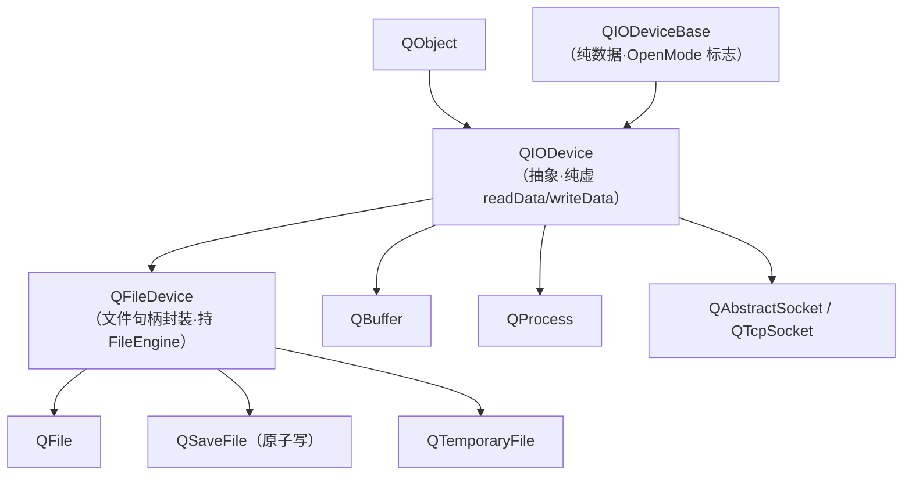

# 现代Qt开发教程（专家篇）1.08——QIODevice 与 QFile 源码拆解

## 1. 前言——所有 IO 类的祖宗，到底管了什么

写 Qt 的人，多多少少都碰过 `QFile`。但您要是翻开 `qiodevice.h` 看一眼，会发现 `QFile` 只是冰山一角——它上头还有个 `QFileDevice`，再上头才是 `QIODevice`。而这个 `QIODevice`，是 Qt 里一切跟「数据流」沾边的类的祖宗：`QFile`、`QBuffer`、`QProcess`、`QAbstractSocket`、`QTcpSocket`，全是它的子类。

先抛几个笔者当年翻源码时卡住的问题。`readData` 这个函数，`QIODevice` 头文件里翻烂了都找不到它的函数体——它到底有没有默认实现？`QFile` 是不是就像 C 语言的 `FILE*` 那样直接封装一个文件描述符？还有那个 `readyRead` 信号，是 `QIODevice` 自己在什么时机发射的？

这三个问题，恰好压在 QIODevice 设计的三条主轴上：抽象基类的虚函数契约、文件类的继承与封装层次、异步 IO 的信号驱动。入门篇的 [8.文件与 IO](../../beginner/01-qtbase/08-file-io-beginner.md) 教了 `QFile` 怎么读写，进阶篇的 [8.文件 IO 进阶](../../advanced/01-qtbase/08-file-io-advanced.md) 讲了 `QTextStream`、`QDataStream` 这些用法。本篇要往源码里捅：咱们打开 `qiodevice.cpp`，看看 `read`/`write` 怎么在 `readData`/`writeData` 这对纯虚函数上搭起来、随机设备和顺序设备怎么分叉、缓冲区怎么工作，再顺着继承链看到 `QFile` 是怎么经一层 `QAbstractFileEngine` 落到平台 `open`/`CreateFile` 上的。

边界先划清楚。`QTextStream`、`QDataStream` 是建在 `QIODevice` 之上的序列化框架，本篇点到即止，不展开它们的编码细节。`QBuffer`、`QProcess`、`QAbstractSocket` 虽然都继承 `QIODevice`，但本篇只拿它们说明 QIODevice 的通用性，不拆这些子类——它们各有归属（网络模块、进程篇）。

## 2. 环境说明

本篇源码引用基于 `qt_src/qt6.9.1`，行号随 Qt 版本会漂移，对照阅读时拿函数名或字段名定位最稳。涉及的关键文件：

| 文件 | 角色 |
|---|---|
| `qtbase/src/corelib/io/qiodevice.h` / `qiodevicebase.h` | QIODevice 公共声明 + OpenMode 标志（拆到 QIODeviceBase） |
| `qtbase/src/corelib/io/qiodevice.cpp` | QIODevice 实现：read/write/seek/pos/close |
| `qtbase/src/corelib/io/qiodevice_p.h` | QIODevicePrivate：QRingBuffer 缓冲、chunkSize |
| `qtbase/src/corelib/io/qfiledevice.h` / `.cpp` / `_p.h` | QFileDevice：文件句柄封装层（持 FileEngine） |
| `qtbase/src/corelib/io/qfile.h` / `.cpp` | QFile：继承 QFileDevice |
| `qtbase/src/corelib/io/qsavefile.h` / `.cpp` | QSaveFile：原子写 |
| `qtbase/src/corelib/io/qfsfileengine_unix.cpp` / `_win.cpp` | 平台 native：open / CreateFile |

本篇无配套 example，原因和前几篇一样：纯源码拆解，对照 `qt_src` 翻代码就是最好的实验。

## 3. 核心概念讲解

下源码之前，咱们先把 QIODevice 的家族关系对一下。这张图能帮您看清谁继承谁、`QFile` 到底在哪个位置：



`QIODevice` 双重继承 `QObject`（拿信号槽）和 `QIODeviceBase`（拿 OpenMode 标志）。往下，文件类的中间层是 `QFileDevice`，再分出 `QFile`、`QSaveFile`、`QTemporaryFile`；而 `QBuffer`、`QProcess`、各种 Socket 直接继承 `QIODevice`。咱们这一篇就顺着这条链，从顶上的 `QIODevice` 抽象层一路拆到 `QFile` 的平台调用。

### 3.1 QIODevice 的位置——双继承与 OpenMode

先看 `QIODevice` 自己继承谁：

`qt_src/qt6.9.1/qtbase/src/corelib/io/qiodevice.h:30-37`

```cpp
class Q_CORE_EXPORT QIODevice
#ifndef QT_NO_QOBJECT
    : public QObject,
#else
    :
#endif
      public QIODeviceBase
```

它有两个基类。一个是 `QObject`——这让所有 IO 类都有信号槽能力（`readyRead` 这些信号才发得出来），不过这个继承被 `QT_NO_QOBJECT` 包着，极简配置下可以裁掉。另一个是 `QIODeviceBase`，这个基类是 Qt 6 专门拆出来的：

`qt_src/qt6.9.1/qtbase/src/corelib/io/qiodevicebase.h:16-28`

```cpp
    enum OpenModeFlag {
        NotOpen = 0x0000,
        ReadOnly = 0x0001,
        WriteOnly = 0x0002,
        ReadWrite = ReadOnly | WriteOnly,
        Append = 0x0004,
        Truncate = 0x0008,
        Text = 0x0010,
        Unbuffered = 0x0020,
        NewOnly = 0x0040,
        ExistingOnly = 0x0080
    };
    Q_DECLARE_FLAGS(OpenMode, OpenModeFlag)
```

十个标志位全在这里——`NotOpen`、读写三位、`Append`/`Truncate`、`Text`/`Unbuffered`、还有 Qt5.11 加的 `NewOnly`/`ExistingOnly`。注意 `ReadWrite` 不是独立一位，是 `ReadOnly | WriteOnly` 的位运算组合（值是 0x3）。为什么要单独搞个 `QIODeviceBase` 非模板基类来放这些？因为 `OpenMode` 这个类型得被一些不依赖 `QIODevice` 完整定义的地方用到（比如 `QFileInfo`），单独拆出来能斩断头文件循环依赖。`QIODeviceBase` 的析构是 `protected`，您没法独立实例化它——它纯粹是个标志容器。

### 3.2 双模式——随机访问与顺序访问

`QIODevice` 把天下设备分成两种：能 `seek` 的随机访问设备（普通文件），和不能 `seek` 的顺序设备（管道、socket、串口）。区分靠一个虚函数：

`qt_src/qt6.9.1/qtbase/src/corelib/io/qiodevice.cpp:493-496`

```cpp
bool QIODevice::isSequential() const
{
    return false;
}
```

基类默认返回 `false`——假定您是随机设备，可以 `seek`。顺序设备子类得 override 它返回 `true`。这里笔者要专门提醒一个容易踩的认知坑：`QFileDevice` 就 override 了这个函数，它把判定委托给了 `fileEngine->isSequential()`——所以普通磁盘文件返回 `false`，但要是这个 `QFileDevice` 背后是个管道或者特殊文件，它会返回 `true`。千万别记成「`QFileDevice` 永远是随机设备」，那只在普通文件场景下成立。

这个 `isSequential` 的返回值，直接决定 `seek` 让不让您调：

`qt_src/qt6.9.1/qtbase/src/corelib/io/qiodevice.cpp:857-870`

```cpp
bool QIODevice::seek(qint64 pos)
{
    Q_D(QIODevice);
    if (d->isSequential()) {
        checkWarnMessage(this, "seek", "Cannot call seek on a sequential device");
        return false;
    }
    if (d->openMode == NotOpen) {
        checkWarnMessage(this, "seek", "The device is not open");
        return false;
    }
    if (pos < 0) {
        qWarning("QIODevice::seek: Invalid pos: %lld", pos);
        return false;
    }
```

三道守卫，一道比一道实在。顺序设备调 `seek`？直接 `false` 加一句 `checkWarnMessage` 警告，不让进。设备没打开？`false`。位置是负数？`false`。三道都过了，才去更新 `d->devicePos` 并 `seekBuffer`（清掉或截断内部缓冲区）。这个「先看是不是顺序设备」的守卫，是双模式分叉的关键路口。

### 3.3 readData/writeData——子类必须实现的纯虚契约

现在到本篇最核心的一对了。`QIODevice` 头文件里，`readData` 和 `writeData` 长这样：

`qt_src/qt6.9.1/qtbase/src/corelib/io/qiodevice.h:132`

```cpp
    virtual qint64 readData(char *data, qint64 maxlen) = 0;
```

`qt_src/qt6.9.1/qtbase/src/corelib/io/qiodevice.cpp` 里翻遍全文——没有 `QIODevice::readData` 的函数体，只有 `/*! \fn ... */` 的文档注释。这是个纯虚函数，意味着 `QIODevice` 是个抽象类，您没法 `new QIODevice()`，任何子类想实例化都必须自己实现 `readData`。`writeData` 同理，也是纯虚：

`qt_src/qt6.9.1/qtbase/src/corelib/io/qiodevice.h:135`

```cpp
    virtual qint64 writeData(const char *data, qint64 len) = 0;
```

笔者要专门纠正一个流传挺广的说法——有些老资料讲「`QIODevice::readData` 默认返回 -1 表示出错」。那是 Qt 4/5 时代的旧行为，Qt 6.9.1 里它就是纯虚，没有默认实现。子类（比如 `QFileDevice::readData`，在 `qt_src/qt6.9.1/qtbase/src/corelib/io/qfiledevice.cpp:462`）才是干活的真身。这对纯虚函数就是 `QIODevice` 和子类之间的契约：「您要当一种 IO 设备，就得告诉我怎么读一块、怎么写一块，剩下的缓冲、循环、状态管理我来」。

公共的 `read` 在这对契约上搭了一层薄壳：

`qt_src/qt6.9.1/qtbase/src/corelib/io/qiodevice.cpp:996-1029`

```cpp
qint64 QIODevice::read(char *data, qint64 maxSize)
{
    Q_D(QIODevice);
    ...
    CHECK_READABLE(read, qint64(-1));
    const bool sequential = d->isSequential();
    // Short-cut for getChar(), unless we need to keep the data in the buffer.
    if (maxSize == 1 && !(sequential && d->transactionStarted)) {
        int chint;
        while ((chint = d->buffer.getChar()) != -1) {
            ...
            *data = c;
            ...
            return qint64(1);
        }
    }
    CHECK_MAXLEN(read, qint64(-1));
    const qint64 readBytes = d->read(data, maxSize);
    return readBytes;
}
```

`CHECK_READABLE` 先确认设备可读，`CHECK_MAXLEN` 确认长度合法。中间有一段 `maxSize == 1` 的快捷路径，是给 `getChar()` 用的——但您注意，这个快捷路径里要是缓冲区空了，它会调 `readData(data, 0)` 预读 0 字节去触发子类填缓冲，不是「完全绕过 `readData`」。真正干活的还是最后那行 `d->read(data, maxSize)`，逻辑在 `QIODevicePrivate::read` 里，咱们下一节拆。

### 3.4 缓冲的两条路——大块直读 vs 填充 ring

`QIODevicePrivate` 里维护着一组环形缓冲区：

`qt_src/qt6.9.1/qtbase/src/corelib/io/qiodevice_p.h:105-116`

```cpp
    QRingBufferRef buffer;
    QRingBufferRef writeBuffer;
    ...
    int readBufferChunkSize = QIODEVICE_BUFFERSIZE;
    int writeBufferChunkSize = 0;
    QVarLengthArray<QRingBuffer, 2> readBuffers;
    QVarLengthArray<QRingBuffer, 1> writeBuffers;
```

这里有个容易看走眼的地方——`buffer` 和 `writeBuffer` 的类型是 `QRingBufferRef`，名字看着像「拥有一个 QRingBuffer」，其实它里头持的是裸指针 `m_buf`，是个引用，真正的 `QRingBuffer` 对象归下面那个 `QVarLengthArray<QRingBuffer, 2> readBuffers` 所有（栈上预分配两个槽，支持多通道读）。`setCurrentReadChannel` 的时候，才把 `&readBuffers[channel]` 这个地址挂到 `buffer.m_buf` 上。所以 `buffer` 是个「当前活跃通道」的视图，不是所有者。`readBufferChunkSize` 默认是 `QIODEVICE_BUFFERSIZE`：

`qt_src/qt6.9.1/qtbase/src/corelib/io/qiodevice_p.h:30-31`

```cpp
#ifndef QIODEVICE_BUFFERSIZE
#define QIODEVICE_BUFFERSIZE 16384
```

16KB。这个数字是 `read` 走哪条路的分界线。咱们看 `QIODevicePrivate::read` 的核心：

`qt_src/qt6.9.1/qtbase/src/corelib/io/qiodevice.cpp:1082-1116`

```cpp
        const bool buffered = (readBufferChunkSize != 0 && (openMode & QIODevice::Unbuffered) == 0);
        ...
        if ((!buffered || maxSize >= readBufferChunkSize) && !keepDataInBuffer) {
            // Read big chunk directly to output buffer
            readFromDevice = q->readData(data, maxSize);
        } else {
            // fill QIODevice buffer by single read
            readFromDevice = q->readData(buffer.reserve(bytesToBuffer), bytesToBuffer);
        }
```

两条路。您一次要读的字节数 `maxSize` 大于等于 16KB（或者开了 `Unbuffered`），就直接调 `readData` 把数据读到您给的缓冲区里——绕过 ring，一次了事，省一次拷贝。您要读的少于 16KB，就走另一条路：`readData` 一次读 16KB 填满 ring buffer，然后从 ring 里切给您要的那么点。下次您再读，先从 ring 里拿，命中就不用调 `readData` 了——这是为频繁小读（比如逐字节解析）省系统调用。

这个分叉解释了 `Unbuffered` 标志到底干了什么：它让 `buffered` 为 `false`，所有读都走第一条「直读」路。听起来更快？笔者一开始也这么觉得，翻完源码才发现真不一定——频繁小读时，`Unbuffered` 会让每次 read 都调一次 `readData`（背后是一次系统调用 `read`），性能反而崩。`Unbuffered` 只在大块顺序读、且您自己管缓冲的场景才划算。

### 3.5 readLine 与 Text 模式

`readLine` 是 `read` 之上的便利函数，按 `\n` 切一行。它先尝试从 buffer 里 peek 出 `\n`，避免调 `readData`：

`qt_src/qt6.9.1/qtbase/src/corelib/io/qiodevice.cpp:1387-1394`

```cpp
    if (readSoFar) {
        if (data[readSoFar - 1] == '\n') {
            if (openMode & QIODevice::Text) {
                // QRingBuffer::readLine() isn't Text aware.
                if (readSoFar > 1 && data[readSoFar - 2] == '\r') {
                    --readSoFar;
                    data[readSoFar - 1] = '\n';
                }
            }
            ...
            return readSoFar;
        }
    }
```

注意 `Text` 模式的处理在 `readLine` 的出口——Windows 风格的 `\r\n` 被收成 `\n`。buffer 里没有 `\n` 怎么办？回退到 `readLineData`：

`qt_src/qt6.9.1/qtbase/src/corelib/io/qiodevice.cpp:1630-1636`

```cpp
    while (readSoFar < maxSize && (lastReadReturn = read(&c, 1)) == 1) {
        *data++ = c;
        ++readSoFar;
        if (c == '\n')
            break;
    }
```

这是默认实现——逐字节 `read` 找 `\n`，性能很差（每个字节一次循环）。所以子类像 `QFileDevice` 会 override `readLineData` 做优化（一次读一大块再在内存里找 `\n`）。这也是为什么您读大文本文件该用 `QFileDevice` 的 `readLine` 而不是自己 `getChar` 拼一行。

### 3.6 信号契约——readyRead/bytesWritten 谁来发射

`QIODevice` 声明了三个核心信号：`readyRead`、`bytesWritten`、`aboutToClose`。但您要是 grep `qiodevice.cpp` 找 `emit readyRead`，会发现一个都没有——笔者第一次查到这里时愣了一下，这两个信号，`QIODevice` 自己从来不发射。

`qt_src/qt6.9.1/qtbase/src/corelib/io/qiodevice.h:117-122`

```cpp
Q_SIGNALS:
    void readyRead();
    void channelReadyRead(int channel);
    void bytesWritten(qint64 bytes);
    void channelBytesWritten(int channel, qint64 bytes);
    void aboutToClose();
```

`readyRead` 是「有新数据可读了」的信号，`bytesWritten` 是「数据已经写出去了」的信号。这俩的发射方是子类——比如 `QAbstractSocket`，它在操作系统通知 socket 有数据到达的回调里，自己 `emit readyRead()`。`QIODevice` 只负责声明这个契约，告诉子类「您该在合适的时候发这俩信号」，自己不驱动。这是异步 IO 的核心机制：顺序设备的数据到达是异步的，靠信号通知上层来读。

但 `aboutToClose` 不一样，它是 `QIODevice` 自己在 `close()` 里发射的：

`qt_src/qt6.9.1/qtbase/src/corelib/io/qiodevice.cpp:787-807`

```cpp
void QIODevice::close()
{
    Q_D(QIODevice);
    if (d->openMode == NotOpen)
        return;
    ...
    emit aboutToClose();
    d->openMode = NotOpen;
    d->pos = 0;
    ...
    // Do not clear write buffers to allow delayed close in sockets
    d->writeChannelCount = 0;
}
```

这是 `QIODevice` 唯一自己主动发射的信号。时机卡得很讲究——在 `openMode` 改成 `NotOpen` 之前发射，让订阅者能在设备真正关闭前做最后操作（比如 flush 一下）。还有个细节：注释明说 write buffers 不清空，是给 socket 的 delayed close 留尾巴。

### 3.7 QFile→QFileDevice→FileEngine——文件类不直接封装 fd

讲完抽象层，咱们顺着继承链下到文件类。三层继承：

`qt_src/qt6.9.1/qtbase/src/corelib/io/qfile.h:92`

```cpp
class Q_CORE_EXPORT QFile : public QFileDevice
```

`qt_src/qt6.9.1/qtbase/src/corelib/io/qfiledevice.h:31`

```cpp
class Q_CORE_EXPORT QFileDevice : public QIODevice
```

`QFileDevice` 是 Qt 5.0 拆出来的中间层，把「文件句柄封装」从 `QFile` 里独立出来，这样 `QTemporaryFile`、`QSaveFile` 都能共享这套。那这个「文件句柄」长什么样？很多人凭直觉觉得 `QFileDevice` 里头肯定有个 `int fd` 或者 `FILE* fh`——笔者翻开源码一看，还真没有：

`qt_src/qt6.9.1/qtbase/src/corelib/io/qfiledevice_p.h:58`

```cpp
    mutable std::unique_ptr<QAbstractFileEngine> fileEngine;
    mutable qint64 cachedSize;
    QFileDevice::FileHandleFlags handleFlags;
    QFileDevice::FileError error;
    bool lastWasWrite;
```

`QFileDevicePrivate` 持有的是一个 `std::unique_ptr<QAbstractFileEngine> fileEngine`——一个文件引擎指针，不是裸的 fd 或 FILE*。真正的 fd 藏在更深一层的 `QFSFileEnginePrivate` 里（Unix 下是 `int fd`，Windows 下是 `HANDLE fileHandle`）。这是 Qt 的 FileEngine 抽象层设计：`QFile` 不直接碰平台文件句柄，而是经 `QAbstractFileEngine` 这个接口，背后可以是普通文件引擎（`QFSFileEngine`），也可以是资源引擎、远程引擎等等。您要是照着「`QFile` 就是 `FILE*` 的封装」这个老印象去理解 Qt 6，就错了。

那 `QFile::open` 真正怎么落到平台调用上的？看三层：

`qt_src/qt6.9.1/qtbase/src/corelib/io/qfile.cpp:945-948`

```cpp
    // QIODevice provides the buffering, so there's no need to request it from the file engine.
    if (d->engine()->open(mode | QIODevice::Unbuffered)) {
        QIODevice::open(mode);
```

`QFile::open` 把模式强行加上 `Unbuffered` 传给引擎——理由写在注释里：缓冲是 `QIODevice` 那一层的事（咱们 3.4 节看过），引擎只管裸 IO。引擎那边在 Unix 上落到底层 `open`：

`qt_src/qt6.9.1/qtbase/src/corelib/io/qfsfileengine_unix.cpp:88-95`

```cpp
    Q_ASSERT_X(openMode & QIODevice::Unbuffered, "QFSFileEngine::open",
               "QFSFileEngine no longer supports buffered mode; upper layer must buffer");
    if (openMode & QIODevice::Unbuffered) {
        int flags = openModeToOpenFlags(openMode);
        do {
            fd = QT_OPEN(fileEntry.nativeFilePath().constData(), flags, mode);
        } while (fd == -1 && errno == EINTR);
```

那个 `Q_ASSERT_X` 斩钉截铁——`QFSFileEngine` 不再支持 buffered 模式，上层必须管缓冲。`QT_OPEN` 是 Qt 的宏，在 Unix 上展开成 POSIX 的 `open()`（返回 fd），不是 C 标准库的 `fopen()`。Windows 那边对应的是 `CreateFile`，返回 `HANDLE`。`openModeToOpenFlags` 把 `QIODevice::OpenMode` 的位标志映射成 POSIX 的 `O_RDONLY`/`O_RDWR`/`O_CREAT`/`O_TRUNC`/`O_EXCL` 这些。

### 3.8 QSaveFile——原子写的四件套

最后看 `QSaveFile`。它的用途是「安全地写一个文件」——写到一半断了不能污染原文件，写完要原子地替换。这套机制靠四件套。

第一件，`open` 的时候默认创建一个临时文件（`QTemporaryFileEngine`，权限 0600 防第三方窥探），写操作都落到临时文件上，不动原文件。第二件，`writeData` 被 override 来捕获写错误：

`qt_src/qt6.9.1/qtbase/src/corelib/io/qsavefile.cpp:362-371`

```cpp
qint64 QSaveFile::writeData(const char *data, qint64 len)
{
    Q_D(QSaveFile);
    if (d->writeError != QFileDevice::NoError)
        return -1;
    const qint64 ret = QFileDevice::writeData(data, len);
    if (d->error != QFileDevice::NoError)
        d->writeError = d->error;
    return ret;
}
```

一旦某次写失败（`d->error != NoError`），错误被存进 `d->writeError`，之后所有 `write` 都直接返回 -1——避免您在一坨坏数据上继续写。第三件是最狠的——笔者第一次看到这段直接拍案，`close` 被私有化并且直接 `qFatal`：

`qt_src/qt6.9.1/qtbase/src/corelib/io/qsavefile.cpp:272-274`

```cpp
void QSaveFile::close()
{
    qFatal("QSaveFile::close called");
}
```

`QSaveFile` 的 `close` 是 `private` 的，外部调不到；要是不小心在子类里调到了，直接 `qFatal` 把程序干掉——强制您必须走 `commit`，不能半途 `close` 了事。第四件是 `commit` 的原子替换流程：

`qt_src/qt6.9.1/qtbase/src/corelib/io/qsavefile.cpp:298-322`

```cpp
    QFileDevice::close(); // calls flush()
    const auto &fe = d->fileEngine;
    fe->syncToDisk();
    ...
    if (d->useTemporaryFile) {
        if (d->error != QFileDevice::NoError) { fe->remove(); return false; }
        // atomically replace old file with new file
        if (!fe->renameOverwrite(d->finalFileName)) {
            d->setError(fe->error(), fe->errorString());
            fe->remove();
            return false;
        }
    }
```

`QFileDevice::close()` 先 flush 缓冲，然后 `syncToDisk` 调 `fsync`（保证数据真落盘），再检查有没有错。没错就 `renameOverwrite`——原子地把临时文件 rename 成目标文件名，对外的效果就是「旧文件瞬间变成新文件」，中间状态外人看不到。有错就 `fe->remove()` 把临时文件删掉丢弃，原文件纹丝不动。这就是「原子写」的全部实现。

## 4. 踩坑预防

第一个坑是在顺序设备上调 `seek`。3.2 节咱们看过，`seek` 的第一道守卫就是查 `isSequential`——顺序设备（socket、管道、某些 `QFileDevice` 背后是特殊文件的场景）调 `seek` 直接返回 `false` 并打一句 `checkWarnMessage` 警告。有些朋友拿了设备不管三七二十一就 `seek(pos)`，以为定位成功了，后面 `read` 出来的数据全错位，还以为 Qt 的 socket 有 bug。根子在 3.2 节那个双模式分叉：顺序设备的数据是流式到达的，没有「第 N 字节」这个概念，您 `seek` 到的「位置」根本不存在。后果是静默失败（`seek` 返 `false` 但程序继续跑），数据错乱或读到末尾。解法是用 `QIODevice` 之前先 `isSequential()` 判一下，顺序设备改用 `waitForReadyRead`/`readyRead` 信号驱动、或者用 `transactions`（`startTransaction`/`commit`/`rollback`）管理协议解析的回退。

第二个坑是以为 `QFile` 直接封装 `FILE*` 或 `fd`，自己绕开 Qt 拿句柄操作。3.7 节咱们拆过，Qt 6 的 `QFileDevicePrivate` 持的是 `QAbstractFileEngine`，不是裸 fd——fd 藏在 `QFSFileEnginePrivate` 里。您要是用某些老教程教的「`file.handle()` 拿 fd 自己 `write` 一段、再让 `QFile` 接着写」，很可能把 Qt 的缓冲状态和文件位置搞乱（`QFileDevice` 缓存的 `pos`/`cachedSize` 和真实 fd 偏移对不上），后面 `QFile` 的读写全错位，甚至写到错误位置把文件弄坏。后果是数据损坏 + 极难定位的偏移 bug。解法：要么完全走 Qt 的 `QFile` API（`read`/`write`/`seek`），要么完全自己拿 fd 管（调 `handle()` 后不要再让 `QFile` 碰这个文件），别混着来。要真需要外部 fd，用 `QFile::open(int fd, OpenMode)` 这个重载把所有权明确交给 Qt。

第三个坑是 `QSaveFile` 误调 `close`。3.8 节看过，`QSaveFile::close` 是 `private` 加 `qFatal`——您要是在代码里 `if (error) saveFile.close();` 想中途放弃，程序直接挂掉（`qFatal` 默认 `abort`）。这个设计是故意的：`QSaveFile` 的语义就是「要么 commit 成功、要么 cancelWriting 丢弃」，没有「半路 close」这个选项。后果是程序崩溃。解法是明确走两条路之一：写完且没问题就 `commit()`（原子替换）；写到一半发现问题要放弃，调 `cancelWriting()` 再让对象析构（或 `commit()` 检测到错误自动 `remove` 临时文件）。

第四个坑是乱开 `Unbuffered` 以为更快。3.4 节咱们拆过 read 的两条路：`Unbuffered` 让所有读都走「直读用户缓冲」那条路，每次 `read` 都调一次 `readData`（背后是一次系统调用）。大块顺序读的时候这确实省一次内存拷贝，快一点；但要是您逐字节或者小段地读（比如 `while (!atEnd()) { char c; read(&c, 1); ... }`），`Unbuffered` 会让每个字节都触发一次 `read` 系统调用，性能比走缓冲慢几十倍。根子就是 3.4 节那个 16KB chunk 的设计——默认走缓冲时，小读会先填满 ring，后续命中 buffer 不再调 `readData`。后果是小读场景性能断崖式下降。解法：除非您确定是大块顺序读、且自己管缓冲，否则别开 `Unbuffered`。默认的缓冲策略已经是 Qt 调优过的。

## 5. 官方文档参考链接

[Qt 文档 · QIODevice](https://doc.qt.io/qt-6/qiodevice.html) -- QIODevice 抽象基类参考，read/write/seek/信号契约

[Qt 文档 · QFile](https://doc.qt.io/qt-6/qfile.html) -- QFile 类参考，文件读写入口

[Qt 文档 · QFileDevice](https://doc.qt.io/qt-6/qfiledevice.html) -- QFileDevice 类参考，文件句柄封装层

[Qt 文档 · QSaveFile](https://doc.qt.io/qt-6/qsavefile.html) -- QSaveFile 类参考，原子写事务语义

---

到这里，QIODevice 这一套咱们就从源码层面拆透了。笔者拆完最大的感受是，这套设计的精妙全在「抽象基类划清契约、子类只填核心」上——`readData`/`writeData` 这对纯虚函数把「怎么跟底层设备要一块数据」这个最小职责交给子类，剩下的缓冲管理（QRingBuffer + 16KB chunk 的两条路）、`read` 的循环凑数、`seek` 的双模式守卫、`readLine` 的按行切、信号契约的声明，全由 `QIODevice` 统一打理。顺着继承链往下，`QFile` 经 `QFileDevice` 落到 `QAbstractFileEngine`——Qt 6 里文件类不直接封装 fd，而是经一层引擎抽象，引擎背后才是 Unix 的 `open()` 或 Windows 的 `CreateFile`。而 `QSaveFile` 用「临时文件 + syncToDisk + renameOverwrite」加一个 `qFatal` 的 `close`，把原子写这事做得既安全又强硬。这套机制不是孤岛——`QTextStream`、`QDataStream` 都建在 `QIODevice` 之上，网络模块的 socket 也继承它，后面拆进程的 `QProcess`、网络的 `QTcpSocket` 时，咱们都会反复回到这一篇的结论。

如果您想把本篇的行号证据拿来一一核对，它们已按源码机制归类收在 [code-index · QIODevice 与 QFile/QSaveFile](../code-index/qtbase/qiodevice-fileio.md) 下，带着行号直接去 `qt_src/qt6.9.1` 翻原文就行。
