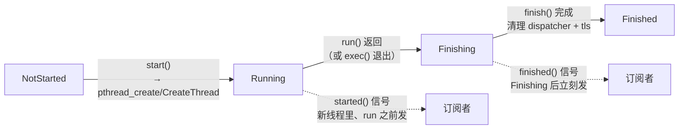

# 现代Qt开发教程（专家篇）1.09——QThread 源码拆解

## 1. 前言——QThread 不是「一个线程」

刚学 Qt 多线程的人，十有八九在 `QThread` 上栽过跟头。最常见的写法是继承 `QThread`、重写 `run()`、然后把「耗时逻辑」的信号槽连到这个子类上——结果发现槽函数压根没在新线程里跑，或者程序莫名其妙崩在对象析构上。这些坑的根源，都来自一个根本性的误解：把 `QThread` 当成了「一个线程」。

它不是。先抛几个笔者当年答不上来的问题。`QThread` 实例自己住在哪个线程？`run()` 和 `exec()` 到底什么关系，为什么重写 `run()` 不调 `exec()` 就没有事件循环？`started`、`finished` 这俩信号，是在哪个线程、哪个时机发射的？还有 `terminate()`，文档为啥把它骂得那么狠？

这几个问题压在 `QThread` 设计的三条主轴上：身份（管理者 QObject 而非线程本身）、双核（`run`/`exec`）、lifecycle（start 到 finished 的全过程）。入门篇的 [9.多线程](../../beginner/01-qtbase/09-multithreading-beginner.md) 教了 `QThread` 怎么用，进阶篇的 [9.QThread 进阶](../../advanced/01-qtbase/09-qthread-advanced.md) 讲了 moveToThread、worker 模式这些用法。本篇要往源码里捅：咱们打开 `qthread.cpp` 和 `qthread_unix.cpp`/`qthread_win.cpp`，看看 `QThread` 怎么经平台 API 把一个真线程拉起来、`run()` 默认干了什么、`QThreadData` 这个每线程一个的身份包装了什么、信号在什么时机飞出去。

边界先划清楚。`QThreadPool`、`QtConcurrent`、`QFuture` 这些是建在 `QThread` 之上的线程池/异步调度层，本篇不展开，它们是另一个主题。`QObject` 的线程亲和性（`thread()`/`moveToThread`）的完整规则，咱们在 [21.对象树所有权](./21-object-tree-ownership-expert.md) 里讲过同线程铁律，本篇只从 `QThread` 的视角补一条根源——`QObject` 构造时怎么绑上 `threadData`。事件循环 `QEventLoop` 的内部机制，是 [07.事件循环篇](./07-event-loop-internals-expert.md) 的主场，本篇只看 `QThread::exec` 怎么把它启动起来。

## 2. 环境说明

本篇源码引用基于 `qt_src/qt6.9.1`，行号随 Qt 版本会漂移，对照阅读时拿函数名定位最稳。`QThread` 的实现分公共部分和平台部分，涉及的关键文件：

| 文件 | 角色 |
|---|---|
| `qtbase/src/corelib/thread/qthread.h` | QThread 公共声明（Priority 枚举、create 模板） |
| `qtbase/src/corelib/thread/qthread.cpp` | 公共实现：run/exec/start/quit/wait/requestInterruption |
| `qtbase/src/corelib/thread/qthread_p.h` | QThreadPrivate + QThreadData（线程身份包） |
| `qtbase/src/corelib/thread/qthread_unix.cpp` | Unix：pthread_create/start 入口/terminate/wait |
| `qtbase/src/corelib/thread/qthread_win.cpp` | Win：CreateThread/start 入口/terminate/wait |
| `qtbase/src/corelib/kernel/qobject.cpp` | QObject 构造绑 threadData（线程亲和根源） |

本篇无配套 example，原因和前几篇一样：纯源码拆解，对照 `qt_src` 翻代码就是最好的实验。

## 3. 核心概念讲解

下源码之前，咱们先把 `QThread` 的 lifecycle 状态机和信号时机对一下。这张图能帮您看清从 `start()` 到 `finished()` 中间发生了什么：



`QThread` 的 `threadState` 在四个状态间走：`NotStarted` → `Running` → `Finishing` → `Finished`。`started()` 在进入 `Running`、调 `run()` 之前发；`finished()` 在进入 `Finishing` 时发。咱们这一篇就顺着这条时间线拆。

### 3.1 QThread 是管理者，不是线程本身

一切的根子在这行声明，笔者先把这张底牌亮出来：

`qt_src/qt6.9.1/qtbase/src/corelib/thread/qthread.h:27-29`

```cpp
class Q_CORE_EXPORT QThread : public QObject
{
    Q_OBJECT
```

`QThread` 公开继承 `QObject`。这意味着一个 `QThread` 实例，本身就是一个 `QObject`——它有元对象、有信号槽、能接收事件，并且它自己住在「创建它的那个线程」里（通常是主线程）。它管理的那条新线程，是另一回事。源码的类文档把这点说得很直白：`QThread` 实例住在实例化它的旧线程里，不在调用 `run()` 的新线程里。这个区分是后面所有理解的根。

那「一个 `QObject` 住在哪个线程」这件事，源码层面是怎么定的？看 `QObject` 构造函数里这三行：

`qt_src/qt6.9.1/qtbase/src/corelib/kernel/qobject.cpp:953-955`

```cpp
    auto threadData = (parent && !parent->thread()) ? parent->d_func()->threadData.loadRelaxed() : QThreadData::current();
    threadData->ref();
    d->threadData.storeRelaxed(threadData);
```

`QObject` 构造的时候，默认取 `QThreadData::current()`——也就是「当前线程」的线程身份包——绑到自己的 `d->threadData` 上。所以「在哪个线程 `new` 这个 `QObject`，它就属于哪个线程」。唯一例外是个三目判断：如果这个对象有 `parent`、且 `parent` 自己没线程亲和性（`!parent->thread()`，发生在 `parent` 所在的 `QThread` 正在析构那种边界场景），就继承 `parent` 的 `threadData`。绑定之后，`thread()` 读的就是这个 `threadData` 里的 `thread` 指针：

`qt_src/qt6.9.1/qtbase/src/corelib/kernel/qobject.cpp:1610-1613`

```cpp
QThread *QObject::thread() const
{
    return d_func()->threadData.loadRelaxed()->thread.loadAcquire();
}
```

这一绑一读，就是线程亲和性的根源。`moveToThread` 事后改的就是这个 `threadData` 指针（在 [21 篇](./21-object-tree-ownership-expert.md) 讲过它那堆守卫：有 parent 拒绝、widget 拒绝、必须从对象自己线程调）。理解了这条根源，您就知道为什么「在 `QThread` 子类的构造函数里 `connect` 信号到自己的槽」是个坑——构造函数是在创建 `QThread` 实例的线程（主线程）跑的，那时候 `this` 的 `threadData` 绑的是主线程，槽函数自然也在主线程跑，跟新线程一点关系没有。

### 3.2 run 与 exec——一个虚函数，一个事件循环

`QThread` 真正在新线程里执行的入口，是 `run()`：

`qt_src/qt6.9.1/qtbase/src/corelib/thread/qthread.cpp:778-781`

```cpp
void QThread::run()
{
    (void) exec();
}
```

就这么一行。`run()` 是个 `protected virtual` 函数，默认实现调 `exec()`，那个 `(void)` 是显式丢弃 `exec()` 的返回码。这是 `QThread` 两种用法的分水岭：您要是不重写 `run()`（或者重写了但调了 `exec()`），这条新线程就有事件循环，能处理事件、能跑跨线程信号槽的 queued 连接；您要是重写 `run()` 干自己的活又不调 `exec()`，那这条线程就是个「裸干活线程」，没有事件循环，跨线程的 queued 槽函数根本不会被调用。

`exec()` 干的是开事件循环：

`qt_src/qt6.9.1/qtbase/src/corelib/thread/qthread.cpp:658-660`

```cpp
    QEventLoop eventLoop;
    int returnCode = eventLoop.exec();
    return returnCode;
```

栈上构造一个 `QEventLoop`，调它的 `exec()` 进入循环（这个循环内部咱们在 [07.事件循环篇](./07-event-loop-internals-expert.md) 拆过）。笔者第一次读这里的时候还纳闷——`exec()` 不是 `virtual`，您没法重写它，要改行为只能重写 `run()`。它进入循环前还会查一个 `d->exited` 标志，要是之前 `exit()` 过且还没被 `exec()` 消费，这次 `exec()` 直接返回旧的返回码、不进循环。

### 3.3 start 怎么把线程跑起来——平台入口

`run()` 是「在新线程里跑什么」，那「新线程怎么被创建出来」就是 `start()` 干的活。这一步完全落到平台 API：

`qt_src/qt6.9.1/qtbase/src/corelib/thread/qthread_unix.cpp:847`

```cpp
    int code = pthread_create(&threadId, &attr, QThreadPrivate::start, this);
```

`qt_src/qt6.9.1/qtbase/src/corelib/thread/qthread_win.cpp:358-360`

```cpp
    d->handle = CreateThread(nullptr, d->stackSize,
                             reinterpret_cast<LPTHREAD_START_ROUTINE>(QThreadPrivate::start),
                             this, CREATE_SUSPENDED, nullptr);
```

两个平台都把线程入口设成 `QThreadPrivate::start`，把 `this` 指针当参数传进去。Unix 直接用 `pthread_create`，Windows 用 `CreateThread`，还带个 `CREATE_SUSPENDED`——先挂起创建，等设完优先级再 `ResumeThread` 唤醒（避免新线程以默认优先级抢占低优先级的父线程）。

线程一旦跑起来，进的就是 `QThreadPrivate::start` 这个平台入口。Unix 版的流程：

`qt_src/qt6.9.1/qtbase/src/corelib/thread/qthread_unix.cpp:382-441`

```cpp
void *QThreadPrivate::start(void *arg)
{
    ...
    set_thread_data(data);
    pthread_cleanup_push([](void *arg) { static_cast<QThread *>(arg)->d_func()->finish(); }, arg);
    ...
    data->ensureEventDispatcher();
    data->eventDispatcher.loadRelaxed()->startingUp();
    ...
    emit thr->started(QThread::QPrivateSignal());
    ...
    thr->run();
    ...
    pthread_cleanup_pop(1);
    return nullptr;
}
```

咱们顺着读。先是 `set_thread_data(data)`——把这条新线程的 `QThreadData`（下面 3.4 节细讲）装到线程局部存储里，让 `QThread::currentThread()` 能查到。然后 `pthread_cleanup_push` 注册一个清理函数，内容是调 `finish()`——这是关键，它保证了即使线程被 `pthread_cancel` 取消，`finish()` 照样会被调到，信号该发的还得发。接着 `ensureEventDispatcher` 创建事件分发器并 `startingUp()` 通知它。再往下，`emit thr->started()` 发射 `started` 信号——注意这个发射是在新线程里、`run()` 之前发生的。最后才 `thr->run()`，您重写的或者默认的 `run()` 在这里跑。`run()` 返回后，`pthread_cleanup_pop(1)` 触发刚才注册的清理，调 `finish()`。

Windows 版（`qthread_win.cpp:143-191`）流程基本一致，区别是它不用 `pthread_cleanup_push`，而是在 `run()` 返回后显式 `thr->d_func()->finish()`。两平台都把 `started` 信号放在 `run()` 之前发，这意味着如果您用 `QueuedConnection` 把 `started` 连到主线程的槽，槽收到的时候 `run()` 可能已经开始跑了——有时间差。

### 3.4 QThreadData——每个线程一个的身份包

刚说的 `set_thread_data` 装的那个 `QThreadData`，是每条线程各一份的「身份包」。笔者第一次翻到这组字段的时候，才意识到一条线程在 Qt 眼里到底背了多少东西。看它的字段：

`qt_src/qt6.9.1/qtbase/src/corelib/thread/qthread_p.h:354-370`

```cpp
    QStack<QEventLoop *> eventLoops;
    QPostEventList postEventList;
    QAtomicPointer<QThread> thread;
    QAtomicPointer<void> threadId;
    QAtomicPointer<QAbstractEventDispatcher> eventDispatcher;
    QList<void *> tls;
    ...
    bool quitNow = false;
    bool canWait = true;
    bool isAdopted = false;
```

这就是一条线程的全部 Qt 身份信息。`eventLoops` 是个栈——因为 `exec()` 可以嵌套（一个事件循环里再开一个），栈上压着每一层 `QEventLoop*`；`quit`/`exit` 的时候要逐个叫停。`postEventList` 是这条线程的待处理事件队列（`postEvent` 投递来的事件排这儿，按优先级排）。`thread` 是指向「管理这条线程的 `QThread` 对象」的指针。`eventDispatcher` 是这条线程的事件分发器。`isAdopted` 区分这条线程是 Qt 自己创建的，还是外部创建被 Qt 收养的（比如主线程，就是被收养的）。

那 `QThread::currentThread()` 怎么找到当前线程的 `QThread`？

`qt_src/qt6.9.1/qtbase/src/corelib/thread/qthread.cpp:387-391`

```cpp
QThread *QThread::currentThread()
{
    QThreadData *data = QThreadData::current();
    Q_ASSERT(data != nullptr);
    return data->thread.loadAcquire();
}
```

`QThreadData::current()` 先查线程局部存储（thread-local），查到了直接返回；查不到（说明是条 Qt 没管过的外部线程，第一次进来）就 `createCurrentThreadData()` 临时造一个，还顺手 `new` 一个 `QAdoptedThread` 把它包起来。所以哪怕您在一条完全没碰过 Qt 的外部线程里调 `QThread::currentThread()`，也能拿到一个合法的 `QThread*`——只是它是个「收养线程」，临时对象。

### 3.5 退出与中断——quit/exit 和协作式 requestInterruption

让一条带事件循环的 `QThread` 退出，用 `quit()`（或等价的 `exit(retcode)`）：

`qt_src/qt6.9.1/qtbase/src/corelib/thread/qthread.cpp:741-752`

```cpp
void QThread::exit(int returnCode)
{
    Q_D(QThread);
    QMutexLocker locker(&d->mutex);
    d->exited = true;
    d->returnCode = returnCode;
    d->data->quitNow = true;
    for (int i = 0; i < d->data->eventLoops.size(); ++i) {
        QEventLoop *eventLoop = d->data->eventLoops.at(i);
        eventLoop->exit(returnCode);
    }
}
```

它做四件事：置 `d->exited=true` 标记「请求退出」、存 `returnCode`、置 `data->quitNow=true`、然后遍历 `eventLoops` 栈里每一层 `QEventLoop` 逐个 `exit()`。为什么要遍历？因为 `exec()` 可以嵌套，栈上可能压着好几个事件循环，得挨个叫停。这里有个关键认知：`quit`/`exit` 不真停线程，只是让所有 `exec()` 的循环退出——如果您重写了 `run()` 干自己的活、没调 `exec()`，那 `quit`/`exit` 对您完全无效。

那要停一条「裸干活」的线程怎么办？现代的、安全的做法是 `requestInterruption()`：

`qt_src/qt6.9.1/qtbase/src/corelib/thread/qthread.cpp:1275-1286`

```cpp
void QThread::requestInterruption()
{
    Q_D(QThread);
    if (d->threadId() == QCoreApplicationPrivate::theMainThreadId.loadAcquire()) {
        qWarning("QThread::requestInterruption has no effect on the main thread");
        return;
    }
    QMutexLocker locker(&d->mutex);
    if (d->threadState != QThreadPrivate::Running)
        return;
    d->interruptionRequested.store(true, std::memory_order_relaxed);
}
```

它只做一件事：把 `d->interruptionRequested`（一个 `std::atomic<bool>`）原子地置 `true`。它完全不碰线程调度——既不挂起线程，也不杀线程，就是个「请求标记」。真正停不停，全靠您在 `run()` 里自己 `poll` `isInterruptionRequested()` 这个标志，查到了就优雅退出。这叫「协作式中断」，文档里用的词是 advisory。

这里笔者要专门补一个底层细节。开头那个 `if (d->threadId() == theMainThreadId)` 守卫，判定的是「主线程」——但这个「主线程」不是很多人以为的「GUI 主线程」。`theMainThreadId` 是 `QCoreApplication` 创建时所在的线程，哪怕您写个没有 GUI 的控制台程序，只要 `QCoreApplication` 在某条线程 `new` 出来，那条线程就是「主线程」，调 `requestInterruption` 一样被拒。另外还有一道守卫：`threadState != Running` 直接返回，线程没跑就不发。

### 3.6 terminate 的危险，与 wait 的等待

`terminate()` 是另一个极端——强制把线程干掉。笔者每次翻到这段文档都要多看两眼，Qt 把它骂得非常狠：

`qt_src/qt6.9.1/qtbase/src/corelib/thread/qthread.cpp:904-909`

```cpp
\warning This function is dangerous and its use is discouraged.
The thread can be terminated at any point in its code path.
Threads can be terminated while modifying data. There is no
chance for the thread to clean up after itself, unlock any held
mutexes, etc.
```

危险在哪？线程可能在任意代码点被杀——可能正在改一半数据、可能正持有互斥锁。被杀之后没机会清理、没机会解锁，留下的就是个烂摊子：数据半改、锁永久持有（别的线程再等这把锁就死锁）。所以除非万不得已，别用。它两平台的实现也不一样。Unix 用 `pthread_cancel`：

`qt_src/qt6.9.1/qtbase/src/corelib/thread/qthread_unix.cpp:878-881`

```cpp
    if (d->terminated) // don't try again, avoids killing the wrong thread on threadId reuse (ABA)
        return;

    d->terminated = true;
```

注意那个 `d->terminated` 标志和注释——它是防 ABA 问题的：线程 ID 是会被复用的，要是这条线程已经结束了、它的 ID 被分配给新线程，您再 `terminate` 就会误杀新线程。所以一旦终止过就置 `d->terminated=true` 不再试。Android 上 `terminate` 整个是空实现（`#if !defined(Q_OS_ANDROID)` 包着）。Windows 那边用 `TerminateThread` 硬杀，杀完还得手动调 `d->finish(false)`：

`qt_src/qt6.9.1/qtbase/src/corelib/thread/qthread_win.cpp:426-427`

```cpp
    TerminateThread(d->handle, 0);
    d->finish(false);
```

因为线程已经被硬杀了，不会自己走到 `finish()` 那一步，得 Qt 替它模拟收尾流程。这里还有个连带的事——因为 `terminate()` 是从外部线程调的，`finished()` 信号的发送线程就变得不确定了，文档专门标了一条 `\note`：用 `terminate()` 终止的线程，`finished` 信号从哪个线程发出来是 undefined。您要是把 `finished` 连到 `deleteLater` 去清理对象，这条不确定性就可能埋雷。

等一条线程结束，用 `wait()`：

`qt_src/qt6.9.1/qtbase/src/corelib/thread/qthread.cpp:950-962`

```cpp
bool QThread::wait(QDeadlineTimer deadline)
{
    Q_D(QThread);
    QMutexLocker locker(&d->mutex);

    if (d->threadState == QThreadPrivate::NotStarted || d->threadState == QThreadPrivate::Finished)
        return true;
    if (isCurrentThread()) {
        qWarning("QThread::wait: Thread tried to wait on itself");
        return false;
    }
    return d->wait(locker, deadline);
}
```

三道门。线程还没 `start` 或者已经 `Finished`，直接返回 `true`（等一个已经结束的，等于立刻等到）。自己等自己，`qWarning` 拒绝——那是死锁。否则转 `d->wait`，底层 Unix 用 `pthread_timedjoin_np`/`pthread_clockjoin_np`，Windows 用 `WaitForSingleObject(handle, remainingTime)`，都是平台原生的 join。

### 3.7 finished 的收尾，与优先级

`run()` 返回之后（或者 `exec()` 退出之后），线程进 `finish()` 收尾。这一步最关键的是 `finished` 信号的发射时机：

`qt_src/qt6.9.1/qtbase/src/corelib/thread/qthread_unix.cpp:458-461`

```cpp
        d->threadState = QThreadPrivate::Finishing;
        locker.unlock();
        emit thr->finished(QThread::QPrivateSignal());
        QCoreApplication::sendPostedEvents(nullptr, QEvent::DeferredDelete);
```

先把 `threadState` 置成 `Finishing`，解锁，立刻 `emit finished`。这时候事件循环已经停了——文档专门提醒：`finished` 发射的时候，事件循环已经不转了，线程不会再处理任何事件，唯一例外是 `DeferredDelete`。所以 `finish()` 在 `emit finished` 之后，紧跟着手动 `sendPostedEvents(nullptr, DeferredDelete)`——为了让那些之前 `deleteLater` 了、但还没来得及析构的对象，能在事件循环彻底死掉之前被清掉。这就是为什么大家爱把 `finished` 信号连到 `QObject::deleteLater` 上来清理线程里的对象——这条路径 Qt 专门给留了例外。

优先级这块，`QThread` 给了八档枚举：

`qt_src/qt6.9.1/qtbase/src/corelib/thread/qthread.h:40-51`

```cpp
    enum Priority {
        IdlePriority,

        LowestPriority,
        LowPriority,
        NormalPriority,
        HighPriority,
        HighestPriority,

        TimeCriticalPriority,

        InheritPriority
    };
```

七个真优先级档，加一个 `InheritPriority` 占位。`setPriority` 有两道守卫：

`qt_src/qt6.9.1/qtbase/src/corelib/thread/qthread.cpp:804-813`

```cpp
    if (priority == QThread::InheritPriority) {
        qWarning("QThread::setPriority: Argument cannot be InheritPriority");
        return;
    }
    ...
    if (d->threadState != QThreadPrivate::Running) {
        qWarning("QThread::setPriority: Cannot set priority, thread is not running");
        return;
    }
```

`InheritPriority` 拒绝——那是 `start()` 的参数语义（继承创建线程的优先级），不能运行中改；线程没在 `Running` 也拒绝——必须 `start` 之后才能调 `setPriority`。底层 Unix 用 `pthread_setschedparam` 把 Qt 的枚举映射成 OS 调度优先级，Windows 用 `SetThreadPriority` 配 `THREAD_PRIORITY_*` 常量。

### 3.8 QThread::create——不必继承就能跑 lambda

最后看 Qt 5.10 加进来的 `QThread::create`。笔者觉得这是整个 QThread 里最讨人喜欢的 API——它解决的是「我就想在新线程里跑个 lambda，不想专门写个子类」这个需求：

`qt_src/qt6.9.1/qtbase/src/corelib/thread/qthread.h:131-143`

```cpp
QThread *QThread::create(Function &&f, Args &&... args)
{
    using DecayedFunction = typename std::decay<Function>::type;
    auto threadFunction =
        [f = static_cast<DecayedFunction>(std::forward<Function>(f))](auto &&... largs) mutable -> void
        {
            (void)std::invoke(std::move(f), std::forward<decltype(largs)>(largs)...);
        };

    return createThreadImpl(std::async(std::launch::deferred,
                                       std::move(threadFunction),
                                       std::forward<Args>(args)...));
}
```

机制挺巧妙。它把您传进来的 lambda 和参数，用 `std::async(std::launch::deferred, ...)` 包成一个 `std::future<void>`——注意 `deferred` 策略，意思是「现在不跑，等有人调 `.get()` 的时候才跑」。然后把这个 future 交给 `createThreadImpl`，后者 `new` 一个内部类 `QThreadCreateThread` 持有它：

`qt_src/qt6.9.1/qtbase/src/corelib/thread/qthread.cpp:1363-1366`

```cpp
    void run() override
    {
        m_future.get();
    }
```

这个子类的 `run()` 就一行——`m_future.get()`。`get()` 会触发那个 deferred 的 async 真正执行，于是您的 lambda 就在新线程里跑起来了。这个设计还有个贴心的地方：`QThreadCreateThread` 的析构函数自动 `requestInterruption` + `quit` + `wait`：

`qt_src/qt6.9.1/qtbase/src/corelib/thread/qthread.cpp:1355-1360`

```cpp
    ~QThreadCreateThread()
    {
        requestInterruption();
        quit();
        wait();
    }
```

所以 `create` 出来的 `QThread`，即使还在跑，直接析构也是安全的——它会先把线程优雅停下再析构。声明上的 `[[nodiscard]]` 是怕您 `QThread::create(...)` 写完不看返回值，那线程对象就泄漏了。唯一要注意的是，`create` 出来的线程只能 `start` 一次——因为 `future.get()` 只能调一次，再 `start` 是未定义行为。

## 4. 踩坑预防

第一个坑，就是前面反复提的那个——以为 `QThread` 实例住在新线程里。最常见的踩法是在子类构造函数里 `connect(this, &MyThread::someSignal, this, &MyThread::onSomeSlot)`，期望槽在新线程跑。3.1 节咱们看过，`QThread` 实例的 `threadData` 绑的是「创建它的线程」（通常是主线程），而构造函数正是在那个线程跑的——`this` 和 `this` 是同一个线程的同一个对象，这个 `connect` 等价于直接连接，槽就在主线程跑，跟新线程没关系。根子在 3.1 节那条 QObject 构造绑 threadData 的逻辑。后果是您以为挪到子线程的耗时逻辑其实堵在主线程，界面该卡还卡。解法有两条：要么走 worker 模式——把干活的对象 `moveToThread(&thread)`，`QThread` 只管跑事件循环不重写 `run`；要么用 3.8 节的 `QThread::create(lambda)`，把活儿直接塞 lambda 里，绕开 `QThread` 实例的亲和性问题。

第二个坑是重写了 `run()` 干自己的活，却不调 `exec()`，然后抱怨「跨线程信号槽不触发」。3.2 节讲过，`run()` 默认调 `exec()` 开事件循环，跨线程的 queued 连接靠目标线程的事件循环来 dispatch——没事件循环，投递过去的 `QMetaCallEvent` 就堆在 `postEventList` 里没人处理，槽函数永远不跑。根子在 3.2 节那个「重写 run 不调 exec 就没事件循环」的事实，配合 3.4 节 `QThreadData::postEventList` 这个队列。后果是槽函数静默不触发，您还以为 connect 失败了。解法：要么在 `run()` 末尾 `exec()`（或 `QThread::exec()`），让事件循环转起来；要么老老实实走 worker 模式（worker 对象 `moveToThread`，`QThread` 不重写 `run` 用默认的 `exec`），那样事件循环默认就有。

第三个坑是拿 `terminate()` 当正常的停线程手段。3.6 节咱们读过那段 `\warning`——线程可能在任意代码点被杀，正在改的数据改了一半、持有的锁没解锁。后果是数据状态损坏、别的线程等那把锁死锁、堆内存因为析构没跑而泄漏，而且这种 bug 极难复现、极难定位。解法是用 `requestInterruption()` 配合 `run()` 里自己 `poll` `isInterruptionRequested()`——3.5 节那套协作式中断。把活儿设计成「能在任意循环点检查中断标志并优雅退出」的形态，比指望 `terminate` 安全得多。

第四个坑是 `QThread::create` 出来的线程忘了 `start`，或者 `start` 了多次。3.8 节看过，`create` 返回的 `QThread*` 只是创建了对象、把 lambda 包进了 future，但线程并没跑——必须显式 `start()` 才会真正拉起线程。光 `new` 不 `start`，析构的时候 `~QThreadCreateThread` 会 `wait()` 一个从没启动的线程——虽然有 `NotStarted` 守卫不会卡死，但您的活儿根本没跑。反过来，`start` 两次也不行——`future.get()` 只能调一次，第二次 `start` 是未定义行为。解法：`create` 出来立刻 `start`，而且只 `start` 一次；要复用就重新 `create` 一个。

## 5. 官方文档参考链接

[Qt 文档 · QThread](https://doc.qt.io/qt-6/qthread.html) -- QThread 类参考，run/exec/start/wait/线程亲和性

[Qt 文档 · QThreadPriority 与多线程](https://doc.qt.io/qt-6/threads.html) -- Qt 多线程编程总览，worker 模式与 QThread 用法指引

---

到这里，QThread 这套咱们就从源码层面拆透了。笔者拆完最大的感受是，这套设计处处在提醒您「`QThread` 是管理者、不是线程本身」——它本身是个 `QObject`，住在创建它的线程；它管理的那条新线程，靠 `start()` 经平台 API 拉起来、跑 `QThreadPrivate::start` 这个入口，入口里装好 `QThreadData`、起好事件分发器、发完 `started` 才调 `run()`；`run()` 默认开 `exec()` 转事件循环，跨线程信号槽才有落点。退出这块分了三种路子：`quit`/`exit` 让事件循环退出（只对有 `exec` 的有效）、`requestInterruption` 设协作式标志让 `run` 自己优雅退、`terminate` 强杀（危险，文档骂得最狠）。`finished` 信号卡在 `Finishing` 状态发射，还特意给 `DeferredDelete` 留了例外，让 `deleteLater` 的清理能在事件循环死后跑。而 `QThread::create` 用 `std::async(deferred)` 包 lambda 的设计，让简单场景免去了写子类的麻烦，析构还自带安全收尾。这套机制和 [21.对象树](./21-object-tree-ownership-expert.md) 的线程亲和性、[07.事件循环](./07-event-loop-internals-expert.md) 的 `QEventLoop` 紧紧咬在一起——后面拆 `QThreadPool`、`QtConcurrent`、网络模块的 socket 时，咱们都会回头用到这一篇的结论。

如果您想把本篇的行号证据拿来一一核对，它们已按源码机制归类收在 [code-index · QThread 源码](../code-index/qtbase/qthread-internals.md) 下（QObject 线程亲和的 moveToThread 另见 [对象树线程亲和](../code-index/qtbase/object-tree-thread-affinity.md)、事件循环另见 [事件循环执行](../code-index/qtbase/event-loop-exec.md)），带着行号直接去 `qt_src/qt6.9.1` 翻原文就行。
