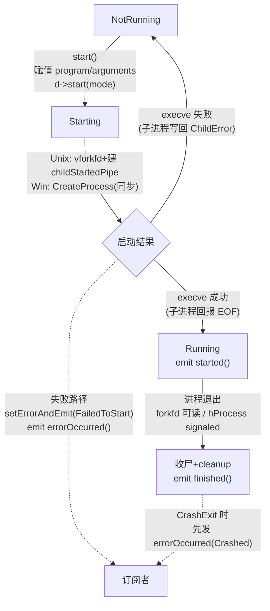

# 现代Qt开发教程（专家篇）1.10——QProcess 进程启动源码拆解

## 1. 前言——子进程是怎么变成「流设备」的

调外部程序，`QProcess` 是 Qt 给的标准答案。入门用法谁都熟：`start("ls", {"-l"})`，然后 `readAllStandardOutput()` 把输出捞回来。但稍微往深里踩两脚，就会撞上一堆答不上来的问题。

笔者先把当年自己被问住的那几个摆出来。`QProcess` 继承自 `QIODevice`，可一个「跑着的程序」凭啥能被当成「文件」来 `read`/`write`？Unix 上启动子进程，老教材说 Qt 用 `fork`+`exec`，又有博客信誓旦旦讲 Qt6 改用了 `posix_spawn`——到底哪个是真的？子进程死了，父进程是怎么「知道」的，是不是装了个全局 `SIGCHLD` 处理器？还有 `terminate()`，在 Windows 上调一个 console 程序，怎么纹丝不动？最后这个最坑：有人写 `connect(proc, SIGNAL(error()), ...)`，编译能过、运行就是收不到——凭啥？

这些问题，都压在 `QProcess` 设计的几条主轴上：身份（继承 `QIODevice` 的不对称 IO 契约）、状态机（`NotRunning`/`Starting`/`Running` 三态怎么转）、平台分叉（Unix 走 `vforkfd`、Windows 走 `CreateProcessW`，两套几乎平行的实现）、以及死亡收割（`forkfd` 把进程死亡事件化，绕开 `SIGCHLD`）。

入门篇的进程章节教了 `QProcess` 怎么调起来收输出，进阶篇补了状态机和 `ChannelMode`。本篇要往源码里捅：咱们打开 `qprocess.cpp` 和 `qprocess_unix.cpp`/`qprocess_win.cpp`，看看 `start()` 真正干了什么、子进程是怎么被 `fork` 出来的、死亡通知怎么飞回来。

边界先划清楚。`QProcess` 继承的 `QIODevice` 基类契约（`readData`/`writeData` 纯虚、`QRingBuffer` 缓冲），咱们在 [8.QIODevice 与 QFile](./08-file-io-iodevice-expert.md) 里拆过，本篇只补一条「`QProcess` 怎么实现这俩虚函数、为什么不对称」。`QSocketNotifier`/`QWinEventNotifier` 作为「fd/句柄的事件化监听者」只点到为止，它俩怎么挂进事件循环是 [7.事件循环篇](./07-event-loop-internals-expert.md) 的主场。

## 2. 环境说明

本篇源码引用基于 `qt_src/qt6.9.1`，行号随 Qt 版本会漂移，对照阅读时拿函数名定位最稳。`QProcess` 的实现和 `QThread` 一样分公共部分和平台部分，涉及的关键文件：

| 文件 | 角色 |
|---|---|
| `qtbase/src/corelib/io/qprocess.h` | QProcess 公共声明（枚举 + 公开 API） |
| `qtbase/src/corelib/io/qprocess.cpp` | 跨平台实现：start/状态机/信号发射/waitFor 族 |
| `qtbase/src/corelib/io/qprocess_p.h` | QProcessPrivate + Channel 结构 |
| `qtbase/src/corelib/io/qprocess_unix.cpp` | Unix：vforkfd/管道 dup2/收割 |
| `qtbase/src/corelib/io/qprocess_win.cpp` | Win：CreateProcessW/EnumWindows 终止 |
| `qtbase/src/3rdparty/forkfd/forkfd.h` | forkfd 库（vforkfd/forkfd_wait/forkfd_info） |

本篇无配套 example，原因和前几篇一样：纯源码拆解，对照 `qt_src` 翻代码就是最好的实验。

## 3. 核心概念讲解

下源码之前，咱们先把 `QProcess` 的状态机和启动链路对一下。这张图能帮您看清从 `start()` 到 `finished()` 中间发生了什么：



`QProcess` 的 `processState` 在三态间走：`NotRunning` → `Starting` → `Running`，死亡后退回 `NotRunning`。`started()` 在确认 `execve` 成功后发；`finished()` 带退出码和退出状态发。失败路径上还会插一个 `errorOccurred()`。咱们这一篇就顺着这条时间线拆。

### 3.1 继承 QIODevice：不对称的 IO 契约

一切的根子在这行声明，笔者先把这张底牌亮出来：

`qt_src/qt6.9.1/qtbase/src/corelib/io/qprocess.h:81`

```cpp
class Q_CORE_EXPORT QProcess : public QIODevice
{
    Q_OBJECT
```

继承 `QIODevice`，意味着 `read()`/`write()`/`waitForReadyRead()` 这些 IO 接口语义直接复用——这就是 Qt 把「跑着的子进程」抽象成「流设备」的根基。但这个抽象有个关键的不对称：子进程的 stdin 是您写进去的，stdout/stderr 是您读出来的。所以 `QProcess` 实现的 `readData` 和 `writeData` 长得完全不一样。

先看跨平台的 `readData`：

`qt_src/qt6.9.1/qtbase/src/corelib/io/qprocess.cpp:2124-2132`

```cpp
qint64 QProcess::readData(char *data, qint64 maxlen)
{
    Q_D(QProcess);
    Q_UNUSED(data);
    if (!maxlen)
        return 0;
    if (d->processState == QProcess::NotRunning)
        return -1;              // EOF
    return 0;
}
```

奇怪，它根本没从管道读数据。进程已死就返 `-1` 报 EOF，其余情况返 `0`——返 0 的意思是「我这次没读到，您去查 `QIODevice` 的 `readBuffer` 吧」。真正的管道读取发生在 `QProcessPrivate::tryReadFromChannel`，它把数据填进 `readBuffer`，然后 `QIODevice::read` 才从缓冲区捞。

那 `writeData` 呢？您在 `qprocess.cpp` 里找不到跨平台的 `writeData` 实现——因为它是平台相关的：Unix 上直接 `::write` 往管道写，Windows 上用 `QWindowsPipeWriter`。这就是不对称的根源：读可以统一（都是往 `readBuffer` 塞），写得分平台（管道写法不同）。

还有一个容易看漏的点。`QProcess` 同时发两套读信号：

`qt_src/qt6.9.1/qtbase/src/corelib/io/qprocess.cpp:1123-1188`（节选）

```cpp
if (currentReadChannel == channelIdx) {
    didRead = true;
    if (!emittedReadyRead) {
        QScopedValueRollback<bool> guard(emittedReadyRead, true);
        emit q->readyRead();
    }
}
emit q->channelReadyRead(int(channelIdx));
if (channelIdx == QProcess::StandardOutput)
    emit q->readyReadStandardOutput(QProcess::QPrivateSignal());
else
    emit q->readyReadStandardError(QProcess::QPrivateSignal());
```

一套是 `QIODevice` 继承来的 `readyRead`，只在「当前读通道」等于本通道时才发；另一套是 `QProcess` 专属的 `readyReadStandardOutput`/`readyReadStandardError`，无论当前通道是啥都发。这就是为啥您 `setReadChannel(StandardError)` 切去读 stderr 时，stdout 的数据照样能被 `readyReadStandardOutput` 通知到——而 `readyRead` 这会儿是哑的。那个 `emittedReadyRead` 回滚标志是防重入：避免一次 readable 触发嵌套的 `readyRead`。

### 3.2 三态状态机，以及一个 protected 的坑

`QProcess` 的进程只有三个状态：

`qt_src/qt6.9.1/qtbase/src/corelib/io/qprocess.h:98-102`

```cpp
enum ProcessState {
    NotRunning,
    Starting,
    Running
};
```

`Starting` 表示已经调了 `fork`/`CreateProcess`，但还没确认子进程 `execve` 成功（中间这个窗口期）；`Running` 表示子进程已经成功换装成目标程序。这个区分很关键——「进程已 fork」不等于「程序已跑起来」。

接下来这个坑，笔者当年亲手踩过。很多人想在外部手动拨状态，比如 `proc->setProcessState(QProcess::Running)` 之类的写法。您去看头文件：

`qt_src/qt6.9.1/qtbase/src/corelib/io/qprocess.h:261-262`

```cpp
protected:
    void setProcessState(ProcessState state);
```

`protected`。普通用户代码压根调不到。状态只能由 `QProcess` 内部的 `start`/`_q_startupNotification`/`finished` 驱动。子类可以重写它，但「子类化 QProcess」在 Qt6 里已经是被劝退的用法了（组合优于继承）。

这个 `setProcessState` 内部长啥样？朴素得让人意外：

`qt_src/qt6.9.1/qtbase/src/corelib/io/qprocess.cpp:2103-2109`

```cpp
void QProcess::setProcessState(ProcessState state)
{
    Q_D(QProcess);
    if (d->processState == state)
        return;
    d->processState = state;
    emit stateChanged(state, QPrivateSignal());
}
```

没有任何业务校验，纯状态写入加信号广播。真正决定「何时切态」的逻辑全在 `startProcess`/`_q_startupNotification`/`_q_processDied` 里——`setProcessState` 只是个传声筒。

### 3.3 start 的完整调用链

咱们顺着 `start()` 往下追。先看入口：

`qt_src/qt6.9.1/qtbase/src/corelib/io/qprocess.cpp:2212-2228`

```cpp
void QProcess::start(const QString &program, const QStringList &arguments, OpenMode mode)
{
    Q_D(QProcess);
    if (d->processState != NotRunning) {
        qWarning("QProcess::start: Process is already running");
        return;
    }
    if (program.isEmpty()) {
        d->setErrorAndEmit(QProcess::FailedToStart, tr("No program defined"));
        return;
    }
    d->program = program;
    d->arguments = arguments;
    d->start(mode);
}
```

`start(program, args, mode)` 这个重载看着干活，其实只干了三件事：查「是不是已经在跑」（是的话打 warning 直接返回）、查「program 是不是空」（空的话直接 `FailedToStart`）、给 `d->program`/`d->arguments` 赋值，然后转调 `d->start(mode)`。真正干活的在私有类的 `start` 末尾：

`qt_src/qt6.9.1/qtbase/src/corelib/io/qprocess.cpp:2387-2424`（节选）

```cpp
void QProcessPrivate::start(QIODevice::OpenMode mode)
{
    Q_Q(QProcess);
    // ...
    q->QIODevice::open(mode);

    if (q->isReadable() && processChannelMode != QProcess::MergedChannels)
        setReadChannelCount(2);

    stdinChannel.closed = false;
    stdoutChannel.closed = false;
    stderrChannel.closed = false;

    exitCode = 0;
    exitStatus = QProcess::NormalExit;
    processError = QProcess::UnknownError;
    errorString.clear();
    startProcess();
}
```

这段是跨平台预处理：先 `QIODevice::open`，按 `channelMode` 决定读通道数（`MergedChannels` 时只有一个读通道，因为 stderr 被并进 stdout 了），重置 `exitCode`/`exitStatus`/`processError`/`errorString`，末尾调 `startProcess()`——这一调就分派到 `qprocess_unix.cpp` 或 `qprocess_win.cpp` 了。

启动结果怎么回报回来？枢纽是 `_q_startupNotification` 这个私有槽：

`qt_src/qt6.9.1/qtbase/src/corelib/io/qprocess.cpp:1270-1291`

```cpp
bool QProcessPrivate::_q_startupNotification()
{
    Q_Q(QProcess);
    QString errorMessage;
    if (processStarted(&errorMessage)) {
        q->setProcessState(QProcess::Running);
        emit q->started(QProcess::QPrivateSignal());
        return true;
    }
    q->setProcessState(QProcess::NotRunning);
    setErrorAndEmit(QProcess::FailedToStart, errorMessage);
#ifdef Q_OS_UNIX
    waitForDeadChild();
#endif
    cleanup();
    return false;
}
```

成功就切 `Running` 加发 `started`；失败就切回 `NotRunning` 加 `setErrorAndEmit(FailedToStart)`，Unix 上还得 `waitForDeadChild` 把那个已经 fork 出来但 execve 失败的中间子进程收掉（否则成僵尸）。成功与否的判定在 Unix 上尤其巧妙，咱们下一节细看。

### 3.4 Unix 进程创建：是 vforkfd，不是 posix_spawn

重头戏来了。这是本篇最大的纠偏点。网上到处流传「Qt6 改用 `posix_spawn` 优化进程启动」，笔者翻烂了 `qprocess_unix.cpp`，可以负责任地告诉您：一个字都没有。`posix_spawn` 在整个 `qprocess_unix.cpp`、`qprocess_win.cpp`、`qprocess.cpp` 三个文件里零出现。

Qt6 真正用的是 forkfd 库的 `vforkfd`：

`qt_src/qt6.9.1/qtbase/src/corelib/io/qprocess_unix.cpp:331-335`

```cpp
int startChild(pid_t *pid)
{
    int ffdflags = FFD_CLOEXEC | (isUsingVfork ? 0 : FFD_USE_FORK);
    return ::vforkfd(ffdflags, pid, &QChildProcess::startProcess, this);
}
```

`vforkfd` 是 Qt 自带的 forkfd 库（`src/3rdparty/forkfd/`）提供的接口。它的设计思想是：把「创建子进程」和「监听子进程死亡」统一成一个文件描述符——返回的 `forkfd` 在子进程死亡时会变成可读，Linux 上底层用 `pidfd_open` 系统调用实现。`FFD_CLOEXEC` 让这个 fd 默认 close-on-exec。

注意那个 `isUsingVfork ? 0 : FFD_USE_FORK`——这说明 vfork 不是无条件的。运行时抉择在 `globalUsingVfork`：

`qt_src/qt6.9.1/qtbase/src/corelib/io/qprocess_unix.cpp:641-667`

```cpp
inline bool globalUsingVfork() noexcept
{
#if defined(__SANITIZE_ADDRESS__) || __has_feature(address_sanitizer)
    // ASan writes to global memory, so we mustn't use vfork().
    return false;
#endif
    // ... TSan 同理 ...
#if defined(Q_OS_LINUX) && !QT_CONFIG(forkfd_pidfd)
    return false;
#endif
#if defined(Q_OS_DARWIN)
    // Using vfork() for startDetached() is causing problems.
    return false;
#endif
    return __interceptor_vfork == nullptr;
}
```

五类环境自动禁用 vfork 回退到 fork：开了 ASan（vfork 共享地址空间，ASan 写全局内存会污染父进程）、开了 TSan、Linux 但编译关了 `forkfd_pidfd`、macOS（Darwin 上 startDetached 有问题）、运行时检测到链接了 libasan/libtsan（`__interceptor_vfork == nullptr` 那行）。其余环境——主要是 Linux 且 pidfd 启用——走 vfork 省 fork 的地址空间复制开销。

子进程一侧的换装逻辑在 `QChildProcess::startProcess`：

`qt_src/qt6.9.1/qtbase/src/corelib/io/qprocess_unix.cpp:928-972`（节选）

```cpp
void QChildProcess::startProcess() const noexcept
{
    d->commitChannels();
    qt_safe_close(d->childStartedPipe[0]);
    if (workingDirectory >= 0 && fchdir(workingDirectory) == -1)
        failChildProcess(d, "fchdir", errno);
    // ... 组装 argv/envp ...
    if (!envp.pointers)
        qt_safe_execv(argv[0], argv);
    else
        qt_safe_execve(argv[0], argv, envp);
    failChildProcess(d, "execve", errno);
}
```

子进程干五件事：`commitChannels`（把管道 dup2 到 STDIN/STDOUT/STDERR，下一节细讲）、关掉 `childStartedPipe` 的读端、`fchdir` 到预打开的工作目录 fd、按是否设环境选 `qt_safe_execv` 还是 `qt_safe_execve`、任一步失败走 `failChildProcess`。`qt_safe_execve` 是 Qt 包了一层 EINTR 重试的 `execve`（`qt_src/qt6.9.1/qtbase/src/corelib/kernel/qcore_unix_p.h:381-385`），成功不返回，失败才落到 `failChildProcess`。

这里有个设计精妙的地方，笔者第一次看的时候愣了一下：子进程怎么告诉父进程「我 execve 成功了」？答案是靠 `childStartedPipe` 这个管道的沉默。看失败路径：

`qt_src/qt6.9.1/qtbase/src/corelib/io/qprocess_unix.cpp:802-816`

```cpp
Q_NORETURN void
failChildProcess(const QProcessPrivate *d, const char *description, int code) noexcept
{
    ChildError error = {};
    error.code = code;
    qstrncpy(error.function, description, sizeof(error.function));
    qt_safe_write(d->childStartedPipe[1], &error, sizeof(error));
    _exit(-1);
}
```

失败时往 `childStartedPipe[1]` 写一个 `ChildError` 结构体（函数名 + errno），然后 `_exit(-1)`。那成功呢？成功就什么都不写——`execve` 成功后子进程的镜像已经被目标程序替换，`childStartedPipe[1]` 这个 fd 因为 `FFD_CLOEXEC` 在 execve 时自动关闭，父进程读 `childStartedPipe[0]` 就会读到 EOF（ret==0）。EOF 就是「成功」的信号，有数据就是「失败」。父进程这边的判定：

`qt_src/qt6.9.1/qtbase/src/corelib/io/qprocess_unix.cpp:974-1004`（节选）

```cpp
bool QProcessPrivate::processStarted(QString *errorMessage)
{
    Q_Q(QProcess);
    ChildError buf;
    ssize_t ret = qt_safe_read(childStartedPipe[0], &buf, sizeof(buf));
    // ...
    if (ret <= 0) {  // process successfully started
        if (stateNotifier) {
            QObject::connect(stateNotifier, SIGNAL(activated(QSocketDescriptor)),
                             q, SLOT(_q_processDied()));
            stateNotifier->setSocket(forkfd);
            stateNotifier->setEnabled(true);
        }
        // ...
        return true;
    }
```

`ret <= 0`（EOF 或暂无数据）视为成功。成功后立刻干一件关键的事：把 `stateNotifier` 从监听 `childStartedPipe` 切换成监听 `forkfd`——也就是从「等启动结果」切换到「等进程死亡」。一个 notifier，两个阶段，靠 `setSocket` 换监听对象。这个复用笔者觉得很漂亮。

为啥子进程失败要用 `_exit` 而不是 `return` 或 `exit`？因为 vfork 出来的子进程和父进程共享地址空间和栈，`return` 会弹栈破坏父进程，`exit` 会跑 atexit 析构（在 vfork 上下文里是未定义行为）。只有 `_exit` 直接进内核终止才是安全的。这也是 Qt 在能用 vfork 的环境里小心伺候的地方。

### 3.5 Windows 进程创建：CreateProcess 加一个 native 后门

Windows 这边是另一套平行实现。和 Unix 最大的区别：`CreateProcessW` 是同步调用，返回就知道成败，不像 Unix 那样要靠 `childStartedPipe` 异步回报。

`qt_src/qt6.9.1/qtbase/src/corelib/io/qprocess_win.cpp:531-604`（节选）

```cpp
void QProcessPrivate::startProcess()
{
    Q_Q(QProcess);
    pid = new PROCESS_INFORMATION;
    memset(pid, 0, sizeof(PROCESS_INFORMATION));
    q->setProcessState(QProcess::Starting);
    if (!openChannels()) { /* ... */ cleanup(); return; }
    QString args = qt_create_commandline(program, arguments, nativeArguments);
    // ...
    DWORD dwCreationFlags = (GetConsoleWindow() ? 0 : CREATE_NO_WINDOW);
    dwCreationFlags |= CREATE_UNICODE_ENVIRONMENT;
    STARTUPINFOW startupInfo = createStartupInfo();
    // ...
    QProcess::CreateProcessArguments cpargs = {
        nullptr, reinterpret_cast<wchar_t *>(args.data_ptr().data()),
        nullptr, nullptr, true, dwCreationFlags,
        environment.inheritsFromParent() ? nullptr : envlist.data(),
        /* currentDirectory */, &startupInfo, pid
    };

    if (!callCreateProcess(&cpargs)) {
        QString errorString = QProcess::tr("Process failed to start: %1").arg(qt_error_string());
        cleanup();
        setErrorAndEmit(QProcess::FailedToStart, errorString);
        return;
    }
    // ...
    q->setProcessState(QProcess::Running);
    // ...
    if (threadData.loadRelaxed()->hasEventDispatcher()) {
        processFinishedNotifier = new QWinEventNotifier(pid->hProcess, q);
        QObject::connect(processFinishedNotifier, SIGNAL(activated(HANDLE)), q, SLOT(_q_processDied()));
        processFinishedNotifier->setEnabled(true);
    }
    _q_startupNotification();
}
```

几个值得拎出来的细节。`dwCreationFlags` 里那个 `GetConsoleWindow() ? 0 : CREATE_NO_WINDOW`——父进程没有控制台（典型 GUI 程序）时，给子进程加 `CREATE_NO_WINDOW`，免得启动 console 子进程时弹个黑框。`CREATE_UNICODE_ENVIRONMENT` 是因为环境块用宽字符传。`bInheritHandles=true`（那个 `true`）是必须的，否则管道句柄继承不进子进程。成功后立刻 `setRunning`，再用 `QWinEventNotifier` 监听 `pid->hProcess`——这就是 Windows 版的「进程死亡事件化」，内核对象 signaled 时触发 `activated`，对应 Unix 那边的 `forkfd` notifier。

注意：真正调 `CreateProcessW` 的地方不在 531 行（531 是 `startProcess` 函数头），而在 `callCreateProcess` 内部。而 `callCreateProcess` 里藏着一个 Windows 用户的「官方后门」：

`qt_src/qt6.9.1/qtbase/src/corelib/io/qprocess_win.cpp:507-515`

```cpp
bool QProcessPrivate::callCreateProcess(QProcess::CreateProcessArguments *cpargs)
{
    if (modifyCreateProcessArgs)
        modifyCreateProcessArgs(cpargs);
    bool success = CreateProcess(cpargs->applicationName, cpargs->arguments,
                                 cpargs->processAttributes, cpargs->threadAttributes,
                                 cpargs->inheritHandles, cpargs->flags, cpargs->environment,
                                 cpargs->currentDirectory, cpargs->startupInfo,
                                 cpargs->processInformation);
```

`createProcessArgumentsModifier` 让您在真正调 `CreateProcessW` 之前，改 `STARTUPINFO`、`dwCreationFlags`、环境块等所有参数。这是 Qt 给 Windows 用户的逃生口——当 `QProcess` 的抽象不够用、需要直接动 native API 时，从这里钩进去。

这里笔者要纠正一个常见误解：`createProcessArgumentsModifier` 不是跨平台的。看头文件：

`qt_src/qt6.9.1/qtbase/src/corelib/io/qprocess.h:160-207`（节选）

```cpp
#if defined(Q_OS_WIN) || defined(Q_QDOC)
    QString nativeArguments() const;
    void setNativeArguments(const QString &arguments);
    struct CreateProcessArguments { /* ... */ };
    typedef std::function<void(CreateProcessArguments *)> CreateProcessArgumentModifier;
    CreateProcessArgumentModifier createProcessArgumentsModifier() const;
    void setCreateProcessArgumentsModifier(CreateProcessArgumentModifier modifier);
#endif // Q_OS_WIN || Q_QDOC
#if defined(Q_OS_UNIX) || defined(Q_QDOC)
    std::function<void(void)> childProcessModifier() const;
    void setChildProcessModifier(const std::function<void(void)> &modifier);
    // ... UnixProcessFlag ...
#endif
```

它被 `#if defined(Q_OS_WIN) || defined(Q_QDOC)` 包着。注意那个 `Q_QDOC`——这是生成文档时定义的宏，所以您在 Qt 官方文档里看着这个 API 像是跨平台存在的，但在非 Windows 平台编译期它根本不存在。Unix 上的对等物是 `childProcessModifier`（一个在子进程 fork 后、execve 前调用的 `std::function<void()>`），外加较新加的 `UnixProcessParameters`/`UnixProcessFlag`。

顺带提一句 Qt5 老 API 的迁移。Qt5 里有个虚函数 `setupChildProcess()`，让您重写来改子进程环境。Qt6 把它改成了返回一个故意无法构造的类型的 deprecated 桩：

`qt_src/qt6.9.1/qtbase/src/corelib/io/qprocess.h:272-279`

```cpp
#if QT_VERSION < QT_VERSION_CHECK(7,0,0)
    // ### Qt7: Remove this struct and the virtual function; they're here only
    // to cause build errors in Qt 5 code that wasn't updated to Qt 6's
    // setChildProcessModifier()
    struct Use_setChildProcessModifier_Instead {};
    QT_DEPRECATED_X("Use setChildProcessModifier() instead")
    virtual Use_setChildProcessModifier_Instead setupChildProcess();
#endif
```

任何 `override` 这个老虚函数的代码都会编译失败（因为返回类型 `Use_setChildProcessModifier_Instead` 没法构造），强制您迁移到 `setChildProcessModifier`。Qt7 会把它彻底删掉。这种「故意制造编译错误来逼用户迁移」的手法，Qt 在跨大版本时经常用。

### 3.6 管道与 ChannelMode 五态

回头补 `commitChannels` 的细节——3.4 节里子进程换装时调的那个。这是 `ChannelMode` 真正生效的地方。

`ChannelMode` 有五个值：

`qt_src/qt6.9.1/qtbase/src/corelib/io/qprocess.h:108-115`

```cpp
enum ProcessChannelMode {
    SeparateChannels,
    MergedChannels,
    ForwardedChannels,
    ForwardedOutputChannel,
    ForwardedErrorChannel
};
```

`SeparateChannels`（默认，stdout/stderr 各走各的管）、`MergedChannels`（stderr 并进 stdout）、`ForwardedChannels`（俩都直接转发到父进程的 stdout/stderr，不建管）、后两个只转发其一。

`MergedChannels` 在 Unix 上怎么实现的？就是子进程里把 STDOUT 再 dup2 一份到 STDERR：

`qt_src/qt6.9.1/qtbase/src/corelib/io/qprocess_unix.cpp:583-599`

```cpp
void QProcessPrivate::commitChannels() const
{
    if (stdinChannel.pipe[0] != INVALID_Q_PIPE)
        qt_safe_dup2(stdinChannel.pipe[0], STDIN_FILENO, 0);
    if (stdoutChannel.pipe[1] != INVALID_Q_PIPE)
        qt_safe_dup2(stdoutChannel.pipe[1], STDOUT_FILENO, 0);
    if (stderrChannel.pipe[1] != INVALID_Q_PIPE) {
        qt_safe_dup2(stderrChannel.pipe[1], STDERR_FILENO, 0);
    } else {
        // merge stdout and stderr if asked to
        if (processChannelMode == QProcess::MergedChannels)
            qt_safe_dup2(STDOUT_FILENO, STDERR_FILENO, 0);
    }
}
```

逻辑是：先把各自的管道 dup2 到标准 fd。如果 stderr 没建管（`MergedChannels` 时 Qt 压根不给 stderr 建管，所以 `pipe[1] == INVALID_Q_PIPE`），并且模式是 `MergedChannels`，就把 STDOUT 再 dup2 到 STDERR——这样 stderr 写的东西全进了 stdout 那根管。经典 dup2 重定向。

Windows 上不一样，不走 dup2，而是在构造 `STARTUPINFOW` 时把 `hStdError` 直接填成 `hStdOutput` 同一个句柄：

`qt_src/qt6.9.1/qtbase/src/corelib/io/qprocess_win.cpp:485-505`（节选）

```cpp
Q_PIPE stderrPipe = stderrChannel.pipe[1];
if (stderrPipe == INVALID_Q_PIPE) {
    stderrPipe = (processChannelMode == QProcess::MergedChannels)
                 ? stdoutPipe
                 : GetStdHandle(STD_ERROR_HANDLE);
}

return STARTUPINFOW{
    sizeof(STARTUPINFOW), 0, 0, 0,
    (ulong)CW_USEDEFAULT, (ulong)CW_USEDEFAULT,
    (ulong)CW_USEDEFAULT, (ulong)CW_USEDEFAULT,
    0, 0, 0,
    STARTF_USESTDHANDLES,
    0, 0, 0,
    stdinPipe, stdoutPipe, stderrPipe
};
```

同一个 `stdoutPipe` 喂给 `hStdOutput` 和 `hStdError`，效果一样。`dwFlags` 里那个 `STARTF_USESTDHANDLES` 必须有，否则这三个 handle 不生效。

最后提醒一个时序陷阱。`setProcessChannelMode` 这个 setter 没有任何副作用：

`qt_src/qt6.9.1/qtbase/src/corelib/io/qprocess.cpp:1359-1361`

```cpp
void QProcess::setProcessChannelMode(ProcessChannelMode mode)
{
    Q_D(QProcess);
    d->processChannelMode = mode;
}
```

它只改 `d->processChannelMode` 这个标志。真正的「按 mode 决定建不建管、怎么 dup2」发生在 `startProcess` → `openChannels` → `commitChannels` 链里。所以您在进程已经 `Running` 之后调 `setProcessChannelMode`，啥也不会发生——文档原话是「This mode will be used the next time start() is called」。必须在 `start()` 之前调。这条笔者单独拎到踩坑里讲。

### 3.7 死亡收割：forkfd 把进程死亡事件化

子进程死了，父进程怎么知道？这是本篇第二个大纠偏点。

老教材和不少博客会告诉您：Qt 装了个全局 `SIGCHLD` 处理器，配合一个 `QProcessManager` 单例，把 `waitpid` 的结果路由回正确的 `QProcess`。这套说法在 Qt4 和早期 Qt5 是对的。但 Qt6 不是了。

笔者在 `qt_src` 里 grep 了整个 `qtbase/src`，`QProcessManager` 这个类零命中。Qt6 既没有全局 `SIGCHLD` 处理器，也没有 `QProcessManager` 单例。它靠的是 forkfd 把「子进程死亡」包装成一个可读的文件描述符——这和 3.4 节启动时拿到的那个 `forkfd` 是同一个东西。Linux 上底层用 `pidfd_open` 系统调用，进程死亡时内核把这个 fd 标记成可读。

看 Unix 的收割实现：

`qt_src/qt6.9.1/qtbase/src/corelib/io/qprocess_unix.cpp:1293-1310`

```cpp
void QProcessPrivate::waitForDeadChild()
{
    Q_ASSERT(forkfd != -1);
    forkfd_info info = {};
    int ret;
    QT_EINTR_LOOP(ret, forkfd_wait(forkfd, &info, nullptr));

    exitCode = info.status;
    exitStatus = info.code == CLD_EXITED ? QProcess::NormalExit : QProcess::CrashExit;

    delete stateNotifier;
    stateNotifier = nullptr;

    QT_EINTR_LOOP(ret, forkfd_close(forkfd));
    forkfd = -1; // Child is dead, don't try to kill it anymore
}
```

`forkfd_wait` 阻塞等子进程死亡（异步路径下其实根本不调它，是 `QSocketNotifier` 监听 `forkfd` 可读后触发 `_q_processDied` 再走到这）。结果填进 `forkfd_info`：

`qt_src/qt6.9.1/qtbase/src/3rdparty/forkfd/forkfd.h:50-53`

```cpp
struct forkfd_info {
    int32_t code;
    int32_t status;
};
```

`code` 是 `CLD_EXITED`/`CLD_KILLED`/`CLD_DUMPED` 这种 `waitid` 风格的值，`status` 是退出码或信号号。判定 CrashExit 看的就是 `code`：等于 `CLD_EXITED` 是正常退出，否则是被信号干掉的崩溃。

这套设计的好处是什么？笔者给您捋一下老 `SIGCHLD` 方案的痛点：信号是进程级的，一个 `SIGCHLD` 处理器要服务所有 `QProcess` 实例，得自己维护「pid → QProcess」的映射，还得在信号处理器这种异步上下文里小心再小心（能用哪些 async-signal-safe 函数）。forkfd 把每个子进程死亡都变成一个独立的 fd 事件，挂进 Qt 的事件循环（`QSocketNotifier`）就完事了——和多 `QProcess` 实例天然隔离，不用全局协调。这是 Qt6 架构上的一次干净替换。

Windows 这边对应物是 `QWinEventNotifier` 监听 `hProcess`，3.5 节已经贴过。但 Windows 的退出码判定比 Unix 玄学得多：

`qt_src/qt6.9.1/qtbase/src/corelib/io/qprocess_win.cpp:796-808`

```cpp
void QProcessPrivate::findExitCode()
{
    DWORD theExitCode;
    Q_ASSERT(pid);
    if (GetExitCodeProcess(pid->hProcess, &theExitCode)) {
        exitCode = theExitCode;
        if (exitCode == KillProcessExitCode
                || (theExitCode >= 0x80000000 && theExitCode < 0xD0000000))
            exitStatus = QProcess::CrashExit;
        else
            exitStatus = QProcess::NormalExit;
    }
}
```

Windows 没有 Unix 那种「exit 退出」和「被信号杀死」的明确区分，只能从退出码猜。两条规则：退出码等于 `KillProcessExitCode`，或者落在 `0x80000000` 到 `0xD0000000` 这个 NT 异常 STATUS 范围（比如 `0xC0000005` 是 ACCESS_VIOLATION，段错误），就算 CrashExit。

那个 `KillProcessExitCode` 是 Qt 自己定的魔数：

`qt_src/qt6.9.1/qtbase/src/corelib/io/qprocess_win.cpp:31`

```cpp
constexpr UINT KillProcessExitCode = 0xf291;
```

为啥要这个？因为 Qt 的 `kill()` 走 `TerminateProcess`，得传个退出码。Qt 选了 `0xf291` 这个普通程序几乎不可能正常返回的值，这样 `findExitCode` 看到 `0xf291` 就知道「这是咱们自己 kill 的」，判成 CrashExit。这种「用魔数做标记」的小技巧，笔者觉得挺巧妙。

### 3.8 terminate 和 kill：跨平台语义严重不对称

`terminate()` 和 `kill()` 这俩 API，Unix 上语义清晰，Windows 上能让您大吃一惊。先看 Unix：

`qt_src/qt6.9.1/qtbase/src/corelib/io/qprocess_unix.cpp:1121-1137`

```cpp
void QProcessPrivate::terminateProcess()
{
    if (pid > 0)
        ::kill(pid, SIGTERM);
}

void QProcessPrivate::killProcess()
{
    if (pid > 0)
        ::kill(pid, SIGKILL);
}
```

`terminate` 发 `SIGTERM`（可被捕获、可被忽略，给程序优雅退出的机会），`kill` 发 `SIGKILL`（不可拦截，内核直接终结）。都是 `::kill()` 系统调用，只是信号不同。符合直觉。

Windows 这边就魔幻了。很多教材告诉您「Windows 上 terminate 也调 TerminateProcess」——错的：

`qt_src/qt6.9.1/qtbase/src/corelib/io/qprocess_win.cpp:631-653`

```cpp
static BOOL QT_WIN_CALLBACK qt_terminateApp(HWND hwnd, LPARAM procId)
{
    // ... 过滤出属于目标 pid 的窗口 ...
    if (...) {
        PostMessage(hwnd, WM_CLOSE, 0, 0);
    }
    return TRUE;
}

void QProcessPrivate::terminateProcess()
{
    if (pid) {
        EnumWindows(qt_terminateApp, (LPARAM)pid->dwProcessId);
        PostThreadMessage(pid->dwThreadId, WM_CLOSE, 0, 0);
    }
}

void QProcessPrivate::killProcess()
{
    if (pid)
        TerminateProcess(pid->hProcess, KillProcessExitCode);
}
```

Windows 的 `terminate()` 干了两件事：`EnumWindows` 枚举所有顶层窗口，过滤出属于目标进程的，逐个 `PostMessage(WM_CLOSE)`；再给主线程 `PostThreadMessage(WM_CLOSE)`。这是 Windows 上「软终止」的标准做法——对 GUI 程序有效，能触发它的关闭流程（弹「是否保存」之类）。但对没有消息循环的 console 程序，`WM_CLOSE` 消息发出去根本没人取，进程纹丝不动。这种情况您只能上 `kill()`，它才是硬 `TerminateProcess`。

这个不对称笔者专门拎到踩坑里讲——它是跨平台代码里最隐蔽的坑之一。

### 3.9 errorOccurred、waitFor* 超时、finished 时序

错误体系先看枚举：

`qt_src/qt6.9.1/qtbase/src/corelib/io/qprocess.h:85-92`

```cpp
enum ProcessError {
    FailedToStart,
    Crashed,
    Timedout,
    ReadError,
    WriteError,
    UnknownError
};
```

`FailedToStart` 是 execve/CreateProcess 失败，`Crashed` 是进程跑起来后被信号/异常干掉，`Timedout` 是 waitFor* 超时，`ReadError`/`WriteError` 是管道 IO 出错，`UnknownError` 是初始默认值。

接下来这个坑，笔者在 1.前言里埋过伏笔。有人写 `connect(proc, SIGNAL(error()), ...)` 收不到信号。原因看头文件：

`qt_src/qt6.9.1/qtbase/src/corelib/io/qprocess.h:217`

```cpp
    QProcess::ProcessError error() const;
```

`error()` 是个返回 `ProcessError` 的非虚函数，不是信号。Qt6 的 `Q_SIGNALS` 区段里只有这些：

`qt_src/qt6.9.1/qtbase/src/corelib/io/qprocess.h:252-256`

```cpp
Q_SIGNALS:
    void started(QPrivateSignal);
    void finished(int exitCode, QProcess::ExitStatus exitStatus = NormalExit);
    void errorOccurred(QProcess::ProcessError error);
    void stateChanged(QProcess::ProcessState processState, QPrivateSignal());
```

错误信号叫 `errorOccurred`，从 Qt 5.6 起取代了老的 `error()` 信号（老信号在 Qt6 已移除）。老代码里 `connect(..., SIGNAL(error()), ...)` 用的是旧式字符串连接，编译期查不出信号不存在，运行时静默失败——您就纳闷为啥收不到。这条也进踩坑。

`errorOccurred` 的唯一运行时发射点是 `setErrorAndEmit`：

`qt_src/qt6.9.1/qtbase/src/corelib/io/qprocess.cpp:1023-1028`

```cpp
void QProcessPrivate::setErrorAndEmit(QProcess::ProcessError error, const QString &description)
{
    Q_Q(QProcess);
    Q_ASSERT(error != QProcess::UnknownError);
    setError(error, description);
    emit q->errorOccurred(QProcess::ProcessError(processError));
}
```

注意它分两步：`setError` 只改状态和 `errorString`，不发信号；`emit errorOccurred` 才发。这个拆分有讲究：`waitFor*` 超时走的是同步路径，只调 `setError(Timedout)`，不 emit——因为同步等待里发信号没意义（调用方马上能从返回值和 `error()` 函数查到）。只有异步路径（启动失败、进程崩溃、管道出错）才走 `setErrorAndEmit`。

说到 `waitFor*`，默认超时是另一个坑：

`qt_src/qt6.9.1/qtbase/src/corelib/io/qprocess.h:222-225`

```cpp
    bool waitForStarted(int msecs = 30000);
    bool waitForReadyRead(int msecs = 30000) override;
    bool waitForBytesWritten(int msecs = 30000) override;
    bool waitForFinished(int msecs = 30000);
```

四个 `waitFor*` 默认都是 `30000` 毫秒，不是 `-1` 无限等。您要是跑个大任务，`waitForFinished()` 不传参，30 秒后它就返回 `false` 了——进程还活着，您却以为「等完了」。要无限等得显式传 `-1`。不过 `close()` 内部用的就是 `-1`：

`qt_src/qt6.9.1/qtbase/src/corelib/io/qprocess.cpp:1873-1882`

```cpp
void QProcess::close()
{
    Q_D(QProcess);
    emit aboutToClose();
    while (waitForBytesWritten(-1))
        ;
    kill();
    waitForFinished(-1);
    d->setWriteChannelCount(0);
    QIODevice::close();
}
```

`close()` 先把待写数据全部刷完（`waitForBytesWritten(-1)` 无限等），再 `kill()`，再 `waitForFinished(-1)` 无限等进程死透。保证 `close()` 返回时进程必死。这是析构链之外的另一条死等路径。

最后看进程死亡的完整时序。进程退出通知到达时，先抽干管道余数：

`qt_src/qt6.9.1/qtbase/src/corelib/io/qprocess.cpp:1210-1231`

```cpp
void QProcessPrivate::_q_processDied()
{
    // in case there is data in the pipeline and this slot by chance
    // got called before the read notifications, call these functions
    // so the data is made available before we announce death.
#ifdef Q_OS_WIN
    drainOutputPipes();
#else
    _q_canReadStandardOutput();
    _q_canReadStandardError();
#endif
    // Slots connected to signals emitted by the functions called above
    // might call waitFor*(), which would synchronously reap the process.
    // So check the state to avoid trying to reap a second time.
    if (processState != QProcess::NotRunning)
        processFinished();
}
```

注意那个注释：进程死亡通知和「管道有数据可读」通知可能乱序到达。如果死亡通知先到，这里会主动调一次 `_q_canReadStandardOutput`/`_q_canReadStandardError` 把管道里的余数读出来（触发对应的 `readyReadStandardOutput`/`readyReadStandardError`），再走 `processFinished`。这保证了「进程死前最后一批输出」不会因为死亡通知抢先到达而丢失——从用户视角看，`finished()` 之前一定拿到全部数据。

然后是 `processFinished`：

`qt_src/qt6.9.1/qtbase/src/corelib/io/qprocess.cpp:1236-1265`

```cpp
void QProcessPrivate::processFinished()
{
    Q_Q(QProcess);
#ifdef Q_OS_UNIX
    waitForDeadChild();
#else
    findExitCode();
#endif
    cleanup();
    if (exitStatus == QProcess::CrashExit)
        setErrorAndEmit(QProcess::Crashed);
    emit q->readChannelFinished();
    emit q->finished(exitCode, QProcess::ExitStatus(exitStatus));
}
```

顺序是：平台收尸（Unix `waitForDeadChild` / Win `findExitCode`）、`cleanup` 关管道、若是 `CrashExit` 才 `setErrorAndEmit(Crashed)`、发 `readChannelFinished`、最后发 `finished`。这里有个时序要点：崩溃退出时，`errorOccurred(Crashed)` 会先于 `finished` 发出。如果您两个信号都连了槽，别在 `errorOccurred` 里假设 `finished` 已经发过。

### 3.10 startDetached 的另一条路，以及一个源码彩蛋

最后补两个零散但有意思的点。

`startDetached` 是静态方法，启动一个「甩手」进程——父进程（Qt 程序）不收尸、不等它结束。它的 Unix 实现和普通 `start` 走的是完全不同的代码路径：

`qt_src/qt6.9.1/qtbase/src/corelib/io/qprocess_unix.cpp:1318-1354`（节选）

```cpp
bool QProcessPrivate::startDetached(qint64 *pid)
{
    // ...
    childStartedPipe[1] = startedPipe[1];   // for failChildProcess()
    pid_t childPid = childProcess.doFork([&] {
        ::setsid();
        qt_safe_close(startedPipe[0]);
        qt_safe_close(pidPipe[0]);
        pid_t doubleForkPid;
        if (childProcess.startChild(&doubleForkPid) == -1)
            failChildProcess(this, "fork", errno);
        qt_safe_write(pidPipe[1], &doubleForkPid, sizeof(pid_t));
        return 0;
    });
    // ...
```

不用 forkfd（因为父进程不收尸），改走经典的 daemon double-fork：第一次 fork 后 `setsid`（脱离控制终端，成为新会话首领），再第二次 fork 出真正的目标进程，中间那个子进程立刻退出，孙进程被 init 收养。这样启动的进程脱离了 Qt 程序的生命周期——Qt 程序退出，它照常跑。这就是「detached」的真正含义。

那个 `doFork` 模板：

`qt_src/qt6.9.1/qtbase/src/corelib/io/qprocess_unix.cpp:318-329`

```cpp
template <typename Lambda> int doFork(Lambda &&childLambda)
{
    pid_t pid;
    if (isUsingVfork) {
        QT_IGNORE_DEPRECATIONS(pid = vfork();)
    } else {
        pid = fork();
    }
    if (pid == 0)
        _exit(childLambda());
    return pid;
}
```

`isUsingVfork` 时调 `vfork`（注意 `QT_IGNORE_DEPRECATIONS` 抑制编译器对 `vfork` 的弃用警告），否则 `fork`。子进程统一走 `_exit(childLambda())` 而不是 `return`——还是 3.4 节讲的那个理由，vfork 下 `return` 会弹栈搞坏父进程。

收尾给您看个源码彩蛋，放松一下。`setProgram`/`setArguments` 这俩二段式 setter，运行中调会被拒：

`qt_src/qt6.9.1/qtbase/src/corelib/io/qprocess.cpp:2532-2539`

```cpp
void QProcess::setArguments(const QStringList &arguments)
{
    Q_D(QProcess);
    if (d->processState != NotRunning) {
        qWarning("QProcess::setProgram: Process is already running");
        return;
    }
    d->arguments = arguments;
}
```

仔细看那个 warning 文案——这是 `setArguments` 的函数体，warning 里写的却是「QProcess::setProgram」。copy-paste 留下的小 bug，从某个 Qt 版本一直留到了 6.9.1。无伤大雅，但您要是grep 日志找「setArguments」相关警告，会找不到——得搜「setProgram」才行。笔者翻到这行的时候笑了一下，Qt 这种工业级代码库也免不了这种小笔误。

## 4. 踩坑预防

本篇踩坑只讲源码里能直接对应、笔者自己也栽过的真坑，不给陌生场景编造。

### 4.1 setProcessChannelMode 必须在 start 之前调

后果：在 `Running` 状态下调 `setProcessChannelMode`，静默无效，不报错也不 warning，但下一次 `start()` 才生效。如果您以为「中途切 MergedChannels」能把已经分开的 stdout/stderr 合并，那是白调——管道在 `startProcess` 时就建好了，运行中没法重建。

正确做法：`start()` 之前设好。如果非要在运行中改，只能 `kill` 当前进程、重新 `start`。

### 4.2 Windows 上 terminate() 对 console 程序无效

后果：您 `terminate()` 一个没有消息循环的 Windows console 程序，它纹丝不动——`WM_CLOSE` 消息发出去没人取。您以为发了终止请求等它优雅退出，结果它一直占着资源，直到超时或者您手动 `kill()`。

根因是 3.8 节讲的：Windows `terminate()` 走的是 `EnumWindows`+`PostMessage(WM_CLOSE)`，依赖目标有窗口和消息循环。Unix 上发 `SIGTERM` 没这问题。

正确做法：跨平台代码里，如果您确定要终止（不是优雅请求），直接 `kill()`。要优雅终止，做好「Windows console 程序 terminate 无效」的预期，加超时兜底转 `kill()`。

### 4.3 waitFor* 默认超时 30000ms，不是无限等

后果：`waitForFinished()` 不传参，30 秒后返回 `false`，进程还活着。您要是按返回值判断「进程结束」，就会误以为任务完成了，其实还在后台跑。

根因是 3.9 节贴的声明，四个 `waitFor*` 默认 `msecs = 30000`。要无限等传 `-1`。

正确做法：跑长任务显式 `waitForFinished(-1)`，或者按业务设个合理上限并处理超时（检查 `state()` 决定是否 `kill`）。别依赖默认值。

### 4.4 error() 是函数不是信号，老代码 connect 失败

后果：Qt4/5 老 `connect(proc, SIGNAL(error()), this, SLOT(...))` 迁移到 Qt6，编译能过（旧式字符串连接不查信号存在性），运行时静默收不到任何错误通知。程序启动失败您都不知道，因为 `errorOccurred` 没人连。

根因是 3.9 节讲的：Qt6 的 `error()` 是返回 `ProcessError` 的函数，信号叫 `errorOccurred`（Qt 5.6 引入，老 `error()` 信号已删）。

正确做法：迁移到新式 `connect(proc, &QProcess::errorOccurred, this, &MyClass::onError)`，编译期就能查出来。顺带一提，老代码里读错误码用 `proc->error()`（函数调用），这个在 Qt6 还在，不冲突——冲突的只是那个同名信号。

## 5. 官方文档参考链接

- [QProcess Class Reference](https://doc.qt.io/qt-6/qprocess.html) —— 公开 API、枚举、信号总览
- [QProcess::start](https://doc.qt.io/qt-6/qprocess.html#start) —— start 重载族与 OpenMode
- [QProcess::errorOccurred](https://doc.qt.io/qt-6/qprocess.html#errorOccurred) —— 取代老 error() 信号（since 5.6）
- [QProcess::waitForFinished](https://doc.qt.io/qt-6/qprocess.html#waitForFinished) —— 默认 30000ms 超时说明
- [QProcess::setProcessChannelMode](https://doc.qt.io/qt-6/qprocess.html#setProcessChannelMode) —— ChannelMode 五态与「下次 start 生效」
- [QProcess::setChildProcessModifier](https://doc.qt.io/qt-6/qprocess.html#setChildProcessModifier) —— Unix 子进程修饰器（取代 setupChildProcess）

---

子进程这块，Qt 的设计哲学是把平台差异藏在统一的 IO 抽象后面——您写 `read`/`write`，底下 Unix 走 `vforkfd`+管道 dup2、Windows 走 `CreateProcessW`+句柄继承，两套实现几乎平行。但「统一抽象」不等于「语义一致」：`terminate()` 在 Unix 和 Windows 上是两回事，CrashExit 的判定逻辑各走各的，waitFor 的默认超时和 close 的死等也不一样。读懂源码的意义，就在于知道这套抽象在哪儿会漏底——然后您写跨平台代码时，就知道哪些地方得自己补判断。
