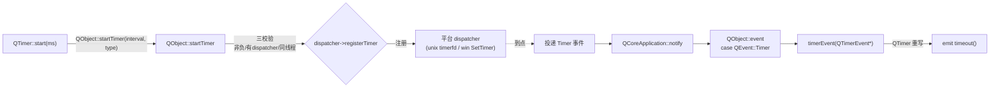

# 现代Qt开发教程（专家篇）1.11——QTimer 源码拆解

## 1. 前言——定时器，到底是谁在「定时」

写 Qt 的人，`QTimer` 用得太多了：拖个动画、轮询个状态、延迟执行，都离不开它。但您要是停下来想——`QTimer::start(1000)` 之后，这一秒到底是「谁」数的？是 `QTimer` 自己开了个计时线程在数吗？是操作系统硬件中断在叫它吗？多数人答不上来。

先抛几个笔者当年卡住的问题。`QTimer` 自己有没有计时能力？`timeout()` 信号是谁、在什么时机发射的？为什么文档里有个 `Qt::TimerType`，`CoarseTimer` 和 `PreciseTimer` 到底差在哪？还有那个 `QBasicTimer`，它比 `QTimer` 「轻」在哪？

这几个问题，压在 `QTimer` 设计的一条主轴上：它根本不是自己计时的，它是个基于事件循环的软件定时器。入门篇的 [11.定时器](../../beginner/01-qtbase/11-timer-beginner.md) 教了 `QTimer` 怎么用，进阶篇的 [11.QTimer 进阶](../../advanced/01-qtbase/11-qtimer-advanced.md) 讲了精度、单次这些用法。本篇要往源码里捅：咱们打开 `qtimer.cpp` 和 `qobject.cpp`，看看 `QTimer::start` 怎么经 `QObject::startTimer` 把活儿甩给线程的事件 dispatcher、dispatcher 到点怎么发 `Timer` 事件、`QTimer` 怎么在自己的 `timerEvent` 里把它转成 `timeout` 信号。顺着这条链，您会发现 `QTimer` 自己一行计时逻辑都没有。

边界先划清楚。事件 dispatcher（`QAbstractEventDispatcher`）在各个平台的具体实现——unix 用 timerfd/select、windows 用 `SetTimer`/消息循环——是 [07.事件循环篇](./07-event-loop-internals-expert.md) 的范畴，本篇只到 dispatcher 注册这一层，不深入平台定时器算法。`QChronoTimer`（Qt6 新增的 chrono 变体）是 `QTimer` 的近亲，不单独展开。

## 2. 环境说明

本篇源码引用基于 `qt_src/qt6.9.1`，行号随 Qt 版本会漂移，拿函数名定位最稳。涉及的关键文件：

| 文件 | 角色 |
|---|---|
| `qtbase/src/corelib/kernel/qtimer.h` / `qtimer.cpp` | QTimer 公共声明与实现（start/timerEvent/singleShot） |
| `qtbase/src/corelib/kernel/qtimer_p.h` | QTimerPrivate（single/inter 等 bindable 属性） |
| `qtbase/src/corelib/kernel/qbasictimer.h` / `.cpp` | QBasicTimer 轻量替代 |
| `qtbase/src/corelib/kernel/qobject.cpp` | startTimer/killTimer/event case Timer/timerEvent |
| `qtbase/src/corelib/kernel/qabstracteventdispatcher.h` | registerTimer/unregisterTimer 签名 |
| `qtbase/src/corelib/kernel/qsingleshottimer_p.h` / `.cpp` | singleShot 内部用的私有类 |
| `qtbase/src/corelib/global/qnamespace.h` | Qt::TimerType / Qt::TimerId 枚举 |

本篇无配套 example，原因和前几篇一样：纯源码拆解，对照 `qt_src` 翻代码就是最好的实验。

## 3. 核心概念讲解

下源码之前，咱们先把从 `start` 到 `timeout` 的全链路对一下。这张图能帮您看清 QTimer 在整条链里到底干了什么：



左半边是「注册」：`QTimer::start` 调 `QObject::startTimer`，后者校验完，把定时器注册到当前线程的 dispatcher。右半边是「派发」：dispatcher 到点投递一个 `Timer` 事件，事件循环送到 `QObject::event`，`event` 转给 `timerEvent` 虚函数，`QTimer` 重写的 `timerEvent` 在这一步发 `timeout` 信号。咱们这一篇顺着这条链拆。

### 3.1 软件定时器的地基——QTimer 自己不计时

一切的根子，笔者翻开源码第一眼看到的，是 `QTimer` 的继承关系：

`qt_src/qt6.9.1/qtbase/src/corelib/kernel/qtimer.h:19-21`

```cpp
class Q_CORE_EXPORT QTimer : public QObject
{
    Q_OBJECT
```

它继承 `QObject`。这不是凑巧——这是它作为「软件定时器」的地基：只有 `QObject` 才能挂在线程上、才能接收事件、才能发信号。`QTimer` 对外的唯一输出，是那个 `timeout` 信号：

`qt_src/qt6.9.1/qtbase/src/corelib/kernel/qtimer.h:114-115`

```cpp
Q_SIGNALS:
    void timeout(QPrivateSignal);
```

（那个 `QPrivateSignal` 是 Qt 内部标记，禁止用户代码直接 `emit timeout()`，但对您 `connect` 用完全没影响。）

那「`QObject` 收到 Timer 事件会怎样」？看 `QObject` 自己的 `timerEvent` 默认实现：

`qt_src/qt6.9.1/qtbase/src/corelib/kernel/qobject.cpp:1482-1484`

```cpp
void QObject::timerEvent(QTimerEvent *)
{
}
```

空的。一个普通的 `QObject`，哪怕您给它 `startTimer` 注册了定时器，Timer 事件来了也会被这个空函数「吞掉」——基类啥也不干。这正是 `QTimer` 存在的意义：它替您把 `timerEvent` 重写了，转成方便的 `timeout` 信号。您要是不嫌麻烦，完全可以不用 `QTimer`，自己继承 `QObject`、`startTimer`、重写 `timerEvent`——效果一样，只是麻烦。`QTimer` 就是这层麻烦的封装。

### 3.2 start 的注册链——把活儿甩给 dispatcher

`QTimer::start()`（无参版，读 `d->inter` 属性）内部第一件事，就是调 `QObject::startTimer`：

`qt_src/qt6.9.1/qtbase/src/corelib/kernel/qtimer.cpp:209-220`

```cpp
void QTimer::start()
{
    Q_D(QTimer);
    if (d->isActive()) // stop running timer
        stop();

    Qt::TimerId newId{ QObject::startTimer(d->inter * 1ms, d->type) };
    if (newId > Qt::TimerId::Invalid) {
        d->id = newId;
        d->isActiveData.notify();
    }
}
```

注意 `d->inter`（interval，毫秒）和 `d->type`（TimerType）都是属性，`setInterval`/`setTimerType` 设进去的——`start` 本身不接 TimerType 参数，它读这两个属性。如果 timer 已经在跑，先 `stop`（这意味着每次 `start` 都会拿一个新的 `id`）。真正干活的是 `QObject::startTimer`：

`qt_src/qt6.9.1/qtbase/src/corelib/kernel/qobject.cpp:1886-1912`

```cpp
int QObject::startTimer(std::chrono::nanoseconds interval, Qt::TimerType timerType)
{
    Q_D(QObject);
    using namespace std::chrono_literals;
    if (Q_UNLIKELY(interval < 0ns)) {
        qWarning("QObject::startTimer: Timers cannot have negative intervals");
        return 0;
    }
    auto thisThreadData = d->threadData.loadRelaxed();
    if (Q_UNLIKELY(!thisThreadData->hasEventDispatcher())) {
        qWarning("QObject::startTimer: Timers can only be used with threads started with QThread");
        return 0;
    }
    if (Q_UNLIKELY(thread() != QThread::currentThread())) {
        qWarning("QObject::startTimer: Timers cannot be started from another thread");
        return 0;
    }
    auto dispatcher = thisThreadData->eventDispatcher.loadRelaxed();
    Qt::TimerId timerId = dispatcher->registerTimer(interval, timerType, this);
    d->ensureExtraData();
    d->extraData->runningTimers.append(timerId);
    return int(timerId);
}
```

这段是「QTimer 是软件定时器」的硬证据，咱们逐句看。开头三道校验：`interval` 不能是负数；当前线程必须有事件 dispatcher（没事件循环的裸线程，定时器无处可挂，拒绝）；必须在对象自己所属的线程调（跨线程 `start` 拒绝）。三道都过了，才从当前线程的 `threadData` 取出 `eventDispatcher`，调它的 `registerTimer`——这个 dispatcher 就是事件循环背后那个平台特定的派发器。`QObject` 这边只把返回的 `timerId` 记到 `extraData->runningTimers` 列表里，方便后面 `killTimer` 找。

到这一步，`QTimer` 的活儿就干完了。真正「到点叫醒」的是 dispatcher——它在内部维护一张定时器表，按到期时间排序，在事件循环每次阻塞等待时（unix 上是 `select`/`timerfd`，windows 上是消息循环）挑最早到期的那个等，到了就投递一个 `Timer` 事件。`QTimer` 完全不参与计时——笔者第一次意识到这点时，对「定时器」这个名字都产生了怀疑。

查询接口也印证这点。`interval()` 读的是本地属性 `d->inter`（您设的那个数），而 `remainingTime()` 得去问 dispatcher：

`qt_src/qt6.9.1/qtbase/src/corelib/kernel/qtimer.cpp:661-671`

```cpp
int QTimer::remainingTime() const
{
    Q_D(const QTimer);
    if (d->isActive()) {
        using namespace std::chrono;
        auto remaining = QAbstractEventDispatcher::instance()->remainingTime(d->id);
        return ceil<milliseconds>(remaining).count();
    }
    return -1;
}
```

「还剩多久」`QTimer` 自己根本不知道，得调 `dispatcher->remainingTime(d->id)` 去问 dispatcher。又一次证明它没自己的时间内核。

### 3.3 到点派发——从 Timer 事件到 timeout 信号

dispatcher 到点投递的 `Timer` 事件，经事件循环送到 `QObject::event`。`event` 是个事件分发枢纽，第一个 case 就是 Timer：

`qt_src/qt6.9.1/qtbase/src/corelib/kernel/qobject.cpp:1402-1407`

```cpp
bool QObject::event(QEvent *e)
{
    switch (e->type()) {
    case QEvent::Timer:
        timerEvent((QTimerEvent *)e);
        break;
```

`Timer = 1`（`qt_src/qt6.9.1/qtbase/src/corelib/kernel/qcoreevent.h:63`），是事件类型枚举的第二个，仅次于 `None = 0`。`event` 把 `QEvent*` 强转成 `QTimerEvent*`，调虚函数 `timerEvent`。对普通 `QObject`，这调到的是 3.1 节那个空函数；对 `QTimer`，调到的是它重写的版本：

`qt_src/qt6.9.1/qtbase/src/corelib/kernel/qtimer.cpp:279-287`

```cpp
void QTimer::timerEvent(QTimerEvent *e)
{
    Q_D(QTimer);
    if (e->id() == d->id) {
        if (d->single)
            stop();
        emit timeout(QPrivateSignal());
    }
}
```

`QTimer` 的灵魂，笔者觉得就在这 8 行。先 `e->id() == d->id` 核对——一个 `QObject` 可以挂多个 timer（`startTimer` 能调多次，每次一个 id），靠 id 区分这个事件是不是自己的那个。核对上了：如果是 single 模式，先 `stop()`（停掉自己，下一节讲）；然后 `emit timeout()`。注意顺序——single 模式下先 `stop` 后 `emit`，保证槽函数里查 `isActive()` 时已经是 `false`。这个细节有人踩过坑：在 timeout 槽里 `if (timer.isActive())` 判断，期望 single shot 触发时还是 active——其实已经是 false 了。

### 3.4 单次 vs 重复——single 是个属性

`QTimer` 默认是周期触发（每 `interval` 毫秒一次），单次靠 `setSingleShot`：

`qt_src/qt6.9.1/qtbase/src/corelib/kernel/qtimer.cpp:580-583`

```cpp
void QTimer::setSingleShot(bool singleShot)
{
    d_func()->single = singleShot;
}
```

`single` 在 `QTimerPrivate` 里是个 bindable 属性：

`qt_src/qt6.9.1/qtbase/src/corelib/kernel/qtimer_p.h:65`

```cpp
Q_OBJECT_BINDABLE_PROPERTY_WITH_ARGS(QTimerPrivate, bool, single, false)
```

默认 `false`（周期触发）。`setSingleShot` 只是设这个标志，真正的「单次」逻辑在 3.3 节的 `timerEvent` 里——`if (d->single) stop()`，触发一次就停。所以单次和周期在注册、派发上走完全一样的链路，唯一区别就是 `timerEvent` 里那一次 `stop`。

### 3.5 TimerType 三档——精度与省唤醒

`Qt::TimerType` 是很多人忽略、但直接影响定时精度的东西。先看它的真名：

`qt_src/qt6.9.1/qtbase/src/corelib/global/qnamespace.h:1684-1688`

```cpp
enum TimerType {
    PreciseTimer,
    CoarseTimer,
    VeryCoarseTimer
};
```

三档：`PreciseTimer`、`CoarseTimer`、`VeryCoarseTimer`。笔者要专门纠正一个流传挺广的误记——网上有些资料写「`StCoarseTimer`」，这个标识符在 Qt 6.9.1 的整个 corelib 里根本不存在（您 grep 全库零命中）。第三档就叫 `VeryCoarseTimer`。三档到底差在哪，Qt 的文档注释写得很清楚：

`qt_src/qt6.9.1/qtbase/src/corelib/kernel/qtimer.cpp:86-98`

```cpp
The accuracy also depends on the Qt::TimerType. For
Qt::PreciseTimer, QTimer will try to keep the accuracy at 1 millisecond.
Precise timers will also never time out earlier than expected.

For Qt::CoarseTimer and Qt::VeryCoarseTimer types, QTimer may wake up
earlier than expected, within the margins for those types: 5% of the
interval for Qt::CoarseTimer and 500 ms for Qt::VeryCoarseTimer.

All timer types may time out later than expected if the system is busy or
unable to provide the requested accuracy. In such a case of timeout
overrun, Qt will emit timeout() only once, even if multiple timeouts have
expired, and then will resume the original interval.
```

咱们把官方原文翻译过来。`PreciseTimer`：力求 1 毫秒精度，而且绝不提前到期（但系统繁忙时仍可能延后）。`CoarseTimer`：可能提前到期，容差是间隔的 5%（比如 1000ms 的 timer，可能 950ms 就响了）。`VeryCoarseTimer`：容差是 500ms（固定，不管间隔多大）。

为什么允许提前？这是省电/省唤醒的设计。操作系统的定时唤醒是个开销——频繁 wake up CPU 很费电。`CoarseTimer`/`VeryCoarseTimer` 允许把多个定时器的唤醒点「对齐」到同一次 OS 唤醒，少醒几次。代价是精度下降。这个「对齐到 OS 唤醒点」是 platform dispatcher 的实现层细节，`qtimer.cpp` 的文档只暗示（给了 5%/500ms 的容差允许提前），没明写算法。默认 `QTimer` 用的是 `CoarseTimer`——绝大多数场景 5% 容差够用，省下的唤醒值得。

还有个细节：三种都可能「晚到」，而且如果系统繁忙一次 overrun 了多个周期（比如 1000ms 的 timer，系统卡了 2.5 秒），Qt 不会补发堆积的 timeout——只发一次，然后恢复原间隔。这是为了避免 overrun 后槽函数被连调一长串。

### 3.6 stop / killTimer——注销链

停定时器走 `QTimer::stop` → `QObject::killTimer`：

`qt_src/qt6.9.1/qtbase/src/corelib/kernel/qtimer.cpp:265-273`

```cpp
void QTimer::stop()
{
    Q_D(QTimer);
    if (d->isActive()) {
        QObject::killTimer(d->id);
        d->id = Qt::TimerId::Invalid;
        d->isActiveData.notify();
    }
}
```

`QObject::killTimer` 干注销的活儿：

`qt_src/qt6.9.1/qtbase/src/corelib/kernel/qobject.cpp:1932-1958`

```cpp
void QObject::killTimer(Qt::TimerId id)
{
    Q_D(QObject);
    if (Q_UNLIKELY(thread() != QThread::currentThread())) {
        qWarning("QObject::killTimer: Timers cannot be stopped from another thread");
        return;
    }
    if (id > Qt::TimerId::Invalid) {
        int at = d->extraData ? d->extraData->runningTimers.indexOf(id) : -1;
        if (at == -1) {
            // timer isn't owned by this object
            qWarning("QObject::killTimer(): Error: timer id %d is not valid for object ...");
            return;
        }
        auto thisThreadData = d->threadData.loadRelaxed();
        if (thisThreadData->hasEventDispatcher())
            thisThreadData->eventDispatcher.loadRelaxed()->unregisterTimer(id);
        d->extraData->runningTimers.remove(at);
        QAbstractEventDispatcherPrivate::releaseTimerId(id);
    }
}
```

注意这里和 `startTimer` 的区别——笔者第一次读这俩函数，差点把它们当成一样的。`startTimer` 是真三校验（非负/有dispatcher/同线程），`killTimer` 实质是两道校验外加一个守卫：先查「是不是从对象自己线程调的」（跨线程拒绝），再查「这个 id 在不在本对象的 `runningTimers` 表里」（`indexOf` 找不到说明这 id 不属于这个对象，拒绝），`id > Invalid` 是个守卫。校验通过，调 `dispatcher->unregisterTimer(id)` 真正从 dispatcher 摘掉，再从 `runningTimers` 表移除、归还 id。这个「表内合法性」校验很关键——它保证您只能 kill 自己拥有的 timer。

### 3.7 QBasicTimer 与 singleShot——两条绕开 QTimer 的路

最后看两个常被混淆的东西。先说 `QBasicTimer`。很多人以为它「比 `QTimer` 少继承一个 `QObject`」，所以轻——这话只对了一半。看它的声明：

`qt_src/qt6.9.1/qtbase/src/corelib/kernel/qbasictimer.h:18-24`

```cpp
class Q_CORE_EXPORT QBasicTimer
{
    Qt::TimerId m_id;
    Q_DISABLE_COPY(QBasicTimer)

public:
    using Duration = QAbstractEventDispatcher::Duration;
```

它确实不继承 `QObject`（`class QBasicTimer { ... }` 没基类），只持一个 `m_id`。但它「轻」的真正原因，笔者翻到 start 实现才明白，在于它注册定时器的方式——`QBasicTimer::start` 直接调 dispatcher：

`qt_src/qt6.9.1/qtbase/src/corelib/kernel/qbasictimer.cpp:194-197`

```cpp
    stop();
    if (obj)
        m_id = eventDispatcher->registerTimer(duration, timerType, obj);
```

注意这行——它绕过了 `QObject::startTimer`，自己从 `QAbstractEventDispatcher::instance()` 拿 dispatcher，直接 `registerTimer`。这意味着它不进 `QObject` 的 `runningTimers` 簿记（那条 `append` 只在 `QObject::startTimer` 里有）。所以 `QBasicTimer` 自带 `stop()`（直接 `dispatcher->unregisterTimer(m_id)`），不靠 `QObject::killTimer`——因为 `killTimer` 靠 `runningTimers` 表找 id，而 `QBasicTimer` 的 id 根本不在这张表里。它就是个 fast/low-level 的路径，文档原话说它「used by Qt internally」（Qt 内部自己用）。代价是它没有信号、没有属性、不能被对象树管理——接收 timer 事件得靠您传进去的那个目标 `QObject` 自己重写 `timerEvent`。

再说 `QTimer::singleShot`。很多人以为它内部 `new QTimer`、设 `singleShot=true`、connect、start——还真不是。看实现：

`qt_src/qt6.9.1/qtbase/src/corelib/kernel/qtimer.cpp:318-352`

```cpp
void QTimer::singleShotImpl(std::chrono::nanoseconds ns, Qt::TimerType timerType,
                            const QObject *receiver,
                            QtPrivate::QSlotObjectBase *slotObj)
{
    if (ns == 0ns) {
        ...
        QMetaObject::invokeMethodImpl(const_cast<QObject *>(receiver), slotObj,
                Qt::QueuedConnection, ...);
        ...
        return;
    }
    (void) new QSingleShotTimer(ns, timerType, receiver, slotObj);
}
```

两条路。`ns == 0`（立即执行）走 fast path，不创任何 timer，直接 `QMetaObject::invokeMethod` 用 `QueuedConnection` 把槽投递到接收线程的事件队列——比走 timer 更高效。`ns > 0` 才 `new QSingleShotTimer(...)`。注意这个 `QSingleShotTimer` 是个私有类（不在公开 API），它继承 `QObject`、内部持一个 `QBasicTimer` 成员（不是 `QTimer`！）：

`qt_src/qt6.9.1/qtbase/src/corelib/kernel/qsingleshottimer_p.h:32-36`

```cpp
class Q_AUTOTEST_EXPORT QSingleShotTimer : public QObject
{
    Q_OBJECT

    QBasicTimer timer;
```

它的活儿是：用那个 `QBasicTimer` 启动定时器、把 `timeout` 连到您传的 receiver 的槽、到点了在自己的 `timerFinished` 里发信号然后自毁：

`qt_src/qt6.9.1/qtbase/src/corelib/kernel/qsingleshottimer.cpp:60-64`

```cpp
void QSingleShotTimer::timerFinished()
{
    Q_EMIT timeout();
    delete this;
}
```

`delete this`——自己销毁自己。所以您调 `QTimer::singleShot(...)` 完全不用管它的生命周期，它自己安排好了。真实链路是 `QTimer::singleShot` → `QSingleShotTimer`（私有）→ `QBasicTimer` → dispatcher。一层套一层，但每一层都有它的道理。

## 4. 踩坑预防

第一个坑是迷信 `QTimer` 精确。3.5 节咱们看过，默认的 `CoarseTimer` 容差是间隔的 5%——一个 1000ms 的 timer 可能 950ms 就响。绝大多数 UI 场景这无所谓，但如果您拿它做需要毫秒级精度的活儿（比如串口通信超时判断、精确节拍的音乐/动画同步），5% 的提前量会让逻辑错乱。根子在 3.5 节那个容差设计——`CoarseTimer` 为了省唤醒主动牺牲精度。后果是定时偏差累积导致业务逻辑偏差，而且难复现（依赖系统调度）。解法是高精度场景显式 `setTimerType(Qt::PreciseTimer)`——它保证不提前（仍可能延后，但绝不早响）。

第二个坑是在没事件循环的线程里用 `QTimer`。3.2 节那个 `QObject::startTimer` 的第二道校验就是查「当前线程有没有 dispatcher」——一个没跑 `exec()` 的裸 `QThread`（比如您重写 `run` 干活不调 `exec`），它的 `threadData` 里没 eventDispatcher，`startTimer` 直接 `qWarning` + 返回 0，timer 压根没注册上。根子在 3.1 节——`QTimer` 是软件定时器，没事件循环就无处挂。后果是 `timeout` 永远不触发，您还以为 `start` 成功了（它静默失败，只 qWarning）。解法是那条线程必须有事件循环：要么 worker 模式（对象 `moveToThread`，`QThread` 用默认 `run` 调 `exec`），要么别用 `QTimer` 改用 `QDeadlineTimer`/`std::chrono` 自己在 `run` 里 `sleep`。

第三个坑是跨线程 `start`/`stop`。3.2 节第三道校验、3.6 节第一道校验都卡这个——`startTimer`/`killTimer` 必须从对象自己所属的线程调，跨线程直接拒绝。有些朋友图省事在主线程 `worker->timer.start()`（worker 在别的线程），以为 Qt 会帮忙转发——其实直接 `qWarning` 拒绝。根子是 timer 注册依赖「当前线程的 dispatcher」，跨线程调用注册到错误的 dispatcher 上会乱套。后果是 timer 没注册成功（静默失败）。解法是用 `QMetaObject::invokeMethod` 把 `start`/`stop` 调用投递到对象所在线程（`QueuedConnection`），让它在正确的线程里执行。

第四个坑是 `singleShot` 用法上的误解。3.7 节咱们看过，`QTimer::singleShot` 内部是 `new QSingleShotTimer` 且自毁——您完全不用管它生命周期。但有些代码自己 `new QTimer` 做 single shot，然后在 `timeout` 槽里 `deleteLater`，还连接得不对——要么 double free，要么 timer 没及时删泄漏了。根子是没意识到 `QTimer::singleShot` 静态方法已经把这一切封装好了。解法：一次性触发直接用 `QTimer::singleShot(interval, receiver, slot)`，别自己 new；要重复触发才 `new QTimer` 并管理生命周期（连接 `finished`/对象析构时 `stop` + `delete`）。

## 5. 官方文档参考链接

[Qt 文档 · QTimer](https://doc.qt.io/qt-6/qtimer.html) -- QTimer 类参考，start/timeout/singleShot/TimerType

[Qt 文档 · QBasicTimer](https://doc.qt.io/qt-6/qbasictimer.html) -- QBasicTimer 轻量定时器参考

[Qt 文档 · Qt::TimerType](https://doc.qt.io/qt-6/qt.html#TimerType-enum) -- TimerType 枚举（PreciseTimer/CoarseTimer/VeryCoarseTimer）精度语义

[Qt 文档 · Timers](https://doc.qt.io/qt-6/timers.html) -- Qt 定时器总览，TimerType 选型与精度权衡

---

到这里，QTimer 这套咱们就从源码层面拆透了。笔者拆完最大的感受是，这个类「薄」得超出预期——它自己一行计时逻辑都没有。`start` 把活儿甩给 `QObject::startTimer`，`startTimer` 三道校验完把它注册到线程的 dispatcher，真正「到点叫醒」全靠 dispatcher 在事件循环里挑最早到期的定时器等；dispatcher 投递的 `Timer` 事件经 `QObject::event` 转给 `timerEvent` 虚函数，`QTimer` 重写的 `timerEvent` 在这一步发 `timeout` 信号。精度上 `TimerType` 三档（`PreciseTimer`/`CoarseTimer`/`VeryCoarseTimer`）拿精度换省电，`CoarseTimer` 默认容差 5%。`QBasicTimer` 是绕开 `QObject::startTimer` 直接走 dispatcher 的 fast/low-level 路径，`QTimer::singleShot` 内部套了个 `QSingleShotTimer` 私有类（持 `QBasicTimer`，自毁）。这套机制和 [07.事件循环](./07-event-loop-internals-expert.md) 的 dispatcher、[01.QObject](./01-qobject-meta-system-expert.md) 的事件分发紧紧咬在一起——后面拆动画框架的定时器、网络模块的超时机制时，咱们都会回头用到这一篇的结论。

如果您想把本篇的行号证据拿来一一核对，它们已按源码机制归类收在 [code-index · QTimer](../code-index/qtbase/qtimer.md) 下（dispatcher 的 registerTimer/unregisterTimer 另见 [事件分发](../code-index/qtbase/event-dispatch.md)），带着行号直接去 `qt_src/qt6.9.1` 翻原文就行。
