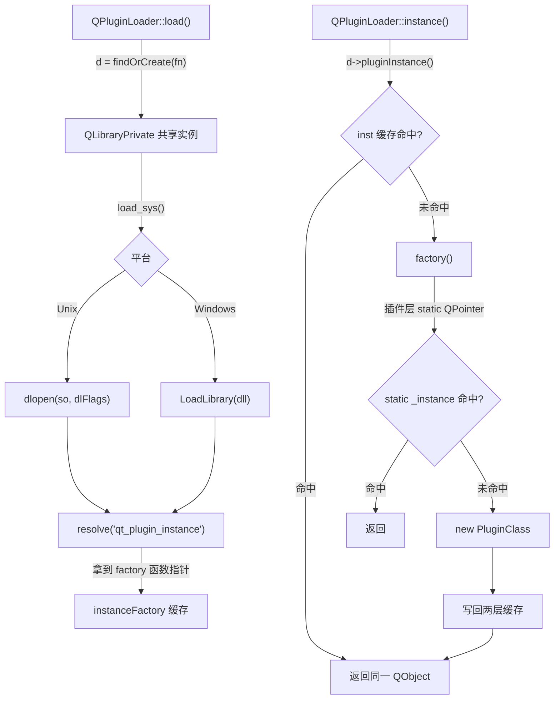

# 现代Qt开发教程（专家篇）1.12——QPluginLoader 插件加载源码拆解

## 1. 前言——插件加载的几个「想当然」

Qt 的插件系统，入门用法不复杂：写个继承 `QObject` 的接口实现类，拍上 `Q_OBJECT` 和 `Q_PLUGIN_METADATA`，编成 so/dll，运行时 `QPluginLoader::instance()` 取出来 `qobject_cast` 成接口用。但真往里踩，几个问题能把人问住。

笔者先把当年自己答不上来的摆出来。`QPluginLoader` 继承自 `QObject`，可它跟 `QLibrary` 长得那么像，俩到底什么关系，是不是父子？`instance()` 这个函数，您调两次拿到的是同一个对象还是两个新对象？插件的 metadata，教材都说是 JSON，可您拿个十六进制工具打开 so 看那段 metadata，怎么看着不像 JSON 文本？还有个最隐蔽的：`QPluginLoader` 加载一个插件时，校验不校验它声明的 IID？再就是 `unload()`，您调了它，那个 so 真的从进程地址空间里卸掉了吗？

这些问题，压在 `QPluginLoader` 设计的几条主轴上：身份（持 `QLibraryPrivate` 而非封装 `QLibrary`）、单例（`instance()` 双层缓存）、元数据编码（Qt6 是 CBOR 不是 JSON）、校验分层（iid 校验只在 `QFactoryLoader`）、卸载策略（默认 `PreventUnloadHint` 几乎不真卸载）。

入门篇的插件章节教了 `QPluginLoader` 怎么用，进阶篇补了 `Q_PLUGIN_METADATA` 和接口设计。本篇要往源码里捅：咱们打开 `qpluginloader.cpp`、`qfactoryloader.cpp` 和 `qlibrary.cpp`，看看插件到底怎么被 `dlopen` 出来、`instance()` 怎么缓存、metadata 怎么在不加载插件的情况下读到。

边界先划清楚。`Q_PLUGIN_METADATA` 宏本身是零展开，真正生成插件导出代码的是 moc——moc 工具的完整流程（ClassDef IR、generateCode 四段）是 [17.MOC 编译器原理篇](./17-moc-compiler-expert.md) 的主场，本篇只看 moc 给插件生成的「两枚 C 导出函数」长啥样、怎么被加载器 `resolve` 到。`QLibrary`（通用动态库加载，非插件）的符号 resolve、版本后缀搜索不在本篇展开，本篇只引用「QPluginLoader 复用 `QLibraryPrivate` 这一层」。具体插件系统（图片格式插件、SQL 驱动、QPA 平台插件）是 QFactoryLoader 的使用方，不在本篇 scope。

## 2. 环境说明

本篇源码引用基于 `qt_src/qt6.9.1`，行号随 Qt 版本会漂移，对照阅读时拿函数名定位最稳。插件加载涉及的关键文件：

| 文件 | 角色 |
|---|---|
| `qtbase/src/corelib/plugin/qpluginloader.h` | QPluginLoader 公共声明 |
| `qtbase/src/corelib/plugin/qpluginloader.cpp` | QPluginLoader 实现：instance/metaData/load/unload |
| `qtbase/src/corelib/plugin/qplugin.h` | Q_PLUGIN_METADATA / Q_IMPORT_PLUGIN / Q_PLUGIN_INSTANCE 宏 + 导出宏 |
| `qtbase/src/corelib/plugin/qplugin_p.h` | QtPluginMetaDataKeys 枚举 |
| `qtbase/src/corelib/plugin/qfactoryloader.cpp` | QFactoryLoader：按 iid 扫目录、建 keyMap |
| `qtbase/src/corelib/plugin/qlibrary.cpp` | QLibraryPrivate：pluginInstance/loadPlugin/unload/findPatternUnloaded |
| `qtbase/src/corelib/plugin/qlibrary_p.h` | QLibraryPrivate + 双计数器 + inst 缓存字段 |
| `qtbase/src/corelib/plugin/qlibrary_unix.cpp` | Unix：dlopen + RTLD_NODELETE |
| `qtbase/src/corelib/plugin/qlibrary_win.cpp` | Win：LoadLibrary + GetModuleHandleEx PIN |

本篇无配套 example，原因和前几篇一样：纯源码拆解，对照 `qt_src` 翻代码就是最好的实验。

## 3. 核心概念讲解

下源码之前，咱们先把插件从「`QPluginLoader::load()`」到「`instance()` 返回」的完整链路对一下。这张图能帮您看清中间发生了什么：



`load()` 走系统级 `dlopen`/`LoadLibrary` 把库挂进地址空间，`resolve` 拿到插件导出的工厂函数；`instance()` 经两层缓存（`QLibraryPrivate::inst` + 插件层 `static QPointer`）返回单例。咱们这一篇就顺着这条链拆。

### 3.1 持 QLibraryPrivate，不是封装 QLibrary

先看声明，笔者把第一张底牌亮出来：

`qt_src/qt6.9.1/qtbase/src/corelib/plugin/qpluginloader.h:20-22`

```cpp
class Q_CORE_EXPORT QPluginLoader : public QObject
{
    Q_OBJECT
```

继承 `QObject`，不是继承 `QLibrary`。它俩是平级兄弟——`QLibrary` 也继承 `QObject`。那 `QPluginLoader` 怎么复用 `QLibrary` 的加载能力？答案是它直接持有 `QLibrary` 的内部实现类：

`qt_src/qt6.9.1/qtbase/src/corelib/plugin/qpluginloader.h:17,48-51`

```cpp
class QLibraryPrivate;

class Q_CORE_EXPORT QPluginLoader : public QObject
{
    ...
private:
    QLibraryPrivate *d;
    bool did_load;
```

注意是 `QLibraryPrivate`（私有实现类），不是 `QLibrary`（公开类）。这里要纠正一个常见说法——很多人讲「QPluginLoader 封装了 QLibrary」，不准确。它封装的是 `QLibrary` 的 pimpl 内部对象，和 `QLibrary` 公开类共用同一层实现。这个 `d` 指针怎么来的：

`qt_src/qt6.9.1/qtbase/src/corelib/plugin/qpluginloader.cpp:307-309`

```cpp
    d = QLibraryPrivate::findOrCreate(fn, QString(), lh);
    if (!fn.isEmpty())
        d->updatePluginState();
```

`QLibraryPrivate::findOrCreate` 是关键入口——它从一个全局 `QLibraryStore` 里按文件名查共享实例。这意味着两个 `QPluginLoader`（或一个 `QPluginLoader` 一个 `QLibrary`）设了同一个文件名，底层拿到的是同一个 `QLibraryPrivate`。这是后面引用计数的基础。

真正的系统级 `dlopen` 不在 `qpluginloader.cpp`，而在 `qlibrary_unix.cpp`：

`qt_src/qt6.9.1/qtbase/src/corelib/plugin/qlibrary_unix.cpp:199`

```cpp
            hnd = dlopen(QFile::encodeName(attempt), dlFlags);
```

Windows 对应在 `qt_src/qt6.9.1/qtbase/src/corelib/plugin/qlibrary_win.cpp:58` 的 `LoadLibrary`。调用链是 `QPluginLoader` → `QLibraryPrivate::loadPlugin` → `load` → `load_sys` → `dlopen`/`LoadLibrary`。`load_sys` 在 Unix/Windows 两端是同一抽象的两种实现，`QPluginLoader` 本身平台无关。

### 3.2 instance() 是双层单例，不是每次 new

这是本篇第一个大纠偏点。很多教材暗示 `instance()` 每次返回新对象——源码里完全不是。

先看 `QPluginLoader::instance` 这层：

`qt_src/qt6.9.1/qtbase/src/corelib/plugin/qpluginloader.cpp:139-144`

```cpp
QObject *QPluginLoader::instance()
{
    if (!isLoaded() && !load())
        return nullptr;
    return d->pluginInstance();
}
```

它自己不 new 对象，先确保加载，再转调 `d->pluginInstance()`。缓存逻辑全在 `QLibraryPrivate::pluginInstance`：

`qt_src/qt6.9.1/qtbase/src/corelib/plugin/qlibrary.cpp:499-524`

```cpp
QObject *QLibraryPrivate::pluginInstance()
{
    // first, check if the instance is cached and hasn't been deleted
    QObject *obj = [&](){ QMutexLocker locker(&mutex); return inst.data(); }();
    if (obj)
        return obj;

    // We need to call the plugin's factory function. Is that cached?
    QtPluginInstanceFunction factory = instanceFactory.loadAcquire();
    if (!factory)
        factory = loadPlugin();

    if (!factory)
        return nullptr;

    obj = factory();

    // cache again
    QMutexLocker locker(&mutex);
    if (inst)
        obj = inst;
    else
        inst = obj;
    return obj;
}
```

三步走：先查 `inst` 缓存（命中直接返回），没命中就取工厂函数 `instanceFactory`（这层也有缓存），调 `factory()` 生成对象再写回 `inst`。关键在 `inst` 这个字段的类型：

`qt_src/qt6.9.1/qtbase/src/corelib/plugin/qlibrary_p.h:96`

```cpp
    QMutex mutex;
    QPointer<QObject> inst;         // used by QFactoryLoader
    QPluginParsedMetaData metaData;
```

`QPointer<QObject>`，弱引用语义。这就是 API doc 那句「If the root component object was destroyed, calling this function creates a new instance」的实现——对象被外部 `delete` 后，`QPointer` 自动置空，下次再调 `instance()` 会发现 `inst.data()` 是空，重走 `factory()` 新建。只要对象活着，`instance()` 返回的就是同一个指针。

工厂函数指针 `instanceFactory` 也是缓存的，避免每次都去 `resolve` 符号：

`qt_src/qt6.9.1/qtbase/src/corelib/plugin/qlibrary.cpp:581-599`

```cpp
QtPluginInstanceFunction QLibraryPrivate::loadPlugin()
{
    if (auto ptr = instanceFactory.loadAcquire()) {
        libraryUnloadCount.ref();
        return ptr;
    }
    if (pluginState == IsNotAPlugin)
        return nullptr;
    if (load()) {
        auto ptr = reinterpret_cast<QtPluginInstanceFunction>(resolve("qt_plugin_instance"));
        instanceFactory.storeRelease(ptr); // two threads may store the same value
        if (Q_LIKELY(ptr))
            return ptr;
        errorString = QLibrary::tr("Could not resolve 'qt_plugin_instance' function");
    }
    ...
}
```

第一次加载时 `resolve("qt_plugin_instance")` 拿到 C 函数指针，存入原子指针 `instanceFactory`；之后再调直接复用。那个注释 `// two threads may store the same value` 是说这是无锁双检——两个线程同时 resolve、同时 store 也没事，存的是同一个值。

注意 `resolve` 的符号名固定是 `qt_plugin_instance`，`extern "C"` 导出没有 name mangling。这是插件能跨编译器加载的根本原因——MSVC 编的插件，GCC 的程序也能 `resolve` 到这个符号（前提 ABI 兼容）。

这还没完。`qt_plugin_instance` 这个函数本身的实现，是 moc 用 `Q_PLUGIN_INSTANCE` 宏生成的，里面还有一层缓存：

`qt_src/qt6.9.1/qtbase/src/corelib/plugin/qplugin.h:212-220`

```cpp
#define Q_PLUGIN_INSTANCE(IMPLEMENTATION) \
        { \
            static QT_PREPEND_NAMESPACE(QPointer)<QT_PREPEND_NAMESPACE(QObject)> _instance; \
            if (!_instance) {    \
                QT_PLUGIN_RESOURCE_INIT \
                _instance = new IMPLEMENTATION; \
            } \
            return _instance; \
        }
```

`static QPointer<QObject> _instance`，函数静态变量级缓存。`new IMPLEMENTATION` 只在首次（或对象死后）执行。叠加 `QLibraryPrivate::inst` 那层，`instance()` 是「双层单例」。这两层缓存笔者第一次看的时候也愣了一下，但仔细想很合理：外层 `inst` 是「加载器视角」的单例（多个 `QPluginLoader`/`QFactoryLoader` 取同一个），内层 `_instance` 是「插件 DLL 视角」的单例（即便卸载重载，只要 DLL 的静态变量还在，逻辑上也连续）。

### 3.3 Q_PLUGIN_METADATA 是零展开，moc 才是干活的

很多人以为 `Q_PLUGIN_METADATA(IID "..." FILE "...")` 这个宏会生成一堆导出代码。其实它自己什么也不生成：

`qt_src/qt6.9.1/qtbase/src/corelib/kernel/qtmetamacros.h:56`

```cpp
#define Q_PLUGIN_METADATA(x) QT_ANNOTATE_CLASS(qt_plugin_metadata, x)
```

`QT_ANNOTATE_CLASS` 在非 clang 编译器下展开为空。所以编译器视角，`Q_PLUGIN_METADATA` 是个空操作。它全部的作用是「打标记让 moc 工具看见」——真正生成导出代码的是 moc。

moc 看到这个标记后，调 `parsePluginData` 解析三个键：

`qt_src/qt6.9.1/qtbase/src/tools/moc/moc.cpp:1537-1599`（节选）

```cpp
void Moc::parsePluginData(ClassDef *def)
{
    next(LPAREN);
    QByteArray metaData;
    while (test(IDENTIFIER)) {
        QByteArray l = lexem();
        if (l == "IID") {
            next(STRING_LITERAL);
            def->pluginData.iid = unquotedLexem();
        } else if (l == "URI") {
            next(STRING_LITERAL);
            def->pluginData.uri = unquotedLexem();
        } else if (l == "FILE") {
            next(STRING_LITERAL);
            QByteArray metaDataFile = unquotedLexem();
            ...
            metaData = file.readAll();
        }
    }
    if (!metaData.isEmpty()) {
        def->pluginData.metaData = QJsonDocument::fromJson(metaData);
        ...
```

三键语法：`Q_PLUGIN_METADATA(IID "..." FILE "...json" URI "...")`。重点是 `FILE`——它指向的那个 JSON 文件，在 moc 阶段就被读进来、解析成 `QJsonDocument`、嵌进 `ClassDef`。这是为什么 metadata 能「不加载插件就读到」的根本原因：您的 JSON 在编译期就已经烧进了插件的二进制文件，运行时不用 `dlopen` 也能拿到。

moc 拿到这些数据后，生成两枚 `extern "C"` 导出函数：

`qt_src/qt6.9.1/qtbase/src/corelib/plugin/qplugin.h:240-254`

```cpp
#  define QT_MOC_EXPORT_PLUGIN_COMMON(PLUGINCLASS, MANGLEDNAME)                                 \
    extern "C" Q_DECL_EXPORT QT_PREPEND_NAMESPACE(QObject) *qt_plugin_instance()                \
    Q_PLUGIN_INSTANCE(PLUGINCLASS)                                                              \

#  define QT_MOC_EXPORT_PLUGIN_V2(PLUGINCLASS, MANGLEDNAME, MD)                                 \
    extern "C" Q_DECL_EXPORT QT_PREPEND_NAMESPACE(QPluginMetaData) qt_plugin_query_metadata_v2()\
    { static constexpr QT_PLUGIN_METADATAV2_SECTION QPluginMetaDataV2<MD> md{}; return md; }    \
    QT_MOC_EXPORT_PLUGIN_COMMON(PLUGINCLASS, MANGLEDNAME)
```

这两枚函数就是插件对外的全部 C 接口：`qt_plugin_query_metadata_v2` 返回元数据结构（指向字节流加 size），`qt_plugin_instance` 调 `Q_PLUGIN_INSTANCE` 创建并返回 `QObject*`。都标了 `extern "C" Q_DECL_EXPORT`，没有 name mangling。3.2 节那个 `resolve("qt_plugin_instance")` 就是找第二个函数。

### 3.4 Qt6 的元数据是 CBOR，不是 JSON

重头戏来了。这是本篇最大的纠偏点，也是 Qt5→Qt6 在插件系统上最根本的变化。

教材和不少博客告诉您「插件元数据是 JSON」。这话在 Qt5 对，在 Qt6 不对了。咱们看 moc 生成元数据的代码：

`qt_src/qt6.9.1/qtbase/src/tools/moc/generator.cpp:1408-1434`（节选）

```cpp
void Generator::generatePluginMetaData()
{
    if (cdef->pluginData.iid.isEmpty())
        return;

    auto outputCborData = [this]() {
        CborDevice dev(out);
        CborEncoder enc;
        cbor_encoder_init_writer(&enc, CborDevice::callback, &dev);

        CborEncoder map;
        cbor_encoder_create_map(&enc, &map, CborIndefiniteLength);

        dev.nextItem("\"IID\"");
        cbor_encode_int(&map, int(QtPluginMetaDataKeys::IID));
        cbor_encode_text_string(&map, cdef->pluginData.iid.constData(), cdef->pluginData.iid.size());

        dev.nextItem("\"className\"");
        cbor_encode_int(&map, int(QtPluginMetaDataKeys::ClassName));
        cbor_encode_text_string(&map, cdef->classname.constData(), cdef->classname.size());

        QJsonObject o = cdef->pluginData.metaData.object();
        if (!o.isEmpty()) {
            dev.nextItem("\"MetaData\"");
            cbor_encode_int(&map, int(QtPluginMetaDataKeys::MetaData));
            jsonObjectToCbor(&map, o);
        }
```

`cbor_encoder_init_writer`、`cbor_encode_int`、`cbor_encode_text_string`——全是 CBOR 编码 API。key 是整数枚举（`QtPluginMetaDataKeys::IID` 等），value 是字符串或 map。Qt6 的插件元数据原始编码是 CBOR 二进制，不是 JSON 文本。Qt5 那会儿是带 `QTMETADATA !` 前缀的纯 JSON 文本，Qt6 整个换成了 CBOR——更紧凑、解析更快。

那 JSON 在 Qt6 哪儿还有？只有两个边界：一个是用户输入（`FILE` 指向的 JSON 文件，moc 在 3.3 节那段读进来），一个是对外 API（`QPluginLoader::metaData()` 返回 `QJsonObject` 给您用）。中间的存储和传输全是 CBOR。

`metaData()` 这个对外 API 怎么把 CBOR 转回 JSON：

`qt_src/qt6.9.1/qtbase/src/corelib/plugin/qpluginloader.cpp:156-161`

```cpp
QJsonObject QPluginLoader::metaData() const
{
    if (!d)
        return QJsonObject();
    return d->metaData.toJson();
}
```

`d->metaData` 是 `QPluginParsedMetaData`，内部存的就是 `QCborMap`。`toJson()` 在 `qfactoryloader.cpp` 里做整数键到字符串键的转换（IID/ClassName/MetaData/URI/version 这些枚举值变可读字符串）。所以您 `metaData()` 拿到的 `QJsonObject` 是导出时的转换产物，不是原始存储。

`qt_plugin_query_metadata` 返回的原始结构是个极简 POD：

`qt_src/qt6.9.1/qtbase/src/corelib/plugin/qplugin.h:37-105`（末尾字段）

```cpp
struct QPluginMetaData {
    ...
    const void *data;
    size_t size;
};
typedef QPluginMetaData (*QtPluginMetaDataFunction)();
```

`const void *data` 加 `size_t size`，指向一段字节流（Header 加 CBOR payload）。整个 `QPluginMetaData` 结构跨 37-105 行（中间嵌了 MagicString/Header/ElfNoteHeader 等子结构），末尾这两个字段描述元数据缓冲区。

### 3.5 iid 校验只在 QFactoryLoader，QPluginLoader 不校验

这个坑笔者专门拎出来讲。很多人以为 `QPluginLoader` 加载插件时会校验「这个插件的 IID 跟我要的接口匹配不匹配」。不是的。

笔者 grep 了整个 `qpluginloader.cpp`，`iid` 这个词零命中。`QPluginLoader` 给定文件名就 load，不管 IID 是啥，`instance()` 直接返回插件的根 `QObject`，由调用方 `qobject_cast` 判断是不是想要的接口。IID 校验是 `QFactoryLoader` 体系才有的：

`qt_src/qt6.9.1/qtbase/src/corelib/plugin/qfactoryloader.cpp:337-345`

```cpp
        QString iid = library->metaData.value(QtPluginMetaDataKeys::IID).toString();
        if (iid == QLatin1StringView(this->iid.constData(), this->iid.size())) {
            QCborMap object = library->metaData.value(QtPluginMetaDataKeys::MetaData).toMap();
            metaDataOk = true;

            const QCborArray k = object.value("Keys"_L1).toArray();
            for (QCborValueConstRef v : k)
                keys += cs ? v.toString() : v.toString().toLower();
        }
```

`QFactoryLoader` 扫描目录时，对每个候选插件读 metaData 的 IID 字段，比对构造时传入的 `this->iid`。匹配才继续。两者的设计分工是：`QPluginLoader` 是「我知道文件路径，直接加载它」，`QFactoryLoader` 是「给我一个 iid 和一个目录，帮我把这类插件都找出来」。前者不需要 IID，后者靠 IID 过滤。

顺带看一个性能优化。iid 比对不是把整个 metadata 解析出来再比对，而是用 CBOR 流式扫描，只读 IID 那个字段：

`qt_src/qt6.9.1/qtbase/src/corelib/plugin/qfactoryloader.cpp:61-86`

```cpp
struct QFactoryLoaderIidSearch
{
    QLatin1StringView iid;
    bool matchesIid = false;
    ...
    IterationResult::Result operator()(QtPluginMetaDataKeys key, QCborStreamReader &reader)
    {
        if (key != QtPluginMetaDataKeys::IID)
            return skip(reader);
        matchesIid = (reader.readAllString() == iid);
        return IterationResult::FinishedSearch;
    }
    ...
};
```

这个 visitor 遍历 CBOR 流，遇到非 IID 的键直接 `skip(reader)` 跳过，遇到 IID 键就比对、立刻 `FinishedSearch` 退出。这是「读 metadata 不加载插件」性能链的关键一环——扫描目录里几十个 so，每个都不用 `dlopen`，每个都只读 CBOR 流到 IID 字段就停。

### 3.6 不 dlopen 也能读 metadata

上一节提到「不加载插件读 metadata」，咱们把这机制的根子挖出来。

`QPluginLoader::metaData()` 您在没调 `load()` 的情况下也能拿到元数据。这不是魔法，是因为 Qt 在不 `dlopen` 的前提下，直接 `mmap` 文件、扫描元数据段：

`qt_src/qt6.9.1/qtbase/src/corelib/plugin/qlibrary.cpp:214-278`（节选）

```cpp
static QLibraryScanResult findPatternUnloaded(const QString &library, QLibraryPrivate *lib)
{
    QFile file(library);
    if (!file.open(QIODevice::ReadOnly)) {
        ...
    }
    ...
    qsizetype fdlen = qMin(file.size(), MaxMemoryMapSize);
    const char *filedata = reinterpret_cast<char *>(file.map(0, fdlen));
    ...
    QString errMsg = library;
    QLibraryScanResult r = qt_find_pattern(filedata, fdlen, &errMsg);
    if (r.length) {
        ...
        if (!lib->metaData.parse(QByteArrayView(filedata + r.pos, r.length))) {
            errMsg = lib->metaData.errorString();
            ...
        } else {
            ...
            return r;
        }
    }
```

`QFile::map` 把文件 mmap 进内存（不 `dlopen`），然后 `qt_find_pattern` 用平台相关的 parser 在字节流里定位 metadata——ELF 上找 `.note.qt.metadata` 这个 note 段，Mach-O 上找 `__TEXT,qtmetadata` section，PE 上找 `.qtmetadata` 段。找到后调 `metaData.parse()` 解析 CBOR。

这机制的价值在哪？`QFactoryLoader` 要扫描插件目录，里面可能几十个候选 so。如果每个都 `dlopen` 一遍读 metadata，启动会很慢。有了 `findPatternUnloaded`，扫描全程零 `dlopen`，只在真正要 `instance()` 那一刻才 `dlopen`。这是 Qt 插件系统启动性能的关键设计。

### 3.7 QFactoryLoader：扫描、缓存、择优

`QFactoryLoader` 是 Qt 内部用的（图片格式、SQL 驱动、QPA 平台插件都靠它）。它构造时就立刻扫描目录：

`qt_src/qt6.9.1/qtbase/src/corelib/plugin/qfactoryloader.cpp:450-476`（节选）

```cpp
QFactoryLoader::QFactoryLoader(const char *iid,
                               const QString &suffix,
                               Qt::CaseSensitivity cs)
    : QObject(*new QFactoryLoaderPrivate)
{
    Q_ASSERT_X(suffix.startsWith(u'/'), "QFactoryLoader",
               "For historical reasons, the suffix must start with '/' (and it can't be empty)");

    moveToThread(QCoreApplicationPrivate::mainThread());
    Q_D(QFactoryLoader);
    d->iid = iid;
    ...
    QMutexLocker locker(&qt_factoryloader_global->mutex);
    update();
    qt_factoryloader_global->loaders.append(this);
```

注意那个 `Q_ASSERT_X`——`suffix` 必须以 `/` 开头（比如 `/imageformats`、`/sqldrivers`）。构造函数立刻 `update()` 扫描所有 `libraryPaths` 拼上 `suffix` 的目录，扫完把自己注册进全局 `qt_factoryloader_global->loaders`。

缓存分三层。数据结构在 d-ptr：

`qt_src/qt6.9.1/qtbase/src/corelib/plugin/qfactoryloader.cpp:262-264`（数据结构）+ `293-393`（扫描逻辑）

扫描逻辑里有个关键操作——匹配的插件一旦被收纳，立刻打上 `PreventUnloadHint`：

```cpp
        if (keyUsageCount || keys.isEmpty()) {
            library->setLoadHints(QLibrary::PreventUnloadHint); // once loaded, don't unload
            QMutexLocker locker(&mutex);
            libraries.push_back(std::move(library));
        }
```

注释 `// once loaded, don't unload` 写得很直白：`QFactoryLoader` 管理的插件，加载了就永远不卸载。这是为了安全——这些插件通常是 Qt 自己的扩展（图片编解码、数据库驱动），卸载它们风险大于收益。

同 key 冲突时怎么择优？这是反直觉的设计：

`qt_src/qt6.9.1/qtbase/src/corelib/plugin/qfactoryloader.cpp:362-387`（节选）

```cpp
                int existingVersion = existingLibrary->metaData.value(QtPluginMetaDataKeys::QtVersion).toInteger();
                if (existingVersion == QtVersionNoPatch)
                    continue; // Prefer exact Qt version match
                if (existingVersion < QtVersionNoPatch && thisVersion > QtVersionNoPatch)
                    continue; // Better too old than too new
                if (existingVersion < QtVersionNoPatch && thisVersion < existingVersion)
                    continue; // Otherwise prefer newest
```

三条规则：第一，精确 Qt 版本匹配的胜出；第二，否则宁可太老不要太新（注释 `Better too old than too new`）；第三，再否则取较新的。第二点是反直觉的——为啥宁可老？因为新插件可能用了老 Qt 没有的 API，运行时崩；老插件用的 API 新 Qt 大概率还有（Qt 保 ABI 向后兼容），所以老插件更安全。这个设计选择笔者觉得挺有讲究。

### 3.8 版本兼容：minor 允许插件老，不允许插件新

刚才择优规则提到了「宁可老」，加载时的版本检查也是同一个思路。咱们看 `updatePluginState`：

`qt_src/qt6.9.1/qtbase/src/corelib/plugin/qlibrary.cpp:782-802`（节选）

```cpp
    uint qt_version = uint(metaData.value(QtPluginMetaDataKeys::QtVersion).toInteger();
    bool debug = metaData.value(QtPluginMetaDataKeys::IsDebug).toBool();
    if ((qt_version & 0x00ff00) > (QT_VERSION & 0x00ff00) || (qt_version & 0xff0000) != (QT_VERSION & 0xff0000)) {
        ...
        errorString = QLibrary::tr("The plugin '%1' uses incompatible Qt library. (%2.%3.%4) [%5]")
            .arg(fileName,
                 QString::number((qt_version & 0xff0000) >> 16),
                 QString::number((qt_version & 0xff00) >> 8),
                 QString::number(qt_version & 0xff),
                 debug ? "debug"_L1 : "release"_L1);
    } else if (PluginMustMatchQtDebug && debug != QtBuildIsDebug) {
        ...
    } else {
        pluginState = IsAPlugin;
    }
```

位掩码规则：`0xff0000` 是 major，`0x00ff00` 是 minor，低字节是 patch。条件拆开看：

- minor 检查用 `>` 不是 `!=`——`(qt_version & 0x00ff00) > (QT_VERSION & 0x00ff00)`，意思是「插件 minor 大于运行时 minor」才拒绝。插件 minor 小于运行时是允许的（老插件跑新 Qt，ABI 向后兼容）。
- major 检查用 `!=`——`(qt_version & 0xff0000) != (QT_VERSION & 0xff0000)`，major 必须严格相等，大一点小一点都不行。
- patch 压根不查（patch 版本期内 ABI 稳定）。

教材常笼统说「主版本号必须匹配」，不够。minor 也有约束——插件可以老，不能新。这条规则笔者建议您写跨版本插件时心里有数：用老版 Qt 编的插件跑新版运行时没问题，反过来用新版 Qt 编的插件跑老版运行时会拒。

debug/release 配置检查是平台相关的：

`qt_src/qt6.9.1/qtbase/src/corelib/plugin/qlibrary.cpp:44-49`

```cpp
static constexpr bool PluginMustMatchQtDebug =
        QOperatingSystemVersion::currentType() == QOperatingSystemVersion::Windows
#if defined(Q_CC_MINGW)
        && QT_CONFIG(debug_and_release)
#endif
        ;
```

`PluginMustMatchQtDebug` 只在 Windows（非 MinGW，或 MinGW 且开了 `debug_and_release`）时为 true。Unix 平台为 false——可以混用 debug/release 插件。这是 Windows 平台的硬约束，源码写死的。

### 3.9 静态插件：符号名都不一样

静态插件（`Q_IMPORT_PLUGIN`）和动态插件（`QPluginLoader`）走的是完全不同的代码路径，连导出符号名都不一样。

先看 `Q_IMPORT_PLUGIN` 宏展开：

`qt_src/qt6.9.1/qtbase/src/corelib/plugin/qplugin.h:194-202`

```cpp
#define Q_IMPORT_PLUGIN(PLUGIN) \
        extern const QT_PREPEND_NAMESPACE(QStaticPlugin) qt_static_plugin_##PLUGIN(); \
        class Static##PLUGIN##PluginInstance{ \
        public: \
                Static##PLUGIN##PluginInstance() { \
                    qRegisterStaticPluginFunction(qt_static_plugin_##PLUGIN()); \
                } \
        }; \
       static Static##PLUGIN##PluginInstance static##PLUGIN##Instance;
```

展开后是三样东西：一个 `extern` 声明 `qt_static_plugin_##PLUGIN()`（moc 在静态插件模式下生成）、一个内部类（构造函数调 `qRegisterStaticPluginFunction`）、一个文件级 `static` 实例。那个 `static` 实例在 `main` 之前就被构造，自动把插件注册进全局 `staticPluginList`。

静态插件 moc 生成的导出符号，和动态插件不一样：

`qt_src/qt6.9.1/qtbase/src/corelib/plugin/qplugin.h:222-228`

```cpp
#if defined(QT_STATICPLUGIN)
#  define QT_MOC_EXPORT_PLUGIN_COMMON(PLUGINCLASS, MANGLEDNAME)                                 \
    static QT_PREPEND_NAMESPACE(QObject) *qt_plugin_instance_##MANGLEDNAME()                    \
    Q_PLUGIN_INSTANCE(PLUGINCLASS)                                                              \
    const QT_PREPEND_NAMESPACE(QStaticPlugin) qt_static_plugin_##MANGLEDNAME()                  \
    { return { qt_plugin_instance_##MANGLEDNAME, qt_plugin_query_metadata_##MANGLEDNAME}; }     \
```

注意几个差别。第一，函数名带 `##MANGLEDNAME` 后缀（不是动态插件那种裸 `qt_plugin_instance`），这是为了避免一个程序里多个静态插件符号冲突。第二，函数是 `static` 的，不导出——静态插件本来就是链进来的，不需要 `dlopen`，所以不导出，靠 `Q_IMPORT_PLUGIN` 显式引用。第三，返回的 `QStaticPlugin` 结构含两个指针（instance 函数 + query_metadata 函数）。

动态插件那边（3.3 节贴过）是 `extern "C" Q_DECL_EXPORT` 的裸名 `qt_plugin_instance`，靠 `resolve` 拿。俩命名风格、可见性完全不同。

静态插件您不用 `QPluginLoader` 实例去取，有专门的静态方法：

`qt_src/qt6.9.1/qtbase/src/corelib/plugin/qpluginloader.cpp:402-412`

```cpp
QObjectList QPluginLoader::staticInstances()
{
    QObjectList instances;
    if (staticPluginList.exists()) {
        const StaticPluginList &plugins = *staticPluginList;
        instances.reserve(plugins.size());
        for (QStaticPlugin plugin : plugins)
            instances += plugin.instance();
    }
    return instances;
}
```

`QPluginLoader::staticInstances()` 直接静态调，遍历全局 `staticPluginList` 取每个的 `instance()`。`QFactoryLoader::instance()` 在动态插件耗尽后也会扫静态插件，统一索引，所以使用方不用关心一个插件是静态的还是动态的。

### 3.10 unload 默认不真卸载，这是 Qt5.7 后的硬规则

最后一个大纠偏点，也是最容易让人栽跟头的地方。

`unload()` 这个函数，您调了它，so 真的从地址空间卸掉了吗？默认情况下——没有。

根子在 `QPluginLoader` 构造时的默认 LoadHints：

`qt_src/qt6.9.1/qtbase/src/corelib/plugin/qpluginloader.cpp:77,102`

```cpp
static constexpr QLibrary::LoadHints defaultLoadHints = QLibrary::PreventUnloadHint;
...
QPluginLoader::QPluginLoader(const QString &fileName, QObject *parent)
    : QObject(parent), d(nullptr), did_load(false)
{
    setFileName(fileName);
    setLoadHints(defaultLoadHints);
}
```

`defaultLoadHints = PreventUnloadHint`。从 Qt 5.7 起，`QPluginLoader` 默认带这个 hint。它在平台层的效果是：Unix 上映射到 `dlopen` 的 `RTLD_NODELETE` flag（`qlibrary_unix.cpp:130-134`），Windows 上用 `GetModuleHandleEx(GET_MODULE_HANDLE_EX_FLAG_PIN)` 把模块钉住（`qt_src/qt6.9.1/qtbase/src/corelib/plugin/qlibrary_win.cpp:86-94`）。结果是即便您调了 `unload()`，库也永远不会真正从地址空间移除——`dlclose`/`FreeLibrary` 成了 no-op。这是为了防止「静态变量被重置」「残留指针」这类崩溃。

想真卸载，必须显式清掉这个 hint：

```cpp
QPluginLoader loader(path);
loader.setLoadHints(QLibrary::LoadHints());  // 清掉 PreventUnloadHint
loader.load();
```

但即便如此，`unload` 还有一道引用计数关卡。`QLibraryPrivate` 维护两个计数器：

`qt_src/qt6.9.1/qtbase/src/corelib/plugin/qlibrary_p.h:115-118`

```cpp
    /// counts how many QLibrary or QPluginLoader are attached to us, plus 1 if it's loaded
    QAtomicInt libraryRefCount;
    /// counts how many times load() or loadPlugin() were called
    QAtomicInt libraryUnloadCount;
```

`libraryRefCount` 跟踪多少个 `QLibrary`/`QPluginLoader` 持有这个对象，`libraryUnloadCount` 跟踪调了多少次 `load`。卸载必须 `libraryUnloadCount` 归零：

`qt_src/qt6.9.1/qtbase/src/corelib/plugin/qlibrary.cpp:554-574`（节选）

```cpp
bool QLibraryPrivate::unload(UnloadFlag flag)
{
    if (!pHnd.loadRelaxed())
        return false;
    if (libraryUnloadCount.loadRelaxed() > 0 && !libraryUnloadCount.deref()) { // only unload if ALL QLibrary instance wanted to
        QMutexLocker locker(&mutex);
        delete inst.data();
        if (flag == NoUnloadSys || unload_sys()) {
            ...
            libraryRefCount.deref();
            pHnd.storeRelaxed(nullptr);
            instanceFactory.storeRelaxed(nullptr);
            return true;
        }
    }

    return false;
}
```

注释 `// only unload if ALL QLibrary instance wanted to`——多次 `load` 必须配多次 `unload` 才真卸载。卸载前还会 `delete inst.data()` 强制销毁根对象（和 3.2 节的 `inst` 缓存呼应）。macOS 还有个特例：传 `NoUnloadSys` 不调 `unload_sys`，因为 macOS 根本不能真卸载动态库（`dyld` 限制）。

更让人意外的是 `QPluginLoader` 析构时：

`qt_src/qt6.9.1/qtbase/src/corelib/plugin/qpluginloader.cpp:113-117`

```cpp
QPluginLoader::~QPluginLoader()
{
    if (d)
        d->release();
}
```

析构只调 `release()`（减 `libraryRefCount`），不调 `unload`。配合默认的 `PreventUnloadHint`，实际生产代码里 `QPluginLoader` 加载的插件几乎从不真正卸载，直到进程结束。如果您写的是「热重载插件」的逻辑，得格外小心——默认配置下「卸载重载」拿到的还是同一个库的同一个静态状态。

## 4. 踩坑预防

本篇踩坑只讲源码里能直接对应、笔者自己也栽过的真坑。

### 4.1 instance() 是单例，不是每次新对象

后果：您调两次 `instance()` 想拿两个独立对象做隔离测试，实际拿到的是同一个指针。在一个对象上改的状态，另一个「对象」也看得见——因为它俩根本就是同一个。

根因是 3.2 节的双层单例。`inst` 缓存命中直接返回，插件层 `static QPointer` 再兜一层。

正确做法：明确「插件根对象是进程级单例」。要多个独立实例，插件接口应该提供 `createXxx()` 工厂方法，每次返回新对象；不要指望 `QPluginLoader::instance()` 给您 new 新的根对象。

### 4.2 默认 PreventUnloadHint，unload 不是真卸载

后果：您写「卸载插件 → 重新加载 → 刷新状态」的逻辑，调了 `unload()` 再 `load()`，发现插件的全局/静态变量还是上次的值，状态没重置。或者您以为卸载能省内存，实际库还钉在地址空间里。

根因是 3.10 节的默认 `PreventUnloadHint`——`RTLD_NODELETE`/`GET_MODULE_HANDLE_EX_FLAG_PIN` 让 `dlclose`/`FreeLibrary` 成 no-op。

正确做法：要真卸载，构造后立刻 `setLoadHints(QLibrary::LoadHints())` 清掉 hint 再 `load`。但即便如此，多 loader 共享同一 `QLibraryPrivate`、引用计数未归零、macOS 系统限制，都可能让「真卸载」落空。热重载这种场景，Qt 的插件系统不是为它设计的，慎用。

### 4.3 iid 不匹配不报错，加载照样成功

后果：您把 A 接口的插件当 B 接口加载，`QPluginLoader::load()` 返回 true，`instance()` 返回非空 `QObject`，您 `qobject_cast<BInterface>()` 得到 nullptr——但全程没任何错误提示。debug 半天不知道哪儿不对。

根因是 3.5 节讲的：`QPluginLoader` 给文件名就 load，不校验 iid。iid 校验是 `QFactoryLoader` 的事。`QPluginLoader` 只管把根 `QObject` 给您，类型对不对您自己 `qobject_cast`。

正确做法：加载后必须检查 `qobject_cast` 的返回值，别只看 `instance()` 非空就放心。要按 iid 批量加载，用 `QFactoryLoader`（虽然它是私有 API，但 Qt 自己模块都这么用）。

### 4.4 缺 Q_OBJECT 静默失效，插件元数据无声丢失

后果：您写了个插件类，拍了 `Q_PLUGIN_METADATA(IID ...)`，忘了 `Q_OBJECT`。编译能过（`Q_PLUGIN_METADATA` 是零展开，不报错），链接也过，so 也生成了。运行时 `QPluginLoader::load()` 返回 true，但 `metaData()` 是空的，`instance()` 返回 nullptr。没有任何错误信息告诉您问题在哪。

根因是 moc 的处理逻辑：

`qt_src/qt6.9.1/qtbase/src/tools/moc/moc.cpp:1050-1056`

```cpp
            if (!def.hasQObject && !def.hasQGadget && def.signalList.isEmpty() && def.slotList.isEmpty()
                && def.propertyList.isEmpty() && def.enumDeclarations.isEmpty())
                continue; // no meta object code required
            ...
            if (!def.hasQObject && !def.hasQGadget)
                error("Class declaration lacks Q_OBJECT macro.");
```

`continue` 那行——如果类既没 `Q_OBJECT`/`Q_GADGET`，又没 signals/slots/properties/enums，moc 直接跳过整个类，不生成任何元对象代码（包括插件元数据导出）。这是「静默失效」，比报错还坑，因为您根本不知道发生了什么。下面那个 `error` 只针对「类有 signals/slots 但缺 Q_OBJECT」的情况，对纯插件类不触发。

正确做法：插件类必须同时有 `Q_OBJECT` 和 `Q_PLUGIN_METADATA` 两个宏，缺一不可。如果插件加载行为诡异（load 成功但 instance/metadata 空），第一个排查的就是 `Q_OBJECT` 漏没漏。

## 5. 官方文档参考链接

- [QPluginLoader Class Reference](https://doc.qt.io/qt-6/qpluginloader.html) —— 公开 API 总览
- [QPluginLoader::instance](https://doc.qt.io/qt-6/qpluginloader.html#instance) —— 单例语义与对象销毁后重建说明
- [QPluginLoader::metaData](https://doc.qt.io/qt-6/qpluginloader.html#metaData) —— 返回 QJsonObject（内部 CBOR）
- [QPluginLoader::loadHints](https://doc.qt.io/qt-6/qpluginloader.html#loadHints) —— PreventUnloadHint 默认值
- [How to Create Qt Plugins](https://doc.qt.io/qt-6/plugins-howto.html) —— Q_PLUGIN_METADATA 宏与插件接口设计
- [QFactoryLoader](https://doc.qt.io/qt-6/qfactoryloader.html) —— 按 iid 扫目录的工厂加载器（私有 API）

---

插件系统的设计哲学，是「把跨编译器的二进制发现和加载」这件事，藏在一套 QObject 单例的抽象后面。您 `instance()` 拿到的那个 `QObject`，背后是 `dlopen`、`resolve`、双层 `QPointer` 缓存、CBOR 元数据解析、引用计数这一整套机制。这套抽象在 99% 的场景下都工作得很好——您写接口、拍宏、加载、`qobject_cast`，一气呵成。但那 1% 的故障（单例状态污染、unload 没真卸、iid 不报错、Q_OBJECT 静默失效），都得靠懂源码才能定位。读完这篇，您应该能在插件行为诡异时，知道该往哪儿查了。
