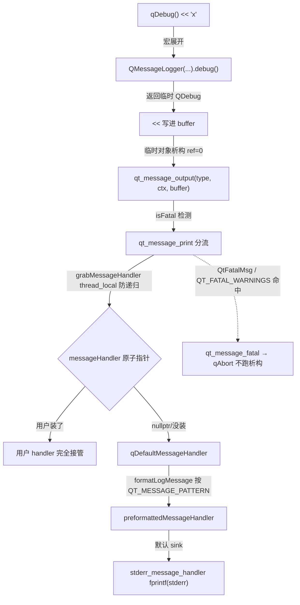

# 现代Qt开发教程（专家篇）1.14——qDebug 与 QLoggingCategory 源码拆解

## 1. 前言——日志系统里几个想当然

Qt 的日志，入门就是 `qDebug() << "x"`、`qWarning() << "y"`。但稍微往深里想，几个问题能把人问住。

笔者先把当年自己答不上来的摆出来。`qDebug` 到底是函数还是宏？`qDebug("x=%d", n)` 这种 printf 风格和 `qDebug() << "x=" << n` 这种流式风格，底下是怎么统一的？release 构建里，日志还带不带源码文件名和行号——很多人以为带，那可不一定。`qFatal` 调了之后，程序是 `exit()` 退出还是 `abort()` 崩掉，全局析构跑不跑？`qInstallMessageHandler` 装的 handler，是包在默认输出外面一层，还是直接替换掉了？最隐蔽的一个：`QLoggingCategory` 的 debug 级别，默认是开还是关？

这些问题，压在 Qt 日志系统的几条主轴上：宏展开（`qDebug` 是宏，展开成 `QMessageLogger` 成员函数指针取址）、消息分发（`qt_message_print` 真正分流，`qt_message_output` 是带 fatal 检测的外层）、输出接管（`qInstallMessageHandler` 原子替换不 wrap）、category 过滤（构造默认全开，`defaultCategoryFilter` 才关 `qt.*`）、上下文丢失（release 默认丢 file/line/function）。

入门篇教了 qDebug/QLoggingCategory 怎么用，进阶篇补了 QT_MESSAGE_PATTERN 和分类规则。本篇要往源码里捅：咱们打开 `qlogging.h`、`qlogging.cpp` 和 `qloggingcategory.cpp`，看看 `qDebug` 这个宏怎么展开、消息怎么一路流到 stderr、category 的开关默认值到底是啥。

边界先划清楚。QDebug 的流式 `operator<<` 对各种类型（QString、QByteArray、容器）的格式化特化，本篇只在「析构时输出 buffer」这个机制层面点到，不展开每个类型的 `<<` 重载。系统日志 sink（macOS AppleUnifiedLogger、Windows Event Log、Android Log）只点到「可能短路 stderr」，不展开各平台 sink 实现。具体业务 category（`qt.network`、`qt.qml` 这些 Qt 内部分类）不在本篇 scope，本篇讲框架机制。

## 2. 环境说明

本篇源码引用基于 `qt_src/qt6.9.1`，行号随 Qt 版本会漂移，对照阅读时拿函数名定位最稳。日志系统涉及的关键文件：

| 文件 | 角色 |
|---|---|
| `qtbase/src/corelib/global/qlogging.h` | qDebug/qWarning/qCritical/qFatal 宏 + QtMsgType + QMessageLogContext + qInstallMessageHandler 声明 |
| `qtbase/src/corelib/global/qlogging.cpp` | qt_message_print/qt_message_output/qDefaultMessageHandler/isFatal/qAbort 调用 + QMessagePattern |
| `qtbase/src/corelib/global/qassert.cpp` | qAbort 实现（Windows fastfail / 其他 std::abort） |
| `qtbase/src/corelib/io/qdebug.h` / `qdebug.cpp` | QDebug 流式 RAII |
| `qtbase/src/corelib/io/qloggingcategory.h` / `qloggingcategory.cpp` | QLoggingCategory + qCDebug 宏 + Q_LOGGING_CATEGORY |
| `qtbase/src/corelib/io/qloggingregistry.cpp` / `qloggingregistry_p.h` | defaultCategoryFilter + 4 套规则集 |

本篇无配套 example，原因和前几篇一样：纯源码拆解，对照 `qt_src` 翻代码就是最好的实验。

## 3. 核心概念讲解

下源码之前，咱们先把一条日志从 `qDebug() << "x"` 到 stderr 的完整链路对一下。这张图能帮您看清中间发生了什么：



`qDebug` 宏展开成 `QMessageLogger` 临时对象的成员函数指针取址，流式 `<<` 写进 buffer，临时对象析构时调 `qt_message_output`。`qt_message_print` 真正分流到用户 handler 或默认 handler，最终落 stderr。fatal 消息另走 `qAbort`。咱们这一篇就顺着这条链拆。

### 3.1 qDebug 是宏，展开成成员函数指针取址

这是本篇第一个大纠偏点。`qDebug` 不是函数，是宏：

`qt_src/qt6.9.1/qtbase/src/corelib/global/qlogging.h:165-169`

```cpp
#define qDebug QMessageLogger(QT_MESSAGELOG_FILE, QT_MESSAGELOG_LINE, QT_MESSAGELOG_FUNC).debug
#define qInfo QMessageLogger(QT_MESSAGELOG_FILE, QT_MESSAGELOG_LINE, QT_MESSAGELOG_FUNC).info
#define qWarning QMessageLogger(QT_MESSAGELOG_FILE, QT_MESSAGELOG_LINE, QT_MESSAGELOG_FUNC).warning
#define qCritical QMessageLogger(QT_MESSAGELOG_FILE, QT_MESSAGELOG_LINE, QT_MESSAGELOG_FUNC).critical
#define qFatal QMessageLogger(QT_MESSAGELOG_FILE, QT_MESSAGELOG_LINE, QT_MESSAGELOG_FUNC).fatal
```

注意末尾那个 `.debug` 没有括号——这是成员函数指针取址，不是函数调用。整个宏展开是「构造一个 `QMessageLogger` 临时对象，取它的 `.debug` 成员函数指针」。

那 `qDebug("x=%d", n)` 这种 printf 风格怎么调？宏展开后变成 `QMessageLogger(...).debug("x=%d", n)`——`.debug` 这个成员函数指针后面跟参数列表，C++ 语法上等于 `(QMessageLogger(...).debug)("x=%d", n)`，调用这个成员函数指针。所以 printf 风格和流式风格底下统一在 `QMessageLogger` 上：printf 风格调 `debug(const char *, ...)`，流式风格调无参 `debug()` 返回 `QDebug`。

`QMessageLogger` 构造时把 `QT_MESSAGELOG_FILE`/`QT_MESSAGELOG_LINE`/`QT_MESSAGELOG_FUNC` 存进上下文，这俩宏展开成啥，决定了 release 能不能看到源码位置——3.4 节细讲。临时对象在整条表达式结束时析构，这是 RAII 的根基。

有个编译开关可以让这些宏变成空操作：

`qt_src/qt6.9.1/qtbase/src/corelib/global/qlogging.h:171-184`

```cpp
#define QT_NO_QDEBUG_MACRO while (false) QMessageLogger().noDebug

#if defined(QT_NO_DEBUG_OUTPUT)
#  undef qDebug
#  define qDebug QT_NO_QDEBUG_MACRO
#endif
#if defined(QT_NO_INFO_OUTPUT)
#  undef qInfo
#  define qInfo QT_NO_QDEBUG_MACRO
#endif
#if defined(QT_NO_WARNING_OUTPUT)
#  undef qWarning
#  define qWarning QT_NO_QDEBUG_MACRO
#endif
```

`QT_NO_DEBUG_OUTPUT` 之类定义后，`qDebug` 退化成 `while(false) QMessageLogger().noDebug`——`while(false)` 保证分支不执行，但让 `qDebug() << "x"` 这种流式调用仍能编译通过（`noDebug` 返回个空壳）。注意 `qCritical` 和 `qFatal` 没有对应的降级开关，永远启用——因为 critical 和 fatal 通常不能被静音。

顺带一个反直觉的点，`QtMsgType` 枚举值不按严重性排序：

`qt_src/qt6.9.1/qtbase/src/corelib/global/qlogging.h:29-39`

```cpp
enum QtMsgType {
    QtDebugMsg,
    QT7_ONLY(QtInfoMsg,)
    QtWarningMsg,
    QtCriticalMsg,
    QtFatalMsg,
    QT6_ONLY(QtInfoMsg,)
#if QT_DEPRECATED_SINCE(6, 7)
    , QtSystemMsg Q_DECL_ENUMERATOR_DEPRECATED_X("Use QtCriticalMsg instead.") = QtCriticalMsg
#endif
};
```

Qt6 里 `QtInfoMsg` 数值排在 `QtFatalMsg` 之后（`QT6_ONLY(QtInfoMsg,)` 在最后），不是按 debug→info→warning→critical→fatal 递增。`defaultCategoryFilter` 的注释明确点出「numeric values are not in severity order」。所以您别用 `msgType >= QtWarningMsg` 这种数值比较判断严重程度，会踩坑。

### 3.2 消息分发：qt_message_print 才是真正分流点

日志消息从 `QMessageLogger` 出来后，怎么走到 stderr？这里有个常见误解——很多人以为 `qt_message_output` 就是最终 stderr 出口。不是。

先看 `qt_message_output`：

`qt_src/qt6.9.1/qtbase/src/corelib/global/qlogging.cpp:2155-2161`

```cpp
void qt_message_output(QtMsgType msgType, const QMessageLogContext &context, const QString &message)
{
    QInternalMessageLogContext ctx(context);
    qt_message_print(msgType, ctx, message);
    if (isFatal(msgType))
        qt_message_fatal(msgType, ctx, message);
}
```

它只是个外层封装——调 `qt_message_print` 分流，再检查 `isFatal` 决定要不要 abort。真正干活的是 `qt_message_print`：

`qt_src/qt6.9.1/qtbase/src/corelib/global/qlogging.cpp:2096-2119`

```cpp
static void qt_message_print(QtMsgType msgType, const QMessageLogContext &context, const QString &message)
{
    Q_TRACE(qt_message_print, msgType, context.category, context.function, context.file, context.line, message);

    // qDebug, qWarning, ... macros do not check whether category is enabled
    if (msgType != QtFatalMsg && isDefaultCategory(context.category)) {
        if (QLoggingCategory *defaultCategory = QLoggingCategory::defaultCategory()) {
            if (!defaultCategory->isEnabled(msgType))
                return;
        }
    }

    // prevent recursion in case the message handler generates messages
    // itself, e.g. by using Qt API
    if (grabMessageHandler()) {
        const auto ungrab = qScopeGuard([]{ ungrabMessageHandler(); });
        auto msgHandler = messageHandler.loadAcquire();
        (msgHandler ? msgHandler : qDefaultMessageHandler)(msgType, context, message);
    } else {
        stderr_message_handler(msgType, context, message);
    }
}
```

这段信息量很大，笔者拆开讲。第一段是 defaultCategory 过滤——`qDebug` 宏本身不检查 category 开关（不像 `qCDebug` 会先判断），所以这里补一刀：如果消息属于 default category 且 default category 关了该级别，直接 return 不输出。第二段是递归保护——`grabMessageHandler()` 用 thread_local 标志防止 handler 内部又调 `qDebug` 引发无限递归；递归调用时 `grabMessageHandler()` 返回 false，直接走 `stderr_message_handler`。第三段是 handler 分流——原子读 `messageHandler` 指针，非空调它，为空调 `qDefaultMessageHandler`。

那个 `grabMessageHandler` 的 thread_local 实现：

`qt_src/qt6.9.1/qtbase/src/corelib/global/qlogging.cpp:2077-2089`

```cpp
Q_CONSTINIT static thread_local bool msgHandlerGrabbed = false;

static bool grabMessageHandler()
{
    if (msgHandlerGrabbed)
        return false;
    msgHandlerGrabbed = true;
    return true;
}

static void ungrabMessageHandler()
{
    msgHandlerGrabbed = false;
}
```

每个线程一个 `msgHandlerGrabbed` 标志。同线程里 handler 内部再产生日志，`grabMessageHandler` 看到已 grabbed 就返 false，递归日志直接进 stderr 不重入 handler。这保证了「handler 再怎么调 qDebug 都不会栈溢出」，但也意味着 handler 内部的日志绕过了您自己的 handler 逻辑——这是 3.4 节踩坑会讲的「handler 要简洁」的根源。

最终落 stderr 的是 `stderr_message_handler`：

`qt_src/qt6.9.1/qtbase/src/corelib/global/qlogging.cpp:1993-2005`

```cpp
static void stderr_message_handler(QtMsgType type, const QMessageLogContext &context,
                                   const QString &formattedMessage)
{
    Q_UNUSED(type);
    Q_UNUSED(context);
    if (formattedMessage.isNull())
        return;
    fprintf(stderr, "%s\n", formattedMessage.toLocal8Bit().constData());
    fflush(stderr);
}
```

简单粗暴 `fprintf(stderr, ...)` 加 `fflush`。注意 macOS/iOS 走 AppleUnifiedLogger、Windows 走 win_message_handler、QNX 走 slog2，这些系统 sink 可能在 `qDefaultMessageHandler` 那一层就把消息截走，不一定落 stderr。

### 3.3 qFatal 走 qAbort，不跑析构

本篇第二个大纠偏点。`qFatal` 调了之后，程序怎么退？笔者当年以为是 `exit()`——不是，是 `abort()`。

看 `isFatal` 和 `qt_message_fatal`：

`qt_src/qt6.9.1/qtbase/src/corelib/global/qlogging.cpp:203-219`

```cpp
static bool isFatal(QtMsgType msgType)
{
    if (msgType == QtFatalMsg)
        return true;

    if (msgType == QtCriticalMsg) {
        static QAtomicInt fatalCriticals = checked_var_value("QT_FATAL_CRITICALS");
        return is_fatal_count_down(fatalCriticals);
    }

    if (msgType == QtWarningMsg || msgType == QtCriticalMsg) {
        static QAtomicInt fatalWarnings = checked_var_value("QT_FATAL_WARNINGS");
        return is_fatal_count_down(fatalWarnings);
    }

    return false;
}
```

`QtFatalMsg` 永远 fatal。`QtCriticalMsg` 受 `QT_FATAL_CRITICALS` 环境变量控制（倒数计数器，`=1` 让第 1 条 critical abort，`=5` 让第 5 条）。`QtWarningMsg` 受 `QT_FATAL_WARNINGS` 控制。这俩开关 CI 里常用——设 `QT_FATAL_WARNINGS=1` 让任何 qWarning 直接崩，强制开发者把 warning 修干净。

fatal 之后调 `qt_message_fatal`：

`qt_src/qt6.9.1/qtbase/src/corelib/global/qlogging.cpp:2121-2150`（节选）

```cpp
template <typename String>
static void qt_message_fatal(QtMsgType, const QMessageLogContext &context, String &&message)
{
#if defined(Q_CC_MSVC_ONLY) && defined(QT_DEBUG) && defined(_DEBUG) && defined(_CRT_ERROR)
    ...  // MSVC debug 弹窗分支，让用户连调试器
#endif
    if constexpr (std::is_class_v<String> && !std::is_const_v<String>)
        message.clear();
    else
        Q_UNUSED(message);
    qAbort();
}
```

最终调 `qAbort()`。它的实现：

`qt_src/qt6.9.1/qtbase/src/corelib/global/qassert.cpp:24-51`（节选）

```cpp
Q_NORETURN void qAbort()
{
    // Windows 路径：优先 fastfail，TerminateProcess 兜底
    // 其他平台：std::abort()
}
```

Windows 上优先用 `__fastfail(FAST_FAIL_FATAL_APP_EXIT)`（MSVC）或 `RaiseFailFastException`（MinGW）——这俩会生成 Windows 错误报告（WER）崩溃转储；`TerminateProcess(GetCurrentProcess(), STATUS_FATAL_APP_EXIT)` 是兜底。其他平台走 `std::abort()`，给进程发 SIGABRT。

关键点：这俩路径都不跑全局析构。`std::abort()` 不调用 `atexit` 注册的函数、不跑静态对象的析构；`TerminateProcess` 直接杀进程。所以 `qFatal` 之后，QObject 对象树不会清理、`QCoreApplication::aboutToQuit` 信号不会发、析构函数都不会跑。这跟 `exit()` 完全是两码事——`exit()` 会规规矩矩跑 atexit 和静态析构。您写代码时如果依赖析构做清理（刷盘、保存状态），别指望 `qFatal` 路径会给您机会。

### 3.4 qInstallMessageHandler：直接替换，不 wrap

第三个大纠偏点。`qInstallMessageHandler` 装的 handler，是包在默认输出外面一层，还是直接替换？笔者看过不少教程说「包了一层」——错，是直接替换。

`qt_src/qt6.9.1/qtbase/src/corelib/global/qlogging.cpp:2357-2364`

```cpp
QtMessageHandler qInstallMessageHandler(QtMessageHandler h)
{
    const auto old = messageHandler.fetchAndStoreOrdered(h);
    if (old)
        return old;
    else
        return qDefaultMessageHandler;
}
```

`fetchAndStoreOrdered(h)`——原子操作，把 `messageHandler` 全局指针直接换成您的 `h`，返回旧值。没有中间层 wrap。这意味着您的 handler 装上后，完全接管输出，`qDefaultMessageHandler` 不会再被调（除非您在 handler 里手动调）。

返回值是上一个 handler：如果您没装过，返回 `qDefaultMessageHandler`（不是 nullptr）；装过就返回您之前装的那个。这个返回值用来「链式调用」或「restore」——想 wrap，您自己保存返回值，在新 handler 里决定要不要调它。

想 restore 默认行为怎么办？传 `nullptr`：

```cpp
qInstallMessageHandler(nullptr);
```

`fetchAndStoreOrdered(nullptr)` 把全局指针清空。之后 `qt_message_print` 里那句 `msgHandler ? msgHandler : qDefaultMessageHandler`——`msgHandler` 为空时回退到 `qDefaultMessageHandler`。所以传 nullptr 是安全的 restore，不是未定义行为。

`messageHandler` 全局指针本身是个原子指针：

`qt_src/qt6.9.1/qtbase/src/corelib/global/qlogging.cpp:1748`

```cpp
Q_CONSTINIT static QBasicAtomicPointer<void (QtMsgType, const QMessageLogContext &, const QString &)> messageHandler = Q_BASIC_ATOMIC_INITIALIZER(nullptr);
```

初始 nullptr（语义=用默认）。原子指针保证了「多线程同时 qDebug 和 qInstallMessageHandler」是安全的——安装是原子读改写，读取是原子 load。但您自己装的 handler 内部要自己做线程同步，因为 handler 会在产生消息的线程被调（不是主线程）。

### 3.5 QMessageLogContext：release 默认丢源码位置

第四个大纠偏点。日志里能不能看到「这条消息来自哪个文件第几行」？笔者起初以为 release 也带，结果一看日志傻眼——取决于编译开关，默认 release 是看不到的。

`QMessageLogContext` 是个 POD：

`qt_src/qt6.9.1/qtbase/src/corelib/global/qlogging.h:42-62`（节选）

```cpp
class QMessageLogContext
{
    ...
    int version = CurrentVersion;
    int line = 0;
    const char *file = nullptr;
    const char *function = nullptr;
    const char *category = nullptr;
    ...
};
```

五个字段：version、line、file、function、category。前四个能不能填，看编译开关：

`qt_src/qt6.9.1/qtbase/src/corelib/global/qlogging.h:147-163`

```cpp
#if !defined(QT_MESSAGELOGCONTEXT) && !defined(QT_NO_MESSAGELOGCONTEXT)
#  if defined(QT_NO_DEBUG)
#    define QT_NO_MESSAGELOGCONTEXT
#  else
#    define QT_MESSAGELOGCONTEXT
#  endif
#endif

#ifdef QT_MESSAGELOGCONTEXT
  #define QT_MESSAGELOG_FILE static_cast<const char *>(__FILE__)
  #define QT_MESSAGELOG_LINE __LINE__
  #define QT_MESSAGELOG_FUNC static_cast<const char *>(Q_FUNC_INFO)
#else
  #define QT_MESSAGELOG_FILE nullptr
  #define QT_MESSAGELOG_LINE 0
  #define QT_MESSAGELOG_FUNC nullptr
#endif
```

逻辑链：默认情况下（没显式定义 `QT_MESSAGELOGCONTEXT` 也没定义 `QT_NO_MESSAGELOGCONTEXT`），release 构建（`QT_NO_DEBUG`）会自动触发 `QT_NO_MESSAGELOGCONTEXT`，于是 `QT_MESSAGELOG_FILE/LINE/FUNC` 全是 `nullptr`/`0`。也就是说，默认 release 构建的日志，文件名、行号、函数名全是空的——您在日志里看不到源码位置。

想保留，必须在编译时定义 `QT_MESSAGELOGCONTEXT`（或 `QT_FORCE_MESSAGELOGCONTEXT`）。注意是编译时，不是运行时——这俩宏决定的是 `__FILE__`/`__LINE__` 这些有没有被填进 `QMessageLogger` 构造参数。release 默认关掉，是为了省二进制体积（每条日志都存源码字符串挺占地方）。

category 字段不受这个影响——它来自 `QMessageLogger` 构造参数，默认是 "default"。

### 3.6 QDebug 流式：RAII，析构输出

`qDebug() << "x"` 这种流式写法，底下是 `QDebug` 类。它的核心是个内部 `Stream` 结构：

`qt_src/qt6.9.1/qtbase/src/corelib/io/qdebug.h:53-79`（节选）

```cpp
struct Stream {
    explicit Stream(QtMsgType t)
        : ts(&buffer, WriteOnly),
          type(t),
          message_output(true)
    {}
    QTextStream ts;
    QString buffer;
    int ref = 1;
    QtMsgType type = QtDebugMsg;
    bool space = true;
    bool noQuotes = false;
    bool message_output = false;
    int verbosity = DefaultVerbosity;
    QMessageLogContext context;
} *stream;
```

`QTextStream ts` 写进 `buffer`，`ref` 是引用计数（支持拷贝共享），`message_output` 是输出开关，`context` 存源码上下文。`qDebug() << "x"` 展开成 `QMessageLogger(...).debug()`（无参版），返回临时 `QDebug` 对象，所有 `<<` 通过 `QTextStream` 写进 `buffer`。临时对象析构时才真正输出：

`qt_src/qt6.9.1/qtbase/src/corelib/io/qdebug.cpp:155-168`

```cpp
QDebug::~QDebug()
{
    if (stream && !--stream->ref) {
        if (stream->space && stream->buffer.endsWith(u' '))
            stream->buffer.chop(1);
        if (stream->message_output) {
            QInternalMessageLogContext ctxt(stream->context);
            qt_message_output(stream->type,
                              ctxt,
                              stream->buffer);
        }
        delete stream;
    }
}
```

析构时 `ref--`，减到 0 才干活。先砍掉 buffer 尾部一个空格（因为 `space()` 在每个 `<<` 后塞了空格，末尾那个多余），再检查 `message_output`——true 才调 `qt_message_output`。

`message_output` 这个开关很关键。`QMessageLogger::debug(cat)` 带 category 的版本，如果该 category 关了 debug，会把 `message_output` 设成 false：

`qt_src/qt6.9.1/qtbase/src/corelib/global/qlogging.cpp:494-505`（节选）

```cpp
QDebug QMessageLogger::debug(const QLoggingCategory &cat) const
{
    QDebug dbg = QDebug(QtDebugMsg);
    if (!cat.isDebugEnabled())
        dbg.stream->message_output = false;
    ...
    return dbg;
}
```

这样 `<<` 链还是正常编译执行（写到 buffer），但析构时不输出——category 关了 debug，整条日志被静默吞掉。这是 `qCDebug` 流式版本「关了就零开销」的实现之一（另一层是 3.8 节讲的宏级短路）。

### 3.7 QLoggingCategory 默认全开，是 filter 关掉了 qt.*

本篇最大的爆点。很多人以为 `QLoggingCategory` 的 debug 级别默认是关的（毕竟生产环境不该刷 debug 日志）。源码里不是——构造时默认全开。

看构造函数：

`qt_src/qt6.9.1/qtbase/src/corelib/io/qloggingcategory.cpp:172-185`

```cpp
QLoggingCategory::QLoggingCategory(const char *category, QtMsgType enableForLevel)
    : d(nullptr),
      name(nullptr)
{
    enabled.storeRelaxed(0x01010101);   // enabledDebug = enabledWarning = enabledCritical = true;

    if (category)
        name = category;
    else
        name = qtDefaultCategoryName;

    if (QLoggingRegistry *reg = QLoggingRegistry::instance())
        reg->registerCategory(this, enableForLevel);
}
```

`enabled.storeRelaxed(0x01010101)`——把一个 int 存成 `0x01010101`。这个 int 和 4 个原子 bool 共享内存（union 设计，3.1 节宏链里 `QLoggingCategory` 的私有成员）。`0x01010101` 是 4 个字节，每个字节低位都是 `0x01`，小端解码下来就是 4 个 bool 全 true：debug、warning、critical、info 都开。

注意那行注释只列了三个：`// enabledDebug = enabledWarning = enabledCritical = true;`——漏写了 `enabledInfo`。但代码 `0x01010101` 实际把 info 也开了（第 4 个字节也是 0x01）。这是源码注释和行为不符的小笔误，笔者翻到时愣了一下。实际行为是 4 个全开。

构造完了立刻调 `registerCategory`，它会调 `defaultCategoryFilter` 覆盖默认值：

`qt_src/qt6.9.1/qtbase/src/corelib/io/qloggingregistry.cpp:436-489`（节选）

```cpp
void QLoggingRegistry::defaultCategoryFilter(QLoggingCategory *cat)
{
    const QLoggingRegistry *reg = QLoggingRegistry::instance();
    QtMsgType enableForLevel = reg->categories.value(cat);

    // NB: note that the numeric values of the Qt*Msg constants are
    //     not in severity order.
    bool debug = (enableForLevel == QtDebugMsg);
    bool info = debug || (enableForLevel == QtInfoMsg);
    bool warning = info || (enableForLevel == QtWarningMsg);
    bool critical = warning || (enableForLevel == QtCriticalMsg);

    // hard-wired implementation of
    //   qt.*.debug=false
    //   qt.debug=false
    if (const char *categoryName = cat->categoryName()) {
        if (strcmp(categoryName, "qt") == 0) {
            debug = false;
        } else if (strncmp(categoryName, "qt.", 3) == 0) {
            auto it = reg->qtCategoryEnvironmentOverrides.find(categoryName);
            if (it == reg->qtCategoryEnvironmentOverrides.end())
                debug = false;
            else
                debug = qEnvironmentVariableIntValue(it->second);
        }
    }
    ...
    cat->setEnabled(QtDebugMsg, debug);
    ...
}
```

三步走。第一步用 `enableForLevel`（默认 `QtDebugMsg`）算起始值——默认 debug=true，往下 info/warning/critical 都 true，全开。第二步硬编码——名字是 `"qt"` 或以 `"qt."` 开头的 category，debug 被关掉（这是源码硬编码，不是 .ini 规则）。`qt.*` 的可以被环境变量改回（`qtCategoryEnvironmentOverrides`）。第三步是 4 套规则集依次覆盖（3.8 节细讲）。

所以结论是：用户自定义的 category（不带 `qt.` 前缀），默认 debug 全开。您写个 `QLoggingCategory("myapp.network")`，默认它的 debug 是开的，`qCDebug(myapp_network)` 会真的输出。很多人以为「debug 默认关」，于是放心地到处 `qCDebug`，结果生产环境日志刷屏——根因就在这。要关，得显式设规则。

### 3.8 规则系统：4 源加载，4 通配模式

`defaultCategoryFilter` 第三步那 4 套规则集从哪来？笔者一开始以为是单一的 ini 文件，翻源码才发现 `initializeRules` 自动加载 4 个来源：

`qt_src/qt6.9.1/qtbase/src/corelib/io/qloggingregistry.cpp:278-326`（节选）

```cpp
void QLoggingRegistry::initializeRules()
{
    QList<QLoggingRule> er, qr, cr;
    // ① QT_LOGGING_CONF env（指向 .ini 文件）
    if (QString rulesFilePath = qEnvironmentVariable("QT_LOGGING_CONF"); !rulesFilePath.isEmpty())
        er = loadRulesFromFile(rulesFilePath);

    // ② QT_LOGGING_RULES env（分号串，转 \n 复用 parser）
    const QByteArray rulesSrc = qgetenv("QT_LOGGING_RULES").replace(';', '\n');
    if (!rulesSrc.isEmpty()) {
        ...
        er += parser.rules();
    }

    const QString configFileName = u"QtProject/qtlogging.ini"_s;

    // ③ QLibraryInfo DataPath 的 qtlogging.ini
    qr = loadRulesFromFile(QLibraryInfo::path(QLibraryInfo::DataPath) + baseConfigFileName);

    // ④ QStandardPaths GenericConfigLocation 的 qtlogging.ini
    const QString envPath = QStandardPaths::locate(QStandardPaths::GenericConfigLocation, configFileName);
    if (!envPath.isEmpty())
        cr = loadRulesFromFile(envPath);
    ...
    ruleSets[EnvironmentRules] = std::move(er);
    ruleSets[QtConfigRules] = std::move(qr);
    ruleSets[ConfigRules] = std::move(cr);
}
```

4 个自动来源：`QT_LOGGING_CONF` 环境变量指向的文件、`QT_LOGGING_RULES` 环境变量（分号分隔的规则串，如 `driver.usb.debug=true;foo.warning=false`）、Qt 安装目录的 qtlogging.ini、用户配置目录的 `QtProject/qtlogging.ini`（Linux 是 `~/.config/`，macOS 是 `~/Library/Preferences/`，Windows 是 `%APPDATA%`）。还有一个第 5 源是用户代码调 `QLoggingCategory::setFilterRules()`，那是 API 触发不在自动加载链。

覆盖顺序按 enum 定义：`QtConfigRules → ConfigRules → ApiRules → EnvironmentRules`，后者覆盖前者。所以 `QT_LOGGING_RULES` 环境变量优先级最高——调试时临时压一层环境变量就能覆盖任何配置文件的规则。

规则语法长这样：`category.type=true/false`。type 由末尾后缀决定：

`qt_src/qt6.9.1/qtbase/src/corelib/io/qloggingregistry.cpp:95-133`（节选）

```cpp
void QLoggingRule::parse(QStringView pattern)
{
    QStringView p;
    if (pattern.endsWith(".debug"_L1)) {
        p = pattern.chopped(6);
        messageType = QtDebugMsg;
    } else if (pattern.endsWith(".info"_L1)) {
        ...
    } else {
        p = pattern;
    }
    ...
}
```

`driver.usb.debug=true` 匹配 `driver.usb` 这个 category 的 debug 级别。不带后缀的 `driver.usb=false` 是 `messageType=-1`，匹配所有级别——整类全关。category 名字支持通配，4 种模式：

`qt_src/qt6.9.1/qtbase/src/corelib/io/qloggingregistry.cpp:54-84`（节选）

```cpp
int QLoggingRule::pass(QLatin1StringView cat, QtMsgType msgType) const
{
    ...
    if (flags == FullText) {
        if (category == cat)
            return (enabled ? 1 : -1);
        ...
    }
    const qsizetype idx = cat.indexOf(category);
    if (idx >= 0) {
        if (flags == MidFilter) {
            return (enabled ? 1 : -1);
        } else if (flags == LeftFilter) {
            if (idx == 0)
                return (enabled ? 1 : -1);
        } else if (flags == RightFilter) {
            if (idx == (cat.size() - category.size()))
                return (enabled ? 1 : -1);
        }
    }
    return 0;
}
```

FullText（精确匹配）、LeftFilter（`*` 结尾，匹配前缀）、RightFilter（`*` 开头，匹配后缀）、MidFilter（首尾 `*`，包含匹配）。注意中间的 `*`（如 `a.*.b`）不支持——flags 会被清空，啥都不匹配。`pass` 返回 +1 开、-1 关、0 不匹配。

### 3.9 qCDebug 编译期短路 + Qt6.9 函数引用 + 消息格式

最后补几个点。

`qCDebug` 这个宏有个很巧妙的设计——编译期短路：

`qt_src/qt6.9.1/qtbase/src/corelib/io/qloggingcategory.h:153-161`

```cpp
#define QT_MESSAGE_LOGGER_COMMON(category, level) \
    for (QLoggingCategoryMacroHolder<level> qt_category((category)()); qt_category; qt_category.control = false) \
        QMessageLogger(QT_MESSAGELOG_FILE, QT_MESSAGELOG_LINE, QT_MESSAGELOG_FUNC, qt_category.name())

#define qCDebug(category, ...) QT_MESSAGE_LOGGER_COMMON(category, QtDebugMsg).debug(__VA_ARGS__)
```

`for` 循环 + `QLoggingCategoryMacroHolder`。Holder 的 `operator bool()` 返回 `Q_UNLIKELY(control)`，category 关了时 for 循环一次都不执行——整条 `qCDebug(...)` 的参数构造、`QMessageLogger` 临时对象，全都不发生。这是比 3.6 节 `message_output=false` 更彻底的「关了零开销」——那个还得构造 QDebug 写 buffer，这个连 QMessageLogger 都不构造。`Q_UNLIKELY` 是给分支预测器的提示「日志多半不开」，让开了时的分支走 fast path。

`Q_DECLARE_LOGGING_CATEGORY`/`Q_LOGGING_CATEGORY` 在 Qt 6.9 有个重要变化——从「全局变量」改成「函数返回引用」：

`qt_src/qt6.9.1/qtbase/src/corelib/io/qloggingcategory.h:104-151`（节选）

```cpp
#define QT_DECLARE_EXPORTED_QT_LOGGING_CATEGORY(name, export_macro) \
    inline namespace QtPrivateLogging { export_macro const QLoggingCategory &name(); }

#define Q_LOGGING_CATEGORY_IMPL(name, ...) \
    const QLoggingCategory &name() \
    { \
        static const QLoggingCategory category(__VA_ARGS__); \
        return category; \
    }
```

cpp 里用 `Q_LOGGING_CATEGORY` 定义时，展开成一个返回引用的函数，函数内部 `static const QLoggingCategory` 局部变量（Meyers singleton，C++11 起线程安全）。这避免了老写法「全局变量」的静态初始化顺序坑（static init order fiasco——不同编译单元的全局变量初始化顺序未定义）。

有个细节要澄清：那个 deprecation 警告（`Use Q_STATIC_LOGGING_CATEGORY or add Q_DECLARE_LOGGING_CATEGORY in header`）只对 Qt 内部构建（`QT_BUILDING_QT`）路径有效。用户代码（`#else` 分支）的 `Q_LOGGING_CATEGORY` 就是返回引用的函数，没有弃用警告——您正常用不会受影响。

最后是消息格式。默认 pattern：

`qt_src/qt6.9.1/qtbase/src/corelib/global/qlogging.cpp:1138-1160`（节选）

```cpp
void setDefaultPattern()
{
    const char *const defaultTokens[] = {
#ifndef Q_OS_ANDROID
        // "%{if-category}%{category}: %{endif}%{message}"
        ifCategoryTokenC,
        categoryTokenC,
        ": ",
        endifTokenC,
#endif
        messageTokenC,
    };
    ...
}
```

默认是 `%{if-category}%{category}: %{endif}%{message}`——如果有 category 就带「categoryName: 」前缀，没有就裸消息。`qDebug()` 走 default category（被 `if-category` 跳过），所以默认输出就是裸消息；`qCDebug(cat)` 才带「cat: 」前缀。想带时间戳、类型、线程，设环境变量 `QT_MESSAGE_PATTERN="%{time yyyy-MM-dd hh:mm:ss.zzz} [%{type}] [%{category}] %{message}"`。支持的占位符有 `category/type/message/file/line/function/pid/appname/threadid`（OS 线程号）/`qthreadptr`（QThread* 指针值）/`time`/`backtrace`/`if-*`/`endif` 一整套。

## 4. 踩坑预防

本篇踩坑只讲源码里能直接对应、笔者自己也栽过的真坑。

### 4.1 release 默认丢 file/line/function，日志没源码位置

后果：您在 release 构建里调 `qDebug() << "here"`，期望日志带文件名行号方便定位，结果日志只有裸消息 "here"，完全不知道哪打的。您以为是 message handler 没配好，折腾半天 pattern，其实是编译开关把源码信息丢了。

根因是 3.5 节的宏链：`QT_NO_DEBUG`（release）→ `QT_NO_MESSAGELOGCONTEXT` → `QT_MESSAGELOG_FILE/LINE/FUNC` 全 nullptr/0。这是编译期决定的，运行时怎么配 QT_MESSAGE_PATTERN 都补不回来——因为根本没存进 `QMessageLogger`。

正确做法：要在 release 保留源码位置，编译时定义 `QT_MESSAGELOGCONTEXT`（qmake 加 `DEFINES += QT_MESSAGELOGCONTEXT`，CMake 加 `add_compile_definitions(QT_MESSAGELOGCONTEXT)`）。注意这会增加二进制体积（每条日志都存源码字符串），按需开。

### 4.2 qInstallMessageHandler 直接替换不 wrap，重装丢链

后果：您第一次 `qInstallMessageHandler(myHandler1)`，后来想加一层（比如给所有日志加个前缀），第二次 `qInstallMessageHandler(myHandler2)`。如果 `myHandler2` 没调 `myHandler1`，那 `myHandler1` 的逻辑就丢了——因为 install 是直接替换，不是叠加。更糟的是您没保存第一次的返回值，再也找不回 `myHandler1`。

根因是 3.4 节的 `fetchAndStoreOrdered` 直接替换，没有 wrap 层。

正确做法：每次 install 都保存返回值。要叠加，新 handler 里手动调旧 handler：

```cpp
static QtMessageHandler g_oldHandler = nullptr;
void myHandler(QtMsgType t, const QMessageLogContext &c, const QString &m) {
    // 加前缀、转发
    if (g_oldHandler) g_oldHandler(t, c, "[prefix] " + m);
}
g_oldHandler = qInstallMessageHandler(myHandler);
```

要 restore 传 `qInstallMessageHandler(g_oldHandler)` 或 `qInstallMessageHandler(nullptr)`。

### 4.3 自定义 category 的 debug 默认开，生产刷屏

后果：您按教程建了个 `Q_LOGGING_CATEGORY(myCat, "myapp.network")`，开发时到处 `qCDebug(myCat) << "packet"` 看流量，觉得反正「debug 默认关，生产不会输出」。结果上了生产，日志被 network packet 刷爆——因为自定义 category 默认 debug 是开的。

根因是 3.7 节的爆点：构造默认 `0x01010101` 全开，`defaultCategoryFilter` 只硬编码关 `qt`/`qt.*` 前缀，用户自定义 category（不带 `qt.`）默认 debug 开。

正确做法：生产前显式关。要么设环境变量 `QT_LOGGING_RULES="myapp.*.debug=false"`，要么写进 `qtlogging.ini`，要么代码里 `QLoggingCategory::setFilterRules({"myapp.*.debug=false"})`。别依赖「默认关」这个错觉。

### 4.4 handler 在产生消息的线程跑，handler 内不能 UI 操作

后果：您装了个 message handler，里头对 qWarning 弹 `QMessageBox`。结果子线程里一条 qWarning 触发 handler，handler 在子线程跑，`QMessageBox::warning` 在非主线程操作 widget——程序崩或者 UI 错乱。

根因是 3.2 节的 `grabMessageHandler` 是 thread_local——handler 在「产生消息的线程」调用，不是主线程。子线程 qDebug，handler 在子线程跑。

正确做法：handler 里只做线程安全的操作（写文件、发信号、emit 给主线程）。要弹框/更新 UI，用 `QMetaObject::invokeMethod(widget, ..., Qt::QueuedConnection)` 把操作投递回主线程。另外 handler 要简洁——handler 内部再 qDebug 不会重入您的 handler（thread_local 保护直接走 stderr），但您可能因此丢掉 handler 内部想记的日志。

## 5. 官方文档参考链接

- [qDebug/qWarning/qCritical/qFatal](https://doc.qt.io/qt-6/qtlogging.html) —— 宏定义与 QtMsgType
- [QLoggingCategory Class](https://doc.qt.io/qt-6/qloggingcategory.html) —— 分类日志、Q_LOGGING_CATEGORY、setFilterRules
- [qInstallMessageHandler](https://doc.qt.io/qt-6/qtlogging.html#qInstallMessageHandler) —— 直接替换语义与返回值
- [QLoggingCategory::setFilterRules](https://doc.qt.io/qt-6/qloggingcategory.html#setFilterRules) —— 运行时规则设置
- [QT_MESSAGE_PATTERN](https://doc.qt.io/qt-6/qtlogging.html#qInstallMessageHandler-1) —— 消息格式占位符全集
- [Logging Rules](https://doc.qt.io/qt-6/qloggingcategory.html#logging-rules) —— qtlogging.ini 与规则语法

---

Qt 的日志系统设计哲学，是「宏 + RAII + 原子替换」把「输出一条消息」这件事做得既零开销（关了真不构造对象）又可接管（message handler 原子替换）。`qDebug` 这个看似简单的宏，底下是 `QMessageLogger` 临时对象、成员函数指针取址、`QDebug` 流式 buffer、析构输出、`qt_message_print` 分流、thread_local 递归保护、原子 handler 指针这一整套机制。category 系统又叠了一层「构造全开 + filter 覆盖 + 4 套规则」的过滤。这套设计在 99% 的场景下都工作得很好——您 qDebug，它输出，您装 handler，它接管。但那 1% 的故障（release 丢源码位置、installMessageHandler 不 wrap、自定义 category 刷屏、handler 在子线程跑），都得靠懂源码才能定位。读完这篇，您应该能在日志行为诡异时，知道往哪儿查了。
