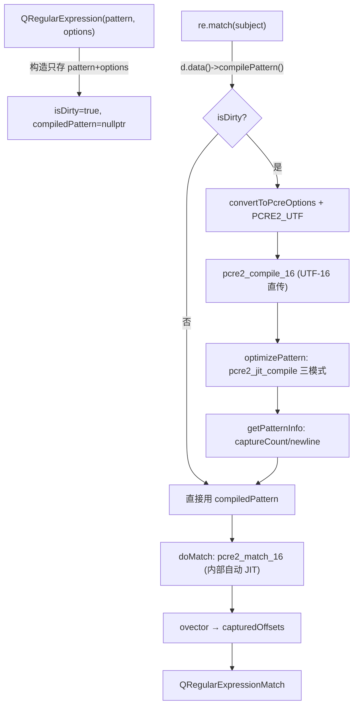

# 现代Qt开发教程（专家篇）1.15——QRegularExpression 封装 PCRE2 源码拆解

## 1. 前言——正则引擎底下的几个想当然

Qt5 起，`QRegularExpression` 取代了老的 `QRegExp`，底层是 PCRE2 库。用法大家都熟：`QRegularExpression re("(\\d+)"); re.match(str)`。但稍微往深里想，几个问题能把人问住。

笔者先把当年自己答不上来的摆出来。`new QRegularExpression("pattern")` 这一刀下去，pattern 是当场编译了，还是等第一次 match 才编译？`QString` 是 UTF-16，传给 PCRE2 时 Qt 是转成 UTF-8，还是直接喂 UTF-16？`PatternOption` 那些枚举值，跟 PCRE2 自己的 `PCRE2_CASELESS` 之类，数值一样吗？JIT 加速要不要咱们手动开？最隐蔽的：Qt 匹配时调的是 `pcre2_match` 还是 `pcre2_jit_match`？同一个 `QRegularExpression` 对象，多个线程并发 match，安全吗？

这些问题，压在 `QRegularExpression` 设计的几条主轴上：懒编译（构造只存 pattern，首次 match 才编译）、16 位宽接口（直接喂 UTF-16，不转 UTF-8）、选项映射（Qt 枚举值与 PCRE2 不同，需显式转换）、JIT 默认开（Release 自动 JIT，编译时一并完成）、统一匹配入口（用 `pcre2_match_16`，PCRE2 内部自动走 JIT）、线程安全三层（隐式共享 + mutex + thread_local JIT 栈）。

入门篇教了 `QRegularExpression` 怎么用，进阶篇补了 capture、lookahead、性能。本篇要往源码里捅：咱们打开 `qregularexpression.cpp`，看看 pattern 是怎么编译的、match 是怎么调 PCRE2 的、JIT 默认开不开、跨线程并发 match 凭啥安全。

边界先划清楚。PCRE2 库本身的正则引擎实现（NFA/DFA/回溯算法、字符类展开）不在本篇——本篇讲 Qt 怎么封装调用 PCRE2，不讲 PCRE2 内部。`QRegularExpressionMatch` 的 `captured`/`mid` 等便捷方法只在「ovector 到 capturedOffsets」机制层面点到。正则语法本身（贪婪、前瞻断言、反向引用）是正则语言主题，不在本篇。`QRegExp`（Qt4/5 老类，Qt6 已移除）的迁移对比不展开。

## 2. 环境说明

本篇源码引用基于 `qt_src/qt6.9.1`，行号随 Qt 版本会漂移，对照阅读时拿函数名定位最稳。正则涉及的关键文件：

| 文件 | 角色 |
|---|---|
| `qtbase/src/corelib/text/qregularexpression.h` | QRegularExpression/Match/Iterator 公共声明 + PatternOption/MatchOption 枚举 |
| `qtbase/src/corelib/text/qregularexpression.cpp` | PCRE2 封装：compilePattern/optimizePattern/doMatch/convertToPcreOptions（3090 行） |
| `qtbase/src/3rdparty/pcre2/` | PCRE2 第三方库（本篇只看 Qt 调的 pcre2_*_16 API，不深入） |

本篇无配套 example，原因和前几篇一样：纯源码拆解，对照 `qt_src` 翻代码就是最好的实验。

## 3. 核心概念讲解

下源码之前，咱们先把一条「构造 → match → 拿捕获」的完整链路对一下：



构造只存字段不编译，`match` 才触发编译；编译走 `pcre2_compile_16`（UTF-16 直传）+ 强制 `PCRE2_UTF` + 自动 JIT；匹配走 `pcre2_match_16`（PCRE2 内部检测 JIT），结果从 ovector 拷出来。咱们这一篇顺着这条链拆。

### 3.1 构造不编译，懒等到首次 match

这是本篇第一个大纠偏点。很多人以为构造函数会编译 pattern——不会。

`qt_src/qt6.9.1/qtbase/src/corelib/text/qregularexpression.cpp:1348-1353`

```cpp
QRegularExpression::QRegularExpression(const QString &pattern, PatternOptions options)
    : d(new QRegularExpressionPrivate)
{
    d->pattern = pattern;
    d->patternOptions = options;
}
```

构造函数体就三行：new 一个 Private、存 pattern、存 options。没有调 `compilePattern`。那编译啥时候发生？看 Private 的默认状态：

`qt_src/qt6.9.1/qtbase/src/corelib/text/qregularexpression.cpp:824-836`（节选）

```cpp
QRegularExpressionPrivate::QRegularExpressionPrivate()
    : QSharedData(),
      patternOptions(),
      pattern(),
      mutex(),
      compiledPattern(nullptr),
      ...
      isDirty(true)
{}
```

`compiledPattern` 默认 nullptr，`isDirty` 默认 true。编译推迟到首次真正需要时——`match`、`isValid`、`errorString`、`captureCount` 这些方法的第一行都是 `d.data()->compilePattern()`。看 match 入口：

`qt_src/qt6.9.1/qtbase/src/corelib/text/qregularexpression.cpp:1587-1600`

```cpp
QRegularExpressionMatch QRegularExpression::match(const QString &subject,
                                                  qsizetype offset,
                                                  MatchType matchType,
                                                  MatchOptions matchOptions) const
{
    d.data()->compilePattern();
    auto priv = new QRegularExpressionMatchPrivate(*this,
                                                   subject,
                                                   QStringView(subject),
                                                   matchType,
                                                   matchOptions);
    d->doMatch(priv, offset);
    return QRegularExpressionMatch(*priv);
}
```

第一行 `d.data()->compilePattern()`。注意是 `d.data()` 而不是 `d->`——`d` 是 `QExplicitlySharedDataPointer`，`d->` 在 const 成员里会触发 detach（写时复制），而 `d.data()` 只取裸指针不触发引用计数，绕过 detach。`compilePattern` 本身能被 const 对象调，是因为它用的 `mutex` 是 `mutable`。

`compilePattern` 的实现：

`qt_src/qt6.9.1/qtbase/src/corelib/text/qregularexpression.cpp:885-916`（节选）

```cpp
void QRegularExpressionPrivate::compilePattern()
{
    const QMutexLocker lock(&mutex);

    if (!isDirty)
        return;

    isDirty = false;
    cleanCompiledPattern();

    int options = convertToPcreOptions(patternOptions);
    options |= PCRE2_UTF;

    PCRE2_SIZE patternErrorOffset;
    compiledPattern = pcre2_compile_16(reinterpret_cast<PCRE2_SPTR16>(pattern.constData()),
                                       pattern.size(),
                                       options,
                                       &errorCode,
                                       &patternErrorOffset,
                                       nullptr);
    ...
    optimizePattern();
    getPatternInfo();
}
```

三步：加锁（防并发编译）、`!isDirty` 早退（避免重复编译）、`pcre2_compile_16` 真编译，末尾再调 `optimizePattern`（JIT）和 `getPatternInfo`（capture 数等）。

懒编译有个副作用，笔者踩过：`isValid()` 这个看着像纯查询的方法，其实会触发编译：

`qt_src/qt6.9.1/qtbase/src/corelib/text/qregularexpression.cpp:1525-1529`

```cpp
bool QRegularExpression::isValid() const
{
    d.data()->compilePattern();
    return d->compiledPattern;
}
```

它编译后返回 `compiledPattern` 指针非空。所以您在性能敏感路径里调 `isValid()`，第一次是有编译开销的——别以为它是 O(1) 查询。

### 3.2 直接喂 UTF-16，不转 UTF-8

第二个大纠偏点。`QString` 内部是 UTF-16，PCRE2 既能吃 UTF-8 也能吃 UTF-16。Qt 选哪个？

`qt_src/qt6.9.1/qtbase/src/corelib/text/qregularexpression.cpp:899-904`

```cpp
    compiledPattern = pcre2_compile_16(reinterpret_cast<PCRE2_SPTR16>(pattern.constData()),
                                       pattern.size(),
                                       options,
                                       &errorCode,
                                       &patternErrorOffset,
                                       nullptr);
```

注意那个 `_16` 后缀——PCRE2 的 16 位宽接口。`pattern.constData()` 返回 `const QChar*`（即 UTF-16 的 char16_t），直接 `reinterpret_cast` 成 `PCRE2_SPTR16` 喂进去，不转 UTF-8。笔者 grep 了整个 `qregularexpression.cpp`，`_8` 后缀的 PCRE2 调用零命中。

subject 字符串（被匹配的文本）也一样：

`qt_src/qt6.9.1/qtbase/src/corelib/text/qregularexpression.cpp:1158-1169`（节选）

```cpp
    const char16_t * const subjectUtf16 = [&]()
    {
        const auto subjectUtf16 = priv->subject.utf16();
        if (subjectUtf16)
            return subjectUtf16;
        Q_ASSERT(subjectLength == 0);
        return &dummySubject;
    }();
    ...
    result = safe_pcre2_match_16(compiledPattern,
                                 reinterpret_cast<PCRE2_SPTR16>(subjectUtf16), subjectLength,
                                 offset, pcreOptions,
                                 matchData, matchContext);
```

`priv->subject.utf16()` 直接拿 UTF-16 指针传。空串给个 dummy 指针——因为 PCRE2 不接受 nullptr subject，哪怕长度是 0。

这么设计，笔者第一次看时觉得理所当然，细想才明白它省了 QString（UTF-16）和 UTF-8 之间的来回转换开销。代价是 Qt 链接的 PCRE2 必须编译时启用 16 位支持（Qt 自带的 PCRE2 第三方库默认开了）。

还有个细节：编译选项里硬叠加了 `PCRE2_UTF`：

```cpp
    int options = convertToPcreOptions(patternOptions);
    options |= PCRE2_UTF;
```

这意味着 `QRegularExpression` 永远是 Unicode 模式——pattern 和 subject 都按 UTF 解码，您不用也不能关掉。

### 3.3 PatternOption 值跟 PCRE2 不一样，得映射

第三个大纠偏点。`PatternOption` 枚举的数值，跟 PCRE2 对应选项的数值一样吗？不一样。

`qt_src/qt6.9.1/qtbase/src/corelib/text/qregularexpression.h:33-46`

```cpp
    enum PatternOption {
        NoPatternOption                = 0x0000,
        CaseInsensitiveOption          = 0x0001,
        DotMatchesEverythingOption     = 0x0002,
        MultilineOption                = 0x0004,
        ExtendedPatternSyntaxOption    = 0x0008,
        InvertedGreedinessOption       = 0x0010,
        DontCaptureOption              = 0x0020,
        UseUnicodePropertiesOption     = 0x0040,
    };
```

Qt 自己定的位掩码，`0x1`/`0x2`/`0x4` 连续位。PCRE2 那边，`PCRE2_CASELESS` 是 `0x00000008`，`PCRE2_DOTALL` 是另一个值——两套完全不同的数值。所以不能直接把 `PatternOption` 的位掩码当 PCRE2 选项传，得经过一个映射函数：

`qt_src/qt6.9.1/qtbase/src/corelib/text/qregularexpression.cpp:669-689`

```cpp
static int convertToPcreOptions(QRegularExpression::PatternOptions patternOptions)
{
    int options = 0;

    if (patternOptions & QRegularExpression::CaseInsensitiveOption)
        options |= PCRE2_CASELESS;
    if (patternOptions & QRegularExpression::DotMatchesEverythingOption)
        options |= PCRE2_DOTALL;
    if (patternOptions & QRegularExpression::MultilineOption)
        options |= PCRE2_MULTILINE;
    if (patternOptions & QRegularExpression::ExtendedPatternSyntaxOption)
        options |= PCRE2_EXTENDED;
    if (patternOptions & QRegularExpression::InvertedGreedinessOption)
        options |= PCRE2_UNGREEDY;
    if (patternOptions & QRegularExpression::DontCaptureOption)
        options |= PCRE2_NO_AUTO_CAPTURE;
    if (patternOptions & QRegularExpression::UseUnicodePropertiesOption)
        options |= PCRE2_UCP;

    return options;
}
```

逐位映射。教材里常说「PatternOption 数值等于 PCRE2」是错的——您要是哪天想绕过 Qt 直接调 PCRE2，千万别拿 `PatternOption` 的值直接传，得走这个映射。`MatchOption` 同理，映射到 `PCRE2_ANCHORED`（`AnchorAtOffsetMatchOption`）和 `PCRE2_NO_UTF_CHECK`（`DontCheckSubjectStringMatchOption`，跳过 UTF 合法性校验，非法串可能崩）。

顺带，`PatternOption` 里曾经有两个选项 `OptimizeOnFirstUsageOption`/`DontAutomaticallyOptimizeOption`（值 0x0080/0x0100），Qt 6.0 删了——因为 JIT 改成自动管理了，这俩没意义。您在老代码里看到它们，删掉就行。

### 3.4 JIT Release 默认开，编译时自动搞定

第四个大纠偏点，也是很多人误解的。JIT 加速要不要咱们手动开？不要，Release 默认就开。

`qt_src/qt6.9.1/qtbase/src/corelib/text/qregularexpression.cpp:974-990`

```cpp
static bool isJitEnabled()
{
    QByteArray jitEnvironment = qgetenv("QT_ENABLE_REGEXP_JIT");
    if (!jitEnvironment.isEmpty()) {
        bool ok;
        int enableJit = jitEnvironment.toInt(&ok);
        return ok ? (enableJit != 0) : true;
    }

#ifdef QT_DEBUG
    return false;
#elif defined(Q_OS_MACOS)
    return !qt_mac_runningUnderRosetta();
#else
    return true;
#endif
}
```

优先级：环境变量 `QT_ENABLE_REGEXP_JIT`（非空按整数解析，解析失败当 true）→ Debug 构建关 → macOS 在 Rosetta2 转译下关（避免转译双重开销）→ 其余（Release Linux/Windows）默认开。所以 Release 部署的程序，JIT 自动开——笔者以前还纠结过「要不要手动调 optimize」，根本不用管。

JIT 编译在哪触发？3.1 节 `compilePattern` 末尾调了 `optimizePattern`：

`qt_src/qt6.9.1/qtbase/src/corelib/text/qregularexpression.cpp:1001-1011`

```cpp
void QRegularExpressionPrivate::optimizePattern()
{
    Q_ASSERT(compiledPattern);

    static const bool enableJit = isJitEnabled();

    if (!enableJit)
        return;

    pcre2_jit_compile_16(compiledPattern, PCRE2_JIT_COMPLETE | PCRE2_JIT_PARTIAL_SOFT | PCRE2_JIT_PARTIAL_HARD);
}
```

`static const bool enableJit = isJitEnabled()`——首次调用就固化，进程内不再变。enableJit 时 `pcre2_jit_compile_16` 三种模式全编：`JIT_COMPLETE`（普通匹配）、`JIT_PARTIAL_SOFT`、`JIT_PARTIAL_HARD`（partial 匹配两种），覆盖所有 `MatchType`。所以编译 pattern 那一刻，JIT 就一并搞定了，不是 match 时才 JIT。

公开的 `QRegularExpression::optimize()` 方法呢？它只是手动触发 `compilePattern` 的入口，实际不额外做事——JIT 已经在编译时做完了。您调不调 `optimize()`，Release 下行为一样。

### 3.5 匹配调 pcre2_match_16，不是 pcre2_jit_match

第五个大纠偏点。PCRE2 有两个匹配入口：`pcre2_match`（解释器+JIT 自动选）和 `pcre2_jit_match`（只走 JIT，pattern 没 JIT 就失败）。Qt 用哪个？

`qt_src/qt6.9.1/qtbase/src/corelib/text/qregularexpression.cpp:1055-1074`

```cpp
static int safe_pcre2_match_16(const pcre2_code_16 *code,
                               PCRE2_SPTR16 subject, qsizetype length,
                               qsizetype startOffset, int options,
                               pcre2_match_data_16 *matchData,
                               pcre2_match_context_16 *matchContext)
{
    int result = pcre2_match_16(code, subject, length,
                                startOffset, options, matchData, matchContext);

    if (result == PCRE2_ERROR_JIT_STACKLIMIT && !jitStacks) {
        // The default JIT stack size in PCRE is 32K,
        // we allocate from 32K up to 512K.
        jitStacks.reset(pcre2_jit_stack_create_16(32 * 1024, 512 * 1024, NULL));

        result = pcre2_match_16(code, subject, length,
                                startOffset, options, matchData, matchContext);
    }

    return result;
}
```

`pcre2_match_16`。笔者 grep 全文件，`pcre2_jit_match` 零命中。PCRE2 的设计是：`pcre2_match` 内部会自动检测 pattern 有没有 JIT 编译过，有就走 JIT 路径，没有就走解释器——统一入口，上层不用选。教材里常说「Qt 用 `pcre2_jit_match` 才走 JIT」是错的。

`safe_pcre2_match_16` 这个包装层只处理一件事：JIT 栈耗尽（`PCRE2_ERROR_JIT_STACKLIMIT`）时，分配一个 32K-512K 的 thread_local JIT 栈，重试一次。默认 PCRE2 的 JIT 栈是 32K，深度回溯的正则可能不够。

匹配结果怎么取？PCRE2 把捕获组的偏移存在 ovector 里：

`qt_src/qt6.9.1/qtbase/src/corelib/text/qregularexpression.cpp:1232-1244`

```cpp
    if (priv->capturedCount) {
        PCRE2_SIZE *ovector = pcre2_get_ovector_pointer_16(matchData);
        qsizetype *const capturedOffsets = priv->capturedOffsets.data();

        static_assert(qsizetype(PCRE2_UNSET) == qsizetype(-1), "Internal error: PCRE2 changed its API");

        for (int i = 0; i < priv->capturedCount * 2; ++i)
            capturedOffsets[i] = qsizetype(ovector[i]);
```

ovector 是 `PCRE2_SIZE` 数组，start/end 交替。Qt 逐对拷到自己的 `capturedOffsets`。那个 `static_assert(PCRE2_UNSET == -1)` 是关键——PCRE2 约定未参与匹配的捕获组偏移是 `PCRE2_UNSET`（值 -1），Qt 靠这个区分「没匹配到」。所以您 `capturedStart(n)` 返回 -1，就是这个机制。

### 3.6 命名捕获与 (?J) 的不支持

命名捕获组（`(?<name>...)`）查 name 对应的索引，靠 PCRE2 的 name table：

`qt_src/qt6.9.1/qtbase/src/corelib/text/qregularexpression.cpp:1019-1046`（节选）

```cpp
int QRegularExpressionPrivate::captureIndexForName(QAnyStringView name) const
{
    ...
    PCRE2_SPTR16 *namedCapturingTable;
    unsigned int namedCapturingTableEntryCount;
    unsigned int namedCapturingTableEntrySize;

    pcre2_pattern_info_16(compiledPattern, PCRE2_INFO_NAMETABLE, &namedCapturingTable);
    pcre2_pattern_info_16(compiledPattern, PCRE2_INFO_NAMECOUNT, &namedCapturingTableEntryCount);
    pcre2_pattern_info_16(compiledPattern, PCRE2_INFO_NAMEENTRYSIZE, &namedCapturingTableEntrySize);

    for (unsigned int i = 0; i < namedCapturingTableEntryCount; ++i) {
        ...
        if (name == (currentNamedCapturingTableRow + 1)) {
            const int index = *currentNamedCapturingTableRow;
            return index;
        }
    }
    return -1;
}
```

PCRE2 的 name table 每条目结构是「首 char16_t 存组号 + 后跟 NUL 结尾的 name 字符串」。Qt 拿到表后线性扫描比对 name。这有个隐含假设：name 唯一。

PCRE2 有个 `(?J)` 选项允许「重名捕获组」。但 Qt 显式不支持：

`qt_src/qt6.9.1/qtbase/src/corelib/text/qregularexpression.cpp:938-943`

```cpp
    unsigned int hasJOptionChanged;
    pcre2_pattern_info_16(compiledPattern, PCRE2_INFO_JCHANGED, &hasJOptionChanged);
    if (Q_UNLIKELY(hasJOptionChanged)) {
        qWarning("QRegularExpressionPrivate::getPatternInfo(): the pattern '%ls'\n    is using the (?J) option; duplicate capturing group names are not supported by Qt",
                 qUtf16Printable(pattern));
    }
```

检测到 `PCRE2_INFO_JCHANGED`（pattern 用了 (?J)）就 qWarning。注意是「警告+放行」，不是拒绝编译——pattern 照样能用，但 `namedCaptureGroups()` 在重名场景下行为未定义，因为 `captureIndexForName` 假设 name 唯一，重名时只返回扫到的第一个。教材说「QRegularExpression 完整支持 PCRE2 全部特性」是错的，笔者翻到这行才确认——`(?J)` 是有意阉割。

### 3.7 线程安全三层，const 对象可并发 match

最后一个大问题：同一个 `QRegularExpression` 对象，多线程并发 match 安全吗？答案是——const 使用（已编译、只 match）安全，靠三层设计。

第一层，隐式共享。`QRegularExpression` 用 `QExplicitlySharedDataPointer` 持有 Private，Private 继承 `QSharedData`。多个 `QRegularExpression` 拷贝共享同一份 Private，引用计数管理。您改 pattern 或 options 时触发 detach（写时复制）：

`qt_src/qt6.9.1/qtbase/src/corelib/text/qregularexpression.cpp:1412-1419`

```cpp
void QRegularExpression::setPattern(const QString &pattern)
{
    if (d->pattern == pattern)
        return;
    d.detach();
    d->isDirty = true;
    d->pattern = pattern;
}
```

`d.detach()` 在引用计数 > 1 时拷贝一份新 Private。新副本的 `compiledPattern` 被拷贝构造函数置 nullptr，`isDirty=true`——下次 match 重新编译。这是「隐式共享 + 懒编译」的协奏：共享只读时零拷贝，写时才拷贝+重编译。

第二层，mutex 保护编译。Private 持有 `mutable QMutex mutex`，`compilePattern` 加锁：

```cpp
void QRegularExpressionPrivate::compilePattern()
{
    const QMutexLocker lock(&mutex);
    if (!isDirty)
        return;
    ...
}
```

多线程同时首次 match 同一个对象，mutex 保证只编译一次，其他线程等着，编译完共享结果。`compiledPattern`（PCRE2 编译后的 pattern 对象）本身是只读的，编译好后多线程并发读安全。

第三层，JIT 栈 thread_local：

`qt_src/qt6.9.1/qtbase/src/corelib/text/qregularexpression.cpp:948-969`（节选）

```cpp
Q_CONSTINIT static thread_local std::unique_ptr<pcre2_jit_stack_16, PcreJitStackFree> jitStacks;

static pcre2_jit_stack_16 *qtPcreCallback(void *)
{
    return jitStacks.get();
}
```

每个线程一个独立的 JIT 栈，通过 PCRE2 的 callback（`qtPcreCallback`）在 match 时挂上去。这保证多线程并发 match 不会抢同一个 JIT 栈——这是 JIT 路径能跨线程并发的关键。

再加上 `match_context` 和 `match_data` 是 per-call 创建销毁的（3.5 节 doMatch 里每次 match 都 `pcre2_match_context_create` + `pcre2_match_data_create_from_pattern`），并发 match 之间没有共享可变状态。结论：const 已编译的 `QRegularExpression` 对象，多线程并发 match 完全安全。

`globalMatch` 的迭代器推进：

`qt_src/qt6.9.1/qtbase/src/corelib/text/qregularexpression.cpp:1286-1306`（节选）

```cpp
QRegularExpressionMatch QRegularExpressionMatchPrivate::nextMatch() const
{
    ...
    auto nextPrivate = new QRegularExpressionMatchPrivate(regularExpression,
                                                          subjectStorage,
                                                          subject,
                                                          matchType,
                                                          matchOptions);
    regularExpression.d->doMatch(nextPrivate,
                                 capturedOffsets.at(1),
                                 QRegularExpressionPrivate::DontCheckSubjectString,
                                 this);
    return QRegularExpressionMatch(*nextPrivate);
}
```

每次 `next()` 以上一次匹配的 end 为新 offset 再 match。推进时传 `DontCheckSubjectString`——同一 subject 已校验过，跳过 UTF 检查省时。空匹配有特殊处理：上次匹配是空串时，这次强制 `ANCHORED|NOTEMPTY_ATSTART`，失败就 offset+1 推进，还要正确跳过 CRLF（`\r\n` 当一个换行）和 UTF-16 代理对。这就是 3.1 节 `getPatternInfo` 里那个 `usingCrLfNewlines` 标志的用处。

### 3.8 工具函数：anchoredPattern、wildcard、escape

最后补几个工具函数。

锚定整个 pattern：

`qt_src/qt6.9.1/qtbase/src/corelib/text/qregularexpression.cpp:2077-2083`

```cpp
QString QRegularExpression::anchoredPattern(QStringView expression)
{
    return QString()
           + "\\A(?:"
           + expression
           + ")\\z";
}
```

返回 `\A(?:expr)\z`。`\A` 是串首、`\z` 是串尾——跟 `^`/`$` 不同，`^`/`$` 受 `MultilineOption` 影响（多行模式下匹配每行首尾），`\A`/`\z` 永远是整个字符串的绝对首尾。外层包 `(?:...)` 非捕获组，防止 expr 里有 `|` 时锚定范围错乱（不包的话 `\Aa|b\z` 会被解释成「`\Aa` 或 `b\z`」，不是您要的「锚定 `a|b`」）。

通配符转正则：

`qt_src/qt6.9.1/qtbase/src/corelib/text/qregularexpression.cpp:1931-1959`（节选）

```cpp
    const GlobSettings settings = [options]() {
        if (options.testFlag(NonPathWildcardConversion)) {
            return GlobSettings{ u'\0', u".*", u"." };
        } else {
#ifdef Q_OS_WIN
            return GlobSettings{ u'\\', u"[^/\\\\]*", u"[^/\\\\]" };
#else
            return GlobSettings{ u'/', u"[^/]*", u"[^/]" };
#endif
        }
    }();

    rx += u"(?s:";
```

`wildcardToRegularExpression` 默认按「文件路径 glob」转换——`*` 变 `[^/]*`（Unix）或 `[^/\\]*`（Windows），不跨目录分隔符。生成的正则外层套 `(?s:` 强制 DOTALL（让 `.` 匹配换行）+ 默认锚定。要非路径模式（`*` 匹配任意含 `/`），传 `NonPathWildcardConversion`。`fromWildcard` 是便捷封装，转完直接构 `QRegularExpression`。

`escape` 把字符串字面量转义成可安全放进正则的形式（等价 Perl `quotemeta`）：

`qt_src/qt6.9.1/qtbase/src/corelib/text/qregularexpression.cpp:1809-1841`（节选）

```cpp
QString QRegularExpression::escape(QStringView str)
{
    ...
    for (qsizetype i = 0; i < count; ++i) {
        const QChar current = str.at(i);
        if (current == QChar::Null) {
            result.append(u'\\');
            result.append(u'0');
        } else if ((current < u'a' || current > u'z') &&
                   (current < u'A' || current > u'Z') &&
                   (current < u'0' || current > u'9') &&
                   current != u'_') {
            result.append(u'\\');
            result.append(current);
            ...
        } else {
            result.append(current);
        }
    }
```

ASCII 字母/数字/下划线原样，其他全加 `\`。两个坑：NUL 必须转义成 `\0`（反斜杠+0），因为 PCRE2 pattern 是 NUL 终止串；高代理项要连同低代理项一起转义（避免拆开 emoji）。

## 4. 踩坑预防

本篇踩坑只讲源码里能直接对应、笔者自己也栽过的真坑。

### 4.1 构造不编译，isValid() 有副作用

后果：您在性能敏感的热路径里写 `if (re.isValid()) { ... }`，以为这是 O(1) 查询，结果第一次调用触发了 pattern 编译（含 JIT），卡了一下。或者您构造了一堆 `QRegularExpression` 对象放在容器里「预编译」，其实它们都没编译，第一次用才编译。

根因是 3.1 节的懒编译——构造只存字段，`isValid`/`match`/`captureCount` 等首次访问才触发 `compilePattern`。

正确做法：要预热，显式调一次 `re.optimize()`（它触发 `compilePattern` 含 JIT），或者调 `re.match("")` 跑一次空匹配。别把 `isValid()` 当 O(1) 查询用在热路径。

### 4.2 JIT Debug 关、Release 开，性能差先查这个

后果：您在 Debug 构建下测正则性能，发现比预期慢一个数量级，怀疑自己 pattern 写得烂。其实是 Debug 构建下 JIT 默认关（`isJitEnabled` 在 `QT_DEBUG` 下返 false），走的解释器。到了 Release 部署，性能突然正常了，您又一脸懵。

根因是 3.4 节的 `isJitEnabled`——Debug 默认关 JIT。

正确做法：性能测试在 Release 下做。Debug 下想开 JIT，设环境变量 `QT_ENABLE_REGEXP_JIT=1`。另外 macOS 在 Rosetta2 转译下也关 JIT（双重转译开销），原生 arm64 不受影响。

### 4.3 (?J) 重复命名警告但放行，行为未定义

后果：您用了 PCRE2 的 `(?J)` 开启重名捕获组（比如不同分支同名 `(?J)(?<id>...)|(?<id>...)`），程序不报错只打个 qWarning，您以为能用。结果 `namedCaptureGroups()` 返回的列表、`captured("id")` 取的值都不对——因为 Qt 的 `captureIndexForName` 假设 name 唯一，重名只返回第一个。

根因是 3.6 节的 (?J) 不支持——qWarning+放行，不拒绝编译。

正确做法：别在 QRegularExpression 里用 `(?J)`。要不同分支抓同类信息，用不同 name（`id1`/`id2`），或者在业务层处理。

### 4.4 setPattern 会 detach，多线程下注意

后果：您一个 `QRegularExpression` 对象在多线程并发 match，同时另一线程调 `setPattern` 改了它。setPattern 触发 detach（写时复制），改 pattern 的线程拿到新副本，但 match 的线程可能还在用旧的 compiledPattern——这本身不崩（隐式共享保证旧引用有效），但行为可能不符合预期（一部分 match 用旧 pattern，一部分用新）。

根因是 3.7 节的隐式共享——const 操作共享只读安全，非 const 的 setPattern/setPatternOptions 会 detach。

正确做法：要切换 pattern，新建一个 `QRegularExpression` 对象，而不是改现有的。把 pattern 当「不可变」对待——构造时定好，用的时候不改。要改就换对象。这样多线程并发 match 天然安全。

## 5. 官方文档参考链接

- [QRegularExpression Class](https://doc.qt.io/qt-6/qregularexpression.html) —— 公开 API、PatternOption/MatchOption 枚举
- [QRegularExpression::match](https://doc.qt.io/qt-6/qregularexpression.html#match) —— 匹配入口与懒编译副作用
- [PCRE2 正则语法](https://www.pcre.org/current/doc/html/pcre2pattern.html) —— PCRE2 支持的正则语法（Qt 透传）
- [QRegularExpression::fromWildcard](https://doc.qt.io/qt-6/qregularexpression.html#fromWildcard) —— 通配符转正则
- [QRegularExpression::anchoredPattern](https://doc.qt.io/qt-6/qregularexpression.html#anchoredPattern) —— \A(?:...)\z 锚定

---

`QRegularExpression` 的设计哲学，是「薄封装 + 懒求值 + 自动优化」——Qt 没有重新实现正则引擎，而是把 PCRE2 这个工业级库包了一层 C++ 友好的 API。构造不编译省了无用功，首次 match 才编译；编译时一并 JIT（Release 默认开），匹配时 `pcre2_match` 内部自动选 JIT 路径；UTF-16 直传避免转换开销；隐式共享 + mutex + thread_local JIT 栈三层保证 const 对象跨线程并发安全。这套设计在 99% 的场景下都工作得很好——您写 pattern、match、取 capture，一气呵成。但那 1% 的故障（isValid 副作用、Debug 关 JIT、(?J) 不支持、setPattern detach），都得靠懂源码才能定位。读完这篇，您应该能在正则行为诡异时，知道往哪儿查了。
