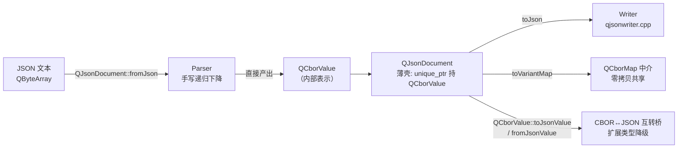
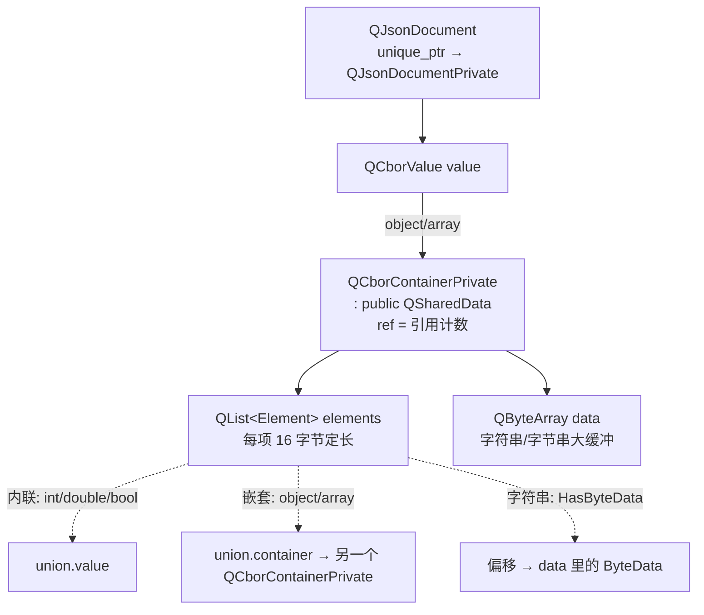

# 现代Qt开发教程（专家篇）1.16——JSON 解析与 CBOR 内核源码拆解

## 1. 前言——为什么要拆 JSON 的源码

下面这几行，咱们配网络接口、读配置文件时大概都写过无数遍：

```cpp
QJsonParseError err;
QJsonDocument doc = QJsonDocument::fromJson(byteArray, &err);
QJsonObject obj = doc.object();
QString name = obj.value("name").toString();
```

用起来丝滑得很，`fromJson` 进、`object()` 出，中间那个 `QJsonDocument` 像个黑盒。但笔者翻源码的时候被一个问题卡住了：`QJsonDocument` 内部到底存的是什么？早年的教程会告诉你「它有个二进制内部格式，可以用 `fromBinaryData`/`toBinaryData` 序列化」——可笔者在 Qt 6.9 的头文件里翻烂了，这俩函数压根找不到。再去追 `QJsonObject::value()` 返回的 `QJsonValue`，它的数据又住在哪儿？

这两个问题串起来的答案，恰恰是本篇要捅破的那层窗户纸：**自 Qt 5.15 起，JSON 在 Qt 内部的表示已经不是什么「JSON 专属的二进制格式」，而是 CBOR。** 咱们手里的 `QJsonDocument`，本质是 `QCborValue` 外面套的一层薄壳；`QJsonObject`/`QJsonArray` 共享的是 `QCborContainerPrivate`；连解析器 `Parser::parse` 吐出来的直接就是 `QCborValue`。换句话说，在 Qt 6 的源码层面，JSON 就是 CBOR 的一个子集——这条线理顺了，前面所有「找不到」「住哪儿」的困惑就全塌下来了。

入门篇 [1.16 JSON 与 XML 解析](../../beginner/01-qtbase/16-json-xml-beginner.md) 带咱们走过了「怎么用」——`QJsonDocument` 怎么解析、`QJsonObject`/`QJsonArray`/`QJsonValue` 怎么遍历、`QJsonParseError` 怎么读错误，那是知其然。进阶篇的 [JSON 与 XML 解析](../../advanced/01-qtbase/16-json-xml-advanced.md) 聊的是高级用法和陷阱。本篇不重复那些 API 层的东西，咱们往源码里钻：把 `QJsonDocument` 这层薄壳揭开，看看 `QCborValue` 怎么承载 JSON、解析器手写的递归下降长什么样、`QVariant` 互转为什么中间非要绕一道 CBOR。

边界得先划清楚，免得读者越读越迷。本篇严格停在「JSON 这条线」上——`QJsonDocument`/`QJsonValue`/`QJsonObject`/`QJsonArray` 四件套、手写解析器 `Parser`、序列化器 `Writer`、以及 JSON 与 CBOR/QVariant 的互转桥。XML 那边的 `QXmlStreamReader` 是一套完全独立的流式拉模型解析器，跟本篇没关系；CBOR 自己的流式编解码（`QCborStreamReader`/`QCborStreamWriter`）咱们也不深拆，只在「它是 JSON 的内部表示」这个视角下看它长什么样。

## 2. 环境说明

本篇所有源码引用基于 `qt_src/qt6.9.1`，行号可能随 Qt 版本升级而漂移。JSON 相关的源码全部集中在 `qtbase/src/corelib/serialization/` 目录下，对照阅读时按函数名或字段名搜索定位即可。

本篇涉及的源码文件（按出现顺序）：

| 文件 | 角色 |
|---|---|
| `qt_src/qt6.9.1/qtbase/src/corelib/serialization/qjsondocument.h` / `.cpp` | QJsonDocument 主体、QJsonDocumentPrivate |
| `qt_src/qt6.9.1/qtbase/src/corelib/serialization/qjsonparseerror.h` | QJsonParseError 错误枚举（15 个值） |
| `qt_src/qt6.9.1/qtbase/src/corelib/serialization/qjsonparser.cpp` / `qjsonparser_p.h` | 手写递归下降解析器（Parser 类） |
| `qt_src/qt6.9.1/qtbase/src/corelib/serialization/qjson_p.h` | QJsonPrivate 命名空间、Value/fromTrustedCbor |
| `qt_src/qt6.9.1/qtbase/src/corelib/serialization/qjsonvalue.h` / `.cpp` | QJsonValue（QCborValue 的语义包装） |
| `qt_src/qt6.9.1/qtbase/src/corelib/serialization/qjsonobject.cpp` / `qjsonarray.cpp` | toVariantMap/fromVariantMap（CBOR 中介） |
| `qt_src/qt6.9.1/qtbase/src/corelib/serialization/qjsonwriter.cpp` / `qjsonwriter_p.h` | JSON 序列化写出（Writer 类） |
| `qt_src/qt6.9.1/qtbase/src/corelib/serialization/qjsoncbor.cpp` | JSON ↔ CBOR 互转桥、QVariant 中介实现 |
| `qt_src/qt6.9.1/qtbase/src/corelib/serialization/qcborvalue_p.h` | QCborContainerPrivate / Element / ByteData 内部布局 |

本篇无配套 example，原因：纯源码解析，没有合理的可跑 demo——你不会为了看 `QCborContainerPrivate` 的内存布局去单独写工程，对着 `qt_src` 翻源码、用调试器观察 `QJsonDocument` 的 `d` 指针就是最好的实验。

## 3. 核心概念讲解

扎进源码之前，咱们先把 JSON 在 Qt 6 里的全链路看清楚。很多朋友读 JSON 源码读不下去，是因为把「解析」「存储」「序列化」「互转」这几件事搅成了一锅。咱们先用一张图把数据流向理顺：



左边进来的 `QByteArray`，经 `Parser` 解析后直接变成 `QCborValue`，这就是 JSON 在 Qt 内部的唯一表示。`QJsonDocument` 只是用 `unique_ptr` 把这个 `QCborValue` 包起来。往右三条出路：`toJson` 走 `Writer` 重新序列化成文本、`toVariantMap` 经 `QCborMap` 中介转成 `QVariant`、CBOR 互转桥负责和原生 CBOR 类型互转。咱们这一篇就顺着这条链走一遍，先从那个最反直觉的事实讲起——`QJsonDocument` 是个薄壳。

### 3.1 QJsonDocument 的真相——它只是 QCborValue 的一层薄壳

笔者第一次打开 `qjsondocument.cpp` 找内部数据结构的时候，准备看到一大坨字段——毕竟一个 JSON 文档要存对象、数组、字符串、数字，怎么也得有个像样的内部表示吧。结果看到的是这个：

`qt_src/qt6.9.1/qtbase/src/corelib/serialization/qjsondocument.cpp:52`

```cpp
class QJsonDocumentPrivate
{
    Q_DISABLE_COPY_MOVE(QJsonDocumentPrivate);
public:
    QJsonDocumentPrivate() = default;
    QJsonDocumentPrivate(QCborValue data) : value(std::move(data)) {}

    QCborValue value;
};
```

就这么一个 `QCborValue value` 字段。整个 `QJsonDocumentPrivate` 里面，除了构造函数，就这一个成员。这意味着 `QJsonDocument` 拿到手里 的，从头到尾就是一个 `QCborValue`——CBOR 的值类型。咱们以为的「JSON 专属内部格式」在 Qt 6 里根本不存在，JSON 数据从被解析出来的那一刻起，住的就是 CBOR 的房子。

那 `QJsonDocument` 自己怎么持有这个 Private？看头文件：

`qt_src/qt6.9.1/qtbase/src/corelib/serialization/qjsondocument.h:110`

```cpp
    std::unique_ptr<QJsonDocumentPrivate> d;
```

注意这里是 `std::unique_ptr`，不是 `QSharedDataPointer`。这是一个关键区分：`QJsonDocument` 本身**不是**隐式共享类，它用 `unique_ptr` 独占那份私有数据。拷贝一个 `QJsonDocument` 时会发生什么？看拷贝构造：

`qt_src/qt6.9.1/qtbase/src/corelib/serialization/qjsondocument.cpp:108`

```cpp
QJsonDocument::QJsonDocument(const QJsonDocument &other)
{
    if (other.d) {
        if (!d)
            d = std::make_unique<QJsonDocumentPrivate>();
        d->value = other.d->value;
    } else {
        d.reset();
    }
}
```

拷贝时 `make_unique` 新建一个 `QJsonDocumentPrivate`，然后把 `other.d->value`（那个 `QCborValue`）赋值过来。这里有个细节值得停下来想：`QCborValue` 自己的赋值是浅拷贝——它内部就 `n`/`container`/`t` 三个字段，`container` 指针被复制但指向同一份底层数据。所以拷贝 `QJsonDocument` 几乎是零成本的，但语义上它是值类型（`Q_DECLARE_SHARED` 也还在），你改副本不会动到原件。真正的引用计数共享发生在更下面一层——`QCborContainerPrivate`，咱们 3.2 节会看到。

`fromJson` 把这个薄壳怎么填上的，也顺带看一眼，它把整条解析链的入口交代得很清楚：

`qt_src/qt6.9.1/qtbase/src/corelib/serialization/qjsondocument.cpp:266`

```cpp
QJsonDocument QJsonDocument::fromJson(const QByteArray &json, QJsonParseError *error)
{
    QJsonPrivate::Parser parser(json.constData(), json.size());
    QJsonDocument result;
    const QCborValue val = parser.parse(error);
    if (val.isArray() || val.isMap()) {
        result.d = std::make_unique<QJsonDocumentPrivate>();
        result.d->value = val;
    } else if (!val.isUndefined() && error) {
        error->error = QJsonParseError::IllegalValue;
        error->offset = 0;
    }
    return result;
}
```

三步走：构造一个 `Parser`，把 `QByteArray` 的 `constData()`（裸 `const char*`）和长度喂进去；调 `parser.parse(error)` 拿到一个 `QCborValue`；最后判断这个值是不是 array 或 map（JSON 规范要求顶层必须是对象或数组）。是的话才 `make_unique` 落盘，不是的话填一个 `IllegalValue` 错误。这里有个容易被忽略的点：`Parser` 构造只吃 `const char*` 加 `int`，没有编码参数——`QByteArray` 被当作 UTF-8 字节流处理，真正的 UTF-8 解码发生在解析器内部（3.3 节细讲）。

在彻底接受「Qt 6 的 JSON 内部就是 CBOR」之前，咱们补一条能堵住所有质疑的版本证据。`QJsonValue` 头文件里有这么一行注释加断言：

`qt_src/qt6.9.1/qtbase/src/corelib/serialization/qjsonvalue.h:128`

```cpp
    // Assert binary compatibility with pre-5.15 QJsonValue
    static_assert(sizeof(QExplicitlySharedDataPointer<QCborContainerPrivate>) == sizeof(void *));
```

这句 `pre-5.15` 是关键。它说明 JSON 内部表示切到 CBOR 这件事，**不是 Qt 6 才发生的，而是 Qt 5.15 就动手了**——5.15 把 `QJsonValue` 内部换成 `QCborValue`，并用 `static_assert` 锁住指针大小不变，保住和 5.14 的二进制兼容。Qt 6 只是在这个基础上继续深化：解析器直接产 `QCborValue`、把旧的二进制格式 API 删干净。所以严格讲，本篇讲的是「自 5.15 起确立、Qt 6 全系列继承」的内核，不是 Qt 6 独创。

### 3.2 QCborContainerPrivate——JSON 数据真正住的地方

既然 `QJsonDocument` 是薄壳，真正的数据结构就得往 `QCborValue` 下面找。对象和数组对应的是 `QCborContainerPrivate`，它是整个 CBOR 内核的地基：

`qt_src/qt6.9.1/qtbase/src/corelib/serialization/qcborvalue_p.h:98`

```cpp
class QCborContainerPrivate : public QSharedData
{
    friend class QExplicitlySharedDataPointer<QCborContainerPrivate>;
    ...
    QByteArray::size_type usedData = 0;
    QByteArray data;
    QList<QtCbor::Element> elements;
```

三件事先点明。第一，它 `public QSharedData`——`QSharedData` 是 Qt 隐式共享的根基，里面那个 `QAtomicInt ref` 就是引用计数器，`QCborContainerPrivate` 自己没造轮子，直接继承来用。第二，它持一个 `QList<QtCbor::Element> elements` 元素表和一个 `QByteArray data` 大缓冲。第三，前面那个 `QExplicitlySharedDataPointer<QCborContainerPrivate>` 友元，正是 `QJsonObject::o`、`QJsonArray::a` 这两个成员的类型——也就是说，`QJsonObject` 和 `QJsonArray` 拿到的，是指向同一类容器的共享指针。

`Element` 是元素表里每一项的结构，定长 16 字节：

`qt_src/qt6.9.1/qtbase/src/corelib/serialization/qcborvalue_p.h:38`

```cpp
struct Element
{
    enum ValueFlag : quint32 {
        IsContainer                 = 0x0001,
        HasByteData                 = 0x0002,
        StringIsUtf16               = 0x0004,
        StringIsAscii               = 0x0008
    };
    Q_DECLARE_FLAGS(ValueFlags, ValueFlag)

    union {
        qint64 value;
        QCborContainerPrivate *container;
    };
    QCborValue::Type type;
    ValueFlags flags = {};
```

这里设计得很巧：一个 `union` 把「内联值」和「子容器指针」挤在同一个 8 字节槽位里。整数、双精度、布尔、null 这些基本类型直接内联在 `value`（`double` 通过 `memcpy` 重解释成 `qint64` 存进去）；嵌套的对象、数组则把指针放在 `container`。到底这个槽位现在是 `value` 还是 `container`，靠 `flags` 的 `IsContainer` 位判断。`HasByteData` 位则表示 `value` 现在不是数字，而是指向 `data` 缓冲里某个 `ByteData` 的偏移——字符串和字节串走这条路。`flags` 里还藏着字符串的编码档位 `StringIsUtf16`/`StringIsAscii`，咱们马上讲。

`ByteData` 是字符串/字节串在 `data` 缓冲里的头部，变长结构：

`qt_src/qt6.9.1/qtbase/src/corelib/serialization/qcborvalue_p.h:75`

```cpp
struct ByteData
{
    QByteArray::size_type len;

    const char *byte() const        { return reinterpret_cast<const char *>(this + 1); }
    const QChar *utf16() const      { return reinterpret_cast<const QChar *>(this + 1); }
```

头部只记一个 `len`，真正的字节紧跟在 `this + 1` 之后（`this + 1` 按结构体大小对齐跳过头部）。同一块内存，按 `flags` 里的编码档位，可以被解释成 `byte()`（UTF-8 或 Latin-1 的窄字符）或 `utf16()`（`QChar` 宽字符）。这就是 Qt 6 给字符串做的三档存储优化，咱们在 3.3 节看解析器怎么往这三档里填。

把这套布局画出来，JSON 数据在内存里的样子就清楚了：



一个 `QJsonDocument` 经 `QCborValue` 指向一个 `QCborContainerPrivate`，后者手里一张 `elements` 表加一个 `data` 缓冲。每个 `Element` 要么内联基本值，要么指向子容器（递归下去就是 JSON 的嵌套结构），要么用偏移引用 `data` 里的字符串。这就是 Qt 6 里一个 JSON 文档在内存中的全部真相。

### 3.3 Parser——一台手写的递归下降解析器

数据结构看完了，现在看数据是怎么从文本变出来的。Qt 的 JSON 解析器是一台纯手写的递归下降解析器，不是 `yacc`/`lex` 生成的，也不是表驱动的状态机。咱们看它的类声明：

`qt_src/qt6.9.1/qtbase/src/corelib/serialization/qjsonparser_p.h:26`

```cpp
class Parser
{
public:
    Parser(const char *json, int length);

    QCborValue parse(QJsonParseError *error);

private:
    inline void eatBOM();
    inline bool eatSpace();
    inline char nextToken();

    bool parseObject();
    bool parseArray();
    bool parseMember();
    bool parseString();
    bool parseValueIntoContainer();
    QCborValue parseValue();
    QCborValue parseNumber();
```

六个互相递归的私有方法——`parseObject`/`parseArray`/`parseMember`/`parseString`/`parseValue`/`parseNumber`——恰好对应 RFC 8259 的文法规则。`parseValue` 遇到 `[` 调 `parseArray`、遇到 `{` 调 `parseObject`，后者又对每个元素调 `parseValueIntoContainer` 再回到 `parseValue`，递归就 这样自然地嵌下去。没有任何状态转移表，也没有词法生成器的痕迹，就是一群 `if` 和递归调用。

解析入口 `parse` 第一件事是吃掉 UTF-8 BOM：

`qt_src/qt6.9.1/qtbase/src/corelib/serialization/qjsonparser.cpp:232`

```cpp
void Parser::eatBOM()
{
    // eat UTF-8 byte order mark
    uchar utf8bom[3] = { 0xef, 0xbb, 0xbf };
    if (end - json > 3 &&
        (uchar)json[0] == utf8bom[0] &&
        (uchar)json[1] == utf8bom[1] &&
        (uchar)json[2] == utf8bom[2])
        json += 3;
}
```

只认 UTF-8 的 BOM（`EF BB BF` 三个字节顺序匹配），UTF-16/UTF-32 的 BOM 不处理——这也呼应了前面说的，输入必须是 UTF-8。非 ASCII 字符串的解析走 `scanUtf8Char`，用的是 `QUtf8Functions::fromUtf8` 严格解码，非法 UTF-8 序列直接判 `IllegalUTF8String`，没有回退到 Latin-1 的宽容模式。这一点咱们 4.2 节的坑里还要展开。

递归下降解析器最怕的是栈溢出——恶意构造的超深嵌套 JSON 能把调用栈撑爆。Qt 的防御是一个文件级常量：

`qt_src/qt6.9.1/qtbase/src/corelib/serialization/qjsonparser.cpp:16`

```cpp
static const int nestingLimit = 1024;
```

`parseObject` 和 `parseArray` 入口处都有一句 `if (++nestingLevel > nestingLimit)` 的检查，超过 1024 层嵌套就报 `DeepNesting` 终止。因为解析器是真递归（`parseValue` 调 `parseArray`/`parseObject`，后者又调回 `parseValue`），`nestingLevel` 和 C++ 调用栈深度一一对应，这个上限本质上是栈深度的间接保护——超了会提前失败返回错误，而不是 segfault。

那遇到嵌套结构时，外层容器往哪儿暂存？解析器手里只有一个 `container` 成员指针（单栈），钻进内层之前得把外层存起来。这活儿交给一个 RAII 小助手 `StashedContainer`：

`qt_src/qt6.9.1/qtbase/src/corelib/serialization/qjsonparser.cpp:158`

```cpp
class StashedContainer
{
    Q_DISABLE_COPY_MOVE(StashedContainer)
public:
    StashedContainer(QExplicitlySharedDataPointer<QCborContainerPrivate> *container,
                     QCborValue::Type type)
        : type(type), stashed(std::move(*container))
    {
    }

    QCborValue intoValue(QExplicitlySharedDataPointer<QCborContainerPrivate> *parent)
    {
        std::swap(stashed, *parent);
        return QCborContainerPrivate::makeValue(type, -1, stashed.take(),
                                                QCborContainerPrivate::MoveContainer);
    }
```

`StashedContainer` 构造时用 `std::move` 把当前的 `*container` 接管到 `stashed`，腾出 `container` 给内层 `parseObject`/`parseArray` 用；内层解析完，`intoValue` 把 `stashed` 还给 `parent`，再用 `QCborContainerPrivate::makeValue` 把内层容器包成一个 `QCborValue` 返回。这里 `makeValue` 第二个参数传 `-1`，在容器承载的场景里用 `-1` 标记「值由 container 字段提供」（解析器内部别处也用同样的 `-1` 调 `makeValue`，是一套约定），读者知道这个用法就行，不必把它想成什么神秘哨兵。

数字的解析值得单独看，因为它暴露了 Qt「既支持 64 位整数又支持双精度」的关键技巧。`parseNumber` 把数字切片后，按三段策略处理：

`qt_src/qt6.9.1/qtbase/src/corelib/serialization/qjsonparser.cpp:684`

```cpp
    const QByteArray number = QByteArray::fromRawData(start, json - start);

    if (isInt) {
        bool ok;
        qlonglong n = number.toLongLong(&ok);
        if (ok) {
            return QCborValue(n);
        }
    }

    bool ok;
    double d = number.toDouble(&ok);

    if (!ok) {
        lastError = QJsonParseError::IllegalNumber;
        return QCborValue();
    }

    qint64 n;
    if (convertDoubleTo(d, &n))
        return QCborValue(n);
    return QCborValue(d);
```

三段策略：先看能不能当整数（`isInt` 在没有小数部分、没有指数、且小数位全零时为真，无小数无指数时保持初始的 `true`），能就 `toLongLong` 直接存 `QCborValue(qint64)`；不行就 `toDouble` 走双精度；最后还试一把 `convertDoubleTo`——如果这个 double 本身就是个整数值（比如 `42.0`），就升级回 `qint64` 存储，省得白白占一个双精度的坑。整套数字解析委托给 `QByteArray` 自家的转换函数（底层是 `strtoll`/`strtod` 一族），Qt 没有自己手写 IEEE 解析器。

这套「整数优先、能升级就升级」的策略，是理解 `QJsonValue::type()` 行为的钥匙。JSON 规范里 number 只有一种类型，可 CBOR 内部区分 `Integer` 和 `Double`。于是 `QJsonValue::type()` 把 CBOR 类型映射回 JSON 类型时，做了合并：

`qt_src/qt6.9.1/qtbase/src/corelib/serialization/qjsonvalue.cpp:32`

```cpp
static QJsonValue::Type convertFromCborType(QCborValue::Type type) noexcept
{
    switch (type) {
    ...
    case QCborValue::Double:
    case QCborValue::Integer:
        return QJsonValue::Double;
    ...
```

`QCborValue::Integer` 和 `QCborValue::Double` 都被映射成 `QJsonValue::Double`。这个合并不是 Qt 6 的什么新设计——`QJsonValue` 从 Qt 5.0 就存在，JSON 规范本身只有 number 这一种数字类型，Qt 5 也是对外只报 `Double`。真正属于「CBOR 内核化之后的新机制」的，是内部用 `QCborValue::Integer` 标签保住了 64 位精度：对外 `type()` 报 `Double`，对内却可能存的是 `qint64`。`QJsonValue(double)` 构造时还会反过来用 `convertDoubleTo` 试着把整数值的 double 升级成 `qint64`，避免 IEEE 754 的精度损失。这是 CBOR 内核带来的副产物，不是 Qt 独创的 JSON 扩展。

最后看一个很多朋友没意识到的行为：JSON 对象的 key 排序。你可能以为 `toJson` 写出时才排序，其实不是——排序在解析阶段就做完了。`parseObject` 收尾时调 `sortContainer`：

`qt_src/qt6.9.1/qtbase/src/corelib/serialization/qjsonparser.cpp:416`

```cpp
    std::stable_sort(
                Forward(container->elements.begin()), Forward(container->elements.end()),
                [&compare](const Value &a, const Value &b) { return compare(a, b) < 0; });

    Forward result = customAssigningUniqueLast(
                Forward(container->elements.begin()),  Forward(container->elements.end()),
                [&compare](const Value &a, const Value &b) { return compare(a, b) == 0; }, move);

    container->elements.erase(result.elementsIterator(), container->elements.end());
```

两件事一次做完：`std::stable_sort` 按 key 字典序排（比较函数对 UTF-8/UTF-16 key 都正确处理），然后 `customAssigningUniqueLast` 用 `std::adjacent_find` 把相同 key 的元素去重——注意是「保留最后写入的值」。这意味着一个 JSON 对象里如果有重复 key，解析器不会报错，而是默默用后一个覆盖前一个，而且这一步在解析时就完成了。`toJson` 写出时直接顺序遍历 `elements`，天然就是字典序，不用再排一次。顺便提一句，数组不参与排序——`sortContainer` 只在 `parseObject` 收尾时调，JSON 数组按定义是有序的，得保持原序。

### 3.4 Writer——序列化回 JSON 文本

解析是把文本变成 `QCborValue`，反过来把 `QCborValue` 写回 JSON 文本，走的是另一套独立代码 `qjsonwriter.cpp`。入口 `QJsonDocument::toJson` 先把内部 `QCborValue` 用一个私有快捷路径包成 `QJsonValue`，再委托出去：

`qt_src/qt6.9.1/qtbase/src/corelib/serialization/qjsondocument.cpp:247`

```cpp
QByteArray QJsonDocument::toJson(JsonFormat format) const
{
    QByteArray json;
    if (!d)
        return json;

    return QJsonPrivate::Value::fromTrustedCbor(d->value).toJson(
            format == JsonFormat::Compact ? QJsonValue::JsonFormat::Compact
                                          : QJsonValue::JsonFormat::Indented);
}
```

两个细节。其一，`d` 为 `nullptr` 时（默认构造或解析失败的文档）直接返回空 `QByteArray`，不抛异常——这也是为什么你得用 `isNull()` 区分「空文档」和「解析失败的非法文档」。其二，`fromTrustedCbor` 是个「类型已经对齐、无需转换」的私有快捷路径，直接把 `QCborValue` 塞进 `QJsonValue`，省掉一次类型映射。紧凑和缩进两种格式，靠 `JsonFormat` 枚举分流。

真正干活的 `Writer` 是个静态工具类，三个方法分别处理对象、数组、单个值：

`qt_src/qt6.9.1/qtbase/src/corelib/serialization/qjsonwriter_p.h:28`

```cpp
class Writer
{
public:
    static void objectToJson(const QCborContainerPrivate *o, QByteArray &json, int indent, bool compact = false);
    static void arrayToJson(const QCborContainerPrivate *a, QByteArray &json, int indent, bool compact = false);
    static void valueToJson(const QCborValue &v, QByteArray &json, int indent, bool compact = false);
};
```

`compact` 这个布尔参数就是缩进/紧凑的运行时开关。它控制的是 key 后面那个冒号的写法，咱们看对象内容的写出：

`qt_src/qt6.9.1/qtbase/src/corelib/serialization/qjsonwriter.cpp:167`

```cpp
static void objectContentToJson(const QCborContainerPrivate *o, QByteArray &json, int indent, bool compact)
{
    if (!o || o->elements.empty())
        return;

    QByteArray indentString(4*indent, ' ');

    ...
        json += indentString;
        json += '"';
        json += escapedString(o->valueAt(i).toString());
        json += compact ? "\":" : "\": ";
```

紧凑模式（`compact=true`）key 后紧贴冒号不加空格，元素间用 `,`；缩进模式（`compact=false`）冒号后留一个空格，元素间换行 `,\n`，每行前缀 `indentString`（`4*indent` 个空格，每深入一层缩进加 4）。非有限数（NaN/正负 Inf）在这里被写成 `null`——这个行为咱们 4.4 节的坑里细说。

### 3.5 QVariant 互转——中间非要绕一道 CBOR

很多朋友第一次发现 `QJsonObject::toVariantMap` 的实现时都会愣一下：它不是直接把 JSON 对象转成 `QVariantMap`，而是先绕到 `QCborMap`：

`qt_src/qt6.9.1/qtbase/src/corelib/serialization/qjsonobject.cpp:188`

```cpp
QVariantMap QJsonObject::toVariantMap() const
{
    return QCborMap::fromJsonObject(*this).toVariantMap();
}
```

`fromJsonObject` 在 `qjsoncbor.cpp` 里的实现，其实只是把 `QJsonObject` 内部的 `o`（那个 `QCborContainerPrivate` 指针）共享给 `QCborMap`——零拷贝。然后 `QCborMap::toVariantMap` 遍历元素，逐个递归转成 `QVariant`。反向的 `fromVariantMap` 也是同样的路子：

`qt_src/qt6.9.1/qtbase/src/corelib/serialization/qjsonobject.cpp:176`

```cpp
QJsonObject QJsonObject::fromVariantMap(const QVariantMap &map)
{
    return QJsonPrivate::Variant::toJsonObject(map);
}
```

`QJsonPrivate::Variant::toJsonObject` 在 `qjsoncbor.cpp` 里实现为先 `QCborMap::fromVariantMap(map)`，再 `convertToJsonObject` 转回 JSON 的类型空间。`QJsonArray::toVariantList`/`fromVariantList` 也是走 `QCborArray` 中介。

为什么要绕这一道？因为 QVariant 和 JSON 类型不是一一对应——`QVariant` 能装 `QDate`、`QUrl`、`QUuid` 这些 JSON 里没有的类型，CBOR 恰好也支持这些扩展类型。让 CBOR 当中间人，转换逻辑只写一份（`QVariant ↔ QCborValue` 和 `QJsonValue ↔ QCborValue` 各一套），JSON 就能借道复用。而且因为底层共享的是同一个 `QCborContainerPrivate`，绕这一道几乎是零拷贝的，接口形式上的中介并不带来实际的数据搬运成本。

### 3.6 CBOR 互转——扩展类型怎么降级回 JSON

CBOR 比 JSON 表达力强（有 tag、有 DateTime/Url/Uuid 等扩展类型），所以 CBOR 转 JSON 时，JSON 承载不了的类型得降级。这个降级逻辑集中在 `convertExtendedTypesToJson`：

`qt_src/qt6.9.1/qtbase/src/corelib/serialization/qjsoncbor.cpp:173`

```cpp
static QJsonValue convertExtendedTypesToJson(QCborContainerPrivate *d)
{
    qint64 tag = d->elements.at(0).value;

    switch (tag) {
    case qint64(QCborKnownTags::Url):
        ...
        if (d->elements.at(1).type == QCborValue::String)
            return QUrl::fromEncoded(d->byteData(1)->asByteArrayView()).toString(QUrl::FullyEncoded);
        Q_FALLTHROUGH();

    case qint64(QCborKnownTags::DateTimeString):
    case qint64(QCborKnownTags::ExpectedBase64url):
    case qint64(QCborKnownTags::ExpectedBase64):
    case qint64(QCborKnownTags::ExpectedBase16):
    case qint64(QCborKnownTags::Uuid): {
        QString s = maybeEncodeTag(d);
        if (!s.isNull())
            return s;
    }
}

    // for all other tags, ignore it and return the converted tagged item
    return qt_convertToJson(d, 1);
```

策略很清晰：已知的 tag 转成字符串——Url 转成完全编码的字符串、DateTime 转成 RFC 3339 字符串、Base64/Base64url/Base16 转成对应编码的字符串、Uuid 转成 `toString()` 形式；未知的 tag 直接忽略 tag 本身，转它包着的那个值（`qt_convertToJson(d, 1)`）。非有限数也有专门处理：

`qt_src/qt6.9.1/qtbase/src/corelib/serialization/qjsoncbor.cpp:29`

```cpp
static QJsonValue fpToJson(double v)
{
    return qt_is_finite(v) ? QJsonValue(v) : QJsonValue();
}
```

`QJsonValue()` 默认构造就是 `Null`，所以 NaN、正负 Inf 在 CBOR→JSON 转换时被降级成 null。这条规则和 3.4 节 Writer 写出时的处理一致——两处都用同一套「非有限数变 null」的策略，源自 RFC 4627 早期对 JSON 数值的规定。这是 JSON 规范本身的限制，不是 Qt 的选择。

### 3.7 COW 与隐式共享——detach 在哪一层触发

3.1 节咱们说了，`QJsonDocument` 自己不是隐式共享类（`unique_ptr` 独占）。但真正的隐式共享是有的，就在 `QCborContainerPrivate` 这一层。`QJsonObject::o`、`QJsonArray::a` 都是 `QExplicitlySharedDataPointer<QCborContainerPrivate>`，多个 `QJsonObject` 引用同一份 `elements` 表是零拷贝的，引用计数靠基类 `QSharedData` 的 `QAtomicInt ref` 维护。

写时复制（COW）的 `detach` 触发条件，看容器自己的 `detach`：

`qt_src/qt6.9.1/qtbase/src/corelib/serialization/qcborvalue.cpp:971`

```cpp
QCborContainerPrivate *QCborContainerPrivate::detach(QCborContainerPrivate *d, qsizetype reserved)
{
    if (!d || d->ref.loadRelaxed() != 1)
        return clone(d, reserved);
    return d;
}
```

引用计数不等于 1（说明有别人也指着这份容器），写之前就 `clone` 一份深拷贝出来再改。`QJsonObject`/`QJsonArray` 的所有写操作（`insert`/`remove`/`replace`/`[]`）内部都会先调 `detach`。这里有个特别容易踩的触发点——非 `const` 的 `begin()`：

`qt_src/qt6.9.1/qtbase/src/corelib/serialization/qjsonobject.h:283`

```cpp
    inline iterator begin() { detach(); return iterator(this, 0); }
```

Qt 6 的 `begin()` 即使你只是想遍历，只要对象不是 `const` 的，也会触发 `detach`。这意味着你拿着一个共享自别处的 `QJsonObject`，调一次非 const 的 `begin()` 就可能引发一次整份容器的深拷贝。这个行为咱们 4.3 节的坑里展开。读完这一节，咱们就把 JSON 在 Qt 6 里的全链路——从薄壳 `QJsonDocument` 到 CBOR 内核 `QCborContainerPrivate`、从手写解析器 `Parser` 到序列化器 `Writer`、从 QVariant 中介到 CBOR 互转——都走通了。下一节看几个实战里真会咬人的坑。

## 4. 踩坑预防

第一个坑是超深嵌套 JSON 触发 `DeepNesting` 失败，而且报错位置让人摸不着头脑。根源在 3.3 节那个 `nestingLimit = 1024`——解析器是递归的，栈深度和嵌套层级一一对应，超过 1024 层就终止。后果是 `QJsonParseError` 返回 `DeepNesting`，`offset` 指向嵌套很深的位置，而你的业务代码会看到 `fromJson` 返回一个空文档（`d` 为 `nullptr`）。如果你没检查 `error.error` 就直接 `doc.object()`，拿到的就是个空对象，数据静默丢失。这种 bug 难查，因为开发期用正常 JSON 测得好好的，一到生产环境碰到某个恶意或畸形输入就崩。解法：永远检查 `QJsonParseError::error` 是否 `NoError` 再用文档；如果你的数据源可能产生超深嵌套（比如某些递归结构的序列化），解析前考虑做深度预检，或者拆分结构。

第二个坑是拿 `QJsonParseError::offset` 当字符位置去定位。3.3 节咱们看到 `offset` 的实现是 `json - head`——两个 `const char*` 的差，是**字节偏移**不是字符偏移。源码文档也明确写了「byte offset in the UTF-8 byte array」。后果是这样的：一段 JSON 里有个中文，你拿 `offset` 去 `QString::mid(offset)` 截取上下文，或者用它去 `QTextCursor` 定位，位置全是错的——因为一个中文字符在 UTF-8 里占 3 个字节，字节偏移会比字符偏移大。你对着错误的行列号找半天，根本对不上真正的出错点。解法：要把 `offset` 映射到字符位置，用 `QString::fromUtf8(json.left(offset)).length()` 这种方式，先把字节切片转成字符串再数字符数。

第三个坑是非 `const` 遍历 `QJsonObject`/`QJsonArray` 触发意外的深拷贝。3.7 节咱们看到 `begin()` 里藏着一句 `detach()`。后果是：你写了个函数接收 `QJsonObject` 参数（值传递或非 const 引用），进去 `for (auto it = obj.begin(); ...)` 遍历，以为只是读，结果每次调用都 clone 一份容器——大文档下性能直接塌陷，而且因为 `QCborContainerPrivate` 还要递归 clone 所有子容器，开销和文档大小成正比。这种性能问题很难从代码表面看出来。解法：纯读访问一律用 `constBegin()`/`cbegin()`/`constFind()`，或者把参数声明成 `const QJsonObject &`、`const QJsonValue &`，让编译器把 `begin()` 解析成 `const` 版本（`const` 版本不 detach）。C++ 的 const 正确性在这里直接和性能挂钩。

第四个坑是把希望寄托在两个「死枚举」上，或者还在找早被删掉的二进制 API。3.3 节咱们提到 `DocumentTooLarge` 和 `TerminationByNumber`——这俩枚举值在 `qjsonparser.cpp` 里**没有任何 `lastError = ...` 的赋值**，`TerminationByNumber` 的文档更直白写着「as of 6.9, this is no longer returned」。它们留在枚举里纯粹是为了二进制兼容。后果是：如果你写 `switch (error.error)` 时给这俩 case 做了特殊处理，那段代码永远不会执行——你的错误处理里有个永远进不去的分支，等于留了个洞。至于二进制 API，3.1 节咱们确认了 `fromBinaryData`/`toBinaryData`/`fromRawData` 在 Qt 6 的头文件里已经**直接删除**（不是 deprecated，是连声明都没了，只剩一个 `BinaryFormatTag` 魔数常量）。后果是：照着老教程写 `QJsonDocument::fromBinaryData(...)` 直接编译报错，而且没有 deprecation 警告提示你该换成什么。解法：别给死枚举写处理分支；二进制持久化改用 CBOR（`QCborValue`/`QCborMap` 的 `toCbor`/`fromCbor`），它才是 Qt 6 推荐的二进制格式。

第五个坑是往 JSON 里存 NaN 或正负无穷，结果静默变成 null。3.4 节的 `Writer` 和 3.6 节的 `fpToJson` 都把非有限数写成 `null`。后果是：你拿 JSON 存传感器读数、科学计算结果，某个时刻出现了除零产生的 Inf 或脏数据 NaN，存进 JSON 再读出来——值变成了 `null`，没有任何警告。如果你的下游代码没对 null 做防护，轻则逻辑错误，重则除零崩溃。更阴的是 round-trip 不一致：原始数据是个 Inf，存读之后变 null，再判断 `isNull()` 你还以为这个字段本来就没填。解法：序列化前用 `std::isfinite()` 过滤非有限数，要么拒绝存储、要么替换成可表示的哨兵值（比如特定的大数或字符串标记）；别指望 JSON 能忠实地搬运 IEEE 754 的特殊值。

## 5. 官方文档参考链接

[Qt 文档 · QJsonDocument](https://doc.qt.io/qt-6/qjsondocument.html) -- QJsonDocument 类参考，含 fromJson/toJson/array/object 入口

[Qt 文档 · QJsonParseError](https://doc.qt.io/qt-6/qjsonparseerror.html) -- 解析错误类型与 offset 的语义说明（注意 offset 是字节偏移）

[Qt 文档 · QJsonValue](https://doc.qt.io/qt-6/qjsonvalue.html) -- QJsonValue 类型映射，含 Integer 合并到 Double 的说明

[Qt 文档 · QCborValue](https://doc.qt.io/qt-6/qcborvalue.html) -- CBOR 值类型，JSON 内部表示的本体，含 toJsonValue/fromJsonValue 互转桥

[Qt 文档 · JSON Support in Qt](https://doc.qt.io/qt-6/json.html) -- Qt 对 JSON 支持的总览文档

---

到这里，Qt 6 的 JSON 子系统咱们就从源码层面拆透了。笔者拆完最大的感受是：这套实现比表面上要"统一"得多——你以为 JSON 是 JSON、CBOR 是 CBOR，两套并行；可钻进去才发现，自 Qt 5.15 起 JSON 在内部就只剩 CBOR 这一套表示了，`QJsonDocument` 不过是 `QCborValue` 的一层包装，`QJsonObject`/`QJsonArray` 共享的是 `QCborContainerPrivate`，连解析器都直接产出 `QCborValue`。咱们从「`QJsonDocument` 只是薄壳」这个最反直觉的事实出发，看到了 `QCborContainerPrivate` 怎么用一张 16 字节的 `Element` 表加一个 `data` 缓冲承载所有 JSON 结构、手写的递归下降 `Parser` 怎么用 1024 的嵌套上限防栈溢出、`Writer` 怎么按紧凑或缩进两种格式把数据写回文本、QVariant 互转为什么非要借道 CBOR、以及 CBOR 的扩展类型怎么降级回 JSON 的窄类型空间。下一回你拿到一个 `QJsonDocument`，脑子里浮现的就不再是个黑盒，而是那张 `QCborContainerPrivate` 的内存图。

如果你想把关本篇涉及的所有行号证据拿来一一核对，它们已按源码机制归类收在 [code-index · JSON/CBOR 内核](../code-index/qtbase/qjson-internals.md) 下，带着行号直接去 `qt_src/qt6.9.1` 翻原文就行。
