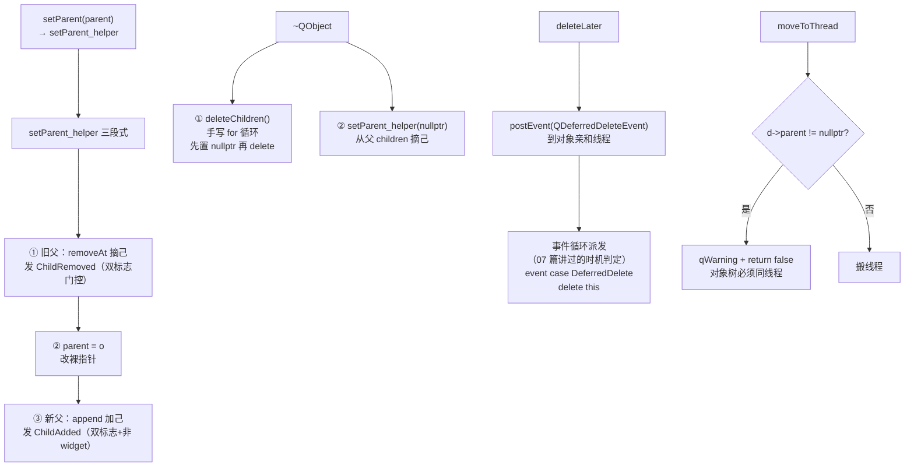

# 现代Qt开发教程（专家篇）1.21——对象树与所有权源码拆解

## 1. 前言——为什么对象树值得拆源码

咱们写 Qt 代码几乎每天都在依赖对象树：`new QLabel("hello", this)`——第二个参数 `this` 是 parent，往后咱们不用管这个 QLabel 的释放，因为它会跟着 `this` 一起被析构。笔者第一次用 Qt 的时候，觉得这套「交给 parent 管生命周期」的机制简直是黑魔法，写完 `new` 就不管了，代码居然不漏内存。这套机制是 QObject 设计的核心，但它背后有一堆值得追问的问题：`setParent` 到底改了什么？为什么析构 parent 会自动 delete 所有 children，而且不会出乱子？为什么 `moveToThread` 对一个有 parent 的对象会直接拒绝？`deleteLater` 和 `delete` 到底差在哪，为什么 Qt 要专门发明它？

这些问题，靠「parent 管理子对象生命周期」这种概括是答不全的。咱们要把对象树的所有权机制从源码里挖出来。这一篇把散落在前面几篇里的对象树相关线索集中讲透——[01 篇](./01-qobject-meta-system-expert.md) 咱们见过 `children` 字段存在 `QObjectData` 基类里、`children()` 内联返回它；[02 篇](./02-signal-slot-internals-expert.md) 咱们见过 `~QObject` 的两类连接清理；[07 篇](./07-event-loop-internals-expert.md) 咱们追过 `DeferredDelete` 事件的全链路。本篇把这些拼起来，专门拆「对象树的所有权是怎么建立、怎么销毁、怎么跨线程约束的」。

入门篇的 [QObject 与元对象系统](../../beginner/01-qtbase/01-qobject-meta-system-beginner.md) 讲过对象树和父子关系的基本用法——`new QObject(parent)`、`setParent`、parent 析构级联删子。那是知其然。本篇是知其所以然。

边界先划：本篇拆 `setParent` / 析构级联 `deleteChildren` / `deleteLater` / `moveToThread` 的线程亲和约束，以及 `QWidget` 走的 `willBeWidget` 快速分支。`QWidget` 特有的窗口系统部分（嵌入到父 widget 的窗口、销毁时的平台资源清理）不展开，咱们只到 `willBeWidget` 这个「控件构造时绕开普通 setParent」的分支点为止。

## 2. 环境说明

本篇所有源码引用基于 `qt_src/qt6.9.1`，行号可能随 Qt 版本升级而漂移，对照阅读时用函数名定位。

本篇涉及的源码文件（按出现顺序）：

| 文件 | 角色 |
|---|---|
| `qt_src/qt6.9.1/qtbase/src/corelib/kernel/qobject.cpp` | setParent / setParent_helper / deleteChildren / ~QObject / deleteLater / moveToThread / thread / protected 构造 |
| `qt_src/qt6.9.1/qtbase/src/corelib/kernel/qobject.h` | sendChildEvents / receiveChildEvents 位域（QObjectData 基类） |
| `qt_src/qt6.9.1/qtbase/src/corelib/kernel/qcoreapplication.cpp` | DeferredDelete 时机判定（与 07 篇对接） |
| `qt_src/qt6.9.1/qtbase/src/widgets/kernel/qwidget.cpp` | QWidgetPrivate 构造置 willBeWidget |

本篇无配套 example，原因：对象树所有权是 QObject 析构期的内部机制，对照 `qt_src` 翻源码就是最好的实验。

## 3. 核心概念讲解

先对路线图。对象树的所有权机制围绕「建立父子关系」和「析构级联」两条主线，中间穿插 `deleteLater` 的延迟删除和 `moveToThread` 的同线程约束：



咱们从「建立父子关系」开始。

### 3.1 setParent 与 setParent_helper——增删子 + ChildAdded/Removed 事件

`QObject::setParent` 这个公开方法本身几乎不干活，它把活儿全转手给了私有层的 `setParent_helper`：

`qt_src/qt6.9.1/qtbase/src/corelib/kernel/qobject.cpp:2206-2211`

```cpp
void QObject::setParent(QObject *parent)
{
    Q_D(QObject);
    Q_ASSERT(!d->isWidget);
    d->setParent_helper(parent);
}
```

注意那个 `Q_ASSERT(!d->isWidget)`——`setParent` 公开方法禁止 widget 走。widget 的父子关系有专门的快速路径（§3.6 的 `willBeWidget` 分支），不走这里。普通 QObject 才进 `setParent_helper`。

`setParent_helper` 是对象树所有权变更的核心，干的是经典的「三段式」：

`qt_src/qt6.9.1/qtbase/src/corelib/kernel/qobject.cpp:2230-2295`

```cpp
void QObjectPrivate::setParent_helper(QObject *o)
{
    Q_Q(QObject);
    if (o == parent)
        return;

    if (parent) {
        QObjectPrivate *parentD = parent->d_func();
        // ...（省略 isDeletingChildren / wasDeleted 防护分支）
        } else {
            parentD->children.removeAt(index);
            if (sendChildEvents && parentD->receiveChildEvents) {
                QChildEvent e(QEvent::ChildRemoved, q);
                QCoreApplication::sendEvent(parent, &e);
            }
        }
    }
    // ...
    parent = o;

    if (parent) {
        // ...
        parent->d_func()->children.append(q);
        if (sendChildEvents && parent->d_func()->receiveChildEvents) {
            if (!isWidget) {
                QChildEvent e(QEvent::ChildAdded, q);
                QCoreApplication::sendEvent(parent, &e);
            }
        }
    }
}
```

三段：第一段，如果旧 parent 存在，从旧 parent 的 `children` 列表 `removeAt` 摘掉自己，然后在「双标志门控」通过时给旧 parent 发一个 `ChildRemoved` 事件。第二段，`parent = o` 改裸指针——这一步是所有权变更的落点。第三段，如果新 parent 存在，把自己 `append` 进新 parent 的 `children` 列表，同样在双标志门控 + 非 widget 时给新 parent 发 `ChildAdded` 事件。

这里要特别讲那个「双标志门控」——`sendChildEvents && parentD->receiveChildEvents`。这两个标志是 1-bit 位域，存在 `QObjectData` 基类：

`qt_src/qt6.9.1/qtbase/src/corelib/kernel/qobject.h:80-81`

```cpp
    uint sendChildEvents : 1;
    uint receiveChildEvents : 1;
```

`sendChildEvents` 控制「我作为子对象，被加进/移出 parent 时，要不要给 parent 发事件」；`receiveChildEvents` 控制「我作为 parent，要不要接收 ChildAdded/ChildRemoved 事件」。两边都要开，事件才会发。默认两个都置 true（`QObjectPrivate` 构造时），所以普通对象都能收到 child 事件。但某些内部对象会关掉它们（比如 `QAbstractEventDispatcher` 这类不需要被通知 child 变化的），避免无意义的事件开销。这个双标志门控是对象树「事件通知」和「数据维护」分离的设计——`children` 列表的增删无论如何都会做，事件发不发是另一回事，由标志位控制。

### 3.2 析构级联——~QObject 先 deleteChildren 再摘己

理解了父子关系怎么建立，析构时就是反过来——而且顺序很讲究。`~QObject` 做两件事，顺序固定：

`qt_src/qt6.9.1/qtbase/src/corelib/kernel/qobject.cpp:1139-1148`

```cpp
    if (!d->children.isEmpty())
        d->deleteChildren();

    if (Q_UNLIKELY(qtHookData[QHooks::RemoveQObject]))
        reinterpret_cast<QHooks::RemoveQObjectCallback>(qtHookData[QHooks::RemoveQObject])(this);

    Q_TRACE(QObject_dtor, this);

    if (d->parent)        // remove it from parent object
        d->setParent_helper(nullptr);
```

先 `deleteChildren()` 删所有子对象，再 `setParent_helper(nullptr)` 把自己从父对象的 children 列表摘掉。这个顺序笔者一开始没料到——直觉上会想「先把自己从父摘掉，再处理孩子」更干净。但它不是随便定的。子先于父销毁，保证了一个对象析构时，它的整棵子树都已经清理干净，不会留下「父死了子还在」的孤儿。而把自己从父摘掉放在最后，是因为此时自己还在收尾，不能过早断开和父的关系（`deleteChildren` 过程中可能还需要通过 parent 访问一些东西）。

注意 `~QObject` 还做了 02 篇讲过的两类连接清理（那段在 `deleteChildren` 之前）——析构一个对象，顺序大致是：清连接（自己作为 sender 和 receiver 的所有连接）→ 删子对象 → 从父摘己。整个析构把对象在对象树、连接表、信号槽系统里的所有痕迹都抹干净。

### 3.3 deleteChildren 为什么不用 qDeleteAll——手写循环防 double-free

`deleteChildren` 这个函数有个反直觉的细节：它故意不用 `qDeleteAll`，而是手写一个索引 for 循环。原因写在注释里：

`qt_src/qt6.9.1/qtbase/src/corelib/kernel/qobject.cpp:2213-2228`

```cpp
void QObjectPrivate::deleteChildren()
{
    Q_ASSERT_X(!isDeletingChildren, "QObjectPrivate::deleteChildren()", "isDeletingChildren already set, did this function recurse?");
    isDeletingChildren = true;
    // delete children objects
    // don't use qDeleteAll as the destructor of the child might
    // delete siblings
    for (int i = 0; i < children.size(); ++i) {
        currentChildBeingDeleted = children.at(i);
        children[i] = nullptr;
        delete currentChildBeingDeleted;
    }
    children.clear();
    currentChildBeingDeleted = nullptr;
    isDeletingChildren = false;
}
```

注释逐字写着「don't use qDeleteAll as the destructor of the child might delete siblings」——子的析构函数可能会删掉它的兄弟。笔者第一次读到这句注释愣了一下，析构函数还能动兄弟？这听起来奇怪，但在 Qt 里很常见：假设子 A 的析构函数里有 `siblingB->deleteLater()` 或者直接操作了兄弟对象。如果用 `qDeleteAll`（它内部是 `for (auto &x : list) delete x`），A 的析构可能触发兄弟 B 被删，而 B 也在同一个 list 里，轮到遍历到 B 时就是 double-free。

Qt 的对策是手写索引循环，而且循环体有个关键设计——先把 `children[i]` 置 nullptr，再 `delete`：

`qt_src/qt6.9.1/qtbase/src/corelib/kernel/qobject.cpp:2213-2228`

```cpp
    for (int i = 0; i < children.size(); ++i) {
        currentChildBeingDeleted = children.at(i);
        children[i] = nullptr;
        delete currentChildBeingDeleted;
    }
```

先把这一项置 nullptr 再 delete。为什么？因为 `delete currentChildBeingDeleted` 会触发子对象的析构，而子对象的析构会走 §3.2 那套流程——子会调 `setParent_helper(nullptr)` 想把自己从父（也就是当前正在 deleteChildren 的这个对象）的 `children` 列表摘掉。如果摘除逻辑简单地 `removeAt(index)`，就会在循环遍历的 list 上动手脚，搞乱索引。先把该项置 nullptr，摘除逻辑（`setParent_helper` 里检查到这个 child 已经是 nullptr 或通过 `currentChildBeingDeleted` 判断）就能识别「这个子正在被父删，跳过」，安全地继续循环。笔者觉得这是个相当精巧的「析构期重入保护」——和 02 篇信号槽的 `highestConnectionId` 重入保护异曲同工。

开头还有个 `isDeletingChildren` 标志 + `Q_ASSERT_X` 防递归——`deleteChildren` 不该被递归调用（析构已经设了标志，子析构不会再次进入父的 deleteChildren）。这些都是为了应对「析构期间对象树被反向修改」的复杂情况。

### 3.4 deleteLater——投递一个 DeferredDelete

[07 篇](./07-event-loop-internals-expert.md) 咱们从「事件循环派发端」追过 `DeferredDelete` 全链路，本篇从「对象端」看 `deleteLater` 怎么投递这个事件。`deleteLater` 本质是把「删除自己」这件事推迟到事件循环的某个安全时机：

`qt_src/qt6.9.1/qtbase/src/corelib/kernel/qobject.cpp:2446-2500`

```cpp
void QObject::deleteLater()
{
    // ...
    Q_D(QObject);
    if (d->deleteLaterCalled)
        return;

    d->deleteLaterCalled = true;
    // ...
    auto *objectThreadData = eventListLocker.threadData;
    // ...
    QCoreApplication::postEvent(this,
        new QDeferredDeleteEvent(loopLevel, scopeLevel));
}
```

两件事。第一是去重——`if (d->deleteLaterCalled) return`，如果之前已经调过 `deleteLater`（标志已置位），直接返回，不会重复投递。这很重要：你可以在不确定的地方多次调 `deleteLater`，它只生效一次。第二是 `postEvent` 一个 `QDeferredDeleteEvent`——注意是投递到 `this` 自己的亲和线程（`objectThreadData`），事件带着当前的 `loopLevel`/`scopeLevel`（这两个层级用于 07 篇讲过的时机判定）。

为什么需要 `deleteLater` 而不是直接 `delete`？因为很多时候你是在「自己正被使用」的上下文里想销毁自己——比如在自己的槽函数里、在事件处理器里、在被别人遍历的列表里。直接 `delete this` 会让当前栈帧持有的 `this` 立刻失效，回到调用方就是 use-after-free。笔者在 §4 第一个坑会展开这点，这里先记住「想销毁自己，别裸 delete，投个 DeferredDelete」。`deleteLater` 把删除推迟到「当前事件处理完、回到事件循环」那一刻，那时谁都不再持有当前栈帧，`delete this`（07 篇的 `QObject::event case DeferredDelete`）才安全。这就是 `DeferredDelete` 三种时机判定（投递它的 event loop 已返回 / 当前 loop 显式请求 / 投递早于最外层 loop）要解决的问题——咱们在 07 篇详细讲过，这里不重复。

### 3.5 线程亲和——thread() 与 moveToThread 有父拒绝

对象树有一条铁律：一棵对象树必须同线程。这条铁律的源头在 `moveToThread`：

`qt_src/qt6.9.1/qtbase/src/corelib/kernel/qobject.cpp:1655-1698`

```cpp
    if (d->parent != nullptr) {
        qWarning("QObject::moveToThread: Cannot move objects with a parent");
        return false;
    }
    if (d->isWidget) {
        qWarning("QObject::moveToThread: Widgets cannot be moved to a new thread");
        return false;
    }
```

`moveToThread` 一进来就检查两件事：有 parent 直接拒绝（`Cannot move objects with a parent`），是 widget 直接拒绝（widget 不能搬线程）。有 parent 的对象不能搬线程——为什么？因为对象树的所有权依赖 parent 管理，如果子搬到别的线程，parent 析构时（在自己线程）要去 delete 别的线程的对象，这是跨线程析构，不安全。所以 Qt 强制：要搬线程，必须先把 parent 设成 nullptr（脱离对象树），或者搬整棵树的根（根搬了，子树跟着搬）。笔者第一次撞这个坑就是没开 warning 输出，对象没搬成还以为搬了，信号槽跨线程全乱套，调试了大半天——您千万别重蹈覆辙，搬线程前先确认对象没 parent。

线程亲和本身的查询很轻量：

`qt_src/qt6.9.1/qtbase/src/corelib/kernel/qobject.cpp:1610-1613`

```cpp
QThread *QObject::thread() const
{
    return d_func()->threadData.loadRelaxed()->thread.loadAcquire();
}
```

`thread()` 从私有数据的 `threadData` 原子读出所属 `QThread` 指针。这个 `threadData` 是 02 篇 `doActivate` 里判断 `receiverInSameThread` 时用的同一个东西——信号槽的跨线程分流、事件投递的目标线程、`moveToThread` 的约束，全部依赖这个线程亲和字段。对象树同线程的铁律，本质是为了让这套基于线程亲和的机制（信号槽跨线程、事件投递）在对象树上保持一致——如果父子不同线程，一个信号发出去，到底是按谁的线程分流？

### 3.6 QWidget 的快速分支——willBeWidget

最后一节讲一个优化细节。§3.1 看到 `setParent` 有个 `Q_ASSERT(!d->isWidget)`——widget 不走普通 setParent。那 widget 的父子关系怎么建立？通过一个 `willBeWidget` 快速分支，在 QObject 的 protected 构造里：

`qt_src/qt6.9.1/qtbase/src/corelib/kernel/qobject.cpp:960-968`

```cpp
            if (d->willBeWidget) {
                if (parent) {
                    d->parent = parent;
                    d->parent->d_func()->children.append(this);
                }
                // no events sent here, this is done at the end of the QWidget constructor
            } else {
                setParent(parent);
            }
```

如果 `willBeWidget` 标志为真（这个对象将是一个 widget），构造时直接裸写 `d->parent = parent` + `append` 进 parent 的 children 列表，完全绕开 `setParent_helper`——不发 `ChildAdded` 事件，不走双标志门控。注释说「no events sent here, this is done at the end of the QWidget constructor」——事件推迟到 QWidget 构造末尾再发。

为什么要这么优化？笔者一开始也纳闷——QObject 已经有完整的 `setParent_helper` 三段式了，widget 何必另起炉灶。原因在于 QWidget 的构造非常频繁（界面里控件动辄成百上千），而 widget 在构造阶段还没完全建好，发 `ChildAdded` 事件也没意义（parent 自己都还在构造）。走快速分支省掉了事件投递的开销和未就绪对象处理事件的风险。

`willBeWidget` 这个标志是跨模块置位的——它在 QtWidgets 模块里置位，给 QtCore 的 QObject 构造读：

`qt_src/qt6.9.1/qtbase/src/widgets/kernel/qwidget.cpp:182`

```cpp
    willBeWidget = true; // used in QObject's ctor
```

`QWidgetPrivate` 的构造体里直接 `willBeWidget = true`。于是当 `QWidget` 构造走到 QObject 的 protected 构造时，`willBeWidget` 已经是真，走快速分支。这是一个「上层模块（Widgets）反向告诉下层模块（Core）走特殊路径」的跨模块协作——`willBeWidget` 这个标志名本身就是给 QObject 构造看的（注释「used in QObject's ctor」直说了）。

## 4. 踩坑预防

第一个坑是在析构期间访问兄弟对象。§3.3 看了 `deleteChildren` 的源码，那个「故意不用 qDeleteAll，因为子的析构可能删掉兄弟」的注释正是为这个坑准备的。考虑场景：parent 析构，`deleteChildren` 正在逐个 delete 子对象，子 A 的析构函数里你写了 `if (siblingB) siblingB->doSomething()`——但 siblingB 可能已经被 `deleteChildren` 在 A 之前 delete 了（B 在 children 列表里排在 A 前面），此时 `siblingB` 是悬垂指针，访问就 use-after-free。后果是看似随机的崩溃，而且因为析构顺序取决于 children 列表顺序（取决于 setParent 调用顺序），问题时有时无，极难复现。解法：对象的析构函数里绝对不要去访问兄弟对象——析构时你只能确定自己正在销毁，兄弟可能已经没了。如果确实需要在析构时和兄弟交互，用 `QPointer<QObject>` 持有兄弟（它能安全检测对方是否已析构），或者重新设计让对象树关系不要太紧密耦合。

第二个坑是给一个有 parent 的对象调 `moveToThread`。§3.5 的源码写得很清楚——`if (d->parent != nullptr)` 直接 `qWarning` + `return false`，对象根本没搬成功。后果是：你以为对象搬到了 worker 线程，结果它还在原线程（信号槽跨线程分流没按预期、事件投递到错的线程），而程序只给一句 warning（很多人不开 warning 输出），定位起来很费劲。原因在于对象树同线程铁律——parent 还管着这个对象，搬走会导致跨线程析构和线程亲和不一致。解法：要搬一个对象到别的线程，先 `setParent(nullptr)` 让它脱离父（变成独立树根），再 `moveToThread`；或者直接搬整棵子树的根 parent（根搬了，所有子跟着搬，树内线程关系一致）。widget 则根本不能搬线程（`isWidget` 也会被拒）。

第三个坑是对象树管理和手动 delete 混用导致 double-free。笔者把这个坑放在最后讲，是因为它最隐蔽——这是新手最容易踩的。一个子对象既被 parent 纳入对象树（`new Child(parent)` 或 `child->setParent(parent)`），您又在某处手动 `delete child`。表面看没事——`delete child` 触发 `~Child`，`~QObject` 走 §3.2 流程，其中 `setParent_helper(nullptr)` 会把自己从 parent 的 children 列表摘掉。摘掉之后，parent 析构时 `deleteChildren` 就不会再来 delete 它，看起来安全。但问题出在时序：如果你手动 `delete child` 和 parent 析构并发，或者 child 的析构过程中 parent 也在析构（§3.3 的重入场景），摘除和 deleteChildren 的顺序就可能错乱，导致 parent 的 children 列表里还残留已 delete 的指针，最终 double-free。更常见的情况是：你 delete 了 child，但忘了它还被 parent 管着，parent 后来析构时又 delete 一次。解法很干脆：对象一旦交给对象树（设了 parent），就不要再手动 delete——要么完全交给对象树管（让 parent 析构级联删），要么先 `setParent(nullptr)` 脱离树再手动管理。两者混用迟早出问题。需要「稍后删除」就用 `deleteLater`（§3.4），它和对象树是兼容的。

## 5. 官方文档参考链接

[Qt 文档 · QObject](https://doc.qt.io/qt-6/qobject.html) -- setParent / deleteLater / moveToThread / thread 的官方文档

[Qt 文档 · Object Trees & Ownership](https://doc.qt.io/qt-6/objecttrees.html) -- 对象树与所有权机制总览，parent/child 关系与析构级联

---

到这里，QObject 对象树的所有权机制咱们就从源码层面拆透了。咱们看到了 `setParent` 把活儿全转给 `setParent_helper` 的三段式（旧父摘除发 ChildRemoved / 改裸指针 / 新父 append 发 ChildAdded），以及那个控制事件通知的双标志门控；看清了 `~QObject` 先 `deleteChildren` 再从父摘己的固定顺序，以及 `deleteChildren` 为什么故意不用 qDeleteAll 而手写循环（防子的析构删兄弟导致 double-free），还有它「先置 nullptr 再 delete」的精巧重入保护；从对象端追了 `deleteLater` 的去重与 DeferredDelete 投递，和 07 篇的事件循环派发端接上；拆了 `moveToThread` 有父直接拒绝的对象树同线程铁律；最后看了 `QWidget` 用 `willBeWidget` 跨模块告诉 QObject 构造走快速分支的优化。对象树是 Qt 管理生命周期的地基，理解了这套机制，你写 Qt 代码时对「谁负责删谁」「这个对象能不能搬线程」「析构时为什么不能碰兄弟」这些判断都会笃定得多。

本篇涉及的所有行号证据已按源码机制归类收在 [code-index · qtbase](../code-index/qtbase/) 下，带着行号直接去 `qt_src/qt6.9.1` 翻原文就能核对。
